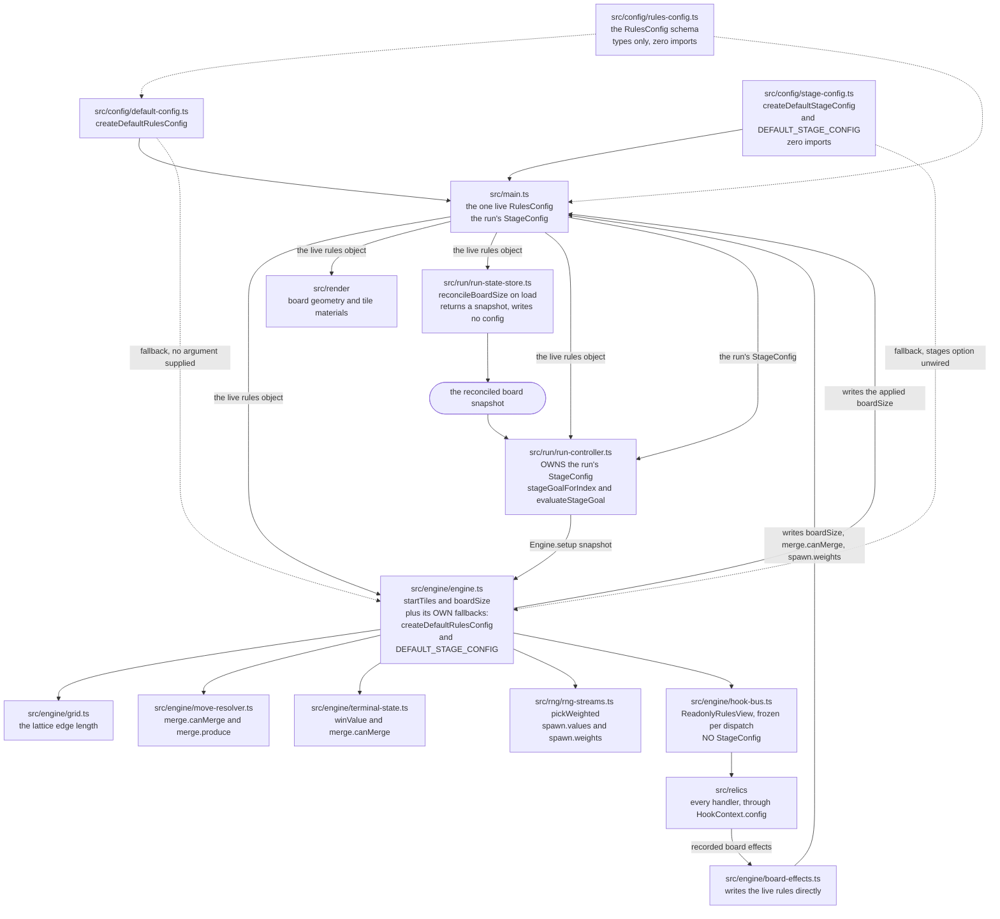

# Configuration Reference

The game's rules are not literals in the engine. They are values on two
configuration objects: a `RulesConfig`, declared by `src/config/rules-config.ts`
and populated by `src/config/default-config.ts`, and a `StageConfig`, declared
and populated by `src/config/stage-config.ts`.

The two are **owned differently**, and [1](#1-how-a-configured-value-reaches-its-readers)
is the section to read before assuming otherwise. The rules object is shared: in
a composed application `src/main.ts` builds one and hands that same object to
everything that reads a rule, relics included. The stage configuration is not
shared that way: the run controller owns the one the run is played against, and
the engine holds a fallback of its own.

This document is the reference for those three modules. It states what each one
declares, what every default value is and which line of the retired `js/`
sources it came from, how a value reaches the code that reads it, and what to
edit to change a rule without breaking something else.

It does not argue any of it. Rationale lives in
[`docs/DECISION_LOG.md`](DECISION_LOG.md) and nowhere else, and this document
cites it by identifier — `DL-CONFIG-02`, `DL-STAGE-03` and so on — wherever a
reader would otherwise ask why. That division is itself recorded, as
`DL-DOC-05`. Where a statement below is a mechanical consequence of the code, it
is stated outright; where it is a choice that could reasonably have gone another
way, the identifier is the answer.

**Figure numbering in this document is local to it.** Its one figure is
`Figure C1`. The unprefixed Figures 1 through 8 belong to `docs/architecture/`
and `docs/TRACEABILITY_MATRIX.md`; none of them is reproduced here, so a
reference to one of those numbers is a reference into those documents and never
into this one.

## Contents

- [1. How a configured value reaches its readers](#1-how-a-configured-value-reaches-its-readers)
- [2. The rules schema](#2-the-rules-schema)
- [3. The vanilla-equivalent defaults](#3-the-vanilla-equivalent-defaults)
- [4. The stage configuration](#4-the-stage-configuration)
- [5. Changing a rule safely](#5-changing-a-rule-safely)
- [6. Where to look next](#6-where-to-look-next)

## 1. How a configured value reaches its readers

The composed application holds exactly one MUTABLE `RulesConfig` and one
`StageConfig`. `src/main.ts` builds both — `createDefaultRulesConfig()` and
`createDefaultStageConfig()` — and hands the same two objects to everything that
needs them, so a relic that changes `boardSize` changes the object every reader
already holds. Figure C1 is the map of that distribution, from the two factories
through the composition root to each reader, and back again along the two paths
that write.

**No other composition calls either factory**, and the two call sites outside
the root exist for reasons that do not create a second live pair:

- `Engine`'s constructor calls `createDefaultRulesConfig()` as its own fallback
  when no `config` is injected, so an engine built standalone — in a suite, or
  in a harness — still has rules. When the root injects a config, that
  fallback is never evaluated.
- `src/config/default-config.ts` and `src/config/stage-config.ts` each call
  their own factory once at module scope to build the deep-frozen `DEFAULT_*`
  constant beside it. Those constants are references for comparison, not the
  live objects, and the calls are marked `/* @__PURE__ */` so the bundler can
  drop them.

A suite may of course call a factory per test; each call returns a fresh
mutable object, which is the point of a factory rather than a shared singleton.

Two other configuration objects exist, and neither is a second live one:

- **The frozen templates.** `default-config.ts` exports `DEFAULT_RULES_CONFIG`
  and `stage-config.ts` exports `DEFAULT_STAGE_CONFIG`, each deep-frozen at
  module scope. They are a reference to compare against and a safe default to
  share, never a configuration in force: a write to either throws in strict
  mode, which is what stops one being adopted as the live object by accident.
- **The engine's own fallbacks.** `EngineOptions` defaults every member but
  `streams`, so `new Engine({ streams })` calls `createDefaultRulesConfig()` for
  itself, adopts the frozen `DEFAULT_STAGE_CONFIG` for `stages`, and plays a
  complete vanilla game. Most suites that exercise the engine in isolation take
  one or both of those paths, passing a `config` or a `stages` only where the
  test needs a value other than the default.

The rules fallback does not run in the composed application. `src/main.ts`
passes its live `RulesConfig` to the engine, to the run-state store and to the
run controller, so every one of them reads the one object.

The **stage** fallback does run, and knowing where matters. Three readers
default to the frozen `DEFAULT_STAGE_CONFIG` when they are not given one —
`Engine`, `RunController` and the run-summary screen — and `src/main.ts` passes
its live `StageConfig` to `RunController` alone, because the controller is the
owner of stage progression. The other two therefore hold the frozen template:

- `Engine` reads it in exactly one place. `goalInForce()` consults
  `stageGoalForIndex` only when the injected stage context supplies a NEUTRAL
  goal, and in the composed application that context is
  `RunController.stageContext()`, which carries a real goal — so the template is
  never consulted there. It is the fallback for an engine composed without a
  stage owner.
- The run-summary screen reads it only to derive the goal for a stage the run
  port does not agree it is showing, which is the second tier of
  `DL-SUMMARY-06`'s rule.

Because both hold the template rather than a copy, a caller that needs a mutable
stage configuration passes `createDefaultStageConfig()` explicitly; a write to
the template throws.

### Figure C1 — Distribution of the Live Rules and Stage Configuration, from the Factories to Every Reader



**Legend for Figure C1.** A **solid arrow** carries a configuration object, one
of its members, or a value derived from one, to code that reads it; the arrow
points the way the value travels, and a label names what travels where that is
not obvious. A **dotted arrow** is either a type-only import — which contributes
nothing to the running bundle — or a **fallback the module reaches for only when
the composition supplied nothing**, which is the case for both dotted arrows into
`src/engine/engine.ts`. The **rounded node** is not a module: it is the
reconciled board snapshot, drawn as a value because that is what the store
produces and hands on.

The two labelled arrows returning to `src/main.ts` are the only paths that
*write* to the live objects, and both write the same object the readers hold
rather than replacing it: `src/engine/board-effects.ts` applies a relic's
recorded effects, and `src/engine/engine.ts` writes the reconciled edge length
from `setup()`. **`src/run/run-state-store.ts` writes no rules at all**: it
reconciles the saved board — weighing the relic-implied size, then the
configured size, then the size the snapshot carried — and hands back the
reconciled snapshot, which is why it is drawn producing a value rather than
writing one. `src/run/run-controller.ts` opens the engine on that board, and
`Engine.setup()` is what adopts its edge length into the live rules, so the
board size reaches the rules *through* two modules rather than directly. That
is exactly why the reconciliation can be decided before any lattice is
allocated.

`src/engine/hook-bus.ts` is drawn between the engine and the relics rather than
beside them, since a handler never touches the live `RulesConfig` — it reads a
frozen `ReadonlyRulesView` the bus builds per dispatch, and writes by recording
effects.

**The two arrows that write to the live rules object** are the ones returning to
`src/main.ts`, and neither replaces the object the readers hold — both write into
it:

- `src/engine/board-effects.ts` applies a relic's recorded effects, writing
  `boardSize`, `merge.canMerge` or `spawn.weights`.
- `src/engine/engine.ts` writes the **applied board size** during `setup()`. This
  is the whole write-back path for reconciliation, and it is worth following
  precisely because it is easy to attribute to the wrong module:
  `src/run/run-state-store.ts` **reconciles and returns a snapshot — it writes no
  configuration at all**; `src/run/run-controller.ts` passes that snapshot to
  `Engine.setup()`; `setup()` rebuilds the lattice from the snapshot's size and,
  where that differs from `config.boardSize`, assigns it and counts the
  reconciliation. Every later read — the traversals, the win test, the loss probe
  — then sees the size the lattice actually has.

Four further properties of Figure C1 are worth stating, since each answers a
question a reader arrives with.

- **Nothing hoists a value.** Every reader in the figure reads its member at the
  moment it needs it. `boardSize` in particular changes during a run, so a copy
  taken at load is stale by the time it matters. Decisions `DL-CONFIG-02` and
  `DL-TERM-03`.
- **The arrows out of the config modules are one-way.** `rules-config.ts` and
  `stage-config.ts` import nothing at all, and `default-config.ts` imports only
  types from `rules-config.ts`. No configuration module names the engine, the
  renderer, the run layer or the relics.
- **The relic path is a loop, not a branch.** A relic reads the rules through
  the bus and changes them through the effect queue, which writes the live
  object every other reader already holds. That is how a relic's change to
  `merge.canMerge` becomes visible to the loss probe without either side knowing
  about the other. Note what does **not** travel that path: the bus builds no
  stage configuration, so no relic can read or change the curve.
- **The stage configuration reaches the run controller and stops there.** The
  engine's own stage arrow is the dotted fallback, not the root's object, so
  there are two stage configurations in a running application that happen to
  hold equal values.

## 2. The rules schema

`src/config/rules-config.ts` declares the schema and nothing else. It holds no
runtime binding, performs no work at load, touches no DOM and no Web Storage,
and contributes nothing to the emitted bundle — consumers reach it with
`import type`. **It imports nothing.** The values that populate a `RulesConfig`
live in `src/config/default-config.ts`.

### 2.1 `RulesConfig`

`RulesConfig` has **exactly five members**. That count is a contract, not a
coincidence: `ReadonlyRulesView` in `src/engine/hooks.ts` mirrors the five
member for member, and adding a sixth is a change to the hook contract and to
every exhaustive consumer of it — a code change, not a configuration change.

| Member | Type | What it governs | What goes wrong when it is wrong |
|---|---|---|---|
| `boardSize` | `number` | Edge length of the square board, in cells. A positive integer. Drives the `size` by `size` lattice `src/engine/grid.ts` allocates, the traversal orders and bounds valve of `src/engine/move-resolver.ts`, the neighbour probe of `src/engine/terminal-state.ts`, the renderer's instanced blocks and the per-cell counterparts of the parallel accessibility layer. | Two different paths, and they must not be confused. On a **fresh** board `Engine.setup()` measures `config.boardSize` with `isSupportedBoardSize` and allocates at `DEFAULT_BOARD_SIZE` where it fails, writing that fallback onto the live config and counting `engine.board.reconciled`. On a **restored** board the size is not this member's at all: it is whatever `reconcileBoardSize()` selected from the relic, configured and saved candidates — see [3.2](#32-the-board-size-hierarchy-read-this-before-changing-4) — which can legitimately be a non-default edge length, and `setup()` writes *that* back. A value merely *larger than the board actually built* is the damaging case either way: win and loss evaluation would probe cells the lattice does not have. The size is therefore reconciled once, before any grid is constructed — `DL-RUNSTORE-01`. |
| `winValue` | `number` | Tile value that wins the game. A positive integer. Read by `isWinningMergeValue` and `hasReachedWinValue` in `src/engine/terminal-state.ts`, and by both renderers as the fallback threshold above which a tile takes the `tile-super` treatment. | The win test is **strict equality**, not a threshold, so a `winValue` no produced value lands on exactly is never reached and the run has no win state. Under the default doubling producer a tile passes exactly through every power of two; a relic that adds to a produced value can step over a `winValue` between two of them. Decision `DL-TERM-02`. |
| `startTiles` | `number` | How many tiles are inserted when a stage's board is built fresh. A non-negative integer — **the integer part is an invariant you maintain, not one the type enforces**. The loop bound of the engine's `addStartTiles`. | `0` opens an empty board. A count above the number of cells is not an error: each attempt past a full board is suppressed, counted under `engine.spawn.suppressed`, and consumes no randomness. The loop is `for (index = 0; index < startTiles; index += 1)`, so a **positive fraction rounds UP** — `2.5` runs three attempts, because `2 < 2.5` still holds — while a negative count, `0` and `NaN` all fail the condition on the first iteration and insert nothing. |
| `spawn` | `SpawnDistribution` | The distribution every spawned tile's value is drawn from. | Covered in [2.2](#22-spawndistribution): the failure is silent rather than loud. |
| `merge` | `MergeRules` | Which pairs merge, and what value a merge yields. | Covered in [2.3](#23-mergerules-mergepredicate-and-mergeproducer): the predicate governs loss detection as well as merging, so a change to it moves both. |

Every member is declared **mutable**, and every consumer reads it afresh at each
use rather than capturing it. Decision `DL-CONFIG-02`.

### 2.2 `SpawnDistribution`

```ts
interface SpawnDistribution {
  values: number[];
  weights: number[];
}
```

The two arrays are **positionally paired**: `weights[i]` is the RELATIVE weight
of `values[i]` — a share of the total, not a probability, because the total is
whatever the array sums to. Index order is the order the selection walk visits
them, and it is not reversed anywhere.

Selection is one draw per spawn, taken from the `spawn-value` substream and
resolved by `pickWeighted` in `src/rng/rng-streams.ts`. The draw is scaled by
the total of the weights, the weights are then walked in index order
accumulating a running total, and the first index whose running total exceeds
the scaled draw selects the value. Two consequences follow from that
arithmetic:

- **The weights need not sum to 1.** They are normalised by their own total, so
  `[9, 1]` and `[0.9, 0.1]` select identically.
- **One spawn costs exactly one draw**, never one per candidate, whatever the
  length of the arrays.

A **length mismatch is refused, and the refusal is quiet.** `pickWeighted`
rejects the shapes no selection can be made from — an empty `values`, arrays of
unequal length, a negative or non-finite weight, or weights totalling zero or
less — by returning nothing and **consuming no draw**, so the substream's cursor
is untouched. The engine's spawn then falls back to the value `2`. That fallback
is `FALLBACK_SPAWN_VALUE`, a constant declared in `src/engine/engine.ts` and
applied explicitly as `drawn ?? FALLBACK_SPAWN_VALUE` at both spawn sites — it is
the engine's own decision, not an emergent one. The pre-migration analogue is
`js/tile.js` L4, which guaranteed the same floor by coercing a falsy tile value,
and that is legacy provenance rather than the mechanism in force. Nothing throws
and nothing is logged as an error: a run with mismatched arrays keeps playing and
spawns nothing but `2`s. Treat equal lengths as an invariant you maintain, not one
the type system enforces for you — `number[]` and `number[]` carry no
relationship.

**Two different lists, and the difference is the point.** What `pickWeighted`
*enforces* is narrower than what the module *recommends*:

| | Constraint | Status |
|---|---|---|
| 1 | `values` non-empty | **Enforced.** An empty `values` yields no selection. |
| 2 | `values.length === weights.length` | **Enforced.** An unequal pair yields no selection. |
| 3 | Every weight finite and at least `0` | **Enforced.** A negative or non-finite weight yields no selection. |
| 4 | The weights total more than `0` | **Enforced.** A total of zero or less yields no selection. |
| 5 | Every value a positive integer | **Not enforced.** A non-integer or negative value is selected and spawned as it stands. |
| 6 | The weights sum to `1` | **Not enforced, and not required.** The draw is scaled by the weights' own total, so `[9, 1]` and `[0.9, 0.1]` select identically. |

Rows 1 to 4 are the selection constraints: violate one and `pickWeighted` refuses
and the spawn falls back to `2`. Rows 5 and 6 are conventions of the **shipped
defaults** rather than requirements — the defaults are integers summing to `1`
because that is the clearest way to write the vanilla distribution, and a
contributor is recommended to keep both properties for readability. Neither is
checked, and row 6 in particular is **not** an invariant: normalising your weights
changes nothing about which value is drawn.

### 2.3 `MergeRules`, `MergePredicate` and `MergeProducer`

```ts
type MergePredicate = (moving: MergeTileView, target: MergeTileView) => boolean;
type MergeProducer  = (moving: MergeTileView, target: MergeTileView) => number;

interface MergeRules {
  canMerge: MergePredicate;
  produce: MergeProducer;
}
```

The merge rule is a **pair**: `canMerge` decides whether a moving tile merges
into the tile it has run into, and `produce` computes the face value the merge
yields. Either can be replaced or wrapped independently, so the effective merge
rule of a run is readable off this one object. Decision `DL-CONFIG-01`.

What each half is responsible for, and what it is not:

- `canMerge` returns a verdict and mutates neither operand. `moving` is the tile
  that travelled; `target` is the tile it ran into. The argument order at the
  call site is `config.merge.canMerge(tile, next)`.
- `produce` is called **only** for a pair `canMerge` has already accepted. It
  returns a face value and constructs nothing — the engine builds the resulting
  tile.
- **There is no separate score rule.** The engine adds the produced value to the
  score, so replacing `produce` changes scoring with it. A score adjustment that
  must be independent of the produced value is made through the `scoreDelta`
  member of the `onMerge` hook payload, which is a separate member from
  `resultValue`. Decision `DL-MERGE-02`.

Two properties of this pair catch people out.

**`canMerge` also decides when the run is lost.** `movesAvailable` in
`src/engine/terminal-state.ts` probes each tile's neighbours through
`config.merge.canMerge` rather than through an equality test of its own, so a
more permissive predicate postpones the loss and a stricter one brings it
forward. Both operands reach the predicate as frozen `probeView` projections
carrying the face value and a `mergedFrom` fixed to `null`. Decisions
`DL-TERM-04` and `DL-TERM-03`.

**Nothing checks that the two halves agree.** A predicate that accepts a pair
whose producer cannot compute a sensible value for it is representable, and no
code rejects it. Recorded as the risk of `DL-CONFIG-01`.

### 2.4 `MergeTileView`, and why neither half needs a null check

```ts
interface MergeTileView {
  readonly value: number;
  readonly mergedFrom: readonly unknown[] | null;
}
```

`MergeTileView` is a **minimal structural operand type declared locally in the
configuration module**. It names the two members the merge rules read — a face
value, and the presence or absence of merge history — and nothing else. Both are
`readonly`: a predicate and a producer read their operands and mutate neither.

`Tile` from `src/engine/tile.ts` satisfies `MergeTileView` structurally, so
`config.merge.canMerge` accepts a real tile with **no import in either
direction** between the configuration modules and the engine — which is what
keeps Figure C1's arrows one-way. `mergedFrom` is typed
`readonly unknown[] | null` rather than `Tile[] | null`, and is read for
presence, never for contents. Decision `DL-CONFIG-03`.

**The existence guard lives outside the predicate.** The pre-migration merge
condition was one expression at `js/game_manager.js` L156:

```js
if (next && next.value === tile.value && !next.mergedFrom) {
```

That expression is split, and both halves are load-bearing. The `next &&` half stays
in `src/engine/move-resolver.ts`, which reads:

```ts
if (next && config.merge.canMerge(tile, next)) {
  const produced = config.merge.produce(tile, next);
```

The two remaining tests are the configured predicate. `MergePredicate` therefore
declares `target` as non-nullable and means it: **a replacement `canMerge` never
receives a missing target and never needs to null-check its operands.** The walk
that produces `next` may address a cell outside the lattice, where
`Grid.cellContent` reads as empty — the resolver absorbs that case, not the
predicate. Decision `DL-MOVE-01`.

## 3. The vanilla-equivalent defaults

`src/config/default-config.ts` populates a `RulesConfig` with values chosen to
reproduce the pre-migration game exactly, so the first delivery phase plays
move for move like classic 2048 and the seeded snapshot suite can compare
against classic board sequences. No value is retuned and no rule is declared
that the original did not have. Decision `DL-DEFAULT-01`.

### 3.1 The six defaults and where each came from

| Default | Value | Provenance in the retired sources | Notes |
|---|---|---|---|
| `boardSize` | `4` | `js/application.js` L3 — the literal argument of `new GameManager(4, KeyboardInputManager, HTMLActuator, LocalStorageManager)` | Exported as `DEFAULT_BOARD_SIZE`. Supersedes three former declaration sites; see [3.2](#32-the-board-size-hierarchy-read-this-before-changing-4). |
| `winValue` | `2048` | `js/game_manager.js` L170 — `if (merged.value === 2048) self.won = true;` | Module-private. The comparison itself moved to `src/engine/terminal-state.ts`, which reads `config.winValue` at call time rather than capturing a constant. |
| `startTiles` | `2` | `js/game_manager.js` L7 — `this.startTiles = 2;` | Module-private. Read by the engine's `addStartTiles` as its loop bound. |
| `spawn.values` | `[2, 4]` | `js/game_manager.js` L71 — `var value = Math.random() < 0.9 ? 2 : 4;` | Module-private, copied into each config by `slice()`. |
| `spawn.weights` | `[0.9, 0.1]` | the same expression at `js/game_manager.js` L71 | The two total exactly `1`, so one draw selects `2` below `0.9` and `4` otherwise — the original two-outcome branch exactly. |
| `merge.canMerge` | equal value **and** target not already merged this turn | `js/game_manager.js` L156 — `next.value === tile.value && !next.mergedFrom`, less the `next &&` guard | Exported as `defaultCanMerge`. |
| `merge.produce` | the moving tile's value × 2 | `js/game_manager.js` L157 — `new Tile(positions.next, tile.value * 2)` | Exported as `defaultProduceMergeValue`. Its second parameter is unused and is named `_target`. |

`spawn.values` and `spawn.weights` together are a **complete** description of the
game's stochastic behaviour, not a partial one. The pre-migration sources
contained exactly two calls to `Math.random()` — the value at
`js/game_manager.js` L71 and the position at `js/grid.js` L41 — and the position
draw selects uniformly among the empty cells, with no distribution to configure.
Both call sites are now substreams: the value is drawn from `spawn-value` and
the cell from `spawn-position`, and the value is drawn before the cell, which is
the order the two original call sites were reached in.
The substream figure is `Figure 7` of
[`docs/architecture/data-flow.md`](architecture/data-flow.md); it is not
duplicated here.

### 3.2 The board-size hierarchy: read this before changing 4

The board dimension used to be declared in **three independent places**, and
only one of the three is authoritative now. The hierarchy:

| Former declaration site | What replaced it | Is it the authority? |
|---|---|---|
| `js/application.js` L3 — the literal `4` handed to `new GameManager(...)` | `DEFAULT_BOARD_SIZE` in `src/config/default-config.ts`, which populates `RulesConfig.boardSize` | **`RulesConfig.boardSize` on the live config is the authority for the game rule.** `DEFAULT_BOARD_SIZE` is only its starting value. |
| `style/main.scss` L6 — `$grid-row-cells: 4` | `gridRowCells` in `src/theme/tokens.ts`, mirrored back into the stylesheet through the token projection | **No.** It mirrors the dimension *presentationally*. |
| `index.html` L43-L68 — sixteen hardcoded `.grid-cell` elements | Nothing; the board is generated by the renderer from the configured size | **No.** It no longer exists. |

The distinction between the first two rows is the one that matters in practice.

- **`RulesConfig.boardSize` drives the rules.** It is what the lattice is
  allocated from, what the traversals iterate over, and what the win and loss
  evaluations bound their probes by. It is **mutable and live**: a
  board-mutating cursed relic changes it mid-run through the effect queue, and
  `reconcileBoardSize()` in `src/run/run-state-store.ts` reconciles it on load
  from three candidates in this order: **the size an active board-mutating relic
  implies, then the configured size, then the size the saved envelope carries**,
  with a fallback edge length where none of the three is usable. Read that order
  carefully — the configured size outranks the save, so a snapshot recorded at a
  different `boardSize` does not override the rules the running build plays by.
  The store returns a reconciled snapshot and writes no configuration; the applied
  size reaches the live object when `Engine.setup()` assigns it. Decisions
  `DL-CONFIG-02` and `DL-RUNSTORE-01`.
- **`gridRowCells` mirrors it for layout.** `src/theme/tokens.ts` declares
  `export const gridRowCells = DEFAULT_BOARD_SIZE` and derives `tileSize` from
  it, and `vite.config.ts` passes the token projection to Dart Sass so
  `style/_tokens.scss` resolves the same number. It is a **module-scope
  constant**: it takes the *default* and therefore does **not** follow a mid-run
  mutation of `config.boardSize`. Decisions `DL-TOKEN-02` and `DL-BUILD-03`.

So: to change the dimension the game is played at, change the configuration. To
change the dimension the stylesheet lays out for, you are looking at the token
layer — and the two are only equal while no board-mutating relic is active.

### 3.3 The factory, the frozen template, and the two named merge functions

`src/config/default-config.ts` exports nine identifiers.

| Export | Kind | What it is |
|---|---|---|
| `createDefaultRulesConfig()` | function | Builds a **freshly allocated, unfrozen** `RulesConfig` on every call, sharing no object with `DEFAULT_RULES_CONFIG` or with any earlier return value — not the config, not its `spawn`, not either spawn array, not its `merge`. The two merge members hold no state and are shared rather than copied. |
| `DEFAULT_RULES_CONFIG` | constant | The same values, **deep-frozen**: both spawn arrays, `spawn`, `merge` and the object itself. No consumer can mutate it. |
| `defaultCanMerge` | function | The default `MergePredicate`: `moving.value === target.value && !target.mergedFrom`. |
| `defaultProduceMergeValue` | function | The default `MergeProducer`: `moving.value * 2`. |
| `DEFAULT_BOARD_SIZE` | constant | `4`. The starting value of `RulesConfig.boardSize`, and the value `src/theme/tokens.ts` mirrors. |
| `MAX_BOARD_SIZE` | constant | `16`. The one board-edge ceiling every allocating module measures a candidate against, so an edge cannot be accepted by one module and refused by another. Decision `DL-DEFAULT-02`. |
| `isSupportedBoardSize(value)` | type guard | Pure, total and accepts `unknown`: `true` only for a positive safe integer at or below `MAX_BOARD_SIZE`. Rejects `NaN`, both infinities, fractions, negatives, zero, magnitudes beyond the safe-integer range and every non-number. Candidate edges arrive from persisted JSON, from a `state:commit` payload and from a cursed relic's state slot, so this is the single gate they pass through. |
| `snapshotRulesConfig(config)` | function | Takes the run's baseline: a **freshly allocated, unfrozen** copy with its own `spawn`, its own two spawn arrays and its own `merge`, holding the SAME two merge function references the live config holds. Reads `config` and writes nothing, so a baseline taken at composition survives every later mutation of the live object. |
| `restoreRulesConfig(target, baseline)` | function | Writes every mutable member of the LIVE object back to the baseline's values **in place** — through the same `target`, the same `target.spawn` and the same `target.merge` — replacing the two spawn arrays with fresh copies of the baseline's, and returns `target`. The three members a relic effect can write (`boardSize`, `merge.canMerge`, `spawn.weights`) are all returned. Decision `DL-DEFAULT-04`. |

Both merge functions are named exports, not anonymous expressions buried in the
factory. The practical consequence is that a relic can **wrap or substitute**
them: a wrapper that falls through to `defaultCanMerge` for the pairs it does not
care about needs a reference to hold. `src/relics/families/merge-magic.ts` is the
**only** family module that imports `src/config/default-config.ts`, and those two
functions are the only things it imports from there; `spawn-control.ts`,
`board-manipulation.ts` and `risk-reward-cursed.ts` import nothing from
`src/config/` at all.

#### A usage rule: do not cache the factory's result

`createDefaultRulesConfig()` returns a fresh object per call. Decision
`DL-DEFAULT-03` records why; what a caller has to do about it is a rule rather
than a rationale, so it is stated here:

> **Build the config once at composition and pass that object around. Never
> hoist a member of it into a module-scope constant, and never treat a second
> call's return value as the same rules as the first.**

Two mechanical consequences drive the rule:

1. **A board-mutating cursed relic writes `boardSize` on the live config** and
   leaves it changed for the rest of the run. A member copied at load is stale
   from that moment on, and a second config built later starts from `4` again.
2. **A caller that hoards a config and a caller that re-reads one will disagree
   after any mutation**, and neither is detectably wrong. Recorded as the risk
   of `DL-DEFAULT-03`.

`DEFAULT_RULES_CONFIG` is the safe thing to compare against — it is frozen, so
it cannot have drifted — and it is what a test asserts the defaults have not
moved against.

## 4. The stage configuration

`src/config/stage-config.ts` declares stage goals and the progression curve.

**This layer has no vanilla analogue.** No construct in `js/game_manager.js`,
`js/grid.js` or `js/tile.js` resolved a stage, so there is no provenance to cite
for anything in this section — every row of it is target-only in
[`docs/TRACEABILITY_MATRIX.md`](TRACEABILITY_MATRIX.md).

**Which requirement it answers to.** Stage goals are not part of requirement R3:
R3 is the relic system — sixteen relics across four families bound to the six
hooks — and it says nothing about stages. A stage goal is **working assumption
A3**, which resolves the requirements' bare phrase "clears stage goal" into a
config-driven target evaluated against engine state, and it is a prerequisite of
the **R8** run flow, whose reward screen is reached by clearing one. Relics and
stage goals meet only at the `onStageStart` and `onStageEnd` hooks, and a relic
never receives the curve — see [1](#1-how-a-configured-value-reaches-its-readers).

Like `rules-config.ts`, this module **imports nothing**. It declares its own
minimal input type — `StageProgressInput`, two numbers — rather than importing
the engine's state types, which is what keeps Figure C1's arrows out of the
configuration layer one-way. It holds type declarations, frozen constants and
pure functions only: no DOM, no randomness, no I/O.

### 4.1 `StageGoal` and `StageGoalKind`

```ts
type StageGoalKind = 'highest-tile' | 'score-threshold';

type StageGoal =
  | { readonly kind: 'highest-tile';    readonly target: number }
  | { readonly kind: 'score-threshold'; readonly target: number };
```

A `StageGoal` is one stage's clear condition: a **discriminated union over
`kind`** with a numeric `target`. `switch (goal.kind)` narrows to one member, and
both switches in the module close their `default` on a `never` binding, so a kind
added later raises a compile error at every exhaustive consumer rather than
falling through. The two kinds are the whole goal vocabulary — decision
`DL-STAGE-01`.

`StageGoalKind` is exported as a standalone alias; the two variant interfaces are
not exported, so `StageGoal` is the only name to write against. The exact strings
`'highest-tile'` and `'score-threshold'` are what a persisted `stageGoal.kind`
holds and what `stage:start` carries.

#### The hard constraint: a goal must stay plain JSON

A `StageGoal` is persisted verbatim as the run-state envelope's `stageGoal`
field and is carried verbatim as the `goal` member of the `stage:start` payload.
It must therefore contain **no functions, no closures, no class instances and no
`undefined` members** — string and number members only. All behaviour lives in
the module's exported pure functions, keyed off the `kind` discriminant, never on
the goal object. Decision `DL-STAGE-03`.

Anyone extending the goal system needs this before adding a field, since the
type system does not enforce it:

- A value whose numbers are all **finite** round-trips through
  `JSON.parse(JSON.stringify(value))` deep-equal. The structural type also admits
  `NaN` and `Infinity`, which JSON does not preserve — a hand-built config keeps
  its numbers finite. Every value the module's factories produce satisfies this.
- The persisted shape is validated on load, not trusted: `src/run/run-state.ts`
  refuses a `stageGoal` that is not an object, whose `kind` is not one of the
  declared kinds, or whose `target` is not a finite number. It refuses rather
  than clamps — decision `DL-RUN-04` — and a persisted goal can outlive its own
  kind, so an unrecognised kind is treated as data the loader does not
  understand.

### 4.2 `StageConfig` and the progression curve

```ts
interface StageConfig {
  readonly ladder: readonly StageGoal[];
  readonly extension: {
    readonly kind: StageGoalKind;
    readonly baseTarget: number;
    readonly growthFactor: number;
    readonly maxTarget: number;
  };
}
```

`ladder` holds the explicit goals for stage indices `0` through
`ladder.length - 1`, in stage order. `extension` supplies every index at or
beyond that length, which is what makes goal derivation total over every
non-negative integer index — for any ladder length, including zero. The
`extension` object's own interface is module-private; write against
`StageConfig`.

`createDefaultStageConfig()` builds the default curve, freshly allocated and
unfrozen on every call and sharing no object with `DEFAULT_STAGE_CONFIG` or an
earlier return. `DEFAULT_STAGE_CONFIG` is the same curve frozen at every level:
the object, its `ladder`, each ladder entry and its `extension`.

**The default curve.** Every goal in it is of kind `'highest-tile'`.

| Stage index | Goal kind | Target | Source |
|---|---|---|---|
| 0 | `highest-tile` | 16 | explicit ladder entry |
| 1 | `highest-tile` | 32 | explicit ladder entry |
| 2 | `highest-tile` | 64 | explicit ladder entry |
| 3 | `highest-tile` | 128 | explicit ladder entry |
| 4 | `highest-tile` | 256 | explicit ladder entry |
| 5 | `highest-tile` | 512 | explicit ladder entry |
| 6 | `highest-tile` | 1024 | explicit ladder entry |
| 7 | `highest-tile` | 2048 | explicit ladder entry, the last one |
| 8 | `highest-tile` | 4096 | `extension.baseTarget` |
| 9 | `highest-tile` | 8192 | `baseTarget * growthFactor ** 1` |
| 10 | `highest-tile` | 16384 | `baseTarget * growthFactor ** 2` |
| 8 and above | `highest-tile` | see the formula below | `extension` |

So the ladder is eight strictly increasing steps of the tile ladder ending at
2048, and every stage after that is one further doubling. The extension
parameters are `kind: 'highest-tile'`, `baseTarget: 4096`, `growthFactor: 2` and
`maxTarget: 2 ** 52`, the largest power of two below
`Number.MAX_SAFE_INTEGER`.

The derived target for an index at or beyond the ladder's length is exactly:

```text
steps  = stageIndex - ladder.length
raw    = extension.baseTarget * extension.growthFactor ** steps
ceil   = min(max(0, extension.maxTarget), Number.MAX_SAFE_INTEGER)
target = round(max(0, min(raw, ceil)))
```

A non-finite `extension.maxTarget` uses `Number.MAX_SAFE_INTEGER` as `ceil`, and
a `raw` that overflowed to `Infinity` resolves to `ceil`.

### 4.3 `stageGoalForIndex(stageIndex, stageConfig)`

Derives the goal for one stage. `stageIndex` is **zero-based**: index `0` is a
run's first stage, matching the run-state envelope and the `stage:start` payload.

- An index below `stageConfig.ladder.length` returns a **copy** of the
  corresponding explicit entry, with its `kind` carried through unchanged and its
  `target` rounded to an integer and bounded into
  `[0, Number.MAX_SAFE_INTEGER]`. Explicit entries are normalised on the same
  terms as derived ones, since a `StageConfig` can arrive out of `JSON.parse`
  where `target` is only a `number`.
- An index at or beyond that length is derived by the formula in
  [4.2](#42-stageconfig-and-the-progression-curve) and bounded into
  `[0, min(extension.maxTarget, Number.MAX_SAFE_INTEGER)]`.

Both branches bound identically, so the returned `target` is **always a finite
non-negative integer** — at every index, for every ladder, including a ladder
that came back out of `JSON.parse`, a product that overflowed to `Infinity`, and
a non-finite extension parameter. Both branches return a freshly allocated goal,
never a reference into `stageConfig`.

`stageGoalForIndex` throws a `RangeError` when `stageIndex` is not a
non-negative integer, and when a resolved entry carries a `kind` outside
`StageGoalKind`.

**It is deterministic and involves no randomness at all.** A reader might
reasonably assume stage goals are drawn from the run seed the way relic offers
are; they are not. The function consumes no draw from any substream and reads no
clock, so the same index and the same curve always yield the same goal. The seed
governs tile spawns and relic draws — the subject of `Figure 7` in
[`docs/architecture/data-flow.md`](architecture/data-flow.md) — and nothing
else about a stage.

### 4.4 `evaluateStageGoal(goal, input)`

```ts
interface StageProgressInput {
  readonly score: number;
  readonly highestTileValue: number;
}

interface StageGoalProgress {
  readonly achieved: number;
  readonly progress: number;
  readonly cleared: boolean;
}
```

`evaluateStageGoal(goal, input)` is the pure evaluator: identical arguments
always produce a deep-equal result. It takes a `StageGoal` and a
`StageProgressInput` — two plain numbers, which is the whole of what this module
needs to know about engine state — and returns a `StageGoalProgress`. All three
types are exported.

| Returned member | Value |
|---|---|
| `achieved` | The measured quantity for the goal's kind — `input.highestTileValue` for `'highest-tile'`, `input.score` for `'score-threshold'` — so a consumer can render it against `goal.target` without re-deriving either number. |
| `cleared` | `achieved >= goal.target`, computed from the two quantities directly and **never** from `progress`. |
| `progress` | `achieved / target`, **clamped to the closed interval `[0, 1]`** and always finite. A target of `0` or below yields `1` when cleared and `0` otherwise. |

`progress` is a **fraction of the target** — not a count and not a percentage —
and this clamped fraction is exactly the value persisted as the run state's
`goalProgress`. `src/run/run-controller.ts` stores what the evaluator returns
verbatim and holds no second evaluator; decision `DL-RUNCTL-03`.

`evaluateStageGoal` throws a `RangeError` when `goal.target`, `input.score` or
`input.highestTileValue` is not a finite number, and when `goal` carries a `kind`
outside `StageGoalKind`. Both live callers guard for that: the run controller
checks both inputs for finiteness first and leaves the last good progress in
place rather than replacing it with a guess, since an `onAfterMove` handler may
have set the score; the screen router wraps its call and reports a raised
evaluation.

`input.highestTileValue` is supplied by `highestTileValue()` in
`src/engine/terminal-state.ts`, which walks the board and reports the highest
face value on it, and `0` for a board holding no tiles. That helper's contract is to feed the
stage evaluator its input without the engine reimplementing a board scan. It has no vanilla analogue: the pre-migration game evaluated its win
in the merge branch alone and never scanned a board for a value.

### 4.5 The evaluation lifecycle

The goal is **measured while a turn is being committed** and **resolved after
that commit, by the engine**. Decision `DL-STAGE-02` argues the choice of a
config-driven target measured at `onAfterMove` and resolved through `onStageEnd`,
with its alternatives and its risk; this section states the sequence the code
actually runs, because it is longer than those two names suggest and because
**two separate evaluations** are involved.

The order below is exact. Nothing in it is reordered by a subscriber, and a
subscriber must not assume the reverse of any step.

This resolves working assumption **A3**, which left undefined what a stage goal
is and when it is measured. `DL-STAGE-02` is where that choice is argued, along
with the alternatives and the risk it carries.

| # | Step | What happens | Who does it |
|---|---|---|---|
| 1 | **`move:after` — measure** | The run controller's `move:after` subscriber calls its own measurement with the highest tile on the board the move left and that move's score, and stores the resulting `progress` as `goalProgress` while remembering whether the goal is met. This precedes the commit, which is what makes the stage slice a commit carries describe the board that commit carries. | `src/run/run-controller.ts` |
| 2 | **the commit slice** | While assembling `state:commit`, the engine asks its stage provider for the slice. The controller answers by measuring the board the engine holds right now, so the published `stageIndex`, `goal` and `goalProgress` describe the committed board rather than the previous one. | `src/engine/engine.ts` asking, `src/run/run-controller.ts` answering |
| 3 | **`state:commit`** | Subscribers see the commit. The controller's own commit listener writes the run-state envelope, snapshots the RNG cursors and finishes a lost run. **No stage is resolved here.** | `src/engine/engine.ts`, then every subscriber |
| 4 | **the post-commit clear check** | *After* the commit its turn ended with, the engine runs a **second, independent evaluation**: it measures its own score, goal target and highest tile for finiteness, evaluates `stageProgress()`, and calls `endStage(true)` only where the goal is cleared. A measurement that cannot be taken is recorded as degraded rather than leaving the stage silently unresolved. This is the engine's evaluation, not the controller's, and it reads the state that was committed. | `src/engine/engine.ts` |
| 5 | **`onStageEnd` and `stage:end`** | `endStage(cleared)` dispatches the `onStageEnd` hook and emits `stage:end`, whose payload reports the stage that cleared. | `src/engine/engine.ts` |
| 6 | **the advance, or the wait** | The controller's `stage:end` subscriber advances the stage **only where no reward gates the transition** — that is, where no draw port was injected. Where one was, it returns without advancing, so the stage index still stands at the one the offer belongs to and the HUD does not report the next stage while the player is still choosing. | `src/run/run-controller.ts` |
| 7 | **the offer** | Where a reward gates the transition, the offer is drawn from the seeded `relic-draw` substream and admitted, and the run waits. | `src/run/run-controller.ts` |
| 8 | **the selection** | An accepted selection takes the relic on live and finishes through the reward-round closure, which clears the offer and performs the one advance step 6 withheld. | `src/run/run-controller.ts` |
| 9 | **the next board opens** | The next stage's board is opened after the advance, dispatching `onStageStart` for the new stage. Opening is idempotent per stage index, so a stage already reported as started is not reopened. | `src/run/run-controller.ts`, then `src/engine/engine.ts` |

Three consequences of that sequence:

- **The commit carrying a met goal precedes the stage end.** Steps 3 and 4 are
  in that order deliberately: the resolution reads state that has already been
  published, so no subscriber sees a stage resolved against a board it never saw.
- **A cleared stage does not advance immediately when rewards are in play.**
  Steps 6 through 8 are the whole reason a stage advance and a relic pickup
  cannot come apart: exactly one advance happens per cleared stage, and which of
  the two subscribers performs it depends on whether a draw port exists.
- **The goal a stage resolves against is the one its `onStageStart` handlers
  left in the `stage:start` payload.** `goal` is the one transformable member of
  that payload; `stageIndex`, `seed` and `boardSize` are invariant and the bus
  refuses a return that changes them. The controller adopts the event's goal
  before taking its first measurement, so the engine and the controller measure
  against the same goal even after a handler replaced it.

## 5. Changing a rule safely

### 5.1 The five common changes

| To change | Edit | Also check |
|---|---|---|
| **Board size** | `DEFAULT_BOARD_SIZE` in `src/config/default-config.ts`, or assign `config.boardSize` on the live object before the engine builds its board. | The value must satisfy `isSupportedBoardSize` — a positive safe integer at or below `MAX_BOARD_SIZE`, which is `16`; anything else silently falls back to `4`. `gridRowCells` in `src/theme/tokens.ts` **mirrors** the default and does not drive the rule, so a change made only there changes the layout and not the game. See [3.2](#32-the-board-size-hierarchy-read-this-before-changing-4). Existing snapshots recorded at the old size no longer describe the same game. |
| **Win target** | `DEFAULT_WIN_VALUE` in `src/config/default-config.ts`, or `config.winValue`. | The test is strict equality, so pick a value the producer in force actually lands on. Both renderers use `winValue` as the fallback `tile-super` threshold, so the visual band above the win value moves with it. |
| **Spawn distribution** | `DEFAULT_SPAWN_VALUES` and `DEFAULT_SPAWN_WEIGHTS` in `src/config/default-config.ts`, or `config.spawn.values` and `config.spawn.weights`. | **Keep the two arrays the same length.** An unequal pair is refused silently and every spawn becomes a `2` — see [2.2](#22-spawndistribution). Weights need not sum to `1`. Changing the number of spawn values does not change the number of draws a spawn costs, so a fixed seed still lines up draw for draw; the values it selects will differ. |
| **Merge rule** | `defaultCanMerge` and `defaultProduceMergeValue` in `src/config/default-config.ts`, or `config.merge.canMerge` and `config.merge.produce`. | `canMerge` also drives loss detection, so a more permissive predicate postpones the loss — see [2.3](#23-mergerules-mergepredicate-and-mergeproducer). `produce` also drives scoring, since the engine adds the produced value to the score. Keep the two halves consistent: nothing checks that a pair the predicate accepts is one the producer can value. |
| **Stage ladder or curve** | `DEFAULT_LADDER_TARGETS`, `DEFAULT_LADDER_KIND`, `DEFAULT_EXTENSION_KIND`, `DEFAULT_EXTENSION_BASE_TARGET`, `DEFAULT_EXTENSION_GROWTH_FACTOR` and `DEFAULT_EXTENSION_MAX_TARGET` in `src/config/stage-config.ts`. | Targets are rounded and bounded on the way out, so a fractional or overflowing target becomes a finite integer rather than an error. A run already in progress keeps the goal its envelope persisted; only new stages read the edited curve. |

A change to any default in `src/config/default-config.ts` is a bigger act than
it looks: the defaults are load-bearing for the seeded snapshot suite as well as
for the game, and changing one invalidates recorded snapshots. Recorded as the
risk of `DL-DEFAULT-01`.

### 5.2 Adding a `StageGoal` kind

There are **seven** touch points. Four are closed by the compiler and will not
let you forget them; **three are not**, and each of those three ships a bug that
looks like working software. The table is the complete list of places a `kind` is
branched on today.

| Touch point | File | Enforced? |
|---|---|---|
| 1. The kind and the variant | `src/config/stage-config.ts` — add the string to `StageGoalKind` and a variant interface to the `StageGoal` union | n/a, this is the change itself |
| 2. Goal construction | `src/config/stage-config.ts` — the `switch` in `createStageGoal`, which both branches of `stageGoalForIndex` build through | **Yes.** Its `default` assigns to a `never` binding, so an unhandled kind fails to compile. |
| 3. Measurement | `src/config/stage-config.ts` — the `switch` in `evaluateStageGoal` that derives `achieved`, plus a new member on `StageProgressInput` if the kind measures a quantity neither `score` nor `highestTileValue` supplies | **Yes**, on the same `never` mechanism. Adding a `StageProgressInput` member then breaks its two producers, `Engine.stageProgress()` in `src/engine/engine.ts` and the evaluation in `src/ui/screen-router.ts`, which is the intended outcome. |
| 4. Persistence | `src/run/run-state.ts` — the `STAGE_GOAL_KINDS` table that `isStageGoalKind` validates against, and the `switch` in `cloneStageGoal` | **Yes.** The table is a `Readonly<Record<StageGoalKind, true>>`, so it fails to compile until the kind is listed, and `cloneStageGoal` closes on `never`. |
| 5. The stage-clear readout | `src/ui/screens/stage-progress.ts` — the `switch` that renders the target and the measured quantity, and the goal shape guard beside it | **Yes.** The `switch` closes its `default` on a `never` binding. The guard next to it, which tests a candidate against the two kind strings literally, is **not** closed that way and must be widened in the same edit. |
| 6. **Goal text in the HUD** | `src/ui/screens/hud.ts` — `hudCopy.goalValue(kind, target, measured)` | **No.** Its `kind` parameter is typed `string`, and it branches on `'score-threshold'` with the tile wording as the fallback. **A new kind silently renders as a tile goal with no compile error.** |
| 7. **Goal text in the run summary** | `src/ui/screens/run-summary.ts` — the goal rendering that compares `kind` against `'score-threshold'` | **No**, for the same reason and with the same result: anything other than `'score-threshold'` renders through the tile form. |

`stageGoalForIndex` itself needs no change: both of its branches construct
through `createStageGoal` and carry `kind` through unchanged, so handling the
kind at touch point 2 is enough for derivation. If the new kind should appear in
the *default* curve rather than only in a hand-built one, set
`DEFAULT_LADDER_KIND` or `DEFAULT_EXTENSION_KIND` as well.

### 5.3 The two traps

**A stage goal member that is not `kind` or `target` is silently lost, and the
run loads anyway.** This is the trap, and it is worse than a load failure would
be. The `StageGoal` type will accept a variant carrying a third member — a
function, a closure, a `Map`, a class instance, or simply an extra number — and
everything appears to work. What actually happens is that **nothing rejects it
and nothing preserves it**:

- The loader validates a persisted goal on **`kind` and `target` alone**:
  `kind` must be one of the declared kinds and `target` must be a finite number.
  An extra member is not examined, so it cannot make the envelope fail its shape
  check, and the run resumes normally.
- Every projection of a goal goes through `cloneStageGoal`, which **reconstructs**
  `{ kind, target }` per branch rather than copying the object. An extra member is
  therefore stripped on the way out of the store as well as on the way in.
- `JSON.stringify` would have dropped a function-valued member in any case, but
  that is not what decides the outcome: a perfectly serialisable extra number is
  lost the same way.

So do **not** rely on a fallback to tell you about this. A goal must carry
`kind` and `target` and nothing else, with `target` finite; behaviour or state
attached to a goal has to live somewhere the loader and the cloner know about —
a relic's own `state` slot is the mechanism for per-run state. If a future kind
genuinely needs a third member, the validator and `cloneStageGoal` are the two
places that must learn about it, and until they do the member does not survive a
reload even though the reload succeeds. See
[4.1](#41-stagegoal-and-stagegoalkind) and decision `DL-STAGE-03`.

**A configuration value cached at module scope will not see a relic's
mutation.** `const boardSize = config.boardSize` at the top of a module reads the
value once, at import time. A board-mutating cursed relic writes
`config.boardSize` mid-run, and on load the reconciled size the store resolved is
written into the rules by `Engine.setup()` — so the cached copy is wrong from the
first mutation onward and the module allocates, probes or renders at the old edge
length. Read the member at each use.
Decision `DL-CONFIG-02`.

The same trap applies to `config.merge.canMerge` and `config.spawn.weights`,
which the effect queue also writes — capture the *object*, never the member.

### 5.4 The run boundary: what a relic mutation does not outlive

A relic effect writes three members of the LIVE rules object —
`config.boardSize`, `config.merge.canMerge` and `config.spawn.weights` — and that
object is the one every collaborator holds a reference to. The run boundary is
where those writes are undone, and it is undone **in place** rather than by
handing out a replacement object.

The flow, exactly as `src/main.ts` performs it:

1. **At composition**, immediately after `createDefaultRulesConfig()`, the root
   takes `baselineConfig = snapshotRulesConfig(config)`. The snapshot is a
   separate, unfrozen object with its own `spawn`, its own two spawn arrays and
   its own `merge`, holding the same two merge function references — so it cannot
   be reached by a later write through the live object, and restoring it
   reinstates the *same* predicate the run opened with. Taken from the live config
   rather than from `DEFAULT_RULES_CONFIG`, so a caller that composes over its own
   rules gets its own rules back.
2. **At a new run** — `startNewRun()`, whether reached from the run-start screen,
   the `startRun` action or the summary's new-run control — the root calls
   `restoreRulesConfig(config, baselineConfig)` before the next board is opened,
   alongside `registry.clear()`, `router.hideReward()` and
   `storage.clearGameState()`. Every mutable member is written back through the
   same object, and the two spawn arrays are replaced with fresh copies of the
   baseline's.
3. **On the next turn**, every reader sees the restored values because each reads
   the member at the point of use ([5.3](#53-the-two-traps)).

Two consequences worth stating outright. A shrunk board, a widened merge
predicate or a reversed spawn distribution **cannot be inherited by the next
run**. And a RESUMED run is a different case: it is not a boundary, so a
persisted mutation is deliberately kept — the reconciled board size the store
resolved is written into the rules by `Engine.setup()`, and the relics the
envelope carries re-apply their own effects as their hooks fire. Decisions
`DL-DEFAULT-04`, `DL-MAIN-06` and `DL-CONFIG-02`.

## 6. Where to look next

This document deliberately stops at the configuration boundary. The table
below is the reading list for everything on the other side of it; every entry
exists in the tree.

| For | Read | Where it stops |
|---|---|---|
| **Why** any of it is the way it is — every alternative considered and every risk carried | [`docs/DECISION_LOG.md`](DECISION_LOG.md) | It carries reasoning only; a contract or a value belongs here or in the code |
| Which relics read or mutate which configuration members, with their families, rarities, hooks and charges | [`docs/RELICS.md`](RELICS.md) | It catalogues the sixteen declarations; `src/relics/` and its unit suites remain the authority on behaviour |
| The turn pipeline from keystroke to committed frame, and the seeded RNG substreams | [`docs/architecture/data-flow.md`](architecture/data-flow.md) | `Figures 4` and `7`; [4.5](#45-the-evaluation-lifecycle) carries the stage half of that sequence |
| How the six hooks dispatch, in pickup order, with the charge guard and error isolation | [`docs/architecture/hook-dispatch-sequence.md`](architecture/hook-dispatch-sequence.md) | `Figure 5`; `src/engine/hook-bus.ts` and its suites remain the authority on the mechanism |
| Where the configuration layer sits in the architecture as a whole, before and after the split | [`docs/architecture/ARCHITECTURE.md`](architecture/ARCHITECTURE.md) and [`component-interaction.md`](architecture/component-interaction.md) | `Figures 1`, `2` and `3`; `Figure C1` above covers the configuration layer alone |
| Which retired `js/` construct became which module, in both directions | [`docs/TRACEABILITY_MATRIX.md`](TRACEABILITY_MATRIX.md) | Every `TR-*` identifier cited from a source module has a row there, gated in both directions |

The decision identifiers cited in this document, all of which resolve in
`docs/DECISION_LOG.md`: `DL-BUILD-03`, `DL-CONFIG-01`, `DL-CONFIG-02`,
`DL-CONFIG-03`, `DL-DEFAULT-01`, `DL-DEFAULT-02`, `DL-DEFAULT-03`, `DL-DOC-05`,
`DL-MERGE-02`, `DL-MOVE-01`, `DL-RUN-04`, `DL-RUNCTL-03`, `DL-RUNSTORE-01`,
`DL-STAGE-01`, `DL-STAGE-02`, `DL-STAGE-03`, `DL-SUMMARY-06`, `DL-TERM-02`,
`DL-TERM-03`, `DL-TERM-04` and `DL-TOKEN-02`. `CONTRIBUTING.md` carries the
registry of `DL-*` areas and the owning file of each; the three that own this
document's subject are `CONFIG`
(`src/config/rules-config.ts`), `DEFAULT` (`src/config/default-config.ts`) and
`STAGE` (`src/config/stage-config.ts`).
