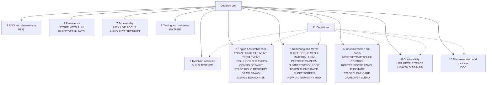

# Decision Log

This is the single source of truth for **why** this repository looks the way it
does. It covers the conversion of the canonical `gabrielecirulli/2048` into a
run-based, 2.5D roguelike with in-run relics: the TypeScript and Vite
toolchain, the split of the rules engine from the renderer, the six-hook relic
system, the seeded run RNG, the versioned run state, the Three.js renderer, the
screen flow, the accessibility layer and the observability surfaces.

An entry exists here when **a competent engineer could reasonably have chosen
differently**. That is the whole admission test. A choice with one sane answer
— that a merge of two equal tiles produces their sum, that a stylesheet is
compiled before it is served — earns no row. A choice where a second option was
genuinely defensible earns one, and says so in its own words.

Rationale belongs here. A code comment in this repository is meant to carry a
contract, an invariant, an external constraint, an ordering or timing
constraint, or the provenance of a ported behaviour — never the reasoning
behind a choice: where a module made a debatable choice, its comment states
*what* was decided and cites the identifier of the row below that argues it.
That division is itself a decision, recorded as `DL-DOC-05`.

That is the rule, and it is **not asserted as already true of every comment in
the tree**. A contract comment necessarily states the mechanism it enforces, and
the line between stating a mechanism and arguing for it is thin enough that it
has been crossed. One instance was found and repaired — the charge-request
member of `src/engine/hooks.ts`, which had restated the ownership argument of
`DL-HOOKBUS-01` in full and now states the contract and cites the row.
[§13](#13-coverage-and-citation-integrity) records exactly what has been checked
and the test to apply when editing a comment.

Every row carries the four columns Rule 1 requires: **what was decided**, **what
alternatives existed**, **why this choice was made**, and **what risks it
carries**. No row has an empty cell. Where a decision genuinely carries little
risk, the risk column says so and says why, rather than reaching for a
platitude.

Deviations from a literal or obvious reading of the requirements are not
scattered through the tables. They are collected in
[§11 Deviations](#11-deviations), each with its own row, because an unexplained
deviation is a defect rather than an omission.

## How to cite this log

An identifier has the form `DL-<AREA>-<NN>`, for example `DL-RNG-01` or
`DL-ENGINE-04`. `<AREA>` names one concern; `CONTRIBUTING.md` carries the
complete registry of areas and the owning file of each, and every `DL-*`
identifier in the tree resolves to one of them. `<NN>` is a two-digit ordinal,
unique within its area.

Four rules govern the namespace, and they are binding because other files point
at these identifiers:

- **Identifiers are never renumbered and never reused.** Once `DL-STORE-02`
  names the best-score string contract, it names that and nothing else, for as
  long as the repository exists. A superseded decision keeps its number and
  gains a note; it does not free one up.
- **A new decision takes the next free ordinal in its area.** Ordinals are
  contiguous from `01` within each area, so the next free one is always
  discoverable by reading the area's table below.
- **A new area is added to the `CONTRIBUTING.md` registry in the same change
  that first uses it.** The registry is authoritative; a citation to an
  unregistered area is a broken citation.
- **A citation states what was decided and names the identifier.** It does not
  restate the alternatives, the reasoning or the risks. Those belong to the row.

`TR-<AREA>-<NN>` is a different namespace and resolves to
`docs/TRACEABILITY_MATRIX.md`, not here. Each `TR-*` identifier names the row
that pairs a construct of the retired `js/` sources with the module carrying it
now, and every identifier cited from a source module has such a row:
`tests/unit/quality/traceability-matrix.test.ts` gates that in both directions.
A row in this log may cite a `TR-*` identifier; it never defines one.

Entries are grouped by theme so that a reader who knows the symptom can find
the decision. The eleven groups below extend the eight this log was
commissioned with — **Input, interaction and audio**, **Accessibility** and
**Observability** were separated out — because three hundred entries in eight
groups is a haystack, and findability is the point of grouping at all.
*Figure D1, Decision Categories and the Requirement Areas They Cover*, maps
those eleven groups to the area codes whose ordinals live in each, and is the
fastest way to turn an identifier you have found in the code into the section
that argues it. Its number carries a `D` prefix because the bare numerals
Figure 1 and Figure 2 are the as-is and to-be architecture views of
`docs/architecture/ARCHITECTURE.md`, which `CONTRIBUTING.md` already points at
by those names; every figure this document adds is numbered `D<n>` so a
reference by name resolves to exactly one figure across the documentation set.

The architecture itself is not documented here. It is documented in
`docs/architecture/`: `ARCHITECTURE.md` carries the before-and-after views as
Figures 1 and 2, and `component-interaction.md`, `data-flow.md` and
`hook-dispatch-sequence.md` carry Figures 3 through 7. It is documented also in
`docs/TRACEABILITY_MATRIX.md`, the construct-by-construct mapping from the
retired `js/` sources to the modules that replaced them. `docs/` also carries
`CONFIGURATION.md`, `RELICS.md` and `OBSERVABILITY.md`. This log explains *why*
the choices were made; those documents show *what* the result is.

## Figure D1 — Decision Categories and the Requirement Areas They Cover

**Legend for Figure D1.** *Decision Categories and the Requirement Areas They
Cover* is a navigation map, not an architecture view — the architecture figures
live in `docs/architecture/`. The `D` in this figure's number is what keeps it
distinct from the Figure 1 there. The single
root node is this document. A **solid arrow** points to one thematic group of
entries, labelled with the area codes whose ordinals are argued inside it;
those labels are the `<AREA>` segment of every identifier in that group. A
**dotted arrow** runs from the deviations
group back to an ordinary group, and means a deviation recorded in §11 also
belongs to that group's subject matter, so a reader who arrives at a deviation
can find the ordinary decisions surrounding it. The absence of a dotted arrow
to a group means no deviation touches it. Nothing in this figure implies a call
direction, an import or a runtime relationship.

## 1. Toolchain and build

The repository had no dependency manifest, no lockfile, no test runner and no
build step of any kind before this work. Every entry here is therefore a first
of its own, and the constraint every one of them answers to is the
static-deployment mandate: one install plus one build command must produce a
directory that is copied to a static host and served with no process running
behind it. That mandate has an economic root worth keeping in view — the project
is hosted on GitHub Pages precisely so that it costs nothing to host
(`README.md` §Donations at the source commit), and a build that needed a server
would spend money the project has never spent.

### 1.1 BUILD — the bundler, the runtime pin and the retired tooling

Owner: `vite.config.ts`. `DL-BUILD-11` is a deviation and is recorded in
[§11](#11-deviations); the next free ordinal in this area is `DL-BUILD-15`.

| ID | What was decided | Alternatives considered | Why this choice | Risks it carries |
|---|---|---|---|---|
| `DL-BUILD-01` | The root `index.html` is the whole entry graph. No SSR entry, API route or serverless adapter is configured, and none may be. | A framework preset with an SSR entry point; a serverless adapter for a hosting provider; a second HTML entry for the executive deck. | The deployment mandate is that `dist/` is copied to a static host and served with no process behind it. An SSR entry or an adapter would make the artifact depend on a runtime, which is the one thing the mandate forbids. A single HTML entry also keeps the emitted directory small enough to read. | The configuration cannot grow a second page without a deliberate change to `build.rollupOptions.input`; a contributor who adds one by adding a file will find it silently absent from `dist/`. The executive deck sits outside the graph for this reason: `blitzy-deck/executive-summary.html` is in the checkout, and because `build.rollupOptions.input` names only the root `index.html` it is absent from `dist/` and is never type-checked or bundled. Nothing but this decision and that single input entry enforces the placement. |
| `DL-BUILD-02` | `dist/` is emitted with `sourcemap: false`. | Emitting a source map; emitting a hidden source map and uploading it to an error tracker. | Every file `dist/` carries is publicly reachable on the static host it is copied to. A map would publish the TypeScript sources and their comments beside the bundle, and it would resolve the file paths that `src/observability/logger.ts` deliberately redacts out of a stack trace, undoing that redaction at the exact moment it matters. | A production stack trace is unreadable without a local rebuild, so diagnosing a report from a user is slower. There is no error tracker to upload a hidden map to, so the usual escape hatch is unavailable. |
| `DL-BUILD-03` | The design-token projection reaches Dart Sass as source text through `css.preprocessorOptions.scss.additionalData`, and nothing is written into `style/`. | A generated `style/_generated-tokens.scss` written to disk by a prebuild step; a Sass custom importer resolving a virtual module; duplicating the values by hand on both sides. | A generated file on disk is a second committed artifact that nothing verifies, which is the exact defect that deleting the committed `style/main.css` closes — repeating it for tokens would reintroduce it. Delivering the projection as source text means the values exist in one place and the build cannot serve a stale copy. | A plain `sass style/main.scss` invocation prepends nothing, so the stylesheet must declare the projection variable `!default` and carry a fallback beside every token; the two sides can therefore disagree, which is why `style/_tokens.scss` raises a Sass `@error` when they do. The projection is invisible in the source, so a reader of `style/main.scss` alone cannot see where a token value came from. |
| `DL-BUILD-04` | Both the development server and the preview server bind `127.0.0.1` and no other interface. Binding a further interface is a per-invocation opt-in via `--host`. | Binding `0.0.0.0` by default, which is what a bare `vite` does in many setups; binding the container's address so a sibling machine can reach it. | A development server serves unminified sources and, with the diagnostics gate set, an in-page surface that exports logs and metrics. Defaulting to every interface publishes that to whatever network the machine is on, including a shared CI or container network, for no gain a developer asked for. | Testing on a phone or a second machine needs the flag, and a developer who does not know it exists will conclude the server is broken. Parallel clones must still offset the port numbers, which the binding does not solve. |
| `DL-BUILD-05` | Node is pinned to **24.19.0** in `.nvmrc`, with `package.json` `engines.node` declaring the floor `>=24.19.0` and `engines.npm` declaring `>=11.0.0`. This is a **deliberate runtime choice, not one the dependencies force**. | Staying on the pre-existing system Node 22, which every chosen package accepts; declaring a wider floor such as `>=20`; pinning `engines.node` to the exact version rather than a floor. | **No package requires 24.** The floors resolve to `vite` `^20.19.0 \|\| >=22.12.0`, `vitest` `^20.0.0 \|\| ^22.0.0 \|\| >=24.0.0`, `jsdom` `^22.22.2 \|\| ^24.15.0 \|\| >=26.0.0`, `sass` `>=20.19.0`, `@playwright/test` `>=20`, `typescript` `>=16.20.0`, and `three` declares none — and the system's own Node 22.23.2 satisfies every one of them. 24 was chosen because it is the Active LTS line and this repository is adopting a toolchain it had none of: the pin is the line the project will sit on for the longest, on the reasoning that starting a first-ever toolchain on the line nearest its end of life buys a migration immediately. `.nvmrc` carries the exact version so a version manager reproduces the environment, while `engines` stays a floor so a patch release of 24 is not rejected. | Contributors on 22 must upgrade before anything runs even though nothing they install needs it, and the failure they see first is an `engines` warning rather than a clear instruction. The pin needs maintenance as the LTS line moves and nothing in the repository reminds anyone to do it. The floor-versus-exact split also means `.nvmrc` and `engines` can drift apart with no check catching it. |
| `DL-BUILD-06` | Every dependency is pinned to an exact version — no caret, no tilde, no `latest` — and `package-lock.json` is committed. | Caret ranges, which are the npm default and take patches automatically; committing no lockfile, as the repository did for its entire prior history; a `.npmrc` with `save-exact` only, leaving existing ranges alone. | This repository has never had a reproducibility artifact of any kind, and the work it now carries includes a seeded snapshot suite whose whole value is that an identical input produces an identical output. A floating patch of a transitive dependency that changes a rounding path would present as a snapshot failure with no source change to blame it on. Exact pins plus a lockfile make the toolchain a fact rather than a resolution. | Security patches require a deliberate edit rather than arriving on the next install, so a known vulnerability can sit unpatched longer. The lockfile is a large generated file and is a frequent merge-conflict site. Exact pins also mean a peer-dependency conflict cannot resolve itself and must be fixed by hand. |
| `DL-BUILD-07` | `base: './'` — a relative base — with `build.outDir: 'dist'` and `build.assetsDir: 'assets'`. | A root-absolute `base: '/'`; a repository-named base such as `/2048/`; an environment-variable-driven base resolved at build time. | The artifact must work when copied to an arbitrary static host, and the project's own historical host serves from a repository subpath. A root-absolute base emits `/assets/...` URLs that 404 on a subpath host — the precise failure the mandate cannot tolerate — while a hard-coded repository name breaks every host that is not that one. A relative base resolves against wherever `index.html` actually sits, which is the only form that is correct on all of them. | A relative base is incompatible with client-side routing that rewrites the path, so if a router with real URLs is ever added the base must change with it. Relative asset URLs also break if `index.html` is moved to a different depth than the assets it references, which nothing in the build prevents. |
| `DL-BUILD-08` | Two TypeScript projects: `tsconfig.json` for the application sources and tests, and `tsconfig.node.json` for the four tooling configuration files. `npm run typecheck` runs both. | One configuration covering everything; leaving the tooling files unchecked, which is common and costs nothing until a config breaks; a third project for the test tree. | The tooling files run in Node, import from `vite`, `vitest` and `@playwright/test`, and need `types: ["node"]` and Node module resolution. The application runs in a browser with the DOM and WebGL lib set. One configuration would have to satisfy both, which means admitting Node globals into the application's type space — where a stray `process.env` would then type-check and fail at runtime in the bundle. | The two configurations can drift, and a file can fall between the two include sets and go unchecked entirely with no error to signal it. `typecheck` is two compiler invocations, so it is slower, and a contributor who runs `tsc` alone checks only half the tree. |
| `DL-BUILD-09` | `Rakefile` is deleted. | Keeping it beside the npm scripts, so both toolchains work; porting its task to an npm script. | Its only task, `appcache:update`, reads and rewrites `cache.appcache` — a file that does not exist anywhere on this branch, so the task raises before it does anything and has been inoperative for as long as this branch has existed. Its Ruby runtime was never pinned by a `Gemfile`, and no Ruby is present in the environment the project is now built in. Porting a task that has no target would port nothing. | A contributor following the pre-migration `CONTRIBUTING.md` will look for the file and not find it; that is mitigated by rewriting the relevant `CONTRIBUTING.md` guidance in the same change. If the `gh-pages` branch still uses the task, that branch loses it on any future merge from here — an accepted cost, since the appcache manifest itself is a retired platform feature. |
| `DL-BUILD-10` | `.jshintrc` is deleted, and the three conventions it encoded are carried forward: two-space indentation (`.jshintrc` L3), an 80-column line guide (L4) and camelCase identifiers (L6). | Keeping it as advisory documentation of house style; replacing it with an ESLint configuration; replacing it with Prettier. | Nothing ever executed it. The pre-migration `CONTRIBUTING.md` said only "if you install and run `jshint`", no script invoked it, and no CI existed to invoke it. Its options are ES5-era and several are meaningless for TypeScript. TypeScript `strict` plus the type-check gate now catch a strict superset of what it advised about correctness. | The style conventions it encoded could be lost, since a deleted file advises nobody. That is mitigated three ways: `CONTRIBUTING.md` now states the indentation, column and naming rules normatively; `tests/unit/quality/formatting.test.ts` enforces the mechanical whitespace invariants as an executable gate; and the compiler plus review hold column width and naming. Adopting no linter at all does mean no automated check on import order, unused locals beyond the compiler's, or naming. |
| `DL-BUILD-12` | The bundle is emitted as **one chunk**, with `chunkSizeWarningLimit` set to 950 kB — tracking the measured size rather than being switched off. | Splitting `three` into a vendor chunk for cross-deploy caching; setting the limit to `Infinity` or deleting it; lazy-loading the renderer behind a dynamic import. | A vendor split buys caching across deploys and costs a second request, and it would not silence the advisory anyway because the vendor chunk alone exceeds the default ceiling. One chunk keeps `dist/` the copy-and-serve directory the mandate asks for. Setting the ceiling near the measurement, rather than removing it, keeps the advisory useful: a chunk that grows past what the renderer needs still trips it. | The ceiling must be revisited whenever the reachable module set grows, and it has moved for exactly that reason at every step — 734 kB to 803 kB when the observability layer became reachable, 803 kB to 930 kB when the relic subsystem and the tracer did, and 950 kB to 1100 kB when the run-flow screens did. **The figure in this row is superseded: `DL-BUILD-13` carries the current one and the policy that sets it.** A ceiling left behind the measurement is the state `DL-SHEET-04` warns about in general, a warning nobody fails on becoming a warning nobody reads. A single chunk also means a first visit downloads the renderer even in number-only mode. |
| `DL-BUILD-13` | `chunkSizeWarningLimit` is **1100 kB**, and the policy is stated as a rule rather than as a number: the ceiling sits just above the measured bundle and is re-measured whenever a module becomes reachable from the entry point. The measurement at this commit is 1064.44 kB minified and 294.36 kB gzipped. | Leaving it at the 950 kB `DL-BUILD-12` set, and accepting an advisory on every build; removing the ceiling or setting it to `Infinity`; setting it far above any plausible size, such as 4 MB, so it never needs touching again. | The bundle grew when the five run-flow screen modules became reachable from `src/main.ts` (`DL-MAIN-13`), because a module nothing reaches is one the bundler leaves out — so the growth is the composition being completed rather than code being added. A ceiling that fires on every build is a warning nobody reads, which defeats the reason `DL-BUILD-12` kept one at all; a ceiling far above the measurement is the same thing by another route, since nothing would ever trip it. Tracking the measurement keeps the advisory meaningful: the next time it fires, something reachable has grown by more than the composition needed. | The ceiling is now a value that **must be updated by whoever makes a module reachable**, and nothing automates the check — the build's own advisory is the only reminder, and it appears in the run that is already too late to stop. It also records a size for one commit, so the row is a measurement with a date rather than an invariant. |
| `DL-BUILD-14` | `@types/node` is declared as an explicit devDependency, at the exact version already resolved in the tree. | Dropping `"types": ["node"]` from `tsconfig.node.json` and reaching the filesystem some other way in the three read-only gates; leaving the package to arrive transitively and accepting that it may not; keeping `happy-dom` installed purely to preserve the transitive edge. | Removing `happy-dom` under `DL-TEST-06` removed the only package that depended on `@types/node` outright — `vite` and `vitest` declare it as an *optional* peer, which npm does not install — and `tsconfig.node.json` declares `"types": ["node"]` for the gates that open files with `node:fs`. Without the declaration the tooling type-check stops compiling. A package the build genuinely needs belongs in the manifest rather than arriving as a side effect of another package's dependency graph, which is the general form of the defect `DL-TEST-06` closed. | It is a second version to keep in step with the pinned runtime, and a `@types/node` that drifts ahead of the pinned Node would declare globals the runtime does not have. `DL-BUILD-06`'s exact pin means that can only happen deliberately. |
| `DL-BUILD-15` | `index.html` declares a Content Security Policy as a `<meta http-equiv>` element rather than expecting a response header, positioned ahead of every element it governs. It is `default-src 'self'` with `base-uri 'self'`, `script-src 'self'`, `style-src 'self' 'unsafe-inline'`, `img-src 'self' data:`, `font-src 'self'`, `connect-src 'self'`, `worker-src 'self'`, and `object-src`, `media-src` and `form-action` all `'none'`. The two directives a meta element cannot express are documented in `README.md` as headers a host should add on top. | No policy, which is the state this replaces; a header-only policy configured per host; a header-only policy plus a `_headers`, `netlify.toml` or `vercel.json` for the hosts that read one; a nonce or hash `script-src` with `'strict-dynamic'`; shipping it report-only first. | `DL-BUILD-01`'s mandate is that `dist/` is copied to an arbitrary static host with nothing behind it, which makes a header precisely the thing the artifact cannot carry: a policy that exists only once a host is configured is a policy that is absent by default, and per-host header files work only on the hosts that read them. The meta form travels with the directory and applies identically to the development server, the preview server and the copy. `'unsafe-inline'` is confined to `style-src`, where the number-only renderer, the parallel board, the HUD and the diagnostics surface all write inline style declarations and the development server injects CSS as `<style>` elements; `script-src` carries no inline, eval, hash or `'strict-dynamic'` bypass at all, which the sources satisfy because none calls `eval`, constructs a `Function` or contributes an inline script. A nonce is unavailable for the same reason a header is — nothing generates this document at request time. | The two strongest directives are the two a meta element discards: framing is unrefused and no violation report reaches anyone unless the host adds `frame-ancestors` and a reporting endpoint as headers, and `README.md` is the only place that says so. `connect-src 'self'` and `worker-src 'self'` admit no `blob:`, so a future feature that fetched a blob URL in the page, or moved serialisation into a blob-backed Worker, would be refused at runtime while passing every static gate — today the metrics export dereferences its blob through an `<a download>`, which no directive polices, and no module constructs a Worker. `'unsafe-inline'` in `style-src` also admits an injected style attribute, a narrow but real exposure that only removing every inline style write would close. In development Vite injects its client script above the meta element, so that one fetch precedes enforcement; it is same-origin, so `script-src 'self'` would admit it regardless, and the production document does not carry it. |

### 1.2 TEST — the unit and snapshot runners

Owner: `vitest.config.ts`, `vitest.snapshot.config.ts` and the suites the
snapshot runner executes under `tests/snapshot/**`. Next free ordinal:
`DL-TEST-09`.

| ID | What was decided | Alternatives considered | Why this choice | Risks it carries |
|---|---|---|---|---|
| `DL-TEST-01` | The unit tree is partitioned into two projects by the environment a suite needs: `unit:dom-free` on `node` for `tests/unit/{engine,config,rng,relics,...}`, and `unit:dom` on `jsdom` for every other directory, whose `include` is the whole tree with the first project's globs excluded. An unlisted directory is therefore collected by `unit:dom`. | One project on `jsdom` for everything; one project on `node` with a per-file `@vitest-environment` docblock wherever a document is needed; a project per top-level directory. | Running the DOM-free engine suites in `jsdom` would let a module reach for `document` and pass, which is precisely the property the engine/renderer split exists to guarantee. Making `unit:dom` the catch-all rather than an explicit list means a newly added directory is collected by default: the failure mode of forgetting a glob is a slower test, not a silently uncollected suite. | A DOM-free suite placed in the wrong directory runs with a document available and its isolation stops being tested. The two `include` globs must stay complementary; a mistake makes a file run twice or not at all. A file that genuinely needs the opposite environment relies on the per-file docblock override, which is easy to omit. |
| `DL-TEST-02` | No fake timer is installed and no global is replaced by the configuration. Suites that need to control time or a global do it locally. | Installing fake timers globally, which makes every timing assertion deterministic in one line; globally stubbing `localStorage`, `matchMedia` and `performance`. | A global fake timer changes the behaviour of every suite including the ones that never asked, and it makes the render loop, the audio scheduler and the announcement queue behave unlike production in ways that are hard to notice. Replacing globals centrally hides which suite depends on which capability, and the capability probes are themselves under test. | Each suite that needs time control repeats the setup, so there is duplication and a suite can get it subtly wrong. Timing-sensitive suites are more exposed to a slow machine than they would be under fake timers. |
| `DL-TEST-03` | `resolve.alias` is absent, matching `vite.config.ts`, so specifiers resolve the same way under test as under the build. | Adding a `@/` alias to shorten deep relative imports in both configurations; adding it in the test configuration only. | An alias present in one configuration and not the other means a module can import successfully under test and fail in the bundle, or the reverse. Keeping both empty makes a passing test a real statement about the shipped graph. The cost is only verbosity in import specifiers. | Deep relative paths such as `../../config/default-config` are noisier and a file move requires editing more specifiers. If an alias is ever added it must be added to both configurations in the same change, and nothing checks that. |
| `DL-TEST-04` | The snapshot write mode is pinned in the configuration: `update: 'none'` in `vitest.snapshot.config.ts`, with the `test:snapshot` script passing no flag. Neither a mismatched snapshot nor a MISSING one is written, in CI and outside it alike, and both fail the run; re-recording is the explicit `vitest run --config vitest.snapshot.config.ts -u`, which overrides the value for that one invocation. | Leaving `update` unset and letting Vitest resolve the mode from its own CI detection, which is what this repository did until code review finding M7 — `none` under CI and `new` otherwise, so an absent snapshot was CREATED and passed on a developer machine; passing `--update` in the script, so drift always rewrites; running the gate with `--ci` forced on, which pins the mode through an unrelated switch. | The gate exists to detect a determinism break, and a gate that creates the baseline it is missing cannot: the first run after a spec is added or a projection is changed records whatever the code currently does and reports green, so an unreviewed baseline enters the repository through a passing run. Pinning the mode in the configuration also makes the behaviour a property of the repository rather than of the runner's environment detection, so the gate behaves identically on a machine that sets `CI` and one that does not. | A genuinely new snapshot now fails on its first run and requires the deliberate `-u` step, and a developer who does not know that reads the failure as a bug — the failure text names the snapshot rather than the remedy. Re-recording with `-u` rewrites every snapshot of every collected spec, so the step has to be taken with the whole gate green apart from the intended change. |
| `DL-TEST-05` | The seeded snapshot gate is kept in its own configuration and its own directory: `vitest.snapshot.config.ts` collects `tests/snapshot/*.spec.ts` — the top level only — and `vitest.config.ts` collects `tests/unit/**/*.test.ts` recursively and excludes `tests/snapshot/**`. Neither picks up the other's specs. | Keeping the snapshot specs inside the unit suite and distinguishing them by file name or tag; one configuration with two projects. | The requirement is that the seeded suite is runnable as an independent regression gate, which means one command that runs it and nothing else, and a failure that unambiguously means determinism moved. Folding it into the unit run would make a determinism break one red line among thousands, and would make it impossible to run the gate without also running everything else. | Two configurations must be kept consistent, and a spec can fall into neither `include` glob and silently never run — a real hazard, since the snapshot glob is deliberately non-recursive, so a spec in a subdirectory of `tests/snapshot/` is collected by nothing. Shared options are duplicated across the two files. |
| `DL-TEST-06` | `jsdom@30.0.1` is the DOM environment for the `unit:dom` project, and it is **the only DOM environment installed**. `happy-dom` has been removed from `package.json` and from the lockfile. | `happy-dom` as the environment, which is markedly faster to construct; no DOM environment at all, with every DOM-touching suite mocking the handful of interfaces it needs; keeping `happy-dom` installed but unselected, as this row previously recorded. | The suites that need a document exercise focus management, `aria-*` reflection, `classList`, `matchMedia`, custom-property reads and a canvas element. jsdom's coverage of those is the more complete and the better documented, and a specification gap in the environment presents as a false failure that costs more to diagnose than the extra construction time costs to run. Keeping the loser installed was the part that did not survive: an unused direct dependency is install and supply-chain surface that must still be audited, patched and resolved, it delivers nothing, and its presence invites the belief that a suite may choose either environment. This row already stated that it should be removed once jsdom's cost had not become the binding constraint; it has not, so it is gone. | jsdom is heavier and slower, and the whole `unit:dom` project pays that on every run — with no second environment installed, **there is no longer a one-line escape hatch** if that cost ever does become binding, and reinstating one means a manifest change and a fresh lockfile. Neither jsdom nor any other DOM emulator implements layout, so geometry is still unreported and `src/ui/a11y/focus-manager.ts` still has to declare per-cell geometry explicitly rather than measure it. Removing it also pulled `@types/node` out of the tree, because `happy-dom` was the only package depending on it outright — `vite` and `vitest` declare it as an optional peer — and `tsconfig.node.json` needs it; `DL-BUILD-13` records the promotion that resolves that. |
| `DL-TEST-07` | The observer non-interference gate attaches **the production observability stack itself** — `createLogger`, `createMetricsRegistry`, `createTracer` with `attachEngineTracing`, and an `EngineReporter` — over a run that also draws its reward offers from the substreams the board consumes, and compares the two legs as the **serialised bytes**, the cursor text in `RNG_STREAM_NAMES` order and the offer identifiers in draw order. The observer-enabled projection is what the artifact pins, and the observer-free leg is asserted to render the same text. The suite also asserts the observers ran. | Attaching a collector that records event names, which is what the gate did; comparing the in-memory board and cursor objects with a deep equality; keeping the offers in their own gate and out of this one; pinning the observer-free leg and comparing the observed leg to it. | A collector proves that appending a listener is harmless; it does not prove that the things this product actually appends are. The real stack does far more than record a name — it reads the cursor map every commit, opens and closes spans across the turn, and takes a callback from inside the move pipeline — and each of those is a way to perturb a run that a name-collector cannot exhibit. Comparing bytes rather than objects catches a member that is reordered or re-typed on the way to storage, which a deep equality passes. Folding the offers in is what makes the gate cover Contract 6 whole: the draws take from the run's own substreams, so a consumed draw moves the board, the cursors AND the offers, and the three are asserted separately so the failure names which. Pinning the observed leg rather than the bare one is the point of the gate — the artifact is then the expectation for a run **with** observability enabled, which is the configuration that ships. | The suite now imports from `src/observability`, so a change to a factory signature breaks a snapshot suite as well as a unit suite — intended coupling, but coupling. The evidence assertions are the only thing standing between this gate and vacuity, and they are counted rather than structural: a future observer added to the attachment and wired to nothing would not move them. The gate proves non-interference for the observers it attaches and no others, so an observer added to `src/main.ts` alone is outside it. |
| `DL-TEST-08` | The seeded gate carries **three reload legs of increasing reach, each compared against an uninterrupted control leg**: an engine-only resume, a resume that has TAKEN relics between rounds, and a resume made while a reward round is STANDING. Each leg's move list is bounded so the run is still live at the end. | One leg over the engine alone, which is what the gate carried; one maximal leg that exercises every path at once; asserting the persisted envelope's fields directly instead of replaying a control leg; playing each leg to a loss. | The V2 guarantee (AAP 0.8.2) is a conjunction — identical board state AND identical relic draws across a reload — and an engine-only leg proves only the first half: it offers no reward, so only the two spawn substreams ever move, and a resume that recovered the board while losing the reward cursors passed it. The offer-set section proves the second half only for a generator that was never persisted. The two extra legs are separated because they fail for different reasons: taking a relic between rounds exercises the relics-held and cursor-advance paths, while interrupting with a round standing exercises the `pendingReward` envelope and the cursor written at draw time, which is the state a player reloading the reward screen is in (`DL-RUNCTL-19`). Comparing against a control leg rather than against recorded field values means the assertion states the property — the interruption changed nothing — rather than a snapshot of today's implementation. A list that played to a loss would compare two finished runs whose controllers had already opened fresh ones, which is a weaker statement. | Three legs over one catalogue and one seed take real time and re-play the same early moves, and each is sensitive to the STAGE CURVE: a change to the stage goals moves how many rounds a 44-move list reaches, so a leg can silently stop covering the case it was written for while still passing. The bound is stated as a move count rather than derived from the curve, so that drift is invisible until someone re-reads the leg. |

### 1.3 PW — the recorded-gameplay gate

Owner: `playwright.config.ts`. Next free ordinal: `DL-PW-04`.

| ID | What was decided | Alternatives considered | Why this choice | Risks it carries |
|---|---|---|---|---|
| `DL-PW-01` | Recording is unconditional: `video: { mode: 'on', size: VIEWPORT }` with a deliberate 1280x960 viewport, `outputDir: 'test-results'`, `workers: 1` and `retries: 0`. | `retain-on-failure`, which is the common CI default; `on-first-retry`; leaving `video.size` unset; running the default worker count. | The video is required as *positive proof* that a run happened, so a retention mode that keeps a video only when something failed produces no artifact on a green run and fails the gate on absence — the opposite of what is wanted. `video.size` must repeat the viewport because Playwright otherwise scales the frame into an 800x800 box, which shrinks the board below the point where a reader can see a merge animate, satisfying the mechanical half of the gate while failing its substantive half. One worker and no retries keep the capture from competing for CPU with a parallel test, which is the documented cause of choppy frames. | Every run pays the capture cost and stores an artifact, so the output directory grows and CI storage is consumed on runs nobody will watch. One worker makes the suite as slow as its serial sum. A fixed viewport records one layout only, so the mobile breakpoint is never in the evidence. |
| `DL-PW-02` | The base origin is asserted to be a loopback address at configuration load time, and the configuration throws before any run begins if it is not. | Asserting inside a test, so the failure is a test failure; not asserting at all and trusting the default. | The recorded run drives a real browser through a full game and captures video of whatever it is pointed at. Pointing it at a non-loopback origin by an environment mistake would record a deployed site rather than the working tree, and the artifact would look entirely valid. Failing at load is the only point at which nothing has been recorded yet. | A deliberate run against a remote origin — for a smoke test of a deploy, say — is impossible without editing the configuration. The assertion also runs when the configuration is merely loaded for listing tests, so a malformed environment blocks even `--list`. |
| `DL-PW-03` | Chromium is launched with `--enable-unsafe-swiftshader --use-gl=angle --use-angle=swiftshader`, and `chromiumSandbox: false`. | Default headless launch; `--use-gl=swiftshader` alone; `--disable-gpu`; running headed with a virtual framebuffer. | Headless Chromium in this container has no hardware GL, and without these flags a WebGL context either fails to create or yields a canvas that composites as a black rectangle. That failure is the dangerous one: the recording exists, has non-zero duration and passes every mechanical check while showing none of the three things the gate requires it to show. With the flags, a WebGL 2.0 context on ANGLE over SwiftShader was confirmed live in this environment. | Software rendering is slow, which is why the frame rate has to be treated as a variable rather than an assumption, and its output can differ subtly from hardware GL, so the video is evidence that the scene renders and not a pixel-accurate reference. `--enable-unsafe-swiftshader` is a flag whose own name says it is not for production use; it appears here only in a test configuration and must never migrate into an application default. Disabling the Chromium sandbox lowers isolation for the test browser and is acceptable only because it runs against a loopback origin serving the working tree. |

## 2. Engine and architecture

One move unlocked everything else: separating the rules from the view. The
pre-migration controller held a reference to the actuator and pushed a state
projection into it on every commit, so the rules could not be exercised without
a document. Inverting that — the engine emits, and the renderer, the relics, the
run controller and the observability layer subscribe — is what makes relics,
tests and a WebGL renderer reachable at all.

Two properties of the pre-migration sources made the inversion cheap rather than
invasive, and several entries below lean on them. The composition root injected
**constructors** rather than instances, so there was already one wiring site and
no scattered `new`. And the existing publish/subscribe bus was **append-only** —
`on()` pushed a callback onto an array keyed by event name, `emit()` walked the
array synchronously with a single argument and returned nothing. That
append-only shape is why an observer can attach beside the engine's own
consumers without editing a single engine file, and it is carried forward
rather than replaced.

### 2.1 ENGINE — the turn pipeline and state ownership

Owner: `src/engine/engine.ts`. `DL-ENGINE-04` is a deviation and is recorded in
[§11](#11-deviations); the next free ordinal is `DL-ENGINE-15`.

| ID | What was decided | Alternatives considered | Why this choice | Risks it carries |
|---|---|---|---|---|
| `DL-ENGINE-01` | The push call at `js/game_manager.js` L91-L97 becomes the `state:commit` event. The engine holds no view reference and calls no renderer. | Keeping the push call and giving the actuator a 3D implementation behind the same interface; emitting an event *and* keeping the push call during a transition period. | Reusing the actuator interface would have kept the rules engine holding a view, which is what makes the rules untestable without a document and what stops a second consumer — a relic, a run controller, an announcer — from seeing the same state. Keeping both paths temporarily would have doubled the state surface and left the question of which one is authoritative unanswered. The payload the actuator already received was a complete projection, so the event could carry exactly the same information and the change is a direction reversal, not a redesign. | Nothing forces a subscriber to exist, so a missing subscription is silence rather than a type error: an engine with no renderer attached plays a complete, invisible game. Ordering between independent subscribers becomes something the composition root is responsible for, and it is easy to attach one after `setup()` and miss the first commit — which is why `DL-MAIN-04` fixes that ordering explicitly. |
| `DL-ENGINE-02` | The two randomness call sites of the pre-migration sources — the spawn value at `js/game_manager.js` L71 and the spawn position at `js/grid.js` L41 — become draws on the `spawn-value` and `spawn-position` substreams. Those two were the only ones. | Installing a seeded generator over `Math.random` so every existing call site becomes seeded without being found; threading one generator through both sites as a single stream. | A full grep of the pre-migration tree found `Math.random` at exactly those two lines and nowhere else, which turns the substitution from a search-and-hope sweep into an audited, exhaustive change with a provable end. That audit is what justifies never touching the global: there was nothing else to catch. | The claim is only true of the sources as they were; a new `Math.random` call added anywhere later is invisible to the seeded contract and would break reproducibility silently. The guard against that is the dedicated test asserting `Math.random` is unpatched plus review, not the type system. |
| `DL-ENGINE-03` | The win literal at L170, the spawn distribution at L71, the start-tile count at L7 and the merge condition at L156-L157 are read from `RulesConfig` at use time. | Leaving them as literals and letting relics mutate engine fields directly; reading the configuration once into private fields at construction. | Relics and the base game have to read the same rules or a relic's effect is a special case in the engine, which the requirements forbid. Reading at use time rather than caching at construction is what lets a board-mutating cursed relic change the board edge mid-run and have the win and loss evaluations see the new value. | Every rule read is now an indirection, and a caller that caches a value defeats it — the reason `DL-TERM-03` states the same policy for the terminal-state module and `DL-CONFIG-02` states it for the configuration type. A malformed configuration is now a runtime failure mode the literals never had. |
| `DL-ENGINE-05` | The board snapshot read from storage reaches `setup()` as an **argument**. The persistence port is read only where no argument was supplied. | Having `setup()` read the port itself, as `js/game_manager.js` L36 did; requiring the argument always. | Passing the snapshot in makes every restore case constructible in a test without a storage double and without a document, which is what lets the fixture boards speak the product's own serialisation vocabulary. Keeping the port read as the fallback preserves the pre-migration behaviour exactly for the normal path. | Two ways to reach the same state means a caller can pass one snapshot while the port holds another, and the engine cannot tell which the user meant. The precedence — argument wins — has to be remembered rather than deduced. |
| `DL-ENGINE-06` | The persistence port is **injected and optional**, and its three snapshot calls are optional members, so a port carrying only the best-score pair satisfies it and an engine built without a port plays a complete game. | Requiring a full port, as the pre-migration constructor did by instantiating one; defaulting to an in-memory port. | The engine's own correctness does not depend on persistence, and forcing a port makes every unit test construct one. Optional snapshot members let the run system supply its own persistence for the envelope while the engine keeps the frozen best-score pair, without two competing writers of the board snapshot. | A silently absent port means a game that never saves and reports nothing about it, which is indistinguishable from a working save at the engine's boundary. Optional members mean the call sites need presence checks, and a partially implemented port is a legal value. |
| `DL-ENGINE-07` | The stage goal is evaluated where `onAfterMove` is dispatched, through `evaluateStageGoal` of `src/config/stage-config.ts`, and a met goal is resolved through `endStage()`. Stage handling has no pre-migration source. | Evaluating the goal in the renderer or the run controller, on the commit it observes; evaluating it inside the merge branch as the win check was. | Evaluating at `onAfterMove` puts the check at the one point where the turn is complete and the board is settled but the commit has not yet gone out, so the commit can carry the stage slice rather than the stage being discovered after the fact. Delegating the arithmetic to the config module keeps the goal vocabulary in one place and out of the engine. | The engine now knows a stage exists, which is a concept the classic game has no notion of; `DL-TYPES-03` is what keeps that from becoming a hard dependency by supplying a neutral frozen stage context. Evaluating on every settled turn is work done even in a run with no stage system attached. |
| `DL-ENGINE-08` | The run identifier and the correlation identifier are separate values. `runId` identifies the run instance and is what the run-state envelope persists; `correlationId` is what the observability layer keys records, counters and spans on, and is derived from the run seed and the run identifier together. The engine derives neither. | One identifier serving both purposes; deriving the correlation identifier inside the engine. | The persisted identifier and the telemetry key have different lifetimes and different exposure: the correlation identifier appears in logs and in an exported metrics snapshot, while the seed it is derived from is deliberately kept out of reported summaries. Collapsing them would either publish the seed or make the persisted identifier depend on the observability layer. Deriving in the engine would mean the engine reaching an observability module, which nothing in it does. | Two identifiers for one run is a real source of confusion, and a report that carries the wrong one is hard to spot because both are opaque strings. Every reporter and every dispatch context has to carry both, which widens those contracts. |
| `DL-ENGINE-09` | An accepted `onBeforeMove` board effect counts as a state change whether or not the slide that follows moves anything. A withdrawn move and an idle move that were preceded by an effect therefore re-derive the terminal verdict, commit, and resolve the stage — without spawning, which stays the pre-migration placement behind the moved test. | Treating only a positional change as a state change, as the pre-migration `positionsEqual` check did; also spawning after an effect, for symmetry with a real move. | A relic that clears a row or freezes a tile has changed the board even if the subsequent slide is a no-op, and a board that changed without committing leaves the renderer, the persisted envelope and the stage progress all stale. Withholding the spawn is deliberate: the spawn is the reward for a move that moved, and granting one for an effect would hand a free tile to a relic and change the pace of the game. | The rule that a commit can happen without a spawn is asymmetric and surprising, and a reader who assumes commit implies spawn will misread the pipeline. It also means a relic firing repeatedly on withdrawn moves can drive commits with no player progress. |
| `DL-ENGINE-10` | A spawn position is inserted only into a cell `Grid.cellAvailable()` reports free, checked at the engine's own insertion boundary after every hook transformation. The guard is deliberately **not** in `Grid.insertTile()`. | Guarding inside `insertTile()`, which would cover every caller at once; trusting the hook contract and not re-checking. | The merge branch of `src/engine/move-resolver.ts` requires `insertTile()` to overwrite — that is how a merged tile takes the target cell — so a guard there would break merging. Checking at the engine's boundary instead covers the one path where an untrusted value arrives, which is a position a relic transformed, without constraining the path that legitimately overwrites. | The invariant lives at a call site rather than in the data structure, so a future second insertion path could omit it. A relic that supplies an occupied position has its spawn silently suppressed rather than being told it was wrong, which is the right behaviour for the board and a poor one for the relic author. |
| `DL-ENGINE-11` | The `Direction` contract is **measured at runtime, first**: a value outside the four is refused as a blocked attempt before anything is emitted, dispatched, drawn or written. | Trusting the compile-time type, which is what the pipeline did; throwing a `TypeError` at the boundary; coercing whatever arrived into one of the four. | `Direction` is a compile-time claim and the value arrives from an input adapter, from a structural port that widens it to `number`, and from callers holding strings — so the claim is not enforced where it matters. An unusable value used to reach the vector lookup and raise a bare `TypeError` from inside the pipeline, AFTER `move:before` had been emitted and `onBeforeMove` dispatched, leaving the turn with no `move:after` to close it and a subscriber's turn span open. A numeric string was worse: the lookup coerced it into a real, committed move. Measuring first means the board, the score and all four RNG cursors stand exactly as they did and the turn is closed by the returned outcome alone. Refusing rather than throwing keeps a bad caller from taking the page down mid-run. | A caller with a genuine bug now gets a silent no-op that looks like a move into a wall, and only the counter distinguishes them. The check also runs on the hot path for every move, and it duplicates a guarantee the type system already claims to give — which reads as redundant until the three widening entry points are known. |
| `DL-ENGINE-12` | **Every counter this module raises goes through one contained path.** `count()` guards the injected sink, builds the report inside that guard, and tallies a throw on `reporterFaults` with `lastReporterFault` describing it. | Calling `this.reporter.onCount?.()` at each site, which is what the counter sites did; letting a sink's throw propagate on the grounds that a broken sink should be loud; re-delivering a failed report. | `EngineReporter`'s three members are all optional and it is exported for an implementation of a caller's own, so a sink that throws from `onCount` is a caller's mistake rather than a hypothetical — and it took `setup()`, `move()` and `restart()` down with it. Observability must not be able to stop a turn resolving: the two sibling ports at this layer, the hook bus's `deliver` and the storage manager's reporter delivery, already contain such a throw and count it, so containing it here makes the layer consistent. The report is built inside the guard so neither a hostile identifier source nor a hostile sink reaches the pipeline, and nothing is re-delivered because the sink is the only place a report could go. | A broken sink is now silent apart from the two members that describe it, so a caller must read `reporterFaults` to discover that its instrumentation is not working. Counting a fault also means the count itself cannot be reported, which is the one place this containment has no channel. |
| `DL-ENGINE-13` | An injected resolution-tracing wrapper is **held to one run of the work**: a second call replays the first outcome — the held value or the held throw — and a wrapper's substituted return is discarded in favour of the completed walk's own. Both containments raise a tracing-fault counter. | Trusting the wrapper, which is what this boundary did; validating the wrapper once at construction; refusing to accept a wrapper at all and tracing only around the whole turn. | The wrapper is a caller's function and there are four ways it can break the contract, of which two were SILENT here. A wrapper calling the work twice re-entered the traversal walk on an already-resolved board, which reports no movement and no score delta — so the board merged, the score was not credited and no tile spawned. A wrapper returning something else made a measurement into a transformation. Replaying the first outcome and returning the walk's own value closes both without changing a correct wrapper's behaviour. The sibling port `HookBusTracing.traceHookDispatch` has held its work to one run all along, so this makes the two boundaries agree. | The two LOUD failures are deliberately NOT repaired — a wrapper that throws on its own account still propagates, and one that never runs the work still fails on its substituted value — so this boundary is half-forgiving in a way a reader must look up. Holding a value also means the work's result is retained for the duration of the call, and the replay path returns a value the caller may believe was freshly computed. |
| `DL-ENGINE-14` | `startStage()` **refuses its carry-over path on a board terminated by an unresolved win**, counting the refusal rather than raising and rather than clearing the flags. The rebuilding path is unguarded, because it installs a board of its own whose snapshot carries its own terminal status. | Clearing `won` and `continuedPlay` inside `startStage()` so a stage always opens; opening the stage and leaving the terminal flags standing, which is what the unguarded method did; placing the guard only in `src/run/run-controller.ts`, where the payout is decided. | Reaching the configured win value is the canonical outcome of this game, and the flow's `won` state is the only place a player answers Keep Going or End Run. A stage that opened over it would replace that answer with a reward screen and leave the engine terminated, so every later move would be refused on a board that looked playable. Clearing the flags here would answer the question on the player's behalf and lose the win. Keeping the guard in the engine rather than only in the controller means no caller — the controller, a suite, a later mode — can open a stage on a terminated board. | A composition that never offers a way out of the win state strands the run there with its stage payout deferred, and the refusal is a counter rather than a throw, so a caller that ignores the count sees a call that quietly did nothing. The asymmetry between the two paths is a real subtlety: a restored snapshot may rehydrate a terminated board into a new stage, which is correct but is the opposite rule to the one this row states. |

### 2.2 GRID and TILE — the lattice

Owners: `src/engine/grid.ts`, `src/engine/tile.ts`. Next free ordinals:
`DL-GRID-03`, `DL-TILE-02`.

| ID | What was decided | Alternatives considered | Why this choice | Risks it carries |
|---|---|---|---|---|
| `DL-GRID-01` | The `spawn-position` substream is **injected into** `randomAvailableCell` rather than reached as a module binding. | Importing the stream table into `grid.ts`; keeping `Math.random` here and seeding at a higher level. | An imported stream makes the grid depend on the RNG module and gives it a hidden global-ish source, so two grids in one process would share a cursor and a test could not isolate one. Injection keeps the grid a pure data structure whose randomness is a parameter, which is also what lets a fixture board be rehydrated with no generator at all. | Every caller must remember to pass the right substream, and passing `spawn-value` instead of `spawn-position` type-checks — the two have the same shape. That mistake breaks reproducibility silently and only a snapshot diff would show it. |
| `DL-GRID-02` | The restore walk is bounded by **this grid's own edge length**, not by the length the incoming snapshot implies. | Trusting the snapshot's dimensions and sizing the grid from them, which is what `js/grid.js` L21-L34 did; refusing a snapshot whose size disagrees. | A snapshot can legitimately carry a different edge length from the grid being built, because a board-mutating cursed relic changes the edge mid-run. Walking the target's bounds means a smaller grid cannot read past its own array and a larger one leaves the extra cells empty, so neither case can produce an out-of-bounds read or a phantom tile. Refusing the snapshot outright would make a mutated board unloadable. | Tiles outside the target bounds are dropped, which is real state loss the grid itself does not report — the reason the reconciliation in `DL-RUNSTORE-01` computes and records the outcome before a grid is ever constructed. A caller that builds the grid without going through that reconciliation loses the tiles without a record. |
| `DL-TILE-01` | `x` and `y` are flattened onto the tile, as `js/tile.js` L2-L3 had them, rather than held as a nested position object. | A nested `position` object, which reads better and matches the serialised shape; a class with a `Position` value object. | The persisted tile shape is `{ position, value }`, and the in-memory shape was flat; changing the in-memory shape would have changed the serialisation or required a translation layer at every boundary, for a readability gain only. Keeping it flat makes the port a transcription and keeps the traceability mapping one to one. | The in-memory and persisted shapes differ, so `serialize` and the restore path each perform a small reshape that a reader must notice. Passing a tile where a `Position` is expected type-checks structurally, since a flat tile satisfies `{ x, y }`. |

### 2.3 MOVE and TERM — resolution and terminal state

Owners: `src/engine/move-resolver.ts`, `src/engine/terminal-state.ts`. Next free
ordinals: `DL-MOVE-04`, `DL-TERM-06`.

| ID | What was decided | Alternatives considered | Why this choice | Risks it carries |
|---|---|---|---|---|
| `DL-MOVE-01` | The merge condition is split: the existence guard stays in this module, and the value comparison is `config.merge.canMerge`. | Keeping the whole condition — `next && next.value === tile.value && !next.mergedFrom` — as one inline expression, as L156 had it; moving the whole condition into the configuration including the existence check. | The existence and already-merged checks are properties of the traversal, not of the rules, and a relic has no business overriding whether a cell contains a tile. The value comparison is the part a relic or a variant rule legitimately changes. Putting the existence check into the configuration would make every configuration restate a traversal invariant and would let a bad configuration produce a merge with nothing. | The condition now reads in two places, so a reader has to look at both to know when a merge happens. A predicate that ignores its arguments can make everything or nothing merge, and the traversal cannot tell that is wrong. |
| `DL-MOVE-02` | The `onMerge` transformation arrives as an **injected callback**, so this module names no bus. | Importing the hook bus here and dispatching directly; emitting an event the bus listens for. | The resolver is the hottest code in a turn and the piece most worth testing in isolation. Naming the bus would make every resolver test construct one and would create a cycle in spirit — the bus dispatches into rules, the rules call the bus. A callback keeps the direction one-way and lets a test pass identity. | The callback's contract is expressed in its signature alone, so a caller can supply one that returns a payload the resolver did not expect; the validation that catches that lives in the bus, not here. A resolver used without the callback silently applies no relic effects. |
| `DL-MOVE-03` | The win test leaves this module for `src/engine/terminal-state.ts`. | Keeping it in the merge branch where `js/game_manager.js` L170 had it. | The win condition is a configured rule that must be re-evaluated when the configuration changes, and a check buried in the merge branch only fires on a merge — which is correct for the classic rules and wrong the moment a relic can raise a tile's value without merging, or lower the win value mid-run. | The check no longer sits next to the event that usually causes it, so the causal link is less obvious when reading the resolver. Evaluating terminal state separately is slightly more work per turn than a single equality inside a branch that was already taken. |
| `DL-TERM-01` | The win evaluation is relocated out of the merge branch into this module. | Leaving it at L170; evaluating it in the renderer from the committed board. | Same reason as `DL-MOVE-03`, stated from the receiving side: one module now owns both halves of the terminal question, so win and loss cannot disagree about which board or which configuration they read. A renderer-side evaluation would make the verdict a presentation concern and would differ between the two renderers. | A caller who forgets to evaluate gets a game that never ends, and nothing in the type system requires the evaluation to happen. |
| `DL-TERM-02` | The win test is **strict equality** against `config.winValue`. | A `>=` comparison, which sounds safer; equality against a set of accepted values. | Strict equality is what `js/game_manager.js` L170 did, and the difference is observable: with the classic doubling producer a tile passes exactly through the win value, so equality and `>=` agree — but a relic that adds to a value or a configuration whose win value is not a power of two can step over it, and `>=` would then declare a win the classic rules would not. Equality keeps the frozen rule frozen and makes any change to it an explicit configuration change. | A configuration whose win value is unreachable under its own merge producer can never be won, and nothing validates that combination. A relic that skips over the win value denies the player a win they would intuitively expect. |
| `DL-TERM-03` | The win value, the merge predicate and the board size are read at **use time**, never captured. | Capturing them at construction into private fields, which is faster and is the obvious shape for a module with no state. | A cursed relic mutates the board edge mid-run and a configuration change must be visible to the very next evaluation. A captured board size is the specific bug that lets a shrunk board still be probed at its old bounds, which reads tiles that are no longer there. | Every evaluation re-reads through the configuration object, so a caller that hands over a stale configuration gets a stale verdict with no indication. It is also marginally slower on the loss probe, which is the worst case in a turn. |
| `DL-TERM-05` | The loss probe presents each operand **with the cell it stands in**, so a position-aware merge predicate is answered from its rule rather than from its no-position fall-through. The alternative remedy for the same defect — having the `frostbind` relic clear its frosted-cell ledger once its charge budget reaches zero — was **rejected**. | Leaving the probe's operands value-only and clearing `state.frozen` at zero charges instead; having the bus wipe a subscriber's state slot when its budget empties; declaring a board lost whenever the probe's verdict is unreliable; re-deriving the loss flag for a RESTORED board in `Engine.setup()` so a save written before this fix heals itself on load. | `resolveMove` of `src/engine/move-resolver.ts` hands the predicate live `Tile` instances, which carry `x` and `y`, so the probe was presenting an operand shape the resolved move never presents. A predicate keyed on the destination cell could not identify the cell, took its own defensive fall-through, and answered "mergeable" for a pair it would in fact refuse — so a full board whose only remaining pairs were all frozen reported `movesAvailable` true forever. That is `DL-TERM-04`'s failure mode with its sign reversed: `DL-TERM-04` protects a run from being ended early, this protects a run from never ending at all, and both come from the probe having to ask the real predicate a question the real walk would ask. The rejected alternative was declined on two grounds: it requires a relic handler to read its own charge budget, which AAP Contract 2 places in the bus once rather than in sixteen handlers, and `DL-HOOKBUS-06` deliberately exempts `onStageStart` so a spent subscriber still reinstalls the standing rule its persisted state records — clearing the ledger would contradict a decision already taken. Presenting the cell also fixes the **charged** case, which the rejected alternative does not reach: a relic with charges left can freeze the last remaining pairs and strand the run identically. | The probe's operands are no longer the minimal `MergeTileView` the type requires, so a predicate can now branch on position during a loss walk and make the verdict depend on board geometry rather than on values alone — a predicate that refuses by cell will end a run that a value-only reading would have continued, which is the intended behaviour but is a behaviour change. An exhausted `frostbind` still holds its frost, so its own stated mechanic — frost lasting until another merge thaws it — stays unreachable once the budget is spent, and the run now ends on that board instead of stranding on it. A board PERSISTED by a build that predates this fix keeps the `over: false` it recorded, because `Engine.setup()` restores that flag verbatim and only a turn that changes the board re-derives it — such a save is escaped through New Game rather than resolved. Re-deriving at restore was implemented and then withdrawn: it sets the flag before `onBeforeMove` is ever dispatched, and `move()` returns early on a terminated run, so `temporal-anchor` — whose whole purpose is to pull a full board back to a roomier position — could no longer arm on a restored full board, which `tests/unit/relics/relic-behaviour.test.ts` demonstrated. It also made the persisted `over` no longer authoritative on restore, which the frozen snapshot contract requires it to be. Sixty-four probe calls per turn each allocate two frozen operands where they previously allocated two smaller ones. |
| `DL-TERM-04` | The loss probe reads the **configured merge predicate** rather than performing an equality comparison of its own. | Comparing neighbour values with `===`, mirroring the pre-migration probe; comparing values and separately consulting the predicate only when they differ. | A board is only lost when no move is available, and whether a move is available depends on what counts as a merge. A probe with its own equality test would declare a loss on a board where a relic's predicate still permits a merge — ending a run that was not over, which is the worst class of bug this system can have. | The predicate is now called up to sixty-four times in the worst case where an inline comparison was, so a predicate that is expensive or that has side effects is a performance and correctness hazard. A predicate that always returns `true` makes a loss unreachable. |

### 2.4 EVENT, HOOK and HOOKBUS — the emission and dispatch layers

Owners: `src/engine/engine-events.ts`, `src/engine/hooks.ts`,
`src/engine/hook-bus.ts`. Next free ordinals: `DL-EVENT-04`, `DL-HOOK-03`,
`DL-HOOKBUS-07`.

| ID | What was decided | Alternatives considered | Why this choice | Risks it carries |
|---|---|---|---|---|
| `DL-EVENT-01` | The board travels **by reference** on a commit. `BoardProjection` is declared as `Grid`, and `state:commit` carries the live lattice, exactly as the pre-migration view read `cells`, `previousPosition`, `mergedFrom` and `value` off the object it was handed. **This is settled, not open.** | An immutable projection built per commit — a deep copy or a frozen structural snapshot — which is unambiguously safer; a copy-on-read facade; emitting a serialised form and having subscribers rehydrate. | Reference-passing is the minimal-change choice and preserves the pre-migration information flow exactly, which is what makes the classic game verifiably unchanged move for move. The animation state the renderer needs — `previousPosition` and `mergedFrom` — is per-tile mutable bookkeeping that a projection would have to reproduce faithfully anyway, and a projection allocated on every commit adds garbage on the one path that runs every turn. | **Any subscriber can mutate engine state, and no mechanism prevents it.** There is no board-mutation guard: `tests/unit/engine/engine-observer-non-interference.test.ts` says so in its own header — a payload carries the live `Grid` and the live `Tile` pair, so a listener CAN reach engine state. What that suite actually pins is narrower and worth stating exactly: that the engine reads nothing back off a payload except `move:before.cancelled`, established by running the same move with and without a listener, with listeners registered in different orders, and with a listener writing members the engine does not read back. A subscriber that writes **into the lattice itself** is outside what any test detects, and the mitigation for that is a convention rather than a mechanism — **every subscriber must treat the committed board as read-only**. The paths that hand a board to code the engine does not own do not use this one: the hook bus gives a handler a query-only facade, and the run controller clones and freezes every projection that leaves it. |
| `DL-EVENT-02` | The six lifecycle payloads resolve to the dispatch payloads of `src/engine/hooks.ts`, three of them widened by the `turn` correlation member alone. | Declaring an independent event payload set; reusing the hook payloads unchanged with no correlation member. | One declaration for both surfaces means a hook payload and the event carrying it cannot describe the same moment differently, which is the divergence that would otherwise appear the first time a member is added to one. The `turn` member is added because a subscriber sees the granular events and the commit separately and needs to know they belong to the same turn — the hooks do not, because a handler is inside the turn already. | The two surfaces are now coupled: a change made for a relic's benefit reaches every event subscriber. The partial widening means three payloads carry `turn` and three do not, which a reader has to look up rather than assume. |
| `DL-EVENT-03` | Per-listener error containment inside `emit`: a listener that throws is reported and the emission walks on, so one subscriber cannot abort an emission. | Letting the throw propagate, as the pre-migration `emit()` at L25-L32 did; collecting errors and rethrowing an aggregate after the walk. | A commit emission reaches the renderer, the HUD, the announcer, the run controller and the observability layer. An unhandled throw in any one of them would abort the rest mid-walk, leaving the board drawn and the run state unwritten, or the reverse — a torn state with no record of why. Rethrowing an aggregate afterwards would still fail the turn after having already half-applied it. | A throwing subscriber is now invisible to the player and visible only in a report, so a renderer that silently fails every commit looks like a frozen game with no error. Containment also means a genuinely fatal condition is downgraded to a log line. |
| `DL-HOOK-01` | The exact six mandated names — `onStageStart`, `onBeforeMove`, `onMerge`, `onSpawn`, `onAfterMove`, `onStageEnd` — are the whole hook surface. No seventh is declared. | Adding hooks the relic set would find convenient, such as an `onScore` or an `onRestart`; declaring a generic `onEvent` with a discriminator. | **Four of the six are ported seams and two are new.** `onBeforeMove`, `onMerge`, `onSpawn` and `onAfterMove` map one to one onto points that already existed in the pre-migration control flow — the terminal-state guard and tile preparation, the merge branch, the post-move spawn, and the loss check before actuation — so each is a place the engine genuinely already had a decision to hand out. `onStageStart` and `onStageEnd` are **run-lifecycle additions with no pre-migration analogue**: the retired product had no notion of a stage, which is why `src/engine/hooks.ts` marks the `onStageEnd` traceability row target-only and `src/engine/engine.ts` records that stage handling has no vanilla source. They are in the set because a run needs an opening and a closing seam, not because anything was ported into them. A seventh invented for one relic's convenience would be a rule with one caller, and a generic hook would move the dispatch decision into every handler and defeat the charge guard and the payload validation. Sixteen relics were written against the six without needing a seventh, which is the evidence the surface is sufficient. | A future effect that fits none of the six has nowhere to go and will tempt someone into a widened payload instead of a new hook. The fixed set also means a hook fires for handlers that care about a subset of its cases, so a handler starts with a discrimination step. And because two of the six have no ported counterpart, their payloads are answerable to nothing but this design — a mistake in either is not caught by comparing against the retired sources. |
| `DL-HOOK-02` | Two payload families: `HookPayloadMap`, which a handler receives with each live collaborator replaced by a capability view, and `HookDispatchPayloadMap`, which the engine dispatches with the live `Grid` and `Tile`. | One family carrying the live objects to handlers, which is simpler and is what `DL-EVENT-01` does for events; one family carrying views everywhere, which would deny the engine access to its own objects. | A relic handler is the one place untrusted code touches engine state, so it gets a query-only view of the board and frozen projections of the merging tiles — the board cannot be mutated and a `Tile` is never in a handler's hands. The engine dispatches live objects because it owns them and the bus needs them to apply an accepted transformation. This is the deliberate counterpart to `DL-EVENT-01`: the risk accepted for subscribers is refused for handlers, because a relic is third-party-shaped code and a subscriber is not. | Two families describing the same moment must be kept in correspondence, and the mapping between a live member and its view has to be maintained per hook. A handler author reads a different type from the engine author for the same payload, which is a genuine comprehension cost. |
| `DL-HOOKBUS-01` | The **charge guard lives in the bus**. A subscriber whose `charges` is present and not above zero is skipped before its handler is reached, and one deduction rule inside the bus is the only thing that writes a budget. A spend is *requested* during the handler through `HookContext.spendCharge()` and deducted only after the return validates. | Each relic guarding its own charges, which is the obvious reading of "relics with limited charges must stop firing"; a decorator applied at registration; deducting on entry rather than on accepted return. | One guard satisfies the zero-charge edge case for all sixteen relics at once, and it satisfies it for the seventeenth nobody has written yet. Sixteen hand-written guards is sixteen chances to get it wrong, and the failure mode — a relic that fires with no charges and corrupts run state — is exactly what the requirement forbids. **The request exists because the split is genuine**: the bus knows what a charge costs and whether the budget can pay, but only the handler knows whether its effect actually TRIGGERED — `tumbler` shuffles nothing on an open board, `culling-blade` cuts nothing until the small tiles have piled up, and a dispatch that changed nothing must not cost a charge. A one-line request from the handler resolves that without the bus learning anything relic-specific, which is what keeps the engine free of per-relic special-casing. Deducting only on an accepted return is what makes a handler that asked and then threw, or whose return was refused, leave the budget where it stood. | Relic authors may assume a handler can read or rely on a decremented count, so the ownership boundary has to stay documented: a handler never reads, compares or writes a budget, and a dispatch that asked for nothing spends nothing. Centralising also means a relic cannot express a non-uniform cost without the bus learning about it. |
| `DL-HOOKBUS-02` | A pickup-order index decides dispatch order. The backing array is held in that order by insertion, so a dispatch neither copies nor sorts it, and an edit arriving during a dispatch is deferred until the walk returns. | Dispatching in registration order and relying on registration happening in pickup order, which is what the pre-migration bus did implicitly; sorting on every dispatch; declaring order undefined. | The requirement is that two relics on one hook both fire *in pickup order* and compound, so order is a contract rather than an accident, and relying on registration order would make a change in the composition root silently reorder gameplay. Holding the array in order by insertion means the guarantee costs nothing per dispatch. Deferring concurrent edits is what stops a handler that grants or removes a relic from mutating the array being walked. | Deferred edits mean a relic acquired during a dispatch does not fire on that dispatch, which is defensible but has to be known. An explicit index is a second source of truth beside array position, and the two must not drift. |
| `DL-HOOKBUS-03` | The compounding return protocol: a handler receives the payload the handler before it returned, and a handler that returns nothing leaves that payload as it stands. | Ignoring return values and requiring in-place mutation; giving every handler the original payload and merging the results afterwards. | Compounding is what makes "two `onMerge` relics compound correctly" mechanically true rather than a property of how the relics happen to be written. Treating a missing return as a no-op means an observer-only handler needs no ceremony, which is the common case. Merging results afterwards would need a conflict rule per member and would make the outcome depend on an arbitration policy rather than on pickup order. | Order now changes outcome, so the same two relics in the other pickup order can produce a different board — intended, but it makes reasoning about a loadout harder. A handler that mutates its argument in place instead of returning is a silent no-op, which is why the bus hands over a copy rather than the live payload. |
| `DL-HOOKBUS-04` | Error isolation: a handler that throws is caught, reported through the injected reporter, and its subscriber is **marked degraded**; the dispatch continues and returns the payload as it stood. A degraded subscriber is then skipped, and `degraded()` reports the set separately from the exhausted set. | Letting the throw propagate and fail the turn; catching and continuing without marking, so the relic retries every turn; disabling the whole relic system on the first fault. | A throw inside a hook happens in the middle of a move. Letting it propagate aborts the turn part-applied and can leave the board inconsistent, which is a worse outcome than losing one relic's effect. Marking degraded rather than merely catching stops a broken relic from throwing sixty times a minute and burying the log that would explain it. | A relic can stop working while the game looks fine, so a player perceives a dead relic and no error. Degradation is sticky, so a transient fault costs the relic for the rest of the run. Containment can also mask a bug in the engine itself, since the bus cannot tell whose fault the throw was. |
| `DL-HOOKBUS-05` | Dispatch tracing arrives as an **injected wrapper** whose own faults are contained: the wrapped work runs exactly once, its value and its throw pass through unchanged, and a contained fault is counted under `engine.hook.tracing.fault`. | Importing the tracer into the bus; making tracing a required collaborator; letting a tracing fault propagate. | Importing the tracer would put an observability dependency inside the engine, which nothing under `src/engine` has — the property `DL-MAIN-05` and `DL-MAIN-07` exist to preserve. Containing the wrapper's own faults matters because instrumentation must never be able to change the outcome of a turn: a tracer that throws would otherwise convert a working move into a degraded relic. Running the work exactly once is stated explicitly because a naive wrapper that retries on its own failure would double-apply an effect. | An unwired wrapper means no spans, and the absence looks identical to a quiet system — the same hazard `DL-MAIN-07` names. A contained tracing fault is counted but does not fail anything, so a permanently broken tracer can go unnoticed except as a rising counter. |
| `DL-HOOKBUS-06` | The bus carries **the shared engine-event channel** as well as the six relic hooks: `events` is an `EngineEvents` every non-relic peer subscribes to, and `attachEvents(source)` relays the source's seven events onto it **by reference and unwrapped**, one listener per name in `ENGINE_EVENT_NAMES` order. The relay emitter is built with a reporter carrying the **listener channel alone**, a repeated attach of the same source registers no second set, and the returned handle is idempotent and re-attachable. | Leaving peers subscribed to the engine's own emitter, which is what the composition did and what works; putting the relay in the composition root as a hand-written fan-out; giving the bus a second event vocabulary of its own; wrapping each relayed payload in an envelope naming the relay. | The requirement is that the six hooks live on a bus **consumed by both relics and the renderer**, so relics and peers have to share one channel — with peers on the engine's emitter they were two channels that merely happened to carry the same events, and the topology of AAP Figures 2 and 3 was not the delivered one. Owning the relay in the bus rather than in the root means the property holds for any composition, including a suite's. Reference-passing is required by `DL-EVENT-01`: an envelope or a copy would break the live-lattice contract the renderer reads `previousPosition` and `mergedFrom` off. The listener-only reporter is what keeps a relayed event counted once — the source emitter already counted it, and counting again would double every `engine.event.emit` — while still reporting a peer that throws, because containment that reports nothing is indistinguishable from a peer that never ran. | Every peer event now travels **two emitters**, so an ordering question has two places to answer it: peers see an event only after the source's own subscribers registered before the relay have seen it, which is why `src/main.ts` attaches the relay at a specific point (`DL-MAIN-12`). A peer that subscribes to `events` before any `attachEvents` call receives nothing and is indistinguishable from one whose source never emitted; `engine.hook.events.attached` is the counter that says whether a relay exists. |
| `DL-HOOKBUS-07` | A hook may be declared **standing**: `STANDING_HOOK_NAMES` names the stage-preparation hooks, and `isChargeGuardedHook()` tells the charge guard to dispatch them to an exhausted subscriber. `onStageStart` is the only member today. | Giving `Relic` an eighth member such as `alwaysStageStart`, which would have been the shortest edit; special-casing the one relic that needs it inside the bus; having the relic re-install its rule from a different hook; leaving the behaviour as it was. | Frostbind installs a standing rule at `onStageStart` — the frozen cells it persisted — and the guard skipped EVERY hook of an exhausted subscriber, so a run reloaded with Frostbind at zero charges never reinstated the rule and the board silently lost its frozen cells. A relic member is not available: AAP Contract 3 fixes `Relic` at exactly seven members and forbids an eighth. Special-casing a relic is forbidden by the same contract. Declaring the property of the HOOK rather than of the relic is generic by construction — it says a stage-preparation dispatch prepares a rule rather than using one, which is the reason the bus already documented for charging nothing at stage start — and one declaration covers every present and future relic that binds it. | An exhausted relic now runs code, so a standing hook's handler must be genuinely free of effect that a spent budget should have stopped — the bus cannot enforce that. The set is also a module-level constant, so adding a hook to it changes behaviour for every relic at once, which is exactly the leverage that makes it dangerous as well as useful. |

### 2.5 TYPES — the shared engine contracts

Owner: `src/engine/types.ts`. Next free ordinal: `DL-TYPES-07`.

| ID | What was decided | Alternatives considered | Why this choice | Risks it carries |
|---|---|---|---|---|
| `DL-TYPES-01` | The persisted snapshot types reproduce the pre-migration `gameState` shape member for member: tile as `{ position, value }`, grid as `{ size, cells }`, manager as `{ grid, score, over, won, keepPlaying }`. | Designing a cleaner persisted shape and migrating old saves on read; versioning the board snapshot itself. | A best score and a board written by the classic game must still load, and the run-state envelope wraps this shape verbatim rather than reshaping it, so the shape is a frozen external contract. Reproducing it member for member also keeps the traceability mapping one to one, which is what lets the matrix claim complete coverage. | The persisted shape carries the pre-migration idiosyncrasies permanently, including a member name that no longer matches the in-code name — the mismatch `DL-ENGINE-04` exists to explain. Improving the shape later needs a real migration this repository has no precedent for. |
| `DL-TYPES-02` | `BestScoreValue` is derived from the persistence port's own return type rather than widened to `string \| number`. | Declaring it `string \| number`; declaring it `number` and coercing at the boundary. | The port returns the raw stored **string** when a value is present and the number `0` when it is absent, and the promotion comparison depends on that. Deriving the type from the port means the type states the real contract, and a future change to the port propagates as a type error rather than as a silent behaviour change. Widening to `string \| number` would describe values the port never returns and would make the frozen contract look like a loose union somebody should tidy up. | The type is unusual enough to look like a mistake, which is precisely the invitation to "fix" it that `DL-STORE-02` warns about. It also couples the type to the port's declaration, so reading the type requires following it. |
| `DL-TYPES-03` | The neutral stage and relic contexts are declared here as **frozen constants**, so the engine is constructible with no run system at all. | Making the stage and relic contexts required constructor arguments; allowing them to be `undefined` and checking at every use. | The classic game has no stages and no relics, and the requirement is that the base game plays identically. A neutral frozen default means the engine needs no run system to be complete and no branch at each use site, and freezing them means a caller cannot mutate the shared default into a non-neutral one. | A caller who forgets to supply a real context gets a silently stage-less, relic-less run rather than an error. The frozen defaults are shared, so any code that expects to write to a context must be given its own. |
| `DL-TYPES-04` | A correlation identifier is accepted as **a value or a reader**, so a reporter constructed once follows the run in force rather than the run its construction happened in. | Accepting a value only and reconstructing every reporter on each new run; mutating a shared identifier the reporters hold by reference. | Reporters are constructed once at composition and live for the session, while runs start and end repeatedly. A captured value means every record after the second run carries the first run's identifier, which quietly makes the whole correlation story wrong. Reconstructing every reporter per run would mean re-wiring the graph at run boundaries and is easy to get half-right. | The union means every read site must resolve the identifier rather than use it, and a site that forgets reintroduces the capture bug for that one field. A reader whose backing scope is rotated at the wrong moment attributes records to the adjacent run, and nothing detects an off-by-one there. |
| `DL-TYPES-05` | `Direction` is declared **locally in two places** — `src/engine/types.ts` and `src/input/keymap.ts` — as two identical `0 \| 1 \| 2 \| 3` declarations, deliberately mutually assignable, so the engine never imports the input folder. | A shared types module both import; the engine importing the input declaration; the input layer importing the engine declaration. | The engine must not depend on an input layer, and the input layer must be usable without the engine. A shared module would be a third package that exists to hold four numbers, and either import direction creates a dependency the architecture is specifically arranged to avoid. Structural typing makes the two interchangeable at every boundary at no runtime cost. | **The two declarations can drift silently.** Structural assignability catches a change in the set of literals but not a change in meaning — if one side reinterpreted `1` as left, both would still type-check and the game would move the wrong way. The mapping is held only by the shared comment convention and by tests that assert the direction encoding, not by the compiler. |
| `DL-TYPES-06` | The neutral stage goal — the sentinel meaning *no stage source supplied a goal* — is recognised **by value**, comparing `kind` and `target`, never by object identity. | Comparing identity against the frozen `NEUTRAL_STAGE_GOAL`, which is the obvious reading and was the original one; carrying an explicit `supplied: false` member on the stage context; using a distinct sentinel `kind` no real goal can hold. | The sentinel crosses `src/engine/hook-bus.ts` on the `onStageStart` payload, and the bus rebuilds that payload whenever it invokes a subscriber — so what comes back is a structurally equal COPY rather than the frozen object. An identity comparison therefore read "a handler supplied a goal" from the mere presence of a subscriber, and the engine adopted a zero-target goal that every board meets: the stage cleared on the first move. Comparing the two members cannot be defeated by a copy. An explicit flag was rejected because it would add a member to a contract that AAP Contract 1 fixes, and a distinct sentinel kind would have to be handled by every exhaustive `kind` consumer. | A goal a stage source genuinely declares as a zero-target score threshold is **indistinguishable from the sentinel and is treated as one** — it is met by every board, so resolving it through the configured curve is what the fallback exists for, but it is a real value quietly reinterpreted. The comparison is also two members wide, so adding a third member to `StageGoal` means remembering to widen it. |
| `DL-TYPES-07` | `isEmptyStageGoal()` measures the neutral goal **by value, never by object identity**, and a genuine zero-target score threshold is therefore indistinguishable from it. | Comparing against the exported `EMPTY_STAGE_GOAL` object with `===`; tagging the neutral goal with a marker member; making the neutral case `null` rather than a goal-shaped object. | The neutral goal crosses `src/engine/hook-bus.ts` on the `onStageStart` payload, and the bus rebuilds that payload per subscriber — so what comes back is a structurally equal COPY and identity is simply not available to compare. A marker member would leak a sentinel into a shape that also reaches storage and the renderer, and `null` would push an optional check into every consumer of a goal. | A stage source that genuinely declares a score threshold of zero is read as having declared nothing, so its stage is measured against the progression curve instead. That is accepted because a zero threshold is met by an empty board and therefore states no goal in practice, but nothing warns the author of such a configuration. |
| `DL-TYPES-08` | `isDirection()` is the **runtime half of the `Direction` contract** and is strict: no coercion, so `'0'`, `true` and `1.0`-shaped non-integers are refused rather than read as directions. | Trusting the compile-time type at every structural port; coercing with `Number(value)` before the range test; validating only at the outermost input boundary. | Every value crossing a structural port — an injected reporter, a persisted payload, a hook handler's return — arrives as `unknown` at runtime whatever the type claims, and a coercing test would admit `'0'` from a stored envelope as `DIRECTION_UP`. One strict predicate beside the four constants means the check is the same wherever a direction is admitted, and the type and the predicate cannot disagree. | A caller that has a numeric string must convert it deliberately, which reads as friction at a boundary where coercion would have worked. The predicate is also only as good as its use: a port that skips it types fine and admits anything. |

### 2.6 CONFIG, DEFAULT and STAGE — the externalised rules

Owners: `src/config/rules-config.ts`, `src/config/default-config.ts`,
`src/config/stage-config.ts`. Next free ordinals: `DL-CONFIG-04`,
`DL-DEFAULT-05`, `DL-STAGE-04`.

| ID | What was decided | Alternatives considered | Why this choice | Risks it carries |
|---|---|---|---|---|
| `DL-CONFIG-01` | The merge rule is a replaceable **predicate and producer pair**: `canMerge` decides, `produce` computes the result. | A single function returning the merged value or `null`; a declarative descriptor such as `{ operation: 'double' }` the engine interprets; a multiplier number. | Splitting the decision from the arithmetic is what lets a relic change one without the other — a relic that permits unequal tiles to merge changes only the predicate, and one that triples instead of doubling changes only the producer. A combined function forces a relic to reimplement the half it does not care about. A declarative descriptor would need the engine to grow a case per operation, which is the engine-side special-casing the requirements forbid. | Two functions can disagree: a predicate that permits a merge the producer cannot compute a value for is representable and nothing rejects it. Functions in configuration also mean the configuration is not plain JSON and cannot itself be persisted, which is why the stage ladder is deliberately kept separate and plain. |
| `DL-CONFIG-02` | Every member of the configuration is declared **mutable** and is read at each use. | A deeply `readonly` type, which is the default instinct for a configuration object; readonly with a copy-on-write update helper. | A board-mutating cursed relic changes `boardSize` during a run, so the type has to admit the write that actually happens rather than force a cast at the one place that matters. Declaring it readonly and casting would put a lie in the type and hide the mutation. Reading at each use is what makes the mutation take effect. | The type no longer warns anybody away from writing to the configuration, so an accidental write from anywhere type-checks and silently changes the rules. The guard is that only the board-effect path is supposed to write, and that guard is a convention plus tests, not the compiler. |
| `DL-CONFIG-03` | The merge rules take a **minimal structural operand type declared locally in the configuration module** — `MergeTileView`, a readonly `value` and a readonly `mergedFrom` read for presence only — rather than the engine's `Tile`. `mergedFrom` is typed `readonly unknown[] \| null` for the same reason. | Importing `Tile` from `src/engine/tile.ts` and typing the operands as tiles, which is the obvious reading; declaring the operand type in the engine and importing it here; typing the operands as `unknown` and narrowing inside each rule. | Importing `Tile` would make the configuration layer depend on the engine while the engine already depends on the configuration — a cycle, and the configuration layer is deliberately the leaf every other layer reads. A structural type gets the same call sites for free: a real `Tile` satisfies it with no adapter and no import in either direction, which is what keeps the configuration arrows one-way. Naming only the two members the rules actually read also states the operand contract exactly, so a rule cannot quietly begin depending on a third member. | **The operand type looks more minimal than a reader expecting `Tile` would predict**, so a rule author may not realise a real tile is what arrives, and `readonly unknown[] \| null` gives no help to anyone tempted to read the merge history's contents — which the type deliberately forbids without saying why at the declaration. Structural satisfaction is also silent: if `Tile` ever renamed `mergedFrom`, the break would surface at the engine's call site rather than here. |
| `DL-DEFAULT-01` | Five defaults reproduce the pre-migration behaviour exactly: board size 4, win value 2048, two start tiles, spawn values `[2, 4]` at weights `[0.9, 0.1]`, and a merge predicate of equal-and-not-already-merged with a doubling producer. | Choosing "better" defaults for a roguelike — a smaller board, a lower win value, a different spawn mix — since the game is no longer only the classic one. | The delivery requirement is that the first phase plays identically to the classic game from the player's perspective, and the seeded snapshot suite compares against classic board sequences. A single changed default would make every one of those comparisons meaningless and would remove the only baseline available for proving the port correct. | The defaults are now load-bearing for the test suite as well as for the game, so changing one is a much bigger act than it appears — it invalidates recorded snapshots. Nothing in the file says that out loud to a reader who only sees five constants. |
| `DL-DEFAULT-02` | `MAX_BOARD_SIZE` is 16, and it is the one board-edge ceiling every allocating module measures against. | No ceiling, trusting configuration and persisted state; a per-module ceiling sized to each allocation; a much lower ceiling such as 8. | The board size arrives from configuration, from a persisted envelope and from a cursed relic's state slot, so it is effectively untrusted input on the restore path, and it drives array allocation, mesh instancing and a per-cell parallel DOM. One shared ceiling means a hostile or corrupted value is refused once rather than being caught by whichever allocator happens to check. 16 is high enough that no plausible variant reaches it and low enough that the worst case stays allocatable. | The number is arbitrary at the margin and will look wrong to anyone who wants a 20-wide board; raising it requires re-checking every allocation it protects. A single ceiling also cannot express that the parallel DOM is far more expensive per cell than the engine's array. |
| `DL-DEFAULT-03` | `createDefaultRulesConfig()` returns a **fresh object per call**, and a separate deeply frozen template constant carries the same values for comparison. | Exporting one shared mutable configuration object; exporting only the frozen template and requiring callers to clone. | Because `DL-CONFIG-02` makes the configuration mutable and a cursed relic writes to it, a shared object would leak a mutated board size from one run into the next and, worse, from one test into every subsequent test in the file. A fresh object per call makes each run and each test independent. The frozen template exists so a test can assert the defaults have not moved without having a mutable copy to compare against. | A caller that hoards the result and a caller that re-reads it will disagree after a mutation, and neither is obviously wrong. Two representations of the same defaults must be kept in step; the guard is a test comparing the factory output against the template. |
| `DL-STAGE-01` | Two goal kinds, `'highest-tile'` and `'score-threshold'`, are the whole goal vocabulary. | A single kind, since either can express progress; an open expression language; a predicate function per stage. | Two kinds cover the two things a 2048 board actually measures, and they measure different axes — a player can reach a high tile on a low score and the reverse — so a ladder can vary the demand rather than repeating it. A predicate function would make a goal unpersistable, which `DL-STAGE-03` needs it to be, and an expression language is a parser and a security surface for no gain. | A goal nobody can express — clear a stage in N moves, reach a tile without merging — needs a new kind and a new persisted variant, which is a migration. Two kinds also mean the progress display has two shapes to render. |
| `DL-STAGE-02` | The goal is evaluated at `onAfterMove` and resolved at `onStageEnd`. | Evaluating and resolving at the same point; evaluating on the commit, from outside the engine. | Splitting them separates the question from the consequence: evaluation is cheap, happens every settled turn, and only reads; resolution advances the stage, opens a reward draw and writes run state, and must happen once. Fusing them would resolve inside the move pipeline, so a reward draw would run while the turn was still being applied. | Two points mean a goal can be met and then not resolved if the resolution path is not reached, leaving a stage that is complete and still current. The split also means the commit that carries the met goal precedes the stage end, so a subscriber sees them in that order and must not assume the reverse. |
| `DL-STAGE-03` | The stage ladder is expressed as **plain-JSON configuration**, so a goal persists verbatim in the run-state envelope. | Expressing a goal as a predicate function, matching how the merge rule is expressed; persisting a stage index alone and re-deriving the goal from code on load. | A resumed run must show the same goal it was showing before the reload, and the guarantee is strongest if the goal itself is what was stored rather than something re-derived from a code path that may have changed between sessions. A function cannot be serialised, so a functional goal would force re-derivation and would silently change an in-progress run's target whenever the ladder was edited. | The ladder cannot express a goal that needs computation, which is the same limit `DL-STAGE-01` accepts. A persisted goal can also outlive its own kind, so the loader has to treat an unrecognised kind as data it does not understand rather than as corruption. |
| `DL-DEFAULT-04` | The live rules are restored **in place from a baseline snapshot** at a run boundary: `snapshotRulesConfig()` captures the pristine values at composition and `restoreRulesConfig()` writes them back into the SAME object, preserving the identity of the configuration, of `config.merge` and of `config.spawn`. | Replacing the configuration object with a fresh `createDefaultRulesConfig()` at each new run; giving every collaborator a getter instead of a reference; deep-freezing and reconstructing. | `DL-CONFIG-02` makes every member mutable and a cursed relic writes three of them — `boardSize`, `merge.canMerge` and `spawn.weights` — so those writes survived into the next run and a fresh run inherited the previous run's curse. Replacing the object cannot fix it: the engine, the hook bus, the renderer, the store and the relic effects all hold the reference from composition, so a replacement would leave every one of them reading the old object. Restoring in place through the same three identities is therefore the only change that every holder observes, and capturing the baseline as a snapshot means the restore target is the pristine value rather than whatever the last run left. | The baseline is captured once, so a deliberate configuration change made after composition is reverted at the next run boundary as though it were a curse. Restoring in place also means the merge functions return by reference, so a relic that mutated a predicate's internals rather than replacing it would survive the restore. |

### 2.7 RELIC, REGISTRY and DRAW — the relic system

Owners: `src/relics/relic-types.ts`, `src/relics/relic-registry.ts`,
`src/relics/relic-draw.ts`. Next free ordinals: `DL-RELIC-04`,
`DL-REGISTRY-04`, `DL-DRAW-04`.

| ID | What was decided | Alternatives considered | Why this choice | Risks it carries |
|---|---|---|---|---|
| `DL-RELIC-01` | Relic behaviour lives in **hook-bound handler functions**, not in members of the data object. The `Relic` type declares exactly the seven mandated fields — `id`, `name`, `rarity`, `description`, `hooks`, optional `charges`, optional `state` — and `hooks` maps a hook name to a handler. | A purely data-driven design where a relic declares members such as `spawnValueMultiplier` or `mergeBonus` that the engine interprets; a class hierarchy with a base relic and a subclass per behaviour. | The documented failure mode of naive data-driven design is that every object converges on one ever-widening property set and differs only by values, at which point the engine contains a branch per property and adding a relic means editing the engine — which the requirements explicitly forbid. Handlers keep the engine ignorant of every individual relic. Inheritance was rejected because composition is the established pattern for systemic games and a relic frequently belongs to two hooks at once, which a single-inheritance chain models badly. | Handlers are code, so a relic is not authorable by a designer editing data, and the sixteen relics cannot be tuned without a rebuild. Handler code also runs inside a turn, which is why the containment in `DL-HOOKBUS-04` and the query-only views in `DL-HOOK-02` exist. |
| `DL-RELIC-02` | The persisted relic carries the identifier, the charge budget and the state slot, and nothing else. | Persisting the whole relic including its name, rarity and description; persisting only the identifier and re-deriving charges from the catalogue. | Name, rarity, description and handlers are properties of the catalogue, not of the run, and persisting them would freeze a copy that goes stale the moment a description is corrected. Charges and state are genuinely per-run and cannot be re-derived. The narrow shape also keeps the envelope small, which matters because it is written on every commit. | A relic removed from the catalogue leaves a persisted identifier that resolves to nothing, so the loader must tolerate an unknown relic rather than fail. A renamed identifier silently loses the relic and its charges from an in-progress run. |
| `DL-RELIC-03` | Family membership is modelled **outside** the `Relic` type: `RELIC_FAMILY_NAMES`, `RelicFamilyName` and `RelicFamily { name, relics }` express it, and each family module exports its own group. | A `family` field on `Relic`, which is the obvious modelling and makes membership self-describing; a lookup map from identifier to family maintained beside the catalogue. | The mandated data shape has exactly seven members, and the requirement quotes them; adding an eighth would break the contract the requirement states verbatim. Grouping by module and exporting a family record keeps membership expressible without touching the relic shape, and it makes the four-per-family balance visible in the file layout. | Membership becomes structural rather than intrinsic, so **moving a relic between modules changes its family silently** — no field changed, no test necessarily fails. A relic reached directly rather than through its family record has no family at all, and the draw's rarity weighting has to be careful not to assume otherwise. |
| `DL-REGISTRY-01` | The registry is the only construct that names a relic. No engine, renderer or UI module branches on a relic identifier. | Letting the renderer special-case the visual of a named relic; letting the engine handle one awkward relic directly; a switch on identifier in the reward screen. | The requirement is explicit that the engine contains no special-casing for any individual relic, and the moment one module branches on an identifier the property is gone and the next exception is easier to justify than the first. Confining naming to the registry means the sixteenth relic and the first cost the same to add. | Anything genuinely relic-specific must be expressed as data the relic carries, which occasionally means a more abstract mechanism than a direct branch would have been. The rule is a convention enforced by review and by a test that no module outside `src/relics` names an identifier, not by the compiler. |
| `DL-REGISTRY-02` | One registration per relic, carrying its whole handler table, one charge budget and one state slot. | One registration per hook a relic binds, which maps more directly onto the bus; one registration with a handler table but charges tracked per hook. | A relic is one thing with one pickup position, one budget and one piece of state; splitting it per hook would give a two-hook relic two pickup positions and two places a budget could be written, and the charge guard would then have to decide which of them a spend came out of. One registration keeps the pickup-order guarantee and the single-writer charge rule coherent. | A relic bound to several hooks shares one budget across all of them, so it cannot spend differently per hook without the bus learning about that. The registration is also a wider object than any single dispatch needs. |
| `DL-REGISTRY-03` | Every read refreshes the registry's records from `HookBus.subscribers()` before reporting them. | Holding the registry's own copy as authoritative and updating it on each mutation; reading only from the bus and keeping no records at all. | The bus owns charges, degradation and pickup order, and it writes them during a dispatch. A registry copy would be a second source of truth that goes stale the instant a charge is spent, so anything reading it — the HUD tray, the diagnostics surface, the persisted relic list — would display or save a number that is already wrong. Refreshing on read makes the bus the single writer. | Every read walks the subscriber set, so a caller reading in a loop pays for it repeatedly. It also means the registry cannot report anything the bus does not expose, so the two contracts are coupled. |
| `DL-DRAW-01` | Reward offers are produced by rarity-weighted sampling **without replacement** from the eligible pool. | Three independent weighted draws with a retry-on-duplicate loop; three independent draws with duplicates simply allowed; shuffling the whole pool and taking three. | Sampling without replacement makes "never offer duplicate relics in the same set of three" structural rather than a property of a loop that happens to terminate. A retry loop is the specific alternative that had to be rejected: it consumes a variable number of draws depending on which relics come up, so the substream cursor advances unpredictably and the same seed stops producing the same later spawns — it would trade the duplicate guarantee for the reproducibility guarantee. | The eligible pool can be smaller than three late in a run once relics have been taken, so the offer count has to degrade gracefully rather than assume three. Sampling without replacement also makes the second and third picks' effective weights depend on the first, so the advertised rarity odds are only exact for the first card. |
| `DL-DRAW-02` | Exactly two substreams are consumed — `rarity-weight` and `relic-draw` — and no others. | Drawing everything from one relic substream; adding a third substream for the offer size. | Separating the tier choice from the choice within a tier means adding a relic to one tier does not shift the tier sequence, so a previously recorded seeded offer sequence survives a catalogue addition in a different tier. Confining the draw to two named substreams is also what makes the reproducibility claim auditable: there are exactly two cursors to check. | A future draw that needs a third random input has to reuse one of the two and will perturb its cursor, invalidating recorded snapshots. The split also means the two cursors must both be persisted and restored or the offer sequence diverges. |
| `DL-DRAW-03` | Exactly one draw is taken from each substream per offer **returned**. | Drawing per offer *attempted*, which is the natural shape if any filtering or rejection happens; drawing once for the whole set. | Tying consumption to what is returned makes the cursor arithmetic predictable from the visible outcome: three cards means three draws from each stream, so a snapshot's cursor can be reasoned about without knowing the pool's internal state. Drawing per attempt would leak pool composition into the cursor and reintroduce the variability `DL-DRAW-01` rejected the retry loop for. | The implementation must not take a draw and then discard the result, and nothing in the type system prevents that; the guard is the snapshot suite noticing a cursor that moved further than the offer count explains. |

### 2.8 SPAWN, MERGE, BOARD and RISK — the four relic families

Owners: `src/relics/families/spawn-control.ts`, `merge-magic.ts`,
`board-manipulation.ts`, `risk-reward-cursed.ts`. Sixteen relics, four per
family. Next free ordinals: `DL-SPAWN-04`, `DL-MERGE-04`, `DL-BOARD-03`,
`DL-RISK-03`.

| ID | What was decided | Alternatives considered | Why this choice | Risks it carries |
|---|---|---|---|---|
| `DL-SPAWN-01` | Each spawn-family relic acts through the `onSpawn` payload's `value`, `position` and `count` members alone — `twin-seed`, `fertile-ground`, `prospectors-eye` and `loaded-dice`. | Letting a spawn relic insert tiles directly into the grid; giving each relic its own bespoke payload member. | Three transformable members cover every spawn effect the family needs — what spawns, where, and how many — and confining the family to them means the engine's insertion boundary is the only thing that writes tiles, which is what `DL-ENGINE-10` needs in order to guarantee a spawn never lands on an occupied cell. Direct insertion would put four more writers on the lattice. | Three members bound the family: an effect that depends on what spawned *last* turn has to carry that in the relic's own state slot rather than reading it from the payload. A relic returning a `count` above the free-cell count needs the engine to clamp it, which is a rule the relic cannot see. |
| `DL-SPAWN-02` | Every draw a `spawn-control` handler takes comes from the **`relic-draw`** substream. The engine's own `spawn-value` and `spawn-position` substreams are **never addressed by a relic**: a handler transforms the `onSpawn` payload's `value`, `position` and `count` members, and the engine's two draws stay the engine's. | Drawing from the `spawn-value` and `spawn-position` substreams these relics act on, so a spawn's whole randomness came from one causal sequence; giving spawn relics a fifth substream of their own; letting a handler use any stream it likes. | A handler is dispatched with a `HookContext` and no engine reference, so the only honest reading of "the engine's spawn streams" would have been a handler advancing a cursor the engine is about to read — which makes the engine's next draw depend on how many handlers ran before it. Confining relic draws to `relic-draw` keeps each substream's consumption owned by exactly one layer: the engine's two advance once per spawn regardless of the loadout, and the relics' advance once per acting dispatch. That is what lets a seeded board snapshot recorded without relics still describe the same spawn sequence with them. | **`relic-draw` is shared with reward drawing.** `src/relics/relic-draw.ts` samples an offer from the same substream, so a run in which a spawn relic acts and a run in which it does not diverge in the `relic-draw` cursor — and therefore in every later reward offer. A snapshot over offers is only comparable against a run with the same loadout AND the same acting history, which is why `tests/snapshot/seeded-rewards.spec.ts` records the draw primitives separately from the composed offers, and why the per-relic suites pin the cursor deltas explicitly. Splitting relic spawn draws onto a fifth substream would remove that coupling and is the change to make if offer snapshots ever need to be loadout-independent. |
| `DL-SPAWN-03` | `prospectors-eye` binds **`onSpawn` alone and keeps no state**: the ring it steers a spawn onto is measured from `context.config.boardSize` at the moment of the spawn, so nothing about the board is recorded and nothing has to be restored. | Binding `onStageStart` as well and recording the stage's reconciled edge length in the relic's own `state` slot, which is what it did; reading the ring from the payload's `boardSize`; measuring it from the lattice the environment carries. | The slot was written and never read — every steer already measured the ring from the live rules — so it was a persisted copy of a value the handler had a live source for, and the two could disagree the moment a cursed relic reconciled the board: the envelope carried the size of a board the run was no longer playing on. Removing the binding removes the disagreement outright, and it removes an entry from the run envelope rather than adding a reconciliation step to the loader. The live rules are also what the engine's own insertion boundary uses, so the relic and the engine cannot differ about where the board ends. | An older envelope can still carry the retired `state` slot. It is restored onto the registry as written and simply never read, which `tests/unit/relics/prospectors-eye.test.ts` pins; a reader added later must not assume the member is absent. |
| `DL-MERGE-01` | The merge family binds `onMerge` for its effect, and **two of the four bind `onStageStart` as well**: `echo-chamber` and `alloy-forge` bind `onMerge` alone, while `frostbind` and `chain-catalyst` add `onStageStart` to install the standing rule their merge effect then reads. | Binding `onMerge` alone across all four and deriving the standing rule on each merge; binding `onAfterMove` so a merge effect could look at the settled board; binding `onBeforeMove` to pre-arrange a merge. | `onMerge` fires once per merge and carries both merging tiles, the result and the score delta, which is the complete information a merge effect needs — so no merge effect needs a second hook to do its work. What the second hook does is different: a relic whose merge rule depends on state that must exist before the first move of a stage — Frostbind's frozen cells, Chain Catalyst's widened ladder — installs that state at stage start, where the turn pipeline has no traversal in flight. Deriving it per merge instead would recompute a per-stage fact on every merge and would leave a reloaded run with no rule installed until the first merge happened to install it. | Two hooks per relic means two dispatch points to reason about, and `onStageStart` is the hook the charge guard deliberately does not withhold from an exhausted relic (`DL-HOOKBUS-06`) — so a standing rule installed there must be free of any effect a spent budget should have stopped. A reader taking this family as 'the `onMerge` family' will be wrong about half of it, which is why the binding is stated per relic here rather than as a family rule. |
| `DL-MERGE-02` | `scoreDelta` is transformed **independently** of `resultValue`, because they are separate payload members. | Deriving the score from the result value, as the classic rules do where the score gain equals the merged value; exposing one member and computing the other. | Separating them is what lets a relic grant score without changing the tile, or raise a tile without granting score — two distinct and desirable effects that a derived score cannot express. It also keeps the classic relationship as a default rather than as a law, which is the whole point of externalising the rules. | The two can be made inconsistent: a relic can double the result value and leave the score, so the on-screen score no longer explains the board. Nothing validates the relationship, deliberately, so a balance error is invisible to the type system. |
| `DL-MERGE-03` | The merge predicate `chain-catalyst` installs widens WHICH VALUES may merge and nothing else: its ladder branch refuses a target that already merged during the traversal in progress, so the one-merger-per-traversal guard of js/game_manager.js L156 (`!next.mergedFrom`) survives the widening. The delegate's own acceptance is still preserved as an OR. | Deciding the ladder branch on the two face values alone, which is what the relic did until code review finding M1 and which let a tile a merge had just produced merge a second time in the same move; making the chaining a declared feature of the relic and re-scoring it; moving the guard into the resolver so no relic could bypass it. | The guard is part of the base rules rather than of the merge condition a relic is free to widen: `defaultCanMerge` reads `target.mergedFrom` for presence alongside the equality test, and src/engine/move-resolver.ts writes that member onto the tile a merge produced. A ladder branch that ignored it produced a second merge into the same cell in one traversal, so one move could raise a single cell twice and score it twice — a rule change no requirement asks for, and one that would have to be reproduced by every later predicate-installing relic to stay consistent. Refusing in the wrapper keeps the widening to values and leaves turn structure to the engine. | A relic that genuinely wants chained merges cannot express it through this predicate and would need a resolver-level hook. The refusal is duplicated in this wrapper rather than centralised, so a further predicate-installing relic has to make the same refusal — `frostbind`'s wrapper refuses on its own ledger and reaches the delegate for everything else, so it inherits the guard rather than restating it. |
| `DL-BOARD-01` | The four charge-carrying relics declare a budget and mark a successful invocation through `HookContext.spendCharge()` **without reading, comparing or writing the count** — `temporal-anchor`, `tumbler`, `culling-blade` and `scouring-wind`. | Each relic reading its own `charges`, comparing it to zero and decrementing; a shared helper the relics call to do the same. | This is the relic-side half of `DL-HOOKBUS-01`. If a relic could read the count it would be tempted to branch on it, and then the zero-charge guarantee would depend on four correct implementations rather than one. Requesting a spend and letting the bus decide keeps a single writer and makes the zero-charge case unreachable from a handler rather than merely handled by it. | A relic cannot present its own remaining charges to the player from inside its handler; the HUD reads them from the registry instead. An author who expects `spendCharge()` to have taken effect by the next line is wrong — the deduction happens after the return validates — and that ordering has to be known. |
| `DL-BOARD-02` | Each board effect is carried by a **transformable payload member**, by the relic's **own persisted state slot**, or by a **`context.effects` command the engine applies**. Nothing in a relic writes the lattice, the rules or a tile directly, and the four relics use exactly those routes: `temporal-anchor` records a position in its state slot and asks for `restoreBoard`, `tumbler` transforms the move payload, `culling-blade` asks for `removeTile`, and `scouring-wind` reads the occupied cells and asks for `removeTile` per cell of the row it clears. | Letting a board relic mutate the grid it was handed; giving the relics a privileged mutable board view; a single generic 'apply this board' command. | These four relics are the ones that most obviously want to write to the board — undo, shuffle, excise, clear a row — so they are exactly where a direct-write exception would be most tempting and most damaging. Routing every effect through a command the engine applies keeps the engine the single writer, keeps the effect visible to the commit that follows, and makes `DL-ENGINE-09` able to treat an accepted effect as a state change. It is also what makes the row clear a ROW: the command names the cells to remove, so the sweep direction is the relic's own arithmetic over `occupiedCells()` rather than an index into a lattice whose storage order is x-major — the confusion that had this relic clearing a column while its description, its type names and AAP §0.1.2.5 all said row. | Three routes for an effect means an author has to pick the right one, and the wrong choice can be silently ineffective — a write to a payload member the engine does not read does nothing. A command vocabulary also has to grow for each genuinely new kind of board change, and a relic that computes cells itself can compute them against the wrong axis without any command failing. |
| `DL-RISK-01` | `collapsing-vault` declares the edge length it implies **in its own persisted state slot**, and `src/run/run-state-store.ts` reconciles that before any grid is constructed. | Writing the new board size straight into the configuration and relying on the configuration being persisted; recomputing the implied size on load from the stage count. | The mutated board size has to survive a reload, and the configuration is not what gets persisted — the run-state envelope is. Putting the implied edge in the relic's own state slot means the size travels with the relic that caused it, so the loader can reconcile the saved board, the configured size and the relic's claim in one place with a stated precedence rather than guessing. Recomputing from the stage count would break the moment the relic was acquired mid-ladder. | The board size now has three possible sources on the restore path, which is genuinely complex and is why `DL-RUNSTORE-01` exists to state the precedence. A state slot that disagrees with the saved board means tiles are dropped, and the player sees that as lost progress. |
| `DL-RISK-02` | Each cursed effect is paid for through a transformable payload member or a `context.effects` command the engine applies. | Letting a cursed relic apply its penalty directly, since a penalty is arguably the engine's business anyway. | A curse is an effect like any other, and the reasons in `DL-BOARD-02` apply unchanged — the engine stays the single writer and the commit sees the result. Treating penalties as privileged would create a second effect path whose ordering against the compounding protocol would be undefined. | A curse whose penalty cannot be expressed as a payload transformation or a known command cannot be written, which constrains the design space of future cursed relics. |

## 3. RNG and determinism

The reproducibility guarantee is that the same seed plus the same move list
yields an identical board **and** identical relic offers, across repeated runs
and across a reload. Everything in this group exists to make that mechanical.

The change was auditable rather than speculative: the pre-migration sources
called `Math.random` at exactly two places, the spawn value and the spawn
position, and nowhere else in the entire thirty-four-file tree. Substituting a
seeded source was therefore a change with a provable end, which is what
justifies never touching the global — there was nothing else to catch.

Owner: `src/rng/seeded-rng.ts` and `src/rng/rng-streams.ts`. Next free ordinal:
`DL-RNG-07`.

| ID | What was decided | Alternatives considered | Why this choice | Risks it carries |
|---|---|---|---|---|
| `DL-RNG-01` | The generator is **always a local instance and is never installed onto `Math.random`**. It is constructed as `seedrandom(seed, { state: true })`, and a dedicated test asserts `Math.random` is unpatched. | The library's `{ global: true }` mode; calling the library without `new`, which has the same global effect and is markedly more convenient at the call site. | Both convenient forms replace `Math.random` process-wide and make it predictable for everything in the page, including any future code with a security-adjacent use — the library's own documentation records a real published package shipping exactly that bug. A local instance also allows more than one generator to exist, which the substream design in `DL-RNG-04` requires. | The invariant is only as strong as the guard test, so **that test must not be deleted or skipped**; nothing else in the system would notice the global being patched. Local instances also mean every consumer must be handed one, which is why `DL-GRID-01` injects rather than imports. |
| `DL-RNG-02` | The generator is declared behind a **thin interface** whose only randomness primitive is `next()`, so the implementation is replaceable. | Exposing the library's own type directly, with its `.quick()`, `.int32()` and `.state()` surface; wrapping it in a class with a wide convenience API. | The TC39 seeded-random proposal — ChaCha-12, a 32-byte seed, explicit `state()`/`setState()` — is not yet shippable but will eventually be the better implementation, being a platform primitive with a specified state format. A one-method interface means that swap touches one file. Confining the surface to `next()` also means every derived helper is expressed in terms of one audited primitive, so cursor counting is exact by construction. | Consumers that would benefit from an integer primitive have to build it on a float, which costs a little precision and a little speed. A one-method interface cannot express a state export, so resume is implemented by replay rather than by restoring state — the cost `DL-RNG-05` names. |
| `DL-RNG-03` | Both the seed length and the resume cursor are bounded: `MAX_RNG_SEED_LENGTH` is 256 characters and `MAX_RNG_CURSOR` is 100,000, and a value outside either bound is refused. | Accepting any string and any cursor; clamping rather than refusing. | Both values arrive from persisted state and from a user-facing seed field, so both are untrusted. An unbounded cursor is the dangerous one: resume advances the generator by discarding that many draws, so a hostile or corrupted cursor is an unbounded loop on the startup path. Refusing rather than clamping is deliberate — a clamped cursor would resume a run at the wrong position and present as a determinism bug rather than as a rejected save. | A legitimately very long run can exceed the cursor bound and become unresumable, and 100,000 draws is a large but finite number of turns. A seed longer than 256 characters is rejected rather than truncated, which a user pasting something odd will experience as an unexplained refusal unless the message is clear. |
| `DL-RNG-04` | The run seed is fanned into **four named substreams**: `spawn-value`, `spawn-position`, `relic-draw` and `rarity-weight`. | One shared stream for all randomness, which is simpler and is what a single-seed system usually means; a stream per consumer, created on demand. | With one stream, a relic that draws once shifts every later draw, so adding a relic to the catalogue would change the board sequence of an existing seed and break the guarantee that a seed reproduces both the board *and* the offers. Substreams make each concern's sequence independent, which has the further property that **adding a relic never invalidates a recorded seeded snapshot**. A stream per consumer created on demand would make the set of cursors depend on execution order, which is the same problem wearing a different hat. | Four cursors must be persisted and restored correctly, and a mis-assigned draw — taking a spawn value from the position stream, which type-checks — breaks reproducibility in a way only a snapshot diff will reveal. The fixed set also means a genuinely new random concern must either reuse a stream, perturbing it, or add a fifth and change the persisted cursor shape. |
| `DL-RNG-05` | Each substream reports its **own cursor**, so a resumed run continues the sequence it interrupted. The cursors are persisted in the run-state envelope. | Re-deriving position from the move count; storing the generator's internal state instead of a count; not resuming the sequence at all and accepting divergence after a reload. | Without a cursor a reload silently restarts each sequence, so a resumed run diverges from the same seed played straight through — the reproducibility claim would hold only for sessions that were never interrupted, which is the case least worth guaranteeing. A move count cannot work because draws per move vary with the loadout. Storing internal state was rejected because it would leak the implementation into the persisted schema and undo `DL-RNG-02`. | Resume is a replay: advancing by discarding *cursor* draws is O(cursor), so a long run pays for it on load — the cost the bound in `DL-RNG-03` exists to cap. A cursor that disagrees with the board is undetectable, since both are individually well-formed. |
| `DL-RNG-06` | `seedrandom@3.0.5` is the PRNG implementation, with `@types/seedrandom@3.0.8` for its declarations. | `pure-rand@8.4.2`, which is TypeScript-native, needs no separate types package and offers splitmix32 and xoroshiro; a hand-rolled `mulberry32`, about six lines with zero dependency footprint, which is closest to the repository's historically dependency-free posture. | `seedrandom` has documented, externally verifiable reproducibility, and it was proven deterministic in this environment before selection: a fixed seed produced identical sequences across independent instances while `Math.random` stayed unmodified. Reproducibility that can be checked against a published reference is worth more here than a smaller footprint, because the seeded snapshot suite is the gate that would otherwise be validating an implementation against itself. **All three options were genuinely defensible**, which is why this row exists rather than being treated as obvious. | It is an added runtime-shaped dependency plus a companion types package, on a project that had exactly one dependency before it. It is **not cryptographically secure**, so the run RNG must never be reused for anything sensitive — a rule nothing enforces mechanically. The library is also long-stable to the point of being unmaintained, which is a supply consideration; the mitigation is `DL-RNG-02`, which keeps the swap cheap. |

## 4. Persistence

Everything here is client-side. There is no database, no server-side schema and
no migration directory, because there is nothing to migrate on. The binding
constraint is that a best score written by the classic game must still load and
still be promoted correctly after the upgrade, so the pre-migration key and its
exact return behaviour are frozen and the new state is additive.

### 4.1 STORE and KEYS — the storage layer

Owners: `src/storage/local-storage-manager.ts`, `src/storage/memory-storage.ts`,
`src/storage/storage-keys.ts`. Next free ordinals: `DL-STORE-10`, `DL-KEYS-05`.

| ID | What was decided | Alternatives considered | Why this choice | Risks it carries |
|---|---|---|---|---|
| `DL-STORE-01` | Every accepted key passes a minting validation, so a key reaches the store only by being one of the two frozen literals or by being produced by `namespacedKey()`. | Accepting any string, as the pre-migration manager did; validating by prefix check at each call site. | Both pre-migration keys are unprefixed and therefore global to the origin, where a collision with another application on the same host would be undetectable. Requiring keys to be minted means the set of keys the application can touch is enumerable, which is what lets the test teardown clean up exactly what the product owns and no more. | A caller wanting an ad-hoc key must add it to the owned set, which is friction by design but is friction. The validation is a runtime check, so a bad key is an exception rather than a compile error at every call site. |
| `DL-STORE-02` | The best-score accessor keeps the **raw stored string**: it returns the string when a value is present and the number `0` when it is absent, exactly as `js/local_storage_manager.js` L43-L45 did, so the relational promotion comparison at `js/game_manager.js` L80-L82 behaves identically. The displayed value is re-read from the store after the possible write. | Eagerly coercing to `Number`, which reads like an obvious cleanup and is what most reviewers would suggest; returning `null` when absent instead of `0`; caching the value in memory instead of re-reading. | The coercion is **load-bearing behaviour, not an accident**. The promotion compares the live score against a value that is a string when present, and JavaScript's relational coercion of that string is what makes the comparison work; changing the accessor's return type would change when a best score is promoted, which is a contract break rather than a cleanup. Re-reading after the write preserves the pre-migration property that the value shown is always the value persisted, so a failed write cannot display as a success. | **The string return is surprising and invites a future well-meaning "fix"** — the single most likely way for this contract to be broken. The guard is a dedicated contract test that seeds a value the way the classic game would, before load, and asserts both the type and the promotion behaviour; that suite is the reason this row can be relied upon. Re-reading also costs an extra store read on every commit. |
| `DL-STORE-03` | Every operation reports failure **by return value** through an injected sink, rather than throwing. | Throwing, which is what an unguarded `setItem` effectively does today; returning `void` and logging internally; silently swallowing failures. | The pre-migration code called `setItem` with no handler at all, so quota exhaustion propagated out of the commit path unhandled in the middle of a game. Run state increases the persisted volume, which makes quota a realistic rather than theoretical failure, and a commit is the worst place for an exception. A return value forces the caller to decide, and an injected sink means the module reports without importing an observability layer. | A caller can ignore the return value and nothing complains, so a silent persistence failure is still reachable — the failure is now merely *reportable* rather than reported. The injected sink defaults to a no-op, so an unwired sink means failures are recorded nowhere, which is the hazard `DL-MAIN-07` names generally. |
| `DL-STORE-04` | The capability probe runs **once at construction**, as `js/local_storage_manager.js` L25-L26 did, selecting the real store or the in-memory double for the life of the instance. | Probing before every operation, so a store that becomes unavailable mid-session is detected; probing lazily on first use. | Preserving the pre-migration timing keeps the behaviour a port rather than a redesign, and it matters for tests: a fixture must be written **before** the subject is constructed, because construction is when the probe and the initial snapshot read happen. Probing per operation would change that ordering and would add a write-and-remove cycle to every read. | A store that is available at construction and revoked afterwards — a quota change, a privacy-mode transition — is not re-detected, so subsequent writes fail one at a time rather than falling back. That failure is at least now reportable, via `DL-STORE-03`. |
| `DL-STORE-05` | The in-memory double is exported as a **class that installs no global**, where the pre-migration source assigned it onto `window` at L1. | Keeping the `window.fakeStorage` assignment, which is the literal port; exporting a single shared instance. | A global double is reachable and mutable from anywhere, and two tests in one process would share its contents — the exact cross-test leakage the storage fixtures exist to prevent. A class also lets a test hold its own instance and assert on it directly, which is what makes it a usable test seam rather than a hidden fallback. | Code that expected `window.fakeStorage` no longer finds it, which is a break for anything outside this repository that reached in. Multiple instances mean a test can accidentally assert against a different double from the one the subject was given. |
| `DL-STORE-06` | Entries are held in a `Map` keyed by string. | A plain object, which is what the pre-migration double used; an array of pairs. | A plain object inherits prototype members, so a key such as `constructor` or `__proto__` reads back a value that was never stored — a real hazard when the keys include user-influenced values. A `Map` has no prototype keys, states its size directly, and iterates in insertion order, which makes the double's behaviour easier to assert on. | `Map` semantics differ from the Web Storage API the double stands in for: real storage coerces keys and values to strings, and a `Map` will happily hold a non-string. The double therefore has to coerce deliberately rather than inheriting the behaviour. |
| `DL-STORE-07` | `readJson` enforces a per-key raw byte ceiling **before** `JSON.parse`, from a table this module authors for the keys it owns; it accepts an optional caller predicate applied to the raw text after that ceiling; it memoises the parse per key and raw text; and it deep-freezes the result iteratively under a node bound. An over-ceiling read is reported as a `StorageSizeError` carrying measurements only, and answers absent. | Parsing first and measuring the result; one global ceiling for every key; enforcing a ceiling only in the callers that care; `structuredClone` or a recursive freeze; no memo, letting each consumer parse for itself; treating the browser's own storage quota as bound enough. | Anything with script access to the origin can write these values, and a browser will hold megabytes under one key, so the cost has to be refused before it is paid — and `JSON.parse` is the step that pays it, which makes measuring afterwards measuring after the harm. A per-key table lets each ceiling sit near the payload it bounds rather than at the maximum any key might need. The predicate is what lets a module keep its own declared boundary enforceable — `MAX_KEYMAP_PAYLOAD_BYTES` had no caller at all until this — without the storage layer learning that key's schema. A recursive freeze over hostile input is itself an unbounded cost, so the freeze is iterative and node-bounded. | A legitimate payload that outgrows its ceiling is treated as malformed and the caller falls back to fresh, so the table must be revisited whenever a schema grows; the run-state ceiling is several times the largest envelope measured today and that margin is a judgement, not a measurement. The memo holds a parsed graph for the session — frozen, so nothing can mutate it, and keyed on the raw text, so a rewrite re-parses — but it is retained memory that was not retained before. The ceilings count UTF-16 code units, which overstates bytes for a UTF-8 host; that matches how the write path already accounts for size, so the two agree with each other rather than with the wire. |

| `DL-STORE-08` | A write failure on the run-state key is recorded at **debug**, through the logger's own channel rather than the render diagnostic sink, because the layer above reports the same attempt at error. Every other key and operation keeps the refusal/failure levels `DL-STORE-07` established. | Leaving three records — the adapter's, the store's and the controller's — and letting a reader deduplicate them; suppressing the physical record entirely; suppressing the store's record instead and keeping this one; teaching the render diagnostic sink to carry `debug` through instead of folding it onto `info`. | One exhausted quota produced three error records describing one event, from three layers, and a reader had no way to tell that they were one event rather than three failures. The record that should survive at error is the one that names the envelope, its serialised size and the error, which is the run-state store's — so this one is kept as the physical CAUSE, at debug, rather than discarded: the operation, the key, the strategy and the quota flag are only known here. The sink's own mapping was left alone because every `reporter.log('debug', …)` call in the UI and render layers reaches it, and carrying `debug` through would have silenced screen transitions and focus traps at the default level — a change far wider than this record. | The demotion is keyed on one key and one operation, so a future writer of the run-state key that does NOT report through the run reporter would have its failure filed at debug and nowhere else. A reader at the default level now sees one record where three appeared, which is the point, but a reader who knew to expect the storage-level record has to raise the level to see it. This one record also bypasses the reporter, so a sink swapped in for the reporter does not see it. |
| `DL-STORE-09` | A stored value that does not parse is **classified as its own fault** — reported under `PARSE_ERROR_NAME` with a description naming the cause — and the **failure is memoised against the text that produced it**, so one unreadable value yields one record. The composition root files it on the recovered tier beside a refusal. | Leaving it flattened onto "Unknown storage error."; leaking the `SyntaxError`'s own message into the bounded description; deleting the memo as before and de-duplicating in the logger instead; having the reading modules share one read so the second never happens. | `JSON.parse` is the only thing in this module that raises a `SyntaxError`, so the name identifies the cause exactly, and the previous description named neither the cause nor the consequence for the one storage fault a corrupted origin actually produces. The memo drop was what made the record non-authoritative: the same text was re-parsed and re-reported on every read, so two consumers reading one key at boot logged one corrupt value twice. Remembering the failure against its raw text pays the parse once and still reads afresh when another tab replaces the value. And the tiering follows the rule `DL-STORE-07` already set — the store handed the text over without complaint and the read recovered, so no storage fault occurred. | A `SyntaxError` raised by anything added to this module later would now be described as a parse failure, so the name's precision depends on `JSON.parse` remaining its only source. The memo holds one unreadable string per key for the life of the manager, and a caller that wants the failure reported again has to change the stored text. |

| `DL-KEYS-01` | The two pre-migration literals stay **unprefixed and frozen** — `bestScore` and `gameState` — and every key minted after them is namespaced under `roguelike2048:`. | Migrating the legacy keys into the namespace and copying the old values across on first load; namespacing everything and abandoning the old best score; prefixing only the run keys but renaming `gameState`. | A pre-existing best score written by the classic game must still load, and that is the requirement's actual purpose rather than a nicety — a migration-on-read would work but adds a first-run code path that can fail silently and can only ever be tested with a hand-seeded fixture. Leaving the two literals exactly as they were means the classic contract is not merely preserved but untouched. | **Two key conventions now coexist permanently**, and a reader will reasonably ask why. The legacy keys remain global to the origin, so a collision with another application on the same host is still possible and still undetectable — an accepted inheritance rather than a new fault. |
| `DL-KEYS-02` | The owned key set is declared **once**, as both a type and a runtime check: `OwnedStorageKey` and `isOwnedStorageKey()`, with `OWNED_STORAGE_KEYS` as the frozen enumeration. | A runtime array alone, with the type widened to `string`; a type alone, with no runtime check. | A type alone cannot help the test teardown, which must enumerate keys at runtime to delete them, and an array alone gives up compile-time checking at every call site. Declaring both from one source means they cannot disagree. The enumeration existing at all is what lets the suites clean up without hardcoding literals — the reason `DL-FIXTURE-03` can be stated as a rule rather than a habit. | Adding a key means touching one place but remembering that both the type and the enumeration derive from it; a key added to only one is a subtle gap. The frozen array is also a public surface that anything can read. |
| `DL-KEYS-03` | `namespacedKey()` **throws** for a name that would not split into exactly one namespace and one name — a name containing the delimiter is refused. | Escaping an embedded delimiter; silently accepting it; returning a failure value rather than throwing. | Keys are minted from literals at module scope, so a malformed name is a programming error discovered at load rather than a runtime condition to handle, and throwing is the correct shape for that. Accepting an embedded delimiter would make the parse ambiguous, so `isOwnedStorageKey()` could no longer decide whether a key belongs to the product — which is what the teardown relies on. | A throw at module scope is a hard startup failure, so a mistake here takes the whole application down rather than degrading. That is the intended trade, but it means the function must never be called with a runtime-derived name. |
| `DL-KEYS-04` | The preference envelope is persisted under a **namespaced key of its own**, `roguelike2048:preferences`, registered in `OWNED_STORAGE_KEYS`. | One key per preference; folding preferences into the run-state envelope; folding them into `gameState`, which is unprefixed and would put them in front of the classic game's loader. | Preferences outlive a run and are not part of one, so putting them in the run-state envelope would tie a palette choice to a run's lifetime and lose it when the run ended — the two have different lifetimes and belong under different keys. One key rather than five means one read at boot and one write per change, and registering it in `OWNED_STORAGE_KEYS` on the day it is minted is what puts it inside test teardown before a leak can be written. | It is a fifth durable key on the origin, so the product's storage footprint grows; and because the envelope is read whole, a single unreadable field costs the whole envelope rather than one preference — the tolerance in `DL-SETTINGS-06` bounds that to a fall back to defaults. |

### 4.2 RUN, RUNSTORE and RUNCTL — the run-state envelope and lifecycle

Owners: `src/run/run-state.ts`, `src/run/run-state-store.ts`,
`src/run/run-controller.ts`. Next free ordinals: `DL-RUN-08`,
`DL-RUNSTORE-06`, `DL-RUNCTL-22`.

| ID | What was decided | Alternatives considered | Why this choice | Risks it carries |
|---|---|---|---|---|
| `DL-RUN-01` | The envelope carries a `schemaVersion` member, and it is read through a classification rather than compared directly: `classifyRunStateVersion()` reduces a payload to one of `current`, `older`, `unknown`, `absent` or `malformed`, and **none of the five throws**. | Comparing the number directly at each call site; carrying no version, as the pre-migration snapshot did; carrying a checksum instead. | The pre-migration snapshot had no version, schema or checksum field, so a shape change could not be detected at load, and `getGameState()` called `JSON.parse` with no guard — a corrupted value therefore threw during startup and took the game down before it drew anything. Five named verdicts let the loader distinguish "nothing saved yet" from "saved by a newer build" from "garbage", which are three different correct behaviours. Direct comparison would collapse them and would leave the non-numeric cases undefined. | Five verdicts is more surface than a boolean and every consumer must handle all of them; a `switch` that omits one is only caught if the type is exhaustive at that site. A verdict of `unknown` means a save from a future build is discarded rather than partially read, which is deliberate but is data loss. |
| `DL-RUN-02` | The envelope **wraps the pre-migration board snapshot verbatim**. The `{ grid: { size, cells }, score, over, won, keepPlaying }` shape is embedded unchanged, and the persisted member name `keepPlaying` stays frozen even though the in-class flag is now named `continuedPlay`. | Reshaping the snapshot into a new format and migrating on read; flattening the board into the envelope's own members; renaming the persisted member to match the code. | Wrapping keeps a legacy save loadable with no translation step and keeps the traceability mapping one to one, so the matrix can claim complete coverage of the pre-migration shape. Renaming the persisted member was specifically rejected: it would make every existing save unreadable to gain consistency with an internal name. | **The persisted name now differs from the in-code name**, which is exactly the kind of mismatch that confuses a future reader and is the reason this row and `DL-ENGINE-04` both exist. The guard is a test that asserts the persisted board carries `keepPlaying` and carries none of the renamed variants — `continuedPlay`, `continueAfterWin`, `keepGoing`, `keep_playing`, `playingOn`. |
| `DL-RUN-03` | The persisted RNG cursor travels through this module **unmodified**: the envelope records how far each substream advanced, and neither the state module nor the store recomputes or adjusts it. | Recomputing the cursor from the board on load as a consistency check; clamping a cursor that looks too large; omitting it and re-deriving. | A cursor cannot be derived from the board, because the number of draws per turn depends on the loadout, so a recomputation would be a guess presented as a correction. Passing it through unchanged keeps a single writer — the controller, at the persist call — and makes the value auditable against the snapshot suite. | A cursor that disagrees with the board is carried faithfully into a wrong resume, and nothing detects it. Bound checking is therefore the only defence, and it lives in `DL-RNG-03` rather than here. |
| `DL-RUN-04` | A payload breaking a declared bound is **refused, never clamped**. | Clamping out-of-range values and continuing; accepting them and letting the consumer cope. | A clamped value produces a run that is subtly not the run that was saved — a board size silently reduced, a cursor silently rewound — and presents later as a determinism or state bug with no trace back to the load. Refusal is loud, recoverable and honest: the run falls back to fresh and the fallback is reported. | Refusal means a save with one bad member is discarded whole, so a small corruption costs the entire run. That is the deliberate trade against silent wrongness, and it makes the reporting in `DL-RUNSTORE-04`'s neighbourhood important rather than optional. |
| `DL-RUN-05` | The run seed is **omitted from the reported summary** by `redactRunSummary()`. | Reporting the seed with everything else, since it is displayed to the player anyway; hashing it into the report. | The correlation identifier is *derived from* the seed, and it appears in every log record and in the exported metrics snapshot. Putting the seed in the same report would publish both halves together, which turns an opaque correlation key into a reversible one and makes an exported snapshot carry the material the identifier was supposed to stand in for. The seed being visible in the UI is a different exposure from the seed being embedded in an exported diagnostic file. | A reported summary is less useful for reproducing a player's run, which is the obvious thing an engineer would want from it — the seed has to be obtained from the run summary screen instead. The redaction is a positive act, so a new report path can forget it. |
| `DL-RUNSTORE-01` | Board size is **reconciled before any grid is constructed**, from three sources in a stated precedence: first the size an active board-mutating relic implies, then the **configured** size, then the size the **saved** envelope carries — and a fallback edge length where none of the three is usable. The win and loss evaluations then read the reconciled size, and the reconciliation records its outcome. | Trusting the saved size, which is what `js/grid.js` L21-L34 did; preferring the saved size over the configured one, which reads as the more conservative order; trusting the configured size and discarding the save; asking the player. | A cursed relic that shrinks the board and then persists would otherwise rehydrate at the mutated size with the pre-mutation tile set, so tiles would sit outside the lattice and the loss probe would test bounds that no longer exist — a corrupted board and a wrong verdict, which is precisely the edge case the requirements call out. The relic's own declaration comes first because it is the live rule and the smallest declaration among the relics held is the one in force. **Configuration is preferred over the save** because the configured value is the one the running build is playing by: a save carried over from a build with a different `boardSize` would otherwise silently override the rules in force, and `Engine.setup()` — which writes the reconciled size back onto the live configuration — would then be writing a stale number into the object every other reader holds. The save is consulted last, as the fallback for a size the configuration does not supply. Reconciling in one place before construction means the grid is built once, correctly, and the outcome is knowable. | **Tiles may have to be dropped, which is visible state loss**, so the reconciliation records what happened rather than doing it quietly — and preferring the configuration makes that outcome MORE likely for a save from a differently configured build, which is the cost of the order. Three sources with a precedence is genuinely complex, and a fourth added later would have to be inserted into that order deliberately. The order is also easy to state backwards: `reconcileBoardSize()` in `src/run/run-state-store.ts` is the only authority for it. |
| `DL-RUNSTORE-02` | The **matrix index is the authoritative tile position** on restore; a `position` member inside a persisted tile that disagrees with where the tile sits in the matrix is overridden by the index. | Trusting the tile's own `position` member, which is what it is for; refusing a snapshot where the two disagree. | The persisted shape stores each tile inside a two-dimensional array *and* stores a position on the tile, so the same fact is recorded twice and the two can disagree — in a hand-edited save, a partially written one, or one produced by a build with a bug. The index is the more trustworthy of the two because it is structural: it cannot be wrong without the array itself being wrong. Refusing the snapshot would discard a run over redundant data that can be resolved. | A save whose `position` members are all correct and whose array order is wrong restores a scrambled board with no complaint. The override also means the `position` member is effectively decorative on restore, which a reader of the schema would not guess. |
| `DL-RUNSTORE-03` | Persistence is reached through a **structural port** — an object shape — rather than through an imported manager. | Importing `LocalStorageManager` directly; accepting a `Storage` object. | A structural port lets the run store be exercised with a plain object literal and no browser, and it keeps the run layer from depending on the storage implementation, so the frozen best-score behaviour and the run envelope evolve independently. Accepting a raw `Storage` would push key minting and error handling back into this module, duplicating `DL-STORE-01` and `DL-STORE-03`. | A structurally satisfying port that behaves differently — one that throws where the real one returns a failure — type-checks, so the port's behavioural contract is expressed in prose and tests rather than in the type. |
| `DL-RUNSTORE-04` | Migration is implemented as a **re-stamp**: an `older` envelope whose shape still validates is accepted and rewritten at the current version, rather than being transformed field by field. | A per-version transformation chain; refusing older versions outright; accepting them without re-stamping. | At this point in the schema's life every older version that validates is structurally compatible, so a transformation chain would be a framework with no transformations in it — code whose first real use would be its first test. Re-stamping makes the save current so the next load takes the fast path, and it keeps the door open for a real chain if a genuinely breaking change ever lands. Refusing outright would discard runs for no reason. | Re-stamping **loses the information that the save was older**, so a genuine incompatibility introduced later cannot be detected retroactively on saves already re-stamped. It also writes on load, which is a side effect on what a reader would assume is a read path. |
| `DL-RUNSTORE-05` | The board size an active relic implies is read from the **relic's own persisted state slot**, not from configuration or from a separate envelope member. | A dedicated `boardSize` member on the envelope; re-deriving it from the relic identifier plus the stage count. | Keeping the implied size with the relic that caused it means one writer and no third copy to fall out of step, and it survives the relic being removed — no relic, no claim. Re-deriving from the stage count would be wrong the moment the relic was acquired part-way up the ladder. | The size is now buried inside a relic's opaque `state` slot, so a reader of the envelope cannot see where a mutated board size came from without knowing which relic to look inside. A relic whose state slot is malformed makes the highest-precedence source unusable. |
| `DL-RUNSTORE-06` | The store declares its own raw ceiling for the envelope and exposes a pure `readRunStateSnapshot(port)` that reads and parses it once per port. `load()`, `peekRelics()` and the run controller's boot identity read all consume that one snapshot instead of each performing its own read and parse. The helper deliberately does not catch. | Leaving the three consumers independent and adding a ceiling to each; caching the parsed envelope as instance state on the store; catching inside the helper and returning a verdict instead of propagating; relying on the storage layer's per-key parse memo alone. | Three consumers each parsing the same value made a hostile envelope cost three times what reading the code suggested, and made one ceiling three separate things to keep in step. One bounded read is one thing to reason about. It stays a pure function of the port rather than instance state so a suite can hand it a bare port and count the parses, which is what proves the sharing rather than assuming it. Not catching is the load-bearing part: the corrupted-load path is a contract the suite asserts through a throwing port, and a helper that swallowed the read error would quietly turn a reported corruption into an unreported fresh start. | The snapshot is taken once per boot, so a value another tab writes mid-session is not observed until the next read path runs — which is what each consumer already did, so nothing regressed, but it is now a single explicit point rather than three incidental ones. The ceiling is a second declaration of a number the storage layer also holds for this key: they are declared in the two places that enforce them and can drift, and the suite asserts both. |

| `DL-RUNCTL-01` | The run seed is **originated here**, from `globalThis.crypto` with a time-plus-counter fallback, and this is the product's only non-seeded randomness. | Letting `src/rng/seeded-rng.ts` mint its own seeds; using `Math.random` for the seed; requiring the player to supply one. | A module whose entire purpose is determinism should not contain a non-deterministic source — putting seed origination there would mean the RNG module both promises reproducibility and breaks it, and the guard test asserting `Math.random` is unpatched would sit next to a call that needs entropy. Web Crypto gives a seed with enough entropy that two runs started in the same millisecond differ, which a clock alone does not. | **One non-seeded call site remains, and it must be excluded from determinism assertions** — a test that asserts the whole system is deterministic has to seed the run explicitly rather than let the controller originate one. The time-plus-counter fallback is weak, so on a platform without Web Crypto two runs started together can collide. |
| `DL-RUNCTL-02` | The substream cursors are captured **at the persist call**, not continuously. | Updating the envelope's cursors on every draw; capturing them on each commit. | A cursor is only meaningful at the moment it is written down, and updating on every draw would make the envelope a hot object written several times per turn for no benefit. Capturing at the persist call also guarantees the cursors and the board in the same envelope describe the same instant, which is the property resume depends on. | A crash between a draw and the persist call loses the draws since the last write, so a resumed run replays them — consistent, but not identical to the interrupted run. The capture must happen after the last draw of the turn, and that ordering is a call-order obligation rather than a type-checked one. |
| `DL-RUNCTL-03` | Goal derivation and evaluation are **delegated** to `src/config/stage-config.ts`. | Implementing the arithmetic in the controller, which is the only consumer; splitting derivation here and evaluation there. | The goal vocabulary and its arithmetic belong with the ladder that declares them, so a new goal kind is added in one file. Keeping evaluation next to derivation also means the code that decides whether a goal is met and the code that produced the goal cannot disagree about its shape. | The controller cannot specialise a goal without changing the config module, and a reader tracing "why did the stage end" has to move between two files. |
| `DL-RUNCTL-04` | The correlation identifier is **received by injection** and republished, never derived here; a controller constructed without one carries the empty string. | Deriving it from the seed and run identifier in the controller, which holds both; requiring it and throwing without one. | `src/observability/logger.ts` is named as the one deriver of that value, and a second derivation would be a second algorithm that could disagree — two identifiers for one run, which is the failure `DL-ENGINE-08` separates the two identifiers to avoid. Defaulting to the empty string rather than throwing keeps the controller constructible in a test with no observability layer. | An unwired identifier is the empty string, so reports attribute to no run and look valid — the same silent-no-op hazard `DL-MAIN-07` names. Republishing means the value appears in two places and a reader must know which is authoritative. |
| `DL-RUNCTL-05` | Both commit slices are resolved **at the provider call**: the stage slice is measured from the board the commit carries, and the relic slice is projected from the live registry — not read from the envelope the commit listener refreshes afterwards. | Reading both slices from the envelope, which is the single object that holds them; refreshing the envelope first and then reading it. | The envelope is refreshed *by* the commit listener, so reading it while assembling the commit reads the previous turn's values — the stage progress and relic charges would lag one move behind the board they are displayed against. Measuring from the board and the registry at the moment the commit is built makes the three consistent by construction rather than by ordering luck. | Two sources are read where one object exists, so a reader will reasonably ask why the envelope is not used and must be told. It also means the slices are computed on every commit rather than reused. |
| `DL-RUNCTL-06` | Every projection that leaves the controller is **cloned and frozen** — the stage goal and the board included — so no caller holds a reference the envelope's writer also writes. | Returning references, which is what `DL-EVENT-01` does for the committed board; returning references with a documented read-only convention. | This is the deliberate opposite of `DL-EVENT-01`, and the difference is who the consumer is and what happens on a mistake. The committed board is consumed by renderers on a per-turn hot path where an allocation is felt and the consumers are in this repository. A controller projection is long-lived — a summary screen holds it across turns — and the writer keeps writing the original, so a shared reference means a screen's contents change under it with no event. Cloning removes a whole class of bug at a cost paid once per projection rather than once per frame. | Clone-and-freeze costs an allocation and a deep walk per projection, and a caller that mutates a frozen object throws in strict mode where it previously would have silently succeeded. The asymmetry with `DL-EVENT-01` is itself a comprehension cost and is why both rows state the reasoning explicitly. |
| `DL-RUNCTL-07` | There is **one writer of `onRewardDrawn`** — the private `reportReward`, which takes the stage index as an argument and requires `accepted` — and the stage it names is the stage the offer was made on, captured before `closeRewardRound()` runs. `RewardDrawnReport.accepted` is required rather than optional, and a refusal reports the identifier it was given **verbatim** with the outcome carried in `refusal`. | Leaving `selectReward()` and `refuseSelection()` to compose their own payloads, which is what they did; having the one writer keep reading `this.current.stageIndex`; keeping `accepted` optional and defaulting it at each sink; encoding the outcome into the identifier as `` `${relicId} (${outcome})` ``. | Three writers of one contract is three chances to omit a member, and the shape being optional meant every omission compiled. It also meant the report could not be read at face value: a consumer could not tell an accepted draw from a refused one without inferring it, and `selectedRelicId` was not reliably an identifier, so grouping by relic silently produced a bucket per outcome. The stage is the harder half: `closeRewardRound()` advances the stage as part of the same transaction that resolves the choice, so a report emitted afterwards named the stage the player moved **into**, and every accepted draw was attributed one stage late — which is precisely the attribution a reward-economy dashboard is built on. Requiring `accepted` turns the whole class of omission into a compile error, and passing the stage in makes the offer stage the caller's explicit responsibility at the one point where it is still known. | The offer stage must be preserved by hand at each call site before the round closes, which is an ordering obligation the type system cannot state — a future branch that closes the round first and reports second is back to the original defect, and only the reporter assertions in the run-controller suite would catch it. `resolvedStageIndex` exists solely to keep the stage readable after the round has closed, so it is a second piece of state that has to be cleared everywhere `resolvedRelicId` is cleared; it is cleared at all six of those sites, and a seventh added without it would report a stale stage. |
| `DL-RUNCTL-08` | Opening the next stage is **idempotent per stage**: a stage the engine has already reported starting is not reopened, tracked from the engine's own `stage:start` emission. | Trusting each caller to open the stage once; a boolean guard set by this controller when it calls the opener; opening unconditionally and making `onStageStart` handlers tolerate being dispatched twice. | Two collaborators can legitimately reach the opener for the same stage — the commit path and the reward completion both advance and then open — and opening twice dispatches `onStageStart` twice, which double-applies every per-stage relic effect and is exactly the class of bug the hook charge guard cannot catch, because installing a stage rule costs no charge. Recording the index from the ENGINE's emission rather than from this controller's own call is what makes the guard true regardless of who opened it, including an opener this controller never called. Making handlers idempotent instead would put the requirement in sixteen places. | The guard is index-based, so a design that ever reopens the same stage index deliberately — a retry, a restart within a stage — has to reset the recorded index first, and the reset sites are the only thing keeping that correct. It also means a genuinely failed open is indistinguishable from a duplicate one at the call site: both answer `false`. |
| `DL-RUNCTL-09` | The relic-registry port declares **alias pairs for three of its capabilities** — projection, hydration and activation, each under two member names — and reads whichever the registry supplies. | One name per capability, requiring the registry to publish exactly it; adapting the registry at the composition root so the port sees one name; a version member on the port. | The port is structural and the registry is not the only thing that can satisfy it: the suites drive this controller with hand-written objects, and the port's names and the registry's have not always agreed. Accepting either name means a registry that publishes one of a pair has its relics projected and restored, and a test double stays a literal rather than needing an adapter. The activation pair is the load-bearing one: a registry publishing neither can record a reward but cannot make it fire, which is a specific, reportable state rather than a crash. | **Two names for one capability is a wider surface than the concept needs**, and a reader has to check both to know whether a capability is available. A registry publishing both with different behaviour is undefined by this contract — the first read wins — and nothing detects the disagreement. The pairs also have to be retired eventually, and nothing marks which name is preferred. |
| `DL-RUNCTL-10` | A reward round is closed by **one transaction**: both the selection path and the resolution path finish through the same closure, which clears the offer and performs **exactly one stage advance per cleared stage** — decided by comparing the stage now in force with the stage the offer was drawn at. | Advancing on `stage:end` unconditionally and letting the selection only record the relic; advancing in the selection path alone; advancing in both and de-duplicating with a flag. | The two paths used to disagree in opposite directions: the selection path advanced on a synthetic record and reached for a registry member the port does not publish, so it could advance without keeping the relic, and the resolution path kept the relic on a stage that never advanced. One closure makes the two outcomes inseparable — neither path can keep a relic without advancing the run nor advance the run without keeping the relic. The index comparison is what distinguishes the two legitimate states: where no draw port is injected the `stage:end` subscriber has already advanced, so the indices differ and this closure must not advance again; where a draw gates the transition the index still stands at the one the offer was drawn at, and this is the only advance there will be. It also stops a recorded-but-undrawn offer, which belongs to a stage that already advanced, from advancing a second time. | The advance is conditional on two pieces of remembered state — the offer and the stage it was drawn at — so a path that clears either one early loses the advance silently and the run stalls on a cleared stage. Two callers share one closure, so a change to it changes both, and only the suites distinguish which caller a regression came from. |
| `DL-RUNCTL-11` | `normalizeEnteredSeed()` bounds the raw entered value to `MAX_ENTERED_SEED_LENGTH` — four times `MAX_RUN_SEED_LENGTH` — before the presence expression and before `trim()`, and only then normalises and validates through `isAcceptableRunSeed()`. | Bounding after the trim, which is what it did; refusing an over-ceiling value outright instead of truncating it; bounding at exactly `MAX_RUN_SEED_LENGTH`; relying on the run-start field's `maxlength` as the only bound. | `trim()` over a megabyte of whitespace is a megabyte of work, and the expression testing for presence ran over the untrimmed value, so both scaled with whatever was pasted rather than with what a seed can be. Bounding first means every step downstream operates on at most `MAX_ENTERED_SEED_LENGTH` code units, which is 960 at the configured seed domain of 240. Four times the seed ceiling rather than exactly it, because a seed may legitimately arrive padded: the raw ceiling bounds the work while the seed domain's own ceiling still governs what is accepted, so a value that survives truncation is validated exactly as it was before. Truncating rather than refusing keeps a paste of a valid seed followed by trailing noise working. | A seed whose meaningful characters begin past `MAX_ENTERED_SEED_LENGTH` raw characters is silently truncated into a different seed, which is indistinguishable to the player from a typo. Both ceilings are derived rather than written down — `MAX_RUN_SEED_LENGTH` is the generator's 256 less the longest substream suffix, so it is 240 and the raw ceiling is 960 — and a prose restatement of either figure goes stale the moment a stream name lengthens. The run-start field's `maxlength` puts that out of reach of typing and pasting, so it is reachable only by assigning the value programmatically. The multiplier is a judgement about how much padding is plausible, not a measurement. |
| `DL-RUNCTL-12` | While a commit reports `won` **and** `terminated`, the stage payout is **deferred, not discarded**: `stageCleared` stands, and the commit produced once the player continues resolves it. | Resolving the payout anyway and letting the reward screen replace the win, which is what the commit listener did while it preempted only for `over`; discarding the payout so a winning stage earns no relic; preempting for `terminated` alone, which would also swallow the loss case. | `terminated` with `won` set is the unresolved 2048 win: play is blocked until the player takes Keep Going or ends the run, and that choice is the canonical outcome of this game. Drawing a reward over it hides the win behind an offer and, because the engine stays terminated, leaves the board refusing every move after the choice. Deferring keeps both facts true in order — the win is answered first, and the stage the player cleared still pays out. Preempting on `terminated` alone would fold in the loss case, which must end the run rather than wait. | The payout now depends on a later commit arriving, so a run abandoned at the win screen never collects the relic it earned — a real loss, though a run that ends there ends anyway. The deferral is also invisible: nothing on screen says a reward is waiting, and the resolution point is an ordering obligation no type enforces. |
| `DL-RUNCTL-13` | `summary()` describes the run **IN FORCE**, and the finished run is read from `endRun()`'s own return value or from `lastSummary()`. The two accessors are documented as answering different questions rather than reconciled into one. | Making `summary()` answer the finished run after `finish()`; deferring the replacement run until the summary screen is left; returning nothing from `endRun()` and having callers read `lastSummary()` only. | `finish()` records the finished summary and then opens a replacement run, because the product must always have a run in force — a screen reading a run that no longer exists is the harder problem. Redefining `summary()` to mean the finished run would make its meaning depend on the run's lifecycle, so the same call would answer differently at different moments with nothing in its signature to say so. Deferring the replacement would leave the controller in a state with no current run, which every accessor would then have to guard. | **The obvious accessor is the wrong one for the summary screen**, which is exactly the defect this row exists to prevent recurring: a caller reaching for `summary()` after a run ends sees stage 0, no relics and a new seed, and it looks like a rendering bug rather than a contract. The mitigation is that both the router and the composition prefer `lastSummary()` and that this row names the trap. |
| `DL-RUN-06` | An unresolved reward round is persisted as an **optional envelope member carrying identifiers alone** — `pendingReward: { stageIndex, offeredRelicIds }` — and `schemaVersion` is **left where it stood**. | Bumping the schema version, which is the reflex for a shape change; persisting the whole `RewardOffer` objects; persisting nothing and redrawing the offer after a reload; a separate storage key for the round. | The member's ABSENCE is a meaningful state — no round is standing — so an older envelope without it is not a lesser envelope and needs no migration; `classifyRunStateVersion` would then have to call `current` what it already calls `current`. A bump would have churned ninety-six test references and four snapshot files for no detection benefit. Identifiers alone, rather than whole offers, keep the envelope a plain JSON projection and make the catalogue the single authority on what a relic is at load time — a persisted description could disagree with the shipped relic after an upgrade. Redrawing after a reload was the behaviour being fixed: it advances the draw substreams and breaks the reproducibility guarantee. | An optional member is easy to drop on a projection path — and was: `envelopeCandidate()` names every member literally and omitted this one, so the round was written and never read back, which made the whole feature inert while every test still passed. A malformed member is now left to `isRunStateShape()` to refuse rather than being silently discarded, which is the correct shape but means a bad value refuses the whole envelope. |
| `DL-RUN-07` | `stageIndex` is **bounded above** by `MAX_PERSISTED_STAGE_INDEX`, set to 1024, and a payload above it is refused. | Clamping the value for display, which is what the finding suggested; clamping it on load; leaving it unbounded; deriving the bound from the stage curve's own ceiling; bounding it at `MAX_RESUMABLE_CURSOR`. | The field was bounded below and not above, so an edited or corrupted envelope claiming stage 99999 was accepted verbatim and presented as "Stage 100000" — a position no run can reach — while the goal stayed sane only because src/config/stage-config.ts caps its own target. Clamping is refused by `DL-RUN-04`, which already governs every bound in this module: a clamped value produces a run that is subtly not the run that was saved. The bound is chosen the way `MAX_REWARD_OFFER_IDS` is, generously above the possible rather than at it — the default curve's eight-entry ladder extends by doubling from 4096 to its own 2^52 ceiling, forty further stages, so index 47 is the last carrying distinct progression. `MAX_RESUMABLE_CURSOR` was rejected as the anchor because at 100,000 it would still have accepted the very value the finding names. | The bound is a fixed number in a module that otherwise derives them, so a build configured with a ladder longer than 1024 stages would have valid envelopes refused. And because a breach refuses the whole envelope, an otherwise sound run with one bad stage index is lost rather than repaired — the trade `DL-RUN-04` already accepts. |
| `DL-RUNCTL-17` | The controller **subscribes to the engine** through `observe(engine, cursors)` and is never called by it; the composition holds both and hands the cursor reader in. | The engine calling the controller, which is what the pre-migration manager did to its actuator; the controller owning the engine and driving it; a shared mediator. | AAP R1 inverts exactly this dependency: an engine that calls a run controller holds a reference to the run layer, and the split exists so it holds none. Subscription also means the controller attaches and detaches without the engine knowing, which is what lets a test drive the engine alone. The cursor reader is passed rather than fetched because the generator is built after the controller — `begin()` has to resolve the seed before there is anything to snapshot. | A subscription can be forgotten: a composition that never calls `observe` produces a run whose envelope is never written, and nothing in the type system asks for it. The returned release must also be called or the subscription outlives the run. |
| `DL-RUNCTL-14` | `begin()` **restores a standing reward round before the engine is set up**, and rebuilds its cards by **projection from the catalogue** rather than by drawing. | Redrawing the offer on load; restoring after the engine's setup; discarding a round that was standing when the run was interrupted. | The stage a standing round belongs to has already been resolved, so no `stage:end` will be emitted after a reload to announce it — restoring after setup would leave the round invisible until something else happened to raise it, and discarding it would let the stage's end be resolved a second time, repaying a bounty and drawing a fresh offer. Projection rather than a draw is what keeps AAP V2 true: a draw would advance `relic-draw` and `rarity-weight`, so the resumed run would offer different cards from the run it continues. The projector is injected because the controller must not import the relic catalogue. | A composition that supplies no projector restores nothing, and the round is lost rather than reported as lost — the counter `run.reward.project_unknown` covers an identifier the catalogue no longer carries, but not an absent projector. Restoration also runs before the board exists, so the round's cards are on screen before the board they belong to is drawn. |
| `DL-RUNCTL-15` | The persistence write is **part of the reward transaction**: `selectReward()` writes before it reports acceptance, and a refused write **rolls back** the registry append, the envelope's relic list and the round state, returning `'refused'`. | Ignoring the write's result, which is what it did; writing after reporting acceptance; retrying the write; accepting and letting the next commit persist it. | A relic accepted in memory and not on disk is the worst outcome available: the player is told they have it, the stage advances, and the next load knows nothing about either — so the run continues in a state neither the player nor the envelope agrees with. Rolling back leaves the offer usable and the run exactly where it was, which is recoverable. Retrying inside the transaction would block the turn on a storage fault that is usually permanent within a session, such as an exhausted quota. | The rollback has to undo three things and a partial rollback would be worse than none, so it is a single ordered path with a test that injects the failure at the storage boundary rather than at the port. A refused selection also looks to the player like a press that did nothing, unless the composition surfaces the refusal. |
| `DL-RUNCTL-16` | `completeReward()` **starts no stage for a selection the controller refused**, and leaves the offer standing. | Starting the stage whenever the stage index moved, which is what it did; starting unconditionally; clearing the round on a refusal. | The stage was started by comparing indices, so a selection refused as unknown or already-resolved still advanced the flow — the run moved to a stage the player had not been rewarded for, and the standing offer was stranded behind it. Keying on acceptance instead makes the advance a consequence of the transaction rather than a coincidence of two numbers, and leaving the offer usable is what lets a refused press be retried. | The offer surviving a refusal means a genuinely undrawable round persists on screen until something clears it, which for an offer whose relics have all become unknown is a dead end the player cannot leave by choosing. |
| `DL-RUNCTL-18` | The controller exposes **no charge-spending member at all** — no `activateRelic`, and none on `RelicRegistryPort` — and a tray press is an **inspection** that reads the live budget and announces it. | Keeping `activateRelic` and giving each charge relic a manual effect; keeping the member and having it do nothing; removing the control from the tray entirely. | All five charge relics are AUTOMATIC: each fires on its bound hook when its trigger condition holds and asks for its charge at that moment, which the family module states outright. So a manual activation had no effect to apply and the member spent a charge for nothing — the player pressed a relic and lost a use of it. Giving the relics manual effects would be designing five new behaviours the AAP does not describe. Removing the control would take away the only way to read a remaining budget on a touch device, so the press became an inspection: it reads the budget through the same registry the hook bus charges and announces name, tier, charges and description into the live region. | A control that only reads is a control a player may expect to do something, and the announcement is the only thing that says otherwise. The registry's own `activate()` still exists — it is the hook bus's charge ledger — so the capability is one call away from being reachable again from the wrong place; its absence from the port is the guard, and a test asserts the controller exposes no such member. |
| `DL-RUNCTL-19` | The cursor snapshot is taken **again after the reward draw and before the pending round is written**, so an envelope carrying a standing offer carries the counts that offer's own draw reached. | Drawing the offer before the commit handler's first refresh, so one snapshot covers both; snapshotting the cursors alone rather than refreshing the board and the relics with them; recording the offer's draw count as a member of `pendingReward` and reconciling it on load; leaving the write where it was and fast-forwarding the substreams on load by replaying the restored offer's draw. | The commit handler refreshes once at entry and the stage payout is resolved after that, so the draw that produces a round runs strictly later than the snapshot describing the moment being stored — the envelope then said the reward substreams had not moved while the cards it stored proved they had, and a reload rebuilt them behind their real position and dealt the spent draws a second time. Refreshing again is the module's own one-write-path rule of `DL-RUNCTL-02` applied at the second write rather than a new mechanism, and it reads the board and the relics with the counts so all three still describe one moment. A cursor member on `pendingReward` would put the same number in two places and make the envelope's own `rngCursor` untrustworthy; replaying a draw on load would consume the substream to correct it, which is the fault rather than a fix. | The refresh costs a second board serialisation and a second relic projection on the commit that opens a reward, which is one commit per stage rather than one per move. The rule is now positional — a future edit that moves the draw or adds another consumer between the refresh and the write reintroduces the same class of defect — so the gate is a test rather than the code's shape: `tests/unit/run/run-controller.test.ts` compares the persisted map with the live generator's, and `tests/snapshot/seeded-runs.spec.ts` interrupts a run with an offer standing and measures the resumed leg against an uninterrupted one. |
| `DL-RUNCTL-20` | The controller emits **no write-failure record of its own** and tracks the run's **persistence status** instead, reporting a CHANGE of it once through `onPersistenceStatusChanged` and exposing it as `persistenceStatus()`. `onCommit` consumes the write's result through that resolution rather than discarding it. | Keeping the third `onWriteFailed` record it emitted on the commit path; reporting a status per refused write; aborting the turn when a write is refused; retrying the write; carrying the status inside the envelope. | The store already reports the attempt with the key, the byte length and the error, so the commit path's own record added a third description of one event and no new information. What was genuinely missing is the PLAYER-FACING consequence: the run continues and will not resume, and nothing said so. A status reported per transition says it once rather than once per turn, and it is what the HUD projects. Aborting the turn would end a run over a full quota; retrying would block the turn on a fault that is usually permanent for the session. | The status is in memory only, so a reload of a run that could not be saved starts from whatever the store last accepted — which is the state being reported, not a new exposure. `refusedWrites` counts the current outage rather than the run, so a run that recovers and fails again reports the second outage from one. A consumer that projects the status must read `persistenceStatus()` at least once per commit, or it will show a stale state after a composition that missed the report. |
| `DL-RUNCTL-21` | Whether an envelope was read is derived from the load **outcome**, not from whether a payload came back — so a stored value that was READ AND REFUSED answers `hadStoredEnvelope()` as read. | Deriving it from `state !== null`, which is what it did; deriving it from `store.exists()`, which reports success for a value that is present and unreadable; treating a refused envelope as absent deliberately so a legacy board is offered as a consolation; clearing the refused key on load so the next load genuinely is absent. | `RunStateLoadResult.state` is `null` for two outcomes that mean opposite things at this seam: `'absent'`, where the key held nothing, and `'fresh-fallback'`, where the key held something this load read, diagnosed and refused. The payload cannot tell them apart, and the outcome exists precisely to. The consequence of getting it wrong was not local: `openEngineBoard()` fell through to the engine's own port read and revived the pre-upgrade `gameState` board, and the composition root resumed onto that board under a fresh run identifier, a fresh seed, zeroed RNG cursors and no relics — a board belonging to no run the player had played — while logging `resumed: true`, so the observability record asserted the same wrong thing. The contract the composition root states above the expression that reads this flag already said an envelope read and refused is not a resume; this makes the flag mean what that sentence says. | A refused envelope now opens a FRESH board rather than whatever the engine's own read would have produced, so a player whose envelope is corrupted loses the pre-upgrade board they would previously have been dropped onto — deliberate, because that board belongs to a different run, and it is still on disk under the frozen key for as long as nothing overwrites it. The distinction is only as good as the outcome vocabulary: a future outcome that means "nothing was there" must be admitted here beside `'absent'`, or it will be read as a refusal. |

## 5. Rendering and theme

The renderer replaces `js/html_actuator.js` outright rather than being patched
into it, and it subscribes rather than being called. The design system it draws
from is the repository's own — fourteen Sass tokens, a *generated* tile colour
ramp, a five-animation motion vocabulary and a z-index ladder — and the
governing principle across this whole group is that the 2.5D presentation is
**derived** from that system rather than invented beside it, so the product's
visual identity survives a change of rendering technology.

### 5.1 RAMP, TOKEN and THEME — the shared design vocabulary

Owners: `src/theme/tile-ramp.ts`, `src/theme/tokens.ts` with
`style/_tokens.scss`, `src/theme/themes.ts` with `style/_themes.scss`. Next free
ordinals: `DL-RAMP-05`, `DL-TOKEN-08`, `DL-THEME-11`.

| ID | What was decided | Alternatives considered | Why this choice | Risks it carries |
|---|---|---|---|---|
| `DL-RAMP-01` | The ramp is implemented as **the same generative function the stylesheet runs**, never as a copied table — including a port of Sass's legacy `mix()` as a linear interpolation in plain sRGB over 0-255. | Transcribing the twelve compiled rows into a static TypeScript table, which is far less code and is trivially correct on the day it is written; extracting the compiled CSS at build time and parsing it. | The tile appearance is *generated*, not authored: a `@while` loop over `pow(2, 1..11)` interpolates toward gold in the exponent, overlays four accent colours at 55% for values 8 to 64, flips the numeral to bright text from 8 upward, and gates a glow term on `max($exponent - 4, 0)`. A static table is correct until either side changes, and then the 2D and 3D palettes drift with **nothing detecting it** — the same class of silent divergence that the committed `style/main.css` had. Running the same function on both sides makes drift impossible rather than merely unlikely. | **The `mix()` port must match Sass's semantics precisely**, including that legacy `mix()` interpolates in plain sRGB rather than in a perceptual space, and a rounding difference shifts a fill by a unit. The guard is the test that compiles the SCSS and compares its output against the TypeScript ramp; without that test this decision is strictly worse than the table. |
| `DL-RAMP-02` | The **unquantised** `color` channel is the fill source for materials, with the rounded form kept beside it. | Using the rounded hex value everywhere; rounding only at the CSS boundary and never exposing the float form. | A material multiplies and blends its colour, so feeding it a value already rounded to eight bits compounds the rounding through the emissive and roughness arithmetic. Keeping the float form for the renderer and the rounded form for CSS gives each consumer the value it needs from one computation. | Two forms of the same colour exist and a consumer can take the wrong one; the difference is invisible in a screenshot and shows up only as a slow drift against the stylesheet. |
| `DL-RAMP-03` | The palette is supplied as **input** to the ramp, so a theme changes hue while the ramp's shape stays fixed. | A separate ramp implementation per theme; a post-hoc colour transform applied to the default ramp's output. | The ramp's *shape* — exponential progression, the accent band, the glow gating, the bright-text threshold — is the product's visual identity and should be identical in every theme; only the anchors should move. A ramp per theme would let one theme's progression drift from another's, and a post-hoc transform cannot preserve the accent band's deliberate discontinuity. | A palette whose anchors are poorly chosen produces a technically correct ramp that is unusable, and nothing validates a palette's internal contrast beyond the dedicated contrast tests. The palette must supply an entry for every one of the eleven ramp positions, so adding a position is a change to every palette. |
| `DL-RAMP-04` | The `colorHex` form is retained, reproducing the fills the pre-migration generated stylesheet shipped. | Emitting only the float form and letting each consumer round; dropping the hex form now that the stylesheet generates its own. | The compiled fills are the reference the parity test compares against, and reproducing them exactly is what lets that test be an equality assertion rather than a tolerance. It also keeps the pre-migration appearance available as a documented artifact rather than only as a claim. | It is a second representation to keep in step with the first, and it floors the channels before mixing an overlay, so the hex path and the float path can differ by a unit on the four accented values — a known, bounded difference that the tests encode rather than a bug. |
| `DL-TOKEN-01` | The `quantised()` colour-serialisation function lives in `style/_tokens.scss`, moved there from `style/helpers.scss`, and is declared **exactly once**. | Leaving it in `style/helpers.scss`, whose change boundary is the Dart Sass migration alone; declaring it in both files. | The function exists to serve the token layer, and `style/helpers.scss` is deliberately scoped to the migration of the pre-migration helpers, so adding to it would widen a boundary that was drawn narrowly on purpose. The single-declaration rule is not theoretical: a second identical declaration stood at the end of the same file and silently superseded this one, because Sass takes the last — the two could drift with nothing reporting it, one documented block was dead, and a reader had no way to tell which was authoritative. | Moving it means anything that loaded `style/helpers.scss` for it must now load `style/_tokens.scss`, and `@use` is not transitive so that is a real edit in each partial. The single-declaration rule is held by a dedicated stylesheet-contract test rather than by the compiler, which happily accepts a duplicate. |
| `DL-TOKEN-02` | The token layer is **mirrored in TypeScript**, and the projection and the stylesheet's own fallbacks are cross-checked by a Sass `@error` that fails the build when they disagree. | Generating the SCSS from the TypeScript at build time; generating the TypeScript from the SCSS; maintaining both by hand with no check. | The Three.js materials and the stylesheet must resolve the same values or the 2D and 3D presentations diverge, and one-way generation was rejected because it makes one side an artifact nobody edits — reintroducing the committed-generated-file problem. Mirroring with a build-failing cross-check keeps both files first-class and readable while making disagreement impossible to ship. | Two files must be edited for one token change, and a contributor will forget — the mitigation is that the build fails rather than the values silently diverging, which is why `CONTRIBUTING.md` calls out tokens as the one place to take care. The check only covers tokens present in the projection, so a token on one side alone is not caught. |
| `DL-TOKEN-03` | Colours the stylesheet computes with a Sass function are carried here in **compiled form** — `lighten($tile-gold-color, 15%)` and `darken($game-container-background, 20%)` appear as their resolved values. | Porting the Sass colour functions to TypeScript so the derivation is live; treating the derived colours as independent literals with no recorded origin. | Porting `lighten`/`darken` faithfully means porting a colour space and its rounding, which is a large surface for two values, and the `mix()` port in `DL-RAMP-01` already shows what that costs. Carrying the compiled values with their derivation recorded keeps the origin traceable while the cross-check in `DL-TOKEN-02` guarantees they still match what Sass computes. | A compiled colour is a value with no live link to its source, so changing the base token changes the SCSS side and not this one — caught by the cross-check, but only because the cross-check exists. |
| `DL-TOKEN-04` | The TypeScript token module has **exactly one import**, so it stays importable with no DOM, no WebGL and no browser. | Letting it import the theme module for palette-aware tokens; letting it read from the document's computed styles. | `vite.config.ts` imports this module to emit the Sass projection, so it must load in a Node config loader with no browser present; and every test that asserts a token value would otherwise need an environment. Its one import is the board-size default, which is data. Reading computed styles would invert the dependency and make the build depend on a rendered page. | Anything genuinely palette-dependent cannot live here and must live in the theme module instead, which splits the token vocabulary across two files — the reason `DL-TOKEN-07` exists to explain where the renderer's white point sits. |
| `DL-TOKEN-05` | The pre-migration token block moves here **unchanged**, and every partial loads this file for itself. | Renaming or restructuring the tokens while moving them; loading tokens once in the entry point and relying on that. | The fourteen tokens keep their names and values so the move is a relocation rather than a redesign, and every existing reference keeps resolving. Each partial loading the file for itself is not a stylistic choice: Sass `@use` is **not transitive**, so a partial that relies on the entry point's load simply fails to compile. | Every partial repeats the `@use`, which is noise, and the first load is the only one that may configure the module — so the entry point configures it and the partials must load it unconfigured, an ordering rule that is invisible in any single file. |
| `DL-TOKEN-06` | `src/theme/tokens.ts` is the **authoritative side**. The stylesheet resolves each token through the projected map with a fallback declared beside it. | Making the SCSS authoritative and projecting into TypeScript; declaring no fallback and requiring the projection. | The renderer, the materials and the scene arithmetic all read the TypeScript values, and they are the consumers that cannot fall back to a stylesheet. Declaring a fallback beside each token is what keeps a bare `sass style/main.scss` invocation — which prepends no projection — compiling, so the Dart Sass gate can run without the bundler. | The fallback is a second copy of every value, which is exactly what the `@error` cross-check exists to police; without that check this design would guarantee drift rather than prevent it. |
| `DL-TOKEN-07` | The renderer's neutral white point is declared as a token here **and** stated per palette as `ThemePalette.neutralLight`, and is deliberately kept out of the Sass projection because the stylesheet declares no light. | Projecting it into Sass for symmetry; declaring it only in the theme module; hard-coding white in the scene. | A light has no stylesheet counterpart — CSS has no concept of the value — so projecting it would put a token into the cross-check with nothing on the other side to check against, which would either fail the build or require an exemption. Declaring it per palette is what lets a high-contrast theme change the lighting rather than only the fills. | A token that exists on one side only is an exception to `DL-TOKEN-02`'s symmetry and has to be remembered as such. Two declarations of the white point, one general and one per palette, can disagree. |
| `DL-THEME-01` | The high-contrast palette is activated by this module rather than by a stylesheet-only class. | A CSS-only theme applied by a class on the root; a media-query-driven theme keyed to `prefers-contrast`. | The palette has to reach the Three.js materials and the lighting rig as well as the stylesheet, and a CSS class cannot deliver values into a WebGL scene. Driving it from the module means one activation path updates both presentations, and a media query alone was rejected because the setting must also be a user choice independent of the platform preference. | Theme activation is now JavaScript-dependent, so a theme cannot apply before the module runs and a first paint can show the default palette briefly. |
| `DL-THEME-02` | The colourblind-safe palette is activated the same way, by this module. | The same alternatives as `DL-THEME-01`; shipping a single "accessible" palette instead of two distinct ones. | Contrast and hue discrimination are different needs and a single palette serving both compromises each — a high-contrast palette can still confuse red and green, and a colourblind-safe palette need not be high contrast. Two palettes with one activation mechanism keeps the mechanism simple and the palettes honest. | Two extra palettes are two more sets of anchors to keep in contrast budget, and every ramp change must be checked against all three. |
| `DL-THEME-03` | The activation contract is carried on a **data attribute** on the root element. | A class name; a CSS custom property set inline; a `<link>` swap. | An attribute holds a named value rather than a presence, so exactly one theme is active by construction and switching cannot leave two classes set at once. It is also readable from both sides — CSS selects on it and the module reads it back — which a class set can do only awkwardly. | An unrecognised attribute value must resolve to the default rather than to nothing, so every consumer needs that fallback; the reward card's rarity handling makes the same accommodation for the same reason. |
| `DL-THEME-04` | A themed ramp is supplied as **input** to `computeTileTheme`, which stays the one generative implementation. | A ramp function per theme; a theme-aware branch inside the ramp. | This is `DL-RAMP-03` seen from the theme side: one implementation, many palettes. A branch inside the ramp would make the ramp aware of the theme vocabulary and would grow a case per palette. | The theme module must construct a palette in the exact shape the ramp expects, so the two contracts are coupled and a palette shape change touches every theme. |
| `DL-THEME-05` | The accessibility palettes are **added beside the default, never replacing it**, so no inherited value is altered and the default theme reproduces the existing low-contrast palette exactly. | Raising the default palette's contrast, which is what an accessibility audit would recommend outright; replacing the default with the high-contrast palette. | The low contrast is a **documented, deliberate design property** of this product — the contribution guide names changes to how tiles look among the changes it is conservative about, and the palette is the product's identity. Raising the default would change the appearance for every existing player to fix a problem those who have it can fix with a setting. Additive palettes give the accessible paths without a visual regression for anyone. | **The default remains below common contrast guidance**, which is a real accessibility cost carried deliberately. It is only acceptable if the alternative paths are genuinely reachable rather than buried, which is why the settings panel is a first-class focus-managed dialog and every preference in it is keyboard-reachable. |
| `DL-THEME-06` | Each palette's ramp is run **once per palette from the same generative loop**. | Hand-authoring the per-value fills for each accessibility palette; running the loop per value at use time. | Running the same loop keeps the ramp's shape identical across palettes, which is the guarantee `DL-THEME-04` states, and doing it once per palette rather than per use keeps the compiled stylesheet from repeating the arithmetic eleven times per theme. | Three palettes multiply the generated rule count, so the emitted stylesheet grows measurably with each palette added. |
| `DL-THEME-07` | Every themed value is published as a **custom property consumed with a token fallback**. | Emitting a full rule set per theme; emitting only the custom properties with no fallback. | Custom properties let one attribute switch change every consumer without duplicating selectors, and the token fallback means a consumer still resolves correctly when no theme is active or when a property is missing — including before the activating module has run, which is the gap `DL-THEME-01`'s risk names. | A missing property resolves to the fallback silently, so a theme with a gap looks like a theme that deliberately kept the default value. Custom properties are also not available to the WebGL side, which reads the TypeScript palette instead — two channels for one concept. |
| `DL-THEME-08` | The controls and readouts of THIS FEATURE's screens take **their own palette entries** — `control-surface`, `control-label`, `readout-surface`, `readout-label`, `readout-value` — and every palette states them clearing WCAG 2.1 AA, the DEFAULT palette included. Both new default surfaces are derived from the frozen board colour in its own hue: `color.adjust($game-container-background, $lightness: -26%)` for controls at 4.73:1 against the bright text, and `-30%` for readouts at 4.79:1 for the caption and 6.01:1 for the numeral. The retained restart, retry and keep-playing buttons, the score and best-score boxes and the whole tile ramp are UNTOUCHED and keep their frozen ratios. | Leaving the new screens on `button-*` and `score-*` and treating the additive palettes as the remedy, which is what AAP 0.5.5 says of the retained surfaces; changing `button-surface` and `score-surface` themselves, which would have fixed every surface at once; keeping the surfaces and darkening the foreground text instead; making the high-contrast palette the default. | AAP 0.5.4 maps the primary action to `darken($game-container-background, 20%)` with the bright label, which measures 3.79:1 — so a screen this feature DELIVERS was inaccessible in the state every player starts in, and the additive palettes repair it only for a player who first finds the settings panel. Changing the shared entries would have altered the retained buttons and score boxes, which AAP 0.5.2 and 0.5.5 freeze as the product's identity, and making high contrast the default would have replaced that identity outright. Darkening the foreground instead would have put dark text on the mid-brown surfaces, which is a larger visual change than darkening the surface by six and ten points of lightness in the same hue. New entries change only what this feature added. | **The two frozen surfaces and the two new ones now sit side by side**, so a screen showing a retained button beside a new one shows two slightly different browns; the run-start, reward, summary and game-over screens render only the new ones, and the retained buttons live on the board surface, so the two rarely meet. `derivedColors.controlSurfaceBackground` and `readoutSurfaceBackground` are hardcoded quantised forms of Sass derivations, exactly as `buttonBackground` already was, and the projection mirror does not cover them — the guard is instead a compiled-versus-TypeScript assertion in tests/unit/quality/stylesheet-contract.test.ts, without which they could drift. A future component that needs a surface of its own has to add a pair rather than reuse one of these, or its ratio is unexamined. |
| `DL-THEME-10` | Each palette publishes a second rarity value per tier, `--theme-rarity-<tier>-plate`: the same accent **composited over that palette's own dark tile surface**, which the relic tray reads while the reward card keeps the pure accent. | Darkening the tray stripe toward the text colour, which compresses all four tiers into a 0.4-ratio band; giving the tray its own unrelated palette; leaving the stripe as it was and relying on the width channel alone; raising contrast with `color-mix()` at runtime rather than in Sass. | The pure accent is designed against the reward card's dark surface, where it reads at 6.7:1 or better, and the tray puts the identical colour on the light page, where it measured 1.18:1 — visible only as an absence. Compositing it over the surface it was designed against keeps ONE rarity vocabulary and one hue order while lifting every tier past the 3:1 asked of information-bearing non-text; mixing toward the text colour was measured and rejected because it flattened the tiers into 2.90–3.31 and destroyed the very distinction it was meant to preserve. Publishing it from the same loop as the accent means each palette derives it from its own anchors, so the two accessibility palettes — whose dark anchor is black — plate more deeply without a second rule. Doing the mix in Sass rather than with `color-mix()` keeps the stylesheet on the feature set it already uses. | A second custom property per tier per palette, so the published surface grows and a palette author has one more value that must stay in step with the first. The plated colours are darker and closer together in lightness than the accents, so the tray relies more on the width channel than the card does on its edge; and because the fallback in `style/_hud.scss` derives its own anchor rather than importing the palette module, the two definitions of the plate weight have to be kept equal by hand. |
| `DL-THEME-09` | Each palette states whether the 2.5D **glow is withheld for every one of its values**, and the two additive accessibility palettes state that it is. The identity palette keeps its glow. | Attenuating the emissive term under those palettes rather than withholding it; darkening each accessibility fill further to absorb the glow; withholding the glow for every palette; leaving the glow in force and treating the flat number-only board as the accessible surface. | The emissive term is ADDITIVE over the fill, and these two palettes exist for the sole purpose of carrying a numeral at a stated contrast ratio — so the glow ramp lightened the very values it was raising, taking the five highest tiles to 4.12:1, 3.69:1, 3.32:1, 3.00:1 and 2.71:1 in the renderer a player sees by default while the same values read 9.00:1 to 16.29:1 on the flat board. It also inverted the lightness order, so 512 painted lighter than 32 and the fill stopped tracking magnitude. Withholding is the same remedy, for the same reason, that `DL-MATERIAL-01` already applies to the accent band, so it adds no new mechanism. Attenuation was rejected because the safe factor varies per value and per palette and nothing could assert it; darkening the fills further would have re-tuned two palettes to preserve a decoration; and treating the flat board as the accessible surface would have made the accessibility palettes conditional on ALSO enabling number-only mode, which is a second, unrelated preference. Declaring it per palette rather than per theme id keeps the renderer free of any knowledge of which palettes exist. | The two accessibility palettes lose the escalating glow, so a high tile is distinguished by fill alone under them and the board reads flatter than the identity palette's does — the accepted cost of the ratio. A palette author must now decide the flag, and a new palette that states contrast ratios but leaves it `false` reintroduces the defect silently, since no test can know a palette's intent. |

### 5.2 THREE, SCENE, MESH and MATERIAL — the 2.5D board

Owners: `src/render/three-renderer.ts`, `scene.ts`, `tile-mesh-factory.ts`,
`tile-materials.ts`. Next free ordinals: `DL-THREE-08`, `DL-SCENE-06`,
`DL-MESH-05`, `DL-MATERIAL-05`.

| ID | What was decided | Alternatives considered | Why this choice | Risks it carries |
|---|---|---|---|---|
| `DL-THREE-01` | The lighting rig is re-tuned **at most once per stage index**, from either `stage:start` or the stage slice a commit carries. | Re-tuning on every commit; re-tuning only on `stage:start`. | The theme is meant to evolve across a run, so the rig must follow the stage — but a rig rebuilt every commit throws away GPU state for a value that changes once per stage. Accepting the stage index from either source matters because a resumed run does not replay `stage:start`, so a commit-only path would leave a restored run lit for stage one. | Tracking the last tuned index is mutable state in the renderer that must be reset on unmount, or a re-mounted renderer skips the tuning it needs. Two entry points to one action means both must agree on what the index means. |
| `DL-THREE-02` | Unmount leaves the canvas hidden and restores the number-only host to its shipped state. | Removing the canvas from the document; leaving both hosts as they were at the moment of unmount. | The two renderers share a region, and a switch between them is the normal path — number-only mode is a setting, not just a fallback. Leaving the canvas in the document but hidden makes a re-mount cheap and avoids a layout change; restoring the other host means the incoming renderer starts from the markup's own state rather than from whatever the outgoing one left. | Restoration must be exact or the second mount inherits residue from the first, and the "shipped state" is a property of `index.html` that this module has to know — a coupling to markup it does not own. |
| `DL-THREE-03` | `aria-hidden` is restored on unmount to **the state the canvas was found in**, not unconditionally set or cleared. | Always setting it; always removing it. | The markup ships the canvas with `aria-hidden="true"` and that is the correct resting state, but a renderer that hard-codes either outcome makes itself the authority on an accessibility attribute it does not own — and if the markup ever ships it differently, an unconditional write would silently override that. Recording and restoring keeps the markup authoritative. | The remembered value is per-mount state, so a mount that fails part-way could restore the wrong value. It also means reading the file does not tell you what the attribute will be. |
| `DL-THREE-04` | The spawn tween applies **scale alone**, with no per-block opacity. | Fading a spawning block in as well as scaling it, which is the usual instinct; fading only. | The CSS `appear` animation the tween reproduces scales from zero with a delay and `backwards` fill; it does not fade. Adding opacity would make transparent blocks, which forces per-block transparency sorting and depth-write decisions across the whole board for an effect the source never had. Scale alone matches the reference and keeps every block opaque. | A spawn is slightly less soft than a fade would make it, and a reviewer comparing against a modern game may read that as unfinished rather than faithful. |
| `DL-THREE-05` | The pixel-store unpack state is **restored before this renderer releases the context**, not reset before the next one is constructed: `restoreUnpackState()` writes `UNPACK_FLIP_Y_WEBGL` and `UNPACK_PREMULTIPLY_ALPHA_WEBGL` back to `false` immediately before each `webgl.dispose()`, in both teardown paths. | Resetting the two flags just before the replacement `WebGLRenderer` is constructed, which needs a retained context handle from the previous instance held in a module-level `WeakMap` keyed by canvas; calling `forceContextLoss()` on unmount so the replacement gets a genuinely fresh context; suppressing the warning in the console filter; accepting it, since it has no visual consequence. | The context belongs to the canvas and outlives every renderer built on it, so the instance that wrote the state is the only one that can be sure what it wrote — restoring on release means this renderer leaves the context as it found it and ANY later consumer starts from the state the specification promises, with no cross-instance handle to keep and no module-level state to leak. A `WeakMap` of retained contexts would have worked but makes one renderer's correctness depend on another's bookkeeping. `forceContextLoss()` was rejected outright: it leaves the canvas permanently unable to take another context, and this canvas is re-used for the life of the page. Suppression and acceptance were rejected because the checkpoint's own criterion is zero WebGL warnings, and a warning nobody fails on is a warning nobody reads. | The reset is invisible at the call site it protects — the warning appears at CONSTRUCTION, and the fix is in the previous teardown, so a reader of `openSurface` cannot see why no warning occurs. It also covers only the two flags the specification forbids for a 3D upload; a future three.js release that leaves a different piece of unpack state set would reintroduce the same class of warning, and only the runtime console check would catch it. The whole reset is wrapped in a guard because a renderer double may expose no `getContext`, which means a genuine failure to reset degrades to a warning rather than an error. |
| `DL-THREE-06` | **One `WebGLRenderer` per canvas, parked** in a module-level weak map: it is built on the first mount, reused by every later mount over that canvas — including by a different renderer object — and released only where the context is lost or a caller calls the new `releaseParkedRenderer(canvas)`. A canvas whose renderer is currently mounted is refused by that call. | Disposing per unmount and additionally deleting the placeholder textures the state cache uploads, by hand; calling `forceContextLoss()` on unmount; keeping the instance in the renderer object and asking the composition root not to rebuild the object per appearance switch; holding the instance in a module variable rather than keyed by canvas; counting the objects and accepting the growth as bounded. | Each construction takes a fresh set of GL objects from the canvas's own context — among them the two placeholder textures `TEXTURE_2D_ARRAY` and `TEXTURE_3D` named in `DL-THREE-05` — and `WebGLRenderer.dispose()` does not delete them, so ten appearance switches over one canvas took the live `WebGLTexture` count from 12 to 71 and the `WebGLProgram` count from 6 to 15. The composition root destroys the renderer OBJECT on every switch and builds another over the same canvas, so an instance held inside the object could never be reused — which is why the map is keyed by canvas and lives at module scope. Deleting the placeholders by hand was rejected as reaching into another library's private state to undo something it should not have left; `forceContextLoss()` was already rejected in `DL-THREE-05` because it makes the canvas permanently unable to take another context, and this canvas is re-used for the life of the page; asking the root not to rebuild would have moved a renderer-lifetime concern into the composition and left every other caller exposed. Accepting the growth was rejected because it is unbounded in the number of switches. | Module state keyed by an element is state that outlives every object in this module, so a test or a host that expects a fresh renderer per mount gets the parked one instead — which is the point, but it is surprising, and it is why the release is exported and the mounted-surface guard exists. A parked renderer also holds its context and its GPU memory for as long as the canvas is reachable: the composition root's disposal is the one caller that gives it back, and a host that forgets to call it holds one context per canvas until the page goes. Reuse further means the instance's own state — pixel ratio, size, clear colour — must be re-applied by every mount rather than being fresh by construction; the mount does re-apply all three. |
| `DL-THREE-07` | **Parking writes no pixel-store state**: the `DL-THREE-05` unpack reset runs on the two paths that DISPOSE the renderer — the context-loss discard and `releaseParkedRenderer` — and no longer on the unmount that parks it. | Keeping the reset and re-synchronising the reused renderer's state cache afterwards, either through its own cached `pixelStorei` or a `resetState()` on every mount; keeping the reset and re-uploading every numeral texture on re-mount; keeping the reset and declaring `flipY` false on the numeral textures so the state it leaves is the state they need; reverting the park of `DL-THREE-06` and accepting the resource growth. | Three.js routes its pixel-store writes through a CACHED `pixelStorei` that skips the call when the value it already holds matches, so a raw write behind the renderer's back leaves the cache claiming a value the context no longer carries. Every numeral is a `CanvasTexture` whose `flipY` is `true`, so the last upload before an unmount left `UNPACK_FLIP_Y_WEBGL` set and the cache holding `true`; the raw reset then cleared the context but not the cache, and the reused renderer skipped the write on its next upload — drawing every numeral vertically mirrored from the first re-mount onward, identically and permanently, which is how the defect was found. `DL-THREE-05` places the reset immediately before each `webgl.dispose()` and parking disposes nothing: the instance that wrote the state is the one that takes the context back, so there is no later consumer owed the initial state, and the placeholder `TEXTURE_2D_ARRAY` and `TEXTURE_3D` uploads that reset protects happen only at CONSTRUCTION, which a reuse does not perform. Re-synchronising the cache was rejected as a second mechanism maintaining a claim about another library's private state; declaring `flipY` false would have inverted every numeral's geometry to accommodate a reset that is not needed; re-uploading on re-mount would pay the upload cost to undo a write we chose to make. | The reset now runs on some teardowns and not others, so a reader has to know which teardown they are in — the two are named `parkSurface` and `discardSurface` for exactly that reason. Anything other than this renderer reading the context between a park and the next mount sees the unpack state the last numeral upload left, which the specification lets a consumer assume nothing about; nothing in this application reads it. And the park's correctness now rests on Three.js keeping that cache in step with the context — only the rendered numeral orientation can confirm it, so the unit gate pins the narrower fact that the park issues no pixel-store write while the release paths do. |

| `DL-SCENE-01` | The camera is an **orthographic** projection. | A perspective camera, which is what "3D" usually implies; an orthographic camera with a slight perspective correction. | The brief is 2.5D: the board must stay a readable grid where every cell is the same size and a tile's identity does not depend on where it sits. A perspective camera makes the far row smaller and the near row larger, which breaks the equivalence of cells that the game's whole logic assumes and makes the parallel accessibility layer's per-cell geometry a lie. | An orthographic view has no depth cue from convergence, so the extrusion has to carry the entire sense of depth — which is why the tilt and the lighting rig are load-bearing rather than decorative. |
| `DL-SCENE-02` | The board is **tilted**, and the tilt is arithmetic on the tokens and the board size rather than a chosen angle. | A flat top-down view, which is closest to the original; a steep angle that shows the extrusion prominently. | A flat view would render extruded blocks as flat squares and waste the entire renderer; a steep angle makes the numerals foreshortened and the back rows hard to read. Deriving the tilt from the field width and the board size means the framing holds when the board size changes and at the mobile scale with no branch. | A derived tilt cannot be art-directed without changing the derivation, and the value that makes a 4-wide board read well is not guaranteed to be ideal at 8. Any tilt at all costs some numeral legibility relative to flat. |
| `DL-SCENE-03` | The lighting rig is a hemisphere light plus a directional light, tuned from the palette rather than from chosen colours. | A single ambient light, which is cheapest and flattest; a full three-point rig with shadow casting. | A hemisphere and a directional light give the extrusion a top and a side without shadow-map cost, which keeps the frame budget available for the tweens. Real shadows were rejected because they need a shadow map per frame for a board whose depth range is a few units, and because a cast shadow would darken cells and fight the palette's already-low contrast. Tuning from the palette is what lets a theme change the light along with the fills. | No cast shadows means blocks do not ground themselves against the board, so the depth read depends entirely on the extrusion and the tilt. A rig tuned from a palette can be poorly lit by a poorly chosen palette. |
| `DL-SCENE-04` | The rig progresses across stages, and the progression is a function of the stage index. | A fixed rig for the whole run; a per-stage authored lighting design. | The brief calls for an evolving lighting and material theme, and a function of the stage index delivers that for a ladder of unbounded length, which authored per-stage designs cannot. It also means the progression is reproducible from the stage index alone, so a restored run lights correctly. | A monotonic function eventually runs out of headroom, so the progression must saturate rather than continue — the same ceiling problem `DL-CAMERA-01` solves for the punch magnitude. Progression also means a screenshot is only comparable against the same stage. |
| `DL-SCENE-05` | The background is the board's own field colour, drawn from `gameContainerBackground`. | A transparent canvas over the page background; a distinct 3D environment or gradient. | The pre-migration board *was* a `$game-container-background` square, so using the same token keeps the surface recognisable and keeps the canvas from needing alpha compositing against the page. A distinct environment would be new visual design rather than a derivation, which this group deliberately avoids. | The canvas cannot show the page background through it, so a future layout that wanted the board to float over a gradient would need this changed. Using one token for both the field and the clear colour means they cannot be varied independently. |
| `DL-MESH-01` | Extrusion depths are expressed as **arithmetic on `gridSpacing`**. | Choosing depth values in world units directly; deriving depth from tile size. | The design system has no token for depth, because it never had a third dimension, so a depth scale had to be introduced — and introducing it as multiples of an existing spacing token keeps it anchored to the system instead of becoming a set of free numbers. `gridSpacing` rather than tile size because spacing is the system's rhythm unit and it scales at the mobile breakpoint alongside everything else. | The anchor choice is a judgement, and a depth that looks right at desktop spacing is only as right at mobile spacing as the ratio happens to be. The derived scale is also a new token family with no counterpart on the CSS side, so `DL-TOKEN-02`'s cross-check cannot police it. |
| `DL-MESH-02` | The outline and the extrusion are **inset by the bevel**, so a block's bounding box resolves to exactly `tileSize` by `depthScale.tile`. | Letting the bevel grow the block outward; ignoring the bevel in the layout arithmetic. | Cell geometry is computed from `tileSize` and the parallel accessibility layer publishes the same rectangles, so a block that is physically larger than its cell would overlap its neighbour and would disagree with the focus geometry a screen reader is told about. Insetting keeps the rendered block and the declared cell identical. | The visible face is slightly smaller than the cell, which reduces the drawn numeral's available width — the reason the numeral texture sizing is a separate concern. |
| `DL-MESH-03` | One shared geometry per shape and one shared numeral texture per value, created lazily and disposed together. | A geometry and texture per tile instance; a single texture atlas for all values. | A 4x4 board turns over tiles constantly, and per-instance geometry would allocate and free GPU buffers on every spawn and merge — the allocation pattern most likely to produce a visible hitch. Sharing per shape and per value means the board reaches a steady state after the first few turns. An atlas was rejected because the value set is open-ended once a relic can exceed 2048, and an atlas would need repacking. | Shared resources must be disposed exactly once, and a disposal while a mesh still references one is a GPU error rather than a caught exception. The per-value texture cache grows with the distinct values seen, which is bounded in practice but not by construction. |
| `DL-MESH-04` | The mobile scale is selected **once per factory**, not per mesh. | Reading the breakpoint per mesh creation; reacting to viewport resize by rebuilding. | The stylesheet's mobile scale is a rescale rather than a reflow, and the whole board scales together, so a per-mesh read would be the same answer repeated at cost. Selecting once also guarantees every block on a board shares a scale, which a per-mesh read does not if the viewport changes mid-turn. | A viewport crossing the breakpoint mid-session keeps the old scale until the factory is rebuilt, so a rotated phone can render at the wrong scale. That is an accepted limitation of matching the stylesheet's rescale-not-reflow strategy. |
| `DL-MATERIAL-01` | The two stylesheet shadows map onto **two different material properties**: the 30px/10px outer halo, drawn in the gold glow colour at the glow opacity over 1.8, becomes the emissive colour and intensity; the 1px inset white highlight at the glow opacity over 3 becomes a **reduction in roughness** scaled by that opacity. Where the stylesheet emits no shadow at all — the accent band at values 8 to 64 — `glowSuppressed` gates the emissive term and the value takes a flat material with emissive left at the Three.js default. Values strictly above 2048 take `#3c3a32`. | Inventing a new 3D palette and lighting language for the blocks; mapping both shadows onto emissive intensity; ignoring the inset highlight entirely. | The glow ramp is the product's signature and it is *generated*, so it can be translated rather than replaced — and translating it preserves the visual identity across a change of rendering technology, which is the whole reason the palette survives the migration. The two shadows are perceptually different things: an outer halo is light leaving the surface, which is emissive; an inset highlight is a specular sheen, which is roughness. Collapsing both into emissive would lose the sheen and over-brighten the high values. Suppressing emissive on the accent band is not an approximation — it is the same condition, for the same reason, as the stylesheet suppressing the box-shadow there. | **Emissive intensity is not perceptually equivalent to a box-shadow**, so parity here is a judgement rather than a measurement, and no test can assert it the way the ramp parity test asserts the fills. The mapping also depends on the lighting rig: the same emissive value reads differently under a re-tuned stage rig, so the translation is only stable while `DL-SCENE-04`'s progression stays modest. |
| `DL-MATERIAL-02` | The empty-cell plate is **pre-composited by default**, with an `emptyCellCompositing` option delivering it transparent. | Always drawing it transparent over the board; always opaque with no option. | The pre-migration empty cell was a translucent white over the board field, and reproducing that with real transparency puts every one of the sixteen cells into the transparency sort on every frame for a static, unchanging surface. Pre-compositing the same result as an opaque colour is visually identical and free. The option exists because a future surface that genuinely shows something behind the board would need the real thing. | The pre-composited colour is only correct against the board background it was composited over, so a change to the field colour must recompute it — a hidden dependency between two tokens. Two modes mean the visually identical default and the honest alternative can drift. |
| `DL-MATERIAL-03` | One material per distinct tile value, shared across meshes and released by `dispose()`. | A material per mesh; one material with a per-instance colour attribute. | Values repeat constantly across a board and across turns, so sharing per value means the material set converges quickly and each is configured once. A per-instance colour attribute would need a custom shader to also carry per-value emissive and roughness, which is a large amount of machinery to avoid a small cache. | Shared materials must not be mutated by one mesh's animation, so any per-mesh visual variation has to be expressed in the mesh rather than the material. Disposal is manual and a leak here is GPU memory, which no test observes. |
| `DL-MATERIAL-04` | The halo alpha selects a **share of the headroom the lit fill leaves** rather than the emissive intensity itself: the term is bounded, per channel, by `(1 - fill) / glow` in the linear working space, so no channel of the sum can saturate. | Leaving the term unbounded, which is what it was; a flat multiplier under one, chosen by measurement; withholding the glow from the top of the ramp as `DL-MATERIAL-01` does for the accent band; withholding it from the identity palette entirely as `DL-THEME-09` does for the accessibility palettes; widening the ramp's gold anchor so the top steps separate further; darkening the numeral inside the gold band; moving the glow off the face into an outer halo or a bloom pass. | Every fill from 128 up carries the ramp's shared red anchor `#ed`, so an intensity read from the halo alpha alone drove red past its ceiling for all five of them at once. Measured: the five faces rendered with an identical saturated red, the last two steps 2.74 apart in ΔE76 where their own fills are 5.04 apart — below one just-noticeable difference — and the numeral ratio on 2048 fell to 1.05:1 where its fill's own ratio is 1.58:1. The bound restores the fill's identity while keeping the progression the stylesheet's `@while` loop expresses, because the share still rises with the exponent: the rendered steps become 6.87, 6.08, 5.43 and 4.39, and the renderer's cost to the numeral falls from 0.53 to 0.15 of a ratio point. A flat multiplier was rejected because the safe factor is a property of each fill, not of the ramp, so any constant is either wasteful or still clipping and nothing could assert it. Withholding the glow was rejected because `Contract 7` requires the glow to map to the emissive term and style/main.scss emits a shadow for exactly these five values. Re-anchoring the ramp was rejected outright: the ramp is the frozen identity of the product and `§0.5.3` states it as the authority both presentations derive from. Darkening the numeral was rejected for the same reason — the bright-text threshold is part of the frozen vocabulary, and `§0.5.5` makes the high-contrast and colourblind-safe palettes, plus number-only mode, the sanctioned answers to the identity palette's deliberately low contrast. A bloom pass would add a post-processing stage to a renderer that has none. | The glow is now SUBTLER on the face than it was — the lift on 2048 is about ten of 255 per channel rather than a saturated red — so a reader expecting the previous bloom-like look will see less of it; that look was the defect. The bound also depends on the emissive colour: a palette whose halo entry is darker leaves more headroom and therefore glows more, which is coherent but not obvious. And the residual 0.15 ratio point the term still costs the numeral is not removable while a glow exists at all, so the gold band remains below 4.5:1 by the palette's own design rather than by the renderer's. |

### 5.3 ANIM, CAMERA, PARTICLE and LOOP — motion

Owners: `src/render/animations.ts`, `camera-effects.ts`, `particles.ts`,
`render-loop.ts`. This is the product's **first per-frame JavaScript work**: the
pre-migration game did no interpolation at all and offloaded every animation to
CSS. Next free ordinals: `DL-ANIM-05`, `DL-CAMERA-05`, `DL-PARTICLE-07`,
`DL-LOOP-05`.

| ID | What was decided | Alternatives considered | Why this choice | Risks it carries |
|---|---|---|---|---|
| `DL-ANIM-01` | The five CSS timings are reproduced in JavaScript: move 100ms ease-in-out, spawn 200ms ease after a 100ms delay, merge pop 200ms ease after a 100ms delay, score delta 600ms ease-in, and the terminal overlay's 800ms fade after a 1200ms delay. | Choosing new timings suited to a 3D presentation; keeping the CSS animations for the DOM layer and inventing separate ones for the canvas. | The game's *feel* is a property players know, and the timing budget is the one part of the motion vocabulary that transfers exactly across rendering technologies. Reproducing it means the 2.5D board reads as the same game at a different fidelity rather than as a different game. Two independent timing sets would make the HUD and the board visibly out of step. | Interpolation now runs in JavaScript on the main thread where CSS ran it off it, so a slow frame shows as a stutter the pre-migration game could not have. The timings are duplicated in two languages and nothing checks that they still match. |
| `DL-ANIM-02` | A delay **yields the 0% keyframe**, matching CSS `animation-fill-mode: backwards`, rather than leaving the property at its pre-animation value. | Leaving the value untouched during the delay, which is the naive reading of a delay; starting the animation immediately and folding the delay into the easing. | With `backwards` fill, a spawning tile is held at scale zero for its 100ms delay and then grows. Without it the tile would be drawn at full size for 100ms and then snap to zero and grow — a visible flash on every single spawn, which is the most frequent animation in the game. Folding the delay into the easing would change the curve. | The rule has to be applied at every delayed tween rather than emerging from the tween engine, so a new delayed animation can forget it and reintroduce the flash. |
| `DL-ANIM-03` | The three-stop `pop` is eased **across each adjacent pair of keyframes** — 0 to 1.2, then 1.2 to 1 — rather than eased once across the whole span. | One easing curve over the full 0-to-1 progress with the overshoot as a waypoint; linear between stops. | CSS applies the timing function between each pair of keyframes, so easing once across the whole span produces a measurably different curve from the animation being reproduced — the overshoot arrives at the wrong moment and decays with the wrong shape. Per-pair easing is what makes the merge pop match. | It is more arithmetic than a single curve and generalises awkwardly to more stops. A reader who knows one easing per animation from other systems will read this as overcomplicated. |
| `DL-ANIM-04` | Under reduced motion, tweens are **resolved immediately to their end state**, not skipped. | Skipping the animation and leaving the property wherever it was; running the animation at a much shorter duration; not animating at all. | Resolving to the end state keeps the rendered state correct — a skipped tween would leave a tile at its start position or scale, so a reduced-motion player would see a board that disagrees with the engine. It is also the behaviour the CSS layer mirrors, where the reduced-motion rules substitute a nonzero instant duration rather than removing the animations. | **An instant jump can still read as jarring**, which is a legitimate criticism of end-state resolution and is why the preference is verified against `matchMedia` rather than assumed from a setting. A zero-duration tween must still run its completion path or a spawn never becomes interactive. |
| `DL-CAMERA-01` | The punch magnitude is taken from the **tile-ramp exponent**, with every value above the ramp's last resolving to one ceiling. | A fixed punch for every merge; a magnitude linear in the tile's value. | Deriving from the exponent means the punch grows the way the palette grows, so the camera and the colour tell the same story about significance — and it keeps the value token-anchored rather than chosen. Linear in value was rejected because tile values double: a 2048 merge would punch a thousand times harder than a 4 merge. The ceiling matters because a relic can push a tile past 2048, and without it the camera would be thrown off the board. | A ceiling means every high merge feels identical, so the top of the game loses escalation. The mapping is also invisible from the camera module alone, since it depends on the ramp's shape. |
| `DL-CAMERA-02` | The `pop` overshoot is reused as the **impulse shape**. | A decaying sine or spring; a linear attack and decay. | Reusing an existing curve from the motion vocabulary keeps the camera's motion in the same family as the tile's, so a merge reads as one event rather than two coincident ones. It also means there is no new curve to tune and no new value to justify. | The curve was designed for a scale animation and is being used for a translation, so its overshoot is not necessarily ideal here — a judgement accepted in exchange for vocabulary consistency. |
| `DL-CAMERA-03` | The transform is written as `rest + sum(active offsets)`. | Composing offsets multiplicatively onto the current transform; letting each effect write the camera directly. | Several effects can be active at once — two merges in one turn, a punch during a shake — and writing to the camera directly means the last writer wins and the camera drifts from its rest position over a run. Recomputing from a known rest position every frame makes the camera self-correcting: when every offset expires the camera is exactly back where it started, by construction. | Every effect must express itself as an offset rather than as a camera position, so an effect that genuinely wants to move the rest position cannot. Summing means simultaneous effects can add to an uncomfortably large excursion, which the ceiling in `DL-CAMERA-01` only partly bounds. |
| `DL-CAMERA-04` | The punch is drawn on the camera's **projection** — a transient widening of the frustum through `zoom` — wherever the camera carries one, and on the view-axis displacement only where it does not. The peak share is `depthScale.board / fieldWidth`, and the impulse widens rather than narrows. | Keeping the view-axis displacement and accepting that an orthographic board shows no punch; displacing on the camera's local X and Y as the shake does; moving the scene's board group instead of the camera; switching the scene to a perspective camera so a dolly projects. | `src/render/scene.ts` builds an `OrthographicCamera`, and an orthographic projection has no perspective divide — translating that camera along its own view axis leaves every projected vertex where it was, so the punch `DL-CAMERA-01` and `DL-CAMERA-02` shape so carefully reached the screen as literally nothing. The frustum is the only channel a dolly has under an orthographic projection, and `zoom` is the one knob the scene does not itself write (it writes the four planes), so the camera module can hold it without contending with a resize. Displacing on local X and Y was rejected because it is indistinguishable from the shake, which the AAP names as a separate effect. Moving the board group was rejected because the camera module must not reach into the scene graph. A perspective camera would re-frame the entire board and invalidate every measured geometry. The impulse **widens** because the frustum hugs the drawn board with `sceneOptics.margin` of clearance while the field mesh overhangs it, so widening reveals more of the same field and narrowing by any perceptible share would crop the outer tile row. | A widening impulse reads as a recoil rather than as a push-in, which is the less common of the two idioms and is a judgement about feel. It also writes the projection matrix on every frame the punch runs, where the previous path wrote only the transform. The share is bounded by the field's own overhang rather than by anything self-evident, so a future change to the field geometry or to `sceneOptics.margin` silently changes how large a punch may be before it crops. |
| `DL-PARTICLE-01` | A fixed-capacity mote pool is allocated **once**. | Allocating motes per burst and letting them be collected; a growable pool. | Particles are the highest-count, shortest-lived objects in the renderer, and per-burst allocation puts garbage collection directly on the merge path — the exact moment the frame budget is tightest and a hitch is most visible. A fixed pool means the steady-state allocation is zero. | A burst that would exceed the pool must drop motes rather than grow, so a many-merge turn is visibly less dense than a single merge. The capacity is a tuned number that is wrong on some future board size. |
| `DL-PARTICLE-02` | Additive blending, with depth writing off and frustum culling off. | Normal alpha blending with depth writing on; keeping culling on. | Additive blending is what makes a burst read as light rather than as confetti, and it needs no transparency sort — which is why depth writing is off, since additive fragments must not occlude each other or the blocks behind them. Culling is off because the motes share one object whose bounds change every frame, so a per-frame bounds recomputation would cost more than the culling saves for a board that is always fully on screen. | Additive motes over a light palette are low contrast, so the effect is weaker on the default theme than on a dark one. Disabling culling means the motes are always submitted, which is only acceptable because the board is always in view. |
| `DL-PARTICLE-03` | Emission directions are a **pure function of a mote's slot** in the pool. | Drawing directions from the run RNG; drawing from `Math.random`. | Drawing from the run RNG would make a purely decorative effect consume the seeded streams and shift the spawn sequence — turning a visual choice into a gameplay one and breaking reproducibility between a run with particles and a run without. Drawing from `Math.random` would violate the never-patch invariant's spirit and reintroduce an unaudited randomness source. A function of the slot gives an even, non-repeating-looking fan with no randomness at all. | Every burst has the identical fan, so a player who looks closely sees the repetition. Any future variation must come from something already deterministic — the turn number or the tile value — rather than from a draw. |
| `DL-PARTICLE-04` | An option above a ceiling is **confined and reported, never refused**. | Throwing on an out-of-range option; silently accepting it. | This is deliberately the opposite of `DL-RUN-04`, and the difference is what is at stake: a bad particle count is a cosmetic request, so clamping it and reporting keeps the game running, whereas a bad persisted board size is state and must be refused. Throwing here would let a decorative misconfiguration take down the renderer. | The two policies differ across the codebase and a reader has to know which applies where — the reason both rows state their reasoning. A clamped option means the caller's intent is silently unmet apart from a report nobody may read. |
| `DL-PARTICLE-05` | The four values with no token counterpart are stated in `particleDefaults` and are overridable per construction. | Inlining them at their use sites; inventing tokens for them in the design system. | The design system has no vocabulary for particle lifetime or spread, and inventing tokens for values only one module uses would put private concerns into a shared layer that the stylesheet also reads. Collecting them in one named object keeps them findable and tunable without pretending they are design tokens. | Four values sit outside the token discipline that governs everything else in this group, which is an exception a reader must be told about — this row is that telling. |
| `DL-PARTICLE-06` | The burst's planar travel is **one cell pitch** and its lift is **twice the block's own depth**, both taken from the geometry and depth tokens rather than from `depthScale` alone. | Keeping the extrusion-depth magnitudes; scaling the mote size or raising the halo blend instead; emitting the burst above the block rather than from its base. | A mote's direction vector has a planar component of at most one, so a spread of one extrusion depth carried the outermost mote 36 board px from the merge — well inside the 53 px half-extent of the tile it left — and the whole spray was drawn over the tile's own face during the 200 ms `pop`, where it is indistinguishable from the overshoot. A burst originates at `boardLayers.tileBase` and the block extrudes `depthScale.tile` above that, so a lift of one board depth also left every mote inside the block's geometry, and the depth test drew none of them. The cell pitch is the smallest magnitude that carries the spray clear of the tile it belongs to, and twice the block depth is the smallest that clears the block it leaves. Raising the size or the blend was rejected because neither moves a mote out from behind the geometry occluding it. | A spray that reaches a cell away overlaps the neighbouring tiles, so a dense board reads as busier than a sparse one. The magnitudes are now derived from two token families rather than one, and the burst's visible extent depends on the tilt, which is declared in `src/render/scene.ts` and not here. |
| `DL-LOOP-01` | Every collaborator — hooks, reporter, scheduler and clock — is **injected and optional**, so the loop runs with none supplied. | Reaching `requestAnimationFrame` and `performance` directly; requiring all four. | Injecting the scheduler and the clock is what makes the loop testable without a browser and without real time, which matters because its interesting behaviour is entirely about timing. Making them optional means production wiring stays a one-liner. | An unwired reporter means frame metrics silently do not exist, and an injected clock that disagrees with the injected scheduler produces timing that cannot happen in reality, so a test can pass on an impossible premise. |
| `DL-LOOP-02` | The frame delta is **clamped** to `DEFAULT_MAX_DELTA`. | Using the raw delta; skipping a frame whose delta is implausible. | A backgrounded tab or a breakpoint produces a delta of seconds, and an unclamped delta advances every tween to completion in one step — so returning to a tab would show the board snap rather than animate, and any velocity-based effect would explode. Clamping degrades gracefully: a long gap becomes one slow frame. | Animations run in slow motion relative to wall time after a long stall, since the clamp discards elapsed time. The clamp value is a tuned number with no token behind it. |
| `DL-LOOP-03` | The synchronous re-request chain is bounded by `DEFAULT_MAX_SYNCHRONOUS_CHAIN`. | No bound, trusting callbacks not to re-request synchronously; forbidding synchronous re-request entirely. | A scheduler that invokes synchronously — which is exactly what a test double does — turns a callback that requests another frame into unbounded recursion, and the failure is a stack overflow rather than a diagnosable error. A bound makes the pathological case terminate. Forbidding re-request outright would break the legitimate case where a tween's completion starts another. | The bound is invisible in production, where the real scheduler is asynchronous, so it protects a path only tests take — and a legitimate long chain would be cut. |
| `DL-LOOP-04` | The loop **idles** after `DEFAULT_IDLE_FRAMES` frames that requested no further work. | Running continuously while mounted; stopping immediately when no work is pending. | 2048 is idle most of the time — it waits for a keystroke — and a continuously running loop drains a battery to composite an unchanging board. Idling after a few quiet frames rather than immediately avoids stopping and restarting between two tweens that are one frame apart, which is the common case mid-turn. | A frame requested by something that does not go through the loop's own accounting is not noticed, so a new effect must mark itself as work or it will be starved when the loop idles. Restarting has a one-frame latency the first input after an idle period pays. |

### 5.4 NUMBER and WEBGL — the fallback renderer and the capability probe

Owners: `src/render/number-only-renderer.ts`, `src/render/webgl-support.ts`.
Next free ordinals: `DL-NUMBER-09`, `DL-WEBGL-06`.

| ID | What was decided | Alternatives considered | Why this choice | Risks it carries |
|---|---|---|---|---|
| `DL-NUMBER-01` | Number-only mode is a **first-class renderer** with the same subscription surface as the WebGL one, and it consults no capability probe of its own. | A CSS filter or stylesheet variant applied over the canvas; a "simplified" mode inside the Three.js renderer; a debug view. | A survey of accessible HTML5 canvas games found none playable unaided by a blind user, and no filter over a canvas can change that — the canvas is one opaque node whatever is drawn in it. The mode also has to work when WebGL is **absent entirely**, so it cannot be a variation of the WebGL path. Making it consult no probe is what lets it serve two purposes at once: the accessibility preference and the fallback. The selection decision belongs to the composition root, which knows both the probe result and the preference. | **Two renderers must be maintained in behavioural parity**, and a feature added to one can silently not exist in the other — the reason both are subscribed through the same surface and both have their own suites. A renderer that ignores the probe will also happily run when WebGL was available, which is correct here but requires the selection logic to be right. |
| `DL-NUMBER-02` | `classList` is the class-mutation surface. | String concatenation on `className`, which is what a polyfill-era codebase would do; a data attribute per state. | `js/classlist_polyfill.js` existed precisely because `classList` was not universally available, and deleting that polyfill is what makes using it directly defensible now. `className` string manipulation is the source of the classic bug where two state classes are set at once. | It is a capability the deleted polyfill used to guarantee, so this decision is downstream of the browser-matrix narrowing in `DL-MAIN-08` and inherits its accepted regression. |
| `DL-NUMBER-03` | Tile appearance is published as **custom properties** rather than as a class per value. | A generated class per tile value, which is what the pre-migration stylesheet did with its `@while` loop; inline styles per element. | The value set is open-ended once a relic can push a tile past 2048, so a class per value cannot be pre-generated for every case, and the stylesheet's own super-tile catch-all exists for exactly that reason. Custom properties let the ramp compute any value's appearance at runtime and hand it to CSS, which is what keeps this renderer's palette identical to the WebGL one. | It moves appearance out of the stylesheet, so a reader of the SCSS can no longer see what a tile of a given value looks like. Custom properties also cannot be targeted by a selector, so a rule that needs to branch on value still needs an attribute. |
| `DL-NUMBER-04` | A **moved** tile's node is reconciled across paints, while a **spawn** and a **merge** each take a fresh node. | Rebuilding every node on every paint, which is simplest and is close to what the pre-migration actuator did; reconciling all three cases. | A moved tile must keep its node or the CSS transition has nothing to transition from — rebuilding would make every move a jump. A spawn and a merge, by contrast, *need* a fresh node: their animations must start from their first keyframe, and restarting a CSS animation on an existing node requires a reflow hack that is fragile. Splitting the cases gives each animation the DOM lifecycle it needs. | Three cases means the reconciliation has to identify tiles across paints correctly, and a mis-identified tile animates from the wrong place. A merge discarding its node also discards any state attached to it. |
| `DL-NUMBER-05` | Every element lookup is guarded, and an absent element is **reported once** rather than on every paint. | No guard, as the pre-migration actuator had for all eight of its selectors; reporting on every occurrence. | None of the pre-migration DOM lookups was null-checked, so a renamed class was a total startup failure — and the screen flow multiplies the number of mount points, which multiplies the chances. Reporting once rather than per paint matters because this renderer paints every turn: an unguarded report would emit thousands of identical records and bury everything else. | Once-only reporting means a mount point that appears later is not noticed, so a lookup that fails at first paint stays failed in the report even if the element arrives. The guard also turns a hard failure into a partially drawn board, which is harder to spot than a crash. |
| `DL-NUMBER-06` | **Exactly one `role="grid"` describes the board at any moment.** This renderer publishes its own complete semantic lattice, so while it is mounted the parallel accessibility board of `DL-A11Y-08` is marked `aria-hidden` and `hidden`, every attribute it carried is restored on unmount, and where the caller hands in `parallelBoardLayer` the other lattice is taken down through its own api rather than merely hidden. Its children are never touched by this module. | Leaving the parallel board standing beside this renderer's lattice, since both describe the same board; publishing no lattice here and reusing the parallel board as this renderer's own semantic layer; removing the parallel board's children rather than hiding the element. | Two `role="grid"` elements labelled the same, describing one board, is what an assistive technology would enumerate as two boards — the exact failure `DL-A11Y-08` exists to avoid, arrived at from the other direction. Reusing the parallel board as this renderer's layer was rejected because the two have different owners and different lifetimes: `ParallelBoardLayer` holds a reference to each of its cells, and a renderer writing into them would leave that layer's `isMounted()` and `boardSize()` describing a lattice it no longer controls. Taking it down through its own api where it is supplied is what keeps those answers truthful; hiding the element is the correct fallback when it is not, because removing children this module does not own would leave the other layer holding detached nodes. | The suppression is **conditional on this renderer being mounted**, so a renderer swap that fails midway can leave both lattices hidden or both visible; `unmount()` restoring the recorded attribute state is what closes the first case and the composition root's single-selection rule the second. Handing in `parallelBoardLayer` is optional, so the truthfulness of the other layer's own state depends on a caller remembering to supply it. |
| `DL-NUMBER-07` | Teardown **hands the parallel board back**: it reads the focused coordinate before the lattice goes, remounts `ParallelBoardLayer`, restores the attributes it hid the board behind, and moves focus onto the remounted board only where this lattice was the surface holding it. | Leaving the board hidden and letting the next renderer mount it; restoring focus unconditionally on release; restoring nothing and letting the next state's entry place focus; recording the coordinate in a module-level slot read on the next mount. | A swap away from this renderer discards its cells, so a reader on one cell would otherwise return to a board with nothing focused and a screen reader with nothing to announce — and leaving the board hidden would strand the accessible surface for a mode swap that is not a state transition. Restoring focus unconditionally would be a steal: a swap triggered while focus sat in the settings dialog or on a reward card would drag it onto the board. Waiting for the next entry does not help, because no entry follows a mode swap. | The restore depends on the layer publishing `focusCell`, which the lifecycle port declares OPTIONAL, so a caller supplying a mount-and-unmount-only double gets the attributes back and no focus — silent, and correct for a double. The coordinate is clamped into the board in force, so a handoff from a larger board lands on the nearest edge cell rather than the cell the reader was on. Because the handoff runs on every teardown, the disposal path has to be ordered around it (`DL-MAIN-23`). |
| `DL-NUMBER-08` | The renderer **publishes the coordinate its tab stop stands on** (`focusedCell()`) and **accepts one to open on** (`initialCell`), with the opening coordinate consumed on the first lattice build and ranked BELOW both a live parallel-board handoff and a rebuild's own carry. | Exposing the whole focus state as a mutable member; taking a coordinate on `mount()` instead of at construction; having the caller move focus itself after the swap; ranking the supplied coordinate above the live handoff. | The two renderers are separate objects and a swap destroys one of them, so the position has to be readable by the party that outlives both (`DL-MAIN-24`) — a getter and a construction option are the smallest surface that allows it and keep the renderer free of any knowledge of the swap. The precedence order is what makes the three paths compose: a handoff describes where focus IS, a rebuild's carry describes where this lattice was, and the supplied cell is only an opening guess, so it must yield to both. It is consumed on first use so it can never override a later rebuild. Focus is NOT moved for a supplied coordinate: a swap reached from the settings dialog leaves focus in that dialog, and moving it onto the board would be a steal. | `focusedCell()` reports a coordinate whether or not focus is held, so a caller that ignores the `focused` flag can mistake a stale tab stop for a live caret. The coordinate is clamped at adoption rather than rejected, so an out-of-range cell silently becomes the nearest edge cell. |
| `DL-WEBGL-01` | The probe returns **frozen, serialisable data** and writes nothing onto the global object. | Caching the result on `window` so other code can read it; returning a live context. | The probe's result is consumed by the composition root, the health surface and the diagnostics overlay, and a global would let any of them mutate what the others read. Serialisable matters because the health report is exported: a result carrying a live context could not be included. Returning a live context would also make the probe an allocator whose output must be disposed. | Freezing means a consumer wanting to annotate the result must copy it. Serialisable data cannot express everything a real context could tell you, so the probe answers a deliberately narrow question. |
| `DL-WEBGL-02` | The probe result is **held after the first call**, and is discarded only by an explicit `resetWebGLSupportProbe()`. | Probing on every call; probing once with no way to reset. | Creating a WebGL context to answer a question is expensive and, on some drivers, not free of side effects, so repeating it per caller is wasteful — and the answer does not change within a session in practice. The explicit reset exists because the tests need to drive the probe through several outcomes in one process, and without it each outcome would need its own worker. | Cached state in a module is shared across a process, so a test that forgets to reset inherits the previous test's answer — a real cross-test coupling that the reset function makes fixable rather than removes. Genuine context loss mid-session is not reflected in the cached result; the `webglcontextlost` handler covers that path separately. |
| `DL-WEBGL-03` | **No identifying extension is requested**, so no renderer or vendor string enters a result or a report. | Requesting `WEBGL_debug_renderer_info`, which is the standard way to learn what GPU is present and would be genuinely useful for diagnosing a rendering fault. | The GPU and driver strings are a strong fingerprinting signal, and this probe's output flows into a health report and an exportable diagnostics snapshot — so collecting them would put fingerprintable hardware detail into a file a user can be asked to send. The capability question the renderer actually needs answered is whether a context exists and at what level, which needs no identifying extension. | A rendering fault that is driver-specific cannot be diagnosed from the report, which is a real support cost accepted deliberately in exchange for collecting nothing identifying. |
| `DL-WEBGL-04` | The reporter contract **and its containment boundary** are declared here, so no module under `src/render/` imports `src/observability/`. | Importing the observability layer in the render modules; declaring the contract in a shared types module. | Keeping the render tree free of an observability import is what allows the entire instrumentation stack to attach without editing a render file — the same property `DL-MAIN-05` and `DL-MAIN-07` state for the other subsystems. Declaring the contract in the probe module rather than a shared one avoids creating a package that exists only to hold an interface. | The render layer's reporter contract lives in a file named for WebGL support, which is not where a reader would look for it. It is one of several near-identical reporter contracts that must be kept in step. |
| `DL-WEBGL-05` | The reduced-motion preference is **self-detected here with an explicit override**, so no module under `src/render/` imports `src/ui/`. | Importing the accessibility settings module; receiving the preference as a required argument on every effect. | The render layer must not depend on the UI layer, and the effects that need the preference — camera punch, shake, particles — are deep inside the render tree, so threading it through every constructor would widen a lot of signatures. Self-detecting with an override keeps the render layer independent while letting the composition root or a test state the value. | The preference is now read in two places — here and in the UI settings module — so the two can disagree, and the render layer can be honouring a platform preference while the UI reflects a user setting that overrides it. The override is the mechanism that resolves that, and it must actually be wired. |

### 5.5 SHEET, SCREEN, REWARD, SUMMARY and HUD — the retained DOM layer

Owners: `style/main.scss`, `style/_screens.scss`, `style/_reward.scss`,
`style/_summary.scss`, `src/ui/screens/reward.ts`,
`src/ui/screens/run-summary.ts` and `src/ui/screens/hud.ts` with
`style/_hud.scss`. The
canvas replaces z-index layers 1 and 2; the overlay layer at 100 is retained and
extended. `DL-SHEET-06` and `DL-HUD-07` are deviations and are recorded in
[§11](#11-deviations); next free ordinals `DL-SHEET-08`, `DL-SCREEN-06`,
`DL-REWARD-17`, `DL-SUMMARY-15`, `DL-HUD-16`.

`DL-REWARD-01` to `DL-REWARD-04` own the reward card's presentation, in
`style/_reward.scss`; the component that renders it is `CARD`, in
[§5.6](#56-card--the-relic-card-component). `DL-REWARD-05` to `DL-REWARD-11` own
the reward SCREEN, `src/ui/screens/reward.ts`, which is the module the router's
`SCREEN_MODULES` table names for the `reward` state and the module the
composition root registers for it. `DL-REWARD-06` and `DL-REWARD-11` are
deviations, so — following this log's convention that a deviation's row lives in
[§11](#11-deviations) — they are **defined there and not repeated here**; the
table below carries the other nine ordinals of this area.

| ID | What was decided | Alternatives considered | Why this choice | Risks it carries |
|---|---|---|---|---|
| `DL-SHEET-01` | One entry point emits the whole style layer, and each partial loads its own dependencies because Sass `@use` is **not transitive**. | Loading tokens once in the entry point and letting partials rely on it, which is what `@import` allowed; one flat stylesheet with no partials. | A single entry point means `src/main.ts` has exactly one stylesheet import and the build has one graph to walk. Per-partial loading is not a preference — under `@use` a partial that relies on the entry point's load fails to compile — so the repetition is the migration's cost rather than a choice. | Every partial repeats its `@use` lines, and only the first load in a compilation may configure a module, so the entry point configures the token layer and the partials must load it unconfigured. That ordering rule is invisible in any single file and a partial added without knowing it will fail confusingly. |
| `DL-SHEET-02` | The committed generated stylesheet `style/main.css` is **deleted** and CSS is produced by the build. | Keeping it committed and regenerating it on each change, as the pre-migration workflow required; keeping it as a fallback for a build-free path. | Nothing verified that the committed artifact matched its source: the 549-line source expands to 758 generated lines and the divergence was undetectable, so the file could be stale in a way no review would catch. Deleting it makes the build the only producer and closes a standing defect rather than carrying it forward. Keeping it as a fallback would preserve exactly the ambiguity being removed. | **The tree no longer contains ready-to-serve CSS**, which is part of what ends the open-from-the-filesystem workflow recorded as a deviation in `DL-BUILD-11`. It also means a contributor cannot inspect the compiled output without running a build. |
| `DL-SHEET-03` | The tile-value generation loop is **retained as the colour ramp's authority**, mirrored by `src/theme/tile-ramp.ts`. | Deleting the loop now that the renderer owns tile appearance, and making the TypeScript ramp authoritative; keeping both with neither authoritative. | The number-only renderer draws tiles through CSS, so the loop still has a live consumer — deleting it would break the accessible rendering mode. Keeping the SCSS loop authoritative also gives the parity test a reference to compare against that is independent of the code under test, which is what makes `DL-RAMP-01` meaningful. | Two implementations of one ramp, which only the parity test keeps aligned; without that test this would be the drift `DL-RAMP-01` exists to prevent. The generated rules are also emitted for every palette, which grows the stylesheet. |
| `DL-SHEET-04` | Sass deprecation warnings are **left as warnings** rather than promoted to errors. The policy should be revisited once no warning remains on a clean build. | Failing the build on the first warning, which is the stricter and ultimately better posture; suppressing the warnings entirely. | Promoting them before the division migration landed would have failed the build on the pre-existing source's own expressions, so the strict setting would have had to be introduced and then immediately worked around. Suppression was rejected because it hides the next deprecation as well as this one. The seven division sites are now migrated, so the reason for leniency has expired. | **A warning nobody fails on is a warning nobody reads**, so a future deprecation can accumulate silently — which is precisely why this row states the revisit condition rather than leaving the policy open-ended. The Dart Sass gate currently reports zero deprecation warnings, so promoting them is now a small change and the window to do it cheaply is open. |
| `DL-SHEET-05` | The dead `color: red` declaration in `.score-addition` was **removed**. It stood at `style/main.scss` L98 and was superseded four lines later at L102 by `color: rgba($text-color, .9)`; the surviving rule now carries only the latter. | Leaving it, which is what the note-but-do-not-fix policy for pre-existing defects would prescribe; leaving it and adding a comment. | The rule was being rewritten anyway for the Dart Sass migration and the token extraction, so removing a declaration that provably had no effect cost nothing and touched no behaviour. Leaving a dead declaration inside a rule that was otherwise being edited would have looked like an oversight rather than a policy. | **Essentially none** — the declaration was overridden within the same rule, so no computed value changes and no selector's specificity moves. The row exists not because the risk is interesting but because the note-but-do-not-fix policy applies here and the record must show it was applied consciously rather than forgotten. |
| `DL-SHEET-07` | The retained `.game-message` overlay **withdraws while a router-owned screen presents the same verdict**, keyed on the `inert` attribute the router writes on the board's ancestor: `[inert] .game-container .game-message.game-won, [inert] .game-container .game-message.game-over { display: none; }`. The two classes are still written and the layer still presents when nothing is inert. | Suppressing only `.game-message .lower`, which is what the finding suggested and would have left the verdict paragraph painted twice; giving `.keep-playing-button` the `disabled` + `hidden` + `aria-hidden` treatment the availability layer already gives `.retry-button`, which needs `ACTION_SCREENS.keepPlaying` narrowed away from `won` and so would disable the router's OWN "Keep going" control that shares the action name; deleting the overlay's `display: block` promotion outright; adding a document-level marker for the current screen and keying on that. | AAP §0.4.1.1 retains this layer but subsumes it into the router's terminal states, so the presented treatment is `.screen[data-screen="game-over"]` — which `style/_screens.scss` builds from this very pattern's tint and cadence tokens, so nothing of the identity is lost by withdrawing the duplicate. `inert` is the router's own statement that a screen owns the presentation (`SCREEN_INERTS_BACKGROUND`), and `applyTerminalOverlay` writes the two classes for exactly `won` and `gameOver`, so the condition needed no new marker, no new attribute and no script change. Hiding the ancestor rather than its parts is what removes both retained buttons from the layout, the accessibility tree and the tab order at once, by containment rather than restated per control. Keeping the promotion means a document whose screen layer never took over still gets the ported `message()` treatment. | The rule depends on an attribute written by a module the stylesheet cannot see, so a future change to `SCREEN_INERTS_BACKGROUND` that stopped inerting a terminal state would resurrect the duplicate silently — `tests/unit/quality/stylesheet-contract.test.ts` pins the rule's presence and its rank but cannot pin the router's side of the agreement. `game-field` is included twice, so the rule is emitted twice and a future edit that reaches only one emission would leave the duplicate standing at the other scale. The selector also outranks the promotion by four class-level components to three, which a later rule could level without any warning. |

| `DL-SCREEN-01` | Screen state is carried by the **`hidden` attribute**, so an inactive screen is out of the render tree, the accessibility tree and the tab order at once. | A CSS class toggling `display: none`; `visibility: hidden`; moving inactive screens out of the document. | One attribute achieves all three exclusions with no possibility of them disagreeing. A class controlling `display` gives the same visual result but is easy to pair with a rule that resurrects the element, and `visibility: hidden` leaves the element in the layout and in the tab order — the classic bug where Tab moves focus into an invisible dialog. Removing screens from the document would lose their state and their listeners. | Any `display` declaration on a hidden element overrides the attribute, which is why the summary rules are written `:not([hidden])` and declare `display` on neither attribute-toggled element. That is a discipline a new rule can break silently. |
| `DL-SCREEN-02` | The established z-index ladder is **extended and never renumbered**: HUD 200, screen overlays 300, modal and reward 400, diagnostics 500, above the existing ceiling of 100. The reward container and `#settings-panel` deliberately tie at the modal slot, and the tie is resolved by tree order. | Renumbering the whole ladder into a clean scale; giving the two modal surfaces distinct values. | The existing values — 1, 2, 10, 20, 100 — are load-bearing for the retained overlay layer, and renumbering them would risk a stacking regression in rules the migration otherwise does not touch. Starting the new layers above 100 makes the extension additive. The deliberate tie is honest: the two modals are mutually exclusive, so inventing an order between them would imply a relationship that does not exist, and tree order resolves it deterministically if both were ever shown. | A tie relies on document order, so reordering the two containers in the markup would change which wins — invisible until it happens. Four new tiers also invite a fifth to be added without thought. |
| `DL-SCREEN-03` | The control vocabulary is compiled from the **existing `button` mixin**, with logical properties. | Writing new button styles for the new screens; adopting a small CSS framework for form controls. | Reusing the mixin means every new control inherits the product's existing button identity — its colour derived from the board background, its radius, its height — so the new screens look like the same product rather than like a bolted-on flow. Logical properties are the modern spelling and cost nothing. | The mixin was written for one button in one context and now serves several, so a change to it has a much wider blast radius than it used to. Logical properties behave differently under a right-to-left writing mode, which nothing in the product currently exercises or tests. |
| `DL-SCREEN-04` | The native range control is kept and tinted through `accent-color`. | A custom-built slider with a styled track and thumb; a pair of stepper buttons. | A native range input is keyboard-operable, screen-reader-labelled and touch-friendly for free, and a custom slider has to reimplement all of that correctly — which is the single most common place an accessible-looking control turns out not to be. `accent-color` gets the product's colour onto it in one declaration without touching its behaviour. | `accent-color` support and the exact rendering vary by engine, so the slider will not look identical everywhere — accepted, because behaviour matters more than pixel identity here. It also cannot be styled far beyond the tint. |
| `DL-SCREEN-05` | A key-binding row is a **three-column grid with a fixed first column**, and the dialog body's text starts at the inline edge with only its heading centred. | A shared grid or a CSS subgrid across all fourteen rows, which aligns columns without depending on a fixed length; a wrapper element made the grid with each row `display: contents`; leaving the rows as wrapping flex lines and only correcting the text alignment; a table. | A fixed first column is what puts the binding text at the same x in every row, and combined with a rebind control that paints the same constant in every row (`DL-PANEL-05`) all three columns align with no structure shared between rows — so no wrapper element, no subgrid support question, and no `<legend>` inside a grid container, which is where making the fieldset itself the grid runs into inconsistent engine behaviour. The text alignment is the other half of the same finding: `screen-surface` centres the whole overlay's text, which left every legend and every explanatory paragraph centred above left-packed control rows. | The first column is a length, so a name longer than one third of the reading measure wraps inside its column rather than widening it — acceptable for the fourteen current names, and a translation with longer ones would wrap. The `nth-child` placements assume a row is exactly label, binding, control in that order, so a fourth child or a reordering would place silently wrong. And the body now aligns text at the inline edge, so any future centred content inside it must ask for centring explicitly. |
| `DL-REWARD-01` | `.relic-card` is rendered as a `<button>`, which makes its children phrasing content. | A `
` with a click handler and `role="button"`; a clickable `<article>` with a nested button. | A real button is focusable, activatable by Enter and Space, and announced as a control without any ARIA at all — and the pre-migration controls were bare `<a>` elements with no `href`, which is exactly the defect being repaired rather than repeated. The constraint that follows is accepted deliberately: card content must be phrasing content, so no headings or lists inside a card. | The phrasing-content restriction limits the card's internal markup, so the rarity chip and description are spans rather than semantic blocks, and a future card wanting richer structure would have to change the interaction model. |
| `DL-REWARD-02` | `data-rarity` drives both the accent edge and the chip, and an **unknown value resolves to the ramp's low anchor**. | A class per rarity; failing to style an unknown rarity at all. | One attribute driving both treatments means the two cannot disagree about a card's tier. Resolving an unknown value to the low anchor rather than to nothing matters because a persisted run can carry a rarity from a different build — the same tolerance `DL-THEME-03` needs for an unknown theme — and an unstyled card would look broken rather than unremarkable. | A typo in a rarity value silently renders as the lowest tier instead of failing, so a mistake is easy to miss. Deriving both treatments from one attribute means neither can be varied independently. |
| `DL-REWARD-03` | The description is **clamped to a fixed number of lines** with an ellipsis. | Allowing the card to grow to fit; scrolling the description within the card. | Three cards side by side must be comparable at a glance, and a card that grows to fit its text makes the row ragged and pushes the others' actions to different positions — which matters for a pointer target and for the reading order. A scrolling region inside a button is not operable in a sensible way. | **Text can be truncated**, so a long description is not fully readable from the card. That is a genuine information loss, mitigated only by keeping the catalogue's descriptions short enough to fit — a constraint nothing enforces. **SUPERSEDED BY `DL-REWARD-16`: the constraint was breached, the truncation inverted a relic's meaning, and the clamp is gone.** |
| `DL-REWARD-04` | The tier is carried by the accent edge, by the tray accent's thickness **and** by the chip's own text — never by colour alone. | Colour alone, which is the compact and conventional treatment; colour plus an icon. | Rarity is information, and encoding information in hue alone is unreadable to a colourblind player and to anyone on the high-contrast palette where the hues compress. Thickness is a second visual channel and the chip's text is a third that needs no vision at all. An icon was rejected because it would be another thing to explain and the product ships no icon set. | Three encodings of one fact is visual redundancy that a designer may read as noise, and all three must be kept in step when a tier is added. |
| `DL-REWARD-05` | The reward screen **displays** the offer and never draws it: the three relics arrive on the router's `reward` screen context and no member of the screen samples, re-orders or re-requests them. | Letting the screen draw its own offer from the catalogue, which would make it self-contained; drawing once in the screen and caching it for the run. | The draw consumes the `relic-draw` and `rarity-weight` substreams, and the reproducibility guarantee is that one seed plus one move list yields identical offers. A screen that drew would consume those substreams a second time on every entry, re-render and refresh, advancing their cursors out of step with the persisted `rngCursor` and invalidating every recorded seeded snapshot. Displaying what the controller drew keeps the sampling on the one path that already persists its cursors. | The screen cannot render anything the context does not carry, so an offer the composition forgets to pass leaves an empty panel — which is why `DL-REWARD-09` exists and why the empty case is counted rather than silent. |
| `DL-REWARD-07` | The acquisition is announced **by the screen**, and the card component is constructed with no live region of its own. | Letting each card announce, which is what `createRelicCard` does when it is given a region; announcing in both and accepting the repetition; announcing in the run controller. | `createRelicCard` announces `relicAcquired` itself when it holds a region, so passing one down would have produced two identical announcements for one pickup — the queue would hold both, and a screen-reader user would hear the relic twice. One announcer at one level makes the count structural. The screen is also the layer that knows the choice was accepted rather than refused by the guard. | The card component keeps an announcement path this screen deliberately does not use, so a future surface that renders cards **and** passes an announcer will announce twice for the same reason. The withheld region is stated at the call site to make that visible. **SUPERSEDED BY `DL-REWARD-14`** for a composed screen: the composition root announces the acquisition from the reward transaction and constructs this screen with no region at all. The row is retained because a stand-alone mount still announces here, and because it is what the alternative was measured against. |
| `DL-REWARD-08` | The focus trap is released on **every** exit path — selection, `leave` and `unmount` — and `release()` is treated as idempotent rather than guarded by a flag. | Releasing only in `leave`, since the router always leaves the state after a choice; releasing only on selection; tracking which path released it. | A trap that outlives its dialog makes the rest of the page unreachable by keyboard, which is a total loss of input for a keyboard-only user rather than a cosmetic fault. Releasing on selection also makes the screen correct when it is driven without a router, where no `leave` would follow. The handle's own `release()` is already safe to call twice, so a flag would add state without adding safety. | Focus returns to the board while the panel is still on screen for the moment between the choice and the transition. That matches what the router's own surface does, and the alternative — holding focus inside a dialog whose purpose is served — is worse. |
| `DL-REWARD-09` | The offer is resolved in **three tiers**: the context's relics, then an injected catalogue resolver over the context's plain card data, then a declared view-only projection of that card data whose hook table carries a neutral no-op handler. | Requiring the relics and rendering nothing without them; projecting unconditionally; fabricating a relic with an empty hook table. | The router's `reward` context carries both the relics and a plain-data view of them, and a composition may supply either, so a screen that required the relics would render an empty panel against a perfectly valid context — the broken-view state a data-bound screen must never reach. The resolver tier is preferred over projection because it returns the real declaration. An empty hook table was rejected because the badge derivation tests each hook name for a function, so an empty table would silently drop every badge; a handler that returns nothing is the neutral element of the compounding protocol, so the projection is inert rather than invented. | **A projected relic is relic-shaped but is not a relic**, and handing one to the engine, the hook bus or the registry would seat a subscriber that does nothing. Nothing in the type system prevents that; the projection is confined to this module and never leaves it, and the tier that produced it is counted so a composition relying on projection is visible in the metrics. |
| `DL-REWARD-10` | A duplicate in one offer is **reported and rendered**, never de-duplicated. | Filtering repeats before rendering; refusing to render the offer at all; raising. | Sampling without replacement is what guarantees three distinct offers, so a repeat can only mean that guarantee has broken upstream. Removing it here would hide the defect behind a screen that still looked right, and the seeded snapshots that exist to catch exactly this would keep passing. Rendering what arrived and raising an error-level report puts the fault where it can be seen without taking the run down. | The player can be offered the same relic twice if the upstream defect ever occurs, and choosing it would resolve normally. That is a visible symptom by design; a silent repair would be an invisible one. |
| `DL-REWARD-12` | `onSelect` is asked for an **outcome**: it reports the chosen identifier with its zero-based index and answers whether the transaction accepted the choice. `false` leaves the offer standing with every card live and nothing announced; an answer of `undefined` is read as acceptance. | Treating every press as accepted, which is what the screen did when it disabled the cards and announced the acquisition before the controller had answered; closing the offer optimistically and re-opening it on refusal; making the callback asynchronous so it can await the transaction. | `RunController.selectReward()` can refuse — an identifier that is not on the table, a registry that raised, a run already finished — and a screen that closed and announced first would tell a screen-reader user they had acquired a relic they do not hold, with the offer gone and no way back to it. Reading the answer makes the screen's state a consequence of the transaction rather than a prediction of it. Optimistic closure with a re-open was rejected because the re-open is a second entrance animation and a second announcement for one press. An asynchronous callback would put an await inside a synchronous router transition. | The callback's contract is now three-valued in practice — `true`, `false`, `undefined` — and a handler that forgets to return on one branch is read as accepting. The screen also stays open on refusal with no explanation on screen beyond the refusal being counted, so a player pressing a card that the transaction keeps refusing sees nothing happen. |
| `DL-REWARD-13` | Focus placement, the trap and the entry announcement are each **switchable off** — `focus`, `trapFocus` and `announceEntry` — and the screen supplies the words the router reads through `announcement(context)`. The acquisition announcement is left on either way. | Always owning all three, which is what the module did; never owning any of them, making the screen unusable stand-alone; one combined switch covering all three. | The router is the one owner of focus and of entry narration in the composed application, and two owners doing the same work produced two announcements racing for one `aria-atomic` region and two focus placements in one transition. Three separate switches rather than one keeps a stand-alone mount — a suite, a harness — able to take exactly the parts it needs, and the trap in particular is separable because a host may engage its own. The acquisition line stays with the screen because it reports the transaction rather than the entry, and no other actor sees the accepted answer. | Three switches is three ways to misconfigure one screen, and the failure of setting all three off in a composition whose router is not driving them is a dialog with no focus and no announcement — visible only at runtime. The default is on, so a stand-alone mount keeps working. The acquisition clause is **SUPERSEDED BY `DL-REWARD-14`**: a composed screen is given no announcer, so the three switches govern focus, the trap and the entry line alone. |
| `DL-REWARD-14` | The acquisition line is announced **once, by the reward transaction in the composition root**, and the composed screen is constructed with `announcer: null` so it can announce nothing at all. | Keeping the screen's announcement and dropping the root's; keeping both and de-duplicating by comparing the last line the region held; adding a switch — an `announceAcquisition` flag beside the other three — and turning it off in the root; letting each card announce, which the card component supports. | Only one of the two actors sees every accepted selection. The screen announced from its own card handler, so a digit-key press — which reaches the router's selection path directly and never touches a card — was announced once by the root and a pointer press was announced twice, which made the words a player heard depend on how they chose. The transaction is also the only actor that knows the selection was ACCEPTED rather than merely pressed, and it holds the live registry, so it can state the budget that is left. Withholding the region rather than adding a fourth switch keeps the screen's contract readable: with no announcer it makes no announcement, and there is nothing to configure wrongly. De-duplicating by inspecting the region would have made correctness depend on the queue's timing. | The screen is now mute in the composed application, so a future line it needs — a refusal, a countdown — cannot be spoken without composing a region again, and a reader of the module alone will not see where its acquisition line went. `DL-REWARD-07` and the acquisition clause of `DL-REWARD-13` are superseded rather than deleted for exactly that reason. A stand-alone mount still announces for itself, so the two paths differ. |
| `DL-REWARD-15` | The rarity chip **carries its tier's accent** on its label and its hairline pill, and a disabled card takes the shared **`$a11y-disabled-alpha`** dimming. | Leaving the chip on the card's text colour; giving it a filled background in the accent, which would have put a light fill under a light label; encoding rarity on the chip by shape or by an icon; giving the disabled card a local alpha of its own; leaving the dashed edges as the whole treatment. | The chip whose entire purpose is to name the tier was identical for all four of them, so rarity was carried by the card's block-start edge alone and the chip contributed nothing. The accent is the colour of this surface plus the tier and clears 6.7:1 against the card at every tier, so a coloured label stays well above the 4.5:1 asked of text — a filled pill would not have. For the disabled state, every other control in the interface dims to `$a11y-disabled-alpha` and the card dimmed not at all, so its unavailability was legible only by noticing that four outlines had turned dashed; taking the shared token rather than a local value is what stops the card drifting from the buttons beside it. | The chip's contrast now depends on each palette's own rarity ramp rather than on its highest-contrast text colour, so a palette that publishes a low-contrast accent would take the chip down with it. And the dimmed card composites its dashed edges at half alpha, so the dashes are fainter than they were even though the state as a whole is more obvious. |
| `DL-REWARD-16` | The relic description is rendered **whole**: the line clamp and the `$reward-description-lines` ceiling are removed and the card grows to its text. **Supersedes `DL-REWARD-03`.** | Raising the ceiling to fit the longest catalogue entry; keeping the clamp and adding a `title` so a pointer user can reveal the rest; keeping the clamp and shortening the catalogue's copy; making the description a scrolling region inside the card; revealing the full text in a second surface on hover or focus. | The clamp's own risk column named the mitigation as “keeping the descriptions short enough to fit — a constraint nothing enforces”, and the catalogue breached it: `temporal-anchor` needs ten line boxes at the desktop type scale and eight were painted, so the card ended “…back to that position and ” and withheld “withdraws the move. Limited charges.” — which does not shorten the meaning, it INVERTS it, leaving a player reading a relic that merely records a position rather than one that undoes their move, while committing to an irreversible run-long choice. `.reward-offers` is a grid of three `minmax(0, 1fr)` tracks in one row with `align-items: stretch`, and `.relic-card-hooks` is held down by `margin-block-start: auto`, so all three cards already share the tallest card's height and every badge row already lands on one line: the ragged row `DL-REWARD-03` was avoiding cannot occur, which is what makes removal rather than a higher ceiling the right repair. A raised ceiling would be the same unenforced constraint one number further out; a `title` is a pointer-only affordance that a keyboard or touch reader never sees; shortening the copy would trade the meaning for the layout; and a scrolling region inside a `<button>` is not sensibly operable. | A description longer than any in the catalogue today makes its card taller and, with it, the panel — the reward screen's container scrolls (`overflow: auto`), so the outcome is a scroll rather than a clip, but the three cards are no longer guaranteed to fit one screen at the mobile scale. The row's height is now set by the longest description, so one long entry makes all three cards taller. |
| `DL-SUMMARY-01` | Every length, duration and colour is derived from a token **once at the top of the file**, so no rule carries a literal. | Referencing tokens inline at each use; allowing a few one-off literals. | Deriving once at the top means the whole file's relationship to the design system is readable in one block, and a rule cannot quietly introduce a value that is not token-derived. The only literals permitted anywhere in the new styles are the structurally meaningless ones — `0`, `none`, `auto`, `inherit`, `currentColor`, `transparent`. | An extra layer of named variables between the token and its use, which is indirection a reader must follow. A derived value used once is arguably over-abstracted. |
| `DL-SUMMARY-02` | Every rule is written `:not([hidden])`, and `display` is declared on neither attribute-toggled element. | Relying on the `hidden` attribute's own `display: none`; toggling a class alongside the attribute. | The `hidden` attribute's effect is a low-specificity user-agent default, so any `display` declaration in the sheet overrides it and resurrects a hidden element. Writing the rules to exclude hidden elements explicitly makes that impossible rather than merely avoided, which is what keeps `DL-SCREEN-01`'s three-way exclusion actually true. | Every rule carries the extra selector, which is noise and is easy to omit in a new rule — the omission being invisible until a hidden screen appears. |
| `DL-SUMMARY-03` | `.run-summary-relic` is left at its `list-item` display, with the row layout one level in. | Making the list item a flex container directly, which is fewer elements. | Changing a list item's display removes the list semantics some screen readers rely on to announce item counts, and the relic list's length is meaningful — it is the run's loadout. Putting the layout on an inner element keeps the semantics and the layout independent. | An extra element per relic, and a reader may see the wrapper as redundant without knowing why it is there. |
| `DL-SUMMARY-04` | The run summary's relic rows are composed by the **`summary` variant of `createRelicCard`**, not by `createRelicTrayItem`. | Reusing `createRelicTrayItem`, which is the pickup-ordered entry the HUD already uses; hand-building the row in the screen module. | `createRelicTrayItem` fixes the variant to `tray`, so it emits `relic-tray-item`, `relic-tray-control`, `relic-tray-name` and `relic-tray-charges` — the contract `style/_hud.scss` dresses. `style/_summary.scss` styles `run-summary-relic` and its three inner spans instead, and the component declares the `summary` variant as "the read-only row the run summary lists a collected relic as". Using the tray factory would put unstyled rows inside `ol.run-summary-relic-list`; hand-building would duplicate the accessible name, the hidden slot text and the three charge states. This is a **deviation** from the literal instruction to use `createRelicTrayItem`, taken because the component grew a variant for exactly this surface after that instruction was written. | The two factories now differ in which surface they serve, which a reader may not expect from their names, and a future change to `createRelicTrayItem` will not reach this screen. The row exists so the divergence is a recorded choice rather than an oversight. |
| `DL-SUMMARY-05` | Copying the seed is a **three-step ladder** — the asynchronous clipboard, then a placed selection with the document's own copy, then the selection left in place — and every outcome is confirmed as text and announced. | The Clipboard API alone, failing silently where it is unavailable; a hidden `<textarea>` plus `execCommand` only; no copy control at all, leaving the player to select the text. | The Clipboard API is permission-gated and absent on an insecure origin, and the deployment target is a static bundle that may be served over plain HTTP or opened from a local host, so the clipboard path cannot be the only one. The selection path needs no permission, and leaving the selection placed when both automated paths fail makes the confirmation's instruction — copy it with your keyboard — actually true. The seed is the visible half of the seeded-reproducibility guarantee, so a copy that quietly does nothing is worse here than almost anywhere else in the product. | `document.execCommand('copy')` is deprecated and may be removed, at which point the middle rung stops working and the ladder degrades to selection-only — which is still correct, only less convenient. A player who never looks at the confirmation line cannot tell which rung served them. |
| `DL-SUMMARY-06` | The stage goal is taken from the **run port only where the port agrees which stage is being shown**, and is otherwise derived from the progression curve at that index. | Always reading the port's goal; always deriving from the curve; showing no goal at all. | The readout states a stage number and a goal side by side, so the two must describe the same stage. The port's goal is the run's own authority and is preferred, but it reports the stage *in force* — which is a different stage once a new run has begun — so it is only trusted while the port's index matches. Deriving from `stageGoalForIndex` is deterministic and always agrees with the number beside it. | A run played under a custom progression curve that is not also injected here will have its goal derived from the default curve once the port disagrees, so the goal shown can differ from the goal that was actually measured. `stageGoalForIndex` also raises outside its domain, which is contained rather than propagated, and a contained raise shows `Not recorded` rather than a wrong number. |
| `DL-SUMMARY-07` | Initial focus lands on the **copy control**, marked with `data-focus-initial`, rather than on the new-run action. | The new-run action, which is the conventional primary-action target; the panel itself; no marker, letting the first focusable element win — which is the copy control anyway, but by accident. | The screen exists so a player can carry the seed out of the run, and the copy control is the keyboard path to a `<code>` element that takes no tab stop of its own. Landing on the forward action instead puts a Space press away from discarding the summary the player was brought here to read. The marker makes the choice explicit rather than a consequence of DOM order. | A player who only ever wants a new run presses Tab once more than they would otherwise. The marker is also the only thing carrying this decision, so removing the copy control without moving the marker would silently fall back to the action. |
| `DL-SUMMARY-08` | The verdict is carried by the **panel heading**, and an action control is rendered **only where a sink exists** to report it into. | A fourth readout for the outcome; the verdict in a badge; rendering both controls always and reporting activations that go nowhere. | `index.html` already names the dialog "Run summary", so the heading is free to state the outcome instead of repeating the name, and three readouts keep each value legible at the panel's measure where four would not. Rendering a control with no sink offers an action that cannot happen, which is the defect the retained hrefless anchors embodied; the relic card sets the same precedent by rendering a plain readout where no `onSelect` was supplied. | The outcome is now in a heading rather than in the readout row, so a consumer looking for it among the readouts will not find it — `data-outcome` on the panel is the machine-readable counterpart. A composition that forgets to wire a sink gets a panel with no way forward, which is visible immediately but only at runtime. |
| `DL-SUMMARY-09` | The summary renders **no end-run action**: `New run` is the only forward control, and the `onEndRun` sink is gone from the module's options. | Keeping an end-run control that resolves to nothing; keeping it and reporting the press for symmetry with the win screen; hiding it behind a condition. | `runSummary` is reached only by `endRun` from the win state or `acknowledge` from the loss state, so by the time this screen is on screen the run has already ended. A control offering to end it again either does nothing or ends the replacement run the controller has already opened — which would discard a fresh run the player never saw. Offering an action that cannot happen is the defect the retained hrefless anchors embodied. | A composition that wanted a single screen serving both the win and the summary can no longer get an end-run press out of this one, and the win state's own control is now the only publisher of that action. |
| `DL-SUMMARY-10` | Copying the seed is **serialized and generation-guarded**: the control enters a `'copying'` state with `aria-busy` set, a second press while an attempt is in flight is refused and counted, and every generation is raised by `leave`, by `destroy` and by a render that replaces the seed, so a late answer to a stale attempt is discarded. The control is marked `aria-disabled` rather than `disabled`. | Leaving the ladder unguarded, which allowed two overlapping attempts and a stale completion to overwrite a newer confirmation; disabling the control outright while an attempt runs; cancelling the clipboard promise, which is not cancellable. | The first rung of the ladder is asynchronous, so a press can be answered after the screen has been left, after the panel has been destroyed, or after a new run has put a different seed on screen — and each of those would announce a confirmation about a seed the player is no longer looking at. A monotonic generation is the standard remedy and needs no cancellation primitive. `aria-disabled` rather than `disabled` because a disabled control leaves the tab order, which drops focus to `<body>` at the moment the player just pressed it — the browser has nowhere to put focus once the element it is on stops being focusable. | Three raise sites must stay in step: a fourth path that replaces the seed without raising the generation would let a stale answer through. `aria-disabled` also does not stop a press by itself, so the in-flight guard is what actually refuses the second attempt, and the two must agree. |
| `DL-SUMMARY-11` | Focus placement and the entry announcement are **switchable off** through `placeFocus` and `announceEntry`, and the run's conclusion is composed once by `describeConclusion` and offered to the router through `announcement()`. The copy confirmations are left on either way. | Always owning both; never owning either; letting the router compose its own line from the context. | The composed application has one owner of focus and one speaker per entry, and this screen entering with both switched on gave the region two lines for one transition — the router's generic state line and this screen's conclusion — of which only the last survived the flush. Composing the words here and letting the router read them keeps the informative line and one speaker. The router cannot compose it: the outcome, the goal text and the relic count are what this screen resolved and rendered, not what the context carried. | The line the router reads is a snapshot of the last render, so a router that announces before this screen has rendered gets `null` and falls back to the generic state line. The switches default to on, so a stand-alone mount still speaks. |
| `DL-SUMMARY-12` | The finished run is resolved in **strict precedence**: the context's summary, then the port's `lastSummary()`, then the port's `summary()` as the last resort. | Reading `summary()` first, which is the obvious accessor and the one the composition originally supplied; reading `lastSummary()` only and rendering nothing without it; taking the summary from storage. | Ending a run opens its replacement, so `summary()` after a finish describes a run with stage 0, no relics and a new seed — the fresh replacement rendered as though it were the run that ended, which is the exact defect this ordering fixes. `lastSummary()` is the finished run by construction. `summary()` is kept as the final tier so a composition with no `lastSummary` member still shows something rather than an empty panel, and the context's own summary outranks both because a host that hands one over has already decided which run is being shown. | The last tier can still show the replacement run in a composition that supplies neither the context summary nor `lastSummary`, and the panel gives no sign of which tier answered beyond the snapshot's own source. |
| `DL-SUMMARY-13` | The new-run control publishes the **`newRun` edge alone**: it sends the router's transition and starts no run itself. | Calling `startNewRun()` from the sink and letting the router follow; doing both, so the run begins and the screen changes together. | `runSummary -> runStart` is the edge AAP Figure 6 declares, and the run-start screen is where a seed is entered and a run is begun. Starting a run from here would skip that state entirely — the player would be returned to a run-start screen for a run that had already begun, or to no screen at all — and the seed field would never be offered. | The control depends on the run-start screen actually beginning runs; a composition that registers no `runStart` screen returns the player to an empty state with no way forward. |
| `DL-SUMMARY-14` | The **error severity moves from the clipboard refusal to the failure of both tiers**: a refused clipboard is reported at `warn` with the thrown value's message carried in a field, and `error` is raised only where the selection fallback also failed. | Leaving the refusal at `error`; dropping the refusal record entirely; keeping `error` and adding a second record on success; carrying the error object at `warn`, which the reporter shape does not offer. | A clipboard refusal is the ORDINARY outcome outside a secure context or without the permission, and the selection path immediately below recovers from it — so an error severity claimed a failure the feature had already survived, on the one path designed to survive it. The outcome that genuinely warrants `error` is the seed reaching neither tier, and that had no record at all. `warn` carries no error object in this reporter shape, so a local `describeThrown` puts the message in a field rather than losing it. | The error object itself no longer travels for the refusal — only its rendered message — so a cause chain or a custom property on the thrown value is not preserved for that one report. `describeThrown` is a second renderer of caught values in the tree beside the one in the hook bus. |
| `DL-HUD-01` | The HUD is the **sole writer** of the score, best-score and terminal-overlay outlets, outside every renderer. | Letting each renderer write the score, as `js/html_actuator.js` did for both the score and the message; letting the router own the overlay. | Two renderers writing the same outlets would either duplicate the logic or leave one of them silently not updating it, and the score surfaces are the two KPIs that must survive the redesign unchanged. One writer means the HUD behaves identically whichever renderer is mounted, which is a large part of the parity `DL-NUMBER-01`'s risk column worries about. | The HUD becomes a required subscriber: without it the board renders and the score never moves, which looks like a scoring bug rather than a missing subscription. |
| `DL-HUD-02` | Every value arrives on a `state:commit`; **no engine state is read here**. | Holding a reference to the engine and reading it; reading the run-state envelope. | Reading the engine would make the HUD a second consumer of mutable engine state with no ordering guarantee, and reading the envelope would show the previous turn's values for the same reason `DL-RUNCTL-05` gives. Taking everything from the commit means what is displayed is exactly what was committed. | The HUD cannot display anything the commit does not carry, so a new HUD field requires a change to the commit payload — deliberate friction, but friction. |
| `DL-HUD-03` | The two verdict strings are carried **verbatim** from the retired actuator. | Rewriting them for the roguelike framing; making them configurable. | They are the words players associate with winning and losing this game, and the requirement is that the classic experience is preserved from the player's perspective. Rewriting them would be a gratuitous change to something the brief freezes. | The strings are hard-coded English, so the product has no localisation seam for the two most prominent messages it shows — a pre-existing property carried forward rather than a new one. |
| `DL-HUD-04` | The rarity accent is **interpolated per tier from the ramp's anchors**. | Choosing four accent colours by hand; reusing the four `$special-colors` accents directly. | Interpolating from the ramp's anchors keeps the relic tiers inside the same colour system as the tiles, so the HUD and the board share a palette and a theme change carries both. Hand-chosen colours would be four values outside the token discipline, and reusing the accent band directly would collide with the tile values that already use it. | Tier colours are only as distinguishable as the ramp's anchors allow, and on the low-contrast default palette adjacent tiers are close — which is exactly why `DL-REWARD-04` refuses to encode tier by colour alone. |
| `DL-HUD-05` | The tier ordinal is carried by the accent's **thickness** as well as by its colour. | Colour alone; a numeral per tier. | The same reasoning as `DL-REWARD-04`, applied to the tray: thickness is a non-colour channel that survives both colourblind vision and a high-contrast palette. A numeral was rejected as too heavy for a compact tray where the relic's own name is the primary label. | Thickness differences are subtle at small sizes, so the channel is weaker here than on a reward card; the chip's text on the card remains the reliable encoding. |
| `DL-HUD-06` | Relic state is carried on `data-rarity` and `data-charges` rather than on class names. | A class per rarity and a class per charge count; inline styles. | A charge count is a number that changes every time a charge is spent, and a class per count means adding and removing classes on every spend with the old one easy to leave behind. An attribute holds the current value by construction. It also lets CSS select on it while the tray's own module reads it back without maintaining a parallel map. | Attribute selectors for numeric comparisons are limited, so a rule like "fewer than two charges" needs either a discrete attribute value or JavaScript help. An unrecognised value must degrade, as `DL-REWARD-02` requires for rarity. |
| `DL-HUD-08` | The HUD **always announces a charge that changed** through the live region, and announces an **acquisition only when a composition asks it to**. | Announcing both unconditionally; announcing neither and leaving the whole tray silent; announcing on a timer rather than on a change. | A charge spent by a relic's own handler during a move is a state change nothing else narrates, and the canvas is `aria-hidden`, so without this a screen-reader user learns nothing about it — that one is not optional. An acquisition is different: a composition with a reward transaction announces the pickup at the moment the choice is taken, with the tier and the budget, so a second announcement from the tray would repeat it. Making the acquisition opt-in lets a composition with no such transaction still narrate a pickup, and one with a transaction stay single-voiced. The relics standing at the first write are recorded silently, because a restored loadout was not just acquired. | **Two configurations exist for the same event**, so a composition that turns acquisitions on while its reward path also announces gets duplicate narration — the default is off precisely so the mistake requires an explicit choice. A budget that changes twice within one turn is announced once, from the value the write rendered. |
| `DL-HUD-09` | The commit push `render` is **retained beside the router lifecycle**, and a **context refresh skips an unchanged score write** while a commit push always rewrites. | Only the router lifecycle, with the score written from the stage context alone; only the commit push, with no `Screen` implementation; writing unconditionally from both paths. | The two paths answer different questions. A commit is the authoritative per-turn payload and arrives whichever screen is standing, which is what keeps the final score of a losing move on screen even though that same commit moves the flow to the terminal screen; the router lifecycle carries the stage context and is what makes this module the `stage` screen. Supporting both means the surface is driven correctly in either composition. The asymmetry in the score write is what makes them safe together: `ScorePanel` computes the rising delta against the score it last wrote and clears the previous delta node on every write, so a second driver reporting the same turn would erase the `+N` the first one showed. A commit push still rewrites, which preserves the pre-migration behaviour where a repeated commit clears the delta. | **Two entry points into one write path**, so a reader must know which the host drives; the counters distinguish them. A host driving both also pays two writes per turn, which the stage and tray signatures reduce to one DOM mutation but do not eliminate. |
| `DL-HUD-10` | The goal track is a **decorative `aria-hidden` element**, not a `role="progressbar"`. | `role="progressbar"` with `aria-valuenow`/`aria-valuemin`/`aria-valuemax`; a native `<progress>`; a native `<meter>`. | `.hud-value` beside the track already carries the same quantity as text — "16 / 32 tile" — so the track is a second, redundant encoding of a value that is already announced. Giving it a progressbar role would have a screen reader read the goal twice on every stage change and on every commit that moved the fraction, which is the case ARIA's own first rule addresses by using no ARIA at all. A native `<progress>` or `<meter>` was rejected for the same duplication plus a user-agent appearance that no token in `src/theme/tokens.ts` governs, which `DL-SUMMARY-01`'s literal discipline forbids. | The fraction is available **only visually**, so a user who reads the meter's shape rather than the number gets nothing from it — acceptable only because the number is always present beside it. A future editor may add the role back without noticing the text sibling, reintroducing the double announcement; the comment at the builder names this entry so the check is one lookup away. |
| `DL-HUD-11` | The stage line the router reads on entry is composed by the HUD through `announcement(context)`, from `copy.stageAnnouncement`. | Letting the router's own `SCREEN_ANNOUNCEMENTS` line stand for the stage state; announcing from the HUD's own announcer on entry; announcing nothing on entering the board. | The router's generic line names the state, and the state a player has just entered is the board — where the useful facts are the stage number, its goal and whether the board is playable. The HUD is the module holding those, so it composes the words and the router speaks them, which keeps one speaker and one informative line. Announcing from the HUD itself would add a second writer to an `aria-atomic` region for a single transition. | The line is composed from what the HUD last rendered, so an entry that precedes the first render falls back to the router's generic line. A composition that suppresses the router's announcements gets no stage line at all. |
| `DL-HUD-12` | The HUD places **no focus of its own** in the composed application: `src/main.ts` supplies `focusContainer: null` and the router places focus for every state. | Letting the HUD focus the board region on entry, which is what it did; making the router skip focus for the `stage` state and leaving it to the HUD; focusing in both and accepting that they agree. | Both owners targeted `#board-a11y`, so the runtime outcome looked correct while two placements ran per transition — and the router is the one owner by decision `DL-ROUTER-11`, because it is the only actor that knows whether the state it is entering traps focus. Leaving it to the HUD instead was rejected because the HUD is not one of the five overlay roots and cannot see the trap stack. Two placements were rejected because agreement today is a coincidence, not a contract: a change to either target would produce a focus that moves twice. | The opt-out is a call-site option, so a composition that omits it gets the old double placement back with no error — the module's own header names `src/main.ts` as the supplier, and the composition suites assert the router places focus, which is what would catch a regression. |
| `DL-HUD-13` | The retained `.game-message` overlay is cleared through a narrow `clearTerminalOverlay()` on this module, called by `src/main.ts` on the router's `runSummary` and `runStart` edges. The HUD stays the ONE writer of that element; the root asks its owner rather than writing. | Letting the router clear it, by handing the router the `terminalOverlay` it is deliberately not given; clearing it from the run-summary or run-start screen module; clearing it in the HUD's `leave()`; leaving it shown until a new run's first commit clears it. | The commit path clears the overlay only on a payload reporting no terminal state, which is how restart and keep-playing clear it (`TR-HUD-04`). A run that ENDED takes no further commit, so nothing cleared it and the finished run's verdict stayed painted behind the run-summary card — which renders that verdict itself — and behind the run-start card of the next session. Every rejected alternative adds a second writer of one element, which is exactly what `DL-HUD-01` and the review finding on duplicate terminal surfaces rule out; `leave()` cannot do it either, because the overlay MUST stay shown while the `won` and `gameOver` screens are up and `leave()` cannot tell those edges from these. | **A caller can now clear a verdict that is still in force**, since the method takes no argument and asks no questions: the two edges it is called on are the contract, and a third call site added later could blank a live overlay. It also records `terminal: null` in the snapshot without a commit, so `readRendered()` reports a state no payload produced. Both are bounded by there being exactly one caller, pinned by tests/unit/ui/hud.test.ts and tests/unit/ui/composition-input.test.ts. |
| `DL-HUD-14` | The injected relic reader is the **authority whenever it answers**, an empty array included, and the payload's relic slice is the fallback for exactly two states: a HUD composed with no reader, and a reader that answered with a non-array or raised — the two `readLiveRelics` reports as `null`. | Preferring the reader only when it answered with at least one relic, which is what the module did; dropping the slice fallback altogether and rendering the reader's answer or nothing; preferring the slice always and using the reader only to resolve names and tiers. | `readLiveRelics` already distinguishes 'no answer' from 'an empty answer' by returning `null` for the first, so a second test on the answer's LENGTH gave one of those two meanings to both. The consequence is at a run boundary: the registry is emptied while a payload built for the run that ended still carries its slice, so a tray that fell back on empty showed rows for relics the run no longer holds — and each of those rows renders a slot number, a tier accent and a charge count, none of which is true. Dropping the fallback was rejected because a HUD driven by commits alone, with no registry to read, is a supported composition that `synthesiseRelic` exists for. | The reader now has to be the run's real registry: a composition supplying a reader that answers empty while the payload slice is the truthful source renders an empty tray, where before it rendered the slice. The synthesis path is also reached only where no reader is composed, so it gets less exercise in the composed application than it did and its own suite is what keeps it honest. |
| `DL-HUD-15` | The run-not-saved line is announced with **`ASSERTIVE_POLARITY`**, into the `role="alert"` region ../a11y/live-region.ts keeps for that polarity, while the recovery line keeps the default polite polarity — and the `.hud-ephemeral` element itself takes **no** `role="alert"` and no `aria-live`. Sighted urgency is carried by a caution bar on the notice's inline-start edge, three hairlines wide, coloured from `--theme-tile-64`. | Putting `role="alert"` on `.hud-ephemeral`, which is what the finding suggested; putting `aria-live="assertive"` on it instead; announcing both the loss and the recovery assertively; leaving the announcement polite and changing only the visual treatment; colouring the notice's TEXT with the accent; introducing a warning colour token; adding a warning glyph. | A run that has silently stopped saving is high-consequence, and the composition already writes one class of information assertively — a lost WebGL context — so the polarity that exists for exactly this is used rather than a second mechanism. `role="alert"` on the notice was rejected because the announcer owns its own alert region and this screen already routes every line through it: the element would announce on insertion AND the queued line would announce, which is the double announcement `DL-REWARD-14` treats as a defect, and the element's text is shorter than the announcement's. The recovery stays polite because interrupting a player to say a problem has gone away is the interruption with no consequence attached. The text keeps `--theme-text` because the accent measures about 3:1 on the page — enough for a bar, short of the 4.5:1 this 13px bold copy needs — and the bar's WIDTH carries the same state, so the cue never rests on colour alone. `--theme-tile-64` is the hottest step of the generated accent band, which is the only hot hue in the frozen vocabulary, and every palette publishes its own, so the high-contrast and colourblind-safe themes get their own accents rather than an imported one. A glyph was rejected because no icon library enters this runtime. | The announcement now interrupts whatever a screen reader was saying, including a move announcement mid-move, which is the intended cost of an interruption but is still a cost. The polarity is also a third state of `announceLine` that a caller can pass by accident. And the notice's caution accent is a tile colour used off the board, so a palette that later re-tunes its accent band moves this bar with it. |

### 5.6 CARD — the relic card component

Owner: `src/ui/components/relic-card.ts`, dressed by `style/_reward.scss`,
`style/_hud.scss` and `style/_summary.scss`. One component on three surfaces:
the choose-1-of-3 reward card, the pickup-ordered HUD tray row and the
read-only row the run summary lists a collected relic as. The `DL-REWARD-01` to
`DL-REWARD-04` ordinals of
[§5.5](#55-sheet-screen-reward-summary-and-hud--the-retained-dom-layer) own the
card's *presentation*; the rows below own the component. Next free ordinal
`DL-CARD-08`.

| ID | What was decided | Alternatives considered | Why this choice | Risks it carries |
|---|---|---|---|---|
| `DL-CARD-01` | The reward card's root is a real `<button type="button">`, and the tray row and the summary row are **non-interactive** `<li>` elements. | A `
` with `role="button"` and a `tabindex` on all three surfaces; making the tray row a button too, so a relic can be activated from it; one interactive root everywhere with a `disabled` attribute where a press means nothing. | A button is in the tab order, activates from Enter and Space, and is announced as a control with no ARIA at all — and the retained hrefless `<a>` controls of `index.html` are exactly the defect being repaired rather than repeated. The tray and summary rows are readouts: making them controls would put two elements in the tab order per relic and would offer a press that has no transaction behind it. Relic activation reaches the tray through the indexed `activateRelic` control instead, which keeps `src/input/on-screen-controls.ts` the one owner of element-to-action binding. | A button's children must be phrasing content, so a card carries spans rather than headings or lists and a richer card would have to change its interaction model. Two root shapes also mean the variants' trees differ structurally, so a consumer querying one surface's selectors finds nothing on another. |
| `DL-CARD-02` | The accessible name carries the relic's **name and tier** (and its remaining budget where it has one), while the description and the badge row are associated **by reference** through `aria-describedby`. | Letting the name be computed from the card's whole text content; naming the card with its name alone; putting the description in the label as well. | A computed name would read the description, the badge list and the shortcut digit as part of the control's name, which is a paragraph where a name belongs. Naming it with the name alone would drop the tier — information the card encodes three ways precisely because it matters. Description and badges as descriptions means assistive technology announces them after the name, in the order a reader would want them, and both remain skippable. | Two ids per card must be unique on a page showing three, which the component generates rather than accepting — a caller rendering cards outside the grid factory could collide them. The name is also assembled from strings, so a tier added without extending the composer is announced by its raw identifier. |
| `DL-CARD-03` | Activation is left entirely to the **button's own behaviour**: one `'click'` listener, no `keydown` or `keyup` listener and no `preventDefault` anywhere. | Handling Enter and Space explicitly, which is what the component did; handling them and guarding the synthesised click that follows Space; handling `keyup` only. | A `<button>` already synthesises a click from Enter on key-down and from Space on key-up, so an explicit handler serves the press and the browser then serves it again — a Space press could select twice, which on a 1-of-3 offer is a second pickup attempt from one press. Removing the listeners removes the class of bug rather than guarding it, and the platform's behaviour is the one users' assistive technology already expects. | The component now depends on the root being a native button: a future variant with a non-button root would have no activation path at all, which is silent. Nothing in the type system ties the root's tag to the listener. |
| `DL-CARD-04` | The entrance marker is applied **only where motion is permitted**, decided from an explicit override, then an injected preference store, then `matchMedia`. | Always applying it and letting the stylesheet's own `motion-allowed` gate decide; never applying it; reading `matchMedia` alone. | The stylesheet gate alone would still add and remove a class on every render for no effect, and a class that means "animate" is a claim about behaviour the script should not make when the platform has asked it not to. The three-tier resolution lets a suite state the value, a composition honour a user setting that overrides the platform, and a stand-alone mount still respect the media query. | The preference is now read in the component as well as in the accessibility layer, so the two can disagree — the override exists to resolve that and must actually be wired. A card rendered before the store is ready falls through to the media query. |
| `DL-CARD-05` | The rarity accent is **sampled from the shared ramp and exposed to the caller**; no member writes a colour into the tree. | Writing the sampled colour into an inline style; declaring a colour per tier in the stylesheet only; returning nothing and letting each surface sample for itself. | An inline style would be the one literal colour in a component whose whole design vocabulary is token-derived, and it would win over every theme rule including the high-contrast palettes. Declaring per-tier colours in CSS alone would leave a caller that needs the value — a chart, a canvas, a test — sampling the ramp a second time. Exposing the sampled value keeps one sampler and leaves the tree's colours to the stylesheet. | The exposed value and the stylesheet's own accent are two derivations of one ramp, and only the ramp parity test keeps the ramp itself honest. A caller that ignores the value gets no accent from the component at all. |
| `DL-CARD-06` | An **absent `charges` renders no counter**, and a `charges` of `0` renders an exhausted counter with hidden text saying so. | Rendering `0 left` for both cases; rendering nothing for both; rendering a dash for the absent case. | The two cases are different facts: a relic with no budget fires forever, and a relic with a spent budget fires never — and the flow shows both in the same tray. Collapsing them would tell a player a permanent relic was exhausted. Hidden text beside the count is what makes the distinction audible, since the visual treatment alone carries it for a sighted player. | The distinction rests on `undefined` versus `0` surviving every projection between the registry and the card, which is a value a serialiser could normalise away. The hidden text is also a second string to keep in step with the counter's own. |
| `DL-CARD-07` | The activation's **source is read off `MouseEvent.detail`** — `0` for a key press, above `0` for a pointer — rather than tracked across a key sequence. | Keeping a flag set by the key listeners that are now gone; reading `event.pointerType` from a `PointerEvent`; reporting no source at all. | With the key listeners removed there is nothing left to track a sequence with, and `detail` is the platform's own answer to the same question on the one event that arrives: a synthesised click carries `0`. `pointerType` is not available on the click a keyboard produces. The source is only a reporting dimension, so a wrong answer costs a label rather than behaviour — which is why the cheapest reliable signal is the right one. | `detail` is a heuristic: a programmatic `click()` also reports `0` and is counted as a key press, so the dimension measures "not a pointer" rather than "a keyboard". That is stated here because the metric's name suggests more precision than it has. |

## 6. Input, interaction and audio

The pre-migration input behaviour is preserved and extended rather than
replaced: the three event names survive, the swipe threshold survives, and the
pointer-family workaround survives. What is added is remapping, an on-screen
control for every action, and a screen-aware notion of which actions are
available.

### 6.1 INPUT, KEYMAP and TOUCH — the input layer

Owners: `src/input/input-manager.ts`, `keymap.ts`, `touch-input.ts`. Next free
ordinals: `DL-INPUT-06`, `DL-KEYMAP-08`, `DL-TOUCH-04`.

| ID | What was decided | Alternatives considered | Why this choice | Risks it carries |
|---|---|---|---|---|
| `DL-INPUT-01` | Bindings resolve against `event.key` and `event.code`, where `js/keyboard_input_manager.js` L37-L50 read the deprecated `event.which`. | Keeping `event.which`, which still works in every current engine; using `event.keyCode`; using `event.key` alone. | `which` and `keyCode` are deprecated and, more importantly, are layout-blind: they cannot distinguish a physical position from a produced character, which remapping needs. `key` gives the character the user sees on the key and `code` gives the physical position, and a binding needs both — `key` so a rebind means what the user typed, `code` so WASD-style movement works on a non-QWERTY layout. `key` alone would break exactly that case. | Two properties per binding means two chances for a partial match, and the merge and validation rules in `DL-INPUT-05` exist because of it. `code` also reports positions that do not exist on every keyboard, so a binding can be unreachable on some hardware. |
| `DL-INPUT-02` | The keymap, the gesture path and the control bindings live in **three sibling modules**. | One input module containing all three, as the pre-migration file did; a module per modality with no shared keymap. | The pre-migration file mixed key mapping, swipe detection and button binding in 144 lines, and each of the three grew substantially: remapping, persistence and validation for keys; a pointer-family branch for gestures; generated controls with per-context availability for buttons. Splitting them means each is testable alone, and the keymap can be the leaf that the other two and the settings panel all read. | Three modules plus a manager is more surface for what a reader thinks of as one concern, and the manager has to compose them in the right order. A change to the action vocabulary touches all three. |
| `DL-INPUT-03` | The appended listener list is retained as the publish surface, walked in **registration order**. | Replacing it with a typed emitter that guarantees an order; adopting the hook bus's pickup-order dispatch here too. | This is the pre-migration bus's shape and it is deliberately kept: `on()` appends and `emit()` walks synchronously. The property that matters is that appending is the whole registration protocol, which is **the mechanical reason the observability layer can attach beside the engine's own subscribers without editing a single input or engine file**. Adopting pickup-order dispatch here would be machinery for a problem input does not have — input subscribers do not compound. | Registration order is composition order, so reordering subscriptions in the composition root changes dispatch order — harmless for independent subscribers, and a trap if one ever becomes order-dependent. Unlike the hook bus, this surface has no charge guard and no compounding, so the two buses behave differently despite looking alike. |
| `DL-INPUT-04` | **No report carries a character a keypress produced.** | Logging the key for diagnosability, which is the obvious instinct when debugging input; logging it only at a verbose level. | A stream of every character typed is a keylog, and these reports flow into a buffer that the diagnostics overlay can export to a file. The game needs to know *which action* fired, not which character produced it, so the useful diagnostic information survives the omission entirely. A verbose level was rejected because the level can be raised by anyone and the exported buffer does not distinguish. | Diagnosing "my key does not work" from a report alone is harder, because the report says no action fired and not what was pressed. The rule is a convention across several call sites rather than a mechanism, so a new report can break it. |
| `DL-INPUT-05` | A rebind is validated against the **merged** binding — every requested key and physical code, in the contexts that will be in force once the override is applied — rather than against the override in isolation. | Validating the override alone and letting conflicts surface at use time; refusing any override that touches a default binding. | An override is a patch over the defaults, so a conflict only exists in the merged result: an override that looks free can collide with a default the user did not touch, and one that looks like a collision may be replacing the very binding it appears to conflict with. Validating the merge is the only check that answers the question the user is actually asking. Refusing anything that touches a default would make remapping nearly useless. | Merging before validating means the validator has to construct a hypothetical state, so a bug there rejects legal rebinds or accepts colliding ones. Context-sensitivity means the same pair of bindings can be legal in one screen and not in another, which is hard to explain in an error message. |
| `DL-KEYMAP-01` | Bindings are keyed on `KeyboardEvent.key` and `KeyboardEvent.code`, with **no numeric code read** anywhere. | Keeping a numeric map, as the pre-migration `{ 38: 0, 39: 1, ... }` did; supporting numeric codes as a legacy fallback for persisted keymaps. | A numeric fallback would mean two representations in the persisted keymap and a migration between them, for compatibility with a format that never shipped — no keymap was ever persisted before this work, so there is nothing to be backwards-compatible with. Starting with one representation avoids the problem entirely. | A user coming from a build that never existed is not a real risk, but the persisted format is now committed to and changing it later does need a migration. |
| `DL-KEYMAP-02` | The direction encoding is kept as the **bare number** the engine consumes — 0 up, 1 right, 2 down, 3 left. | An enum or a string union such as `'up'`, which is far more readable; a vector. | The engine's traversal and vector arithmetic are ported from code that indexes on that number, and the numbers are also what the persisted keymap and the snapshot fixtures carry. Changing the representation would touch the resolver, the terminal probe, the persisted format and every fixture to gain readability at the boundary. A vector was rejected because a direction is also a lookup key. | The numbers are meaningless without their comment, and this is the value `DL-TYPES-05` duplicates across two modules — so the encoding's meaning is held by convention in two places rather than by one shared declaration. |
| `DL-KEYMAP-03` | Parse limits are applied to a persisted keymap **both before and after parsing** — a size bound on the raw text and a shape bound on the result. | Validating only the parsed result; trusting the stored value because the application wrote it. | The stored value is attacker-controllable in the sense that anything on the origin can write it, so `JSON.parse` on an unbounded string is a denial-of-service on the startup path — a bound after parsing is too late, because the parse already happened. Bounding first and then validating shape covers both the cost and the content. | Two checks for one value, and the pre-parse bound is a byte count rather than a semantic limit, so a legitimately large keymap could be refused. |
| `DL-KEYMAP-04` | The input layer's contracts are declared in this **leaf module**, so `src/input/` imports nothing outside itself for them. | Importing the engine's types; a shared contracts package. | Keeping the input layer importable with no engine present is what makes it usable by the settings panel and the on-screen controls without dragging the rules engine in, and it is the other half of `DL-TYPES-05`'s one-way graph. A shared package would be a third module holding a handful of declarations. | It is the duplication `DL-TYPES-05` accepts, with the same silent-drift risk, and it means the input layer's reporter contract lives in a file named for the keymap. |
| `DL-KEYMAP-05` | `activateRelic` is labelled **`Inspect relic`**, and the vocabulary around it — the tray row's styling, the reports it raises and the line it speaks — describes an inspection rather than an activation. | Labelling it `Activate relic` and giving the five charge relics manual effects to justify the word; keeping the label and accepting that the control reads a slot out; renaming the action identifier itself to `inspectRelic`; removing the action and its nine slot bindings. | The label is the accessible name of the generated control and the text the settings surface lists, so it is the only place a player learns what the key does — and what it does is read the slot out and spend nothing, because every relic in the catalogue is automatic (`DL-RUNCTL-18`). Promising activation and performing inspection is a false contract in the one surface a screen-reader user has. Giving the relics manual effects would design five behaviours the AAP does not describe. The action IDENTIFIER is deliberately left alone: it is a persisted keymap key, so renaming it would make every stored binding table unreadable for a cosmetic gain. | The identifier and the label now disagree in wording, so a reader of `INPUT_ACTIONS` sees `activateRelic` and a player hears `Inspect relic`; the binding table's comment states the reason at the declaration so the disagreement is discoverable rather than surprising. Should a manual effect ever be designed, the label and the tray vocabulary have to move back together. |
| `DL-KEYMAP-06` | A persisted binding that names **no trigger at all** — `keys` and `codes` both present and both empty — falls back to the default's keys AND codes, guarded so it fires only where the default itself names a trigger. `readStringList` keeps its contract of returning an explicitly empty array as such. | Changing `readStringList` to return `null` for an empty array, which would fold "absent" and "present but empty" into one answer; falling back on either list being empty rather than both; treating the empty pair as a deliberate unbind and leaving it; validating the whole entry and rejecting it outright. | The empty pair left the action permanently unbound while `readContextList` had already logged "using default" for the empty `contexts` beside it, so the record and the behaviour disagreed. Requiring BOTH lists to be empty is what keeps a legitimate key-only or code-only binding untouched — either alone still reaches the action. The guard on the default matters because **six actions declare empty `keys` and `codes` by design** — `startRun`, `continueStage`, `endRun`, `activateRelic`, `openSettings` and `closeSettings`, each reached through its own screen's control — and without it every load would report a substitution of a value for an identical one. Reading the empty array as a deliberate unbind was rejected because nothing in the product can produce it: the rebinding UI always writes a captured key, so the state is reachable only by tampering with storage or by a future schema change. | It makes an empty trigger pair **unrepresentable** for any action that has default keys, so if unbinding ever becomes a feature this row is the thing that has to change first — and the natural implementation of that feature would silently be defeated here rather than fail loudly. The guard also means the six control-only actions take a different path from the other eight for a reason invisible at the call site. |
| `DL-KEYMAP-07` | A movement action's short direction word is **derived from the same `ACTION_LABELS` entry** the spoken label comes from, by stripping the `'Move '` prefix and capitalising, rather than declared as a second table. A label that does not carry the prefix is returned whole. | A second frozen `MOVE_ACTION_WORDS` table beside `ACTION_LABELS`; shortening the labels themselves and composing the verbose form for the accessible name; hard-coding the four words at the control layer. | The painted label has to be CONTAINED in the accessible name for WCAG 2.5.3, and deriving one from the other makes that containment structural rather than a coincidence two tables happen to preserve — a second table could be edited on one side only and the failure would be invisible until an audit. Shortening `ACTION_LABELS` itself was rejected because that string is the SPOKEN label and "Up" is a worse thing for a screen reader to say than "Move up". Hard-coding at the control layer would put a label vocabulary in a module that does not own one. | It is a string transformation on a value another maintainer may reasonably think is free text, so renaming `'Move up'` to `'Up arrow'` silently changes the painted label as well as the spoken one — the prefix guard keeps that from producing nonsense but cannot keep it from being surprising. The capitalisation rule also assumes a language whose direction words capitalise that way. |

| `DL-TOUCH-01` | The pointer family is selected **once at module scope**, and the three handlers branch on that value. | Selecting per listener registration, as the pre-migration constructor effectively did per instance; feature-detecting inside each handler. | The pre-migration code chose between the MSPointer family and the touch family once and stored the three names, and the `"Internet Explorer 10 style"` comment documenting that workaround is carried forward with it. Selecting once means the three handlers cannot disagree about which family is in use, which a per-handler detection could. | A module-scope selection is evaluated at import time, so a test that wants the other family must reset the module rather than pass an option. The workaround itself is retained for a browser the WebGL requirement excludes, which is arguably dead weight — kept because removing it is a change to input behaviour the brief freezes. |
| `DL-TOUCH-02` | A resolved swipe leaves through the **`onSwipe` callback**; no event name is emitted here. | Emitting `move` directly from this module; emitting a `swipe` event the manager translates. | The gesture module's job is to turn pointer events into a direction, not to decide what that direction means — the manager owns the action vocabulary and the context rules, so a swipe that is unavailable in the current screen must be filtered by the manager. Emitting directly would bypass that and would give the gesture path a privileged route to the engine. | The callback is the module's only output, so an unwired callback means gestures are silently detected and discarded. |
| `DL-TOUCH-03` | The 10px swipe threshold is carried over **unchanged**. | Retuning it for modern high-density displays, where 10 CSS pixels is a much smaller physical distance than it was; making it configurable. | The brief freezes keyboard and touch input behaviour except where run state, remapping or touch controls require a change, and the threshold is required by none of them. Retuning it would change the feel of every swipe for every existing player on the strength of a guess. | 10px is a low threshold on a dense display, so an imprecise tap can register as a swipe — a pre-existing characteristic, and it interacts with the retained tap double-fire recorded as a deviation in `DL-CONTROL-05`. |

### 6.2 CONTROL, ROUTER, SCORE, CARD and PANEL — controls and screens

Owners: `src/input/on-screen-controls.ts`, `src/ui/screen-router.ts`,
`src/ui/components/score-panel.ts`, `src/ui/components/relic-card.ts`,
`src/ui/components/settings-panel.ts`.
`DL-CONTROL-05` is a deviation and is recorded in [§11](#11-deviations); next
free ordinals `DL-CONTROL-12`, `DL-ROUTER-43`, `DL-SCORE-04`, `DL-CARD-08`,
`DL-PANEL-08`.

`CARD` was cited by `src/ui/components/relic-card.ts` before it was registered,
which is the one thing the identifier convention forbids: six ordinals resolved
to nothing and the area itself was absent from the `CONTRIBUTING.md` registry.
Both are corrected here and in that registry. The area is filed beside `SCORE`
and `PANEL` because all three own a component under `src/ui/components/`, while
`DL-REWARD-01` to `DL-REWARD-04` continue to own the card's *presentation* in
`style/_reward.scss` — the same split those two areas already have.

`DL-ROUTER-01` to `DL-ROUTER-03` decide what the router owns and what it leaves
to a screen. `DL-ROUTER-04` to `DL-ROUTER-09` decide how it behaves once the
composition root hands it the complete `screens` registry of `DL-MAIN-13`: one
surface owner per container, one input-context authority, one focus authority
and one path into the `reward` state. `DL-ROUTER-10` and `DL-ROUTER-11` decide
its lifecycle: one input attachment and one engine subscription at a time, and
one guarded path for every injected callback. `DL-ROUTER-12` to `DL-ROUTER-17`
decide the shape of the machine itself: the frozen `TRANSITIONS` table, the
`SCREEN_MODULES` naming, container visibility, the shared terminal container,
the absence of a URL model, and one behaviour table per concern.
`DL-ROUTER-18` decides the authorization surface every input path is checked
against. `DL-ROUTER-19` to `DL-ROUTER-38` decide the machine as the composed
flow exercises it: the edge set and the per-state behaviour tables, the typed
per-state context, one visible overlay root, the trap and inert-background
pairing, the conditions on the `runStart -> stage` and `stage -> stageClear ->
reward` edges — including the cleared-stage condition on the first of those two
— the offer's resolution order, the summary's order of authority, and the trap's
own opening and restore targets.

| ID | What was decided | Alternatives considered | Why this choice | Risks it carries |
|---|---|---|---|---|
| `DL-CONTROL-01` | A selector lookup that finds nothing is **null-checked, reported and skipped**, and the returned handle removes nothing. | Throwing, which is effectively what the pre-migration `document.querySelector(...).addEventListener` did; silently ignoring the miss. | None of the eight pre-migration DOM lookups was null-checked, so a renamed class was a total startup failure — and with the screen flow the number of mount points multiplies. Skipping with a report degrades: the rest of the controls bind and the missing one is recorded. Returning a handle that removes nothing keeps the caller's cleanup path uniform. | A missing control is now a quiet partial failure, so a typo produces a button that does nothing rather than an error — the report is the only signal, and only if the sink is wired. |
| `DL-CONTROL-02` | A control the markup leaves **unfocusable or unnamed is promoted**, and the promotion is reported. | Requiring the markup to be correct and failing otherwise; leaving it alone and accepting the inaccessible control. | The pre-migration controls were bare `<a>` elements with no `href`, which are neither focusable nor announced, and the same markup is still the starting point for the three retained controls. Promoting at runtime guarantees the accessibility property regardless of the markup, and reporting it means the markup can be fixed rather than the promotion becoming a permanent crutch. | The runtime silently compensates for a markup defect, which removes the pressure to fix it — the report is the only thing keeping it visible. Promotion also means the accessible name is chosen by code rather than authored, so it can be worse than a human would write. |
| `DL-CONTROL-03` | `fn.bind(this)` is replaced by a **lexically scoped handler**, following the deletion of `js/bind_polyfill.js`. | Keeping `.bind()`, which works and is the literal port; keeping the polyfill. | An arrow function captures the scope without allocating a bound wrapper per listener, and it makes the removal path simpler because the same reference is available to remove. Keeping the polyfill would be retaining a shim for a method every WebGL-capable engine has had for a decade. | It is a small behavioural difference in identity semantics that a reader porting other code may not expect, and it is downstream of the browser-matrix narrowing in `DL-MAIN-08`. |
| `DL-CONTROL-04` | A `<button>` is **generated for every action** in `INPUT_ACTIONS`, each carrying `InputContext` availability, in addition to the three the markup declares. | Requiring the markup to declare a control per action; providing on-screen controls only for movement. | Mobile screen readers navigate by touch exploration and a rotor rather than by keyboard focus, so a keyboard-only action is simply unreachable there — which would make remapping an accessibility feature that excludes the users most likely to need it. Generating one control per action means every action has a focusable, labelled counterpart by construction rather than by someone remembering to add markup. | Eleven extra controls is real visual weight that has to be managed by the context availability, and an unavailable control must leave both the accessibility tree and the tab order or it becomes noise. Generated labels are code-authored, with the quality caveat `DL-CONTROL-02` names. |
| `DL-CONTROL-06` | Availability takes an **optional caller predicate** beside the action's declared contexts: `available(action, index)` is consulted for every control on every apply, is ANDed with the context test, and a predicate that raises is reported and the control treated as available. | Widening the three input contexts into one context per screen; letting the caller hide controls itself after the layer applies them; passing a static list of permitted actions per context. | The three contexts — `'game'`, `'overlay'`, `'textEntry'` — are deliberately coarse because the input manager resolves them for the keyboard too, and several overlay actions share one of them, so the overlay context alone exposed Keep Going, End Run, Continue and Choose relic on every overlay including the settings dialog. A predicate lets the composition, which knows the screen in force and which slots are filled, narrow each control without splitting a vocabulary three modalities share. Treating a raising predicate as available fails towards a usable control layer rather than towards an empty one. | The predicate runs for every control on every apply, so an expensive one is paid repeatedly — it is expected to be a table lookup. A composition that forgets to refresh after a state change leaves the last answer standing, which is why the router's transition listener refreshes; and a predicate that raises silently widens availability rather than narrowing it. |
| `DL-CONTROL-07` | The per-action control cap is **read from the keymap** — the larger of the two digit-bound slot counts — rather than being a literal in this module. | Keeping a fixed cap; capping at the reward slot count, which is the smaller; removing the cap and generating a control per requested index. | The keymap binds digits for nine relic slots and three reward slots, so a fixed cap of eight left the ninth relic slot with a key binding and no on-screen control — an action reachable by keyboard and not by touch, which is precisely the parity the accessibility requirement asks for. Deriving the cap from the same constants that declare the slots means the two cannot disagree again. A cap is still wanted: it bounds what a caller's index request can allocate. | The cap is now the maximum of two unrelated counts, so an action whose own slot count is smaller may generate more controls than it can ever use if a caller asks for them — bounded and harmless, but not tight. A future action with more slots than either constant would need this derivation revisited. |
| `DL-CONTROL-08` | `.retry-button` declares **no contexts of its own**, so it follows the `['game']` its `restart` action carries in the keymap, exactly as the other two markup controls follow theirs. | Keeping `['game', 'overlay']` and letting the router refuse the press; keeping the widened contexts and widening `ACTION_SCREENS.restart` back to the terminal states; rebinding the control to a terminal action; removing the control from index.html. | The widened contexts existed only to keep the terminal overlay's Try again live, and the action behind it discards the board inside the run in force — which on a run that has already ended reset the tiles while the ended run's summary, seed and relics stood. With `restart` authorized in `stage` alone the widened context left a control that published an action its own state refused, so the honest reading is that this control belongs to the board's context. The terminal states are not left without actions: ../ui/screens/game-over renders Keep going, End run and See run summary, which are the edges AAP Figure 6 declares for them. Rebinding to a terminal action would have needed a fourteenth input action for one legacy button, and removing the element would have broken the retained-markup contract index.html states. | The markup element is now unreachable in the two states that display it, and the stylesheet is what makes that invisible — `.game-message a, button` honours `[hidden]` so a withdrawn control leaves the layout as well as the accessibility tree. A reader comparing index.html with the running page will find one button that never appears, and the guard against it reappearing as a dead affordance is the availability layer rather than the markup. |
| `DL-CONTROL-09` | The four movement controls **paint the direction word and keep the verbose accessible name**, laid out as a three-column pad keyed on the `data-direction` attribute the layer already writes. | Keeping the labels and giving the pad a 2x2 grid, which the finding also offered; letting the labels shrink with a smaller font size; ellipsising the overflowing label; widening the container beyond the field measure. | A directional control whose reading order contradicts the directions it moves is misleading however clickable it is, and the wrap was not a tuning problem: the labels needed 514px inside a 500px measure and 460px inside 280px, and the group is capped by the container so no viewport could ever fix it. A three-column track fixes the meaning and the measure together, and reuses the existing direction encoding as its placement key so no new attribute is emitted. Shrinking the font would have broken the control vocabulary's `font-size: inherit`; ellipsising hides the label the accessible name must contain; widening the container would break the frozen field measure. | The painted text and the accessible name now DIFFER for four controls, which is a WCAG 2.5.3 obligation held by a derivation in another module rather than by anything visible at the control layer. The pad is also a row taller than the wrapped row it replaces, so the region below the board grew. And `justify-items: stretch` means each control is a third of the container wide regardless of its label, so a future longer label will overflow its own box rather than wrap the group — a different failure mode from the one this closes. |
| `DL-CONTROL-10` | The mount log states **three counts, not one**: `controls` for everything the layer manages, `inHost` for the controls generated into the host, and `adopted` for the markup controls promoted from elsewhere in the page. | Leaving the single figure and documenting what it means; renaming `controls` to something narrower; counting only the generated controls. | "The on-screen controls are mounted" invites a reader to count the buttons in `#on-screen-controls`, and the single figure of 28 stood against 24 of them — the difference being the four adopted markup controls, which the layer genuinely manages but does not render there. Stating both makes the log answer the question a reader actually asks without losing the total the returned collection has. Renaming the field would have broken the correspondence with the collection the mount returns. | Three counts where there was one is more to keep in step, and `controls` remains the field a careless reader will quote. The `generated` boolean sits beside the new `inHost` count meaning something different — whether any group was generated at all — which is a near-collision in one record. |
| `DL-CONTROL-11` | Availability gains a **reachability term, evaluated first**: a control whose ancestor chain carries `inert` is withheld however legal its action is, and the layer **re-applies on `focusin` and `focusout`** whenever its context came from a resolver. Both live in the layer, not in the composition root's predicate. | Gating the composition root's `controlAvailable` on `SCREEN_INERTS_BACKGROUND[router.current()]`, which is what the finding suggested; relocating the contextual action buttons INTO each modal root so they escape `inert`; moving `#on-screen-controls` out of the inerted region; leaving the controls presented and disabling them instead; calling `refresh()` from the composition root on focus change rather than listening in the layer. | The layer decided presentation from `contexts × predicate` and knew nothing about reachability, so it un-hid exactly the action belonging to the screen that had just made its host inert — on 6 of the 7 states — and every liveness signal read live: `pointer-events: auto`, `opacity: 1`, `disabled: false`, `tabIndex: 0`, `checkVisibility() === true`. A real press did nothing, silently, and worse: measured three times, a press landed on a DIFFERENT control under the overlay, once admitting the wrong relic. `inert` cannot be opted out of by a descendant, so presentation is the only thing that can be corrected. Putting the term in the LAYER rather than in the root's predicate is what makes it structural: it covers the settings dialog, the markup controls the layer adopts elsewhere in the page, and any modal state added later, none of which a table keyed by screen name would cover. The actions themselves are not lost — every affected state renders its own control inside the modal (Begin run, Continue to the relic reward, the three relic cards, Keep going / End run / See run summary, New run, Close settings), which is the on-screen focusable control the AAP asks for, in the one place it can be pressed. Relocating the generated buttons into the modal roots would have duplicated those controls, which is the pale-dead-twin the finding photographed. The focus listeners belong here for the same reason: `'textEntry'` MEANS a text field holds focus, so a focus change is by definition a context change, and the root's four refresh triggers — settings toggle, rebind, committed turn, screen transition — are none of them. | The listeners are on the document and fire for every focus movement on the page, so the layer re-applies more often than it did; each pass is a walk of ~28 records and a `closest()` per record, and re-entrancy is dropped rather than queued because the apply itself blurs the control it withdraws. A control whose host becomes inert **while it holds focus** loses that focus as it is withdrawn, which is correct but is a focus move the layer did not previously make. And `openSettings` now has NO pointer path from a modal state: the settings control lives in the inerted shell, so a player on the run summary reaches settings by keyboard or by leaving the state — it could not be pressed there before either, but it now also stops being offered. |
| `DL-ROUTER-01` | **One effective-context function** is read by all three modalities, and the cached on-screen controls are refreshed on every change. | A context notion per modality; recomputing the control set on every read. | If the keyboard, the gestures and the on-screen controls each decided availability for themselves they would disagree during a transition — a key accepted while the equivalent button was disabled. One function makes the three consistent by construction. Caching with a refresh on change rather than recomputing per read keeps the common case cheap while guaranteeing the cache cannot go stale. | A cache invalidated by an explicit refresh is a cache that can be missed: a context change that forgets to refresh leaves the controls describing the previous screen. |
| `DL-ROUTER-02` | `resolveDocumentContext` of the input manager is **composed on**, not restated. | Reimplementing the resolution in the router, which owns screens and arguably should own it; moving the function into the router. | The input manager already has to resolve context for its own dispatch, so a second implementation would be a second answer to the same question. Composing means the router extends the input layer's answer instead of competing with it, and the input layer stays independently usable. | The router depends on an input-layer function for a decision a reader would expect it to own, so the ownership is not where it appears to be. |
| `DL-ROUTER-03` | The dialog's contents and the terminal overlay's presentation are left to **their own modules**, each subscribing independently. | The router rendering everything, as a single controller would; the router calling into each screen. | A router that renders is a router plus a view layer, and the terminal overlay in particular has to honour the retained 1200ms delay and 800ms fade that the pre-migration `.game-message` carried — which is the HUD's business. Independent subscription also means a screen can be added without the router learning about its contents. | Nothing guarantees a screen actually has a subscriber, so a routed screen can be shown empty. Ordering between the router's visibility change and a screen's content update is not coordinated, so a screen can be visible for a frame before it is populated. |
| `DL-ROUTER-04` | The `reward` state's children are owned **solely by the screen module registered for it**, and the router's own reward renderer is deleted rather than kept as a fallback. The signal that gates movement is read from the **machine state** — `SCREEN_INPUT_CONTEXTS[currentScreen]` — rather than from a renderer's `rewardOpen` flag, the offer is recorded on entry so a digit press resolves an index against the set on screen, and a trap the module already engaged on the same container is **adopted** rather than stacked under a second one. | Keeping both renderers and having the router skip its own when a module is registered, which is what a nullable `rewardScreen` option looked like it would do; keeping the router's renderer as the fallback for a composition that registers no module; de-duplicating the two card lists at render time; leaving the input context on the renderer flag and having the module set it. | Two renderers on one container meant two card lists and two independent click paths: the router's host-level delegation read `data-relic-id` off any pressed descendant, and `src/ui/components/relic-card.ts` writes that same attribute, so a single press on a module-rendered card resolved through both paths and took the reward twice. A nullable option could not express the opt-out either — `resolveElement` treats an explicit `null` as nullish and falls through to its selector fallback — so the registry had to be the switch. Reading the context off the machine is what makes the gate true by construction: the state that suspends movement is the state that is in force, and no renderer has to remember to say so. `src/ui/screens/reward.ts` had already detected the router's list as a foreign surface and `DL-REWARD-11` had already named this exact remedy — that the composition must stop driving the router's reward surface and move the input-context signal off `rewardOpen` in the same change. | The router can no longer present an offer on its own, so a composition that registers no reward module shows an empty container where one used to be drawn; the composition degrades that case explicitly by counting `ui.reward.unpresentable` and leaving the flow on the board. Trap adoption compares container identity, so a module that traps a DIFFERENT element inside the same state would still stack a second trap, and the adoption is counted rather than enforced. |
| `DL-ROUTER-05` | **One engine event, one edge.** The `stage:end` handler takes `stage -> stageClear` and stops; the second edge AAP Figure 6 declares, `stageClear -> reward`, is taken only by the explicit `stageEnd` trigger the stage-clear screen's continue control sends, and the offer travels **on that trigger's payload**. | Keeping both edges in the one handler, which is what it did; keeping both and having the continue control re-send from `reward` as a no-op; giving the interstitial a timer so it advances itself. | Taking both edges in one synchronous handler meant the interstitial was never in force when the press it exists to receive arrived: the machine already held `reward`, `TRANSITIONS` declares no `stageEnd` out of `reward`, and the continue control was therefore dead — and `continueStage` carries no default key binding, so that control is the ONLY way a player reaches the offer. Splitting the handler makes the interstitial's presence the precondition for the offer, which is what the figure declares, and carrying the offer on the trigger means the cards rendered and the cards a choice is validated against are read from the controller at the same moment. | An interstitial the player must dismiss is one more press between a cleared stage and its reward. A composition whose document declares no stage-clear container would strand the flow there, so the composition detects that absence and sends `stageEnd` itself with the same payload — a degradation that has to be maintained alongside this edge rather than being implied by it. |
| `DL-ROUTER-06` | **One input-context authority.** The context the page is in is read from the same `SCREEN_INPUT_CONTEXTS` table `applyInputContext` pushes into the input manager, through `machineContext()`, and `isRewardShowing()` answers from **either** signal — the reward surface being open **or** the machine holding `reward`. `isRewardOpen()` deliberately keeps reporting the surface state alone. | Keeping the reward surface's own flag as the single signal, which is what the router did before; tracking a context variable of the router's own alongside the table; having each modality resolve its own context. | While the answer came from the surface flag alone, a module-owned reward surface left the page reporting `'game'` while an offer stood — so the keyboard, the gesture path and the generated controls read gameplay availability during a modal choice, and the table already declared `runStart`, `stageClear`, `reward`, `won`, `gameOver` and `runSummary` to be overlays. Reading the table is what makes the four consumers unable to disagree, which is `DL-ROUTER-01`'s property extended to the machine. `isRewardOpen()` was left on the surface state because its caller asks it before pushing an offer in, and answering from the machine there would make that caller skip a surface that is not yet open. | Two near-identical predicates now exist — `isRewardOpen()` and `isRewardShowing()` — and **choosing the wrong one is a plausible edit**: the first at a call site that gates opening, the second wherever the question is whether a choice is in front of the player. Their doc comments state which is which, and the composition suites pin both behaviours. |
| `DL-ROUTER-07` | **One focus authority per container.** Before engaging a trap, `placeFocus` asks the shared focus manager for its standing trap and **declines to engage a second one on the same container**. The check reads the manager rather than a flag of the router's own. | Tracking the router's own reward trap only, which is what the earlier guard did; stacking a second trap and relying on the manager's LIFO release order; having the screen modules never trap and leaving all containment to the router. | A trap is a claim on Tab, Shift+Tab and Escape for one container, and two claims on one container means two handlers competing for the same keys — observable as a restore target computed inside the container the other trap holds, which is precisely the warning the composed flow emitted before this landed. Reading the manager makes the guard hold for whichever state a module owns, rather than for the reward state alone, so a screen that starts trapping later needs no change here. LIFO release was rejected because release order then depends on teardown order between two modules that do not know about each other. | The guard is **keyed on container identity**, so two screens sharing one container — `won` and `gameOver` do — are one claim by construction; a future pair that legitimately needs separate containment would have to be given separate containers. It also means a module that engages a trap and never releases it blocks the router from ever trapping that container again, which the manager's own release reporting is the signal for. |
| `DL-ROUTER-08` | The registry is **validated, reported and left permissive**: `missingScreens()` names every state carrying no module in `SCREEN_NAMES` order, the set is computed once at construction, and a non-empty set is logged as a warning and counted rather than thrown. `screens` stays optional in the type. | Making `screens` required in the type so an incomplete composition cannot compile; throwing at construction; leaving the gap silent, which is what the router did before. | A state with no module unhides a container and calls no lifecycle member, so the failure looks like an empty screen and nothing in the type system says why — which is the defect this closes. Requiring the option would force every isolated suite to construct all seven modules to exercise one, which is a large cost for a check the composition root can make about itself; throwing would take the whole page down for one degraded screen, against the posture every mount lookup in `src/main.ts` already takes. Computing once is safe because the registry is read at construction and never written. | The check is only as good as **the caller that makes it** — the router reports, and `src/main.ts` is what escalates the report to an error. A composition that never calls `missingScreens()` is back to the silent behaviour, which is why the composition suites assert on the call rather than on the log line alone. |
| `DL-ROUTER-09` | **The offer gates the `stageClear → reward` edge.** `readStageEnd` takes the edge only when an offer is at hand, from the recorded cards or the run port; with none, the machine holds `stageClear` and `showReward` takes the edge on the same commit once the draw has happened. | Taking the edge unconditionally on `stage:end` and letting the screen render whatever it has; deferring the edge to a microtask so the draw lands first; having the run controller emit `stage:end` after the draw instead. | `RunController.endStage()` emits `stage:end` and draws the offer **after** it returns, so at the moment this handler runs there is genuinely nothing on the table. Entering `reward` then would put an empty dialog in front of the player and hold the flow inside it, because `rewardSelected` is the state's only exit — a dead end rather than a cosmetic gap. A microtask would make the transition order depend on scheduling, which the seeded-determinism contract cannot have; reordering the controller's own emission would change the event order every relic `onStageEnd` handler already runs in, which `DL-RUNCTL-*` fixes. | The edge is now taken from **two places** — this handler and `showReward` — so the two must not both take it for one stage; the `rewardOpen` flag and the transition guard are what make the second call a no-op. A stage that clears and draws nothing at all leaves the machine resting in `stageClear`, which is correct but has no visible timeout, so a draw that silently returns empty presents as a stuck interstitial. |
| `DL-ROUTER-10` | The router owns **one input attachment and one engine subscription at a time**, each held as a handle naming its source. Attaching or subscribing the same source again registers nothing and answers a releaser over the handle already held; a different source releases the previous one first; and a releaser removes its own entries from `subscriptions` as it runs rather than leaving them for `destroy()`. | Leaving `attach()` and `subscribe()` to push onto the shared array on every call, which is what they did; guarding with a boolean flag and refusing a second call outright; de-duplicating by comparing listener functions. | `subscriptions` was append-only and drained only by `destroy()`, so a second `attach()` bound four more listeners to the same surface and a second `subscribe()` bound seven more to the same emitter — one keypress then took its effect two or three times, and a released engine subscription went on holding its closures until the whole router came down. A per-source handle makes re-attachment idempotent instead of additive, makes replacement explicit, and makes release immediate; refusing a second call outright was rejected because replacing the surface is a legitimate operation the renderer-swap path performs. | The identity comparison is by reference, so the same logical surface passed as a fresh object literal reads as a different source and is treated as a replacement — correct, but it makes call-site stability part of the contract. Two owned slots also mean `destroy()` has to drop both before draining, and a third attachment kind added later must join the same scheme or silently reintroduce the append-only behaviour. |
| `DL-ROUTER-11` | Every **injected** callback runs through one guarded helper, `invokeCallback`, which counts `ui.router.callback.error` and reports through the sink exactly as `invokeScreen` does for a screen module, and each failure has a **declared** outcome: a raising `onSettingsOpen` takes the dialog back down, a raising `onSettingsClose` still completes the close, and a raising `onRewardSelect` re-shows the offer. Where a `reward` module is registered the router **delegates** its own inline reward surface to it — building no cards, engaging no trap and binding no press — takes the offer to it as an in-state refresh, does not stack a second trap over a container the shared focus manager already holds, and stays on the stage-clear interstitial until an offer actually exists. | Calling the injected callbacks bare, which is what the three sites did; wrapping them but leaving the state as it stood on a throw; keeping the inline surface as the only reward renderer; rendering both and letting the module win; entering the reward state on `stage:end` and refreshing it when the offer arrived. | A bare callback throws out through whichever handler called it, so the same failure surfaced differently from a pointer press and a keyboard press, and `onRewardSelect` was called **after** `send('rewardSelected')` — so a throw left the flow advanced past a choice that was never applied, with nothing recorded. Containment alone would have made that state silent rather than absent, which is why each site names what it does on failure instead. The delegation half is the same problem in the DOM: the inline surface and `src/ui/screens/reward.ts` both write `#screen-reward` and both stamp `data-relic-id` buttons, so registering the module without delegating gives two sets of cards, two focus traps and two selection paths over one dialog. Entering the state before the offer was drawn produced exactly that dialog with nothing in it — a modal holding no focusable child — so the entry now waits for the offer instead of being repaired after it. | The failure outcomes are policy, not inference: a caller whose `onSettingsOpen` throws sees the dialog refuse to open, which is the intended behaviour but is indistinguishable from a missing panel without reading the metric. Delegation is decided once, from the presence of `screens.reward`, so a registry assembled conditionally would change which surface renders. Waiting for the offer means a stage-clear that never produces one leaves the interstitial in force, and the `awaiting-offer` count is the only signal of it. |
| `DL-ROUTER-12` | The state machine is a **frozen `TRANSITIONS` table keyed by state and then by trigger**, and a trigger the state in force does not declare takes no edge: it is reported and the state stands. | A `switch` per state; letting any trigger set any state, which is what a `show(screen)` method would be; throwing on a trigger the state does not declare. | The table is AAP Figure 6 written down — the twelve state-keyed edges plus the cold load — in one readable object rather than spread across branches, so the whole machine is visible at once and a missing edge reads as an absence. Refusing an undeclared trigger is what makes it a machine at all: the pre-migration product toggled CSS classes and had no notion of an illegal transition, so any state could show anything. Reporting rather than throwing keeps a stray trigger from taking the page down mid-turn. | A refused trigger is a quiet no-op, so a mis-wired caller produces a control that appears dead and only the report says why. Edges declared as data are also unenforced at the call site: nothing stops a caller sending a trigger no state declares. |
| `DL-ROUTER-13` | The module that renders each state is named as **data** in `SCREEN_MODULES`, and a screen arrives through the `screens` option — so this module imports no screen module. | Importing each screen module directly; resolving them through dynamic `import()`; having each screen register itself into a mutable registry at import time. | A router that imports its screens cannot be exercised, or shipped, without all of them — and the machine lands before the screens do. Naming them as data keeps the mapping documented and checkable while leaving construction to the composition root, so the flow is exercisable with none of the screen modules present. Self-registration was rejected because import order would then decide the registry's contents, which is exactly the load-order contract the module migration removed. | The mapping is a string table, so a name that matches no real module is not a compile error — it is documentation that can rot. Nothing guarantees a routed state has a screen either: an unregistered state shows an empty container, the risk `DL-ROUTER-03` already carries. |
| `DL-ROUTER-14` | A state's visibility is carried by the **`hidden` attribute on its container alone**, and no `display` is ever written from script. | Toggling a class; creating the container on entry and destroying it on exit; writing `display` directly. | `hidden` removes the element from the accessibility tree and the tab order as well as from the page, which is the whole property an inactive screen needs and a class alone does not give. `style/_screens.scss` is written to make it stick — its rules exclude hidden elements explicitly instead of relying on the user-agent default — so the script and the stylesheet cannot disagree. Keeping the containers mounted also means a screen's nodes and its focus history survive a transition. | A `display` declaration added anywhere in the sheet without that exclusion resurrects a hidden screen, and the fault is invisible until it happens — the failure mode `DL-SCREEN-01` and `DL-SUMMARY-02` exist to prevent. Keeping every container mounted also keeps every screen's nodes in the document whether or not they are in use. |
| `DL-ROUTER-15` | `won` and `gameOver` **share one container and one module** — `#screen-game-over` and `screens/game-over`. | A container and a module per verdict; one container holding two panels, one per verdict. | The pre-migration product showed both verdicts through the single `.game-message` overlay, and the two states differ only in a class, a sentence and their control set — so one container is the faithful port, and one module is what stops two writers contending for it, which is the reasoning of `DL-GAMEOVER-01`. The focus trap, the announcement and the overlay cadence are then configured once rather than twice. | Two states mapping to one container breaks the otherwise one-to-one relation between a state and its mount, so any code walking `SCREEN_MOUNTS` must tolerate a repeated selector. The shared module is also entered twice against a single `mount`, so `mount` cannot assume which verdict it is preparing. |
| `DL-ROUTER-16` | There is **no URL model**: no hash, no History API, no deep link and no back-button semantics. A screen is never addressable. | Hash routing, which is the cheapest way to make a screen linkable; the History API with `popstate`; recording the screen in the run-state envelope so a reload reopens it. | These screens are steps in a run rather than addressable places: a reward offer means nothing without the offer that produced it, and a URL that reopened one would either lie or invite a redraw of a seeded offer. The deployment mandate is a static bundle copied to any host, so a path-based route would need host configuration the requirements forbid. And nothing is being removed — the pre-migration product had one screen and no navigation model of any kind. | A screen cannot be linked, bookmarked or reloaded into, and the browser's back button leaves the page rather than stepping back, which is behaviour a player may expect. A reload therefore resumes from the run-state envelope at the board, not at the screen that was showing. |
| `DL-ROUTER-17` | The per-state behaviour tables are declared **one per concern** — input context, input suspension, focus trapping, overlay-ness, HUD visibility, background inertness — rather than as one descriptor per screen; and every call into a screen module or a listener is **individually contained**. | One frozen descriptor per screen carrying all six flags; six `switch` statements; a class per screen with the flags as members. | A table per concern makes each concern's whole answer readable in one glance — which states suspend input is one object rather than seven lookups — and each table's `satisfies` closes it over the screen-name union, so a new state fails to compile until every concern has answered for it. A descriptor per screen would group the six answers for one state and scatter each concern across seven objects, which is the wrong axis for the questions actually asked here. Containment is a separate and non-negotiable property: a screen module and a listener are foreign code, and a throw from either must not leave a transition half-applied. | Six tables have to be kept in step, so a new state is six edits — the compiler demands them, but they are six places rather than one. Containment also means a broken screen degrades quietly: the transition completes with a counted error and an unrendered screen. |
| `DL-ROUTER-18` | The router owns one authorization decision, consulted by every input path: a closed `AuthorizedAction` vocabulary of ten actions, an `ACTION_SCREENS` table naming the screens each may be taken from, an `ACTION_TRIGGERS` map from action to the `TRANSITIONS` trigger it drives, `authorizationScreen()` resolving what is actually in front of the player — topmost shown modal first, then the machine's state, with an overlay state whose container is absent or hidden answering `stage` — and `authorizes(action)` as the single predicate. `send()` refuses every trigger while the settings dialog is topmost, `isInputSuspended()` exposes the effective suspension so `SCREEN_SUSPENDS_INPUT` is no longer inert, the keyboard and pointer reward paths both consult `authorizes()`, and the settings focus trap inerts every shown overlay root rather than the game region alone. Each refusal is counted as `ui.router.action.refused`. | Widening `INPUT_CONTEXTS` past its three values so the keymap itself could express per-screen authority; guarding each action at its own call site in the composition root; having the reward listener test the settings flag directly; giving every overlay its own inert-background list at its own open site; computing `ACTION_SCREENS` from `TRANSITIONS` at module load instead of declaring it. | The three-value input context collapses six of the seven screens onto `overlay`, so a binding declared for one overlay is live on all of them — which is why the reward keys `1`, `2` and `3` were live behind the settings dialog, and why the settings dialog's own inert list, naming only the game region, left the reward cards pointer-live beneath it. Widening the context vocabulary would have pushed the new values through every keymap consumer, every persisted keymap and the remap surface. One predicate in the router keeps the vocabulary as it is and puts the decision where the screen state already lives. `TRANSITIONS` already declared exactly which trigger each screen may raise, so the table was derived from it by hand and pinned by a suite asserting the two agree: computing it would have let a `TRANSITIONS` edit silently become an authorization change. Resolving the topmost modal rather than the machine state is what makes the answer match what the player can see. | `restart` is deliberately authorized from five screens rather than one, because the retry control is bound in both the game and overlay contexts and is reachable from the terminal overlays; that is the single place the table is looser than `TRANSITIONS`, it is asserted explicitly, and a reader must not infer the two are identical. Authority is now described in three overlapping places — this table, `TRANSITIONS` and the keymap's contexts — and the cross-product suite is the only thing holding them in step. An action added to the vocabulary with no `ACTION_SCREENS` row authorizes nothing anywhere: it fails closed, which is the right direction, but presents as an input that silently does nothing. The absent-or-hidden fallback keeps the condition `DL-ROUTER-03` records from refusing play outright, and it means a genuinely missing overlay container is answered as `stage` rather than reported. |
| `DL-ROUTER-19` | The seven states and the **`TRANSITIONS` table are the whole edge set**: a trigger with no declared edge out of the state in force is refused, counted as `no-edge` and changes nothing. There is no imperative `goTo(state)`. | A free-form setter that puts any state on screen; a table plus an escape hatch for the awkward cases; validating edges in review rather than at runtime. | AAP Figure 6 is a frozen flow, and a declared table makes the flow itself checkable — a suite reads the table and a reader sees every legal move in one place. An escape hatch is the mechanism by which an illegal state gets on screen anyway, which is exactly the class of defect `DL-ROUTER-15` records having to remove. Refusing rather than raising keeps a mis-sent trigger from taking a turn down. | A flow change is a table change plus the code that sends the new trigger, so the two can be edited apart and a trigger that nothing declares is silently inert with only a counter to show it. Refusal is also easy to ignore: a caller that does not read the boolean cannot tell a refused send from an applied one. |
| `DL-ROUTER-20` | Screen modules are **injected as data** through a `screens` registry keyed by state, and this module imports no screen module. `SCREEN_MODULES` names the intended owner of each state as a string for documentation and for a suite to assert against. | Importing the six screens directly and constructing them here; a registry the screens populate themselves at import time; one screen interface implemented by a class hierarchy. | Importing them would make the router the second composition root and would drag the whole screen tree — and its DOM, its announcer and its ports — into every test that wanted a state machine. A self-populating registry would make load order significant again, which is the property the ES-module migration removed. Data injection keeps this module's dependencies the input manager, the focus manager and the token layer, and lets a suite register one fake screen. | A state with no registered module is entered with nothing rendered into its container, so a composition that forgets one gets an empty dialog rather than an error. `SCREEN_MODULES` is a documentation string rather than a binding, so it can disagree with what is actually registered. |
| `DL-ROUTER-21` | Every per-state behaviour is a **frozen record keyed by every state** — mounts, input context, input suspension, overlay membership, HUD visibility, focus trapping, background inerting, announcements, verdicts and layers — typed `satisfies Readonly<Record<ScreenName, …>>`. | `switch` statements inside the transition path; a single table of per-state objects; deriving behaviour from the state's name. | A record typed against the state union cannot omit a state: adding an eighth state is a compile error in every table until it is answered, which is the property that keeps the flow's behaviour complete rather than defaulted. Separate tables rather than one wide object keep each concern readable on its own and let a consumer import just the one it needs — the screens re-export several. A `switch` gives none of that and defaults silently. | Ten tables to keep in step, and two that must agree pairwise: `SCREEN_TRAPS_FOCUS` and `SCREEN_INERTS_BACKGROUND` carry the same five states by decision `DL-ROUTER-10`, and nothing but a suite enforces that agreement. |
| `DL-ROUTER-22` | A state receives a **typed context of its own**, built fresh per entry: the union of six per-state context shapes over a common base, discriminated by `screen`. | One wide context carrying every member every state might need, with the irrelevant ones `null`; passing the raw trigger payload through; giving each screen a reader instead of a value. | A screen that receives only the members its state defines cannot read a value belonging to another state, so the compiler enforces what each screen is entitled to see — the reward context carries the offer, the stage-clear context carries the `stage:end` payload, and neither can see the other's. Building fresh per entry means a screen cannot hold a context that later goes stale. A wide context would make every screen's type permissive and every absent member a runtime question. | Six shapes to maintain, and a member a state genuinely needs later is a change to a shape rather than to a call. Fresh construction also allocates per entry and per refresh, which is negligible here but is not free. |
| `DL-ROUTER-23` | Transitions are published to **listeners the caller registers**, each call wrapped so a raising listener is reported and the transition completes; the list is copied before it is walked. | Calling known consumers directly; an event-emitter dependency; letting a listener's throw propagate. | The composition needs to follow transitions — it refreshes the control layer and clears its run-open flag on the summary — and a router that called its consumers by name would have to know them, which is the coupling `DL-ROUTER-05` removes for screens. Wrapping each call means one faulty observer cannot leave a transition half-applied, which is the same isolation the hook bus gives relic handlers. Copying the list first means a listener that unsubscribes during dispatch does not shorten the walk under way. | A listener that raises is invisible unless someone reads the counter, and a listener that mutates router state during a transition is not prevented — only the re-entrance flag around the transition body keeps that bounded. |
| `DL-ROUTER-24` | **Exactly one overlay root is visible at a time**, enforced through the `hidden` attribute on entry and again at `start()`, where every root but the one being entered is taken down. | Trusting the markup to ship with the right roots hidden; hiding the previous root only, on the transition; a CSS rule that hides all but a marked root. | The markup declares five overlay roots and a cold load must not be able to show two, which trusting the markup cannot guarantee — a saved page, a hand edit or a future root added unhidden would show both. Reconciling at `start()` makes the invariant hold whatever state the document arrives in, and hiding on entry keeps it holding through every transition. A CSS rule would fight `DL-SCREEN-01`, where the attribute is the whole mechanism. | The in-flow `stage` state is deliberately not an overlay root, so it is exempt from the reconciliation and its container's visibility is governed by `SCREEN_SHOWS_HUD` instead — two mechanisms for one question, which a reader must know about. |
| `DL-ROUTER-25` | Every state `index.html` declares `role="dialog" aria-modal="true"` on is **both trapped and background-inerted**: `SCREEN_TRAPS_FOCUS` and `SCREEN_INERTS_BACKGROUND` carry the same five states — run start, stage clear, reward, won and game over. | Trapping the two terminal states but not inerting them; removing the modal semantics from the states that were neither trapped nor inerted; a non-modal pattern for the terminal states with focus merely placed. | A state that announces itself modal while the background stays reachable is a false promise to assistive technology: the virtual cursor walks the heading, the board and the footer behind the dialog, and Tab leaves the dialog entirely. The two terminal states were the ones that did this, and they are also the states where the retained `.game-message` carries a duplicate set of controls — inerting the background is what makes that retained surface unreachable and leaves one operable terminal surface, which is what `DL-GAMEOVER-02` needs to be true. Removing the modal semantics instead would have contradicted the markup and lost the dialog announcement. | Five states now depend on the focus manager's trap and on inertness being honoured; a browser without `inert` support leaves the background reachable, which is a real gap in older engines. The two tables must stay identical, and only a suite enforces it. |
| `DL-ROUTER-26` | This module is the **one owner of focus placement, of every screen trap and of the entry announcement**. A registered screen places no focus and announces no entry of its own; it marks its preferred target with `data-focus-initial` and supplies its words through an optional `announcement(context)`. | Letting each screen own its own focus and narration, which is what every screen module did; owning focus here and leaving narration to the screens; a shared helper both call. | Two owners doing the same work is not twice as safe: two focus placements in one transition move focus twice, and two lines written into an `aria-atomic` live region within one flush leave only the last one voiced — so the informative line a screen composed was routinely replaced by the generic one, or the reverse, depending on order. The router is the owner that can see the trap stack and the state being entered; a screen cannot. Screens keep authorship of their words through `announcement()`, so single ownership costs no information. | Every screen now needs a switch to opt out, and a composition that forgets one gets the double behaviour back with no error — which is exactly what happened to the HUD and is recorded in `DL-HUD-12`. A screen that marks no focus target relies on this module's fallback order, so its opening focus is decided elsewhere than in its own file. |
| `DL-ROUTER-27` | The `runStart -> stage` edge driven by an **engine** `stage:start` is taken only where the run port reports a run OPEN; a cold load with nothing to resume refuses it, counts `no-run-open` and waits for the begin-run action. Absent the reader, a run is assumed open. | Taking the edge whenever a `stage:start` arrives, which is what moved a fresh load off the run-start screen inside the boot's own task; having the composition not open a board until the player begins, without a guard here; gating on the presence of a stored envelope. | The engine emits `stage:start` synchronously from `openEngineBoard()`, so any composition that opens a board during boot moved the flow past run start before the player could enter a seed — the state the AAP puts first was never seen. Guarding here rather than only in the composition means the flow is correct for every host, including one that opens a board eagerly for its own reasons. Defaulting to open keeps an existing composition that supplies no reader behaving as it did. | The guard depends on the composition setting its flag before it opens the board, which is an ordering obligation nothing enforces — set late, the first stage of a resumed run is refused and the player is left on run start with a playable board behind it. Defaulting to open also means a host that forgets the reader gets the old behaviour rather than an error. |
| `DL-ROUTER-28` | `onRewardSelect` is asked for an **outcome**, and the `rewardSelected` edge is taken only on acceptance. A handler answering nothing is read as acceptance. | Taking the edge on every press and letting the run controller's refusal go unseen; validating the choice here against the offer; leaving the offer open on every press and requiring a separate close. | The reward transaction lives in the run controller, which can refuse a choice, and a router that closed the offer regardless would leave the run without the relic and the player with no offer. Reading the answer keeps the flow's state a consequence of the transaction. Validating here would put a second copy of the transaction's rules in the router, which is what `DL-ROUTER-03` keeps out of it. | A handler that forgets to return a value on a refusing branch is read as accepting, so the offer closes on a choice that was not applied — the failure is silent and is only visible as a run without the relic. |
| `DL-ROUTER-29` | The offer the `reward` state is entered with is resolved in order — the trigger's payload, then the run port's `offers()`, then the offer already standing — and **no card is built or sampled here**. | Letting the router build the cards, which is what it did; requiring the payload and rendering nothing without it; re-requesting the offer from the run on every entry. | The registered reward screen is the one surface that renders an offer, so the router's job is to hand it the same cards the controller drew — including an offer that survived a reload, which only the port can supply. Sampling here would consume the draw substreams a second time and break the seeded-offer guarantee for the same reason `DL-REWARD-05` gives. Keeping the standing offer as the last tier makes an in-state refresh idempotent. | The resolution order is invisible from the call site, so which tier answered is discoverable only from the counters. An empty answer from all three tiers is counted and the state is refused, which is correct but presents as a stage clear that leads nowhere. |
| `DL-ROUTER-30` | An offer presented from a state the table cannot reach `reward` from is **refused, never adopted**: `showReward()` routes through `TRANSITIONS` and, from a standing terminal state, changes nothing. The reward state is also not cancellable — Escape closes the settings dialog and nothing else. | Adopting the `reward` state imperatively when no edge exists, which is what the previous implementation did as a last resort; queueing the offer until a legal state is reached; making Escape dismiss the offer. | Adoption is how a terminal state got masked: a pending reward replaced the `won` state, the win was never answered, and the engine stayed terminated behind an offer — so the run was unplayable after the choice. Refusing keeps the flow's invariant that the state on screen is one the table put there. Escape is refused for a related reason: the stage is cleared and a relic must be taken, so there is nothing to fall back to. | A refused offer is only visible as a counter, so a composition that presents one from the wrong state sees nothing happen. An uncancellable dialog is also a departure from the usual expectation for a modal, which is deliberate and is the flow's own rule. |
| `DL-ROUTER-31` | A met stage goal **stops at Stage Clear**: `stage -> stageClear` is the edge the engine's `stage:end` takes, and `stageClear -> reward` is the player's, taken by the continue action. | Taking both edges in one synchronous handler, which is what made the interstitial imperceptible; skipping the interstitial entirely and going straight to the reward; a timer that advances after a delay. | Two edges in one stack meant the stage-clear screen was entered and left within the same task, so the state the AAP declares was rendered and torn down without ever being seen — its content, its focus and its announcement were all dead work. Making the second edge an action means the interstitial is dwelt in and the player reads what they cleared before choosing. A timer would take the decision away from the player and would race the reward's own entrance. | The flow now depends on the continue action being reachable: a composition that renders no continue control and binds no key strands the run at the interstitial, which is why `DL-STAGECLEAR-03` gives that control two wiring paths. |
| `DL-ROUTER-32` | The summary shown is the **finished run**: `endRun()`'s own return value is stored and outranks the port, `lastSummary()` outranks `summary()`, and the store is cleared as a run begins. | Discarding the return value and reading `summary()` afterwards, which showed the replacement run; reading `lastSummary()` only; passing the summary along the transition payload alone. | `finish()` opens a replacement run, so the port's `summary()` after a run ends describes a run that has not been played — stage 0, no relics, a new seed — and rendering it as the run that just ended is a data defect a reader cannot detect from the screen. Keeping the returned value is the most direct fix and needs no accessor at all; `lastSummary()` covers the paths where the router did not drive the ending, and clearing on begin keeps a stale finished run out of a live one's screens. | Two sources for one value, and the store's lifetime is the router's rather than the run's — a router destroyed and rebuilt between the ending and the summary falls back to the port. |
| `DL-ROUTER-33` | The element a trap opens on is **resolved here and handed to `trap()` as an element**: the screen's own `data-focus-initial` marker first, then the per-state selectors of `SCREEN_INITIAL_FOCUS`, then `null` to accept the trap's own first-focusable fallback. | Handing `trap()` the selector list and letting it resolve; requiring every trapping state to mark a target in its own DOM; falling back to the container itself. | A selector handed to the focus manager is resolved through the guarded mount lookup, which reports a miss — so a state whose module deliberately marks nothing, the reward screen among them, logged `ui mount not found` for `[data-focus-initial]` on every entry: a warning about a condition that is not a fault. Resolving here makes the marker's absence a step in a resolution order rather than a missing mount, and answering `null` lets the trap use the fallback it already documents. Requiring a marker everywhere would put DOM knowledge the router has into six modules. | The resolution order is now split across two modules — this one chooses the element, the focus manager still owns the fallback — so a reader tracing where opening focus came from has two places to look. A state whose declared selector matches an element outside the trapped container would be handed an element the trap cannot hold, which nothing here checks. |
| `DL-ROUTER-34` | The settings dialog makes inert the background regions the caller supplied **plus the overlay screen root it opened over**, composed per open by `settingsBackground()`. The `stage` state adds nothing, since `#screen-hud` is in flow inside the background already. | Adding the screen layer itself to the background list, which would inert the dialog with it; inerting nothing beyond the supplied background and relying on the focus trap alone; giving the dialog its own separate background list in the composition root; hiding the screen behind the dialog instead of inerting it. | The five overlay roots live inside `#screen-layer`, which the background list deliberately excludes so a screen can inert the page without inerting itself — and that same exclusion left a screen standing behind the dialog inside the accessibility tree while the dialog announced `aria-modal="true"`. The trap alone is not enough: it confines Tab, but a screen reader's virtual cursor reads the tree, so the whole "Start a run" dialog behind the settings dialog stayed reachable. Composing the list per open keeps the one rule in one place, and the focus manager lifts only the inertness it applied, so the screen's own background inertness survives the dialog closing. Hiding the screen was rejected because the trap records its restore target inside it, and focus cannot be restored into a `display: none` subtree. | **The dialog now depends on which state is in force**, so a state added to `SCREEN_IS_OVERLAY` without a resolved host silently contributes nothing. Two traps also hold at once whenever the dialog opens from a trapped screen; that nesting is exercised by tests/unit/ui/composition-input.test.ts but it is a deeper stack than the focus manager was first written for. |
| `DL-ROUTER-35` | A trap **already engaged on the container of the state being entered is adopted rather than stacked under a second one**, and the adoption is counted as `ui.router.trap.adopted`; a trapping state's restore target falls back to whatever held focus **before the state was entered**, read before that state's module rendered. | Trapping unconditionally and letting two Tab handlers compete for the same keys on one container; releasing the standing trap and re-engaging this one; letting the focus manager capture its own restore target at engage time. | `enterScreen` calls the state's own module before focus is placed, so a module that traps or moves focus of its own leaves a second trap on the same container and leaves the trap recording a restore target INSIDE the container it contains focus within — which is what a released trap reports when its restore target is unreachable. Reading the held element before the module renders makes the recorded target the element the entry actually arrived from, and adopting rather than re-engaging keeps one Tab handler per container. | An adopted trap is not this router's to release, so a module that traps and never releases leaves one standing after its state is left; the metric is what makes that visible rather than silent. The fallback also means a state entered while focus sat on a control that is later removed restores to a detached element, which the focus manager reports and recovers from. |
| `DL-ROUTER-36` | `stage:end` takes **exactly one edge, `stageGoalMet`, and only for a stage that cleared**. The `stageEnd` trigger into `reward` belongs to the player's own continue control, and an uncleared stage end takes no edge at all. | Taking both edges on the one event, which is what it did; entering `reward` directly and dropping `stageClear`; treating an uncleared end as a clear. | Taking both edges ran two transitions inside one event, so `stageClear` was entered and left in the same tick: its module was mounted, entered and left without ever being painted, and the stage-progress screen — an entire state of AAP Figure 6 — was unreachable by a player however correct the transition table was. Reading `payload.cleared` matters for a different reason: the flag was ignored, so a stage that ended without its goal met still raised a reward screen and offered a relic for a stage the player had not cleared. | The flow now depends on a player action to leave `stageClear`, so a composition that wires neither the screen's continue control nor the generated `continueStage` control strands the run on that screen. The uncleared branch is reported and otherwise silent, so a run whose goals stop being met looks like a flow that has stopped rather than one refusing to advance. |
| `DL-ROUTER-37` | `readSummary()` resolves in a **fixed order of authority: the controller's retained `lastSummary()`, then the projection this router captured as the `endRun` edge was applied, then the live `summary()`**. | Preferring the live projection, which is what it did; capturing on the way in and using only that; having the summary screen read the controller itself. | `run.summary()` is a LIVE projection and `endRun` replaces the envelope in force with a fresh run, so the live value describes the run that FOLLOWS the one just finished — the summary screen showed a score of zero, an empty relic list and stage one for the run the player had that moment completed. The captured value was never consulted because the live one is never null. Preferring the controller's own retained projection puts the authority where the finished run actually lives, and the two fallbacks keep a router driven without that member, or before any run has ended, working. | Three sources for one value means a reader must know the order to predict which answered, and the port member is optional so a composition that omits it silently falls back to the live projection and reintroduces the original symptom. |
| `DL-ROUTER-38` | The terminal verdict outranks the state machine in `authorizationScreen()` **only while the state in force is the board or the terminal screen itself**. It is not read on `runSummary` or `runStart`. | Reading the verdict unconditionally, which is what the surface did; clearing the verdict as those two states are entered, as the composition root clears the HUD's overlay; authorizing the two states against the verdict and widening `ACTION_SCREENS` to admit them. | The verdict is a property of the last commit and is cleared by the first commit that is not terminal — and no commit arrives between a terminal turn and the summary or the run start reached from it, because the engine is terminated and nothing moves. Read unconditionally it therefore stayed authoritative on both, refusing every action either offers: a won or lost run reached run start and its Begin control published `startRun`, which was refused as unauthorized against `won`, so no further run could be begun without a reload. Clearing the flag instead was rejected because the flag is also what `applyTerminalOverlay` and the `keepPlaying` edge read, and widening `ACTION_SCREENS` would have authorized board actions from behind a standing overlay — the case the branch exists for. | The verdict is now scoped by `currentScreen`, so a composition that drives the machine to `runSummary` while the retained `.game-message` overlay is still shown authorizes the summary's actions with that overlay on screen. Nothing in this build does: the root takes the overlay down on both of those entries. |
| `DL-ROUTER-39` | `ACTION_SCREENS.restart` is narrowed to **`['stage']`**, mirroring the single `stage --restart--> stage` edge of AAP Figure 6, so the table widens nothing beyond `TRANSITIONS` except the two actions that drive no trigger. | Keeping `runStart`, `won`, `gameOver` and `runSummary` authorized and giving the subscriber a per-state meaning — a board reset in `stage`, `startNewRun()` elsewhere; keeping them authorized and routing the terminal cases through the screens' triggers from inside the subscriber; keeping the table as it was and accepting the board reset. | The action's only subscriber discards the board and opens a fresh one INSIDE the run in force, which is meaningful in exactly one state. In the other four the run has ended or has not begun, so the press reset the tiles behind a terminal overlay while the ended run's summary, seed and relic set stood — the model and the screen describing two different runs. Giving one action two meanings by state was rejected because the authorization table is the one place a state's legal actions are declared, and a subscriber that branches on the state moves that decision somewhere a reader would not look. The new-run path already exists as declared edges: `acknowledge` to the summary, `newRun` to run start and `startRun` from there. | A player who reached a terminal state and pressed R or the retained Try again now gets nothing from that press, and must use the screen's own control. The keyboard binding for `restart` is `['game']` in the keymap and the markup control follows suit under `DL-CONTROL-08`, so the refusal is not the only guard — but a remapping that declared `restart` in the overlay context would reintroduce a press the router refuses, counted rather than silent. |
| `DL-ROUTER-40` | `closeSettings` re-applies the control context **before** releasing the dialog's focus trap, rather than leaving it to the `settle()` that ends the function. | Leaving the order alone and having the focus trap fall back to some other element; giving `#settings-button` a context that authorizes `openSettings` while the dialog is open; releasing the trap after the panel is hidden; restoring focus on a later tick. | The control layer disables every control whose action the current screen does not authorize, and `#settings-button` publishes `openSettings`, which is not authorized in `'settings'` — so while the dialog was open that button was `disabled`, and it is exactly the element the trap recorded to restore focus to. Releasing first therefore aimed focus at a disabled button, focus fell to the body, and two restore failures were reported for a button that was about to be perfectly focusable; Chrome then blocked `aria-hidden` on the panel because focus was still inside it. `settingsOpen` is already `false` by that point, so one refresh re-enables the button before the restore is attempted. Authorizing `openSettings` in `'settings'` was rejected because it would make the button offer to open a dialog that is already open. | The refresh counter is now raised twice per close, once here and once from `settle()`, so a reader counting refreshes per transition has to know this close does two. It also puts an ordering dependency between the control layer and the focus trap into `closeSettings`, which is invisible from either module on its own. **SUPERSEDED BY `DL-ROUTER-41`: reachability became a second reason the layer withholds that button, and reachability cannot be answered until the release has lifted the inertness, so the refresh moved inside the release.** |
| `DL-ROUTER-41` | `closeSettings` hands the control refresh to the release as **`beforeRestore`**, so it runs after the release has lifted the dialog's inertness and before the release restores focus, rather than being called before the release as `DL-ROUTER-40` had it. Where no trap was engaged the refresh is called directly. | Keeping the refresh before the release and accepting that focus falls to the body; keeping it there and adding a second refresh after the release, which repairs presentation only after the restore has already failed; releasing with `restoreFocus: false` and focusing the trigger from the router; hiding the panel and restoring focus on a later task. | `DL-ROUTER-40` re-enabled `#settings-button` before the release because authorization was the only reason the layer withheld it. Reachability is now a second reason — the button sits inside the page shell the dialog makes inert — and that reason cannot be answered before the release, because the release is what lifts the inertness. A refresh before the release therefore left the button withheld, the restore aimed at a control that could not take focus, focus fell to the body, two restore failures were reported and Chrome blocked `aria-hidden` on the panel because focus was still inside it. Focusing from the router was rejected for the reason given in `DL-FOCUS-08`: it duplicates the restore rules. | The ordering dependency between the control layer and the focus trap is now expressed as a callback passed into another module rather than as two adjacent statements, so it is harder to see by reading `closeSettings` alone — which is why both rows name each other. The direct call in the no-trap branch is a second path that has to be kept in step with the first. |
| `DL-ROUTER-42` | `can()` keeps a **trigger-only vocabulary**: it answers whether the current screen declares an edge for one of the thirteen `ROUTER_TRIGGERS`, and it is not a screen-reachability oracle. | Accepting screen names as well and answering "is this screen reachable from here"; accepting either vocabulary and disambiguating by membership; renaming it `canFire` to make the vocabulary explicit in the call. | A trigger and a screen answer different questions, and one function answering both would have to guess which was meant for any name that ever appeared in both sets; the transition table is keyed by trigger, so trigger is the vocabulary the answer is actually computed in. The clarification was made in the doc comment rather than the signature, which keeps every existing call site correct. | The two vocabularies are disjoint but similar-looking, so `can('stage')` returns `false` while `current()` returns `'stage'` — read as a reachability answer that is misleading rather than wrong. The doc comment names the intended call, `can('stageGoalMet')`, at the point of use. |
| `DL-SCORE-01` | Both lookups run through `resolveMount`, with a miss **reported and skipped**. | The unguarded `document.getElementsByClassName(...)[0]` the pre-migration actuator used for both. | Same reasoning as `DL-CONTROL-01`: an unguarded lookup makes a renamed class a startup failure, and the score outlets are the two surfaces the brief most wants preserved. | A missing score outlet means a game whose score never appears to change, which reads as a scoring bug rather than a markup one. |
| `DL-SCORE-02` | A **real accessible counterpart is added** where the markup declares no name. | Leaving the CSS `:after` labels as they are; adding `aria-label` to the existing containers. | The pre-migration labels are `content` in a `:after` pseudo-element, which is presentational and is not reliably part of the accessibility tree — so the two score readouts announced as bare numbers with no indication of which was which. A real text node is announced by every assistive technology and needs no ARIA. An `aria-label` would work but would put the label only in the accessibility tree, leaving the visual label still generated by CSS and the two able to diverge. | An extra element inside each score container, which the existing layout rules have to accommodate; the visual result must stay identical to the pseudo-element version or this becomes a visual change the brief does not sanction. |
| `DL-SCORE-03` | The two text assignments are made as **appends**, with any accessible name inserted ahead of the value on the same write. | Setting `textContent`, which is what the pre-migration actuator did and is simpler; keeping the value in a child element and writing only that. | Setting `textContent` on the container would destroy the accessible name element added by `DL-SCORE-02` on the very first update, so the labels would exist until the first score change and then vanish. Appending with the name written ahead of the value on the same write keeps the two in one atomic update, so no assistive technology can observe a state with a value and no name. | The write is more intricate than an assignment and a future edit that reaches for `textContent` reintroduces the bug — the reason this is a recorded decision rather than an implementation detail. |
| `DL-PANEL-01` | Every preference is reachable from **one focus-managed modal dialog**. | Preferences scattered across the screens they affect; a separate settings screen in the router's flow; a browser-native `<dialog>`. | One dialog means one focus trap, one escape route and one place a user learns to look, and it can be opened from any screen without a navigation that would lose the game state behind it. Scattering the preferences would multiply the focus-management work and make the reduced-motion setting hard to find at the moment it is needed. | A modal has to get focus containment, restoration and escape handling right or it is worse than no modal; that work is concentrated in the focus manager, which is why its decisions are recorded separately. One dialog also grows without limit as preferences are added. |
| `DL-PANEL-02` | Key capture reads `KeyboardEvent.key` and `KeyboardEvent.code`, with **no numeric code read or displayed**. | Displaying the numeric code, which is what a low-level rebind UI often shows; displaying only the character. | Showing a number tells the user nothing actionable, and the persisted format carries no numeric code at all — displaying one would imply a representation that does not exist. Capturing both `key` and `code` is what `DL-INPUT-05` needs to validate against. | A user cannot distinguish two physically different keys that produce the same character from the display alone, even though the binding does distinguish them. |
| `DL-PANEL-03` | Every control is a **real `<button>` or `<input>`**, and every label is a real text node. | ARIA roles on generic elements; a custom control set styled for consistency. | This is the same repair `DL-REWARD-01` makes, applied to the panel: real controls are focusable, activatable and announced with no ARIA, and the defect being fixed across the product is precisely the use of non-interactive elements as controls. Real text labels avoid the pseudo-element problem `DL-SCORE-02` fixes. | Native controls constrain styling, which is why `DL-SCREEN-04` accepts the native range's appearance rather than rebuilding it. |
| `DL-PANEL-04` | The keymap is owned by an **injected `keymapOwner`**, which validates, applies, persists and announces a rebind. | The panel owning the keymap and writing it directly; the panel calling storage itself. | A rebind has four consequences and they must all happen or none — a validated-but-unpersisted rebind is lost on reload, and an applied-but-unannounced one is invisible to a screen-reader user. Concentrating them behind one owner makes the panel a view over a transaction rather than the transaction's author. | The owner's contract is wide, and a partial implementation type-checks — a `keymapOwner` that validates and applies but does not persist would appear to work until a reload. |
| `DL-PANEL-05` | A key-binding row **paints a constant short label on its rebind control** — `rebindShortLabel`, `'Change'` — and takes its accessible name from the verbose per-action string, and the row carries `SETTINGS_BINDING_ROW_CLASS` so the stylesheet can lay those rows out as aligned columns without reaching the theme, motion, sound and capture-action rows that share the base class. | Keeping the verbose visible label and widening the panel; keeping it and letting the control wrap, which is what it did; abbreviating per action ("Change up"); using an icon-only control with a visually hidden name. | Fourteen controls reading "Change key for <action>" cannot share a line with their label and their binding inside the panel's 500px measure at any column split, so the verbose visible label and a single-line row are mutually exclusive — and a constant string has the second property the layout needs: every control is the same width, so the third column lands at the same x in every row without a shared grid or a subgrid. A constant that is a prefix of every verbose name keeps the visible label contained in the accessible name for every action, so WCAG 2.5.3 holds structurally rather than per string. | "Change" alone is less self-describing than the full phrase for a sighted user reading the control out of its row context, and it depends on the row's label and binding being adjacent to carry the meaning. The containment guarantee holds only while `rebindShortLabel` remains a prefix of `rebindLabel`'s result, which is a relationship between two copy fields that a translation could break. |
| `DL-PANEL-06` | The sound status **distinguishes available-and-playing from available-and-muted** through a fourth copy string. | Leaving the status reporting availability only, which is what it did; folding mute into the two unavailable strings; dropping the status and relying on the toggle's `aria-pressed` alone. | The string said sound plays through this device while the player had muted it, which reads as a claim about the present rather than about the platform. Mute was already conveyed correctly by `aria-pressed` and by the announcement, so the defect was the prose, and the smallest correct fix is a branch on the one state that made it wrong. The two unavailable strings already say mute is switched off, so they are unaffected. | One more string to keep in step with the toggle, and the status now changes on a mute toggle where it used to be static — a live region referencing it would announce that change. |
| `DL-PANEL-07` | The number-only hint is **built empty and cleared when no force holds**, rather than built holding the forced-hint text. | Leaving it pre-populated and relying on `hidden`; removing the element and creating it on demand; leaving the text in place after a force is released. | The element carried a claim that 3D rendering was unavailable from the moment the dialog rendered, in a document where it was available — text no state had asserted, one attribute away from being read, and reachable by any assistive technology that ignores `hidden`. `syncNumberOnly` already writes the text when a force actually holds, so building it empty removes the claim without changing when it appears. Clearing on release closes the same gap in the other direction. | The element exists with no content until a force applies, so a consumer that measures it or styles it on content sees an empty box; and the hint's text now depends entirely on the sync path running, where before the build supplied a fallback. |
| `DL-AUDIO-01` | The descriptor timings span the tile animations, and the **merge pitch ramp follows the exponent shape of the tile colour ramp**. | Timings and pitches chosen by ear; a fixed pitch per sound; sampling a musical scale. | Matching the animation durations means a sound and its animation start and end together rather than one trailing the other. Deriving the merge pitch from the same exponent the colour ramp uses means the sound escalates exactly as the colour does, so a high merge sounds as significant as it looks — the audio joins the design system instead of sitting beside it. | Pitch derived from an exponent eventually leaves the comfortable register, so it needs the same saturation `DL-CAMERA-01` applies; and a synthesised ramp cannot be art-directed without changing the derivation. |
| `DL-AUDIO-02` | Every voice is synthesised from an oscillator or a generated noise buffer. **No binary audio asset ships.** | Shipping short audio files, which is how almost every game does this and gives far better-sounding results; using a small sample library. | No sound assets were provided, so any file would have to be authored or sourced, bringing a licence question and a review burden with it — and the fonts are already the dominant payload at roughly 432 kB, so adding audio would make the static bundle materially larger for a decorative feature. Synthesis keeps the payload at zero and the licence question closed. | **Synthesised effects sound synthetic**, and no amount of tuning makes an oscillator sound like a recorded sample — an accepted quality ceiling. Web Audio synthesis is also more code than loading a file, and its output varies slightly between engines. |
| `DL-AUDIO-03` | The audio context is created **and resumed on a user gesture**. | Creating it at startup; creating it lazily on the first sound. | Browsers suspend an audio context created without a gesture, and a context created at startup is therefore usually born suspended — producing silence that looks like a bug. Creating on a gesture means the first sound the user could possibly hear is the first sound they caused. | The first gesture pays the construction cost, and if the first gesture is the first move then the first move's sound can be late or lost. A user who never interacts has no context, which is correct but means the audio surface reports nothing until they do. |
| `DL-AUDIO-04` | `getState()` is this module's **whole readable state**. | Exposing the context, the gain nodes and the scheduled voices; exposing nothing. | A narrow snapshot is enough for the settings panel to reflect mute and volume and for the diagnostics surface to report the subsystem, without letting a caller reach the audio graph and mutate it. Exposing the context would make every consumer a potential author of the graph. | Anything not in the snapshot is not observable, so a fault inside the graph is invisible from outside — the reporter carries that instead. |

### 6.3 RUNSTART — the run-start screen

Owner: `src/ui/screens/run-start.ts`. The cold-load state of AAP Figure 6 and
the state a run returns to from the run summary. Next free ordinal
`DL-RUNSTART-12`.

| ID | What was decided | Alternatives considered | Why this choice | Risks it carries |
|---|---|---|---|---|
| `DL-RUNSTART-01` | An empty or whitespace-only seed field publishes `startRun` with **no seed at all**, leaving origination to `originateRunSeed()` inside the run controller. The screen never mints a seed and never reads `Math.random`. | Calling `normalizeEnteredSeed('')`, which answers an empty string by originating one and would have been the shorter code path; originating in the screen and emitting the result; disabling the control until something is typed. | Origination is the product's only unseeded randomness and every draw downstream of it sits inside the determinism guarantee, so it belongs to the one module that owns the run's identity rather than to a view that happens to hold the field. Passing an empty field to the normaliser would have worked, but it would have put an origination call site in the UI layer and made the screen the place a reader looks for it. Disabling the control would have made a seedless run — the ordinary case — the harder one to start. | The screen needs a presence test of its own to decide "nothing was typed", and a test that disagreed with the normaliser's own emptiness rule would send whitespace to the controller as if it were a seed. `/\S/` is the whole test and the normaliser trims the same class of character, so the two agree; a future change to either must keep them agreeing. |
| `DL-RUNSTART-02` | The seed field is the **designated initial focus target**, carrying `data-focus-initial` *and* placed first among the focusable descendants. | Marking the begin-run control instead, which is the primary action; leaving the marker off and taking whatever `focusInitial` resolved; letting only the router's trap decide. | Two independent mechanisms place focus on this screen — the screen's own `focusInitial` call, which resolves the marker attribute before anything else, and the router's focus trap, which defaults to the first focusable descendant — and marking the element that is also first makes them resolve to one element by construction rather than by luck. Landing in the field also puts the caret where the screen's only input is, and the primary action is one Tab away. | The convergence depends on DOM order: inserting a focusable element ahead of the field would split the two mechanisms silently, since neither reports a disagreement. The rendered order is fixed in one function, which is where that invariant has to be kept. |
| `DL-RUNSTART-03` | A seed the reduction changed is **written back into the field, shown in a notice and announced**, and only then emitted. | Emitting the reduced seed and leaving the field as typed; rejecting the input and refusing to start; silently reducing with no notice. | The run summary displays the seed a run was played under, and the run's correlation identifier is derived from it, so a run started under a value the player was never shown is unreproducible from what they saw and mislabelled in the logs. Writing the value back makes the shown seed the played seed by construction. Refusing to start would turn a trimmable seed into a dead end. | The player sees their input change under them, which reads as interference if the notice is missed; the notice is therefore both visible text and an announced line. |
| `DL-RUNSTART-04` | The entry line is **`SCREEN_ANNOUNCEMENTS.runStart`**, the same constant the router speaks. | Copy of its own, which would read as a second sentence; announcing nothing and leaving the line to the router; suppressing the screen's own announcement when a router is attached. | Both the screen and the router may hold the same announcer, and the announcer collapses a line identical to the one before it within a batch — so sharing the constant makes the duplicate collapse into one utterance instead of reading the screen twice. Announcing nothing would leave a screen driven without a router silent. | The collapse is the announcer's behaviour, not this screen's: an announcer that stopped collapsing, or a router that announced on a later task, would read the line twice. |
| `DL-RUNSTART-05` | The seed notice is **ordinary text**, not a second live region. | `role="status"` or `aria-live` on the notice; an `aria-describedby` reference to it from the field. | index.html declares one announcer for the page and three regions competing for it already suppressed one another once; the notice is therefore shown as text and spoken through the one announcer. | A reader who never reaches the notice element hears the sentence only from the announcer, so the announcement is load-bearing rather than a convenience. |
| `DL-RUNSTART-06` | `leave` **clears the seed field**. | Leaving the text in place across visits; clearing on `enter` instead. | The only outgoing edge is `beginRun`, taken after the field has been read, so clearing on the way out cannot lose a seed in flight and makes the next visit open on an empty field. Clearing on `enter` would do the same for a router-driven visit but would also wipe text a caller pre-filled before entering. | A player who returns to this screen to replay the seed they just used has to retype it; the run summary is where that value is displayed and offered for copying. |
| `DL-RUNSTART-07` | The seed input carries `maxLength = MAX_RUN_SEED_LENGTH`, and `beginRun()` additionally bounds the field's value to `MAX_ENTERED_SEED_LENGTH` before testing it for presence. | The attribute alone; the bounded read alone; a `pattern` attribute rejecting an over-long value on submission; trimming the field on every `input` event. | `maxlength` stops a person typing or pasting past the ceiling and is the only one of the two the player can see, but it governs nothing about a value assigned programmatically — which the existing suite does, assigning 264 characters directly — so the attribute alone would leave this screen's own presence test running over an unbounded string. The two together hold the ceiling however the value arrived, and the attribute keeps the field honest about it in the interface rather than only in the reader. | The attribute and the two constants are three declarations of one boundary and can drift; the suite asserts the attribute against the constant it is set from. `maxlength` also discards the overflow silently, which is the platform's behaviour and is signalled nowhere in the dialog, so a player pasting a long value sees it shorten with no explanation. |

### 6.4 STAGECLEAR — the stage-clear interstitial

Owner: `src/ui/screens/stage-progress.ts`. Next free ordinal
`DL-STAGECLEAR-07`. The
screen has no pre-migration analogue: the retired
| `DL-RUNSTART-08` | A **settings control is rendered inside this screen's own trapped subtree**, and only where `onOpenSettings` was supplied. | Leaving the page's existing `#settings-button` as the only trigger; excluding that button from the inerted background so it stays reachable; rendering the control unconditionally and reporting presses that go nowhere. | This state traps focus and inerts the whole page background, and the only settings trigger the product had lives in that background — so the accessibility surface the requirement asks for was unreachable at the one moment a player most needs it, before a run begins. A hole in the inerted background would have left a control the virtual cursor can reach outside the dialog, which is the false-modal condition `DL-ROUTER-10` closes. Rendering only where a sink exists follows `DL-SUMMARY-08`: no control that cannot act. | A composition that supplies no sink gets a run-start screen with no way to reach settings, and nothing says so beyond the absent control. The trigger is also now duplicated in two places for the two situations, and the two can drift in label or behaviour. |
| `DL-RUNSTART-09` | Focus placement and the entry announcement are **switchable off** through `placeFocus` and `announceEntry`, with the entry line supplied to the router through `announcement()`. The seed-adjustment notice is left on either way. | Always owning both, which is what the screen did; never owning either; announcing the entry line from here and letting the router skip this state. | The router is the single owner of both by `DL-ROUTER-11`, and this screen entering with both on gave one transition two focus placements and two competing lines in an atomic live region. The notice raised when an entered seed is adjusted stays here because it reports an action the player took rather than an entry, so it cannot collide with the entry line. | Two switches to set, and a composition that switches both off while its router does not drive them leaves the opening dialog unfocused — a keyboard user starts on `<body>` with an inert background and nothing to Tab to. |
| `DL-RUNSTART-10` | The post-emit seed feedback is guarded by a **visit token**: the field and the notice are written only while the visit that pressed the control is still the visit on screen, and the announcement and the report are made either way. | Writing the field unconditionally, which is what it did; skipping the whole feedback path once the screen has left, announcement included; reading the seed back before emitting; deferring the readback to a microtask so the transition has finished. | The begin-run action is published synchronously and the state machine leaves this state inside that call, so `leave()` — which clears the field so a later visit carries no seed its player did not type — has already run by the time the reduced seed is read back. Writing it then re-populated a hidden screen and the NEXT visit opened holding the previous run's seed, contradicting the contract `leave()` states. The announcement is kept unconditional because the live region lives outside this subtree and outlives the visit, so the reduction is still reported to a screen reader. Reading back before emitting is impossible — the controller has not seen the seed yet — and deferring would report the reduction after the next screen had already been announced. | The feedback a player sees now depends on whether the flow moved on, so the same press shows a notice in a composition that stays on this screen and shows none in the composed application, where the reduction is spoken and counted instead. A future caller that leaves and re-enters within one press would be treated as departed, which is the conservative answer but not a distinction the token can draw. |
| `DL-RUNSTART-11` | The seed field's static description states that a seed is **public**: shown on the run summary, copyable from there, and no place for anything personal or secret. | Leaving the hint to describe reproducibility alone, which is what it did; a separate warning line; a placeholder inside the input; validating the entered text against personal-data patterns and refusing it. | The field accepts any text up to its ceiling and the product then displays that text on the summary and invites the player to copy it, so the one moment a player can act on the consequence is BEFORE they type. `DL-LOG-07` already states the constraint as a rule on callers, and no caller is the person typing — the player is, and the rule was written where they would never read it. A second line would compete with the field's own description for the `aria-describedby` it already owns; a placeholder is not announced by every screen reader and disappears on the first keystroke; validating for personal data cannot be done reliably and would refuse legitimate seeds. | The hint is longer, so it takes more of the panel and more of one announcement when the field takes focus. It is advice and not a control: nothing stops a player typing personal text, and `DL-LOG-09` is what limits the consequence when they do. |
product carried one screen, no router and no notion of a stage, so every row
below decides something the retired sources never expressed.

| ID | What was decided | Alternatives considered | Why this choice | Risks it carries |
|---|---|---|---|---|
| `DL-STAGECLEAR-01` | The measured quantity and the goal fraction reach this screen through **injected ports**, and no goal is re-evaluated to decide the verdict. | Reading `RunController` directly from the screen; recomputing the whole measurement from the board; widening `StageClearScreenContext` with a `goalProgress` member as the `stage` context already carries. | The `stageClear` context carries the stage index, the cleared flag, the score and the goal, and the highest tile value exists only where the board does — so the quantity a `'highest-tile'` goal is measured by is simply not on the context. A port keeps the screen DOM-only and is shaped as the accessor triple of `RunController`, so the one adapter the router already needs serves this screen too. The verdict stays the engine's: `cleared` is read from the payload, never recomputed, so the heading cannot disagree with the event that opened the screen. `evaluateStageGoal` is called only to format a quantity the payload does not carry. | A composition that wires no port shows a target with no quantity beside it, which reads like a missing value rather than an unavailable one. The four-step resolution order is also invisible from the call site, so which source answered is only discoverable from the snapshot's `source`. |
| `DL-STAGECLEAR-02` | The structured stage-clear announcement is **opt-in through an injected announcer**, absent by default and silent when absent. | Announcing unconditionally; never announcing and leaving the line to `src/ui/a11y/engine-announcer.ts`; announcing only when the router's own announcement is suppressed. | Two owners already speak on this transition — the router's per-state line and the engine announcer's structured line — and `#live-region` is `aria-atomic="true"`, so a third writer in the same tick overwrites its predecessor and is never voiced. Opt-in leaves exactly one announcer per composition while keeping the screen able to speak where it is the only one attached, which is what a stand-alone mount is. | A composition that wires neither the router's announcer, nor the engine announcer, nor this port announces nothing at all, and no type detects the omission. |
| `DL-STAGECLEAR-03` | The continue control is **rendered here and its element-to-action binding is delegated**, with `CONTINUE_CONTROL_SELECTOR` exported for promotion and `onContinue` as the alternative single path. | Binding `continueStage` in this module; letting `src/input/on-screen-controls.ts` generate the control inside its own host; declaring the button in `index.html`. | `src/input/keymap.ts` binds `continueStage` to no key at all, so the on-screen control is the whole activation path and it has to sit inside the interstitial rather than in the control host below the board. `src/input/on-screen-controls.ts` is the single owner of element-to-action binding, so the element is created here and the action stays there — the selector is exported for its `markupControls` list, and `onContinue` covers a composition that binds nothing. | Wiring both paths publishes twice per press, and the option's own documentation is the only thing that prevents it. |
| `DL-STAGECLEAR-04` | The interstitial renders **no opaque panel**: its content is appended directly to the container. **SUPERSEDED BY `DL-STAGECLEAR-06`**, which appends the content inside `.screen-panel` after measurement showed the transparent copy composited onto the HUD, the relic tray, the goal meter and the board. | Wrapping the content in `.screen-panel`, the bounded reading surface the other states use; wrapping it in a plain element so removal is one call. | `style/_screens.scss` gives this state the win tint at the terminal overlay's own alpha so the board stays visible through it, and a panel would cover the board the tint exists to reveal. The container is also laid out as a centred flex column with a `gap`, and that layout reaches its direct children only, so a wrapper would take the content out of it. | Removal enumerates five nodes rather than one, so a node added later and left out of that set would survive `leave()`. |
| `DL-STAGECLEAR-05` | This screen **places no focus and announces no entry** in the composed application: `src/main.ts` supplies `placeFocus: false` and hands over no announcer, so the router places focus on the continue control and reads this screen's own entry line. | Keeping the screen's own placement and announcement, which is what it shipped with; handing the announcer over and suppressing the router's line instead. | Three actors could speak on this transition — the router's per-state line, the engine announcer's structured stage-clear line, and this screen's own — and `#live-region` is atomic, so the last writer in a flush is the only one heard. The engine announcer already speaks the structured clear on `stage:end`, so the screen's line is the entry line and the router is its speaker. Focus follows `DL-ROUTER-11` for the same reason it does everywhere else. | The screen keeps both capabilities for a stand-alone mount, so a composition that suppresses the router's announcements and hands over no announcer says nothing at all on the transition that matters most for a screen-reader user. |
| `DL-STAGECLEAR-06` | The interstitial's five content nodes are appended **inside a `.screen-panel` surface**, the same bounded reading surface `src/ui/screens/run-start.ts` and `src/ui/screens/game-over.ts` render, and the container keeps the win tint and the frozen fade cadence behind it. **Supersedes `DL-STAGECLEAR-04`.** | Keeping the transparent content and darkening the tint until the copy reads, which is what `DL-STAGECLEAR-04` implied; giving each of the five nodes its own background; adding a `backdrop-filter` to the container; positioning the content clear of the board rather than over it; leaving it and recording the contrast as a known gap. | The transparent form was measured against the running application and it failed on both axes at once: the headline alone intersected `#hud-stage` by 12,091.98 px², `#relic-tray` by 7,319.89 px² and the whole goal meter, the three facts and the control row intersected the board, 36,275.01 px² in total at 1280 and 30.70% of the board at 375 — and the copy measured 1.25:1 to 1.63:1 against what it composited onto, below WCAG 1.4.3's 3:1 for large text and far below the ~5.3:1 of this product's own body text. The decisive control was already on screen: the continue BUTTON's label measured 4.73:1 in the same frame, because a button carries its own opaque surface and the text beside it did not. So the surface, not the tint, was the differentiator, and `@mixin screen-panel-surface` supplies both halves of the repair — the opaque background AND `--theme-text` for the copy on it — which is why one wrapper closes contrast and compositing together. Per-node backgrounds would have painted five boxes where the flow reads as one block; a `backdrop-filter` blurs the board without giving the copy a defined background colour, so no ratio could be stated for it; and positioning content off the board cannot be guaranteed at every viewport the container has to centre in. | The board the win tint exists to reveal is **covered by the panel** while the interstitial stands, which is what `DL-STAGECLEAR-04` was avoiding — the tray the AAP asks to be visible in pickup order is behind the panel for the duration of this state and returns when the player continues. That is the trade every sibling screen already makes. `leave()` and `unmount()` now remove ONE node, which closes the enumeration risk `DL-STAGECLEAR-04` recorded, but the container's flex `gap` no longer reaches the content: the panel's own `gap` does, so a rule that assumed the container laid out the paragraphs would have to move with them. |

### 6.5 GAMEOVER — the terminal-verdict screen

Owner: `src/ui/screens/game-over.ts`. One module, two router states: `won` and
`gameOver`, both mapped to the single container `#screen-game-over`, so the
module is mounted once and entered twice. Next free ordinal `DL-GAMEOVER-11`.

| ID | What was decided | Alternatives considered | Why this choice | Risks it carries |
|---|---|---|---|---|
| `DL-GAMEOVER-01` | **One module serves both terminal states**, and the state it is entered with decides the verdict, the classes and the controls. | A screen module per state, registered separately; one module with two factory functions; folding the terminal states into the HUD, which already writes the overlay. | The two states differ in exactly three ways — the verdict string, the overlay class and which actions are offered — and everything else, from the panel's structure to the accessible name to the announcement, is identical. Two modules would duplicate that structure and give two places for it to drift; `index.html` also declares one container for both, so two modules would contend for it. Folding it into the HUD was rejected because the HUD stays up behind the terminal states and is not one of the overlay roots. | The module holds two states' worth of behaviour, so a change for one state can reach the other — the per-state tables are what keep them apart, and a table missing an entry defaults rather than failing. |
| `DL-GAMEOVER-02` | The rendered verdict panel inside `#screen-game-over` is the **one operable terminal surface**, and the retained `.game-message` is written only where the `overlay` option resolves — which `src/main.ts` sets to `null`. | Writing both surfaces and letting each carry its own controls, which is what a naive composition produced; dropping the retained overlay entirely; making the retained overlay the operable one and rendering no panel. | Two operable surfaces for one terminal state means two Keep Going controls, two End Run controls and two acknowledge paths for one decision — and the retained overlay's controls are the pre-migration `<a>` elements with no `href`. Keeping the retained overlay as the *visual* verdict preserves the classic fade the requirement freezes, while the panel carries the actions; the background inerting of `DL-ROUTER-10` is what makes the retained controls unreachable rather than merely redundant. Dropping the overlay would lose the frozen classes and copy; making it operable would keep the hrefless anchors. | Two surfaces show the verdict, so a sighted player sees the words twice — once in the panel and once dimmed behind it. That is the visible cost of preserving the frozen overlay, and it is why the panel is the only surface in the accessibility tree. The option's default still lets this module write the overlay, so a composition that omits `overlay: null` while a HUD is present gets two writers. |
| `DL-GAMEOVER-03` | The terminal contract constants — the overlay selector, the two classes, the two verdict strings and the cadence — are **re-exported from `src/ui/screen-router.ts` rather than restated**. | Declaring them again here; moving them into the theme layer; importing them from the HUD, which also writes the overlay. | The classes and the copy are frozen values ported from `js/html_actuator.js`, and three modules write or read them, so a second declaration is a second place for a frozen string to drift. The router already owns them because it owns the state, so re-exporting keeps one declaration and lets a consumer import from whichever module it already depends on. | This module now imports from the router, so the screen and its state machine are coupled in the import graph as well as by contract — a module a test wanted to exercise without the router cannot have one without the other. |
| `DL-GAMEOVER-04` | An action is **rendered only where its callback was supplied**: no Keep Going without a keep-playing sink, no End Run without an end-run sink, no acknowledge without one. | Rendering all three always and reporting presses that go nowhere; rendering them disabled; rendering them and having the module drive the router itself. | A control that cannot act is the defect the retained hrefless anchors embodied, and the relic card sets the same precedent by rendering a plain readout where no `onSelect` was supplied. Disabled controls would still be announced and would still take space in a panel whose whole content is the decision. Driving the router from here would make the screen a second controller. | A composition that wires no sink for a state gets a panel with a verdict and no way forward — visible immediately, but only at runtime. The warning raised when a state offers no action at all is the only signal. |
| `DL-GAMEOVER-05` | The host container's **accessible name is tracked to the verdict** while the screen is entered, and the markup's own name is restored on unmount. | Leaving the markup's static name in place; writing the name and never restoring it; naming the panel instead of the host. | `index.html` names the container generically, and the container is the dialog — so a screen reader announces the dialog before its contents, and a name that states the verdict tells a player what happened before they hear the actions. Restoring on unmount matters because the container is shared between the two states and outlives this module: a name left behind would describe a state that is no longer on screen. | The module writes an attribute it does not own, so a host that also writes it loses the race, and the restoration depends on `unmount()` actually running. |
| `DL-GAMEOVER-06` | The terminal announcement is **deduplicated per entry, not per context**: entering a state announces once, and a refresh of the same state announces nothing. | Announcing on every context, including refreshes; announcing once per state for the life of the module; announcing on every commit that carries terminal flags. | A refresh arrives for reasons that have nothing to do with the verdict — a score write, a preference change — and re-announcing an unchanged verdict interrupts whatever the player was reading. Once per module life would fail the case that actually occurs: a run lost, restarted and lost again is two entries and two announcements. | The dedupe key is the entry, so a verdict that changes *within* one entry — which a board-mutating relic can produce — is announced once, from the first value. `DL-GAMEOVER-09` handles the focus half of that same case. |
| `DL-GAMEOVER-07` | Per-state control visibility is carried by **attachment**: a control the state does not offer is detached from the panel rather than hidden with the `hidden` attribute. | Rendering all three and toggling `hidden`; toggling a class; rebuilding the whole panel per entry. | `DL-SCREEN-01` makes the `hidden` attribute the mechanism for whole screens, and re-using it for controls inside a screen means two levels of the same mechanism with a `display` declaration able to break either. A detached control is out of the layout, the accessibility tree and the tab order with no attribute to be overridden, and the panel's flex layout reaches its direct children so an absent child simply is not spaced for. Rebuilding per entry would discard the focus marker and the listeners. | The controls are created once and moved, so a control detached while focused would drop focus — which is why the placement in `DL-GAMEOVER-09` runs after the reconciliation rather than before it. |
| `DL-GAMEOVER-08` | The **opposite verdict's class is retired on every overlay write**, so exactly one state class can stand. | Removing only on `clear()`, as the retired actuator did with its two separate removals; adding the new class and trusting the previous state to have removed its own. | The two states are reachable from each other in one step — a win kept playing can be lost — and the retired code removed both classes only when the message was cleared, so a path that wrote one verdict over the other left both classes on the element and the stylesheet's win rules applied to a loss. Retiring the other class at the moment of the write makes the invariant hold whatever path was taken. | The write is now order-dependent internally — retire, then add — and a future editor adding a third state class would have to extend the retirement rather than just the addition. |
| `DL-GAMEOVER-09` | Focus is **replaced only where a refresh changes the verdict**; an ordinary refresh leaves focus where the player put it. | Re-placing focus on every context; never re-placing it after the first entry; re-placing it whenever the offered controls change. | Moving focus under a player who has tabbed somewhere is the single most disruptive thing a screen can do, so a refresh that changes nothing they can act on must not touch it. A verdict change is different: the actions themselves change with it, and the element focus was on may have been detached by `DL-GAMEOVER-07` — leaving focus on a removed node drops it to `<body>`. | The condition is the verdict rather than the control set, so a state that changed which controls it offers without changing its verdict keeps focus where it was even if that element was detached. That combination does not arise from the current tables, and this row records the assumption. |
| `DL-GAMEOVER-10` | The entry line is **supplied to the router through `announcement(context)`** and composes the verdict with the labels of the actions the state actually rendered; the structured terminal narration stays with `src/ui/a11y/engine-announcer.ts`. | Announcing the entry from this module, which is what it did; letting the router's generic per-state line stand; repeating the score in the entry line. | Three actors could speak on a terminal transition, and the live region is atomic, so only the last writer in a flush is heard — the router is the one speaker by `DL-ROUTER-11`. The words worth hearing on entry are what the player can now do, because the engine announcer has already spoken the verdict and the final score; naming the offered actions adds information rather than repeating it. Composing from the rendered controls rather than from the state's table means the line cannot promise an action the composition did not wire. | The line depends on the controls having been reconciled before the router reads it, which the entry order guarantees today and nothing enforces. A state that renders no action announces the verdict alone, which is correct but terse. |

## 7. Accessibility

The pre-migration product had no `lang` attribute, no ARIA of any kind, no
`:focus` rule anywhere in the stylesheet, no reduced-motion accommodation, three
bare `<a>` elements as its only controls, and a viewport that suppressed
pinch-zoom. It also had a deliberately low-contrast palette that is part of its
identity. Everything in this group is additive: nothing that existed visually
was changed to accommodate it, which is what `DL-THEME-05` makes possible and
also what limits how far it can go.

Owners: `src/ui/a11y/**` with `style/_a11y.scss`, plus the contrast notes
attached to `style/main.scss` and `style/_hud.scss`. Next free ordinals:
`DL-A11Y-13`, `DL-LIVE-07`, `DL-FOCUS-09`, `DL-ANNOUNCE-03`, `DL-SETTINGS-07`.

| ID | What was decided | Alternatives considered | Why this choice | Risks it carries |
|---|---|---|---|---|
| `DL-A11Y-01` | The button label's text contrast is **recorded as a note at the mixin** rather than corrected. | Raising the label's contrast, which is the straightforward accessibility fix; darkening the button background. | The button is `darken($game-container-background, 20%)` with `$bright-text-color` on it, and both are part of the frozen palette that `DL-THEME-05` keeps as the default. Changing either would alter the appearance of the one control the pre-migration game had. Recording the measurement at the mixin means the shortfall is known and locatable rather than discovered again later. | The default theme's primary control does not meet the usual text-contrast threshold, which is a real and knowingly retained cost. It is only defensible because the high-contrast palette exists and is reachable, so this row depends on `DL-THEME-05`'s risk column being honoured. |
| `DL-A11Y-02` | The accent colours' **non-text** contrast is likewise recorded as a note at the rule. | Choosing accent colours that meet the non-text threshold; adding an outline to every accented element. | The accents come from the ramp's own `$special-colors` band, so replacing them would break the derivation that keeps the HUD and the board in one palette. The mitigation chosen instead is structural: `DL-REWARD-04` and `DL-HUD-05` guarantee no tier is encoded by colour alone, so the accent's contrast is decorative rather than informational. | An accent that is hard to see is still hard to see, and the redundancy only helps a user who notices the second channel. |
| `DL-A11Y-03` | The focus ring is a **two-band outline**, with `:focus-visible` as the primary selector and a `:focus` fallback under `@supports not selector(:focus-visible)`. | `:focus` alone, which is universally supported but rings a control on every mouse click; `:focus-visible` alone with no fallback; a box-shadow ring. | The stylesheet had no focus rule at all, so this is entirely new vocabulary and could be built correctly from the start. `:focus-visible` is what shows a ring to keyboard users without ringing every mouse click, and the `@supports` fallback means an engine without it still shows something rather than nothing — the failure mode of `:focus-visible` alone is an invisible focus indicator, which is worse than an over-eager one. Two bands are used so the ring is visible against both the light page and the darker board. | Two selectors and a feature query for one visual, which is more machinery than a reader expects for a focus ring. The two bands must both be derived from tokens, and their visibility on a future palette is not guaranteed by anything except the focus-ring contrast test. |
| `DL-A11Y-04` | The reduced-motion layer substitutes a **nonzero instant duration** for every animation and transition, rather than setting them to zero or removing them. | `animation: none` and `transition: none`; a much shorter duration. | A zero duration can prevent a `transitionend` or `animationend` event from firing in some engines, and code that waits for one then waits forever — so removing motion would break the completion paths that `DL-ANIM-04` relies on to leave state correct. A nonzero but imperceptible duration guarantees the events still fire. | The value is a magic-looking tiny duration derived from a token, and a reader will be tempted to "simplify" it to zero, which reintroduces the hang. Motion is not truly zero, so an extremely motion-sensitive user still sees a sub-perceptual change. |
| `DL-A11Y-05` | The disabled treatment is carried by the **`disabled` attribute and `aria-disabled`** as well as by reduced alpha. | Alpha alone, which is the common visual-only treatment; the `disabled` attribute alone. | Alpha alone leaves a control focusable and activatable, so a keyboard user can operate something that looks unavailable. The attribute alone removes it from the tab order entirely, which is right for a button and wrong for a control the user should be able to discover and be told is unavailable — hence `aria-disabled` alongside, and hence `DL-FOCUS-03` keeping such elements in the cycle. | Two attributes plus a visual state is three things that can disagree, and the combination behaves differently on a `<button>` than on a generic element. Reduced alpha also interacts badly with the already-low default contrast. |
| `DL-A11Y-06` | The seed value takes a **monospace** treatment. | The body face, for visual consistency with everything around it. | The seed is a string a user reads character by character and retypes or copies, and a proportional face makes similar glyphs — `1` and `l`, `0` and `O` — hard to distinguish, which turns a transcription into a guess. Legibility of an identifier beats typographic consistency here. | It is the only monospace text in the product, so it introduces a face the design system does not otherwise use, with no token behind the choice of stack. |
| `DL-A11Y-07` | The copy confirmation is delivered as **text**. | An icon change on the copy button; a transient toast; no confirmation. | A confirmation that exists only as an icon or a colour change is invisible to a screen reader and to anyone who was not looking at the button, and a copy action has no other observable result — the clipboard is not inspectable. Text is announced through the live region and is readable by everyone. | Text appearing and disappearing shifts the layout around it unless space is reserved, and an announcement on every copy can be chatty if the user copies repeatedly. |
| `DL-A11Y-08` | A **parallel focusable DOM layer** sits beside an `aria-hidden` canvas: the canvas carries `aria-hidden="true"` and the board is exposed as a real `role="grid"` element with labelled, focusable per-cell counterparts. | Putting ARIA attributes on the canvas element itself; describing the board with a single `aria-label` that summarises it; a text alternative regenerated per turn. | **A canvas is a single opaque node to assistive technology** — WebGL emits pixels, not semantics — so no amount of ARIA on the element makes its contents navigable; a screen reader perceives the whole board as one block. A single summarising label cannot be explored, and a regenerated paragraph cannot be navigated cell by cell. Real DOM counterparts are the established solution and the only one that lets a user move around the board. | **Two representations of the board must stay in step**, and a divergence means a screen-reader user is told about a board that is not the one being played — a silent and serious failure. The parallel layer must also carry position and bounding-box information, because mobile screen readers navigate by touch exploration, which is what `DL-FOCUS-02` supplies and what neither test DOM can verify. |
| `DL-A11Y-09` | The visually-hidden utility **collapses the paint region while keeping the element's box**. | `display: none`, which is the obvious way to hide something; `visibility: hidden`; positioning off-screen with a large negative offset. | `display: none` and `visibility: hidden` both remove the element from the accessibility tree, so a live region built on either announces nothing — the exact opposite of its purpose. A large negative offset works but can create a scrollable overflow area. Collapsing the paint region keeps the element rendered, measured and announced while occupying no visible space. | The technique is subtle and a well-meaning simplification to `display: none` silently kills every announcement in the product. Keeping the box means a focusable element inside it can be scrolled to, so it must not contain anything focusable unintentionally. |
| `DL-A11Y-10` | The focus ring and the selected/pressed ring are written into **two custom-property slots on one composed `box-shadow`**, and `:not(:focus-visible)` is dropped from the selected and `:active` rules. The reward card keeps its own border-colour treatment and is not converted. | Keeping the collision and the `:not(:focus-visible)` guards, which is what shipped; drawing the selected ring on a `::before` overlay; giving the control a transparent border and colouring it when selected, as `style/_reward.scss` does for the card; distinguishing the selected state by background token; enumerating the combined states as explicit `:focus-visible[aria-pressed="true"]` rules. | Both indicators wanted the same property, so the guards were the only way to stop one erasing the other — at the cost of the selected state and ALL press feedback disappearing exactly when a keyboard user needs them. Slots let the two stack: the state slot is inset and lists first, the focus band second, and each rule now writes only its own slot. The composed declaration sits on the same broad control selector that grants the focus ring, because `focusable` is included at sites that do not include `interactive-states`, so consuming the slots anywhere narrower would leave those controls writing a slot nothing reads. A `::before` overlay was rejected because it needs a positioning context on every control and renders on no `input`; a real border was rejected because these controls declare `border: none` with a token-fixed `block-size`, so a border would eat into the content box and move the label; a background change would alter a surface the palette work already settled. Enumerating combined states multiplies rules for every future state. The reward card is left alone: its selected state is already a border colour with no guard, so a focused card already reads as selected, and its guarded shadow rules never match while focused and so cannot fight the composed band. | `box-shadow` on every control is now `0 0 transparent, 0 0 transparent` at rest where it was `none`, so anything asserting `none` sees a value; the paint is identical. Custom properties inherit, so a control nested inside a control would read its ancestor's slot — no such nesting exists today, and only elements matching the broad selector lay the property down at all. The two slots are also an ordering convention that is invisible from either rule on its own: a third state wanting a shadow has to pick a slot or add one. |
| `DL-A11Y-11` | The generated on-screen controls reach the WCAG 2.5.5 44px floor through a **transparent pseudo-element extending the hit area** by half the shortfall on each block edge, leaving the painted 40px box exactly where the token puts it. Scoped to `.on-screen-control` alone. | Raising the control height to 44px, which is the obvious fix; adding real padding or margin, which moves the box; changing the token so every control grows; accepting the 40px and recording the shortfall as a known gap. | 40px is what the design token gives every control AND what the retained `.restart-button` carries as part of the frozen classic identity, so the token and the heuristic are in direct opposition and only one of them can be honoured in the painted box. Growing the hit area honours both: a pseudo-element hit-tests as part of the element that generates it, so the target reaches 44px while nothing about the appearance, the neighbours' positions or the frozen control changes. The 9px `$control-gap` is more than the 4px the extension takes, so no two extensions overlap. | The floor is met by an INVISIBLE box, so a reader measuring `getBoundingClientRect()` on the button still sees 40px and may conclude the finding was not fixed — the target has to be measured by hit-testing or by reading the pseudo-element. `$a11y-target-size` is also the only length in the accessibility layer not derived from a design token, which is a deliberate exception for an external requirement but an exception nonetheless. And the extension is withdrawn for a `[hidden]` or `[disabled]` control, so the rule has two states rather than one. **SUPERSEDED BY `DL-A11Y-12`: the invisible box was reported as a 40px target by exactly the measurement this column predicted, so the floor moved into the painted box.** |
| `DL-A11Y-12` | The generated on-screen controls meet the 44px floor **in their painted box**, through `min-block-size` on a `button.on-screen-control` rule, and the transparent hit-area pseudo-element is removed. The retained `.restart-button` and `.settings-button` keep the token's 40px. **Supersedes `DL-A11Y-11`.** | Keeping the pseudo-element and adding `min-block-size` as well, which would hold the floor twice; raising `$a11y-control-height` so every control grows, including the frozen ones; keeping the invisible extension and documenting how to measure it; adding block padding, which moves the box the same way but through a property the mixin also sets. | The extension worked and could not be seen: the target measured 44px by hit test and 40px by `getBoundingClientRect()`, so a reviewer measuring the box — which is what a reviewer measures — read the control as 40px and the finding was re-raised. A floor that has to be measured a particular way to be observed is a floor nobody can check. `min-block-size` puts it where both methods agree, and because it is a MINIMUM it outranks `@mixin screen-control`'s `block-size: 40px` without the rule restating or fighting the token. The scope is unchanged and still narrow: `.on-screen-control` is written by this layer onto the controls it GENERATES and onto nothing else, so the frozen classic controls are not selected. The `button` qualifier is required because every generated control also carries `.screen-button`, whose rule is emitted later, and a bare class would have lost `display` to it. | The row of generated controls is **4px taller than it was**, which is a real visual change to a surface the pre-migration product did not have; `.on-screen-control` now differs in height from `.restart-button` beside it, so two control vocabularies coexist on one page by design. The mixin's `line-height: 42px` no longer fills the box, which is why the rule centres the label with flex — a control whose label WRAPS is now centred as a block rather than riding the block-start edge, a small change in a case the labels do not currently reach. |
| `DL-LIVE-01` | Coalescing rules collapse related announcements before they are spoken. | Announcing every event as it happens; announcing only the last event in a burst. | A single move can produce several merges, a spawn and a stage evaluation, and announcing each in turn buries the important one under the routine ones — screen-reader users abandon a game that talks over itself. Announcing only the last would drop the merge in favour of the spawn. Coalescing keeps the meaningful summary and discards the redundancy. | A coalescing rule can merge two things a user wanted separately, and the rules are heuristics that no test can prove correct in the way a unit test proves arithmetic. |
| `DL-LIVE-02` | Each announcement uses a **clear-then-write** sequence on the region. | Writing the new text over the old in one assignment; appending. | Assistive technologies commonly announce a live region only when its content *changes*, so writing identical text twice — two merges of the same value, two identical stage messages — announces once and the user misses the second event. Clearing first guarantees a change is observed. Appending would grow the region and re-announce everything. | Two writes per announcement is a documented workaround rather than a specified behaviour, so its effect varies by assistive technology, and a very fast pair of announcements can theoretically be coalesced by the platform anyway. |
| `DL-LIVE-03` | `polite` is the default, with **two assertive options** available. | Everything assertive, so nothing is missed; everything polite. | Assertive interrupts whatever the user is reading, which is correct for a run ending and hostile for a routine merge. Making polite the default and assertive an explicit choice means the interrupting behaviour has to be asked for. Two assertive options rather than one distinguish the cases that must interrupt from those that must also clear the queue. | Three levels is a judgement per call site, and a mis-chosen level is either an interruption the user resents or an announcement they never hear. |
| `DL-LIVE-04` | The announcement queue is **bounded**. | An unbounded queue; dropping new announcements when busy rather than bounding. | Announcements are produced per turn and consumed at the speed of speech, which is far slower, so an unbounded queue grows without limit during fast play and eventually announces events from minutes ago — worse than useless. A bound keeps the region current. | Announcements are dropped under load, so a fast player is told less; the bound has to be chosen so the dropped ones are the routine ones, which the coalescing in `DL-LIVE-01` helps with but does not guarantee. |
| `DL-LIVE-05` | A `relicAcquired` line is composed **after** every free-text line in the same batch, and the composition root announces **no stage line of its own** when a reward is taken. | Leaving arrival order alone and having the reward path simply not add text; giving `relicAcquired` an assertive polarity so it interrupts; writing the whole batch into the region as one utterance; holding the pickup on the region for a fixed dwell time before the next write. | Each utterance is written on its own tick with a clear-then-write, so within one batch the LAST utterance is what the region is left holding and everything before it is readable for about two milliseconds. The reward path queued the pickup and then a bare `Stage N.`, so the acquisition AAP §0.6.4 requires to be announced was gone before any assistive technology could reach it. The module already ranks `relicAcquired` above `text` for discarding when the queue bound bites, so composing it last simply makes the ordering agree with the priority it already declares. Dropping the bare stage line as well is the other half: the router already announces the incoming stage from `announcement(context)`, in fuller copy, so the line was redundant as well as destructive. Assertive polarity was rejected because it would interrupt a verdict, and a dwell timer because it would put a clock into a module that deliberately has none. | Arrival order is no longer preserved across kinds, so a caller that emits text describing a pickup and then the pickup itself now hears them in the opposite order. A batch carrying several pickups still ends on the last of them, so an earlier one in the same batch is still short-lived — the bound on that is how many pickups one flush can carry, which is one in the flow that exists today. |
| `DL-LIVE-06` | The announcer gains `clearAssertive()`, and the router calls it on entering any state that is **not** terminal. | Leaving the verdict standing, which is what shipped; calling the existing `clear()`, which blanks both regions and empties the queue; giving the verdict a timed expiry; writing verdicts politely instead of assertively; having each screen module blank the region on entry. | An `aria-live="assertive"` region is an `alert` that holds its text until something replaces it, and a terminal verdict is the only thing ever written there — so "Game over! Final score N." was still sitting in the region on the run-start screen of the NEXT run, where a screen reader browsing the page would read it as current. `clear()` is the wrong instrument: it also discards a polite batch that may be mid-flight, so using it here would trade a stale verdict for a dropped announcement. Blanking on entry to a non-terminal state puts the decision in the one place that already knows the state machine's shape, ahead of that state's own line, and leaves the verdict readable for exactly as long as its own state is showing. A timed expiry would put a clock into a module that deliberately has none. | A caller can now blank the assertive region without going through the queue, which is a second writer to that region and could race a verdict written in the same tick — the router only calls it on a transition, where no verdict is being written. Screen modules also cannot opt out: a future non-terminal state that legitimately wants an assertive line standing would have it blanked on entry. |
| `DL-FOCUS-01` | The parallel board is a **single tab stop**, with arrow-key navigation inside it. | One tab stop per cell, which is the naive mapping of a grid to the DOM. | Sixteen tab stops for a 4x4 board means a keyboard user passes through the whole board to reach the next control, and a larger board makes it worse — the standard grid pattern is one tab stop with internal arrow navigation for exactly this reason. It also leaves the arrow keys free to mean movement in the game while the board itself is not focused. | Arrow keys now mean two things depending on focus — navigate the parallel grid, or move the tiles — which has to be communicated or it is confusing. The single tab stop must track a current cell, which is state that can desynchronise from the board. |
| `DL-FOCUS-02` | Per-cell **geometry is declared explicitly** rather than measured. | Measuring each cell with `getBoundingClientRect`; omitting geometry entirely. | Both test DOM environments report no layout at all, so measurement returns zeros under test and the geometry would be untestable — and the geometry is not decorative: mobile screen readers navigate by touch exploration, so a cell with no position cannot be found by touch. Declaring it from the same token arithmetic the renderer uses makes it correct and verifiable without a layout engine. | The declared geometry can disagree with what is actually painted, since nothing measures the real thing — the guard is that both derive from the same tokens, which is why `DL-MESH-02` insets the bevel so the block's box equals the cell's. |
| `DL-FOCUS-03` | `aria-disabled` elements are **retained in the focus cycle**. | Removing them, which is what the `disabled` attribute does; skipping them in the cycle logic. | A control the user cannot currently use is still information — knowing that "keep going" exists and is unavailable is different from it not existing. Removing it makes the interface change shape as availability changes, which is disorienting for someone navigating by position. This is the other half of `DL-A11Y-05`. | A user can focus something they cannot activate, which is mildly frustrating and depends entirely on the disabled state being announced. It also means the cycle length does not tell you how many things are usable. |
| `DL-FOCUS-04` | The board's focus target is declared as **every tab stop the two renderers can place it on, in document order** — the number-only lattice's roving cell ahead of the parallel board's host — and the number-only renderer **carries the focused coordinate** across a lattice rebuild and across the parallel-board handoff in both directions. | Naming `#board-a11y` alone and having the number-only renderer mirror its tab stop onto that host; asking the renderer which mode is in force and branching the selector on the answer; giving the focus manager a registry each renderer writes its current tab stop into; letting the coordinate reset to the first cell on every rebuild, as it did. | The two renderers place the tab stop in genuinely different places — the parallel layer makes its HOST the single stop with programmatic cells (`DL-FOCUS-01`), while the number-only lattice roves the stop across its own cells — and the number-only renderer hides the parallel board for as long as it holds a lattice, so a selector naming only that host resolved to a hidden element for every number-only session: stage entry, the return from a reward screen, and the fallback a lost WebGL context swaps to all placed focus on something that cannot take it. A selector list is the smallest fix that needs no cross-layer question and no shared registry, and document order decides it because `index.html` declares the number-only host first. The coordinate is carried because a board read cell by cell is a position as much as a surface: a shrink from a cursed relic, a configured size change or a renderer swap otherwise returned the reader to the top-left corner, or to nothing at all. | The selector list encodes a fact about `index.html`'s element order, so reordering those two elements would silently change which surface is focused, and both renderers' tab-stop conventions are now load-bearing for a string in two files. The coordinate handoff reads `data-cell-x` and `data-cell-y` off the parallel board by name rather than importing the layer, which keeps the renderer free of `src/ui` but means a rename on the focus-manager side breaks the handoff silently; the guard is that both directions are covered by tests. |
| `DL-FOCUS-05` | `release()` accepts `{ restoreFocus: false }`, and the router's screen trap uses it. | Restoring always, which is what it did; having the caller record and re-place focus itself; suppressing the restore-failure report instead of the restore; comparing the restore target against the element the caller is about to focus and skipping only then. | A restore is only meaningful when nothing else is about to place focus. Both of the screen trap's callers are the opposite case: `leaveScreen` is followed immediately by `enterScreen`, which opens a trap on the incoming container and focuses it, and `destroy()` is tearing the router down. So the restore either flickered focus through an element the user never sees, or — when the outgoing screen had just hidden that element — failed and logged two warnings describing nothing wrong. Declining the restore is more honest than silencing its failure report, because the report is correct: the restore really did not happen, and the reason is that it should not have been attempted. | A caller can now release a trap and leave focus nowhere in particular if it forgets to place focus afterwards, which the default would have papered over. The option is also easy to reach for as a way of quieting a genuine restore failure, so the two callers that pass it each state why at the call site. |
| `DL-FOCUS-06` | Both board layers name a cell **row first, then column**: the parallel layer's `Column x, row y` becomes `Row y, column x`, matching what the number-only layer already read. | Leaving the two orders as they were; converting the number-only layer to column-first instead; dropping the axis words and reading bare coordinates; naming cells in chess notation. | The two layers are alternative renderings of the SAME board and a user switches between them from the settings panel, so naming one cell two ways forces the reading to be re-learned for no reason. Row-first is the order kept because it is the grid's own reading order, it matches the `role="row"` structure the parallel layer is built from, and it is what the number-only layer — the accessible fallback, and the layer a screen-reader user is most likely to be in — already read, so this is the smaller change and the only one a test already pinned. Bare coordinates were rejected as ambiguous when read aloud. | Any external note, script or muscle memory keyed to the old `Column x, row y` wording now reads differently, and the change is silent — nothing announces that the label format moved. The two layers still differ in one respect the wording cannot hide: the parallel layer names an empty cell through a configurable label and the number-only layer through its own copy object. |
| `DL-FOCUS-07` | A trap **reclaims focus after a press that left it outside the trapped container**, on a `click` listener bound in the BUBBLE phase, moving focus to the container's `data-focus-initial` target and otherwise to its first focusable element. | Calling `preventDefault()` on `pointerdown` or `mousedown` outside the container, which is the usual dialog technique; listening for `focusout` with a null `relatedTarget` and re-asserting from there; re-asserting on a timer after the press; capturing the click instead of bubbling it; accepting the loss because one Tab recovers it. | The trap guarded focus ARRIVING somewhere — `focusin` — and a press on the backdrop moves the active element to `<body>`, which is not a focus target and fires no such event, so nothing reacted and `document.activeElement` was left on the body inside an `aria-modal` dialog. Reading the active element after the press covers every shape of that loss with one handler. `preventDefault()` on the pointer event was rejected because it also suppresses text selection inside the surface, and the run summary invites the player to select and copy the run seed. The bubble phase is what makes the handler safe on a press that TRANSITIONS the screen: the control's own handler runs first, the transition releases this trap, and the released trap's handler returns without touching focus — a capturing listener would have re-asserted focus into a dialog that was about to be dismissed. `focusout` with a null `relatedTarget` fires DURING the press, before the selection is made, so it would have fought the same interaction the pointer technique does. | The listener is on the document, so it runs for **every** press while any trap is engaged, and its topmost check is what keeps a nested dialog from being fought. A press that legitimately moves focus into a nested surface OUTSIDE this container — something the composition does not produce today — would be pulled back. And because focus is placed rather than prevented, the element the press landed on flashes unfocused for the duration of the dispatch: `document.activeElement` is correct by the time the press ends, but a reader watching a focus-change stream sees the body in between. |
| `DL-FOCUS-08` | `release()` accepts a **`beforeRestore` callback and invokes it between lifting the inertness the trap applied and restoring focus**, so a caller whose own presentation layer withholds the restore target can re-present it inside that window. | Restoring focus before lifting the inertness and letting the caller repair the failure afterwards; having the caller take `restoreFocus: false` and place focus itself, duplicating the target-detached, target-unfocusable and fallback handling this function already owns; teaching the control layer to ignore inertness that is about to be lifted; deferring the restore to a later task so a refresh queued by the caller lands first. | The restore target for a dialog opened from the page shell lives in the background the dialog made inert, and the on-screen control layer withholds every control inside an inert host, so between the lift and the restore is the ONLY instant at which that target is both reachable and not yet aimed at: before the lift it is still withheld, and after the restore the failure has already been reported and focus has already fallen to the body. Placing focus in the caller was rejected because the restore rules — a detached target, a connected but unfocusable target, the configured fallback and the three counters that distinguish them — would then exist in two places. A later task was rejected because focus would visibly pass through the body first, and because the panel is hidden in the same synchronous run. | A synchronous callback runs in the middle of a release, so a caller that engages or releases a trap from inside it re-enters the manager mid-release; nothing in this repository does, and the invocation is wrapped so a throw is reported and the release still completes. It is also a third way for a release to behave, alongside the default and `restoreFocus: false`, and the ordering it exists to fix is invisible from either module alone. |
| `DL-ANNOUNCE-01` | Composition, ordering and deduplication are left to `composeAnnouncements`. | Composing at each call site as events arrive; letting the live region deduplicate. | The announcer subscribes to several independent events and only the composition step can see them together, which is what ordering and deduplication require — a call site knows only its own event. Keeping it out of the live region means the region stays a dumb, testable output and the policy stays in one testable function. | One function holds all the policy, so it grows with every new announceable event, and its correctness is a matter of judgement rather than of arithmetic. |
| `DL-ANNOUNCE-02` | The last announced verdict is **held here**, so a verdict is announced once per run. | Announcing on every commit that reports a terminal state; letting the live region deduplicate identical text. | A terminal state persists across subsequent commits — a won game stays won while the player keeps going — so announcing on each commit would repeat "you win" indefinitely. The live region cannot deduplicate this, because `DL-LIVE-02` deliberately clears before writing precisely so that identical text *does* re-announce. Holding the last verdict is therefore the only place the once-per-run rule can live. | It is mutable state that must be reset when a run restarts, and a missed reset means the second run's verdict is never announced — a silent failure only a screen-reader user would notice. |
| `DL-SETTINGS-01` | The report sink is **declared locally** in this module. | Importing the observability layer; taking the render layer's reporter contract. | No module under `src/ui/` imports `src/observability/`, for the same reason no module under `src/render/` does, and taking the render layer's contract would make the UI depend on the renderer. A local declaration keeps the UI layer independent and lets the composition root adapt one sink into it. | It is one more near-identical reporter contract, with the drift and unwired-no-op risks `DL-MAIN-07` names for the family. |
| `DL-SETTINGS-02` | The mount resolver is **guarded**. | Unguarded lookups, as the pre-migration code had throughout. | The same reasoning as `DL-CONTROL-01` and `DL-SCORE-01`, applied to the settings surface: the screen flow multiplies mount points and an unguarded miss is a startup failure. | The same quiet-partial-failure risk: a missing settings mount means preferences are unreachable with only a report to say so. |
| `DL-SETTINGS-03` | Preferences are **session-scoped**, and no storage key is declared here. | Persisting every preference under a namespaced key; persisting some and not others. | Persistence is a storage concern and this module deliberately owns none, so declaring a key here would put a second key-minting site outside `DL-STORE-01`'s discipline. Session scope is also the honest current behaviour rather than a promise the module does not keep. | **A user must re-apply their accessibility preferences every session**, which is a genuine accessibility cost for exactly the users least well served by having to. It is the most defensible thing in this group to change next, and doing so means minting a key through the storage layer rather than adding one here. |
| `DL-SETTINGS-04` | A **failed `matchMedia` resolves to reduced motion**. | Resolving to full motion, which is the more common default; throwing. | If the preference cannot be determined, the safer answer is the one that cannot cause harm: full motion for someone who needed reduction can trigger a vestibular reaction, while reduced motion for someone who did not is merely less pleasant. Failing closed toward the accessible outcome is the correct asymmetry. | An engine or environment where `matchMedia` is unavailable gets reduced motion by default, so the 2.5D effects the brief asks for are suppressed for reasons unrelated to the user's preference — mitigated by the explicit override in `DL-SETTINGS-05` and `DL-WEBGL-05`. |
| `DL-SETTINGS-05` | The motion setting is **three-state**: follow the platform, force reduced, force full. | A two-state boolean; following the platform only, with no override. | A boolean cannot express "follow the platform", so it forces a choice at first run and then ignores the platform preference for ever after. Three states let the default track the system while still allowing a user whose platform setting is wrong for this particular product to override it in either direction — which is also what makes `DL-SETTINGS-04`'s fail-closed default recoverable. | Three states is more to explain in the panel and more to test, and the "follow the platform" state means the effective value can change without the user doing anything. |
| `DL-SETTINGS-06` | The persisted envelope is **versioned from its first version**, is read by a loader that returns the defaults for anything it cannot read and never throws, and records the number-only **choice** rather than the effective value. | Persisting the effective `numberOnlyMode`, which is what the snapshot API most obviously exposes; an unversioned payload, matching the pre-migration board snapshot; validating in the loader and reporting there instead of handing survivors to the store; refusing a payload whose version is unknown field by field rather than whole. | Persisting the effective value would record a WebGL fallback as a preference: a session that lost its context would reopen in number-only mode on a machine where 3D worked, with no force to release and nothing explaining it — the choice is the only thing the player actually expressed. A version present from day one is what makes a later shape change detectable at load rather than inferred, which is the gap implicit requirement I5 names for the board snapshot. The loader omits rather than substitutes because the store already validates, clamps and reports every field, and duplicating that would mean two places to keep in step and two reports per repair. | The loader is tolerant, so a payload corrupted in a way that still parses degrades silently to defaults — a user losing their settings sees no error, only the defaults. Refusing an unknown version whole means a forward-compatible field cannot be read by an older build even when it would have been safe to. And because the choice is persisted, a player who deliberately chose number-only mode and a player forced into it look identical in the envelope by design, so the force must be re-derived at every boot. |

## 8. Observability

The pre-migration product had **zero** observability: no logger, no metrics, no
tracing, no health reporting, no dashboard, and not a single `console.*` call
anywhere in its JavaScript. The Performance API was never invoked.

What it did have was **five capability probes acting as de-facto health checks
that reported their results nowhere** — `Function.prototype.bind`,
`Element.classList`, `requestAnimationFrame`, the pointer event family, and Web
Storage writability. Those five are **reused**: the health surface aggregates
and finally reports them, and adds only a sixth, a WebGL context probe the new
renderer genuinely needs. The reused-versus-added split and the local procedure
for exercising each capability are written up in `docs/OBSERVABILITY.md`;
`README.md` carries the shorter route to the same surfaces.

Three of Rule 3's enumerated capabilities cannot exist in a bundle with no
server, and each is substituted rather than skipped. Those substitutions are
deviations and are recorded in [§11](#11-deviations) as `DL-METRIC-05`,
`DL-HEALTH-05`, `DL-TRACE-01` and `DL-DIAG-06`; the ordinals are reserved there
and are not repeated in the tables below.

### 8.1 LOG — structured logging and correlation

Owner: `src/observability/logger.ts`. Next free ordinal: `DL-LOG-11`.

| ID | What was decided | Alternatives considered | Why this choice | Risks it carries |
|---|---|---|---|---|
| `DL-LOG-01` | The correlation identifier is a **deterministic hash of the run seed, with a run-instance component appended**. One contract governs it: the seed-derived prefix GROUPS every run of one seed, and the appended component — which the composition root always supplies — makes the FULL identifier differ whenever `runId` differs. Two replays of one seed therefore share a prefix and never share a full identifier. | A random UUID per run; the run identifier alone; the seed alone, which is the seed-grouping form the derivation still offers when no `runId` is passed. | The prefix is what lets a replay's records be lined up against the original's, which is the point of a seeded game; the instance component is what lets one session be followed end to end, which seed-grouping alone cannot do once a seed is replayed. A random UUID gives the second property and not the first; the seed alone gives the first and not the second. | The value is **pseudonymous, not anonymous**: the derivation is unsalted and deterministic, so a party holding candidate seeds can hash each one and match it against the prefix, which recovers a low-entropy seed — a word, a date, a short phrase — by dictionary search. It is neither a secret nor a safe carrier for a sensitive seed, which is why `DL-RUN-05` redacts the seed from reported summaries and why nothing in the product may put personal data in a seed. A hash is also no guarantee of uniqueness, though a collision here is harmless. **Superseded in part by `DL-LOG-09`: the run-instance form no longer carries the seed-derived prefix, so two replays of one seed share no prefix and the dictionary match this column describes is closed for that form.** |
| `DL-LOG-02` | That identifier is rendered in a **two-hash form**. | One long hash; the raw derived value. | A record is read by a human comparing two lines, and a single long hash is hard to compare by eye. Two shorter parts can be compared at a glance and still distinguish. | Two parts is a format consumers must parse rather than treat as an opaque string, and it is easy to compare only the first part and conclude two records match. |
| `DL-LOG-03` | A **bounded recent-record buffer** is the pull backend. | An unbounded buffer; no buffer, with records only written to the console; pushing records to an endpoint. | There is no server to push to, so the diagnostics surface must be able to pull recent records — which requires them to be retained somewhere. Bounding it is not optional: an unbounded buffer in a page that logs per turn is a memory leak with a long fuse. The console alone would make the records unexportable. | Records older than the bound are gone, so a fault diagnosed late has no history — the accepted consequence of having no server to ship logs to. **The buffer holds whatever its callers logged**: `DL-LOG-06` normalises the STRUCTURE of a field bag on the way in and bounds its strings, but it performs no semantic secret or personal-data redaction, so a caller that logs a sensitive value puts that value in the buffer and in every export taken from it. |
| `DL-LOG-04` | The **three reporter adapters** for the engine, input and storage contracts live in this module. | Each subsystem importing the logger and adapting itself; a separate adapters module. | The subsystems must not import the observability layer, so the adaptation has to happen on the observability side or in the composition root. Putting the three most widely used adapters here keeps them next to the logger they wrap, and the composition root then adapts the remaining contracts from the single hub sink. | The logger module now knows three foreign contracts, so a change to any of them reaches this file — an inversion of the usual dependency direction that is deliberate but surprising. The other five contracts are adapted elsewhere, so the family is not adapted uniformly in one place. |
| `DL-LOG-05` | A throwable is identified **by its argument position, never by its type**. | Checking `instanceof Error`; duck-typing on a `message` and `stack` pair. | Anything can be thrown in JavaScript — a string, a number, an object from another realm where `instanceof Error` is false. A type check therefore fails on exactly the unusual throws that most need logging. Positional identification always works and lets the serialiser decide how to render whatever arrived. | The signature is less self-describing, and a caller can pass a non-throwable in the throwable position and have it serialised as one. |
| `DL-LOG-06` | A field bag is **structurally normalised on the way into a record** — cycles replaced, depth and breadth capped, strings and error messages bounded, non-serialisable values rendered — and stack detail defaults to redacted. What this is NOT is a secret or personal-data filter: no allowlist and no value-level classification is applied, so the guarantee is about SHAPE and SIZE, and callers carry the obligation never to log a sensitive value. | Normalising on the way out, when a record is exported; not normalising and relying on callers alone; keeping full stacks; a name-and-value allowlist that admits only classified fields. | Normalising on entry means every consumer — the overlay, an export, a future sink — receives records of a bounded, serialisable shape rather than each having to defend itself, and it is the only point that sees a value before it is retained. An allowlist would give a real confidentiality guarantee and was not adopted at this checkpoint because it changes what callers may report, not just how it is stored. Redacting stack file paths by default matters because `dist/` ships without a source map specifically so paths are not published, and a full stack would resolve them anyway, undoing `DL-BUILD-02`. | Normalisation costs a walk per record on a path that runs every turn. **Because it is structural, a sensitive value passed as a field survives it** — bounded and reshaped, but present — so the confidentiality of the buffer rests on caller discipline, and the redaction it does perform covers the stack forms `DL-LOG-07` enumerates rather than every conceivable one. Redacted stacks also make a production report harder to act on, the accepted cost of not publishing paths. |
| `DL-LOG-07` | The correlation identifier is treated as **pseudonymous, not anonymising**, and the seed as **data that may be published**. The derivation of `DL-LOG-01` is unsalted and deterministic, so the identifier cannot be inverted but can be matched: a party holding candidate seeds can hash each one and recognise a low-entropy seed — a word, a date, a short phrase — by search. The rule that follows is stated as a constraint on callers: nothing in the product may put personal data in a run seed, and no caller may use this identifier as a way to carry a sensitive seed into a record or an export. | Salting the derivation with a per-installation value, which would defeat the matching; describing the identifier as anonymising the seed, which is how a hash of a user value is usually characterised; carrying the seed itself in records and dropping the derivation; deriving from `runId` alone so no seed enters the derivation at all. | A salt would destroy the property the identifier exists for: the same seed must produce the same identifier in a later process and on another machine, or a replay's records cannot be compared with the original's, which is `DL-LOG-01`'s whole purpose. Calling it anonymising would be false in a way that invites a caller to put something sensitive in a seed — the identifier guarantees only that the seed TEXT is absent from the record and unreadable by inversion, not that the seed cannot be identified by search. Carrying the seed itself would publish it directly, against `DL-RUN-05`. Deriving from `runId` alone would leave replays uncorrelated. Since the product already displays the seed and invites the player to copy it, treating it as publishable is the honest description of what the feature already does. | The guarantee is **weaker than a reader may assume**, and the only thing enforcing the constraint is this row plus the contract comment that cites it — no code prevents a caller from constructing a seed out of personal data. A player who types personal text into the seed field of the run-start screen creates exactly that situation, and the identifier derived from it is then matchable by anyone holding a guess. **Superseded in part by `DL-LOG-09`, which takes the rejected 'defeat the matching' option in the one form that keeps reproducibility: the run identifier keys the derivation and is carried in no export. The seed remains publishable, the run-start field now says so (`DL-RUNSTART-11`), and the seed-grouping form this row describes survives only as an opt-in that must not be attached to an exporting logger.** |
| `DL-LOG-08` | Stack redaction covers **three enumerated location forms**: a scheme-qualified URL, a Windows absolute path, and a POSIX path of at least two segments, each optionally followed by line and column. A bare file name and a single-segment path are outside those forms and survive; messages and field values are not location-redacted at all. | Claiming and attempting to remove every source location; matching any token containing a dot and a slash; redacting messages and fields too. | The three forms are what a V8 stack frame actually writes, so they cover the realistic case while staying narrow enough to be checkable — the alternative, an open-ended "anything path-shaped" rule, deletes ordinary prose from a stack and still cannot be proven exhaustive. Enumerating the covered forms is what makes the guarantee honest: a reader can tell what is removed and what is not. | **The redaction is not exhaustive**, so a frame naming only a file, or a single-segment path, still reaches an export, and a location embedded in a message or a field reaches it untouched. Anything relying on "no location is ever published" is relying on more than this provides. |
| `DL-LOG-09` | Every segment of the run-instance correlation identifier is derived from the run identifier AND the seed together, so no part of the exported value is a function of the seed alone, and the run identifier — the key — is carried in NO record, metric label or export. The seed-grouping form remains available when no `runId` is passed, for a caller that deliberately wants one identifier per seed. **Supersedes the grouping half of `DL-LOG-01` and the acceptance in `DL-LOG-07`.** | Leaving the seed-derived prefix in place and relying on the caller constraint `DL-LOG-07` states; deriving from `runId` alone so the seed enters no derivation, which is the reviewed suggestion; salting with a per-session random value; keeping the prefix and dropping the seed field from the run-start screen instead. | The prefix was a dictionary matcher in every export: a party holding candidate seeds hashed each one and recognised a low-entropy seed — a word, a date, a short phrase — by search, and `DL-LOG-07`'s own risk column admitted it of a player who types personal text into the field. Keying both segments closes that search while keeping the seed an input, so the identifier is still reproducible from a persisted run: `runId` is persisted beside the seed, which a random salt would not be. Deriving from `runId` alone would have dropped the seed from the derivation entirely and with it the one property the AAP names for this value. Dropping `runId` and the seed from the four records and the one count that carried them is what makes the keying worth anything: publishing the key beside the value would have restored the search. | **Two runs of one seed no longer share a prefix**, so a reader lining a replay up against the original compares the seed itself, which the envelope holds and no report carries — the grouping convenience `DL-LOG-01` claimed is gone, and nothing in `src/` ever read it. The seed-grouping form is still reachable and still recoverable, so a caller that attaches it to an exporting logger reintroduces the matcher; its contract comment says so and no code prevents it. Records also no longer name the run instance, so a reader correlating a record with a stored envelope by `runId` must re-derive the identifier instead. |
| `DL-LOG-10` | The redaction mode governs the whole caught value — its MESSAGE as well as its stack, at every cause depth — and is named `ErrorDetail` (`errorDetail`, `DEFAULT_ERROR_DETAIL`) rather than `StackDetail`. A redacted message has the three location forms of `DL-LOG-08` replaced plus three further enumerated forms: a `data:` URI, a credential-like assignment of one of seven key words with its key kept, and a double-quoted run longer than 24 characters. Export surfaces redact messages whatever the mode. | Leaving messages as thrown, which is what the module did; redacting messages only on the export surfaces and not on the emission path; replacing every message with a fixed string; keeping the `StackDetail` name and widening its meaning silently; redacting every quoted run rather than only long ones. | The message is the part a console line shows first, and it carried exactly what redacting the stack was for: `ENOENT` names the path, a module-load failure names the URL, and `JSON.parse` embeds a fragment of the payload it was given — which for this product's own keys is the envelope, seed included. Redacting on the emission path as well as on export is what keeps the console clean, since the console is a sink and not an export. The 24-character floor keeps short quoted runs — a key name, a state name — because they are what makes a message readable, and a fixed replacement message would have destroyed the diagnostic value entirely. The rename is part of the fix: a mode named after the stack invited a caller to select `'full'` for a stack trace and receive raw message text with it. | The enumerated forms are **not a general guarantee**: a message is arbitrary text written by whatever threw, and a location, an identifier or a secret in a form outside the enumerated forms survives. The quoted-run rule can also remove a long legitimate quotation — a message quoting a key name of 25 characters loses it — and the credential rule keeps its key, which is a deliberate partial disclosure. `errorDetail: 'full'` remains an opt-out for a private sink and is exactly as dangerous as it sounds. |

### 8.2 METRIC — counters, histograms and the snapshot

Owner: `src/observability/metrics.ts`. `DL-METRIC-05` is a deviation and is
recorded in [§11](#11-deviations); next free ordinal `DL-METRIC-11`.

| ID | What was decided | Alternatives considered | Why this choice | Risks it carries |
|---|---|---|---|---|
| `DL-METRIC-01` | The `DEFAULT_DURATION_BUCKETS` boundaries are fixed and shared by every duration histogram. | Per-histogram boundaries tuned to each measurement; a summary with quantiles instead of buckets. | The measurements that matter here — frame time and turn latency — live in overlapping ranges around a frame budget, so one boundary set covers both and makes them directly comparable. Per-histogram boundaries would make two histograms incomparable and would multiply the tuning. Buckets rather than computed quantiles keep the snapshot aggregatable in the Prometheus text form. | Fixed boundaries are wrong for a measurement outside the expected range, which lands everything in the overflow bucket and loses resolution exactly when something is going badly. |
| `DL-METRIC-02` | **Both** the attempt and the insertion spawn families are counted. | Counting insertions only, since that is what changes the board; counting attempts only. | The difference between the two is the interesting signal: a spawn attempt that produced no insertion means the board was full or a relic supplied an occupied position, which is precisely the condition `DL-ENGINE-10` suppresses silently. Counting only insertions would make that suppression invisible. | Two counters for one event invites double-counting by a reader who assumes they are alternatives; their relationship has to be documented rather than inferred. |
| `DL-METRIC-03` | The hook bus's dispatch counts are **pulled** on snapshot, not pushed on dispatch. | Incrementing a counter on every dispatch; the bus holding a reference to the registry. | A dispatch happens several times per turn and a push would put a metrics write on the hottest path in the engine — and it would require the bus to know about the metrics registry, which would put an observability dependency inside `src/engine`. The bus already maintains its own counts for its own purposes, so pulling them at snapshot time is free. | Counts are only as fresh as the last pull, so a snapshot taken at the wrong moment can lag. The pull also couples the registry to the bus's reporting shape, as `DL-REGISTRY-03` notes for its own read path. |
| `DL-METRIC-04` | Series are carried on **label dimensions** rather than as separate metric names. | A metric name per variant, such as `engine.hook.onMerge.dispatched`; a single scalar per concern. | Labels are what the Prometheus text form expects, so a labelled series exports correctly and can be aggregated by a consumer, where a name per variant produces an unbounded set of names that no dashboard can plot generically. It also means adding a hook adds a label value rather than a metric. | Label dimensions can multiply into a cardinality problem, which is why `DL-TRACE-05` bounds the span vocabulary — an unbounded label value would grow the series set without limit in a long session. |
| `DL-METRIC-06` | A hook-dispatch snapshot is folded in **only when its correlation identifier is present and agrees** with this registry's. | Folding it unconditionally; ignoring the identifier. | Metrics are keyed to a run, and a snapshot pulled from a bus that belongs to a different or a finished run would attribute another run's dispatches to this one — quietly wrong in a way nothing would surface. Requiring agreement makes a mismatched fold a no-op instead of a corruption. | A mismatch is silently dropped, so a wiring error that leaves the identifiers disagreeing presents as permanently zero hook counts rather than as an error. |
| `DL-METRIC-07` | The metadata budget is charged **once, on the path that creates a series**, and never on a resolve that finds one already present. `normaliseLabels` validates and returns the character cost; `resolveSeries` charges it after the existence check and reports a refusal as `metric series rejected`. | Leaving the charge where it was and raising `MAX_METADATA_CHARS`; removing the budget entirely and relying on `MAX_FAMILIES` and `MAX_SERIES_PER_FAMILY`; rate-limiting the rejection report so the flood stopped without the drain being fixed. | Charging on every resolve made the budget a function of call VOLUME rather than of label CARDINALITY, which is the only thing it exists to bound: the generic report counter carries two bounded labels of about forty-three characters, so a session exhausted 262144 characters after roughly six thousand increments and from then on every observation was refused into a detached series — the counter stopped recording mid-session while the registry reported the refusal once per observation, which is a console flood at turn rate. Raising the ceiling only moves the point of failure; rate-limiting hides it. The function's own contract already said it charges what a caller wants to RETAIN, and an existing series retains nothing. | The budget is now effectively unreachable in normal use, because the two cardinality ceilings bind first, so it is a backstop rather than an active guard — a genuine unbounded-cardinality bug would be caught by `seriesLimitReached` or `familyLimitReached` instead, and anything reading for `metadataBudgetReached` as the cardinality alarm will not see it. The refusal is also reported under a different message than before, so a consumer matching on `metric labels rejected` for this reason no longer matches. |
| `DL-METRIC-08` | Rejections are counted **twice: once on the unlabelled `metrics_rejected_total` and once on a companion family, `metrics_rejected_by_reason_total`, carrying the `reason` label**. The companion FAMILY is reserved at construction and each per-reason SERIES is created on the first rejection that carries that reason; a reason that is not an identifier is counted as `unspecified`, and one beyond the sixty-four the breakdown holds as `other`. | Adding the `reason` label to `metrics_rejected_total` itself, which is what `DL-METRIC-04` would otherwise dictate; replacing the unlabelled total with the labelled family; declaring one series per reason up front so the export is complete from the start; creating the companion family on demand rather than reserving it; leaving the dimension on the warn record alone, where it already existed. | The label could not go on the existing family: the total is the FIRST series the constructor declares, it is declared with an empty label set, and that fixes the family's label layout for its lifetime — a family whose series disagree on their label names cannot be exposed, and `resolveSeries` refuses the attempt as `familyLayoutAlreadyFixed`. Replacing the total would break the one series a consumer already reads. Declaring 48 series up front would put 48 permanent zero rows in every export and every reading of the diagnostics panel, for a channel that is silent in a healthy run, so the series are created on use — but the FAMILY is reserved up front, because a flood of `familyLimitReached` rejections is precisely the incident the breakdown exists to explain and a family created on demand could not be created during it. Validating the reason rather than trusting it keeps the dimension bounded, since `reportReaderFault` is public and carries a caller's message. The breakdown was also already PROMISED: both dashboard artifacts shipped a 'Registry refusals by reason' panel keyed to `metrics_rejected_total` with a `{{reason}}` legend, against a family that carried no such label, so the panel could only ever have rendered one unlabelled bar — repointing it at the companion family is what makes that panel resolve. | **Two families count one thing**, so a reader who sums the breakdown AND adds the total double-counts; the help text says which is which. The sum can also be **less** than the total by the rejections raised while the breakdown was resolving a series of its own — the re-entrancy guard drops those from the breakdown, and only the total and the log record them, which is a small silent divergence in exactly the saturated state that causes it. The two rejections that carry no `reason` field — a reader fault and a metric-kind collision — both count as `unspecified`, so the breakdown cannot separate them and a reader has to go to the log for that. A consumer keyed to `metrics_rejected_total` expecting a `reason` label must move to the new name; the two dashboard artifacts were the only such consumers and both were repointed. |
| `DL-METRIC-09` | Repeated identical rejection warns are **written on a logarithmic schedule**: the first occurrence, then every power of two, every written record after the first carrying `occurrences` and the number `suppressed` since the previous one — a record with no `occurrences` is a first sighting, which keeps the shape of a one-off refusal exactly as it was. A kind is keyed by message and reason, never by metric name, and the throttle holds at most sixty-four kinds with one shared overflow bucket. The counts reset with `reset()`. | Writing every rejection, which is what the module did; a fixed cap per kind with nothing after it; a time-window rate limit; sampling one in N; keying the throttle by metric name as well; leaving the log alone and relying on the operator to widen the buffer. | One warn per rejection meant a cardinality incident erased the history that explained it: 740 rejections wrote 740 records into a 200-record ring buffer and dropped 829 records, so the buffer contained nothing but the flood and none of the run that led to it. A logarithmic schedule writes ten records for those 740 — the first, so nothing is silent, then a thinning trail that still shows the flood growing — and leaves the rest of the buffer intact. The running total on each record is what makes this different from the rate-limiting `DL-METRIC-07` rejected: there, throttling would have HIDDEN a real drain, whereas here every rejection is still counted exactly, both on the total and by reason (`DL-METRIC-08`), and each record states how many it stands for. Keying by message and reason but not by metric name is deliberate — a cardinality incident is a flood of DISTINCT names under one reason, so keying by name would give every name its own quota and defeat the throttle. A time window was rejected because the module reads no clock for this and a burst inside one window would still flood. | **The log no longer holds one record per rejection**, so anything counting warn records to count rejections now undercounts and must read `occurrences` or the metric instead. The trail thins as the flood grows, so the LAST occurrence of a kind is usually not written and the final tally is only visible in the metric. Kinds beyond the sixty-fourth share one bucket, so their first occurrences are throttled against each other rather than each being written once. |
| `DL-METRIC-10` | The relationship between the three spawn families is stated as a **conditional** one: `spawn_attempts_total` minus `spawn_suppressed_total` is what the engine placed itself and is at most `spawns_total`, and the identity `attempts = insertions + suppressions` holds only while no `onSpawn` handler multiplies a spawn. The contract comment on `spawnAttemptsTotal` and the spawn-panel copy of both dashboard artifacts are restated to say exactly that, and a test holds the multiplying case. | Leaving the unconditional identity in place, since it does hold for the base game; making it true by counting only the base tile in `spawns_total` and reporting relic-placed tiles on a family of their own; making it true from the other side by raising `spawn_attempts_total` once per tile a spawn places; dropping the relationship from the copy and leaving a reader to infer it; correcting the two dashboards only and leaving the source comment they both cite. | The numbers were right and only the words were wrong: a run holding **Fertile Ground** exported attempts 11 against insertions 20, so the asserted identity evaluated to false in a panel that renders the contradiction within about 190px of the sentence asserting it, and a reader applying it derives a NEGATIVE suppression count. Neither counter could be changed to rescue the sentence. `spawns_total` is fed by positioned `tile:spawn` emissions and is therefore the count of tiles that actually reached the lattice — which is the reading a spawn relic exists to change — and `spawn_attempts_total` is fed by the engine's own `engine.spawn.attempt` counter, one per spawn entry, which is the only thing that makes a suppressed attempt visible at all (`DL-METRIC-02`). Correcting the copy rather than the counters keeps both boundaries intact. The source comment is corrected in the same change because both dashboards cite it by name, so a reader who follows the citation must not find the false claim restated at the end of the trail. | A conditional relationship is harder to read than an identity, so a consumer that wants one closed sum has to decide which reading it means. Nothing enforces the condition either: the copy names the multiplying case, but no assertion ties a rendered caption to the export beside it, so a future family whose feed changes could falsify the sentence again — the test added here covers the counters, not the words. And because the difference now depends on what a run held, an alert keyed to `attempts != insertions + suppressions` fires on a legitimate relic rather than on a defect. |

### 8.3 TRACE — spans across module boundaries

Owner: `src/observability/tracer.ts`. `DL-TRACE-01` is a deviation and is
recorded in [§11](#11-deviations); next free ordinal `DL-TRACE-14`.

| ID | What was decided | Alternatives considered | Why this choice | Risks it carries |
|---|---|---|---|---|
| `DL-TRACE-02` | A span identifier is composed from a **counter and the correlation identifier**. | A random identifier per span; the counter alone. | The counter makes spans within a run orderable and reproducible for the same seed, and the correlation identifier makes them attributable to the run — together they give a stable identity with no randomness, which matters because introducing a random source here would either use `Math.random` or consume the seeded streams. | A counter is per-tracer state that resets when the tracer does, so identifiers repeat across resets — which is why `DL-TRACE-12` invalidates handles held across a reset. |
| `DL-TRACE-03` | Span durations are recorded **into the metrics histograms**. | Keeping durations only as spans; keeping only histograms and no spans. | Spans answer "what happened in this turn" and histograms answer "how is it behaving over time", and both questions are asked. Feeding one from the other means there is one measurement rather than two that can disagree. | The tracer now depends on the metrics registry, so a tracing change can affect metric output; and a span that is never closed contributes no observation, so a leak presents as missing data rather than as an error. |
| `DL-TRACE-04` | Merge and spawn are recorded as **span events**, not as spans of their own. | A span per merge and per spawn; not recording them at all. | A merge is instantaneous within a turn — it has no meaningful duration — so a span would carry a near-zero interval and multiply the span count by the merge count. An event marks that it happened, where it happened in the turn, and its detail, which is the information actually wanted. | Events are not independently timeable, so a merge that somehow became slow would show only as a longer parent span with no attribution. |
| `DL-TRACE-05` | The span vocabulary is **closed**, which bounds the histogram's series. | An open vocabulary where any caller can name a span; a naming convention with no enforcement. | An open vocabulary is a cardinality leak: each new span name becomes a new histogram series, and a name derived from data — a relic identifier, a tile value — would grow the series set without bound in one session. Closing the vocabulary makes the series set a property of the code rather than of the play. | A genuinely new boundary requires adding to the vocabulary, so instrumentation is not a drop-in act — deliberate friction that will occasionally be worked around by reusing a nearby name. |
| `DL-TRACE-06` | Over-budget frames are counted on the **tracer's own snapshot** rather than only in the histogram. | Deriving the count from the histogram buckets; not counting them separately. | A bucket boundary rarely falls exactly on the frame budget, so deriving the count from buckets gives an approximation of the one number most worth being exact about. A dedicated counter answers "how many frames missed budget" precisely. | It is a second representation of information the histogram also carries, and the two can appear to disagree because they measure against different boundaries. |
| `DL-TRACE-07` | Marks and measures are **cleared as each span closes**. | Leaving them for the browser's performance timeline to accumulate; clearing periodically. | The Performance API's entry buffer is finite and shared with everything else on the page: filling it with per-turn marks evicts entries other tooling wants and eventually silently drops new ones. Clearing per span keeps the footprint flat. | Cleared entries are gone from the browser's own timeline, so a developer using the browser's performance panel does not see the game's marks there — a real loss of a convenient debugging path, accepted because the tracer's own snapshot carries the same data. |
| `DL-TRACE-08` | Turn latency is recorded **on commit alone**. | Recording on the move dispatch; recording on both and taking the difference. | The commit is the point at which the turn's work is complete and its result is observable, so it is the only moment at which "how long did the turn take" has a defined answer. Recording at dispatch would measure a turn that has not finished. | A turn that never commits — a vetoed move with no board effect — contributes no latency observation, so the histogram describes committed turns rather than all input. |
| `DL-TRACE-09` | Frame spans are opened **as roots**, not as children of whatever is on the parent stack. | Parenting them under the current span; not spanning frames at all. | A frame is driven by the browser's scheduler, not by the turn that happened to be in progress, so parenting a frame under a turn would fabricate a causal relationship and would make a turn's span appear to contain work that outlived it. Rooting frames keeps the two independent, which is honest about the one genuinely asynchronous boundary in the system. | Frame work cannot be attributed to the turn that caused it, so a turn that triggers an expensive animation does not show that cost in its own span. |
| `DL-TRACE-10` | `performance` is **re-read per call**. | Capturing it once at module load; requiring it as a constructor argument. | Capturing at load fails in an environment where the object is installed later or replaced — which is exactly what a test double does — and would make the module unusable where it is absent. Re-reading per call means a missing API degrades to no spans rather than to a throw at import. | A property read per call on a hot path, and the availability check is repeated rather than resolved once. |
| `DL-TRACE-11` | A commit arriving with **no turn span open is accounted for**, against the lifecycle path that armed it or against the stage span it opened itself, rather than reported as an orphan anomaly. | Reporting it as an anomaly; ignoring it. | Several legitimate commits are not moves — `setup()`, `continuePlaying()`, `endStage()`, `startStage()` and `restart()` each commit outside a turn — so treating a commit without a turn span as an anomaly would report a fault on every one of them and train the reader to ignore the anomaly counter. Accounting for them explicitly keeps the anomaly signal meaningful. | The accounting rules are specific to the set of commit paths that exist, so a new non-move commit path must be added to them or it will be misattributed. |
| `DL-TRACE-12` | The stage span is opened **off the parent stack**, and a span handle retained across `reset()` is **invalidated** rather than reusable. | Parenting the stage span under the current turn; letting a stale handle close silently. | A stage outlives every turn inside it, so parenting it under a turn would make it close when the turn does. Invalidating handles across a reset matters because `DL-TRACE-02`'s counter restarts: a retained handle would otherwise close a *different* span that now has the same identifier, corrupting the timing of unrelated work. | A caller holding a handle across a reset gets a no-op close, so the span it thought it was closing stays open and is eventually dropped — quiet, but preferable to closing the wrong span. |
| `DL-TRACE-13` | Ending a span the tracer's own `reset` discarded is reported as **expected**, not as an anomaly. | Leaving it an anomaly; suppressing the record entirely; having `reset` end open spans itself so nothing later ends them; refusing the end silently. | A span is invalidated by `Tracer.reset` and by nothing else, so its later end is the guaranteed consequence of this tracer's own action rather than a condition the caller produced — and a reset taken from inside an open span is the ordinary case, because starting a run rotates the correlation identifier from within the `input.dispatch` span that requested it. Every run start therefore raised a warning and lifted the anomaly count by one, which is the same defect `reportExpected` was introduced to fix for the `continue` commit. Suppressing the record instead would remove the only evidence that a reset crossed a span boundary. | The record now sits at `debug`, below the default level, so a genuinely surprising discarded-span end is no longer visible without lowering the level — the anomaly count no longer counts it, and `reportExpected` is the only place it appears. |

### 8.4 HEALTH and DIAG — self-checks and the in-page surface

Owners: `src/observability/health.ts`, `src/observability/diagnostics-overlay.ts`.
`DL-HEALTH-05` and `DL-DIAG-06` are deviations and are recorded in
[§11](#11-deviations); next free ordinals `DL-HEALTH-09`, `DL-DIAG-23`.

| ID | What was decided | Alternatives considered | Why this choice | Risks it carries |
|---|---|---|---|---|
| `DL-HEALTH-01` | A check reports a **three-state status**, not a boolean. | A boolean pass/fail; a boolean plus a separate "checked" flag. | A capability can be present, absent, or *not applicable in this environment* — Web Storage in a privacy mode, WebGL under a software renderer, the pointer family on a device with no touch. Collapsing not-applicable into "fail" would report a healthy environment as unhealthy, and collapsing it into "pass" would hide a genuine absence. | Three states must be handled by every consumer, and the roll-up rule in `DL-HEALTH-03` has to decide how the third participates — which is a judgement, not an obvious reduction. |
| `DL-HEALTH-02` | **Three probes are imported from the modules that own them and three are performed here.** | Reimplementing all six in this module so it is self-contained; importing all six from elsewhere. | Three of the capabilities are owned by modules that already probe them for their own decisions — Web Storage by the storage layer, WebGL by the render probe, the pointer family by the input layer — and re-probing would be a second answer to the same question that could disagree with the one the subsystem actually acted on. **This is the reuse Rule 3 asks for made concrete**: the pre-migration probes are not replaced but finally reported. The remaining three have no owner, so this module performs them. | The health surface depends on three subsystems, so a change to any of their probe shapes reaches this file; and a probe that is cached in its owning module — as `DL-WEBGL-02` caches the WebGL result — is reported as of its first evaluation rather than as of now. |
| `DL-HEALTH-03` | The report roll-up takes the **worst status**, with `not-applicable` participating as neutral. | Treating `not-applicable` as a failure; excluding it from the roll-up entirely; taking the most common status. | Neutral is the only treatment that makes the aggregate meaningful: a device with no touch support is not unhealthy, and excluding the check entirely would make the report's denominator vary invisibly. Worst-status rather than majority means one genuine failure is not outvoted by five passes. | A report can be `healthy` while a capability the user needs is not applicable, so the aggregate must not be read as "everything works" — the per-check detail is the real answer. |
| `DL-HEALTH-04` | A status is encoded as a **gauge** in the metrics output. | Omitting health from metrics; encoding it as a label on a constant. | There is no server to poll a health endpoint, so the only way a health result reaches an aggregating consumer is through the metrics snapshot — and a gauge is the conventional encoding a dashboard can plot without special handling. | Numeric encoding of a three-state status needs a documented mapping, and a consumer that reads the number without it draws the wrong conclusion. |
| `DL-HEALTH-06` | The three-state status is carried **unreduced through the compatibility probe view, beside the boolean** rather than collapsed into it. | Collapsing to the boolean the subsystems actually branch on; exposing only the three-state form. | The subsystems genuinely need a boolean — the storage layer picks a store, the renderer picks a renderer — so removing it would push the reduction into every caller. But collapsing before reporting would throw away the `not-applicable` distinction that `DL-HEALTH-01` exists to preserve. Carrying both means each consumer takes the form it needs from one evaluation. | Two forms of one fact, and a consumer can take the boolean where the distinction mattered. The pairing must be maintained per probe. |
| `DL-HEALTH-07` | The health suite's unit boundary is **`health.ts` alone**; the diagnostics overlay is not exercised there. | Testing them together, since the overlay is the surface that displays the report; testing the overlay's rendering of a health report in the health suite. | The overlay needs a document and the health surface does not, so combining them would drag the health suite into the DOM project and stop it proving that the health surface is environment-independent. The overlay has its own suite for its own rendering. | The seam between them is only covered by the composition suite, so a change to the report shape that the overlay reads could pass both unit suites and break the display. |
| `DL-HEALTH-08` | The `storage` check reads an optional **live verdict** beside the construction-time probe result, and a non-empty verdict **outranks** it and fails the check. The reader is supplied by the composition and answers from the run controller's persistence status; the WebGL check's live verdict is the pattern it follows. | Re-probing the store on every check, which is the write-and-remove round trip `DL-HEALTH-02` exists to avoid; re-probing only when `check({refresh:true})` asks, which still writes and still answers nothing about the run; wording the existing detail to say the result is as of boot, which is honest and still leaves the row green during an outage; degrading the readiness verdict alone and leaving the check passing; leaving it as it was. | The row an operator trusts most was green at exactly the moment it should not have been: after a real quota exhaustion the check answered `pass` and "Web Storage is writable." while the run had already stopped being saved and the HUD said so in plain language. The cached probe is not the defect — it is what keeps a repeated check write-free, and ten consecutive checks perform zero writes — so the fix adds a second, cheaper source of truth rather than removing the first. The controller already owns the fact, tracks it across refused writes and reports every crossing, so the surface reads an answer that is by construction the same one the HUD projects. A non-empty verdict outranks the probe because it describes the same capability NOW, and `now` is what a health check claims to report. | The check's verdict is only as current as the reader behind it: a composition that supplies none, or one whose owner stops tracking, reports the boot result again with nothing saying so. The wording is the consequence rather than the mechanism, so a reader wanting the key, the byte length and the error still has to read the store's own records. And because the live verdict fails the check, `readiness().ready` goes false during an outage — correct, and a change of meaning for a consumer that read `ready` as "the build can run here". |
| `DL-DIAG-01` | The overlay is gated by a **runtime opt-in read from the location alone** — `isDiagnosticsRequested` reads the query string and then the fragment, and the first of the two naming the flag decides — rather than by a build-time `import.meta.env.DEV` guard. It reads **no storage**: a persisted preference is deliberately not a second source, so a session that carries no flag is off however the previous session ended. | `import.meta.env.DEV`, which is the idiomatic Vite answer; a separate development-only entry point; always showing it; adding a namespaced storage flag beside the URL flag so the choice survives a reload. | A build-time guard tree-shakes the module out of the production bundle entirely, and Rule 3 requires the capability to be *exercisable* — a capability that does not exist in the shipped artifact is not delivered. A runtime gate keeps it present and absent at once: it ships, it is reachable when asked for, and it is absent from a normal session and from the recorded-gameplay run, which sets no flag. Location-only means the gate has exactly one input a reader can see in the address bar, and it keeps the overlay out of the storage keys the run state owns. | **The module ships to production and adds payload** — measurable, and part of why the chunk ceiling in `DL-BUILD-12` moved. The flag is **discoverable by users**, who can then open a surface that exports logs and metrics; `DL-LOG-06` bounds and reshapes what that buffer holds but does not classify it, so the exposure is only as safe as the discipline of the callers that logged — anything sensitive a caller reported is exportable from that surface. Location-only also means the opt-in is lost on every navigation, so a long diagnostic session must keep the flag in the URL. |
| `DL-DIAG-02` | The container is **adopted where `index.html` declares it and created programmatically where it does not**, with inline token-derived styles restating the relevant declarations of `style/main.scss` L217-L245 from the same tokens. | Requiring the markup to declare it; always creating it; importing a stylesheet partial for it. | Adopting when present keeps the markup authoritative and lets the overlay be positioned by the sheet; creating when absent means the overlay works in a test document and in a page that never declared it. Inline styles derived from the same tokens are needed because the overlay must be usable when the stylesheet is not the one in the page, and deriving them rather than hard-coding keeps it inside the token discipline. | Styling is stated twice — in the sheet and inline — and the two can drift; only the shared token origin keeps them close. Inline styles also override the sheet, so a sheet-side adjustment can appear not to work. |
| `DL-DIAG-03` | Refresh is a **throttled pull**. | Refreshing on every event it displays; refreshing on a fixed timer with no throttle. | The overlay displays counters that change several times per turn, and re-rendering per change would make a diagnostic tool a performance problem — which would corrupt the very frame measurements it exists to display. A throttled pull decouples display cost from event rate. | Displayed values lag by up to the throttle interval, so a transient spike can be missed entirely — the overlay is a monitor, not a recorder, and the histograms remain the record. |
| `DL-DIAG-04` | Hook counts are **pulled from the bus, never pushed to here**. | The bus pushing counts to the overlay; the overlay subscribing to dispatch events. | Pushing would put a reference to a development surface inside the engine's hook bus, which is exactly the coupling the whole reporter-injection design avoids — and it would mean the bus did work for a surface that is usually absent. This mirrors `DL-METRIC-03` for the same reasons. | The counts are as fresh as the last pull, and the overlay depends on the bus exposing them. |
| `DL-DIAG-05` | **One document fragment is inserted per render.** | Mutating the existing nodes in place; clearing and appending element by element. | Appending element by element causes a reflow per append, and the overlay renders many rows — so a naive render is a layout storm that distorts the frame timings on display. One fragment is a single insertion and a single reflow. In-place mutation would be faster still but would require reconciliation logic for a surface that is not worth it. | Every row is rebuilt on each render, so transient DOM state inside the overlay — a text selection, a scroll position — is lost on refresh. |
| `DL-DIAG-07` | The overlay reads **every subject through a narrow, optional structural view** — a health source, a tracer view, a health provider and a hook-counts reader — rather than holding the health surface, the tracer or the bus themselves. A subject the composition did not supply renders as absent rather than failing. | Taking the concrete `HealthSurface`, `Tracer` and `HookBus` as constructor arguments, which is what a single-composition surface can get away with; requiring all of them; reading them from a module-level registry. | This normalises the boundary between the three observability surfaces on one shape: each of them is a *reader* to the overlay, so none of them knows the overlay exists and the overlay depends on none of their internals. It is the same inversion `DL-MAIN-05` applies between the subsystems and the observability layer, applied once more inside that layer. Optionality is what makes the overlay mountable over any subset — a page with no tracer still shows health and logs — and it is what lets each panel be exercised against a hand-written reader with no mocking library. | Everything is optional, so a composition that forgets to wire a subject gets a panel that reads "absent" rather than an error, and absent is also what a genuinely unhealthy subject can look like. The views are structural, so a subject whose shape drifts satisfies the view and reports nothing useful — the risk `DL-HEALTH-07` records the report-shape half of. |
| `DL-DIAG-08` | The readout wraps with **`overflow-wrap: break-word`**, states all three column widths so the surplus reaches the prose column, and the surface is **four fifths of the reading measure** rather than three — widened in **both** places that declare it, the stylesheet and the module that inlines it. | Leaving `overflow-wrap: anywhere`; keeping the even split; putting each health detail on its own spanning row, which needs a `colspan` the cell contract does not carry; dropping the detail column and rendering the detail beneath its row; widening the surface further. | `anywhere` broke every string at whatever character reached the cell edge, so a health detail read "Function .protoy pe.bind is present." — a sentence made unreadable to save a min-content contribution that `table-layout: fixed` already makes irrelevant. With `break-word` an ordinary word wraps whole at its spaces and only a token longer than its own line breaks at all. The even split gave a column holding one short status word the same room as a sentence, so stating the first two widths hands the remainder to the prose. Measured, with both halves of the width landed: the prose column goes from 109.2px to 155.2px border-box (101.7px to 147.7px usable), and its capacity from 14 to 18 monospace characters. Note the arithmetic under `table-layout: fixed`, because it is not the naive one: a stated percentage resolves against the CONTENT box, so the first two cells keep a full 34% and 20% and BOTH of their 7.5px paddings come out of the remainder — the prose cell is `0.46 × table − 15px`, not `0.46 × table`. Column capacities are therefore 16 / 9 / 18 characters at a 7.8013px advance, not 15 / 8 / 20. | The width is a MIRROR: style/main.scss declares it and src/observability/diagnostics-overlay.ts recomputes it into an inline style, which OUTRANKS the sheet — so widening the sheet alone left the surface at 300px with the change entirely dead and no test failing. Both halves are now pinned to each other by tests/unit/quality/stylesheet-contract.test.ts, and the rendered width is pinned as a number by tests/unit/observability/diagnostics-overlay.test.ts; a third declaration of the same width would reintroduce the hazard. Measured residual at 400px, counted over the whole health table: **five** mid-word breaks across four tokens, each one longer than its column's capacity — `document.documentElement.` at 25 characters against 18, `requestAnimationFrame` at 21 against both the 16-character identifier and the 18-character detail (so it accounts for two of the five), `cancelAnimationFrame` at 20 against 18, and `persistent` at 10 against the 9-character status column. Everything the width fix could reach, it reached: `healthy` now fits whole on all seven health rows where it had been breaking as "health"+"y" on every one of them, `functionBind` and `pointerEvents` fit whole, and `Function.prototype.bind` does not break at all — though only coincidentally, since greedy fill lands on its dot exactly at an 18-character capacity and it splits mid-token at 15, 16, 17 or 20, which is why it does break again at the 375px measure. The remaining five are `break-word`'s defined last resort rather than a wrapping fault, and closing them is not reachable by width: fitting the 21-character identifier needs 46% of the table and would cut the prose column from 18 characters to 13, starving the column this decision exists to widen. It would need shorter copy, a smaller readout font, or a spanning detail row. One further consequence of the inline style outranking the sheet: the `max-width: 520px` branch's `inline-size: auto` is dead for this property, so what keeps the wider surface inside a narrow viewport is the inline `max-inline-size: calc(100% - 30px)`, measured clamping it to 345px at 375px with symmetric 15px gutters and zero overflow across 684 descendants. The wider surface also covers more of the page it floats over, and the column percentages are three numbers that must be revisited if a fourth column is ever added. |
| `DL-DIAG-09` | The four controls resolve the **`--theme-control-surface` and `--theme-control-label` pair every other `.screen-button` resolves**, keep the two token literals as the `var()` fallbacks, and gain a **hairline edge in the surface's own text colour** plus a `min-block-size` of three grid-spacing units. | Leaving the two literals, which is what the surface shipped with; substituting the retained `--theme-button-*` pair, whose 3.79:1 is the frozen ratio of AAP 0.5.2; minting a diagnostics-specific control pair in all three palettes; keeping `border: none` and separating the control by fill alone; raising the sheet's own `block-size` for every control on every screen. | The controls already carried the `screen-button` class, so the sheet was already theming them and an INLINE declaration was quietly outranking it — the two additive palettes were dead on this surface and on no other, which is the one place a reader inspecting a theme would not think to look. Resolving the pair that `@mixin screen-control` resolves makes this surface follow the same tokens as the page rather than a second set that has to be kept in step: the label measures 4.73:1 in the default palette and 11.54:1 and 12.62:1 in the additive ones. The edge is what makes the fill safe to change: the control pair sits between 1.40:1 and 2.35:1 against the diagnostics panel, so a borderless control would have no discernible boundary, while the panel's text colour measures at least 11:1 against the panel and at least 4.73:1 against the fill and identifies the control's shape in every palette. Three grid-spacing units is 45px, which clears the 44px pointer target WCAG 2.5.5 states, and stating it as a minimum leaves the sheet's 40px as the used value everywhere else. | Two more custom properties are resolved from a surface that must also read correctly with no stylesheet at all, so each `var()` carries a fallback and the fallbacks are a third statement of colours declared twice already; a palette that changes its control pair changes this surface with it, which is the intent but is no longer separable. The edge adds 2px to each control's border box, and the minimum block size makes the control row taller than the sheet's own controls — deliberate on a development surface, and a visible inconsistency beside them. |
| `DL-DIAG-10` | A cell holding a **sentence is aligned to its start**, marked by a class the sheet styles and mirrored inline, while the figure columns keep the end alignment. | Aligning every column to the start, which un-aligns the figures the rule was written for; aligning by column index, which is wrong for the panels whose third column is a figure; dropping the alignment rule entirely; rendering each detail on its own spanning row. | `td:not(:first-child)` justified itself on figures and then applied to the Health panel's third column too, which is prose in every one of its twelve rows — so a health detail was set ragged-left and read from its end, worst at the 345px clamped width. Alignment is a property of the CONTENT of a cell rather than of its position, so the cell contract already in place is the right place to state it: the row builders that produce sentences mark them, and the other panels are untouched. | `overflow-wrap: break-word` is retained, so a token longer than its own line still breaks mid-word — the residual `DL-DIAG-08` measures and accepts, kept because removing it would give up the guarantee that this surface never overflows its width at any breakpoint. The alignment is stated twice, in the sheet and inline, for the same reason every other style on this surface is, and the two can drift. A new panel whose third column is prose has to mark its cells or it inherits the figure alignment. |
| `DL-DIAG-11` | The surface can be **collapsed to its heading and control row**, through a control of its own that publishes `aria-expanded`, and it starts expanded. | A viewport-width rule that shrinks the panel, which the inline footprint outranks and which needs a second breakpoint; a smaller default footprint for every session; moving the panel out of the way at narrow widths; relying on the control that closes the surface outright; a draggable panel. | The surface is a fixed panel at the top of the layering ladder AAP 0.6.4 fixes, so at a narrow viewport it covers the board and the on-screen controls and a pointer click lands on the panel rather than on the control beneath it — measured at 768px as nine of fifteen control centres occluded and at 375px as all fifteen. Closing the surface recovers the page and takes every reading away with it, so it is a poor answer for the case the readings are what is being watched. Collapsing keeps the surface open, the timer running and every reading being TAKEN — the fold, the metrics snapshot and the health check all run collapsed — and changes only what is drawn. A width rule was the obvious alternative and is not available: the footprint is an inline style that outranks the sheet, and a 768px tier is outside the two-scale responsive strategy AAP 0.5.5 fixes as the strategy for this product. | The readings are still taken while nothing is drawn, so a collapsed surface costs what an expanded one costs; the state is per-instance and is not persisted, so a reload returns to the expanded surface; and it is a fifth control in a row that had four, which lengthens the keyboard traversal of the surface by one stop. A reader who collapses the panel and forgets sees a surface that appears to have stopped reporting. |
| `DL-DIAG-12` | The metrics panel shows **every gauge and every series of the ten core families whatever it reads**, filters only incidental series at zero, and titles itself with what it is not showing — `N of M series, K at zero hidden here and exported`. | Leaving `hideEmpty` as it was and relying on the export; defaulting `hideEmpty` to false so nothing is ever hidden; a control that toggles the filter; sorting zero-valued series last instead of hiding them; keeping the bare `N of M` title. | The filter buried the skeleton it should have shown: at zero action the seven lifetime counters, the seven engine-event series, the six hook-dispatch series and the four RNG substream counters all read zero, so the panel omitted every series a reader opens it to check, and after one move four of the six hook rows and two of the four substreams were still absent. A zero among those is the ANSWER — the reading a prediction is checked against — where a zero on an incidental family is merely noise, which is the distinction the filter now makes. Gauges are retained by kind rather than by name because `health_check_status` at zero means UNHEALTHY, so the old filter hid precisely the failing check. Defaulting the filter off would restore the burial the filter was added to prevent, and a toggle control would add a fifth control for a decision the panel can make correctly on its own. The title now names the reason a series is absent and says the export carries it, so the panel can be read without the export beside it. | **The panel is longer at rest** — around thirty rows before anything has happened — which is the cost of showing the skeleton, and on a short viewport it pushes the log panel further down. The core set is an enumeration in this module, so a family added to `METRIC_NAMES` that belongs in the skeleton has to be added here too or it will be hidden at zero; nothing fails if it is forgotten, which makes the omission quiet. |
| `DL-DIAG-13` | The activation flag's NAME is matched **case-insensitively and untrimmed-whitespace-tolerantly**, exactly as its VALUE already was. | Leaving the name exact, which is how a query parameter is conventionally read; documenting the exact spelling instead; accepting a set of enumerated spellings such as `DIAGNOSTICS` and `Diagnostics`; making the value case-sensitive too, for symmetry in the other direction. | The two halves of one flag disagreeing is the trap: `?diagnostics=OFF` was understood, because the value is lower-cased before it is compared against the negative set, while `?DIAGNOSTICS` was not read as the flag at all and the surface stayed off with no indication why — a reader who had just typed a working `?diagnostics=off` had every reason to expect the name to behave as the value did. A developer types this flag by hand into a URL bar, which is precisely where capitalisation varies; nothing machine-generated depends on the exact spelling. Enumerating spellings would leave the next one out, and tightening the value instead would break `off`/`Off` for no gain. | A flag name is now matched by a normalised comparison rather than an exact one, so a page that deliberately used `DIAGNOSTICS` as a DIFFERENT parameter would now activate the surface; nothing in this product does, and the comparison still requires the whole name, so `diagnosticsx` and `xdiagnostics` remain unrelated. |
| `DL-DIAG-14` | A release removes the `display` declaration the visibility pass writes, and **drops the `style` and `class` attributes it has emptied**, leaving neither behind on a host it adopted. | Leaving the residue, which is functionally inert because `mount` writes both again; adding `display` to `HOST_STYLE` so the existing removal covered it; removing the `style` and `class` attributes outright rather than only when empty; clearing the host's attributes wholesale. | The residue was inert but it was also EVIDENCE: an adopted host that had been released still read `display: none` with an empty `class`, so the markup did not return to the state it was found in and a reader could not tell a released host from a mounted one by inspection. Adding `display` to `HOST_STYLE` was rejected because that table is applied whole while `display` alternates with the hidden state, so it belongs to the visibility pass; naming it separately as a removal key keeps both true. Removing the attributes outright would destroy an inline style or a class the PAGE owns — the shipped host carries `class="diagnostics-overlay"` and a host supplied by a caller may carry anything — so the removal is conditional on the attribute being empty, which can only be true if this module emptied it. | The shipped host's own `class` value is the class this module adds, so a release empties and therefore drops it; the attribute does not come back until the next `mount`, and a stylesheet rule keyed to that class stops applying in the interval. A `style` attribute is only dropped when every declaration is gone, and an engine that removes a shorthand without its longhands leaves the attribute non-empty and undropped — the DOM implementation the unit suite runs on does exactly that, so the whole-attribute removal is asserted in a browser and the per-property removal in the suite. |
| `DL-DIAG-15` | The scheduled render's stand-off while the surface holds the keyboard focus is **kept, published and made self-healing**: the host carries `data-refresh="live"` or `"paused"`, the surface's own heading gains a 'paused while focused' suffix, and a `focusout` renders immediately rather than waiting for the next tick. The cadence is otherwise a plain `setInterval` and is documented as depending on no frame. | Removing the stand-off, since the persistent control row of `DL-DIAG-16` voids its original rationale; leaving it silent and correcting only the documentation; publishing the state on the host but not in the heading; adding a pause control instead; shortening the cadence so a stale window is smaller. | The reported symptom was a surface that had stopped advancing, mis-attributed to frames: the cadence is a timer and advances on an idle page, and the one thing that stops it is this stand-off. The stand-off is worth keeping on its own merits — the panels not changing under a reader working through them is the behaviour a reader wants, and it is the recognised pause-on-interaction pattern — so the defect was never the pause but that it was INVISIBLE and outlasted the interaction. Publishing it in the heading as well as on the host is what makes it legible to a human rather than only to a probe, and the immediate render on leaving means the stale window closes when the reader leaves rather than up to a cadence later. Collapse and Close remain the two ways to stop the surface changing altogether. | The heading is no longer a constant string, so anything matching the surface's title exactly rather than by prefix sees two values. The published state is only as accurate as the focus events that drive it: an engine that dispatches no `focusin` leaves the attribute at whatever the last render wrote, and the state is corrected on the next render either way. A reader who leaves the focus parked on a control and looks away still sees a frozen panel — it now says so, but it is still frozen. |
| `DL-DIAG-16` | The heading and the control row are **built once and never detached**; a render replaces only the panel nodes, inserting them ahead of the control row, and the collapse control is relabelled in place. | Rebuilding the whole tree every render, which is what it did, with the focus chased back by POSITION afterwards; wrapping the panels in a container element and clearing that; diffing the panel rows rather than replacing them; keying each control with a stable `id` so a handle could be re-resolved instead of retained. | Rebuilding replaced five buttons a second, so an accessibility handle to a control went stale on the next tick — the reported defect — and the keyboard focus had to be restored after the fact, which only worked because the successor at the same position happened to be equivalent. Holding the nodes makes both problems structural rather than compensated: the node that holds the focus still holds it, its listener is registered once, and `aria-expanded` is updated on the element that already carries it. A wrapper element was rejected because the host is a flex column whose `gap` provides the rhythm between the heading, every panel and the control row — a wrapper would have made the panels one flex item and collapsed that rhythm, which is a visual change for an internal one. Row diffing is a larger machine than a development surface needs. | The rendered order is now maintained by insertion rather than by construction, so a future panel appended to the host instead of inserted before the control row would render BELOW the controls; an ordering assertion covers it. The furniture also outlives a reading, so anything about it that depends on state — the collapse control's label and disclosure state — has to be written explicitly on each render, and a future control with state that is forgotten will silently keep its first value. |
| `DL-DIAG-17` | Closing the surface **returns the keyboard focus to the element outside it that last held the focus**, tracked continuously through document-level `focusin`, and only where the surface itself held the focus at the time. | Leaving the focus where hiding drops it, which is the body; capturing the origin once when the surface opens; focusing a fixed element such as the board or the first game control; moving the focus unconditionally on every close. | Hiding an element that contains the focus drops the focus to the body, so a keyboard user who closed the surface from its own Close control lost their position in the page and had to traverse the whole document to get back — the exact cost the reported finding names. Capturing the origin at open would have been wrong for the case that matters: the flag mounts the surface at boot, before anything is focused, and the user tabs in from wherever they had reached, so the position worth returning to is the one from a moment ago rather than from the boot. A fixed target would move the focus somewhere the user never was. The restoration is conditional because `close()` can be called programmatically while the focus sits in the game, and pulling it away then would be the same defect in the other direction. | The module now holds a reference to an element of the page it is shown over, which is a retention it did not have — released on destroy, and never followed to a detached node. It also installs two document-level listeners on the first `open`, so a document that dispatches no focus events leaves the origin at whatever the open captured. The body is deliberately not a candidate, so closing a surface opened when nothing was focused leaves the focus exactly where it falls. |
| `DL-DIAG-18` | The panel tables stay **`tbody`-only, with no `th`, no `caption` and no explicit `role`**, and the surface carries its structure through the `h1` and the six `h2` headings instead. | Marking each row's first cell `<th scope="row">`; adding a `<caption>` per panel; declaring `role="table"` with explicit row and cell roles; replacing the tables with definition lists. | A row's first cell is that row's label, not a column heading, so there is no header row to mark up and `scope="row"` would assert a relationship the grid does not have; the six headings already give a correct and complete navigation structure; and `th` defaults to bold and centred, so the change would need a stylesheet reset carrying visual-regression risk on a development-only surface where no defect was reported. | A browser applies its layout-table heuristic, so an assistive technology reads the cells as flat text with no header association: a figure is heard in the order it is written rather than as a labelled pair. The limit is stated in `docs/OBSERVABILITY.md` §9.1 so it is not mistaken for an oversight. |
| `DL-DIAG-19` | The host is **adopted and prepared at construction**, before any activation flag is read, so a session that never activates the surface still finds the host classed, given `role="region"` and `aria-label`, and styled to `display: none`. | Deferring `prepareHost` to the first `show()`; adopting only once the flag is found; creating the host on activation and discarding it on close. | Preparing once at construction is what lets `available` answer without a render and keeps `show()` off the DOM-setup path, and it is the same adoption `DL-DIAG-02` already chose; deferring it would move work onto the first activation for no observable gain. | An inactive session's host is hidden and empty rather than literally untouched, so a test that asserts absence by element identity or by class reads a false positive. `docs/OBSERVABILITY.md` §9.1 states the valid checks — `isOpen()`, the panel count, `data-refresh`. |
| `DL-DIAG-20` | The static dashboard mirrors `$mobile-field-width` as its own `--mobile-field-width: 280px` and **rebinds `--field-width` to it inside the `@media (max-width: 520px)` block it already had**, and both `auto-fit` grids — `.ingest` and `.panel-grid` — floor their tracks at `min(var(--field-width), 100%)` rather than at the token alone. | The `min()` guard alone, with no mobile token mirrored; the token rebinding alone, leaving the bare `minmax` floor; giving the wide tables a horizontal scroll container of their own; adding a second, narrower breakpoint; rescaling `--grid-spacing` and `--grid-spacing-half` to their mobile values in the same block, as `style/main.scss` does; leaving it, on the grounds that a developer artifact is read on a desktop. | An `auto-fit` track cannot shrink below a fixed minimum, so the bare 500px floor made **515px the document's minimum width**: every viewport at or below 514px scrolled sideways — 140px of it at 375px — which put the hook table's `REJECTED` and `FAILED` columns and the health table's whole `PROVENANCE` column out of reach and severed the file-picker's helper sentence mid-phrase. That is a WCAG 2.1 AA 1.4.10 (Reflow) failure at the 320px equivalent, and it is data loss rather than an inconvenience. The token mirror is the missing half of the fix: this document restates the design system's token layer declaration by declaration, and `mobile-field-width` is the one token the system rebinds **at this very breakpoint** precisely to prevent this, so its omission WAS the defect and mirroring it keeps the repair token-anchored rather than literal. The `min()` guard is kept as well because it holds at any width, including below 300px where a 280px floor alone would overflow again. A scroll container was rejected because it reinstates exactly the unreachability the finding is about, and a second breakpoint because the system's strategy is rescale-not-reflow against one threshold. | The other two mobile lengths are deliberately NOT rescaled, so this document keeps the desktop 15px inset where the application narrows to 10px — a small divergence between two files that otherwise mirror each other token for token. One declaration also moves five lengths at once below the breakpoint, since the layout measure and the readout and provenance minimums are all derived from `--field-width`. And in the six-column hook table at 320-375px the header labels wrap mid-word through the sheet's pre-existing `overflow-wrap: break-word`: every character renders and nothing is clipped or ellipsised, but that density is the price of reflowing rather than scrolling. |
| `DL-DIAG-21` | The Health panel's readiness DETAIL sentences word a status through the panel's OWN vocabulary — `healthy`, `unhealthy`, `not-applicable` — read from one `statusWord()` helper over `STATUS_PRESENTATION`, so neither `pass` nor `fail` appears anywhere in the panel. The static dashboard's Readiness panel is deliberately left echoing the exported `healthStatus` verbatim. | Leaving the three sentences as they were and softening the documented claim to the status column instead, which is what the review itself proposed; restating the three words at each interpolation; publishing a second, translated field on `ReadinessReport` so every consumer gets the words; translating the static dashboard's Readiness row too, for one vocabulary across both surfaces. | The panel already HAD a vocabulary and applied it in two of the three places it was needed: the status column renders `STATUS_PRESENTATION`, and the `overall` roll-up sentence spells out `healthy` / `unhealthy` / `not-applicable`. Three readiness sentences interpolated the raw `HealthStatus` instead, so the surface contradicted itself and `docs/OBSERVABILITY.md` §7.3's claim that a search for `pass` finds nothing was false three times over — in the readiness details of the roll-up, the WebGL check and the storage check. Softening the document would have DOCUMENTED the inconsistency rather than removed it, and the documented vocabulary is the one a reader of this panel is told to expect. Deriving the word from `STATUS_PRESENTATION` rather than restating it keeps one source for all three states, so a relabelling moves the column and the sentences together. A translated field on the report was rejected because the vocabulary is a presentation choice of this surface, not a property of a health result. The static dashboard is excluded on purpose: its contract is fidelity to the export it loaded, and its readings are compared against that file field by field. | The word is derived by lowercasing a label, so `fail` reads `UNHEALTHY` in the column and `unhealthy` in a sentence only because a case transform happens to give the right word — a state that ever needed mixed case inside a sentence would need a field of its own. The two surfaces now word one status differently, which a reader comparing the overlay against the static dashboard side by side will see. And the `overall` row still spells its three words inline rather than through the helper, so this file holds two ways of wording a status even though both agree today. |
| `DL-DIAG-22` | Every family accessor of the static dashboard treats a NON-FINITE sample the same way: `totalOf` and `byLabel` sum every sample as written, so `NaN` or an infinity propagates into a total or a bar exactly as `scalarOf` and `byTwoLabels` hand one through, and `readFinite` stays the gate wherever a value is FORMATTED. The empty state also names the third readable export form, which no control produces. | Leaving `totalOf` skipping non-finite samples, since no export the application can produce carries one; making both accessors report a non-finite sample as absent, so it reads `not carried`; refusing the whole file at parse time when any sample is non-finite; naming only the two export controls in the empty state, as before, and leaving the third form to the lede alone. | The accessors disagreed about the same bytes: `scalarOf` and `byTwoLabels` returned a sample raw while `totalOf` summed the finite ones only and `byLabel` folded through `sample.value \|\| 0`, so a hand-edited file could render `Infinity` in one readout, `0` in the three beside it and `0` again on a labelled bar — and `0` is the one reading this page is careful never to invent, because it distinguishes an absent series from a counter at zero. Propagating is the honest half of that pair: the parser accepts `NaN`, `+Inf` and `-Inf` deliberately, because `formatMetricValue` writes those three spellings, so a value the file states is not a value the page should quietly drop. Refusing the file was rejected as disproportionate for input the application cannot emit — `Counter.inc`, `Gauge.set` and `Histogram.observe` ignore and REPORT a non-finite value, and the registry keys series by name and labels — and reporting it as absent would have made a stated garbage value indistinguishable from a series the export omits. The empty state is corrected in the same change because its lede already named three forms while its steps named two, and the third is genuinely obtainable through `download()` with any `.json` filename. | Summing as written means one corrupt line can carry `NaN` into a total that is otherwise sound, where the old behaviour returned a plausible-looking figure — arguably worse, but only arguably, and it is now consistent with the tile beside it. In a BAR panel the consequence is different again: `bars()` reads every row through `readFinite`, so a folded non-finite renders as `not carried` with a zero-length fill, which means a stated garbage value and a series the export omits are indistinguishable there — better than the fabricated `0` it replaces, and a formatting change rather than an accessor one if it is ever to say `NaN` outright. `0` also remains the reading for a sample whose value the JSON fold could not read as a number, which is the one place the absent-versus-zero distinction still rests on the parser rather than on the accessor. And the third export form is described in prose rather than offered as a control, so a reader who does not open a console cannot produce it. |

### 8.5 MAIN — the composition root

Owner: `src/main.ts`. This is the four-line `js/application.js` successor.
`DL-MAIN-08` is a deviation and is recorded in [§11](#11-deviations); next free
ordinal `DL-MAIN-38`.

| ID | What was decided | Alternatives considered | Why this choice | Risks it carries |
|---|---|---|---|---|
| `DL-MAIN-01` | The stylesheet enters through the **module graph**, as an import in this file, and it is the only such import. | Keeping the `<link>` in `index.html` and letting the build fingerprint it; injecting it at runtime. | The `<link>` pointed at the committed generated CSS that `DL-SHEET-02` deletes, so it had to be replaced by something. An import makes the stylesheet part of the graph the bundler already walks, so the SCSS pipeline, the token projection and the asset rebasing all apply with no separate configuration. One import rather than several keeps the load order deterministic. | The page has no styles until the module loads, so a module failure produces an unstyled document rather than a styled broken one. It also means a stylesheet-only change goes through the JavaScript build. |
| `DL-MAIN-02` | The run seed is drawn from **Web Crypto with the two clocks as a fallback, and never from `Math.random`**. | `Math.random`, which is the obvious source for a non-security value; a clock alone; a user-supplied seed only. | `Math.random` is the one function this codebase has an explicit invariant about not touching, and using it for the seed would sit oddly beside a test asserting it is unpatched — even though the use would be legitimate. Web Crypto also gives enough entropy that two runs started in the same millisecond differ, which a clock alone does not. The clock-plus-counter fallback keeps the product working where Web Crypto is unavailable. | The fallback is weak, so on a platform without Web Crypto two simultaneous runs can collide. This is the single non-seeded call site `DL-RUNCTL-01`'s risk column names, and it must be excluded from determinism assertions. |
| `DL-MAIN-03` | **One tracer, one health surface and one report sink** are constructed here and injected everywhere. | Each subsystem constructing its own; module-level singletons. | One instance each means one correlation scope, one span counter and one metrics registry, so records from different subsystems are comparable — several instances would produce several disjoint views of one run. Constructing them here rather than as module singletons keeps them replaceable in a test and keeps their lifetime explicit. | The composition root is now large and its wiring order matters. A subsystem that is handed the wrong instance, or none, reports into a void — which is `DL-MAIN-07`'s risk. |
| `DL-MAIN-04` | `setup()` is called **after every subscriber has attached**. | Constructing the engine fully and attaching subscribers afterwards, which is the natural reading order; attaching lazily on first event. | `setup()` emits the first `stage:start` and the first `state:commit`, so a subscriber attached afterwards misses the initial board — the renderer would draw nothing until the first move, and the HUD would show a stale score. Attaching first makes the initial state ordinary rather than special. | An ordering requirement that is invisible in the type system: a refactor that moves a subscription below `setup()` produces an empty first paint with no error. The renderer-selection suite covers this specific ordering for exactly that reason. |
| `DL-MAIN-05` | Observability attaches by **dependency inversion**: each subsystem declares its own narrow structural contract — `EngineReporter`, the input and storage reporters, `HookBusTracing`, `BoundaryTracing` — and this root injects an adapter satisfying it. **No module under `src/engine`, `src/input`, `src/relics` or `src/render` imports anything from `src/observability`.** | Instrumenting inside each subsystem, which is the direct route and the one that would have each of them import the logger; an aspect-style wrapper generated at build time; subscribing to the engine's event bus only, and instrumenting nothing that an event does not carry. | The direction of the dependency is the whole property: the observability layer knows the subsystems' contracts and the subsystems know nothing of it, so the rules engine's test suite has no logger in it and the engine compiles with `src/observability` deleted. Event subscription alone was not sufficient, which is why the contracts exist: a report sink that must contain its own throw, a span that must wrap the resolution walk, and a counter raised for a refused direction are all things no event carries. Declaring them as optional structural members means a caller may satisfy none of them and still get a complete game. | **This is not the same as "no engine-side call site", and the difference matters.** The engine declares `EngineReporter`, holds a `reporter`, raises its counters through it and routes resolution through a tracing wrapper — so instrumentation DID require edits to engine files, and adding a boundary still does. What it did not require, and must never require, is an import from `src/observability`. Instrumentation is also only as complete as the wiring in this file: a boundary nobody wired is simply unmeasured with nothing to indicate it, which is why this file enumerates where each boundary is spanned rather than leaving a reader to search. And a contract declared engine-side is a foreign shape the engine now has to keep — the risk `DL-LOG-04` records from the other end. |
| `DL-MAIN-06` | There is **one mutable run-correlation context**: the logger is its sole authority, every reporter is handed a **reader** of it rather than a captured value, and the scope is rotated as a run is adopted, before the board opens. | Reconstructing every reporter on each new run; passing the identifier by value and accepting that it is the construction-time run's. | Reporters live for the session and runs come and go, so a captured value makes every record after the first run carry the wrong identifier — quietly invalidating the whole correlation story. A reader resolves at use time, so one construction follows every run. Rotating *before* the board opens matters because the first commit of a run must already carry the new identifier. | The rotation point is a timing obligation nothing enforces: rotating one step late attributes a run's first records to the previous run, and nothing detects an off-by-one in an opaque identifier. One authority also means a bug there is a bug everywhere. |
| `DL-MAIN-07` | Observability attaches through **locally-declared injected reporter contracts, each with a no-op default**, wired here through adapter factories. There are eight — `EngineReporter`, `InputReporter`, `StorageReporter`, `RenderReporter`, `RunReporter`, `RngReporter`, `SoundReporter` and `UiReporter`. `RenderReporter` is the single hub sink, and the remaining contracts are adapted onto it here; the engine, input and storage adapters come from `src/observability/logger.ts`. | Each subsystem importing the observability layer directly; one shared reporter interface for every subsystem; a global event bus for reports. | Locally-declared contracts are what make `DL-MAIN-05`'s no-import property achievable — a subsystem declares the shape of the reporting it needs and never learns who implements it. One shared interface was rejected because the eight subsystems report genuinely different things, and a union interface would give every subsystem access to every other's vocabulary. No-op defaults mean each subsystem is constructible and testable with no observability at all. | **Eight near-identical interfaces must be kept in step**, which is real maintenance and invites drift. Worse, **an unwired reporter silently no-ops** — so a capability can appear delivered while producing nothing, which is the failure mode this whole design is most exposed to. The mitigations are that the composition suites assert the wiring exists and that the diagnostics overlay makes the absence visible locally, which is exactly the local-exercisability Rule 3 demands. |
| `DL-MAIN-09` | The screen state machine of `src/ui/screen-router.ts` is **started by this root, before the board opens**, and is composed with read-only run-port members only: `seed`, `runId`, `stageIndex`, `stageGoal`, `goalProgress`, `relics`, `summary` and `endRun` are supplied, and `startRun`, `advanceStage` and `resolveReward` are deliberately withheld. The router is also given `terminalOverlay: null`, no announcer, and an input surface carrying `on`, `getKeymap` and `setContext` but none of the three optional suspension members. The boot's own focus placement is released, and `selectReward` is left to the binding `attach()` registers. | Leaving the machine unstarted, which is what the composition did while the router was still a settings-and-reward helper; supplying the whole run port and letting the router drive the run; granting the announcer and the suspension members as the port declares them; adding the four missing screen modules here so the routed states have content — **the alternative `DL-MAIN-13` later took, and the only one of these that was subsequently adopted**. | Every withheld member has a competing path that already runs, and granting it would apply one action twice: `RunController.selectReward()` clears the offer, advances the stage and opens the next board in one transaction, so `advanceStage` and `resolveReward` would double-apply it, and `chooseReward()` calls `onRewardSelect` on both of its branches, so that callback — not the port — has to be the single applier. `startRun` is withheld because the `startRun` input action already reaches `startNewRun()`, and because the port takes no argument, so a seed entered on the run-start screen could not travel through it. The announcer is withheld for the reason `announceGameplay` defaults to false: `SCREEN_ANNOUNCEMENTS` restates the same moments generically, and because the live region coalesces within a flush, the generic string superseded the offer list and the acquisition this root announces. The suspension members are withheld because `SCREEN_SUSPENDS_INPUT` marks `reward` as suspending while `InputManager` suspension drops **every** key, including the digit bindings declared for `selectReward` in the `'overlay'` context — and the overlay context alone already withholds movement, which is declared in `'game'` only. `terminalOverlay` is withheld because `DL-HUD-01` names the HUD the sole writer of that outlet and `DL-ROUTER-03` leaves its presentation to its own module. Starting before the board opens is what lets the `stage:start` the board emits take the `runStart -> stage` edge inside the same synchronous task, so the content-less run-start container is never painted. | The withheld members are counted as `ui.router.run.unavailable` when a trigger reaches for one, so a real wiring gap and a deliberate omission read the same on the dashboard. **Superseded in part: `DL-MAIN-13` registers a module for all seven routed states**, so the empty-if-reached risk `DL-ROUTER-03` names no longer stands for any of them and `DL-ROUTER-08` detects it if a registration is lost; the cold-load consequence of starting the machine before the board opens is `DL-MAIN-14`. Withholding suspension means the reward overlay relies on the input context alone to hold movement, so a movement binding later declared in the `'overlay'` context would resolve during a choice. Releasing the boot's focus placement is conditional on nothing having held focus beforehand, which is a condition a future autofocus in the markup would silently change. |
| `DL-MAIN-10` | A lost WebGL context is waited on for a **bounded grace period**, `CONTEXT_RESTORE_GRACE_MS`, before the number-only board takes over, and the bound is the 1200 ms the terminal overlay already waits before it fades in. | Swapping renderers on the loss itself, with no wait; waiting indefinitely, which is what left the board frozen for the rest of the session; a bound picked independently of the product's existing timings. | A loss the browser restores is ordinary — a driver reset, a tab restored from the background — and swapping on every one of them would replace a board that recovers in two frames with a different board altogether. A loss the browser never restores has to end somewhere, so the wait is bounded. Reusing the overlay's own delay means the fallback cannot appear faster than the slowest thing the product already shows a player, and it adds no timing value that is not already in the design system. | A context restored just after the bound elapses still costs the player a renderer swap, and the swap is visible. The bound is exported, so a test can assert against it, but nothing prevents a future overlay retiming from moving one value and leaving the other. |
| `DL-MAIN-11` | Every generic subsystem report is counted on **one metric family, `game2048_reports_total`, carrying the report's dotted name as the `report` label and its leading segment as the `subsystem` label** — the same shape `recordSpanDuration` already gives the timing channel. | Rendering each dotted report name into a Prometheus family of its own, which is what this root did and what saturated the registry; raising the registry's `MAX_FAMILIES` ceiling instead; truncating the report name to a fixed segment depth to shrink the label set; carrying only the subsystem label and dropping the report name. | Report names are an open set that grows with every call site, so a family per name made that open set compete with the declared vocabulary of `METRIC_NAMES` for a bounded family budget: a real session reached 127 of the 128 families the registry holds and rejected three, and because rejection is by arrival order the reports lost were the ones raised last — correlation rotation, relic teardown and subscriber removal, which are exactly the reports a dispose defect is diagnosed from. Collapsing onto one family is what `DL-METRIC-04` already decided for every other dimension, and it costs no information: the family name and the `report` label carried the same string, so the label alone is sufficient. The derived `subsystem` label adds a dimension a dashboard can aggregate by without adding a series, since it is a function of the name. Raising the ceiling was rejected as treating the symptom, and both lossy alternatives were rejected because the report name is the only thing that identifies what moved. | The report label is now the family's cardinality, bounded by `MAX_SERIES_PER_FAMILY` at 256 rather than by the 128 families shared with the declared vocabulary — headroom against the 110 distinct reports a full session raises, but a ceiling nonetheless, and one a future subsystem could approach. It is a bound on literal call sites rather than on data, so no input can grow it, and the registry reports a series it refuses. Consumers that matched a per-report family name must now match a label, which is the one breaking change: it moved four assertions in the composition suites. |
| `DL-MAIN-12` | The bus relay of `DL-HOOKBUS-06` is attached at **one specific point** — after `attachEngineTracing` and before `reattachCommitClosing()` — and **three subscriptions are deliberately left on the engine's own emitter**: the turn and stage spans, the run-state persistence, and the reward-pending watcher. Every other peer — the renderer, the HUD, the announcer, the sound engine, the screen router and the per-event metrics — subscribes to `hooks.events`. | Attaching the relay first, before anything else subscribes; moving all three exceptions onto the bus channel for uniformity; relaying in the opposite direction, with the engine's emitter fed from the bus; giving each exception its own relay so nothing subscribes to `engine.events` directly. | Each exception is an ordering constraint rather than a preference. The turn span opens on `move:before` and closes on `state:commit`, so it has to **bracket** the relay rather than sit inside it — on the bus channel the span would close before the peers it is meant to measure had run, and `render.commit` would stop nesting inside it. `run.observe` must run after the views, so it is registered after the relay and its records describe the turn the views have already drawn. The reward-pending watcher must run after `run.observe`, because the run controller draws the offer there and the watcher reads whether a choice is owed — a bus subscription would be registered before the relay's own listeners and would therefore run before the draw. Attaching the relay at this point is what puts every peer inside the turn span; a relay attached first would put the tracing subscription inside its own measurement. Reversing the direction would make the engine depend on the bus. | The ordering is **load-bearing and expressed only as statement order in one function**, so an editor who moves the relay line moves the boundary of the turn span with it; the three exceptions each carry an in-file comment naming this row. Three subscriptions on `engine.events` also mean the topology is not literally uniform, so a reader checking that the bus is the shared channel finds three counter-examples and has to read why. |
| `DL-MAIN-13` | The **complete seven-state `screens` registry** is constructed here and handed to `createScreenRouter`: `runStart`, `stage`, `stageClear`, `reward`, `won`, `gameOver`, `runSummary`. `stage` is the in-run HUD, `won` and `gameOver` are **the same module instance**, and the registry is frozen. The root then asserts about itself, logging `router.missingScreens()` as an error and counting it when non-empty. | Registering only the screens whose wiring was already exercised and adding the rest later, which is what the composition did before; letting the router construct the screens itself from a table of factories; making `screens` a required option so the type enforces completeness; throwing when a state has no module. | Requirement R8 is a run flow the player can walk, and a state with no module unhides a container and calls no lifecycle member — so five delivered screen modules were unreachable from the entry point while every one of their own suites passed. Constructing them here keeps the root the only place collaborators are injected, which is what lets the reward screen be given no announcer and no input emitter and the game-over screen no overlay. One instance for `won` and `gameOver` follows `DL-GAMEOVER-01`: they share a container, so two instances would be two owners of it. A required option was rejected for the reason `DL-ROUTER-08` gives — an isolated suite must be able to register one screen — so the completeness check belongs to the composition rather than to the type, and it reports rather than throws because a missing module degrades one screen while the rest of the page starts. | The registry is **the single point at which a screen becomes reachable**, so a screen added without an entry here is invisible no matter how complete it is, and the only signal is the self-check this row installs. Constructing all seven at boot also makes every screen's construction cost part of startup, and it is what moved the chunk ceiling of `DL-BUILD-13`. |
| `DL-MAIN-14` | On a **cold load the run-start screen is entered and then immediately superseded**, and that is accepted rather than corrected. `openEngineBoard()` resumes or opens a board on every load and the `stage:start` it emits takes the `runStart → stage` edge inside the same synchronous task, so the game is playable on arrival exactly as it was before the flow existed. Seed entry is reached from the run summary's new-run edge and after a game over; it is not reached on the very first load. | Holding the run flow at `runStart` on a cold load and opening the board only when the player presses begin; opening the board but keeping the run-start overlay on top of it; skipping the `runStart` state entirely on a cold load; showing run start only when no run state is persisted. | Holding the flow would withhold movement immediately after `start()` — the one behaviour the brief freezes, that the classic game is playable the moment the page is ready — and it would do so for a returning player with a run already persisted, who has to press a button to resume something they never left. Keeping the overlay on top of a live board would put a modal in front of a game that accepts input behind it. Skipping the state would make the machine's own entry edge conditional on how the page was loaded, which is a second start-up path to reason about. Gating on persisted state was rejected because it makes the first-load experience depend on invisible storage: the same build would open differently for two players, and for the same player before and after a reset. | **Seed entry is unreachable on a first load**, which is the visible cost: a player who wants to play a specific seed has to reach the run summary or lose a run first. The run-start module is also constructed, mounted and entered on every cold load for a state that lasts part of one task, so its `enter` and `leave` run with nothing painted in between — which is why it is composed with `placeFocus: false`, since a focus placed there would be taken from the board the next edge opens. **SUPERSEDED BY `DL-MAIN-19`**, which took the first alternative above: the boot now opens a board only for a run there is something to resume, and otherwise holds the run-start screen. This row is retained because it is what the composition decided at the time and what the alternative was measured against. |
| `DL-MAIN-15` | A summary describes **the run that ended**: one resolution — the controller's `lastSummary()` where a run has finished in this page load, and its `summary()` otherwise — is shared by the run-summary screen's own run port and by the `summary` member the router builds its enter context from. Every other member of both ports keeps reading the run in force, including the `stageIndex` the panel compares against the stage it is showing. | Leaving both readers on `RunController.summary()`, which is what the composition did; making `summary()` answer null once a run has ended, so the fall-throughs already written reach `lastSummary()`; reordering the screen's own resolution to prefer `lastSummary()`; holding the finished summary in the composition root as state of its own. | `summary()` answers for the run IN FORCE and never answers null, and `finish()` replaces the run in force with a fresh one the instant a run ends — so both fall-throughs written for a cleared run were unreachable, and the panel reported a run at stage 0 with no score and no relics while the header beside it showed the score that had just been played. Changing `summary()` was rejected because `endRun()` and the router's own readouts depend on it answering for the run being played. Reordering the screen's resolution would make its documented order say one thing and do another, and would repair only the port path while the router's enter context — which the panel prefers over every port — still carried the fresh run. Resolving in the root repairs both readers at the seam that already decides which collaborator sees what, and holding no state of its own keeps the controller the one authority on which run has ended. | The panel's stage index and its port's now **disagree by design** wherever a run has ended, which is what makes the goal derive from the progression curve at the stage reached: correct for a curve-driven goal, but a run whose goal was injected rather than drawn from the curve is summarised with the curve's goal, because `RunSummary` carries no goal to recover. A reader of either port also has to know that one member answers for a different run from every other. |
| `DL-MAIN-16` | The turn counter is fed from the engine's own **resolved-move counter**, not from the `move:after` event. | Forwarding `move:after`, which is the obvious source and is what this root did; counting `state:commit`; counting input dispatches. | `move:after` is emitted for **every** turn that reached the walk, carrying `moved: false` for one that moved nothing — so forwarding it counted a press into a wall as a turn. `game2048_turns_total` over-reported by exactly the idle inputs, and every rate derived from it — merges, score and spawns per turn — was skewed with it. The engine's counter is raised once per move that changed the board, which is the definition a turn rate needs. This is the same reasoning that makes the two spawn families read from the engine's own attempt and suppression counters rather than from `tile:spawn`: the engine is the authoritative boundary for what happened, and the event stream is the authoritative boundary for what was announced. | The counter now depends on an engine-internal metric name rather than on a contract event, so renaming that constant silently stops the turn counter — the reason the name is imported rather than written as a literal. Idle turns are also no longer counted anywhere, so "inputs that changed nothing" is not a measurable quantity from the metrics alone. |
| `DL-MAIN-17` | Every mutating input action the root subscribes — `move`, `restart`, `keepPlaying`, `startRun`, `activateRelic`, `continueStage` and `endRun` — passes through `router.authorizes()` before it reaches the engine or the run controller, and a refusal is counted as `input.action.unauthorized`. Separately, the boot keymap read passes `isKeymapPayloadWithinLimit` to `storage.readJson`, giving `MAX_KEYMAP_PAYLOAD_BYTES` its first caller. | Guarding inside the engine, which would put screen state into a DOM-free module; guarding in the input manager, which does not know which screen is shown; subscribing the router's `suspend` and `resume` after all, which `DL-MAIN-09` declined; moving the keymap ceiling into the storage layer's own per-key table instead of passing it as a caller predicate. | The root is the only place that holds both the router and the engine, so it is the only place a screen-aware guard sits without either module learning about the other. `DL-MAIN-09`'s risk column named this hole exactly: declining `suspend` and `resume` left `SCREEN_SUSPENDS_INPUT` inert, so an overlay suspended nothing and every action bound in the overlay context stayed live behind it. Guarding the published event rather than each binding covers every modality at once, because `move` is one event that all four directional actions, every gesture and every on-screen control publish. The keymap ceiling stays the keymap's own number, declared beside the schema it bounds, and reaches the read as a predicate so the storage layer never learns the keymap's shape. | The guard lives in the subscriber, so a subscriber added beside these seven inherits nothing and must gate itself; the composed suite asserts these seven and would not notice an eighth. A refusal is counted and logged but not announced, so a player pressing a movement key behind an overlay is told nothing — the overlay itself is the signal, and it is not an explicit one. |
| `DL-MAIN-18` | The screen state machine of `src/ui/screen-router.ts` is **started by this root with all six screen modules registered** across the seven states — `{ runStart, stage: hud, stageClear, reward, won: gameOver, gameOver, runSummary }` — and is composed with a run port that is **read-only apart from `endRun`**: `seed`, `runId`, `stageIndex`, `stageGoal`, `goalProgress`, `relics`, `offers`, `summary` and `isRunActive` are supplied, and `startRun`, `advanceStage` and `resolveReward` are deliberately withheld. The announcer IS handed over, with `announceGameplay` left at `false`; `terminalOverlay` is `null`; and `onRewardSelect` is the one applier of a chosen relic. | Supplying the whole run port and letting the router drive the run; registering the screens but keeping the router's own inline reward surface as well; withholding the announcer and letting each screen speak for itself; granting the optional input-suspension members the port declares. | Every withheld member has a competing path that already runs, and granting it would apply one action twice: `RunController.selectReward()` clears the offer, advances the stage and opens the next board in one transaction, so `advanceStage` and `resolveReward` would double-apply it, and `chooseReward()` calls `onRewardSelect` on both of its branches, so that callback — not the port — is the single applier. `startRun` is withheld because the `startRun` input action already reaches `startNewRun()` and the port member takes no argument, so a seed entered on the run-start screen could not travel through it. The announcer is handed over because `DL-ROUTER-11` makes the router the one speaker of an entry line and each screen supplies its own words through `announcement()`. The suspension members stay withheld because `InputManager` suspension drops **every** key including the digits `selectReward` is bound to, while the overlay context already withholds movement. `terminalOverlay` is withheld because `DL-HUD-01` names the HUD the sole writer of that outlet. | The withheld members are counted as `ui.router.run.unavailable` when a trigger reaches for one, so a real wiring gap and a deliberate omission read the same on the dashboard. Registering six modules also means this root now owns six sets of ownership switches — `placeFocus`, `announceEntry`, `overlay`, `focusContainer` — and a switch left at its default reinstates a second owner of focus or of narration with no error to show it, which is the failure `DL-HUD-12` records. Withholding suspension means the reward overlay relies on the input context alone to hold movement, so a movement binding later declared in the `'overlay'` context would resolve during a choice. |
| `DL-MAIN-19` | The boot **opens a board only for a run there is something to resume, or for a document that declares no run-start container**, and otherwise holds the run-start screen and counts `ui.boot.runStartHeld`. Container presence is read from the router's own mount resolution, `hostFor('runStart')`, rather than from a second lookup. The focus the router placed on that screen **stands**: the blur that used to follow the boot is gone. | Opening a board unconditionally and letting the run-start screen be skipped, which is what the boot did; opening a board and sending the flow back to run start afterwards; deciding resumability from the presence of any stored key. | `openEngineBoard()` emits `stage:start` synchronously, so an unconditional open moved the flow off run start inside the boot's own task and the state AAP Figure 6 puts first was never rendered — a fresh player never saw the seed field. Resumability is read from the run controller's own opening board and, failing that, from a legacy board snapshot with no run envelope, which are the two cases that genuinely have something to continue. The blur existed to undo a focus placement the boot did not want; now that the state a load opens on is a modal screen with an inert background, the element the router focused is the only actionable one, and blurring it left a keyboard user with nothing. | The resume test is a composition-level judgement rather than a stored flag, so a storage shape that satisfies neither branch starts a player on run start with a board behind it — recoverable, but not what they left. Keeping the boot's focus also means a future autofocus in the markup would compete with the router's placement, which nothing detects. The container degradation is a second opening path, so a markup that loses `#screen-run-start` starts playing immediately instead of failing visibly; `ui.router.screen.missing` and the boot's own `canPresentRunStart` field are what make it legible. |
| `DL-MAIN-20` | A **pending reward is never forced onto the reward state**: where the flow is already there the offer is refreshed in place, and otherwise the flow is sent to **Stage Clear**, the legal entry point, which the player's continue action then advances. | Sending the flow straight to `reward`, which is what the root did; leaving a resumed offer unshown until the next stage goal is met; showing the offer in a dialog outside the flow. | `stage -> stageClear -> reward` runs one edge per action by `DL-ROUTER-16`, and a root that jumped to `reward` would either bypass the interstitial or be refused by the table from a state that cannot reach it — which is how a standing terminal state came to be masked. Routing to Stage Clear means a resumed run reaches its offer through exactly the two edges a played one does, so there is one path to the reward screen rather than two. | A resumed run therefore shows a stage-clear interstitial the player has already seen, which is a small redundancy accepted for one entry path. The refresh-in-place branch also depends on the router reporting the reward state accurately; a stale answer would push a second entrance animation. |
| `DL-MAIN-21` | The composed `Application` handle **exposes the router**, alongside the engine, the HUD, the preferences and the observability surfaces. | Exposing only the screen name; exposing nothing and letting callers query the DOM; exposing a narrowed facade with `current()` and `send()` alone. | The flow is what this composition is for, and the two consumers that matter both need the machine rather than a reading of it: the composition suites drive real transitions, and the recorded-gameplay gate drives the same states a player does. A narrowed facade would have to grow a member every time a suite needed one, and DOM queries would assert on presentation rather than on state. | The handle now publishes a mutable machine, so a caller can send a trigger the product itself never sends and leave the flow somewhere the player could not have reached. That is the price of an exercisable flow, and the trigger table is what bounds it. |
| `DL-MAIN-22` | The `restart` input action opens a **fresh board inside the run in force** — `Engine.restart()` — rather than replacing the run: the run identity, its seed, the stage reached and the relics held all survive. Replacing the run is `startNewRun`, reached by the run-start screen's `startRun` action, the summary's new-run control and the application handle. | Routing `restart` to `startNewRun()`, which is what this root did; rendering no restart control inside a run at all; asking for a confirmation before the board is discarded. | AAP Figure 6 declares `Stage --> Stage : restart within run`, an edge that stays inside the run, and `js/game_manager.js` L17-L21 — the behaviour being ported — cleared the board, reset the score and touched nothing else. Routing the control to a new run made the classic New Game button silently discard the seed, the stage and every relic held, a loss nothing announced. The action is still gated by `DL-MAIN-17`, so it is reachable from the board and not from behind an overlay. | The board and the score are still discarded with nothing confirming it, so a player who presses New Game mid-stage restarts the stage they were playing. Goal progress is re-measured from the fresh board, so a stage part-way to its goal loses that progress while the run keeps everything else. |
| `DL-MAIN-23` | Disposal **stops the loop and destroys the renderer before** the router teardown and `focusManager.destroy()`, rather than after them. | Leaving the order as it was and giving the renderer a final-disposal mode that suppresses the handoff; having the parallel layer refuse a mount once its owner is gone; making the focus owners' teardown unmount whatever the layer holds a second time. | Tearing the number-only renderer down deliberately hands the parallel board back (`DL-NUMBER-07`), so running that teardown last rebuilt a subtree and its listeners after the only actor that could remove them had already gone, and a disposed application left DOM and handlers in the page. Ordering the teardown is a two-line change that keeps ONE renderer teardown correct for both the mid-session mode swap and the final disposal; a final-disposal flag would give the renderer two teardown paths to keep correct, and only one of them would ever run in a normal session. | Disposal order is load-bearing and stated only in a comment at the call site: an edit that moves `renderer.destroy()` back down reintroduces the leak and nothing in the type system objects — the gate is a disposal-order test. The render loop is also stopped earlier than the rest of the frame plumbing, so a reader has to look in two places to see the whole of the loop's shutdown. |
| `DL-MAIN-32` | The persisted best score is painted into the score outlet **during bootstrap, before the first screen is presented**, through `ScorePanel.updateBestScore` rather than a full score write. | Leaving it to the first commit, which is what shipped; having the HUD paint it when it mounts; having the run-start screen write it; writing a synthetic commit through the HUD's own `render()`; giving `createHud` an initial best-score option. | The two score outlets live in the page heading, not inside the HUD's own container, so they are visible on EVERY screen including run start — but the HUD writes them only on a commit or a context refresh, and the run-start state precedes both. A returning player was therefore shown `BEST 0` over a best score that had been on disk the whole time, which reads as lost data. Bootstrap is the right place because it is the one point that has both the storage adapter and the composed HUD in hand and runs before `router.start()`. `updateBestScore` is used rather than `update` because a full write also writes the score and computes a delta against it, which would pop a spurious `+N` bubble on a resumed run. The value is handed over exactly as `getBestScore()` answers it — the raw stored STRING when present, the number `0` when absent — so the frozen accessor contract is read rather than reinterpreted, and no coercion is introduced. | The paint bypasses the HUD's `writeScore`, so its `lastScore` bookkeeping does not see it: the first real commit writes the pair again, which is a harmless rewrite but means the two paths are not a single writer. A composition that omits the score outlets gets a reported no-op here as well as later, so the absence is now reported twice. And because this reads storage directly at boot, a best score written by another tab between boot and the first commit is not reflected until that commit. |
| `DL-MAIN-24` | The **composition root carries the board's reading coordinate across a renderer swap**: `applyRenderMode` reads the outgoing renderer's tab-stop cell before destroying it, keeps the last known cell where the outgoing renderer reports none, and hands it to a number-only renderer as the cell its first lattice opens on. | Letting each renderer start at the top-left corner, as they did; a module-level slot inside the renderer shared by every instance; giving `ParallelBoardLayer` a persistent active cell so the position could live with the board rather than with the root; persisting the coordinate in the run envelope. | A swap DESTROYS the outgoing renderer and constructs a new one, so per-instance state cannot cross it and the two surfaces share no object that could hold the position — a player reading row 3 column 3 who turned number-only mode off and on again came back to the corner, and on a large board that is a long way from where they were. The root is the one party that outlives both renderers and already owns the swap, so carrying it there needs no shared mutable module state and no new coupling between the two surfaces. The 2.5D board keeps no reading position of its own (`DL-FOCUS-01` makes its HOST the single stop), which is why the recorded cell is KEPT rather than cleared when that renderer is the one standing down. | The coordinate is not persisted, so a reload starts at the corner again — deliberate, because the run envelope is a rules document and a caret position is not part of it. Keeping the last cell across a `three` session means a very long 2.5D session followed by a switch to number-only resumes a cell the player may no longer remember choosing. And because the value is only read on the swap path, a renderer replaced by any other route would not contribute its position. |
| `DL-MAIN-25` | The composed application handle is **named**, and its `dispose()` **clears the inspection global — but only where that global still names this application**. | Leaving the handle published for the life of the page, as it was; clearing it unconditionally on any disposal; holding it weakly through a `WeakRef`; never publishing it at all. | The handle is the one global this module writes (`DL-MAIN-03`) and it holds the WHOLE graph — engine, renderer, relic registry, storage adapter, hook bus — so a disposed application stayed reachable by name and, worse, a console session that had composed a second one read the torn-down first. The identity comparison is the load-bearing half: two applications take the name in turn, and a LATE disposal of the superseded one must not remove the live one's handle. A `WeakRef` would have kept the name resolvable while making it answer `undefined` unpredictably, which is worse to debug against than a name that is either there or gone. | Clearing the name means a console session holding `__blitzy2048` in a variable keeps its own reference alive regardless, so the graph is only unreachable once that session drops it. And because the comparison is by identity, a caller that republishes the same application under a different name is not accounted for. |
| `DL-MAIN-26` | `bootstrap()` **registers its cancellable record BEFORE the readiness wait**, not inside it, and cancellation releases the `DOMContentLoaded` listener as well as the record. | Registering at `DOMContentLoaded` as before and accepting the second composition; having `start()` set a module flag the boot checks on arrival; making the boot check whether an application already exists; dropping the readiness wait and composing immediately. | Registered only once the document was ready, a boot still waiting for `DOMContentLoaded` was INVISIBLE to `cancelPendingBoot()`: a caller that composed during parsing cleared an empty set, the event then fired, and a second application was composed over the same document — two engines, two renderers, two input managers and two storage writers on one page, with the later one's listeners winning arbitrarily. Registering up front makes the existing set the single record of every boot in flight, so the cancellation already written needs no second mechanism. Releasing the listener as well keeps a cancelled boot from leaving an inert handler on the document. | The release calls `removeEventListener` on a document the caller supplied, so it is guarded by a `typeof` check and contained: a document double implementing only the subscription half would otherwise raise through a caller's own `start()`. Cancellation now has a side effect on the document beyond clearing a set, which a reader of `cancelPendingBoot()` has to follow one indirection to see. |
| `DL-MAIN-27` | Health and readiness are resolved **before the renderer is selected and before it is mounted**, the readiness verdict can force the number-only board, and the surface is re-checked once a board is drawing. | Leaving the resolution after the mount, which is where it was, and treating it as a report rather than a decision; selecting from the WebGL probe alone and never consulting readiness; probing a second time after the mount. | `HealthSurface.readiness()` owns the two consequential verdicts — whether a WebGL board may be mounted at all, and whether the run persists — and both of its inputs are already in hand before any renderer exists: the probe result sits in the slot the surface reads, and the storage manager probed at its own construction. Resolving it afterwards meant the verdict that decides whether to mount was consulted once mounting had happened, so it could only ever agree with the decision it was supposed to govern. The re-check after the mount is the first reading that can tell a mounted 2.5D board from one that was selected and did not mount, and it is what the panel and every export answer from. | Two readings are now taken at boot where one was, and a reader of the logs sees the verdict twice with different content — the second is the authoritative one. The readiness force is guarded on the probe having reported support, so the more specific reason survives; a future caller that drops that guard would overwrite the probe's own message with a vaguer one, which is what the settings surface shows when it refuses to turn the mode off. |
| `DL-MAIN-28` | A correlation rotation is a **partition**: the metrics registry, the tracer and the health surface are all returned to their start as the identifier changes, so an envelope describes exactly one run. Log records are NOT partitioned — each carries the identifier it was emitted under. | Leaving the aggregates in place, which is what happened, and accepting a snapshot that mixes runs; labelling every metric series with a correlation dimension so several runs coexist in one registry; keeping a per-run registry, tracer and health surface and swapping all three on rotation. | All three surfaces read the identifier through one getter over the logger, so anything they still held after a rotation was reported under the next run's identifier while describing the previous one's — a series total, a span ring, the commit and anomaly counters, the frame statistics and the held health report. A correlation dimension on every series would keep both runs but multiplies the series count by the number of runs a page plays and changes the exported contract; swapping instances would break the one-instance-each property `DL-MAIN-03` rests on. Returning the surfaces to their start keeps their configuration — families, kinds, help text, bucket layouts, probes, subscribers — so what is discarded is one run's readings and not any capability. | **The finished run's aggregates and span records are gone once the next run starts**, so a page that plays two runs can no longer be asked what the first one measured; the logger's records and the run summary are what remain of it. A reader who samples a snapshot immediately after a rotation sees a nearly empty envelope, which is indistinguishable at a glance from a session that has done nothing. |
| `DL-MAIN-29` | The stage span of a run that **ended without resolving a stage** is closed from the run reporter's own completion report, under the `unwound` outcome, with the run outcome on the closing record. | Emitting `stage:end` from the engine on a loss, so the existing listener closes it; leaving the span open and letting the next run's `stage:start` supersede it, which is what happened; closing it from the screen router's terminal edge. | `stage:end` is the signal that a stage RESOLVED, and a lost or abandoned run resolved nothing — emitting it would tell every other subscriber, the reward flow included, that a stage had been cleared. Superseding on the next `stage:start` dated the stage span to the whole gap between runs, which is the player's own time at the summary screen. The completion report is the one signal both terminal paths already produce, and it carries the outcome. | The closing depends on a report the run controller emits, so a future terminal path that finishes a run without reporting would leave the span open again. `unwound` is now a stage outcome a reader must interpret, and it does not distinguish a loss from an explicit end-run except by the outcome on the record. |
| `DL-MAIN-30` | The RNG substream cursors are folded into the metrics registry by **one shared attachment, `attachRngCursorMetrics`, installed by this root and by the seeded snapshot suite**, and the diagnostics surface folds every pulled source before each read it answers. | Leaving the fold to the snapshot suite alone, which is where it was; folding from inside the run controller's commit handler; exporting the cursor family from the RNG module itself; letting the diagnostics surface be the only folder. | The suite's evidence is that READING a substream does not advance it, and it was proving that for a subscription nothing shipped: production installed no cursor observer, so the family was absent from every production snapshot and the observer graph under test was not the one that runs. One attachment used by both makes the graph the same in both. Folding before each read — the panel, the snapshot, the Prometheus text and the download — is what stops a direct export from reporting the last render's values, or none at all on a surface nothing had rendered. | The fold now runs on every commit in production, so a reader is taken per turn where none was; it takes no draw, but it is work the shipped path did not do before. Two folders write the same family, and both are absolute rather than additive, so they cannot double-count — a future additive fold of the same family would. |
| `DL-MAIN-31` | The HUD is handed **readers for the two failure states a playable run can be in** — the registry's degraded relic identifiers and the run controller's persistence status — and reads both on every write. | Pushing a degradation event from the hook bus to the HUD; having the HUD subscribe to the relic registry; projecting the degraded set into `StateCommitEvent`; leaving the state in the logs, which is where it was. | Both states are DURABLE and owned elsewhere: the bus marks a relic degraded and then skips it for the rest of its registration, and the controller resolves the persistence status from each write. Reading them per write means the tray and the notices describe the state NOW, with no event to miss and no cache to invalidate — the same pull the board dimension and the relic list already use. Pushing would put a view reference inside the hook bus, which is the coupling the reporter-injection design exists to avoid, and extending the commit payload would change a contract AAP 0.6.1.1 fixes. | Two more readers run per commit, and a reader that raises is contained and reported but leaves the HUD showing the healthy state — which is exactly the state that was wrong before, so a fault here is invisible except in the reader-fault counter. The projection is only as good as the wiring: a composition that omits either reader gets the old behaviour with no error. |
| `DL-MAIN-33` | A **root-owned `webglcontextrestored` listener on the canvas** reclaims the 2.5D board when a context comes back after the bounded wait has already committed the number-only fallback. It releases the force through `preferences.releaseNumberOnlyForce()` and lets the ordinary preference commit re-mount, and it acts only when the force in play is `CONTEXT_LOST_FORCE_REASON` — a named constant introduced because that reason is now read as well as written. | Correcting the renderer's parting message and the settings copy to say a reload is required, which is the other half of the finding's suggested fix; re-mounting directly from the listener instead of going through the preference store; keeping the renderer's listener alive across the swap; polling `isContextLost()` on a timer. | The renderer's own message already promises that drawing resumes when the context comes back, and honouring a promise is better than retracting one — the capability exists, it was simply unreachable because the swap destroyed the renderer that held the listener. The root's listener is attached to the CANVAS, which outlives every renderer, so it is still there when the renderer that installed the original one is gone. Going through the preference store means the reclaim takes exactly the path the settings toggle takes — destroy, mount, subscribe, replay the last commit — rather than a second mounting path that could drift from it. Matching on the named reason is what keeps a number-only board serving an unconstructable or unmountable renderer, or one the player chose, exactly where it is: those are properties of the document and the build, and a context returning says nothing about either. | The reclaim can itself fail: the mount may not succeed, in which case `applyRenderMode`'s own fallback re-forces the number-only board and the player sees two swaps in quick succession. `releaseNumberOnlyForce()` had **no caller before this row**, so its behaviour was until now unexercised outside its unit tests. The announcement is assertive and interrupts whatever the live region was saying, which is deliberate for a board substitution but is the second such interruption in one incident. And because the listener is the root's, a future renderer that stops parking on loss would leave this reclaim releasing a force nothing had imposed — the reason match is the only thing preventing that. |
| `DL-MAIN-34` | Preferences are **read into `createPreferenceStore`'s `initial` at construction and written from the store's own subscription**, under the namespaced `PREFERENCES_KEY`, with the restored palette activated by the root immediately afterwards. The write is unconditional on which key changed, because every persisted key travels in one envelope. | Persisting each preference under its own key; writing from inside the store, which would give it a storage dependency; writing on an interval or on page hide; activating the palette inside the store's constructor; leaving preferences session-scoped, which is what the product did. | The store already accepted validated starting values and already notified on every real change, so persistence needed no new mechanism — only the two ends wired to storage, which is the root's job and nowhere else's. One envelope under one key means one read at boot and one write per change, and it is the same shape the keymap already uses, so the storage layer gains no new pattern. The palette is activated by the root rather than by the store because the store's constructor performs no side effect today and making it perform one would surprise every other consumer, including the tests that build a store to read defaults from. | A write per change makes a dragged volume slider a write per commit, which the store's change-only notification bounds but does not eliminate. `data-theme` is now present on a cold load where it was previously absent until the first theme choice — inert, because the default palette selects no scoped rule, but observable. And a preference restored from storage is applied before the WebGL probe runs, so a persisted number-only choice and a probe-imposed force can both be in play in the same boot; the choice-versus-force split in `DL-SETTINGS-06` is what keeps them distinguishable. |
| `DL-MAIN-35` | A fallback the root forced **because a context was lost** keeps reporting the CONTEXT as the WebGL failure, read back from the reason the force was recorded under; and the composition **recomputes the health report when the run crosses between persisting and not**, through an observer on the run sink rather than a call inside it. | Leaving the forced-fallback wording, which is what the surface reported; holding a separate flag for "the last fallback was a lost context", a second state to keep in step with the force; reporting the cause only in the log record, which is where it already was; refreshing health on every refused write rather than on the crossing; letting the health surface subscribe to the controller itself. | The takeover replaces the renderer, so the live verdict no longer has a WebGL renderer to ask and every forced fallback read as `number-only-forced` — the symptom, not the cause, on the one surface asked for the cause. The force reason is the surviving evidence and is already read on the reclaim path, so reading it here adds no state and keeps one constant authoritative. For storage, the health surface holds the report its last check produced, so a crossing that nothing recomputes leaves the row describing the store as it was before the crossing; the sink is where the crossing is already observed, and an observer keeps the sink's own two reports independent of what the composition does with them. Refreshing per refused write would recompute once per turn for one condition that has not changed. | The failure a reader sees for a forced fallback now depends on WHY it was forced, so the two cases must be told apart by their reason rather than by the mode alone; a third force reason would report as `number-only-forced` unless it is added here. The health refresh runs inside the sink's report path, so a health surface that raised would raise inside a persistence report — contained by the surface's own no-throw boundary, and by the sink's, but a coupling that did not exist before. |
| `DL-MAIN-36` | The composition root's disposal calls **`releaseParkedRenderer(canvas)`** immediately after `renderer.destroy()`, and nowhere else — in particular NOT in the appearance switch, which also destroys a renderer. | Calling it from the renderer's own `dispose()`; calling it in the appearance switch as well, for symmetry; never calling it and letting the parked renderer live as long as the page; giving the renderer object a separate `release()` the root calls instead. | The park of `DL-THREE-06` exists BECAUSE the appearance switch destroys the renderer object and builds another over the same canvas, so releasing there would undo the fix on the very path it was written for — the two calls look alike and mean opposite things, which is why the distinction is stated here. Calling it from the renderer's own disposal has the same defect. Never calling it would leave a disposed application holding a WebGL context, which is exactly the class of leak this checkpoint is closing. | The correctness of the park now depends on a call the root makes at one line, and a future editor who adds a second `renderer.destroy()` path has to know which kind it is. The renderer's mounted-surface guard limits the damage of a mistaken call, but not of an omitted one. |
| `DL-MAIN-37` | A **refused reward selection is announced**, assertively, and the line names the persistence state when the run is the reason — beside the re-show of the same three cards that already happened. | Leaving the refusal silent, which is what it was; showing a visible error on the reward screen; disabling the three cards while the run cannot be written; letting the relic be taken anyway and accepting that a reload would not find it; announcing politely. | `RunController.selectReward` treats the write as part of the transaction and rolls the relic, the closed round and the stage advance back where the write is refused (`DL-RUNCTL-15`), which is the right answer for the run's integrity and the wrong experience on its own: the card is pressed, the same three cards come back, and nothing tells anyone why — a screen-reader user gets no line at all and a sighted player sees an unchanged screen. Announcing it is the smallest change that makes the refusal perceivable, and assertively because it reports the failure of an action the player just took. Letting the relic through was rejected as the exact defect `DL-RUNCTL-15` exists to prevent; disabling the cards was rejected because the refusal can also come from causes that are not the store, and a control disabled with no explanation is the same silence in a different place; a visible panel was rejected as a new surface for a state the HUD already shows through `.hud-ephemeral`. | The wording asserts the persistence cause whenever the run is ephemeral, so a refusal that happened for one of the other reasons while the store was also full would name the store. That is the likelier-cause reading rather than a proven one. It is also a second assertive line in the same state as `DL-HUD-15`'s, so a player who presses a card during a degraded run hears both, in queue order. |

## 9. Testing and validation

Four testability seams already shipped in the pre-migration product and are
exploited rather than replaced: the composition root injected collaborators, an
in-memory storage double was already in the source, randomness was confined to
two call sites, and a grid could be rehydrated from a snapshot. Together they
mean the suites need no module mocking, no storage-mocking library and no
randomness interception.

Owner: `tests/fixtures/**`. Next free ordinal: `DL-FIXTURE-05`.

| ID | What was decided | Alternatives considered | Why this choice | Risks it carries |
|---|---|---|---|---|
| `DL-FIXTURE-01` | The five fixture boards — empty, merge-pair, blocked, near-win, near-loss — are expressed in **the product's own serialisation vocabulary**. | Hand-built object graphs constructed through the engine's API; a compact custom notation parsed by a helper. | A grid can be rehydrated from a snapshot, so a fixture written in the persisted shape is loadable by the product itself with no test-only construction path — which means the fixture also exercises the restore path for free and cannot describe a state the product could not have saved. A custom notation would need its own parser and its own tests. | The persisted shape is verbose, so a fixture is larger than a bespoke notation would be; and because the fixtures are written in the frozen shape, a change to that shape touches all five. |
| `DL-FIXTURE-02` | Every fixture is produced by a **builder** rather than exported as a shared literal. | Exporting frozen literal objects; exporting mutable literals. | Two suites sharing one literal share its mutations, and the engine's restore path legitimately writes to the structures it is given — so a shared literal would make one suite's behaviour depend on another's execution order. A builder gives each caller its own instance. Freezing was rejected because the restore path must be able to write. | A builder is called rather than read, so a suite can forget and reuse a returned object across cases within a file. |
| `DL-FIXTURE-03` | Teardown **removes the best-score key explicitly**, and `OWNED_STORAGE_KEYS` exists so no suite hardcodes a literal. | Leaving it, which is what the application does — `clearGameState()` removed the board snapshot and nothing ever removed the best score; clearing all of storage. | The application never deletes the best score, deliberately, so without explicit teardown **the highest score any test ever produces leaks into every subsequent test in the process** — and a promotion assertion in a later suite silently passes or fails on a value from an unrelated one. This is the single most likely source of order-dependent flakiness in the suite. Enumerating from the owned key set means teardown tracks the real key set rather than a copied list. | **Teardown that over-deletes could mask a persistence bug**: a suite asserting that a value survives is meaningless if teardown has already removed everything, so the deletion must be scoped to the owned keys rather than clearing the store. |
| `DL-FIXTURE-04` | Fixtures are **written to the store before the subject is constructed**. | Writing them after construction and reloading; writing them and calling a refresh. | Construction is when the capability probe runs and when the board snapshot is read — `DL-STORE-04` keeps that pre-migration timing — so a fixture written afterwards is invisible to the subject under test. This ordering is a property of the product, not a convenience. | **An ordering mistake produces a test that passes for the wrong reason**: the subject falls back to a fresh state, the assertion about a fresh state succeeds, and the fixture was never involved. That is why this is a recorded rule rather than a habit. |

## 10. Documentation and process

The repository had **no prior decision record of any kind**, so there was no
house style to match — the conventions in this file are being set rather than
followed.

Owner: `docs/**`, `README.md`, `CONTRIBUTING.md` and `blitzy-deck/**`. Every
one of those paths now exists: `README.md`, `CONTRIBUTING.md`, this log,
`docs/CONFIGURATION.md`, `docs/RELICS.md`, `docs/OBSERVABILITY.md`, the four
`docs/architecture/*.md` documents, `docs/TRACEABILITY_MATRIX.md`, the two
`docs/dashboards/` templates and `blitzy-deck/executive-summary.html`.
`DL-DOC-02`, `DL-DOC-03` and `DL-DOC-04` are deviations and are recorded in
[§11](#11-deviations); next free ordinal `DL-DOC-09`.

| ID | What was decided | Alternatives considered | Why this choice | Risks it carries |
|---|---|---|---|---|
| `DL-DOC-01` | This log uses `DL-<AREA>-<NN>` as its identifier namespace — a two-digit ordinal unique within a named concern — with the area registry held in `CONTRIBUTING.md`, and it adds one new area, `DOC`, for governance decisions no single construct owns. | A single monotonic sequence such as `DL-001`...`DL-nnn`, which sorts lexically in one order and needs no registry; a hierarchical scheme keyed to file paths; no identifiers at all, with citations by row title. | A flat sequence is the better scheme on a blank page, but this log was not written on a blank page: the identifier scheme was already established, defined normatively in `CONTRIBUTING.md`, and **278 identifiers across 66 areas were already cited by 99 files** before this document existed. Renumbering into a flat sequence would break every one of those citations, and a dangling citation is a defect rather than an inconvenience. Area-scoped ordinals also have a practical advantage a flat sequence lacks: two people adding decisions in different areas do not collide, because each takes the next ordinal in its own area. The new `DOC` area is added to the registry in the same change that first uses it, which is the procedure `CONTRIBUTING.md` itself prescribes. | Identifiers do not sort into chronological order, so the log cannot be read as a timeline and a reader cannot tell which decisions are older. Area-scoped ordinals also require the registry to stay authoritative — an identifier in an unregistered area is a broken citation, and nothing but review enforces that. A decision that spans two areas has to pick one, which occasionally puts a row somewhere a reader would not look first. |
| `DL-DOC-05` | Code comments carry **what** changed and its provenance; this log carries **why**. A comment states the decision and cites the identifier; the alternatives, the reasoning and the risks appear only here. | Putting the rationale in the code where it is closest to the thing it explains; duplicating the rationale in both places; putting only a file reference in the comment with no identifier. | Two instructions had to be honoured at once: rationale must not live in code comments, and every change to a pre-existing file must be documented with clear comments. They govern different content, so splitting on what-versus-why satisfies both literally rather than trading one off against the other. Citing an identifier rather than repeating the reasoning is what keeps the two from drifting: there is one copy of the argument, and the comment points at it. | **A reader in the code has to leave the code to learn why**, which is a real friction and the main argument against this split. It also means a comment can cite an identifier that does not exist, so the citation set has to be checked rather than trusted — the integrity check in [§13](#13-coverage-and-citation-integrity) exists for that. Duplication was rejected precisely because two copies of an argument diverge, and the diverged copy is worse than no copy. |
| `DL-DOC-06` | The 80-column convention is measured in **bytes** rather than characters, and two Markdown constructs are exempt from it: a GFM table row, and a Mermaid node label. Everything else in a Markdown file — prose, list items, headings — is wrapped like source. | Measuring in characters, so a multi-byte em-dash costs one column; exempting Markdown files entirely; keeping every table narrow enough to fit 80 columns; moving the decision tables out of Markdown into a data format a tool renders. | Bytes is the measure a `git diff` and a terminal actually show, and this log's prose is full of em-dashes and en-dashes: a line that reads as 79 characters is 81 bytes and looks wrong wherever it is read, so the stricter measure is the one that matches what a reviewer sees. The two exemptions are structural rather than stylistic — GFM terminates a table row at the newline, and Mermaid terminates a quoted node label at the newline, so a wrapped row is a broken table and a wrapped label is a syntax error. Narrowing the tables was rejected because these five columns carry the alternatives and the risks that Rule 1 requires, and a column budget would truncate the reasoning to fit a layout. Exempting Markdown wholesale was rejected because the prose is where the argument lives and unwrapped prose is the harder thing to review. | **A table row can grow without bound**, and the longest rows in this log run past 2,000 bytes — readable in a renderer, punishing in a diff. Nothing enforces the split either: `tests/unit/quality/formatting.test.ts` gates trailing whitespace and indentation but not width, so column discipline rests on review. Measuring in bytes also means the same sentence can pass in ASCII and fail after an editor substitutes a typographic dash, which is a surprising failure mode for a contributor who did not type the character. |
| `DL-DOC-07` | The executive deck draws each Mermaid diagram **away from the slide that holds it** — `mermaid.render()` into markup, which is then injected — and records the outcome in its own `data-diagram-drawn` attribute. Its page background is declared on `html, body, .reveal-viewport` rather than on `.reveal-viewport` alone, and reveal.js's own chrome (controls, progress, slide counter) is themed from the deck's tokens. | Mermaid's `startOnLoad`, which draws every diagram at parse time; `mermaid.run({ nodes })` over the diagram nodes in place, filtered on Mermaid's own `data-processed`; drawing only the diagrams inside `section.present` and redrawing on every `slidechanged`; leaving the background on the single reveal.js selector and the chrome at library defaults. | reveal.js keeps every slide but the current one at `display: none`, and Mermaid measures label text through the layout box of the node it is handed, so a diagram drawn inside a hidden slide measures zero and collapses to an empty `-8 -8 16 16` viewBox. `mermaid.render()` measures inside a temporary element Mermaid attaches to the document itself, so the drawing is correct whichever slide is on screen — which also means all seven diagrams are finished before the first slide change, rather than appearing as the reader arrives. `data-processed` was rejected as the drawn-state flag because Mermaid sets it on a **failed** drawing too, so a deck that trusted it would never retry. `.reveal-viewport` is a class reveal.js adds at runtime, so a deck whose scripts did not load had no background at all and drew light text on white; declaring it on the document removes that dependency. | The injected markup is trusted: `innerHTML` is assigned from Mermaid's output, which is safe only because `securityLevel: "strict"` sanitises it and every diagram source is authored in this file — a deck that later drew a diagram from anywhere else would need its own guard. Sources are also captured once into an array indexed by document order, so a diagram inserted at runtime would be drawn from the wrong source; nothing enforces that they are static. And because the drawing is asynchronous, a reader who reaches a diagram slide within the first few hundred milliseconds can see its source text before its drawing replaces it. |
| `DL-DOC-08` | A documented **expected observation** states the property that holds rather than a reading that ages. `docs/OBSERVABILITY.md` §10.1 now describes the log buffer's per-run BLOCK STRUCTURE and says which window shows which identifier, and §10.6 keeps its measured file and test counts while naming the every-file-passes assertion as the load-bearing half. Where a figure is quoted it is quoted as a measurement, with the command that re-takes it beside it. | Deleting the figures and quoting none at all; keeping them and accepting that they age silently; asserting them mechanically from a test so a stale figure fails a gate; scoping §10.1's claim to "the records of the current run" and leaving the buffer's structure unstated; describing the structure and ALSO quoting the block sizes one session measured. | Two documented statements were false at the moment a reader read them, in two different ways. §10.1 asserted that every record in the buffer carries one identifier while §10.0, forty lines earlier, stated that starting a run ROTATES it — a self-contradiction whose false half is exactly what the procedure's own steps produce, so every reader who followed it observed the failure. §10.6's test count was true when written and ten tests stale one commit later. The same move fixes both: state what cannot drift. The block structure is a property of a ring buffer that is not cleared plus a scope that rotates, so it holds in every session, whereas the block sizes are session-dependent — measured at 36 + 9 in one review and 36 + 15 in another — and quoting either would have re-created the defect in a new form. A mechanical assertion over the prose was rejected as disproportionate: it would pin a documentation file to a test-count snapshot and fail on every test added, which is the very churn the absolute count causes. | The figures in §10.6 will age again; all this decision buys is that the sentence now says which half of it matters, not that the number updates itself. Stating a structure rather than quoting a reading is also longer and one step more abstract than "you will see this number", which is the price of it staying true. And nothing gates prose: `tests/unit/quality/decision-log.test.ts` and its integrity sibling check that a cited identifier resolves, not that a sentence is accurate, so accuracy still rests on someone running the procedure. |

## 11. Deviations

Every row here is a departure from a literal or obvious reading of the
requirements or of a governing rule. They are collected rather than scattered
because an unexplained deviation is treated as a defect, and a reader auditing
compliance needs one place to look. Each keeps its area ordinal, so a citation
to `DL-ENGINE-04` resolves here rather than in [§2](#2-engine-and-architecture),
and a row is **defined here once and cross-referenced from its subject-matter
section** rather than restated there.

A departure that has since been closed keeps its row and is marked **NOW
CLOSED** rather than deleted, because the identifier is cited from the code and
because the reasoning that made the interim state safe is what a reader needs in
order to understand the code that is still there. `DL-REWARD-11` is the one such
row today.

Four of them — `DL-METRIC-05`, `DL-HEALTH-05`, `DL-TRACE-01` and `DL-DIAG-06` —
are the observability substitutions. They are **four adjacent entries, one per
substituted capability**, so a document describing one substitution cites one
row rather than a shared umbrella.

One more, `DL-REWARD-11`, was the **delivered-but-unreached reward surface**,
and it is recorded as closed: `src/main.ts` now constructs every screen module
and hands the router a module for each of its seven states, so no screen module
is delivered without being reached. `DL-MAIN-13` records that registry and
`DL-ROUTER-04` records which surface owns the reward container once it exists.

| ID | What was decided | Alternatives considered | Why this choice | Risks it carries |
|---|---|---|---|---|
| `DL-METRIC-05` | **DEVIATION.** A network-served metrics endpoint is substituted by this **in-page registry, its Prometheus text rendering and a snapshot download**. | Adding a small server to expose `/metrics`, which is what the rule literally describes; a serverless function; pushing metrics to a third-party collector. | Rule 3 enumerates a metrics endpoint; the requirements forbid any backend, server, API route or serverless function and mandate a fully static bundle with no runtime Node process. A listening port is therefore impossible, not merely inconvenient. The substitution keeps every property that made the endpoint valuable — a registry of counters and histograms, a scrape-compatible text rendering, and an export a human or a tool can consume — and drops only the transport. Rule 3's own standard is that a capability must be exercisable locally, and this one is: the registry is reachable from the diagnostics overlay and from the application handle in a `npm run dev` session. **Static-deployment parity is an explicit non-negotiable system boundary**, so the rule's intent is met without breaching it. | **The substitute is not pollable by external monitoring** — no Prometheus can scrape a page — and **nothing aggregates across sessions**, so every user's metrics live and die in their tab. A snapshot only exists if someone exports it. |
| `DL-HEALTH-05` | **DEVIATION.** HTTP health and readiness probes are substituted by **programmatic client-side self-checks** reporting all six checks. | An HTTP `/healthz` and `/readyz` pair, which is the rule's literal form; a synthetic external monitor loading the page and asserting on it. | The same boundary as `DL-METRIC-05`: there is no listening port, so there is nothing an orchestrator could poll. What a health check is *for* — knowing whether the application's prerequisites are satisfied — is fully deliverable client-side, and here it is strictly more informative than a server probe would be, because the prerequisites are the user's own browser capabilities and only the client can see them. This is also where the reuse Rule 3 asks for lands: the five pre-migration capability probes that reported nowhere are aggregated and finally reported here, with a sixth added for WebGL. | **Nothing external can poll it**, so a fleet-level view of health does not exist and cannot. A self-check also cannot detect a condition that prevents the module loading at all, which is precisely the case a server probe would catch. |
| `DL-TRACE-01` | **DEVIATION.** Distributed tracing across service boundaries is substituted by **Performance-API spans across module boundaries** — input, engine, hook bus, relic handlers, renderer, plus the frame-callback seam. | An OpenTelemetry exporter shipping spans to a collector; no tracing at all, on the grounds that a single-process client has no distributed boundaries. | The runtime integrates with no external system and there is no service boundary to cross — so the literal capability has no subject here, and an exporter would need a collector the deployment mandate forbids. Module boundaries are **the only boundaries a single-process client application has**, and they are genuinely worth tracing: the frame-callback seam is the system's one asynchronous boundary and was entirely unmeasured before this work. Declining to trace at all would have discarded the only latency signal available. | Spans stay in the page and are visible only through the tracer's own snapshot, so there is no cross-session or cross-user trace view. Nothing correlates a span with anything outside the tab, so the correlation identifier's reach ends at the browser. |
| `DL-DIAG-06` | **DEVIATION.** The dashboard template is substituted by a **combined JSON snapshot** — delivered, exported by `src/observability/diagnostics-overlay.ts` — to be consumed by a Grafana-compatible dashboard definition and a static HTML dashboard in `docs/dashboards/`: `dashboard.json` and `dashboard.html`. | A live Grafana instance wired to a real data source; no dashboard, on the grounds that there is no time-series backend to point one at; shipping the dashboard files before the snapshot they read. | Rule 3 asks for a dashboard *template*, and a template is exactly what can be delivered without a backend: a Grafana JSON is importable against any store that ends up holding the exported metrics, and a static HTML page can render the snapshot directly so the template is exercisable locally with no infrastructure at all — which is the rule's own delivery standard. The snapshot is independently useful, so it landed first; the two dashboard files read it. `dashboard.html` ships NO sample data of its own — it opens on an empty state naming the export controls, so no number on the page is ever anything but a reading of a real export. | **The Grafana definition is unverified against a real data source**, so its queries are plausible rather than proven — nothing scrapes these metrics, so nothing can execute them. The static dashboard shows one snapshot with no time axis and therefore no trend, and its rate and quantile panels read the counters and histogram buckets a single export happens to carry rather than a series. Both files also duplicate the metric names they read, so a renamed family breaks them silently. |
| `DL-BUILD-11` | **DEVIATION.** The property that the game **opens and plays directly from `file://` with no preprocessing ends.** `npm run preview` — or the dev server — replaces the open-the-file workflow, and `README.md` documents it. | Shipping a committed no-module build beside the bundle so the filesystem path survives; keeping the pre-migration script tags alongside the module entry; abandoning the bundler. | TypeScript and an ES-module graph require a served origin, so a bundler necessarily ends the filesystem workflow during development — there is no version of this feature set that keeps it. Shipping a second build to preserve it would mean maintaining two artifacts and reintroducing exactly the committed-generated-file problem `DL-SHEET-02` closes. **What is not lost is the part the mandate protects**: the *production* deployment story is unchanged — `npm install` then one build command produces `dist/`, which is copied to any static host with no server, no SSR, no API routes and no serverless functions. The loss is a development convenience, not a deployment capability. | **Contributors used to double-clicking `index.html` must change habit**, and the failure they hit first is a blank page with a module-origin error in the console rather than a clear instruction. A **stale `dist/` can be served by mistake**, showing an old build convincingly; the preview server always serves whatever the last build produced and does not check whether it is current. |
| `DL-DOC-02` | **DEVIATION.** The `CONTRIBUTING.md` design freeze is **superseded**. Its "Changes that might not be accepted" section named five categories at L23-L27 of the pre-migration file, and this feature deliberately does **all five**: Undo/redo becomes the `temporal-anchor` charge relic in the board-manipulation family; Save/reload becomes the versioned run-state envelope with its guarded store and resumed seed, cursors, stage and relics; changes to how the tiles look or their contents becomes the extruded emissive block materials and the mesh factory, with `number-only-renderer.ts` drawing the same board where WebGL is absent; changes to the layout becomes the screen router and its six screen regions; and changes to the grid size becomes a configuration-driven board dimension plus the `collapsing-vault` cursed relic. The section is rewritten to say so and to state what is still treated conservatively. | Leaving the document as it stood and violating it silently; deleting the section entirely; keeping the list and marking the feature an exception to it. | A governing document that contradicts the code it governs is worse than no document, because a contributor follows it and is then told the rules were different — so the document must match reality. Deleting the section was rejected because its *purpose* is still valid: this project genuinely is conservative about its core, and a contributor needs to know where the caution now lies. Rewriting it moves the caution rather than removing it. | **The conservatism that list encoded protected the product's identity**, and superseding it removes a real guard. The mitigation is deliberate and is stated in the rewritten section: the frozen palette, the generated colour ramp and the motion vocabulary survive as the **default theme** and as the derivation source for every 2.5D material, the classic 4x4 rules remain the default experience, and best-score persistence stays frozen — so what the list was protecting is protected by narrower and more accurate rules rather than by a blanket refusal. |
| `DL-ENGINE-04` | **DEVIATION, and the single exception to note-but-do-not-fix.** `js/game_manager.js` L24-L27 declared a prototype method `keepPlaying` whose body assigned `this.keepPlaying = true`, shadowing the method with a boolean. The flag is now `continuedPlay` and the method is `continuePlaying()`. **Both the input event name `keepPlaying` and the persisted property name `keepPlaying` stay frozen.** | Keeping the name and typing it as a union of a method and a boolean, which does not actually work — a class member cannot be both, and the shadowing is a runtime overwrite no type can describe; renaming the event and the persisted member too, for consistency; leaving the shadowing in place. | The policy for pre-existing defects is to note and not fix unless required, and this one is genuinely *required*: a typed class cannot carry a method and a boolean under one name, so the port could not compile without separating them. Renaming the event would break the input contract the brief freezes, and renaming the persisted member would make every existing save unreadable — so both keep the original name while only the in-class names change. | **Three names now exist for one concept** — the in-class flag `continuedPlay`, the input event `keepPlaying`, and the persisted key `keepPlaying` — so the mapping must stay documented, which is what this row and `DL-RUN-02` do. The guard against the persisted name drifting is a test asserting the saved board carries `keepPlaying` and carries none of `continuedPlay`, `continueAfterWin`, `keepGoing`, `keep_playing` or `playingOn`. |
| `DL-DOC-03` | **DEVIATION.** The canonical reveal.js theme file the executive-presentation rule cites, `blitzy-deck/references/blitzy-reveal-theme.css`, was **verified absent from disk** — no such stylesheet exists anywhere in the checkout, and `blitzy-deck/` holds only `executive-summary.html`, with no `references/` directory. The deck's inline `<style>` block is therefore written directly from the rule text rather than from that file. | Creating the missing reference file and linking it; omitting the theme; guessing at a theme not specified anywhere. | The rule specifies the theme normatively and completely — the palette, the three type families, the three gradients, the full `:root` custom-property block and the slide-type and component class set — so the absent file adds nothing the rule does not already state. Note also that **the same rule independently requires the shipped deck to have no local file dependencies**, so the CSS had to be inlined regardless: the file's absence changes nothing about the artifact that ships. Creating a reference file would have invented a canonical source rather than found one. | **If a canonical theme file later appears and differs, the deck will have drifted from it**, and nothing links the two to detect that. The styling is also duplicated in the sense that any future deck must re-author it from the rule text. The reference path is never linked from the shipped deck, so a reader who wants to compare the two has nothing in the artifact pointing at the source it was written from. |
| `DL-CONTROL-05` | **DEVIATION — noted, not fixed.** The tap double-fire is retained: `bindButtonPress` binds **both** `'click'` and the resolved touch-end event to one handler, so a tap can dispatch it twice, and the gesture path's touch-end handler cancels no default action of its own, so a tap can still be followed by a synthesised click. Both behaviours are carried forward from `js/keyboard_input_manager.js` L140-L144 and are marked as retained at their sites. | Calling `preventDefault()` on touch-end; binding only one of the two events; adding a de-duplication window. | The policy is to note pre-existing issues and not fix them unless the feature requires it, and the brief additionally freezes touch input behaviour except where run state, remapping or touch controls require a change. None requires this. It is also not as harmless a fix as it looks: `preventDefault()` on touch-end suppresses other default behaviours, and dropping either listener changes which devices can activate a control — so a "fix" here risks a regression in input behaviour the brief protects, for a defect whose observable effect is a restart firing twice. | **A double-dispatched control can act twice on one tap** — a doubled restart is the realistic case, and it discards a game. The defect is now inherited by every generated on-screen control rather than by three markup controls, so its surface is wider than it was. It remains a good first candidate for a change made deliberately with its own decision entry. |
| `DL-SHEET-06` | **DEVIATION — noted, not fixed.** There is **no WOFF2 variant** of the Clear Sans family: nine binaries ship as `.eot`, `.svg` and `.woff` across Bold, Light and Regular, and they are the dominant payload at roughly 432 kB. The related render-blocking nested font `@import` **is not in this row, because it did not survive**: the three `@font-face` blocks are now emitted into the compiled stylesheet by `@use "fonts/clear-sans"`, with the build rebasing their nine URLs, so that chain is gone as a side effect of the migration rather than being retained. | Generating WOFF2 from the existing files and adding it ahead of `.woff` in each `src` list; dropping `.eot` and `.svg`, which serve browsers the WebGL requirement already excludes; subsetting the fonts. | The font assets are third-party binaries the requirements retain unchanged, and converting or subsetting them is a payload optimisation the feature does not need — it is outside the minimal-change boundary. It is worth being precise about the size of the prize: WOFF2 would cut the font payload substantially, and dropping `.eot` and `.svg` would cut it further, so this is a real and well-understood improvement being deliberately deferred rather than overlooked. | **Every visitor downloads a larger font payload than necessary**, on a static bundle where transfer size is the whole cost model. Retaining `.eot` and `.svg` also keeps formats for browsers that cannot run this application at all, which is dead weight rather than compatibility — an inconsistency with the browser-matrix narrowing in `DL-MAIN-08` that this row makes explicit rather than hides. |
| `DL-MAIN-08` | **DEVIATION and accepted regression.** `js/bind_polyfill.js`, `js/classlist_polyfill.js` and `js/animframe_polyfill.js` are **deleted**, narrowing the supported browser matrix. | Retaining all three; retaining them behind a conditional load; keeping only the `requestAnimationFrame` shim for the render loop. | **WebGL is a strictly harder capability floor than any of the three shims**, so a browser that needs `Function.prototype.bind`, `Element.classList` or `requestAnimationFrame` polyfilled cannot run the renderer these polyfills would be protecting. Retaining them would be theatre — code that only executes in browsers where the application is already non-functional. Deleting them also unblocks two downstream decisions honestly: `DL-CONTROL-03` uses lexical scoping instead of `.bind()`, and `DL-NUMBER-02` uses `classList` directly. | **The IE10, Android 2.3 and legacy-WebKit long tail is dropped.** This is not an abstract loss: `README.md` L17 credits a named contributor specifically for adding Android 2.3 support, so this discards named prior work, and that is stated here rather than left for someone to discover. The mitigation is real but partial — `DL-NUMBER-01`'s number-only renderer is a genuine non-WebGL path, so a browser with a modern module loader and no usable WebGL still plays the game; a browser too old for ES modules does not, and cannot be made to without the build the deployment mandate would then have to grow. |
| `DL-DOC-04` | **DEVIATION.** Three line references in the plan this work implements do not match the checkout, and the documentation uses the **verified** numbers instead. (1) The unguarded `JSON.parse` in `getGameState()` is at `js/local_storage_manager.js` **L52-L55**, not L47-L50 — L47-L49 is `setBestScore`. (2) The score surfaces in `index.html` are at **L23-L26**, with `.score-container` at L24 and `.best-container` at L25; the cited L29-L32 is the `.above-game` block whose restart button is at L31. (3) The Sass division migration is described as nine sites, but the enumerated list is **seven lines** — `style/main.scss` L7, L357, L377, L380, L381, L480 plus `style/helpers.scss` L14 — and a grep of the pre-migration tree confirms division appears on exactly those lines and no others. | Reproducing the plan's numbers so the documents agree with it; omitting line references entirely to avoid the conflict; recording the discrepancy only in a comment. | A line reference exists to be followed, and a reader who follows a wrong one lands on unrelated code and loses confidence in every other citation. The enumerated seven-line list is authoritative over the count that describes it, because the list is checkable and the count is a summary — and `style/main.scss` itself now records those six main-sheet sites as "the six slash divisions". Recording the divergence rather than silently correcting it means the documents can be reconciled against the plan without the difference looking like an error introduced here. | The documentation and the plan **disagree on three references**, and a reader comparing them needs this row to know which to trust. Line numbers also age: every citation in this log points at a specific commit's line, and the pre-migration citations point at a tree that no longer exists — they are verifiable only against the base commit, which is why the provenance section of each affected row names the file rather than relying on the number alone. |
| `DL-REWARD-06` | **DEVIATION.** The reward screen publishes `selectReward` carrying the card's **zero-based offer index**, where a literal reading of the requirement — "emit `selectReward` carrying the chosen `relicId`" — asks for the identifier. The identifier is carried on the screen's injected `onSelect` callback instead, so no information is lost. | Widening `InputEventPayload['selectReward']` from a number to a string or to an object so the action itself could carry the identifier; publishing a second action. | The action's payload is **already declared as a number** in `src/input/keymap.ts`, the keyboard digits 1-3 and the generated on-screen controls all publish a position, and the composition resolves it as `run.currentOffer()[index]`. Honouring the literal wording would have required changing a vocabulary three input modalities share so that one publisher could use a different type. The requirement's intent — that the chosen relic reaches the run controller — is met exactly, by the index on the shared action and by the identifier on the callback. | A reader of the action alone sees a position rather than a relic, so the offer the screen shows and the offer the controller stands on must be the same set. They are the same set by construction, and nothing in the type system enforces it. |
| `DL-REWARD-11` | **DEVIATION, NOW CLOSED.** The screen takes **sole ownership of its container's children**, reports — rather than resolves — a list another surface had already rendered there, and **adopts** a trap already engaged on that container instead of stacking a second one. It was delivered ahead of its wiring: for one commit `src/main.ts` still composed the router's own inline reward surface, so the module the router's `SCREEN_MODULES` table names was delivered and not reached from the entry point. That gap is closed — the composition root registers this module in the `screens` registry of `DL-MAIN-13`, and the router's inline surface stands down for the `reward` state under `DL-ROUTER-04`. | While the gap stood: registering the screen and leaving the inline surface in place as well; stacking a second trap and letting the focus manager's LIFO order sort it out; rendering into a sub-container beside the other surface. In closing it: leaving the inline surface as the composed one and deleting this module. | Two traps on one container means two Tab handlers competing for the same keys, and two card sets in one dialog means two selection paths for one offer — a double pickup from a single choice, because the router's host-level click delegation resolved a pressed `.relic-card` by its `data-relic-id` independently of the screen. Sole ownership plus adoption gives one owner and one trap without either surface having to know about the other, which is what made the module safe to land before its wiring. Closing the gap took three coordinated changes rather than one: the registry, the inline surface standing down, and the input context moving off the `rewardOpen` flag onto the machine state (`DL-ROUTER-06`) — which is why it was a separate change and not a line in the same one. Deleting the module instead would have kept the router as a router plus a view layer, against `DL-ROUTER-03`. | The foreign-surface report is now a **defect detector rather than an expected condition**: anything it reports means a second surface has started writing into `#screen-reward`, and it is the only signal that would say so. Sole ownership also means this screen replaces whatever it finds in the container, so a future surface that legitimately shares it would have to be composed inside this module rather than beside it. |
| `DL-HUD-07` | **DEVIATION.** `leave()` **deactivates rather than tears down**: it marks the state left and leaves the score panel, the tray rows and the stage indicator standing, and the full teardown — the score panel, every tray row, the notice and the overlay classes — happens in `unmount()`. A literal reading of the screen contract would have `leave()` destroy the score panel and every tray row. | Destroying both in `leave()` and rebuilding them in `enter()`, which is the literal reading; destroying the tray rows only; keeping a second hidden copy of the outlets to restore from. | Two properties of this particular screen make the literal reading actively wrong. First, `#screen-hud` is **not one of the five overlay roots**: `SCREEN_IS_OVERLAY.stage` is `false` and `SCREEN_SHOWS_HUD` keeps the HUD up in five of the seven states, so the surface a literal `leave()` would empty is still on screen — the relic tray would go blank exactly while the player is choosing a relic on top of it, which is the moment its pickup order matters most. Second, `ScorePanel` starts its previous-score field at `0` and no member resets it, so a panel destroyed and recreated writes its next score as a rise from zero and **flashes a `+312` delta on every return from the reward screen**. Deactivating instead keeps the surface truthful and costs nothing: this screen installs no listener of its own, because every element-to-action binding belongs to `src/input/on-screen-controls.ts`, so there is nothing leaking between `leave()` and the next `enter()`. | **A screen that renders after `leave()` would leave stale content on screen**, and nothing structurally prevents that — the guard is that `update()` is only called while the state stands and `render()` is the host's own per-turn push. `isActive()` exists so a caller can tell the two apart, and the lifecycle counter records every transition. |

## 12. Conflict register

Five conflicts between the requirements and the governing rules were identified
and resolved. Each resolution is argued in a row above; this table is the index.

| Conflict | Resolution | Where it is argued |
|---|---|---|
| Rationale must not live in code comments, yet every change to a pre-existing file must be documented with clear comments. | Comments carry **what** changed and its provenance and cite an identifier; this log carries **why**. The two instructions govern different content, so both are honoured literally. | `DL-DOC-05` |
| A metrics endpoint, cross-service tracing and pollable health probes are required, yet no backend, server, API route or serverless function is permitted and the bundle must be fully static. | Each capability is delivered as its browser-native equivalent inside the static bundle, and each substitution is recorded as its own deviation. | `DL-METRIC-05`, `DL-HEALTH-05`, `DL-TRACE-01`, `DL-DIAG-06` |
| Minimal change is required, yet the work is a TypeScript rewrite with a new renderer. | Not a true conflict: the refactor exception is scoped to the engine/renderer split and names the files it touches, so minimal-change discipline binds everything outside that set with full force — which is why the palette, the ramp, the input behaviour, the swipe threshold and the best-score contract are all preserved rather than modernised. | `DL-DEFAULT-01`, `DL-STORE-02`, `DL-TOUCH-03`, `DL-THEME-05`, `DL-CONTROL-05` |
| The executive deck must have no local file dependencies, yet a canonical theme file is cited — and that file is absent from disk. | The theme is to be authored inline from the rule's own normative specification and the reference path never linked. The CSS has to be inlined regardless, so the absence changes nothing about the artifact. `blitzy-deck/executive-summary.html` carries the theme inline and links nothing. | `DL-DOC-03` |
| The deck must require no build step, yet the game requires a Vite build. | The deck is kept outside the Vite entry graph, so it is never bundled or transformed. It is a documentation artifact, not part of the game bundle; `DL-BUILD-01` fixes the entry graph that excludes it, and `dist/` contains only `index.html` and `assets/`. | `DL-BUILD-01` |

## 13. Coverage and citation integrity

Two properties of this log are checkable and are worth stating so they can be
re-checked rather than assumed.

**Every identifier cited anywhere in the tree resolves to exactly one row here.**
The counts below were enumerated from this file and from the working tree rather
than carried forward as arithmetic, and they are re-checkable the same way: grep
this file for lines beginning `` | `DL- `` to get the rows, and grep the tree for
`DL-<AREA>-<NN>` to get the citations. Every property in this section is also
asserted mechanically by `tests/unit/quality/decision-log-integrity.test.ts`, so
a citation that stops resolving, a row that appears twice, an ordinal that is
skipped and an area that is cited without being registered each fail a test
rather than waiting for the next reader to re-enumerate them.

- **544 rows across 71 areas.** No ordinal is skipped within an area, and none
  appears twice: **each identifier has one definition and one only.**
- **505 distinct identifiers are cited by 167 files outside this log**, and
  every one of them resolves. 501 of them, in 163 files, sit inside the sweep
  `tests/unit/quality/decision-log-integrity.test.ts` gates — `src`, `style`
  and `tests`, five root configuration files, and the ten sibling documents it
  names. The four outside that sweep are `blitzy-deck/executive-summary.html`,
  `tsconfig.node.json` and the two `docs/dashboards/` artifacts, which between
  them are the only citers of `DL-BUILD-14`, `DL-DOC-07`, `DL-DIAG-20` and
  `DL-DIAG-22`.
- `CONTRIBUTING.md` registers **75 areas across 74 rows** — one row names two
  codes — and no code appears twice. They are the 71 areas with rows here,
  plus
  `EFFECT`, `EFFECTS` and `REWARDSCREEN`, which name rows of the traceability
  matrix but carry no decision of their own, and `HELPER`, which carries neither
  yet.
- Every figure in this section is a **measurement, not arithmetic carried
  forward**: re-take them with the two greps named above rather than trusting
  them, because they move with every row and citation added (`DL-DOC-08`). They
  were last re-enumerated in the change that added `DL-METRIC-10`, `DL-DIAG-20`,
  `DL-DIAG-21`, `DL-DIAG-22` and `DL-DOC-08`.
- Two areas — `CARD` for `src/ui/components/relic-card.ts` and `GAMEOVER` for
  `src/ui/screens/game-over.ts` — were registered in `CONTRIBUTING.md` in the
  change that gave them rows, which is
  [§5.6](#56-card--the-relic-card-component) for `CARD` and
  [§6.5](#65-gameover--the-terminal-verdict-screen) for `GAMEOVER`.
- A deviation is defined **only** in [§11](#11-deviations). Where a thematic
  section needs to name one, it states in a sentence what was decided and points
  at §11; it does not carry a second row. `DL-REWARD-06` and `DL-REWARD-11` were
  previously defined twice — once in
  [§5.5](#55-sheet-screen-reward-summary-and-hud--the-retained-dom-layer) and
  again in §11, with different row text — so a citation to either resolved
  ambiguously. The §5.5 rows are withdrawn and §11 is now the single
  definition of both.
- The remaining unmatched `DL-*` strings in this file are the **next free
  ordinal** each section names, which by definition has no row yet.

**Reasoning is not duplicated elsewhere.** Where a sibling document needs to
explain a choice, it cites an identifier here instead of restating the argument:
`CONTRIBUTING.md` cites the design-freeze supersession, each source module cites
the rows behind its own constructs, and `docs/OBSERVABILITY.md` cites the four
substitution rows. `docs/TRACEABILITY_MATRIX.md` answers a
different question — which pre-migration construct became which module — in a
namespace of its own: **569 distinct `TR-*` rows**, each cited by the one file
that owns it, and no row of it restates an argument made here.

One documented fact recorded here so it is not rediscovered as a bug: the
`HELPER` area is registered in `CONTRIBUTING.md` and carries no decision yet, so
its next free ordinal is `DL-HELPER-01`.

**Citations in code name identifiers and nothing else.** A source file lists the
rows behind its own constructs on one line and states no part of their argument,
which is `DL-DOC-05` applied to itself: what a module decided is readable in the
module, and why is readable here. The four `DL-HOOKBUS` ordinals cited by
`src/engine/hook-bus.ts` are the four properties that bus adds to the
pre-migration one — `DL-HOOKBUS-01` the charge guard, `DL-HOOKBUS-02` the
ordering, `DL-HOOKBUS-03` the compounding and `DL-HOOKBUS-04` the error
isolation — and the rows in [§2.4](#24-event-hook-and-hookbus--the-emission-and-dispatch-layers)
are their authoritative statement.
