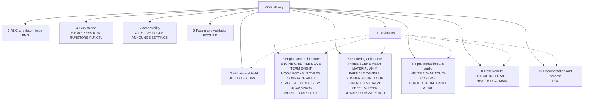

# Decision Log

This is the single source of truth for **why** this repository looks the way it
does. It covers the conversion of the canonical `gabrielecirulli/2048` into a
run-based, 2.5D roguelike with in-run relics: the TypeScript and Vite
toolchain, the split of the rules engine from the renderer, the six-hook relic
system, the seeded run RNG, the versioned run state, the Three.js renderer, the
screen flow, the accessibility layer and the observability surfaces.

An entry exists here when **a competent engineer could reasonably have chosen
differently**. That is the whole admission test. A choice with one sane answer
— that a merge of two equal tiles produces their sum, that a stylesheet is
compiled before it is served — earns no row. A choice where a second option was
genuinely defensible earns one, and says so in its own words.

Rationale lives here and nowhere else. A code comment in this repository
carries a contract, an invariant, an external constraint, an ordering or timing
constraint, or the provenance of a ported behaviour — never the reasoning
behind a choice. Where a module made a debatable choice, its comment states
*what* was decided and cites the identifier of the row below that argues it.
That division is itself a decision, recorded as `DL-DOC-05`.

Every row carries the four columns Rule 1 requires: **what was decided**, **what
alternatives existed**, **why this choice was made**, and **what risks it
carries**. No row has an empty cell. Where a decision genuinely carries little
risk, the risk column says so and says why, rather than reaching for a
platitude.

Deviations from a literal or obvious reading of the requirements are not
scattered through the tables. They are collected in
[§11 Deviations](#11-deviations), each with its own row, because an unexplained
deviation is a defect rather than an omission.

## How to cite this log

An identifier has the form `DL-<AREA>-<NN>`, for example `DL-RNG-01` or
`DL-ENGINE-04`. `<AREA>` names one concern; `CONTRIBUTING.md` carries the
complete registry of areas and the owning file of each, and every `DL-*`
identifier in the tree resolves to one of them. `<NN>` is a two-digit ordinal,
unique within its area.

Four rules govern the namespace, and they are binding because other files point
at these identifiers:

- **Identifiers are never renumbered and never reused.** Once `DL-STORE-02`
  names the best-score string contract, it names that and nothing else, for as
  long as the repository exists. A superseded decision keeps its number and
  gains a note; it does not free one up.
- **A new decision takes the next free ordinal in its area.** Ordinals are
  contiguous from `01` within each area, so the next free one is always
  discoverable by reading the area's table below.
- **A new area is added to the `CONTRIBUTING.md` registry in the same change
  that first uses it.** The registry is authoritative; a citation to an
  unregistered area is a broken citation.
- **A citation states what was decided and names the identifier.** It does not
  restate the alternatives, the reasoning or the risks. Those belong to the row.

`TR-<AREA>-<NN>` is a different namespace and resolves to
`docs/TRACEABILITY_MATRIX.md`, not here. It pairs a construct of the retired
`js/` sources with the module that carries it now. A row in this log may cite a
`TR-*` identifier as evidence; it never defines one.

Entries are grouped by theme so that a reader who knows the symptom can find
the decision. The eleven groups below extend the eight this log was
commissioned with — **Input, interaction and audio**, **Accessibility** and
**Observability** were separated out — because three hundred entries in eight
groups is a haystack, and findability is the point of grouping at all.
*Figure 1, Decision Categories and the Requirement Areas They Cover*, maps
those eleven groups to the area codes whose ordinals live in each, and is the
fastest way to turn an identifier you have found in the code into the section
that argues it.

The architecture itself is not documented here. `docs/architecture/` carries the
before-and-after architecture views, the component-interaction, data-flow and
hook-dispatch figures, and `docs/TRACEABILITY_MATRIX.md` carries the
construct-by-construct mapping from the retired `js/` sources to the modules
that replaced them. This log explains *why* those choices were made; those
documents show *what* the result is.

## Figure 1 — Decision Categories and the Requirement Areas They Cover

**Legend for Figure 1.** *Decision Categories and the Requirement Areas They
Cover* is a navigation map, not an architecture view — the architecture figures
live in `docs/architecture/`. The single root node is this document. A **solid
arrow** points to one thematic group of entries, labelled with the area codes
whose ordinals are argued inside it; those labels are the `<AREA>` segment of
every identifier in that group. A **dotted arrow** runs from the deviations
group back to an ordinary group, and means a deviation recorded in §11 also
belongs to that group's subject matter, so a reader who arrives at a deviation
can find the ordinary decisions surrounding it. The absence of a dotted arrow
to a group means no deviation touches it. Nothing in this figure implies a call
direction, an import or a runtime relationship.

## 1. Toolchain and build

The repository had no dependency manifest, no lockfile, no test runner and no
build step of any kind before this work. Every entry here is therefore a first
of its own, and the constraint every one of them answers to is the
static-deployment mandate: one install plus one build command must produce a
directory that is copied to a static host and served with no process running
behind it. That mandate has an economic root worth keeping in view — the project
is hosted on GitHub Pages precisely so that it costs nothing to host
(`README.md` §Donations at the source commit), and a build that needed a server
would spend money the project has never spent.

### 1.1 BUILD — the bundler, the runtime pin and the retired tooling

Owner: `vite.config.ts`. `DL-BUILD-11` is a deviation and is recorded in
[§11](#11-deviations); the next free ordinal in this area is `DL-BUILD-13`.

| ID | What was decided | Alternatives considered | Why this choice | Risks it carries |
|---|---|---|---|---|
| `DL-BUILD-01` | The root `index.html` is the whole entry graph. No SSR entry, API route or serverless adapter is configured, and none may be. | A framework preset with an SSR entry point; a serverless adapter for a hosting provider; a second HTML entry for the executive deck. | The deployment mandate is that `dist/` is copied to a static host and served with no process behind it. An SSR entry or an adapter would make the artifact depend on a runtime, which is the one thing the mandate forbids. A single HTML entry also keeps the emitted directory small enough to read. | The configuration cannot grow a second page without a deliberate change to `build.rollupOptions.input`; a contributor who adds one by adding a file will find it silently absent from `dist/`. The executive deck is outside the graph for this reason and is therefore never type-checked or bundled. |
| `DL-BUILD-02` | `dist/` is emitted with `sourcemap: false`. | Emitting a source map; emitting a hidden source map and uploading it to an error tracker. | Every file `dist/` carries is publicly reachable on the static host it is copied to. A map would publish the TypeScript sources and their comments beside the bundle, and it would resolve the file paths that `src/observability/logger.ts` deliberately redacts out of a stack trace, undoing that redaction at the exact moment it matters. | A production stack trace is unreadable without a local rebuild, so diagnosing a report from a user is slower. There is no error tracker to upload a hidden map to, so the usual escape hatch is unavailable. |
| `DL-BUILD-03` | The design-token projection reaches Dart Sass as source text through `css.preprocessorOptions.scss.additionalData`, and nothing is written into `style/`. | A generated `style/_generated-tokens.scss` written to disk by a prebuild step; a Sass custom importer resolving a virtual module; duplicating the values by hand on both sides. | A generated file on disk is a second committed artifact that nothing verifies, which is the exact defect that deleting the committed `style/main.css` closes — repeating it for tokens would reintroduce it. Delivering the projection as source text means the values exist in one place and the build cannot serve a stale copy. | A plain `sass style/main.scss` invocation prepends nothing, so the stylesheet must declare the projection variable `!default` and carry a fallback beside every token; the two sides can therefore disagree, which is why `style/_tokens.scss` raises a Sass `@error` when they do. The projection is invisible in the source, so a reader of `style/main.scss` alone cannot see where a token value came from. |
| `DL-BUILD-04` | Both the development server and the preview server bind `127.0.0.1` and no other interface. Binding a further interface is a per-invocation opt-in via `--host`. | Binding `0.0.0.0` by default, which is what a bare `vite` does in many setups; binding the container's address so a sibling machine can reach it. | A development server serves unminified sources and, with the diagnostics gate set, an in-page surface that exports logs and metrics. Defaulting to every interface publishes that to whatever network the machine is on, including a shared CI or container network, for no gain a developer asked for. | Testing on a phone or a second machine needs the flag, and a developer who does not know it exists will conclude the server is broken. Parallel clones must still offset the port numbers, which the binding does not solve. |
| `DL-BUILD-05` | Node is pinned to **24.19.0** in `.nvmrc`, with `package.json` `engines.node` declaring the floor `>=24.19.0` and `engines.npm` declaring `>=11.0.0`. | Staying on the pre-existing system Node 22; declaring a wider floor such as `>=20`; pinning `engines.node` to the exact version rather than a floor. | The binding constraint among the chosen packages is Vitest's `^20.0.0 \|\| ^22.0.0 \|\| >=24.0.0` branch, reinforced by jsdom's `^22.22.2 \|\| ^24.15.0 \|\| >=26.0.0`; 24 is the Active LTS line that satisfies both without landing on a version that is already ageing. `.nvmrc` carries the exact version so a version manager reproduces the environment, while `engines` stays a floor so a patch release of 24 is not rejected. | Contributors on 22 must upgrade before anything runs, and the failure they see first is an `engines` warning rather than a clear instruction. The pin needs maintenance as the LTS line moves, and nothing in the repository reminds anyone to do it. The floor-versus-exact split means `.nvmrc` and `engines` can drift apart with no check catching it. |
| `DL-BUILD-06` | Every dependency is pinned to an exact version — no caret, no tilde, no `latest` — and `package-lock.json` is committed. | Caret ranges, which are the npm default and take patches automatically; committing no lockfile, as the repository did for its entire prior history; a `.npmrc` with `save-exact` only, leaving existing ranges alone. | This repository has never had a reproducibility artifact of any kind, and the work it now carries includes a seeded snapshot suite whose whole value is that an identical input produces an identical output. A floating patch of a transitive dependency that changes a rounding path would present as a snapshot failure with no source change to blame it on. Exact pins plus a lockfile make the toolchain a fact rather than a resolution. | Security patches require a deliberate edit rather than arriving on the next install, so a known vulnerability can sit unpatched longer. The lockfile is a large generated file and is a frequent merge-conflict site. Exact pins also mean a peer-dependency conflict cannot resolve itself and must be fixed by hand. |
| `DL-BUILD-07` | `base: './'` — a relative base — with `build.outDir: 'dist'` and `build.assetsDir: 'assets'`. | A root-absolute `base: '/'`; a repository-named base such as `/2048/`; an environment-variable-driven base resolved at build time. | The artifact must work when copied to an arbitrary static host, and the project's own historical host serves from a repository subpath. A root-absolute base emits `/assets/...` URLs that 404 on a subpath host — the precise failure the mandate cannot tolerate — while a hard-coded repository name breaks every host that is not that one. A relative base resolves against wherever `index.html` actually sits, which is the only form that is correct on all of them. | A relative base is incompatible with client-side routing that rewrites the path, so if a router with real URLs is ever added the base must change with it. Relative asset URLs also break if `index.html` is moved to a different depth than the assets it references, which nothing in the build prevents. |
| `DL-BUILD-08` | Two TypeScript projects: `tsconfig.json` for the application sources and tests, and `tsconfig.node.json` for the four tooling configuration files. `npm run typecheck` runs both. | One configuration covering everything; leaving the tooling files unchecked, which is common and costs nothing until a config breaks; a third project for the test tree. | The tooling files run in Node, import from `vite`, `vitest` and `@playwright/test`, and need `types: ["node"]` and Node module resolution. The application runs in a browser with the DOM and WebGL lib set. One configuration would have to satisfy both, which means admitting Node globals into the application's type space — where a stray `process.env` would then type-check and fail at runtime in the bundle. | The two configurations can drift, and a file can fall between the two include sets and go unchecked entirely with no error to signal it. `typecheck` is two compiler invocations, so it is slower, and a contributor who runs `tsc` alone checks only half the tree. |
| `DL-BUILD-09` | `Rakefile` is deleted. | Keeping it beside the npm scripts, so both toolchains work; porting its task to an npm script. | Its only task, `appcache:update`, reads and rewrites `cache.appcache` — a file that does not exist anywhere on this branch, so the task raises before it does anything and has been inoperative for as long as this branch has existed. Its Ruby runtime was never pinned by a `Gemfile`, and no Ruby is present in the environment the project is now built in. Porting a task that has no target would port nothing. | A contributor following the pre-migration `CONTRIBUTING.md` will look for the file and not find it; that is mitigated by rewriting the relevant `CONTRIBUTING.md` guidance in the same change. If the `gh-pages` branch still uses the task, that branch loses it on any future merge from here — an accepted cost, since the appcache manifest itself is a retired platform feature. |
| `DL-BUILD-10` | `.jshintrc` is deleted, and the three conventions it encoded are carried forward: two-space indentation (`.jshintrc` L3), an 80-column line guide (L4) and camelCase identifiers (L6). | Keeping it as advisory documentation of house style; replacing it with an ESLint configuration; replacing it with Prettier. | Nothing ever executed it. The pre-migration `CONTRIBUTING.md` said only "if you install and run `jshint`", no script invoked it, and no CI existed to invoke it. Its options are ES5-era and several are meaningless for TypeScript. TypeScript `strict` plus the type-check gate now catch a strict superset of what it advised about correctness. | The style conventions it encoded could be lost, since a deleted file advises nobody. That is mitigated three ways: `CONTRIBUTING.md` now states the indentation, column and naming rules normatively; `tests/unit/quality/formatting.test.ts` enforces the mechanical whitespace invariants as an executable gate; and the compiler plus review hold column width and naming. Adopting no linter at all does mean no automated check on import order, unused locals beyond the compiler's, or naming. |
| `DL-BUILD-12` | The bundle is emitted as **one chunk**, with `chunkSizeWarningLimit` set to 950 kB — tracking the measured size rather than being switched off. | Splitting `three` into a vendor chunk for cross-deploy caching; setting the limit to `Infinity` or deleting it; lazy-loading the renderer behind a dynamic import. | A vendor split buys caching across deploys and costs a second request, and it would not silence the advisory anyway because the vendor chunk alone exceeds the default ceiling. One chunk keeps `dist/` the copy-and-serve directory the mandate asks for. Setting the ceiling near the measurement, rather than removing it, keeps the advisory useful: a chunk that grows past what the renderer needs still trips it. | The ceiling must be revisited whenever the reachable module set grows, and it has already moved twice for exactly that reason — 734 kB to 803 kB when the observability layer became reachable, and 803 kB to 930 kB when the relic subsystem and the tracer did. **It is stale again as measured at this commit: the emitted chunk is 984.35 kB minified and 270.52 kB gzipped, so the advisory fires on every build** — which is the state `DL-SHEET-04` warns about in general, a warning nobody fails on becoming a warning nobody reads. Under the stated policy the ceiling follows the measurement, so it should be raised to just above 984 kB; that is a one-value change to `vite.config.ts` deliberately not bundled into this documentation change. A single chunk also means a first visit downloads the renderer even in number-only mode. |

### 1.2 TEST — the unit and snapshot runners

Owner: `vitest.config.ts` and `vitest.snapshot.config.ts`. Next free ordinal:
`DL-TEST-07`.

| ID | What was decided | Alternatives considered | Why this choice | Risks it carries |
|---|---|---|---|---|
| `DL-TEST-01` | The unit tree is partitioned into two projects by the environment a suite needs: `unit:dom-free` on `node` for `tests/unit/{engine,config,rng,relics,...}`, and `unit:dom` on `jsdom` for every other directory, whose `include` is the whole tree with the first project's globs excluded. An unlisted directory is therefore collected by `unit:dom`. | One project on `jsdom` for everything; one project on `node` with a per-file `@vitest-environment` docblock wherever a document is needed; a project per top-level directory. | Running the DOM-free engine suites in `jsdom` would let a module reach for `document` and pass, which is precisely the property the engine/renderer split exists to guarantee. Making `unit:dom` the catch-all rather than an explicit list means a newly added directory is collected by default: the failure mode of forgetting a glob is a slower test, not a silently uncollected suite. | A DOM-free suite placed in the wrong directory runs with a document available and its isolation stops being tested. The two `include` globs must stay complementary; a mistake makes a file run twice or not at all. A file that genuinely needs the opposite environment relies on the per-file docblock override, which is easy to omit. |
| `DL-TEST-02` | No fake timer is installed and no global is replaced by the configuration. Suites that need to control time or a global do it locally. | Installing fake timers globally, which makes every timing assertion deterministic in one line; globally stubbing `localStorage`, `matchMedia` and `performance`. | A global fake timer changes the behaviour of every suite including the ones that never asked, and it makes the render loop, the audio scheduler and the announcement queue behave unlike production in ways that are hard to notice. Replacing globals centrally hides which suite depends on which capability, and the capability probes are themselves under test. | Each suite that needs time control repeats the setup, so there is duplication and a suite can get it subtly wrong. Timing-sensitive suites are more exposed to a slow machine than they would be under fake timers. |
| `DL-TEST-03` | `resolve.alias` is absent, matching `vite.config.ts`, so specifiers resolve the same way under test as under the build. | Adding a `@/` alias to shorten deep relative imports in both configurations; adding it in the test configuration only. | An alias present in one configuration and not the other means a module can import successfully under test and fail in the bundle, or the reverse. Keeping both empty makes a passing test a real statement about the shipped graph. The cost is only verbosity in import specifiers. | Deep relative paths such as `../../config/default-config` are noisier and a file move requires editing more specifiers. If an alias is ever added it must be added to both configurations in the same change, and nothing checks that. |
| `DL-TEST-04` | The snapshot write mode is left to Vitest's own resolution: `update` is unset in `vitest.snapshot.config.ts` and the `test:snapshot` script passes no flag, so the mode is `none` under CI and `new` otherwise. An existing snapshot is never rewritten by a normal run; re-recording is the explicit `vitest run --config vitest.snapshot.config.ts -u`. | Passing `--update` in the script, so drift always rewrites; setting `update: false` explicitly, which also blocks recording a genuinely new snapshot locally; running the gate with `--ci` forced on. | A snapshot suite that rewrites itself cannot detect the regression it exists to detect — a determinism break would present as a green run with a changed file. Leaving the resolution alone gives the two behaviours that are actually wanted: an unrecorded case records itself on a developer's machine, and nothing is ever rewritten in CI. | The behaviour depends on Vitest's CI detection rather than on anything stated in the repository, so a runner that does not set `CI` would allow a new snapshot to be recorded during an automated run. A legitimate change requires the deliberate `-u` step, and a developer who does not know that will read the failure as a bug. |
| `DL-TEST-05` | The seeded snapshot gate is kept in its own configuration and its own directory: `vitest.snapshot.config.ts` collects `tests/snapshot/*.spec.ts` — the top level only — and `vitest.config.ts` collects `tests/unit/**/*.test.ts` recursively and excludes `tests/snapshot/**`. Neither picks up the other's specs. | Keeping the snapshot specs inside the unit suite and distinguishing them by file name or tag; one configuration with two projects. | The requirement is that the seeded suite is runnable as an independent regression gate, which means one command that runs it and nothing else, and a failure that unambiguously means determinism moved. Folding it into the unit run would make a determinism break one red line among thousands, and would make it impossible to run the gate without also running everything else. | Two configurations must be kept consistent, and a spec can fall into neither `include` glob and silently never run — a real hazard, since the snapshot glob is deliberately non-recursive, so a spec in a subdirectory of `tests/snapshot/` is collected by nothing. Shared options are duplicated across the two files. |
| `DL-TEST-06` | `jsdom@30.0.1` is the DOM environment for the `unit:dom` project. `happy-dom@20.11.1` is pinned in `package.json` and used by nothing. | `happy-dom` as the environment, which is markedly faster to construct; no DOM environment at all, with every DOM-touching suite mocking the handful of interfaces it needs; removing whichever of the two is not selected. | The suites that need a document exercise focus management, `aria-*` reflection, `classList`, `matchMedia`, custom-property reads and a canvas element. jsdom's coverage of those is the more complete and the better documented, and a specification gap in the environment presents as a false failure that costs more to diagnose than the extra construction time costs to run. | jsdom is heavier and slower, and the whole `unit:dom` project pays that on every run. Neither environment implements layout, so both report no geometry — `src/ui/a11y/focus-manager.ts` therefore has to declare per-cell geometry explicitly rather than measure it. **Keeping both installed is itself a cost**: it is an unused direct dependency that must still be audited, patched and resolved, and its presence invites the belief that suites may choose either. It is retained only as the escape hatch if jsdom's cost becomes the binding constraint; if that has not happened, it should be removed. |

### 1.3 PW — the recorded-gameplay gate

Owner: `playwright.config.ts`. Next free ordinal: `DL-PW-04`.

| ID | What was decided | Alternatives considered | Why this choice | Risks it carries |
|---|---|---|---|---|
| `DL-PW-01` | Recording is unconditional: `video: { mode: 'on', size: VIEWPORT }` with a deliberate 1280x960 viewport, `outputDir: 'test-results'`, `workers: 1` and `retries: 0`. | `retain-on-failure`, which is the common CI default; `on-first-retry`; leaving `video.size` unset; running the default worker count. | The video is required as *positive proof* that a run happened, so a retention mode that keeps a video only when something failed produces no artifact on a green run and fails the gate on absence — the opposite of what is wanted. `video.size` must repeat the viewport because Playwright otherwise scales the frame into an 800x800 box, which shrinks the board below the point where a reader can see a merge animate, satisfying the mechanical half of the gate while failing its substantive half. One worker and no retries keep the capture from competing for CPU with a parallel test, which is the documented cause of choppy frames. | Every run pays the capture cost and stores an artifact, so the output directory grows and CI storage is consumed on runs nobody will watch. One worker makes the suite as slow as its serial sum. A fixed viewport records one layout only, so the mobile breakpoint is never in the evidence. |
| `DL-PW-02` | The base origin is asserted to be a loopback address at configuration load time, and the configuration throws before any run begins if it is not. | Asserting inside a test, so the failure is a test failure; not asserting at all and trusting the default. | The recorded run drives a real browser through a full game and captures video of whatever it is pointed at. Pointing it at a non-loopback origin by an environment mistake would record a deployed site rather than the working tree, and the artifact would look entirely valid. Failing at load is the only point at which nothing has been recorded yet. | A deliberate run against a remote origin — for a smoke test of a deploy, say — is impossible without editing the configuration. The assertion also runs when the configuration is merely loaded for listing tests, so a malformed environment blocks even `--list`. |
| `DL-PW-03` | Chromium is launched with `--enable-unsafe-swiftshader --use-gl=angle --use-angle=swiftshader`, and `chromiumSandbox: false`. | Default headless launch; `--use-gl=swiftshader` alone; `--disable-gpu`; running headed with a virtual framebuffer. | Headless Chromium in this container has no hardware GL, and without these flags a WebGL context either fails to create or yields a canvas that composites as a black rectangle. That failure is the dangerous one: the recording exists, has non-zero duration and passes every mechanical check while showing none of the three things the gate requires it to show. With the flags, a WebGL 2.0 context on ANGLE over SwiftShader was confirmed live in this environment. | Software rendering is slow, which is why the frame rate has to be treated as a variable rather than an assumption, and its output can differ subtly from hardware GL, so the video is evidence that the scene renders and not a pixel-accurate reference. `--enable-unsafe-swiftshader` is a flag whose own name says it is not for production use; it appears here only in a test configuration and must never migrate into an application default. Disabling the Chromium sandbox lowers isolation for the test browser and is acceptable only because it runs against a loopback origin serving the working tree. |

## 2. Engine and architecture

One move unlocked everything else: separating the rules from the view. The
pre-migration controller held a reference to the actuator and pushed a state
projection into it on every commit, so the rules could not be exercised without
a document. Inverting that — the engine emits, and the renderer, the relics, the
run controller and the observability layer subscribe — is what makes relics,
tests and a WebGL renderer reachable at all.

Two properties of the pre-migration sources made the inversion cheap rather than
invasive, and several entries below lean on them. The composition root injected
**constructors** rather than instances, so there was already one wiring site and
no scattered `new`. And the existing publish/subscribe bus was **append-only** —
`on()` pushed a callback onto an array keyed by event name, `emit()` walked the
array synchronously with a single argument and returned nothing. That
append-only shape is why an observer can attach beside the engine's own
consumers without editing a single engine file, and it is carried forward
rather than replaced.

### 2.1 ENGINE — the turn pipeline and state ownership

Owner: `src/engine/engine.ts`. `DL-ENGINE-04` is a deviation and is recorded in
[§11](#11-deviations); the next free ordinal is `DL-ENGINE-11`.

| ID | What was decided | Alternatives considered | Why this choice | Risks it carries |
|---|---|---|---|---|
| `DL-ENGINE-01` | The push call at `js/game_manager.js` L91-L97 becomes the `state:commit` event. The engine holds no view reference and calls no renderer. | Keeping the push call and giving the actuator a 3D implementation behind the same interface; emitting an event *and* keeping the push call during a transition period. | Reusing the actuator interface would have kept the rules engine holding a view, which is what makes the rules untestable without a document and what stops a second consumer — a relic, a run controller, an announcer — from seeing the same state. Keeping both paths temporarily would have doubled the state surface and left the question of which one is authoritative unanswered. The payload the actuator already received was a complete projection, so the event could carry exactly the same information and the change is a direction reversal, not a redesign. | Nothing forces a subscriber to exist, so a missing subscription is silence rather than a type error: an engine with no renderer attached plays a complete, invisible game. Ordering between independent subscribers becomes something the composition root is responsible for, and it is easy to attach one after `setup()` and miss the first commit — which is why `DL-MAIN-04` fixes that ordering explicitly. |
| `DL-ENGINE-02` | The two randomness call sites of the pre-migration sources — the spawn value at `js/game_manager.js` L71 and the spawn position at `js/grid.js` L41 — become draws on the `spawn-value` and `spawn-position` substreams. Those two were the only ones. | Installing a seeded generator over `Math.random` so every existing call site becomes seeded without being found; threading one generator through both sites as a single stream. | A full grep of the pre-migration tree found `Math.random` at exactly those two lines and nowhere else, which turns the substitution from a search-and-hope sweep into an audited, exhaustive change with a provable end. That audit is what justifies never touching the global: there was nothing else to catch. | The claim is only true of the sources as they were; a new `Math.random` call added anywhere later is invisible to the seeded contract and would break reproducibility silently. The guard against that is the dedicated test asserting `Math.random` is unpatched plus review, not the type system. |
| `DL-ENGINE-03` | The win literal at L170, the spawn distribution at L71, the start-tile count at L7 and the merge condition at L156-L157 are read from `RulesConfig` at use time. | Leaving them as literals and letting relics mutate engine fields directly; reading the configuration once into private fields at construction. | Relics and the base game have to read the same rules or a relic's effect is a special case in the engine, which the requirements forbid. Reading at use time rather than caching at construction is what lets a board-mutating cursed relic change the board edge mid-run and have the win and loss evaluations see the new value. | Every rule read is now an indirection, and a caller that caches a value defeats it — the reason `DL-TERM-03` states the same policy for the terminal-state module and `DL-CONFIG-02` states it for the configuration type. A malformed configuration is now a runtime failure mode the literals never had. |
| `DL-ENGINE-05` | The board snapshot read from storage reaches `setup()` as an **argument**. The persistence port is read only where no argument was supplied. | Having `setup()` read the port itself, as `js/game_manager.js` L36 did; requiring the argument always. | Passing the snapshot in makes every restore case constructible in a test without a storage double and without a document, which is what lets the fixture boards speak the product's own serialisation vocabulary. Keeping the port read as the fallback preserves the pre-migration behaviour exactly for the normal path. | Two ways to reach the same state means a caller can pass one snapshot while the port holds another, and the engine cannot tell which the user meant. The precedence — argument wins — has to be remembered rather than deduced. |
| `DL-ENGINE-06` | The persistence port is **injected and optional**, and its three snapshot calls are optional members, so a port carrying only the best-score pair satisfies it and an engine built without a port plays a complete game. | Requiring a full port, as the pre-migration constructor did by instantiating one; defaulting to an in-memory port. | The engine's own correctness does not depend on persistence, and forcing a port makes every unit test construct one. Optional snapshot members let the run system supply its own persistence for the envelope while the engine keeps the frozen best-score pair, without two competing writers of the board snapshot. | A silently absent port means a game that never saves and reports nothing about it, which is indistinguishable from a working save at the engine's boundary. Optional members mean the call sites need presence checks, and a partially implemented port is a legal value. |
| `DL-ENGINE-07` | The stage goal is evaluated where `onAfterMove` is dispatched, through `evaluateStageGoal` of `src/config/stage-config.ts`, and a met goal is resolved through `endStage()`. Stage handling has no pre-migration source. | Evaluating the goal in the renderer or the run controller, on the commit it observes; evaluating it inside the merge branch as the win check was. | Evaluating at `onAfterMove` puts the check at the one point where the turn is complete and the board is settled but the commit has not yet gone out, so the commit can carry the stage slice rather than the stage being discovered after the fact. Delegating the arithmetic to the config module keeps the goal vocabulary in one place and out of the engine. | The engine now knows a stage exists, which is a concept the classic game has no notion of; `DL-TYPES-03` is what keeps that from becoming a hard dependency by supplying a neutral frozen stage context. Evaluating on every settled turn is work done even in a run with no stage system attached. |
| `DL-ENGINE-08` | The run identifier and the correlation identifier are separate values. `runId` identifies the run instance and is what the run-state envelope persists; `correlationId` is what the observability layer keys records, counters and spans on, and is derived from the run seed and the run identifier together. The engine derives neither. | One identifier serving both purposes; deriving the correlation identifier inside the engine. | The persisted identifier and the telemetry key have different lifetimes and different exposure: the correlation identifier appears in logs and in an exported metrics snapshot, while the seed it is derived from is deliberately kept out of reported summaries. Collapsing them would either publish the seed or make the persisted identifier depend on the observability layer. Deriving in the engine would mean the engine reaching an observability module, which nothing in it does. | Two identifiers for one run is a real source of confusion, and a report that carries the wrong one is hard to spot because both are opaque strings. Every reporter and every dispatch context has to carry both, which widens those contracts. |
| `DL-ENGINE-09` | An accepted `onBeforeMove` board effect counts as a state change whether or not the slide that follows moves anything. A withdrawn move and an idle move that were preceded by an effect therefore re-derive the terminal verdict, commit, and resolve the stage — without spawning, which stays the pre-migration placement behind the moved test. | Treating only a positional change as a state change, as the pre-migration `positionsEqual` check did; also spawning after an effect, for symmetry with a real move. | A relic that clears a row or freezes a tile has changed the board even if the subsequent slide is a no-op, and a board that changed without committing leaves the renderer, the persisted envelope and the stage progress all stale. Withholding the spawn is deliberate: the spawn is the reward for a move that moved, and granting one for an effect would hand a free tile to a relic and change the pace of the game. | The rule that a commit can happen without a spawn is asymmetric and surprising, and a reader who assumes commit implies spawn will misread the pipeline. It also means a relic firing repeatedly on withdrawn moves can drive commits with no player progress. |
| `DL-ENGINE-10` | A spawn position is inserted only into a cell `Grid.cellAvailable()` reports free, checked at the engine's own insertion boundary after every hook transformation. The guard is deliberately **not** in `Grid.insertTile()`. | Guarding inside `insertTile()`, which would cover every caller at once; trusting the hook contract and not re-checking. | The merge branch of `src/engine/move-resolver.ts` requires `insertTile()` to overwrite — that is how a merged tile takes the target cell — so a guard there would break merging. Checking at the engine's boundary instead covers the one path where an untrusted value arrives, which is a position a relic transformed, without constraining the path that legitimately overwrites. | The invariant lives at a call site rather than in the data structure, so a future second insertion path could omit it. A relic that supplies an occupied position has its spawn silently suppressed rather than being told it was wrong, which is the right behaviour for the board and a poor one for the relic author. |

### 2.2 GRID and TILE — the lattice

Owners: `src/engine/grid.ts`, `src/engine/tile.ts`. Next free ordinals:
`DL-GRID-03`, `DL-TILE-02`.

| ID | What was decided | Alternatives considered | Why this choice | Risks it carries |
|---|---|---|---|---|
| `DL-GRID-01` | The `spawn-position` substream is **injected into** `randomAvailableCell` rather than reached as a module binding. | Importing the stream table into `grid.ts`; keeping `Math.random` here and seeding at a higher level. | An imported stream makes the grid depend on the RNG module and gives it a hidden global-ish source, so two grids in one process would share a cursor and a test could not isolate one. Injection keeps the grid a pure data structure whose randomness is a parameter, which is also what lets a fixture board be rehydrated with no generator at all. | Every caller must remember to pass the right substream, and passing `spawn-value` instead of `spawn-position` type-checks — the two have the same shape. That mistake breaks reproducibility silently and only a snapshot diff would show it. |
| `DL-GRID-02` | The restore walk is bounded by **this grid's own edge length**, not by the length the incoming snapshot implies. | Trusting the snapshot's dimensions and sizing the grid from them, which is what `js/grid.js` L21-L34 did; refusing a snapshot whose size disagrees. | A snapshot can legitimately carry a different edge length from the grid being built, because a board-mutating cursed relic changes the edge mid-run. Walking the target's bounds means a smaller grid cannot read past its own array and a larger one leaves the extra cells empty, so neither case can produce an out-of-bounds read or a phantom tile. Refusing the snapshot outright would make a mutated board unloadable. | Tiles outside the target bounds are dropped, which is real state loss the grid itself does not report — the reason the reconciliation in `DL-RUNSTORE-01` computes and records the outcome before a grid is ever constructed. A caller that builds the grid without going through that reconciliation loses the tiles without a record. |
| `DL-TILE-01` | `x` and `y` are flattened onto the tile, as `js/tile.js` L2-L3 had them, rather than held as a nested position object. | A nested `position` object, which reads better and matches the serialised shape; a class with a `Position` value object. | The persisted tile shape is `{ position, value }`, and the in-memory shape was flat; changing the in-memory shape would have changed the serialisation or required a translation layer at every boundary, for a readability gain only. Keeping it flat makes the port a transcription and keeps the traceability mapping one to one. | The in-memory and persisted shapes differ, so `serialize` and the restore path each perform a small reshape that a reader must notice. Passing a tile where a `Position` is expected type-checks structurally, since a flat tile satisfies `{ x, y }`. |

### 2.3 MOVE and TERM — resolution and terminal state

Owners: `src/engine/move-resolver.ts`, `src/engine/terminal-state.ts`. Next free
ordinals: `DL-MOVE-04`, `DL-TERM-05`.

| ID | What was decided | Alternatives considered | Why this choice | Risks it carries |
|---|---|---|---|---|
| `DL-MOVE-01` | The merge condition is split: the existence guard stays in this module, and the value comparison is `config.merge.canMerge`. | Keeping the whole condition — `next && next.value === tile.value && !next.mergedFrom` — as one inline expression, as L156 had it; moving the whole condition into the configuration including the existence check. | The existence and already-merged checks are properties of the traversal, not of the rules, and a relic has no business overriding whether a cell contains a tile. The value comparison is the part a relic or a variant rule legitimately changes. Putting the existence check into the configuration would make every configuration restate a traversal invariant and would let a bad configuration produce a merge with nothing. | The condition now reads in two places, so a reader has to look at both to know when a merge happens. A predicate that ignores its arguments can make everything or nothing merge, and the traversal cannot tell that is wrong. |
| `DL-MOVE-02` | The `onMerge` transformation arrives as an **injected callback**, so this module names no bus. | Importing the hook bus here and dispatching directly; emitting an event the bus listens for. | The resolver is the hottest code in a turn and the piece most worth testing in isolation. Naming the bus would make every resolver test construct one and would create a cycle in spirit — the bus dispatches into rules, the rules call the bus. A callback keeps the direction one-way and lets a test pass identity. | The callback's contract is expressed in its signature alone, so a caller can supply one that returns a payload the resolver did not expect; the validation that catches that lives in the bus, not here. A resolver used without the callback silently applies no relic effects. |
| `DL-MOVE-03` | The win test leaves this module for `src/engine/terminal-state.ts`. | Keeping it in the merge branch where `js/game_manager.js` L170 had it. | The win condition is a configured rule that must be re-evaluated when the configuration changes, and a check buried in the merge branch only fires on a merge — which is correct for the classic rules and wrong the moment a relic can raise a tile's value without merging, or lower the win value mid-run. | The check no longer sits next to the event that usually causes it, so the causal link is less obvious when reading the resolver. Evaluating terminal state separately is slightly more work per turn than a single equality inside a branch that was already taken. |
| `DL-TERM-01` | The win evaluation is relocated out of the merge branch into this module. | Leaving it at L170; evaluating it in the renderer from the committed board. | Same reason as `DL-MOVE-03`, stated from the receiving side: one module now owns both halves of the terminal question, so win and loss cannot disagree about which board or which configuration they read. A renderer-side evaluation would make the verdict a presentation concern and would differ between the two renderers. | A caller who forgets to evaluate gets a game that never ends, and nothing in the type system requires the evaluation to happen. |
| `DL-TERM-02` | The win test is **strict equality** against `config.winValue`. | A `>=` comparison, which sounds safer; equality against a set of accepted values. | Strict equality is what `js/game_manager.js` L170 did, and the difference is observable: with the classic doubling producer a tile passes exactly through the win value, so equality and `>=` agree — but a relic that adds to a value or a configuration whose win value is not a power of two can step over it, and `>=` would then declare a win the classic rules would not. Equality keeps the frozen rule frozen and makes any change to it an explicit configuration change. | A configuration whose win value is unreachable under its own merge producer can never be won, and nothing validates that combination. A relic that skips over the win value denies the player a win they would intuitively expect. |
| `DL-TERM-03` | The win value, the merge predicate and the board size are read at **use time**, never captured. | Capturing them at construction into private fields, which is faster and is the obvious shape for a module with no state. | A cursed relic mutates the board edge mid-run and a configuration change must be visible to the very next evaluation. A captured board size is the specific bug that lets a shrunk board still be probed at its old bounds, which reads tiles that are no longer there. | Every evaluation re-reads through the configuration object, so a caller that hands over a stale configuration gets a stale verdict with no indication. It is also marginally slower on the loss probe, which is the worst case in a turn. |
| `DL-TERM-04` | The loss probe reads the **configured merge predicate** rather than performing an equality comparison of its own. | Comparing neighbour values with `===`, mirroring the pre-migration probe; comparing values and separately consulting the predicate only when they differ. | A board is only lost when no move is available, and whether a move is available depends on what counts as a merge. A probe with its own equality test would declare a loss on a board where a relic's predicate still permits a merge — ending a run that was not over, which is the worst class of bug this system can have. | The predicate is now called up to sixty-four times in the worst case where an inline comparison was, so a predicate that is expensive or that has side effects is a performance and correctness hazard. A predicate that always returns `true` makes a loss unreachable. |

### 2.4 EVENT, HOOK and HOOKBUS — the emission and dispatch layers

Owners: `src/engine/engine-events.ts`, `src/engine/hooks.ts`,
`src/engine/hook-bus.ts`. Next free ordinals: `DL-EVENT-04`, `DL-HOOK-03`,
`DL-HOOKBUS-06`.

| ID | What was decided | Alternatives considered | Why this choice | Risks it carries |
|---|---|---|---|---|
| `DL-EVENT-01` | The board travels **by reference** on a commit. `BoardProjection` is declared as `Grid`, and `state:commit` carries the live lattice, exactly as the pre-migration view read `cells`, `previousPosition`, `mergedFrom` and `value` off the object it was handed. **This is settled, not open.** | An immutable projection built per commit — a deep copy or a frozen structural snapshot — which is unambiguously safer; a copy-on-read facade; emitting a serialised form and having subscribers rehydrate. | Reference-passing is the minimal-change choice and preserves the pre-migration information flow exactly, which is what makes the classic game verifiably unchanged move for move. The animation state the renderer needs — `previousPosition` and `mergedFrom` — is per-tile mutable bookkeeping that a projection would have to reproduce faithfully anyway, and a projection allocated on every commit adds garbage on the one path that runs every turn. | **Any subscriber can mutate engine state.** The renderer and the engine are coupled through a mutable aggregate, and a subscriber that writes to a tile produces a bug that surfaces somewhere else entirely and is very hard to localise. The mitigation is a convention, not a mechanism: **every subscriber must treat the committed board as read-only**, and the places that genuinely need to hand a board to untrusted code do not use this path — the hook bus gives a handler a query-only facade instead, and the run controller clones and freezes every projection that leaves it. A test asserts an observer cannot perturb engine state, which is the only automated guard. |
| `DL-EVENT-02` | The six lifecycle payloads resolve to the dispatch payloads of `src/engine/hooks.ts`, three of them widened by the `turn` correlation member alone. | Declaring an independent event payload set; reusing the hook payloads unchanged with no correlation member. | One declaration for both surfaces means a hook payload and the event carrying it cannot describe the same moment differently, which is the divergence that would otherwise appear the first time a member is added to one. The `turn` member is added because a subscriber sees the granular events and the commit separately and needs to know they belong to the same turn — the hooks do not, because a handler is inside the turn already. | The two surfaces are now coupled: a change made for a relic's benefit reaches every event subscriber. The partial widening means three payloads carry `turn` and three do not, which a reader has to look up rather than assume. |
| `DL-EVENT-03` | Per-listener error containment inside `emit`: a listener that throws is reported and the emission walks on, so one subscriber cannot abort an emission. | Letting the throw propagate, as the pre-migration `emit()` at L25-L32 did; collecting errors and rethrowing an aggregate after the walk. | A commit emission reaches the renderer, the HUD, the announcer, the run controller and the observability layer. An unhandled throw in any one of them would abort the rest mid-walk, leaving the board drawn and the run state unwritten, or the reverse — a torn state with no record of why. Rethrowing an aggregate afterwards would still fail the turn after having already half-applied it. | A throwing subscriber is now invisible to the player and visible only in a report, so a renderer that silently fails every commit looks like a frozen game with no error. Containment also means a genuinely fatal condition is downgraded to a log line. |
| `DL-HOOK-01` | The exact six mandated names — `onStageStart`, `onBeforeMove`, `onMerge`, `onSpawn`, `onAfterMove`, `onStageEnd` — are the whole hook surface. No seventh is declared. | Adding hooks the relic set would find convenient, such as an `onScore` or an `onRestart`; declaring a generic `onEvent` with a discriminator. | The six map one to one onto points that already existed in the pre-migration control flow, so each is a place where the engine genuinely has a decision to hand out. A seventh invented for one relic's convenience is a rule with one caller, and a generic hook would move the dispatch decision into every handler and defeat the charge guard and the payload validation. Sixteen relics were written against the six without needing a seventh, which is the evidence the surface is sufficient. | A future effect that does not fit one of the six has nowhere to go and will tempt someone into a widened payload instead of a new hook. The fixed set also means a hook fires for handlers that only care about a subset of its cases, so a handler starts with a discrimination step. |
| `DL-HOOK-02` | Two payload families: `HookPayloadMap`, which a handler receives with each live collaborator replaced by a capability view, and `HookDispatchPayloadMap`, which the engine dispatches with the live `Grid` and `Tile`. | One family carrying the live objects to handlers, which is simpler and is what `DL-EVENT-01` does for events; one family carrying views everywhere, which would deny the engine access to its own objects. | A relic handler is the one place untrusted code touches engine state, so it gets a query-only view of the board and frozen projections of the merging tiles — the board cannot be mutated and a `Tile` is never in a handler's hands. The engine dispatches live objects because it owns them and the bus needs them to apply an accepted transformation. This is the deliberate counterpart to `DL-EVENT-01`: the risk accepted for subscribers is refused for handlers, because a relic is third-party-shaped code and a subscriber is not. | Two families describing the same moment must be kept in correspondence, and the mapping between a live member and its view has to be maintained per hook. A handler author reads a different type from the engine author for the same payload, which is a genuine comprehension cost. |
| `DL-HOOKBUS-01` | The **charge guard lives in the bus**. A subscriber whose `charges` is present and not above zero is skipped before its handler is reached, and one deduction rule inside the bus is the only thing that writes a budget. A spend is *requested* during the handler through `HookContext.spendCharge()` and deducted only after the return validates. | Each relic guarding its own charges, which is the obvious reading of "relics with limited charges must stop firing"; a decorator applied at registration; deducting on entry rather than on accepted return. | One guard satisfies the zero-charge edge case for all sixteen relics at once, and it satisfies it for the seventeenth nobody has written yet. Sixteen hand-written guards is sixteen chances to get it wrong, and the failure mode — a relic that fires with no charges and corrupts run state — is exactly what the requirement forbids. Deducting only on an accepted return is what makes a handler that asked and then threw, or whose return was refused, leave the budget where it stood. | Relic authors may assume a handler can read or rely on a decremented count, so the ownership boundary has to stay documented: a handler never reads, compares or writes a budget, and a dispatch that asked for nothing spends nothing. Centralising also means a relic cannot express a non-uniform cost without the bus learning about it. |
| `DL-HOOKBUS-02` | A pickup-order index decides dispatch order. The backing array is held in that order by insertion, so a dispatch neither copies nor sorts it, and an edit arriving during a dispatch is deferred until the walk returns. | Dispatching in registration order and relying on registration happening in pickup order, which is what the pre-migration bus did implicitly; sorting on every dispatch; declaring order undefined. | The requirement is that two relics on one hook both fire *in pickup order* and compound, so order is a contract rather than an accident, and relying on registration order would make a change in the composition root silently reorder gameplay. Holding the array in order by insertion means the guarantee costs nothing per dispatch. Deferring concurrent edits is what stops a handler that grants or removes a relic from mutating the array being walked. | Deferred edits mean a relic acquired during a dispatch does not fire on that dispatch, which is defensible but has to be known. An explicit index is a second source of truth beside array position, and the two must not drift. |
| `DL-HOOKBUS-03` | The compounding return protocol: a handler receives the payload the handler before it returned, and a handler that returns nothing leaves that payload as it stands. | Ignoring return values and requiring in-place mutation; giving every handler the original payload and merging the results afterwards. | Compounding is what makes "two `onMerge` relics compound correctly" mechanically true rather than a property of how the relics happen to be written. Treating a missing return as a no-op means an observer-only handler needs no ceremony, which is the common case. Merging results afterwards would need a conflict rule per member and would make the outcome depend on an arbitration policy rather than on pickup order. | Order now changes outcome, so the same two relics in the other pickup order can produce a different board — intended, but it makes reasoning about a loadout harder. A handler that mutates its argument in place instead of returning is a silent no-op, which is why the bus hands over a copy rather than the live payload. |
| `DL-HOOKBUS-04` | Error isolation: a handler that throws is caught, reported through the injected reporter, and its subscriber is **marked degraded**; the dispatch continues and returns the payload as it stood. A degraded subscriber is then skipped, and `degraded()` reports the set separately from the exhausted set. | Letting the throw propagate and fail the turn; catching and continuing without marking, so the relic retries every turn; disabling the whole relic system on the first fault. | A throw inside a hook happens in the middle of a move. Letting it propagate aborts the turn part-applied and can leave the board inconsistent, which is a worse outcome than losing one relic's effect. Marking degraded rather than merely catching stops a broken relic from throwing sixty times a minute and burying the log that would explain it. | A relic can stop working while the game looks fine, so a player perceives a dead relic and no error. Degradation is sticky, so a transient fault costs the relic for the rest of the run. Containment can also mask a bug in the engine itself, since the bus cannot tell whose fault the throw was. |
| `DL-HOOKBUS-05` | Dispatch tracing arrives as an **injected wrapper** whose own faults are contained: the wrapped work runs exactly once, its value and its throw pass through unchanged, and a contained fault is counted under `engine.hook.tracing.fault`. | Importing the tracer into the bus; making tracing a required collaborator; letting a tracing fault propagate. | Importing the tracer would put an observability dependency inside the engine, which nothing under `src/engine` has — the property `DL-MAIN-05` and `DL-MAIN-07` exist to preserve. Containing the wrapper's own faults matters because instrumentation must never be able to change the outcome of a turn: a tracer that throws would otherwise convert a working move into a degraded relic. Running the work exactly once is stated explicitly because a naive wrapper that retries on its own failure would double-apply an effect. | An unwired wrapper means no spans, and the absence looks identical to a quiet system — the same hazard `DL-MAIN-07` names. A contained tracing fault is counted but does not fail anything, so a permanently broken tracer can go unnoticed except as a rising counter. |

### 2.5 TYPES — the shared engine contracts

Owner: `src/engine/types.ts`. Next free ordinal: `DL-TYPES-06`.

| ID | What was decided | Alternatives considered | Why this choice | Risks it carries |
|---|---|---|---|---|
| `DL-TYPES-01` | The persisted snapshot types reproduce the pre-migration `gameState` shape member for member: tile as `{ position, value }`, grid as `{ size, cells }`, manager as `{ grid, score, over, won, keepPlaying }`. | Designing a cleaner persisted shape and migrating old saves on read; versioning the board snapshot itself. | A best score and a board written by the classic game must still load, and the run-state envelope wraps this shape verbatim rather than reshaping it, so the shape is a frozen external contract. Reproducing it member for member also keeps the traceability mapping one to one, which is what lets the matrix claim complete coverage. | The persisted shape carries the pre-migration idiosyncrasies permanently, including a member name that no longer matches the in-code name — the mismatch `DL-ENGINE-04` exists to explain. Improving the shape later needs a real migration this repository has no precedent for. |
| `DL-TYPES-02` | `BestScoreValue` is derived from the persistence port's own return type rather than widened to `string \| number`. | Declaring it `string \| number`; declaring it `number` and coercing at the boundary. | The port returns the raw stored **string** when a value is present and the number `0` when it is absent, and the promotion comparison depends on that. Deriving the type from the port means the type states the real contract, and a future change to the port propagates as a type error rather than as a silent behaviour change. Widening to `string \| number` would describe values the port never returns and would make the frozen contract look like a loose union somebody should tidy up. | The type is unusual enough to look like a mistake, which is precisely the invitation to "fix" it that `DL-STORE-02` warns about. It also couples the type to the port's declaration, so reading the type requires following it. |
| `DL-TYPES-03` | The neutral stage and relic contexts are declared here as **frozen constants**, so the engine is constructible with no run system at all. | Making the stage and relic contexts required constructor arguments; allowing them to be `undefined` and checking at every use. | The classic game has no stages and no relics, and the requirement is that the base game plays identically. A neutral frozen default means the engine needs no run system to be complete and no branch at each use site, and freezing them means a caller cannot mutate the shared default into a non-neutral one. | A caller who forgets to supply a real context gets a silently stage-less, relic-less run rather than an error. The frozen defaults are shared, so any code that expects to write to a context must be given its own. |
| `DL-TYPES-04` | A correlation identifier is accepted as **a value or a reader**, so a reporter constructed once follows the run in force rather than the run its construction happened in. | Accepting a value only and reconstructing every reporter on each new run; mutating a shared identifier the reporters hold by reference. | Reporters are constructed once at composition and live for the session, while runs start and end repeatedly. A captured value means every record after the second run carries the first run's identifier, which quietly makes the whole correlation story wrong. Reconstructing every reporter per run would mean re-wiring the graph at run boundaries and is easy to get half-right. | The union means every read site must resolve the identifier rather than use it, and a site that forgets reintroduces the capture bug for that one field. A reader whose backing scope is rotated at the wrong moment attributes records to the adjacent run, and nothing detects an off-by-one there. |
| `DL-TYPES-05` | `Direction` is declared **locally in two places** — `src/engine/types.ts` and `src/input/keymap.ts` — as two identical `0 \| 1 \| 2 \| 3` declarations, deliberately mutually assignable, so the engine never imports the input folder. | A shared types module both import; the engine importing the input declaration; the input layer importing the engine declaration. | The engine must not depend on an input layer, and the input layer must be usable without the engine. A shared module would be a third package that exists to hold four numbers, and either import direction creates a dependency the architecture is specifically arranged to avoid. Structural typing makes the two interchangeable at every boundary at no runtime cost. | **The two declarations can drift silently.** Structural assignability catches a change in the set of literals but not a change in meaning — if one side reinterpreted `1` as left, both would still type-check and the game would move the wrong way. The mapping is held only by the shared comment convention and by tests that assert the direction encoding, not by the compiler. |

### 2.6 CONFIG, DEFAULT and STAGE — the externalised rules

Owners: `src/config/rules-config.ts`, `src/config/default-config.ts`,
`src/config/stage-config.ts`. Next free ordinals: `DL-CONFIG-03`,
`DL-DEFAULT-04`, `DL-STAGE-04`.

| ID | What was decided | Alternatives considered | Why this choice | Risks it carries |
|---|---|---|---|---|
| `DL-CONFIG-01` | The merge rule is a replaceable **predicate and producer pair**: `canMerge` decides, `produce` computes the result. | A single function returning the merged value or `null`; a declarative descriptor such as `{ operation: 'double' }` the engine interprets; a multiplier number. | Splitting the decision from the arithmetic is what lets a relic change one without the other — a relic that permits unequal tiles to merge changes only the predicate, and one that triples instead of doubling changes only the producer. A combined function forces a relic to reimplement the half it does not care about. A declarative descriptor would need the engine to grow a case per operation, which is the engine-side special-casing the requirements forbid. | Two functions can disagree: a predicate that permits a merge the producer cannot compute a value for is representable and nothing rejects it. Functions in configuration also mean the configuration is not plain JSON and cannot itself be persisted, which is why the stage ladder is deliberately kept separate and plain. |
| `DL-CONFIG-02` | Every member of the configuration is declared **mutable** and is read at each use. | A deeply `readonly` type, which is the default instinct for a configuration object; readonly with a copy-on-write update helper. | A board-mutating cursed relic changes `boardSize` during a run, so the type has to admit the write that actually happens rather than force a cast at the one place that matters. Declaring it readonly and casting would put a lie in the type and hide the mutation. Reading at each use is what makes the mutation take effect. | The type no longer warns anybody away from writing to the configuration, so an accidental write from anywhere type-checks and silently changes the rules. The guard is that only the board-effect path is supposed to write, and that guard is a convention plus tests, not the compiler. |
| `DL-DEFAULT-01` | Five defaults reproduce the pre-migration behaviour exactly: board size 4, win value 2048, two start tiles, spawn values `[2, 4]` at weights `[0.9, 0.1]`, and a merge predicate of equal-and-not-already-merged with a doubling producer. | Choosing "better" defaults for a roguelike — a smaller board, a lower win value, a different spawn mix — since the game is no longer only the classic one. | The delivery requirement is that the first phase plays identically to the classic game from the player's perspective, and the seeded snapshot suite compares against classic board sequences. A single changed default would make every one of those comparisons meaningless and would remove the only baseline available for proving the port correct. | The defaults are now load-bearing for the test suite as well as for the game, so changing one is a much bigger act than it appears — it invalidates recorded snapshots. Nothing in the file says that out loud to a reader who only sees five constants. |
| `DL-DEFAULT-02` | `MAX_BOARD_SIZE` is 16, and it is the one board-edge ceiling every allocating module measures against. | No ceiling, trusting configuration and persisted state; a per-module ceiling sized to each allocation; a much lower ceiling such as 8. | The board size arrives from configuration, from a persisted envelope and from a cursed relic's state slot, so it is effectively untrusted input on the restore path, and it drives array allocation, mesh instancing and a per-cell parallel DOM. One shared ceiling means a hostile or corrupted value is refused once rather than being caught by whichever allocator happens to check. 16 is high enough that no plausible variant reaches it and low enough that the worst case stays allocatable. | The number is arbitrary at the margin and will look wrong to anyone who wants a 20-wide board; raising it requires re-checking every allocation it protects. A single ceiling also cannot express that the parallel DOM is far more expensive per cell than the engine's array. |
| `DL-DEFAULT-03` | `createDefaultRulesConfig()` returns a **fresh object per call**, and a separate deeply frozen template constant carries the same values for comparison. | Exporting one shared mutable configuration object; exporting only the frozen template and requiring callers to clone. | Because `DL-CONFIG-02` makes the configuration mutable and a cursed relic writes to it, a shared object would leak a mutated board size from one run into the next and, worse, from one test into every subsequent test in the file. A fresh object per call makes each run and each test independent. The frozen template exists so a test can assert the defaults have not moved without having a mutable copy to compare against. | A caller that hoards the result and a caller that re-reads it will disagree after a mutation, and neither is obviously wrong. Two representations of the same defaults must be kept in step; the guard is a test comparing the factory output against the template. |
| `DL-STAGE-01` | Two goal kinds, `'highest-tile'` and `'score-threshold'`, are the whole goal vocabulary. | A single kind, since either can express progress; an open expression language; a predicate function per stage. | Two kinds cover the two things a 2048 board actually measures, and they measure different axes — a player can reach a high tile on a low score and the reverse — so a ladder can vary the demand rather than repeating it. A predicate function would make a goal unpersistable, which `DL-STAGE-03` needs it to be, and an expression language is a parser and a security surface for no gain. | A goal nobody can express — clear a stage in N moves, reach a tile without merging — needs a new kind and a new persisted variant, which is a migration. Two kinds also mean the progress display has two shapes to render. |
| `DL-STAGE-02` | The goal is evaluated at `onAfterMove` and resolved at `onStageEnd`. | Evaluating and resolving at the same point; evaluating on the commit, from outside the engine. | Splitting them separates the question from the consequence: evaluation is cheap, happens every settled turn, and only reads; resolution advances the stage, opens a reward draw and writes run state, and must happen once. Fusing them would resolve inside the move pipeline, so a reward draw would run while the turn was still being applied. | Two points mean a goal can be met and then not resolved if the resolution path is not reached, leaving a stage that is complete and still current. The split also means the commit that carries the met goal precedes the stage end, so a subscriber sees them in that order and must not assume the reverse. |
| `DL-STAGE-03` | The stage ladder is expressed as **plain-JSON configuration**, so a goal persists verbatim in the run-state envelope. | Expressing a goal as a predicate function, matching how the merge rule is expressed; persisting a stage index alone and re-deriving the goal from code on load. | A resumed run must show the same goal it was showing before the reload, and the guarantee is strongest if the goal itself is what was stored rather than something re-derived from a code path that may have changed between sessions. A function cannot be serialised, so a functional goal would force re-derivation and would silently change an in-progress run's target whenever the ladder was edited. | The ladder cannot express a goal that needs computation, which is the same limit `DL-STAGE-01` accepts. A persisted goal can also outlive its own kind, so the loader has to treat an unrecognised kind as data it does not understand rather than as corruption. |

### 2.7 RELIC, REGISTRY and DRAW — the relic system

Owners: `src/relics/relic-types.ts`, `src/relics/relic-registry.ts`,
`src/relics/relic-draw.ts`. Next free ordinals: `DL-RELIC-04`,
`DL-REGISTRY-04`, `DL-DRAW-04`.

| ID | What was decided | Alternatives considered | Why this choice | Risks it carries |
|---|---|---|---|---|
| `DL-RELIC-01` | Relic behaviour lives in **hook-bound handler functions**, not in members of the data object. The `Relic` type declares exactly the seven mandated fields — `id`, `name`, `rarity`, `description`, `hooks`, optional `charges`, optional `state` — and `hooks` maps a hook name to a handler. | A purely data-driven design where a relic declares members such as `spawnValueMultiplier` or `mergeBonus` that the engine interprets; a class hierarchy with a base relic and a subclass per behaviour. | The documented failure mode of naive data-driven design is that every object converges on one ever-widening property set and differs only by values, at which point the engine contains a branch per property and adding a relic means editing the engine — which the requirements explicitly forbid. Handlers keep the engine ignorant of every individual relic. Inheritance was rejected because composition is the established pattern for systemic games and a relic frequently belongs to two hooks at once, which a single-inheritance chain models badly. | Handlers are code, so a relic is not authorable by a designer editing data, and the sixteen relics cannot be tuned without a rebuild. Handler code also runs inside a turn, which is why the containment in `DL-HOOKBUS-04` and the query-only views in `DL-HOOK-02` exist. |
| `DL-RELIC-02` | The persisted relic carries the identifier, the charge budget and the state slot, and nothing else. | Persisting the whole relic including its name, rarity and description; persisting only the identifier and re-deriving charges from the catalogue. | Name, rarity, description and handlers are properties of the catalogue, not of the run, and persisting them would freeze a copy that goes stale the moment a description is corrected. Charges and state are genuinely per-run and cannot be re-derived. The narrow shape also keeps the envelope small, which matters because it is written on every commit. | A relic removed from the catalogue leaves a persisted identifier that resolves to nothing, so the loader must tolerate an unknown relic rather than fail. A renamed identifier silently loses the relic and its charges from an in-progress run. |
| `DL-RELIC-03` | Family membership is modelled **outside** the `Relic` type: `RELIC_FAMILY_NAMES`, `RelicFamilyName` and `RelicFamily { name, relics }` express it, and each family module exports its own group. | A `family` field on `Relic`, which is the obvious modelling and makes membership self-describing; a lookup map from identifier to family maintained beside the catalogue. | The mandated data shape has exactly seven members, and the requirement quotes them; adding an eighth would break the contract the requirement states verbatim. Grouping by module and exporting a family record keeps membership expressible without touching the relic shape, and it makes the four-per-family balance visible in the file layout. | Membership becomes structural rather than intrinsic, so **moving a relic between modules changes its family silently** — no field changed, no test necessarily fails. A relic reached directly rather than through its family record has no family at all, and the draw's rarity weighting has to be careful not to assume otherwise. |
| `DL-REGISTRY-01` | The registry is the only construct that names a relic. No engine, renderer or UI module branches on a relic identifier. | Letting the renderer special-case the visual of a named relic; letting the engine handle one awkward relic directly; a switch on identifier in the reward screen. | The requirement is explicit that the engine contains no special-casing for any individual relic, and the moment one module branches on an identifier the property is gone and the next exception is easier to justify than the first. Confining naming to the registry means the sixteenth relic and the first cost the same to add. | Anything genuinely relic-specific must be expressed as data the relic carries, which occasionally means a more abstract mechanism than a direct branch would have been. The rule is a convention enforced by review and by a test that no module outside `src/relics` names an identifier, not by the compiler. |
| `DL-REGISTRY-02` | One registration per relic, carrying its whole handler table, one charge budget and one state slot. | One registration per hook a relic binds, which maps more directly onto the bus; one registration with a handler table but charges tracked per hook. | A relic is one thing with one pickup position, one budget and one piece of state; splitting it per hook would give a two-hook relic two pickup positions and two places a budget could be written, and the charge guard would then have to decide which of them a spend came out of. One registration keeps the pickup-order guarantee and the single-writer charge rule coherent. | A relic bound to several hooks shares one budget across all of them, so it cannot spend differently per hook without the bus learning about that. The registration is also a wider object than any single dispatch needs. |
| `DL-REGISTRY-03` | Every read refreshes the registry's records from `HookBus.subscribers()` before reporting them. | Holding the registry's own copy as authoritative and updating it on each mutation; reading only from the bus and keeping no records at all. | The bus owns charges, degradation and pickup order, and it writes them during a dispatch. A registry copy would be a second source of truth that goes stale the instant a charge is spent, so anything reading it — the HUD tray, the diagnostics surface, the persisted relic list — would display or save a number that is already wrong. Refreshing on read makes the bus the single writer. | Every read walks the subscriber set, so a caller reading in a loop pays for it repeatedly. It also means the registry cannot report anything the bus does not expose, so the two contracts are coupled. |
| `DL-DRAW-01` | Reward offers are produced by rarity-weighted sampling **without replacement** from the eligible pool. | Three independent weighted draws with a retry-on-duplicate loop; three independent draws with duplicates simply allowed; shuffling the whole pool and taking three. | Sampling without replacement makes "never offer duplicate relics in the same set of three" structural rather than a property of a loop that happens to terminate. A retry loop is the specific alternative that had to be rejected: it consumes a variable number of draws depending on which relics come up, so the substream cursor advances unpredictably and the same seed stops producing the same later spawns — it would trade the duplicate guarantee for the reproducibility guarantee. | The eligible pool can be smaller than three late in a run once relics have been taken, so the offer count has to degrade gracefully rather than assume three. Sampling without replacement also makes the second and third picks' effective weights depend on the first, so the advertised rarity odds are only exact for the first card. |
| `DL-DRAW-02` | Exactly two substreams are consumed — `rarity-weight` and `relic-draw` — and no others. | Drawing everything from one relic substream; adding a third substream for the offer size. | Separating the tier choice from the choice within a tier means adding a relic to one tier does not shift the tier sequence, so a previously recorded seeded offer sequence survives a catalogue addition in a different tier. Confining the draw to two named substreams is also what makes the reproducibility claim auditable: there are exactly two cursors to check. | A future draw that needs a third random input has to reuse one of the two and will perturb its cursor, invalidating recorded snapshots. The split also means the two cursors must both be persisted and restored or the offer sequence diverges. |
| `DL-DRAW-03` | Exactly one draw is taken from each substream per offer **returned**. | Drawing per offer *attempted*, which is the natural shape if any filtering or rejection happens; drawing once for the whole set. | Tying consumption to what is returned makes the cursor arithmetic predictable from the visible outcome: three cards means three draws from each stream, so a snapshot's cursor can be reasoned about without knowing the pool's internal state. Drawing per attempt would leak pool composition into the cursor and reintroduce the variability `DL-DRAW-01` rejected the retry loop for. | The implementation must not take a draw and then discard the result, and nothing in the type system prevents that; the guard is the snapshot suite noticing a cursor that moved further than the offer count explains. |

### 2.8 SPAWN, MERGE, BOARD and RISK — the four relic families

Owners: `src/relics/families/spawn-control.ts`, `merge-magic.ts`,
`board-manipulation.ts`, `risk-reward-cursed.ts`. Sixteen relics, four per
family. Next free ordinals: `DL-SPAWN-03`, `DL-MERGE-03`, `DL-BOARD-03`,
`DL-RISK-03`.

| ID | What was decided | Alternatives considered | Why this choice | Risks it carries |
|---|---|---|---|---|
| `DL-SPAWN-01` | Each spawn-family relic acts through the `onSpawn` payload's `value`, `position` and `count` members alone — `twin-seed`, `fertile-ground`, `prospectors-eye` and `loaded-dice`. | Letting a spawn relic insert tiles directly into the grid; giving each relic its own bespoke payload member. | Three transformable members cover every spawn effect the family needs — what spawns, where, and how many — and confining the family to them means the engine's insertion boundary is the only thing that writes tiles, which is what `DL-ENGINE-10` needs in order to guarantee a spawn never lands on an occupied cell. Direct insertion would put four more writers on the lattice. | Three members bound the family: an effect that depends on what spawned *last* turn has to carry that in the relic's own state slot rather than reading it from the payload. A relic returning a `count` above the free-cell count needs the engine to clamp it, which is a rule the relic cannot see. |
| `DL-SPAWN-02` | Every value and position a spawn relic supplies is drawn from the **same** `spawn-value` and `spawn-position` substreams the base game already consumes. | Giving spawn relics their own substream so they cannot perturb the base sequence; letting a relic use any stream it likes. | These relics change the base game's spawn, so their draws are part of the same causal sequence; giving them a private stream would mean the same seed produced a different base spawn sequence depending on which relics were held, in the stream that is supposed to be the base game's. Reusing the base streams keeps one coherent spawn history per run. | A run with spawn relics and a run without diverge in the `spawn-value` and `spawn-position` cursors, so a snapshot is only comparable against a run with the same loadout — which is why the snapshot fixtures pin the loadout explicitly. |
| `DL-MERGE-01` | All four merge-family relics bind `onMerge` alone — `echo-chamber`, `alloy-forge`, `frostbind` and `chain-catalyst`. | Binding some of them to `onAfterMove` as well, so a merge effect could look at the settled board; binding to `onBeforeMove` to pre-arrange a merge. | `onMerge` fires once per merge and carries both merging tiles and the result, which is the complete information a merge effect needs. Adding `onAfterMove` would let the same relic fire twice for one conceptual effect and would make the compounding order across two hooks something an author had to reason about. Keeping the family on one hook makes "two `onMerge` relics both fire and compound" directly demonstrable. | An effect that genuinely needs the settled board — counting how many merges happened this turn, say — cannot be written in this family without carrying state across dispatches. A four-merge turn fires each of these relics four times, which multiplies their effect in a way a per-turn effect would not. |
| `DL-MERGE-02` | `scoreDelta` is transformed **independently** of `resultValue`, because they are separate payload members. | Deriving the score from the result value, as the classic rules do where the score gain equals the merged value; exposing one member and computing the other. | Separating them is what lets a relic grant score without changing the tile, or raise a tile without granting score — two distinct and desirable effects that a derived score cannot express. It also keeps the classic relationship as a default rather than as a law, which is the whole point of externalising the rules. | The two can be made inconsistent: a relic can double the result value and leave the score, so the on-screen score no longer explains the board. Nothing validates the relationship, deliberately, so a balance error is invisible to the type system. |
| `DL-BOARD-01` | The four charge-carrying relics declare a budget and mark a successful invocation through `HookContext.spendCharge()` **without reading, comparing or writing the count** — `temporal-anchor`, `tumbler`, `culling-blade` and `scouring-wind`. | Each relic reading its own `charges`, comparing it to zero and decrementing; a shared helper the relics call to do the same. | This is the relic-side half of `DL-HOOKBUS-01`. If a relic could read the count it would be tempted to branch on it, and then the zero-charge guarantee would depend on four correct implementations rather than one. Requesting a spend and letting the bus decide keeps a single writer and makes the zero-charge case unreachable from a handler rather than merely handled by it. | A relic cannot present its own remaining charges to the player from inside its handler; the HUD reads them from the registry instead. An author who expects `spendCharge()` to have taken effect by the next line is wrong — the deduction happens after the return validates — and that ordering has to be known. |
| `DL-BOARD-02` | Each board effect is carried by a **transformable payload member**, by the relic's **own persisted state slot**, or by a `context.effects` command the engine applies. Nothing writes the lattice or the rules directly. | Letting a board relic mutate the grid it was handed; giving the relics a privileged mutable board view. | These four relics are the ones that most obviously want to write to the board — undo, shuffle, excise, clear a row — so they are exactly where a direct-write exception would be most tempting and most damaging. Routing every effect through a command the engine applies keeps the engine the single writer, keeps the effect visible to the commit that follows, and makes `DL-ENGINE-09` able to treat an accepted effect as a state change. | Three routes for an effect means an author has to pick the right one, and the wrong choice can be silently ineffective — a write to a payload member the engine does not read does nothing. A command vocabulary also has to grow for each genuinely new kind of board change. |
| `DL-RISK-01` | `collapsing-vault` declares the edge length it implies **in its own persisted state slot**, and `src/run/run-state-store.ts` reconciles that before any grid is constructed. | Writing the new board size straight into the configuration and relying on the configuration being persisted; recomputing the implied size on load from the stage count. | The mutated board size has to survive a reload, and the configuration is not what gets persisted — the run-state envelope is. Putting the implied edge in the relic's own state slot means the size travels with the relic that caused it, so the loader can reconcile the saved board, the configured size and the relic's claim in one place with a stated precedence rather than guessing. Recomputing from the stage count would break the moment the relic was acquired mid-ladder. | The board size now has three possible sources on the restore path, which is genuinely complex and is why `DL-RUNSTORE-01` exists to state the precedence. A state slot that disagrees with the saved board means tiles are dropped, and the player sees that as lost progress. |
| `DL-RISK-02` | Each cursed effect is paid for through a transformable payload member or a `context.effects` command the engine applies. | Letting a cursed relic apply its penalty directly, since a penalty is arguably the engine's business anyway. | A curse is an effect like any other, and the reasons in `DL-BOARD-02` apply unchanged — the engine stays the single writer and the commit sees the result. Treating penalties as privileged would create a second effect path whose ordering against the compounding protocol would be undefined. | A curse whose penalty cannot be expressed as a payload transformation or a known command cannot be written, which constrains the design space of future cursed relics. |

## 3. RNG and determinism

The reproducibility guarantee is that the same seed plus the same move list
yields an identical board **and** identical relic offers, across repeated runs
and across a reload. Everything in this group exists to make that mechanical.

The change was auditable rather than speculative: the pre-migration sources
called `Math.random` at exactly two places, the spawn value and the spawn
position, and nowhere else in the entire thirty-four-file tree. Substituting a
seeded source was therefore a change with a provable end, which is what
justifies never touching the global — there was nothing else to catch.

Owner: `src/rng/seeded-rng.ts` and `src/rng/rng-streams.ts`. Next free ordinal:
`DL-RNG-07`.

| ID | What was decided | Alternatives considered | Why this choice | Risks it carries |
|---|---|---|---|---|
| `DL-RNG-01` | The generator is **always a local instance and is never installed onto `Math.random`**. It is constructed as `seedrandom(seed, { state: true })`, and a dedicated test asserts `Math.random` is unpatched. | The library's `{ global: true }` mode; calling the library without `new`, which has the same global effect and is markedly more convenient at the call site. | Both convenient forms replace `Math.random` process-wide and make it predictable for everything in the page, including any future code with a security-adjacent use — the library's own documentation records a real published package shipping exactly that bug. A local instance also allows more than one generator to exist, which the substream design in `DL-RNG-04` requires. | The invariant is only as strong as the guard test, so **that test must not be deleted or skipped**; nothing else in the system would notice the global being patched. Local instances also mean every consumer must be handed one, which is why `DL-GRID-01` injects rather than imports. |
| `DL-RNG-02` | The generator is declared behind a **thin interface** whose only randomness primitive is `next()`, so the implementation is replaceable. | Exposing the library's own type directly, with its `.quick()`, `.int32()` and `.state()` surface; wrapping it in a class with a wide convenience API. | The TC39 seeded-random proposal — ChaCha-12, a 32-byte seed, explicit `state()`/`setState()` — is not yet shippable but will eventually be the better implementation, being a platform primitive with a specified state format. A one-method interface means that swap touches one file. Confining the surface to `next()` also means every derived helper is expressed in terms of one audited primitive, so cursor counting is exact by construction. | Consumers that would benefit from an integer primitive have to build it on a float, which costs a little precision and a little speed. A one-method interface cannot express a state export, so resume is implemented by replay rather than by restoring state — the cost `DL-RNG-05` names. |
| `DL-RNG-03` | Both the seed length and the resume cursor are bounded: `MAX_RNG_SEED_LENGTH` is 256 characters and `MAX_RNG_CURSOR` is 100,000, and a value outside either bound is refused. | Accepting any string and any cursor; clamping rather than refusing. | Both values arrive from persisted state and from a user-facing seed field, so both are untrusted. An unbounded cursor is the dangerous one: resume advances the generator by discarding that many draws, so a hostile or corrupted cursor is an unbounded loop on the startup path. Refusing rather than clamping is deliberate — a clamped cursor would resume a run at the wrong position and present as a determinism bug rather than as a rejected save. | A legitimately very long run can exceed the cursor bound and become unresumable, and 100,000 draws is a large but finite number of turns. A seed longer than 256 characters is rejected rather than truncated, which a user pasting something odd will experience as an unexplained refusal unless the message is clear. |
| `DL-RNG-04` | The run seed is fanned into **four named substreams**: `spawn-value`, `spawn-position`, `relic-draw` and `rarity-weight`. | One shared stream for all randomness, which is simpler and is what a single-seed system usually means; a stream per consumer, created on demand. | With one stream, a relic that draws once shifts every later draw, so adding a relic to the catalogue would change the board sequence of an existing seed and break the guarantee that a seed reproduces both the board *and* the offers. Substreams make each concern's sequence independent, which has the further property that **adding a relic never invalidates a recorded seeded snapshot**. A stream per consumer created on demand would make the set of cursors depend on execution order, which is the same problem wearing a different hat. | Four cursors must be persisted and restored correctly, and a mis-assigned draw — taking a spawn value from the position stream, which type-checks — breaks reproducibility in a way only a snapshot diff will reveal. The fixed set also means a genuinely new random concern must either reuse a stream, perturbing it, or add a fifth and change the persisted cursor shape. |
| `DL-RNG-05` | Each substream reports its **own cursor**, so a resumed run continues the sequence it interrupted. The cursors are persisted in the run-state envelope. | Re-deriving position from the move count; storing the generator's internal state instead of a count; not resuming the sequence at all and accepting divergence after a reload. | Without a cursor a reload silently restarts each sequence, so a resumed run diverges from the same seed played straight through — the reproducibility claim would hold only for sessions that were never interrupted, which is the case least worth guaranteeing. A move count cannot work because draws per move vary with the loadout. Storing internal state was rejected because it would leak the implementation into the persisted schema and undo `DL-RNG-02`. | Resume is a replay: advancing by discarding *cursor* draws is O(cursor), so a long run pays for it on load — the cost the bound in `DL-RNG-03` exists to cap. A cursor that disagrees with the board is undetectable, since both are individually well-formed. |
| `DL-RNG-06` | `seedrandom@3.0.5` is the PRNG implementation, with `@types/seedrandom@3.0.8` for its declarations. | `pure-rand@8.4.2`, which is TypeScript-native, needs no separate types package and offers splitmix32 and xoroshiro; a hand-rolled `mulberry32`, about six lines with zero dependency footprint, which is closest to the repository's historically dependency-free posture. | `seedrandom` has documented, externally verifiable reproducibility, and it was proven deterministic in this environment before selection: a fixed seed produced identical sequences across independent instances while `Math.random` stayed unmodified. Reproducibility that can be checked against a published reference is worth more here than a smaller footprint, because the seeded snapshot suite is the gate that would otherwise be validating an implementation against itself. **All three options were genuinely defensible**, which is why this row exists rather than being treated as obvious. | It is an added runtime-shaped dependency plus a companion types package, on a project that had exactly one dependency before it. It is **not cryptographically secure**, so the run RNG must never be reused for anything sensitive — a rule nothing enforces mechanically. The library is also long-stable to the point of being unmaintained, which is a supply consideration; the mitigation is `DL-RNG-02`, which keeps the swap cheap. |

## 4. Persistence

Everything here is client-side. There is no database, no server-side schema and
no migration directory, because there is nothing to migrate on. The binding
constraint is that a best score written by the classic game must still load and
still be promoted correctly after the upgrade, so the pre-migration key and its
exact return behaviour are frozen and the new state is additive.

### 4.1 STORE and KEYS — the storage layer

Owners: `src/storage/local-storage-manager.ts`, `src/storage/memory-storage.ts`,
`src/storage/storage-keys.ts`. Next free ordinals: `DL-STORE-07`, `DL-KEYS-04`.

| ID | What was decided | Alternatives considered | Why this choice | Risks it carries |
|---|---|---|---|---|
| `DL-STORE-01` | Every accepted key passes a minting validation, so a key reaches the store only by being one of the two frozen literals or by being produced by `namespacedKey()`. | Accepting any string, as the pre-migration manager did; validating by prefix check at each call site. | Both pre-migration keys are unprefixed and therefore global to the origin, where a collision with another application on the same host would be undetectable. Requiring keys to be minted means the set of keys the application can touch is enumerable, which is what lets the test teardown clean up exactly what the product owns and no more. | A caller wanting an ad-hoc key must add it to the owned set, which is friction by design but is friction. The validation is a runtime check, so a bad key is an exception rather than a compile error at every call site. |
| `DL-STORE-02` | The best-score accessor keeps the **raw stored string**: it returns the string when a value is present and the number `0` when it is absent, exactly as `js/local_storage_manager.js` L43-L45 did, so the relational promotion comparison at `js/game_manager.js` L80-L82 behaves identically. The displayed value is re-read from the store after the possible write. | Eagerly coercing to `Number`, which reads like an obvious cleanup and is what most reviewers would suggest; returning `null` when absent instead of `0`; caching the value in memory instead of re-reading. | The coercion is **load-bearing behaviour, not an accident**. The promotion compares the live score against a value that is a string when present, and JavaScript's relational coercion of that string is what makes the comparison work; changing the accessor's return type would change when a best score is promoted, which is a contract break rather than a cleanup. Re-reading after the write preserves the pre-migration property that the value shown is always the value persisted, so a failed write cannot display as a success. | **The string return is surprising and invites a future well-meaning "fix"** — the single most likely way for this contract to be broken. The guard is a dedicated contract test that seeds a value the way the classic game would, before load, and asserts both the type and the promotion behaviour; that suite is the reason this row can be relied upon. Re-reading also costs an extra store read on every commit. |
| `DL-STORE-03` | Every operation reports failure **by return value** through an injected sink, rather than throwing. | Throwing, which is what an unguarded `setItem` effectively does today; returning `void` and logging internally; silently swallowing failures. | The pre-migration code called `setItem` with no handler at all, so quota exhaustion propagated out of the commit path unhandled in the middle of a game. Run state increases the persisted volume, which makes quota a realistic rather than theoretical failure, and a commit is the worst place for an exception. A return value forces the caller to decide, and an injected sink means the module reports without importing an observability layer. | A caller can ignore the return value and nothing complains, so a silent persistence failure is still reachable — the failure is now merely *reportable* rather than reported. The injected sink defaults to a no-op, so an unwired sink means failures are recorded nowhere, which is the hazard `DL-MAIN-07` names generally. |
| `DL-STORE-04` | The capability probe runs **once at construction**, as `js/local_storage_manager.js` L25-L26 did, selecting the real store or the in-memory double for the life of the instance. | Probing before every operation, so a store that becomes unavailable mid-session is detected; probing lazily on first use. | Preserving the pre-migration timing keeps the behaviour a port rather than a redesign, and it matters for tests: a fixture must be written **before** the subject is constructed, because construction is when the probe and the initial snapshot read happen. Probing per operation would change that ordering and would add a write-and-remove cycle to every read. | A store that is available at construction and revoked afterwards — a quota change, a privacy-mode transition — is not re-detected, so subsequent writes fail one at a time rather than falling back. That failure is at least now reportable, via `DL-STORE-03`. |
| `DL-STORE-05` | The in-memory double is exported as a **class that installs no global**, where the pre-migration source assigned it onto `window` at L1. | Keeping the `window.fakeStorage` assignment, which is the literal port; exporting a single shared instance. | A global double is reachable and mutable from anywhere, and two tests in one process would share its contents — the exact cross-test leakage the storage fixtures exist to prevent. A class also lets a test hold its own instance and assert on it directly, which is what makes it a usable test seam rather than a hidden fallback. | Code that expected `window.fakeStorage` no longer finds it, which is a break for anything outside this repository that reached in. Multiple instances mean a test can accidentally assert against a different double from the one the subject was given. |
| `DL-STORE-06` | Entries are held in a `Map` keyed by string. | A plain object, which is what the pre-migration double used; an array of pairs. | A plain object inherits prototype members, so a key such as `constructor` or `__proto__` reads back a value that was never stored — a real hazard when the keys include user-influenced values. A `Map` has no prototype keys, states its size directly, and iterates in insertion order, which makes the double's behaviour easier to assert on. | `Map` semantics differ from the Web Storage API the double stands in for: real storage coerces keys and values to strings, and a `Map` will happily hold a non-string. The double therefore has to coerce deliberately rather than inheriting the behaviour. |
| `DL-KEYS-01` | The two pre-migration literals stay **unprefixed and frozen** — `bestScore` and `gameState` — and every key minted after them is namespaced under `roguelike2048:`. | Migrating the legacy keys into the namespace and copying the old values across on first load; namespacing everything and abandoning the old best score; prefixing only the run keys but renaming `gameState`. | A pre-existing best score written by the classic game must still load, and that is the requirement's actual purpose rather than a nicety — a migration-on-read would work but adds a first-run code path that can fail silently and can only ever be tested with a hand-seeded fixture. Leaving the two literals exactly as they were means the classic contract is not merely preserved but untouched. | **Two key conventions now coexist permanently**, and a reader will reasonably ask why. The legacy keys remain global to the origin, so a collision with another application on the same host is still possible and still undetectable — an accepted inheritance rather than a new fault. |
| `DL-KEYS-02` | The owned key set is declared **once**, as both a type and a runtime check: `OwnedStorageKey` and `isOwnedStorageKey()`, with `OWNED_STORAGE_KEYS` as the frozen enumeration. | A runtime array alone, with the type widened to `string`; a type alone, with no runtime check. | A type alone cannot help the test teardown, which must enumerate keys at runtime to delete them, and an array alone gives up compile-time checking at every call site. Declaring both from one source means they cannot disagree. The enumeration existing at all is what lets the suites clean up without hardcoding literals — the reason `DL-FIXTURE-03` can be stated as a rule rather than a habit. | Adding a key means touching one place but remembering that both the type and the enumeration derive from it; a key added to only one is a subtle gap. The frozen array is also a public surface that anything can read. |
| `DL-KEYS-03` | `namespacedKey()` **throws** for a name that would not split into exactly one namespace and one name — a name containing the delimiter is refused. | Escaping an embedded delimiter; silently accepting it; returning a failure value rather than throwing. | Keys are minted from literals at module scope, so a malformed name is a programming error discovered at load rather than a runtime condition to handle, and throwing is the correct shape for that. Accepting an embedded delimiter would make the parse ambiguous, so `isOwnedStorageKey()` could no longer decide whether a key belongs to the product — which is what the teardown relies on. | A throw at module scope is a hard startup failure, so a mistake here takes the whole application down rather than degrading. That is the intended trade, but it means the function must never be called with a runtime-derived name. |

### 4.2 RUN, RUNSTORE and RUNCTL — the run-state envelope and lifecycle

Owners: `src/run/run-state.ts`, `src/run/run-state-store.ts`,
`src/run/run-controller.ts`. Next free ordinals: `DL-RUN-06`,
`DL-RUNSTORE-06`, `DL-RUNCTL-07`.

| ID | What was decided | Alternatives considered | Why this choice | Risks it carries |
|---|---|---|---|---|
| `DL-RUN-01` | The envelope carries a `schemaVersion` member, and it is read through a classification rather than compared directly: `classifyRunStateVersion()` reduces a payload to one of `current`, `older`, `unknown`, `absent` or `malformed`, and **none of the five throws**. | Comparing the number directly at each call site; carrying no version, as the pre-migration snapshot did; carrying a checksum instead. | The pre-migration snapshot had no version, schema or checksum field, so a shape change could not be detected at load, and `getGameState()` called `JSON.parse` with no guard — a corrupted value therefore threw during startup and took the game down before it drew anything. Five named verdicts let the loader distinguish "nothing saved yet" from "saved by a newer build" from "garbage", which are three different correct behaviours. Direct comparison would collapse them and would leave the non-numeric cases undefined. | Five verdicts is more surface than a boolean and every consumer must handle all of them; a `switch` that omits one is only caught if the type is exhaustive at that site. A verdict of `unknown` means a save from a future build is discarded rather than partially read, which is deliberate but is data loss. |
| `DL-RUN-02` | The envelope **wraps the pre-migration board snapshot verbatim**. The `{ grid: { size, cells }, score, over, won, keepPlaying }` shape is embedded unchanged, and the persisted member name `keepPlaying` stays frozen even though the in-class flag is now named `continuedPlay`. | Reshaping the snapshot into a new format and migrating on read; flattening the board into the envelope's own members; renaming the persisted member to match the code. | Wrapping keeps a legacy save loadable with no translation step and keeps the traceability mapping one to one, so the matrix can claim complete coverage of the pre-migration shape. Renaming the persisted member was specifically rejected: it would make every existing save unreadable to gain consistency with an internal name. | **The persisted name now differs from the in-code name**, which is exactly the kind of mismatch that confuses a future reader and is the reason this row and `DL-ENGINE-04` both exist. The guard is a test that asserts the persisted board carries `keepPlaying` and carries none of the renamed variants — `continuedPlay`, `continueAfterWin`, `keepGoing`, `keep_playing`, `playingOn`. |
| `DL-RUN-03` | The persisted RNG cursor travels through this module **unmodified**: the envelope records how far each substream advanced, and neither the state module nor the store recomputes or adjusts it. | Recomputing the cursor from the board on load as a consistency check; clamping a cursor that looks too large; omitting it and re-deriving. | A cursor cannot be derived from the board, because the number of draws per turn depends on the loadout, so a recomputation would be a guess presented as a correction. Passing it through unchanged keeps a single writer — the controller, at the persist call — and makes the value auditable against the snapshot suite. | A cursor that disagrees with the board is carried faithfully into a wrong resume, and nothing detects it. Bound checking is therefore the only defence, and it lives in `DL-RNG-03` rather than here. |
| `DL-RUN-04` | A payload breaking a declared bound is **refused, never clamped**. | Clamping out-of-range values and continuing; accepting them and letting the consumer cope. | A clamped value produces a run that is subtly not the run that was saved — a board size silently reduced, a cursor silently rewound — and presents later as a determinism or state bug with no trace back to the load. Refusal is loud, recoverable and honest: the run falls back to fresh and the fallback is reported. | Refusal means a save with one bad member is discarded whole, so a small corruption costs the entire run. That is the deliberate trade against silent wrongness, and it makes the reporting in `DL-RUNSTORE-04`'s neighbourhood important rather than optional. |
| `DL-RUN-05` | The run seed is **omitted from the reported summary** by `redactRunSummary()`. | Reporting the seed with everything else, since it is displayed to the player anyway; hashing it into the report. | The correlation identifier is *derived from* the seed, and it appears in every log record and in the exported metrics snapshot. Putting the seed in the same report would publish both halves together, which turns an opaque correlation key into a reversible one and makes an exported snapshot carry the material the identifier was supposed to stand in for. The seed being visible in the UI is a different exposure from the seed being embedded in an exported diagnostic file. | A reported summary is less useful for reproducing a player's run, which is the obvious thing an engineer would want from it — the seed has to be obtained from the run summary screen instead. The redaction is a positive act, so a new report path can forget it. |
| `DL-RUNSTORE-01` | Board size is **reconciled before any grid is constructed**, from three sources with a stated precedence: the size an active board-mutating relic implies, the size the saved envelope carries, and the configured size. The win and loss evaluations then read the reconciled size, and the reconciliation records its outcome. | Trusting the saved size, which is what `js/grid.js` L21-L34 did; trusting the configured size and discarding the save; asking the player. | A cursed relic that shrinks the board and then persists would otherwise rehydrate at the mutated size with the pre-mutation tile set, so tiles would sit outside the lattice and the loss probe would test bounds that no longer exist — a corrupted board and a wrong verdict, which is precisely the edge case the requirements call out. Reconciling in one place before construction means the grid is built once, correctly, and the outcome is knowable. | **Tiles may have to be dropped, which is visible state loss**, so the reconciliation records what happened rather than doing it quietly. Three sources with a precedence is genuinely complex, and a fourth source added later would have to be inserted into that order deliberately. |
| `DL-RUNSTORE-02` | The **matrix index is the authoritative tile position** on restore; a `position` member inside a persisted tile that disagrees with where the tile sits in the matrix is overridden by the index. | Trusting the tile's own `position` member, which is what it is for; refusing a snapshot where the two disagree. | The persisted shape stores each tile inside a two-dimensional array *and* stores a position on the tile, so the same fact is recorded twice and the two can disagree — in a hand-edited save, a partially written one, or one produced by a build with a bug. The index is the more trustworthy of the two because it is structural: it cannot be wrong without the array itself being wrong. Refusing the snapshot would discard a run over redundant data that can be resolved. | A save whose `position` members are all correct and whose array order is wrong restores a scrambled board with no complaint. The override also means the `position` member is effectively decorative on restore, which a reader of the schema would not guess. |
| `DL-RUNSTORE-03` | Persistence is reached through a **structural port** — an object shape — rather than through an imported manager. | Importing `LocalStorageManager` directly; accepting a `Storage` object. | A structural port lets the run store be exercised with a plain object literal and no browser, and it keeps the run layer from depending on the storage implementation, so the frozen best-score behaviour and the run envelope evolve independently. Accepting a raw `Storage` would push key minting and error handling back into this module, duplicating `DL-STORE-01` and `DL-STORE-03`. | A structurally satisfying port that behaves differently — one that throws where the real one returns a failure — type-checks, so the port's behavioural contract is expressed in prose and tests rather than in the type. |
| `DL-RUNSTORE-04` | Migration is implemented as a **re-stamp**: an `older` envelope whose shape still validates is accepted and rewritten at the current version, rather than being transformed field by field. | A per-version transformation chain; refusing older versions outright; accepting them without re-stamping. | At this point in the schema's life every older version that validates is structurally compatible, so a transformation chain would be a framework with no transformations in it — code whose first real use would be its first test. Re-stamping makes the save current so the next load takes the fast path, and it keeps the door open for a real chain if a genuinely breaking change ever lands. Refusing outright would discard runs for no reason. | Re-stamping **loses the information that the save was older**, so a genuine incompatibility introduced later cannot be detected retroactively on saves already re-stamped. It also writes on load, which is a side effect on what a reader would assume is a read path. |
| `DL-RUNSTORE-05` | The board size an active relic implies is read from the **relic's own persisted state slot**, not from configuration or from a separate envelope member. | A dedicated `boardSize` member on the envelope; re-deriving it from the relic identifier plus the stage count. | Keeping the implied size with the relic that caused it means one writer and no third copy to fall out of step, and it survives the relic being removed — no relic, no claim. Re-deriving from the stage count would be wrong the moment the relic was acquired part-way up the ladder. | The size is now buried inside a relic's opaque `state` slot, so a reader of the envelope cannot see where a mutated board size came from without knowing which relic to look inside. A relic whose state slot is malformed makes the highest-precedence source unusable. |
| `DL-RUNCTL-01` | The run seed is **originated here**, from `globalThis.crypto` with a time-plus-counter fallback, and this is the product's only non-seeded randomness. | Letting `src/rng/seeded-rng.ts` mint its own seeds; using `Math.random` for the seed; requiring the player to supply one. | A module whose entire purpose is determinism should not contain a non-deterministic source — putting seed origination there would mean the RNG module both promises reproducibility and breaks it, and the guard test asserting `Math.random` is unpatched would sit next to a call that needs entropy. Web Crypto gives a seed with enough entropy that two runs started in the same millisecond differ, which a clock alone does not. | **One non-seeded call site remains, and it must be excluded from determinism assertions** — a test that asserts the whole system is deterministic has to seed the run explicitly rather than let the controller originate one. The time-plus-counter fallback is weak, so on a platform without Web Crypto two runs started together can collide. |
| `DL-RUNCTL-02` | The substream cursors are captured **at the persist call**, not continuously. | Updating the envelope's cursors on every draw; capturing them on each commit. | A cursor is only meaningful at the moment it is written down, and updating on every draw would make the envelope a hot object written several times per turn for no benefit. Capturing at the persist call also guarantees the cursors and the board in the same envelope describe the same instant, which is the property resume depends on. | A crash between a draw and the persist call loses the draws since the last write, so a resumed run replays them — consistent, but not identical to the interrupted run. The capture must happen after the last draw of the turn, and that ordering is a call-order obligation rather than a type-checked one. |
| `DL-RUNCTL-03` | Goal derivation and evaluation are **delegated** to `src/config/stage-config.ts`. | Implementing the arithmetic in the controller, which is the only consumer; splitting derivation here and evaluation there. | The goal vocabulary and its arithmetic belong with the ladder that declares them, so a new goal kind is added in one file. Keeping evaluation next to derivation also means the code that decides whether a goal is met and the code that produced the goal cannot disagree about its shape. | The controller cannot specialise a goal without changing the config module, and a reader tracing "why did the stage end" has to move between two files. |
| `DL-RUNCTL-04` | The correlation identifier is **received by injection** and republished, never derived here; a controller constructed without one carries the empty string. | Deriving it from the seed and run identifier in the controller, which holds both; requiring it and throwing without one. | `src/observability/logger.ts` is named as the one deriver of that value, and a second derivation would be a second algorithm that could disagree — two identifiers for one run, which is the failure `DL-ENGINE-08` separates the two identifiers to avoid. Defaulting to the empty string rather than throwing keeps the controller constructible in a test with no observability layer. | An unwired identifier is the empty string, so reports attribute to no run and look valid — the same silent-no-op hazard `DL-MAIN-07` names. Republishing means the value appears in two places and a reader must know which is authoritative. |
| `DL-RUNCTL-05` | Both commit slices are resolved **at the provider call**: the stage slice is measured from the board the commit carries, and the relic slice is projected from the live registry — not read from the envelope the commit listener refreshes afterwards. | Reading both slices from the envelope, which is the single object that holds them; refreshing the envelope first and then reading it. | The envelope is refreshed *by* the commit listener, so reading it while assembling the commit reads the previous turn's values — the stage progress and relic charges would lag one move behind the board they are displayed against. Measuring from the board and the registry at the moment the commit is built makes the three consistent by construction rather than by ordering luck. | Two sources are read where one object exists, so a reader will reasonably ask why the envelope is not used and must be told. It also means the slices are computed on every commit rather than reused. |
| `DL-RUNCTL-06` | Every projection that leaves the controller is **cloned and frozen** — the stage goal and the board included — so no caller holds a reference the envelope's writer also writes. | Returning references, which is what `DL-EVENT-01` does for the committed board; returning references with a documented read-only convention. | This is the deliberate opposite of `DL-EVENT-01`, and the difference is who the consumer is and what happens on a mistake. The committed board is consumed by renderers on a per-turn hot path where an allocation is felt and the consumers are in this repository. A controller projection is long-lived — a summary screen holds it across turns — and the writer keeps writing the original, so a shared reference means a screen's contents change under it with no event. Cloning removes a whole class of bug at a cost paid once per projection rather than once per frame. | Clone-and-freeze costs an allocation and a deep walk per projection, and a caller that mutates a frozen object throws in strict mode where it previously would have silently succeeded. The asymmetry with `DL-EVENT-01` is itself a comprehension cost and is why both rows state the reasoning explicitly. |

## 5. Rendering and theme

The renderer replaces `js/html_actuator.js` outright rather than being patched
into it, and it subscribes rather than being called. The design system it draws
from is the repository's own — fourteen Sass tokens, a *generated* tile colour
ramp, a five-animation motion vocabulary and a z-index ladder — and the
governing principle across this whole group is that the 2.5D presentation is
**derived** from that system rather than invented beside it, so the product's
visual identity survives a change of rendering technology.

### 5.1 RAMP, TOKEN and THEME — the shared design vocabulary

Owners: `src/theme/tile-ramp.ts`, `src/theme/tokens.ts` with
`style/_tokens.scss`, `src/theme/themes.ts` with `style/_themes.scss`. Next free
ordinals: `DL-RAMP-05`, `DL-TOKEN-08`, `DL-THEME-08`.

| ID | What was decided | Alternatives considered | Why this choice | Risks it carries |
|---|---|---|---|---|
| `DL-RAMP-01` | The ramp is implemented as **the same generative function the stylesheet runs**, never as a copied table — including a port of Sass's legacy `mix()` as a linear interpolation in plain sRGB over 0-255. | Transcribing the twelve compiled rows into a static TypeScript table, which is far less code and is trivially correct on the day it is written; extracting the compiled CSS at build time and parsing it. | The tile appearance is *generated*, not authored: a `@while` loop over `pow(2, 1..11)` interpolates toward gold in the exponent, overlays four accent colours at 55% for values 8 to 64, flips the numeral to bright text from 8 upward, and gates a glow term on `max($exponent - 4, 0)`. A static table is correct until either side changes, and then the 2D and 3D palettes drift with **nothing detecting it** — the same class of silent divergence that the committed `style/main.css` had. Running the same function on both sides makes drift impossible rather than merely unlikely. | **The `mix()` port must match Sass's semantics precisely**, including that legacy `mix()` interpolates in plain sRGB rather than in a perceptual space, and a rounding difference shifts a fill by a unit. The guard is the test that compiles the SCSS and compares its output against the TypeScript ramp; without that test this decision is strictly worse than the table. |
| `DL-RAMP-02` | The **unquantised** `color` channel is the fill source for materials, with the rounded form kept beside it. | Using the rounded hex value everywhere; rounding only at the CSS boundary and never exposing the float form. | A material multiplies and blends its colour, so feeding it a value already rounded to eight bits compounds the rounding through the emissive and roughness arithmetic. Keeping the float form for the renderer and the rounded form for CSS gives each consumer the value it needs from one computation. | Two forms of the same colour exist and a consumer can take the wrong one; the difference is invisible in a screenshot and shows up only as a slow drift against the stylesheet. |
| `DL-RAMP-03` | The palette is supplied as **input** to the ramp, so a theme changes hue while the ramp's shape stays fixed. | A separate ramp implementation per theme; a post-hoc colour transform applied to the default ramp's output. | The ramp's *shape* — exponential progression, the accent band, the glow gating, the bright-text threshold — is the product's visual identity and should be identical in every theme; only the anchors should move. A ramp per theme would let one theme's progression drift from another's, and a post-hoc transform cannot preserve the accent band's deliberate discontinuity. | A palette whose anchors are poorly chosen produces a technically correct ramp that is unusable, and nothing validates a palette's internal contrast beyond the dedicated contrast tests. The palette must supply an entry for every one of the eleven ramp positions, so adding a position is a change to every palette. |
| `DL-RAMP-04` | The `colorHex` form is retained, reproducing the fills the pre-migration generated stylesheet shipped. | Emitting only the float form and letting each consumer round; dropping the hex form now that the stylesheet generates its own. | The compiled fills are the reference the parity test compares against, and reproducing them exactly is what lets that test be an equality assertion rather than a tolerance. It also keeps the pre-migration appearance available as a documented artifact rather than only as a claim. | It is a second representation to keep in step with the first, and it floors the channels before mixing an overlay, so the hex path and the float path can differ by a unit on the four accented values — a known, bounded difference that the tests encode rather than a bug. |
| `DL-TOKEN-01` | The `quantised()` colour-serialisation function lives in `style/_tokens.scss`, moved there from `style/helpers.scss`, and is declared **exactly once**. | Leaving it in `style/helpers.scss`, whose change boundary is the Dart Sass migration alone; declaring it in both files. | The function exists to serve the token layer, and `style/helpers.scss` is deliberately scoped to the migration of the pre-migration helpers, so adding to it would widen a boundary that was drawn narrowly on purpose. The single-declaration rule is not theoretical: a second identical declaration stood at the end of the same file and silently superseded this one, because Sass takes the last — the two could drift with nothing reporting it, one documented block was dead, and a reader had no way to tell which was authoritative. | Moving it means anything that loaded `style/helpers.scss` for it must now load `style/_tokens.scss`, and `@use` is not transitive so that is a real edit in each partial. The single-declaration rule is held by a dedicated stylesheet-contract test rather than by the compiler, which happily accepts a duplicate. |
| `DL-TOKEN-02` | The token layer is **mirrored in TypeScript**, and the projection and the stylesheet's own fallbacks are cross-checked by a Sass `@error` that fails the build when they disagree. | Generating the SCSS from the TypeScript at build time; generating the TypeScript from the SCSS; maintaining both by hand with no check. | The Three.js materials and the stylesheet must resolve the same values or the 2D and 3D presentations diverge, and one-way generation was rejected because it makes one side an artifact nobody edits — reintroducing the committed-generated-file problem. Mirroring with a build-failing cross-check keeps both files first-class and readable while making disagreement impossible to ship. | Two files must be edited for one token change, and a contributor will forget — the mitigation is that the build fails rather than the values silently diverging, which is why `CONTRIBUTING.md` calls out tokens as the one place to take care. The check only covers tokens present in the projection, so a token on one side alone is not caught. |
| `DL-TOKEN-03` | Colours the stylesheet computes with a Sass function are carried here in **compiled form** — `lighten($tile-gold-color, 15%)` and `darken($game-container-background, 20%)` appear as their resolved values. | Porting the Sass colour functions to TypeScript so the derivation is live; treating the derived colours as independent literals with no recorded origin. | Porting `lighten`/`darken` faithfully means porting a colour space and its rounding, which is a large surface for two values, and the `mix()` port in `DL-RAMP-01` already shows what that costs. Carrying the compiled values with their derivation recorded keeps the origin traceable while the cross-check in `DL-TOKEN-02` guarantees they still match what Sass computes. | A compiled colour is a value with no live link to its source, so changing the base token changes the SCSS side and not this one — caught by the cross-check, but only because the cross-check exists. |
| `DL-TOKEN-04` | The TypeScript token module has **exactly one import**, so it stays importable with no DOM, no WebGL and no browser. | Letting it import the theme module for palette-aware tokens; letting it read from the document's computed styles. | `vite.config.ts` imports this module to emit the Sass projection, so it must load in a Node config loader with no browser present; and every test that asserts a token value would otherwise need an environment. Its one import is the board-size default, which is data. Reading computed styles would invert the dependency and make the build depend on a rendered page. | Anything genuinely palette-dependent cannot live here and must live in the theme module instead, which splits the token vocabulary across two files — the reason `DL-TOKEN-07` exists to explain where the renderer's white point sits. |
| `DL-TOKEN-05` | The pre-migration token block moves here **unchanged**, and every partial loads this file for itself. | Renaming or restructuring the tokens while moving them; loading tokens once in the entry point and relying on that. | The fourteen tokens keep their names and values so the move is a relocation rather than a redesign, and every existing reference keeps resolving. Each partial loading the file for itself is not a stylistic choice: Sass `@use` is **not transitive**, so a partial that relies on the entry point's load simply fails to compile. | Every partial repeats the `@use`, which is noise, and the first load is the only one that may configure the module — so the entry point configures it and the partials must load it unconfigured, an ordering rule that is invisible in any single file. |
| `DL-TOKEN-06` | `src/theme/tokens.ts` is the **authoritative side**. The stylesheet resolves each token through the projected map with a fallback declared beside it. | Making the SCSS authoritative and projecting into TypeScript; declaring no fallback and requiring the projection. | The renderer, the materials and the scene arithmetic all read the TypeScript values, and they are the consumers that cannot fall back to a stylesheet. Declaring a fallback beside each token is what keeps a bare `sass style/main.scss` invocation — which prepends no projection — compiling, so the Dart Sass gate can run without the bundler. | The fallback is a second copy of every value, which is exactly what the `@error` cross-check exists to police; without that check this design would guarantee drift rather than prevent it. |
| `DL-TOKEN-07` | The renderer's neutral white point is declared as a token here **and** stated per palette as `ThemePalette.neutralLight`, and is deliberately kept out of the Sass projection because the stylesheet declares no light. | Projecting it into Sass for symmetry; declaring it only in the theme module; hard-coding white in the scene. | A light has no stylesheet counterpart — CSS has no concept of the value — so projecting it would put a token into the cross-check with nothing on the other side to check against, which would either fail the build or require an exemption. Declaring it per palette is what lets a high-contrast theme change the lighting rather than only the fills. | A token that exists on one side only is an exception to `DL-TOKEN-02`'s symmetry and has to be remembered as such. Two declarations of the white point, one general and one per palette, can disagree. |
| `DL-THEME-01` | The high-contrast palette is activated by this module rather than by a stylesheet-only class. | A CSS-only theme applied by a class on the root; a media-query-driven theme keyed to `prefers-contrast`. | The palette has to reach the Three.js materials and the lighting rig as well as the stylesheet, and a CSS class cannot deliver values into a WebGL scene. Driving it from the module means one activation path updates both presentations, and a media query alone was rejected because the setting must also be a user choice independent of the platform preference. | Theme activation is now JavaScript-dependent, so a theme cannot apply before the module runs and a first paint can show the default palette briefly. |
| `DL-THEME-02` | The colourblind-safe palette is activated the same way, by this module. | The same alternatives as `DL-THEME-01`; shipping a single "accessible" palette instead of two distinct ones. | Contrast and hue discrimination are different needs and a single palette serving both compromises each — a high-contrast palette can still confuse red and green, and a colourblind-safe palette need not be high contrast. Two palettes with one activation mechanism keeps the mechanism simple and the palettes honest. | Two extra palettes are two more sets of anchors to keep in contrast budget, and every ramp change must be checked against all three. |
| `DL-THEME-03` | The activation contract is carried on a **data attribute** on the root element. | A class name; a CSS custom property set inline; a `<link>` swap. | An attribute holds a named value rather than a presence, so exactly one theme is active by construction and switching cannot leave two classes set at once. It is also readable from both sides — CSS selects on it and the module reads it back — which a class set can do only awkwardly. | An unrecognised attribute value must resolve to the default rather than to nothing, so every consumer needs that fallback; the reward card's rarity handling makes the same accommodation for the same reason. |
| `DL-THEME-04` | A themed ramp is supplied as **input** to `computeTileTheme`, which stays the one generative implementation. | A ramp function per theme; a theme-aware branch inside the ramp. | This is `DL-RAMP-03` seen from the theme side: one implementation, many palettes. A branch inside the ramp would make the ramp aware of the theme vocabulary and would grow a case per palette. | The theme module must construct a palette in the exact shape the ramp expects, so the two contracts are coupled and a palette shape change touches every theme. |
| `DL-THEME-05` | The accessibility palettes are **added beside the default, never replacing it**, so no inherited value is altered and the default theme reproduces the existing low-contrast palette exactly. | Raising the default palette's contrast, which is what an accessibility audit would recommend outright; replacing the default with the high-contrast palette. | The low contrast is a **documented, deliberate design property** of this product — the contribution guide names changes to how tiles look among the changes it is conservative about, and the palette is the product's identity. Raising the default would change the appearance for every existing player to fix a problem those who have it can fix with a setting. Additive palettes give the accessible paths without a visual regression for anyone. | **The default remains below common contrast guidance**, which is a real accessibility cost carried deliberately. It is only acceptable if the alternative paths are genuinely reachable rather than buried, which is why the settings panel is a first-class focus-managed dialog and every preference in it is keyboard-reachable. |
| `DL-THEME-06` | Each palette's ramp is run **once per palette from the same generative loop**. | Hand-authoring the per-value fills for each accessibility palette; running the loop per value at use time. | Running the same loop keeps the ramp's shape identical across palettes, which is the guarantee `DL-THEME-04` states, and doing it once per palette rather than per use keeps the compiled stylesheet from repeating the arithmetic eleven times per theme. | Three palettes multiply the generated rule count, so the emitted stylesheet grows measurably with each palette added. |
| `DL-THEME-07` | Every themed value is published as a **custom property consumed with a token fallback**. | Emitting a full rule set per theme; emitting only the custom properties with no fallback. | Custom properties let one attribute switch change every consumer without duplicating selectors, and the token fallback means a consumer still resolves correctly when no theme is active or when a property is missing — including before the activating module has run, which is the gap `DL-THEME-01`'s risk names. | A missing property resolves to the fallback silently, so a theme with a gap looks like a theme that deliberately kept the default value. Custom properties are also not available to the WebGL side, which reads the TypeScript palette instead — two channels for one concept. |

### 5.2 THREE, SCENE, MESH and MATERIAL — the 2.5D board

Owners: `src/render/three-renderer.ts`, `scene.ts`, `tile-mesh-factory.ts`,
`tile-materials.ts`. Next free ordinals: `DL-THREE-05`, `DL-SCENE-06`,
`DL-MESH-05`, `DL-MATERIAL-04`.

| ID | What was decided | Alternatives considered | Why this choice | Risks it carries |
|---|---|---|---|---|
| `DL-THREE-01` | The lighting rig is re-tuned **at most once per stage index**, from either `stage:start` or the stage slice a commit carries. | Re-tuning on every commit; re-tuning only on `stage:start`. | The theme is meant to evolve across a run, so the rig must follow the stage — but a rig rebuilt every commit throws away GPU state for a value that changes once per stage. Accepting the stage index from either source matters because a resumed run does not replay `stage:start`, so a commit-only path would leave a restored run lit for stage one. | Tracking the last tuned index is mutable state in the renderer that must be reset on unmount, or a re-mounted renderer skips the tuning it needs. Two entry points to one action means both must agree on what the index means. |
| `DL-THREE-02` | Unmount leaves the canvas hidden and restores the number-only host to its shipped state. | Removing the canvas from the document; leaving both hosts as they were at the moment of unmount. | The two renderers share a region, and a switch between them is the normal path — number-only mode is a setting, not just a fallback. Leaving the canvas in the document but hidden makes a re-mount cheap and avoids a layout change; restoring the other host means the incoming renderer starts from the markup's own state rather than from whatever the outgoing one left. | Restoration must be exact or the second mount inherits residue from the first, and the "shipped state" is a property of `index.html` that this module has to know — a coupling to markup it does not own. |
| `DL-THREE-03` | `aria-hidden` is restored on unmount to **the state the canvas was found in**, not unconditionally set or cleared. | Always setting it; always removing it. | The markup ships the canvas with `aria-hidden="true"` and that is the correct resting state, but a renderer that hard-codes either outcome makes itself the authority on an accessibility attribute it does not own — and if the markup ever ships it differently, an unconditional write would silently override that. Recording and restoring keeps the markup authoritative. | The remembered value is per-mount state, so a mount that fails part-way could restore the wrong value. It also means reading the file does not tell you what the attribute will be. |
| `DL-THREE-04` | The spawn tween applies **scale alone**, with no per-block opacity. | Fading a spawning block in as well as scaling it, which is the usual instinct; fading only. | The CSS `appear` animation the tween reproduces scales from zero with a delay and `backwards` fill; it does not fade. Adding opacity would make transparent blocks, which forces per-block transparency sorting and depth-write decisions across the whole board for an effect the source never had. Scale alone matches the reference and keeps every block opaque. | A spawn is slightly less soft than a fade would make it, and a reviewer comparing against a modern game may read that as unfinished rather than faithful. |
| `DL-SCENE-01` | The camera is an **orthographic** projection. | A perspective camera, which is what "3D" usually implies; an orthographic camera with a slight perspective correction. | The brief is 2.5D: the board must stay a readable grid where every cell is the same size and a tile's identity does not depend on where it sits. A perspective camera makes the far row smaller and the near row larger, which breaks the equivalence of cells that the game's whole logic assumes and makes the parallel accessibility layer's per-cell geometry a lie. | An orthographic view has no depth cue from convergence, so the extrusion has to carry the entire sense of depth — which is why the tilt and the lighting rig are load-bearing rather than decorative. |
| `DL-SCENE-02` | The board is **tilted**, and the tilt is arithmetic on the tokens and the board size rather than a chosen angle. | A flat top-down view, which is closest to the original; a steep angle that shows the extrusion prominently. | A flat view would render extruded blocks as flat squares and waste the entire renderer; a steep angle makes the numerals foreshortened and the back rows hard to read. Deriving the tilt from the field width and the board size means the framing holds when the board size changes and at the mobile scale with no branch. | A derived tilt cannot be art-directed without changing the derivation, and the value that makes a 4-wide board read well is not guaranteed to be ideal at 8. Any tilt at all costs some numeral legibility relative to flat. |
| `DL-SCENE-03` | The lighting rig is a hemisphere light plus a directional light, tuned from the palette rather than from chosen colours. | A single ambient light, which is cheapest and flattest; a full three-point rig with shadow casting. | A hemisphere and a directional light give the extrusion a top and a side without shadow-map cost, which keeps the frame budget available for the tweens. Real shadows were rejected because they need a shadow map per frame for a board whose depth range is a few units, and because a cast shadow would darken cells and fight the palette's already-low contrast. Tuning from the palette is what lets a theme change the light along with the fills. | No cast shadows means blocks do not ground themselves against the board, so the depth read depends entirely on the extrusion and the tilt. A rig tuned from a palette can be poorly lit by a poorly chosen palette. |
| `DL-SCENE-04` | The rig progresses across stages, and the progression is a function of the stage index. | A fixed rig for the whole run; a per-stage authored lighting design. | The brief calls for an evolving lighting and material theme, and a function of the stage index delivers that for a ladder of unbounded length, which authored per-stage designs cannot. It also means the progression is reproducible from the stage index alone, so a restored run lights correctly. | A monotonic function eventually runs out of headroom, so the progression must saturate rather than continue — the same ceiling problem `DL-CAMERA-01` solves for the punch magnitude. Progression also means a screenshot is only comparable against the same stage. |
| `DL-SCENE-05` | The background is the board's own field colour, drawn from `gameContainerBackground`. | A transparent canvas over the page background; a distinct 3D environment or gradient. | The pre-migration board *was* a `$game-container-background` square, so using the same token keeps the surface recognisable and keeps the canvas from needing alpha compositing against the page. A distinct environment would be new visual design rather than a derivation, which this group deliberately avoids. | The canvas cannot show the page background through it, so a future layout that wanted the board to float over a gradient would need this changed. Using one token for both the field and the clear colour means they cannot be varied independently. |
| `DL-MESH-01` | Extrusion depths are expressed as **arithmetic on `gridSpacing`**. | Choosing depth values in world units directly; deriving depth from tile size. | The design system has no token for depth, because it never had a third dimension, so a depth scale had to be introduced — and introducing it as multiples of an existing spacing token keeps it anchored to the system instead of becoming a set of free numbers. `gridSpacing` rather than tile size because spacing is the system's rhythm unit and it scales at the mobile breakpoint alongside everything else. | The anchor choice is a judgement, and a depth that looks right at desktop spacing is only as right at mobile spacing as the ratio happens to be. The derived scale is also a new token family with no counterpart on the CSS side, so `DL-TOKEN-02`'s cross-check cannot police it. |
| `DL-MESH-02` | The outline and the extrusion are **inset by the bevel**, so a block's bounding box resolves to exactly `tileSize` by `depthScale.tile`. | Letting the bevel grow the block outward; ignoring the bevel in the layout arithmetic. | Cell geometry is computed from `tileSize` and the parallel accessibility layer publishes the same rectangles, so a block that is physically larger than its cell would overlap its neighbour and would disagree with the focus geometry a screen reader is told about. Insetting keeps the rendered block and the declared cell identical. | The visible face is slightly smaller than the cell, which reduces the drawn numeral's available width — the reason the numeral texture sizing is a separate concern. |
| `DL-MESH-03` | One shared geometry per shape and one shared numeral texture per value, created lazily and disposed together. | A geometry and texture per tile instance; a single texture atlas for all values. | A 4x4 board turns over tiles constantly, and per-instance geometry would allocate and free GPU buffers on every spawn and merge — the allocation pattern most likely to produce a visible hitch. Sharing per shape and per value means the board reaches a steady state after the first few turns. An atlas was rejected because the value set is open-ended once a relic can exceed 2048, and an atlas would need repacking. | Shared resources must be disposed exactly once, and a disposal while a mesh still references one is a GPU error rather than a caught exception. The per-value texture cache grows with the distinct values seen, which is bounded in practice but not by construction. |
| `DL-MESH-04` | The mobile scale is selected **once per factory**, not per mesh. | Reading the breakpoint per mesh creation; reacting to viewport resize by rebuilding. | The stylesheet's mobile scale is a rescale rather than a reflow, and the whole board scales together, so a per-mesh read would be the same answer repeated at cost. Selecting once also guarantees every block on a board shares a scale, which a per-mesh read does not if the viewport changes mid-turn. | A viewport crossing the breakpoint mid-session keeps the old scale until the factory is rebuilt, so a rotated phone can render at the wrong scale. That is an accepted limitation of matching the stylesheet's rescale-not-reflow strategy. |
| `DL-MATERIAL-01` | The two stylesheet shadows map onto **two different material properties**: the 30px/10px outer halo, drawn in the gold glow colour at the glow opacity over 1.8, becomes the emissive colour and intensity; the 1px inset white highlight at the glow opacity over 3 becomes a **reduction in roughness** scaled by that opacity. Where the stylesheet emits no shadow at all — the accent band at values 8 to 64 — `glowSuppressed` gates the emissive term and the value takes a flat material with emissive left at the Three.js default. Values strictly above 2048 take `#3c3a32`. | Inventing a new 3D palette and lighting language for the blocks; mapping both shadows onto emissive intensity; ignoring the inset highlight entirely. | The glow ramp is the product's signature and it is *generated*, so it can be translated rather than replaced — and translating it preserves the visual identity across a change of rendering technology, which is the whole reason the palette survives the migration. The two shadows are perceptually different things: an outer halo is light leaving the surface, which is emissive; an inset highlight is a specular sheen, which is roughness. Collapsing both into emissive would lose the sheen and over-brighten the high values. Suppressing emissive on the accent band is not an approximation — it is the same condition, for the same reason, as the stylesheet suppressing the box-shadow there. | **Emissive intensity is not perceptually equivalent to a box-shadow**, so parity here is a judgement rather than a measurement, and no test can assert it the way the ramp parity test asserts the fills. The mapping also depends on the lighting rig: the same emissive value reads differently under a re-tuned stage rig, so the translation is only stable while `DL-SCENE-04`'s progression stays modest. |
| `DL-MATERIAL-02` | The empty-cell plate is **pre-composited by default**, with an `emptyCellCompositing` option delivering it transparent. | Always drawing it transparent over the board; always opaque with no option. | The pre-migration empty cell was a translucent white over the board field, and reproducing that with real transparency puts every one of the sixteen cells into the transparency sort on every frame for a static, unchanging surface. Pre-compositing the same result as an opaque colour is visually identical and free. The option exists because a future surface that genuinely shows something behind the board would need the real thing. | The pre-composited colour is only correct against the board background it was composited over, so a change to the field colour must recompute it — a hidden dependency between two tokens. Two modes mean the visually identical default and the honest alternative can drift. |
| `DL-MATERIAL-03` | One material per distinct tile value, shared across meshes and released by `dispose()`. | A material per mesh; one material with a per-instance colour attribute. | Values repeat constantly across a board and across turns, so sharing per value means the material set converges quickly and each is configured once. A per-instance colour attribute would need a custom shader to also carry per-value emissive and roughness, which is a large amount of machinery to avoid a small cache. | Shared materials must not be mutated by one mesh's animation, so any per-mesh visual variation has to be expressed in the mesh rather than the material. Disposal is manual and a leak here is GPU memory, which no test observes. |

### 5.3 ANIM, CAMERA, PARTICLE and LOOP — motion

Owners: `src/render/animations.ts`, `camera-effects.ts`, `particles.ts`,
`render-loop.ts`. This is the product's **first per-frame JavaScript work**: the
pre-migration game did no interpolation at all and offloaded every animation to
CSS. Next free ordinals: `DL-ANIM-05`, `DL-CAMERA-04`, `DL-PARTICLE-06`,
`DL-LOOP-05`.

| ID | What was decided | Alternatives considered | Why this choice | Risks it carries |
|---|---|---|---|---|
| `DL-ANIM-01` | The five CSS timings are reproduced in JavaScript: move 100ms ease-in-out, spawn 200ms ease after a 100ms delay, merge pop 200ms ease after a 100ms delay, score delta 600ms ease-in, and the terminal overlay's 800ms fade after a 1200ms delay. | Choosing new timings suited to a 3D presentation; keeping the CSS animations for the DOM layer and inventing separate ones for the canvas. | The game's *feel* is a property players know, and the timing budget is the one part of the motion vocabulary that transfers exactly across rendering technologies. Reproducing it means the 2.5D board reads as the same game at a different fidelity rather than as a different game. Two independent timing sets would make the HUD and the board visibly out of step. | Interpolation now runs in JavaScript on the main thread where CSS ran it off it, so a slow frame shows as a stutter the pre-migration game could not have. The timings are duplicated in two languages and nothing checks that they still match. |
| `DL-ANIM-02` | A delay **yields the 0% keyframe**, matching CSS `animation-fill-mode: backwards`, rather than leaving the property at its pre-animation value. | Leaving the value untouched during the delay, which is the naive reading of a delay; starting the animation immediately and folding the delay into the easing. | With `backwards` fill, a spawning tile is held at scale zero for its 100ms delay and then grows. Without it the tile would be drawn at full size for 100ms and then snap to zero and grow — a visible flash on every single spawn, which is the most frequent animation in the game. Folding the delay into the easing would change the curve. | The rule has to be applied at every delayed tween rather than emerging from the tween engine, so a new delayed animation can forget it and reintroduce the flash. |
| `DL-ANIM-03` | The three-stop `pop` is eased **across each adjacent pair of keyframes** — 0 to 1.2, then 1.2 to 1 — rather than eased once across the whole span. | One easing curve over the full 0-to-1 progress with the overshoot as a waypoint; linear between stops. | CSS applies the timing function between each pair of keyframes, so easing once across the whole span produces a measurably different curve from the animation being reproduced — the overshoot arrives at the wrong moment and decays with the wrong shape. Per-pair easing is what makes the merge pop match. | It is more arithmetic than a single curve and generalises awkwardly to more stops. A reader who knows one easing per animation from other systems will read this as overcomplicated. |
| `DL-ANIM-04` | Under reduced motion, tweens are **resolved immediately to their end state**, not skipped. | Skipping the animation and leaving the property wherever it was; running the animation at a much shorter duration; not animating at all. | Resolving to the end state keeps the rendered state correct — a skipped tween would leave a tile at its start position or scale, so a reduced-motion player would see a board that disagrees with the engine. It is also the behaviour the CSS layer mirrors, where the reduced-motion rules substitute a nonzero instant duration rather than removing the animations. | **An instant jump can still read as jarring**, which is a legitimate criticism of end-state resolution and is why the preference is verified against `matchMedia` rather than assumed from a setting. A zero-duration tween must still run its completion path or a spawn never becomes interactive. |
| `DL-CAMERA-01` | The punch magnitude is taken from the **tile-ramp exponent**, with every value above the ramp's last resolving to one ceiling. | A fixed punch for every merge; a magnitude linear in the tile's value. | Deriving from the exponent means the punch grows the way the palette grows, so the camera and the colour tell the same story about significance — and it keeps the value token-anchored rather than chosen. Linear in value was rejected because tile values double: a 2048 merge would punch a thousand times harder than a 4 merge. The ceiling matters because a relic can push a tile past 2048, and without it the camera would be thrown off the board. | A ceiling means every high merge feels identical, so the top of the game loses escalation. The mapping is also invisible from the camera module alone, since it depends on the ramp's shape. |
| `DL-CAMERA-02` | The `pop` overshoot is reused as the **impulse shape**. | A decaying sine or spring; a linear attack and decay. | Reusing an existing curve from the motion vocabulary keeps the camera's motion in the same family as the tile's, so a merge reads as one event rather than two coincident ones. It also means there is no new curve to tune and no new value to justify. | The curve was designed for a scale animation and is being used for a translation, so its overshoot is not necessarily ideal here — a judgement accepted in exchange for vocabulary consistency. |
| `DL-CAMERA-03` | The transform is written as `rest + sum(active offsets)`. | Composing offsets multiplicatively onto the current transform; letting each effect write the camera directly. | Several effects can be active at once — two merges in one turn, a punch during a shake — and writing to the camera directly means the last writer wins and the camera drifts from its rest position over a run. Recomputing from a known rest position every frame makes the camera self-correcting: when every offset expires the camera is exactly back where it started, by construction. | Every effect must express itself as an offset rather than as a camera position, so an effect that genuinely wants to move the rest position cannot. Summing means simultaneous effects can add to an uncomfortably large excursion, which the ceiling in `DL-CAMERA-01` only partly bounds. |
| `DL-PARTICLE-01` | A fixed-capacity mote pool is allocated **once**. | Allocating motes per burst and letting them be collected; a growable pool. | Particles are the highest-count, shortest-lived objects in the renderer, and per-burst allocation puts garbage collection directly on the merge path — the exact moment the frame budget is tightest and a hitch is most visible. A fixed pool means the steady-state allocation is zero. | A burst that would exceed the pool must drop motes rather than grow, so a many-merge turn is visibly less dense than a single merge. The capacity is a tuned number that is wrong on some future board size. |
| `DL-PARTICLE-02` | Additive blending, with depth writing off and frustum culling off. | Normal alpha blending with depth writing on; keeping culling on. | Additive blending is what makes a burst read as light rather than as confetti, and it needs no transparency sort — which is why depth writing is off, since additive fragments must not occlude each other or the blocks behind them. Culling is off because the motes share one object whose bounds change every frame, so a per-frame bounds recomputation would cost more than the culling saves for a board that is always fully on screen. | Additive motes over a light palette are low contrast, so the effect is weaker on the default theme than on a dark one. Disabling culling means the motes are always submitted, which is only acceptable because the board is always in view. |
| `DL-PARTICLE-03` | Emission directions are a **pure function of a mote's slot** in the pool. | Drawing directions from the run RNG; drawing from `Math.random`. | Drawing from the run RNG would make a purely decorative effect consume the seeded streams and shift the spawn sequence — turning a visual choice into a gameplay one and breaking reproducibility between a run with particles and a run without. Drawing from `Math.random` would violate the never-patch invariant's spirit and reintroduce an unaudited randomness source. A function of the slot gives an even, non-repeating-looking fan with no randomness at all. | Every burst has the identical fan, so a player who looks closely sees the repetition. Any future variation must come from something already deterministic — the turn number or the tile value — rather than from a draw. |
| `DL-PARTICLE-04` | An option above a ceiling is **confined and reported, never refused**. | Throwing on an out-of-range option; silently accepting it. | This is deliberately the opposite of `DL-RUN-04`, and the difference is what is at stake: a bad particle count is a cosmetic request, so clamping it and reporting keeps the game running, whereas a bad persisted board size is state and must be refused. Throwing here would let a decorative misconfiguration take down the renderer. | The two policies differ across the codebase and a reader has to know which applies where — the reason both rows state their reasoning. A clamped option means the caller's intent is silently unmet apart from a report nobody may read. |
| `DL-PARTICLE-05` | The four values with no token counterpart are stated in `particleDefaults` and are overridable per construction. | Inlining them at their use sites; inventing tokens for them in the design system. | The design system has no vocabulary for particle lifetime or spread, and inventing tokens for values only one module uses would put private concerns into a shared layer that the stylesheet also reads. Collecting them in one named object keeps them findable and tunable without pretending they are design tokens. | Four values sit outside the token discipline that governs everything else in this group, which is an exception a reader must be told about — this row is that telling. |
| `DL-LOOP-01` | Every collaborator — hooks, reporter, scheduler and clock — is **injected and optional**, so the loop runs with none supplied. | Reaching `requestAnimationFrame` and `performance` directly; requiring all four. | Injecting the scheduler and the clock is what makes the loop testable without a browser and without real time, which matters because its interesting behaviour is entirely about timing. Making them optional means production wiring stays a one-liner. | An unwired reporter means frame metrics silently do not exist, and an injected clock that disagrees with the injected scheduler produces timing that cannot happen in reality, so a test can pass on an impossible premise. |
| `DL-LOOP-02` | The frame delta is **clamped** to `DEFAULT_MAX_DELTA`. | Using the raw delta; skipping a frame whose delta is implausible. | A backgrounded tab or a breakpoint produces a delta of seconds, and an unclamped delta advances every tween to completion in one step — so returning to a tab would show the board snap rather than animate, and any velocity-based effect would explode. Clamping degrades gracefully: a long gap becomes one slow frame. | Animations run in slow motion relative to wall time after a long stall, since the clamp discards elapsed time. The clamp value is a tuned number with no token behind it. |
| `DL-LOOP-03` | The synchronous re-request chain is bounded by `DEFAULT_MAX_SYNCHRONOUS_CHAIN`. | No bound, trusting callbacks not to re-request synchronously; forbidding synchronous re-request entirely. | A scheduler that invokes synchronously — which is exactly what a test double does — turns a callback that requests another frame into unbounded recursion, and the failure is a stack overflow rather than a diagnosable error. A bound makes the pathological case terminate. Forbidding re-request outright would break the legitimate case where a tween's completion starts another. | The bound is invisible in production, where the real scheduler is asynchronous, so it protects a path only tests take — and a legitimate long chain would be cut. |
| `DL-LOOP-04` | The loop **idles** after `DEFAULT_IDLE_FRAMES` frames that requested no further work. | Running continuously while mounted; stopping immediately when no work is pending. | 2048 is idle most of the time — it waits for a keystroke — and a continuously running loop drains a battery to composite an unchanging board. Idling after a few quiet frames rather than immediately avoids stopping and restarting between two tweens that are one frame apart, which is the common case mid-turn. | A frame requested by something that does not go through the loop's own accounting is not noticed, so a new effect must mark itself as work or it will be starved when the loop idles. Restarting has a one-frame latency the first input after an idle period pays. |

### 5.4 NUMBER and WEBGL — the fallback renderer and the capability probe

Owners: `src/render/number-only-renderer.ts`, `src/render/webgl-support.ts`.
Next free ordinals: `DL-NUMBER-06`, `DL-WEBGL-06`.

| ID | What was decided | Alternatives considered | Why this choice | Risks it carries |
|---|---|---|---|---|
| `DL-NUMBER-01` | Number-only mode is a **first-class renderer** with the same subscription surface as the WebGL one, and it consults no capability probe of its own. | A CSS filter or stylesheet variant applied over the canvas; a "simplified" mode inside the Three.js renderer; a debug view. | A survey of accessible HTML5 canvas games found none playable unaided by a blind user, and no filter over a canvas can change that — the canvas is one opaque node whatever is drawn in it. The mode also has to work when WebGL is **absent entirely**, so it cannot be a variation of the WebGL path. Making it consult no probe is what lets it serve two purposes at once: the accessibility preference and the fallback. The selection decision belongs to the composition root, which knows both the probe result and the preference. | **Two renderers must be maintained in behavioural parity**, and a feature added to one can silently not exist in the other — the reason both are subscribed through the same surface and both have their own suites. A renderer that ignores the probe will also happily run when WebGL was available, which is correct here but requires the selection logic to be right. |
| `DL-NUMBER-02` | `classList` is the class-mutation surface. | String concatenation on `className`, which is what a polyfill-era codebase would do; a data attribute per state. | `js/classlist_polyfill.js` existed precisely because `classList` was not universally available, and deleting that polyfill is what makes using it directly defensible now. `className` string manipulation is the source of the classic bug where two state classes are set at once. | It is a capability the deleted polyfill used to guarantee, so this decision is downstream of the browser-matrix narrowing in `DL-MAIN-08` and inherits its accepted regression. |
| `DL-NUMBER-03` | Tile appearance is published as **custom properties** rather than as a class per value. | A generated class per tile value, which is what the pre-migration stylesheet did with its `@while` loop; inline styles per element. | The value set is open-ended once a relic can push a tile past 2048, so a class per value cannot be pre-generated for every case, and the stylesheet's own super-tile catch-all exists for exactly that reason. Custom properties let the ramp compute any value's appearance at runtime and hand it to CSS, which is what keeps this renderer's palette identical to the WebGL one. | It moves appearance out of the stylesheet, so a reader of the SCSS can no longer see what a tile of a given value looks like. Custom properties also cannot be targeted by a selector, so a rule that needs to branch on value still needs an attribute. |
| `DL-NUMBER-04` | A **moved** tile's node is reconciled across paints, while a **spawn** and a **merge** each take a fresh node. | Rebuilding every node on every paint, which is simplest and is close to what the pre-migration actuator did; reconciling all three cases. | A moved tile must keep its node or the CSS transition has nothing to transition from — rebuilding would make every move a jump. A spawn and a merge, by contrast, *need* a fresh node: their animations must start from their first keyframe, and restarting a CSS animation on an existing node requires a reflow hack that is fragile. Splitting the cases gives each animation the DOM lifecycle it needs. | Three cases means the reconciliation has to identify tiles across paints correctly, and a mis-identified tile animates from the wrong place. A merge discarding its node also discards any state attached to it. |
| `DL-NUMBER-05` | Every element lookup is guarded, and an absent element is **reported once** rather than on every paint. | No guard, as the pre-migration actuator had for all eight of its selectors; reporting on every occurrence. | None of the pre-migration DOM lookups was null-checked, so a renamed class was a total startup failure — and the screen flow multiplies the number of mount points, which multiplies the chances. Reporting once rather than per paint matters because this renderer paints every turn: an unguarded report would emit thousands of identical records and bury everything else. | Once-only reporting means a mount point that appears later is not noticed, so a lookup that fails at first paint stays failed in the report even if the element arrives. The guard also turns a hard failure into a partially drawn board, which is harder to spot than a crash. |
| `DL-WEBGL-01` | The probe returns **frozen, serialisable data** and writes nothing onto the global object. | Caching the result on `window` so other code can read it; returning a live context. | The probe's result is consumed by the composition root, the health surface and the diagnostics overlay, and a global would let any of them mutate what the others read. Serialisable matters because the health report is exported: a result carrying a live context could not be included. Returning a live context would also make the probe an allocator whose output must be disposed. | Freezing means a consumer wanting to annotate the result must copy it. Serialisable data cannot express everything a real context could tell you, so the probe answers a deliberately narrow question. |
| `DL-WEBGL-02` | The probe result is **held after the first call**, and is discarded only by an explicit `resetWebGLSupportProbe()`. | Probing on every call; probing once with no way to reset. | Creating a WebGL context to answer a question is expensive and, on some drivers, not free of side effects, so repeating it per caller is wasteful — and the answer does not change within a session in practice. The explicit reset exists because the tests need to drive the probe through several outcomes in one process, and without it each outcome would need its own worker. | Cached state in a module is shared across a process, so a test that forgets to reset inherits the previous test's answer — a real cross-test coupling that the reset function makes fixable rather than removes. Genuine context loss mid-session is not reflected in the cached result; the `webglcontextlost` handler covers that path separately. |
| `DL-WEBGL-03` | **No identifying extension is requested**, so no renderer or vendor string enters a result or a report. | Requesting `WEBGL_debug_renderer_info`, which is the standard way to learn what GPU is present and would be genuinely useful for diagnosing a rendering fault. | The GPU and driver strings are a strong fingerprinting signal, and this probe's output flows into a health report and an exportable diagnostics snapshot — so collecting them would put fingerprintable hardware detail into a file a user can be asked to send. The capability question the renderer actually needs answered is whether a context exists and at what level, which needs no identifying extension. | A rendering fault that is driver-specific cannot be diagnosed from the report, which is a real support cost accepted deliberately in exchange for collecting nothing identifying. |
| `DL-WEBGL-04` | The reporter contract **and its containment boundary** are declared here, so no module under `src/render/` imports `src/observability/`. | Importing the observability layer in the render modules; declaring the contract in a shared types module. | Keeping the render tree free of an observability import is what allows the entire instrumentation stack to attach without editing a render file — the same property `DL-MAIN-05` and `DL-MAIN-07` state for the other subsystems. Declaring the contract in the probe module rather than a shared one avoids creating a package that exists only to hold an interface. | The render layer's reporter contract lives in a file named for WebGL support, which is not where a reader would look for it. It is one of several near-identical reporter contracts that must be kept in step. |
| `DL-WEBGL-05` | The reduced-motion preference is **self-detected here with an explicit override**, so no module under `src/render/` imports `src/ui/`. | Importing the accessibility settings module; receiving the preference as a required argument on every effect. | The render layer must not depend on the UI layer, and the effects that need the preference — camera punch, shake, particles — are deep inside the render tree, so threading it through every constructor would widen a lot of signatures. Self-detecting with an override keeps the render layer independent while letting the composition root or a test state the value. | The preference is now read in two places — here and in the UI settings module — so the two can disagree, and the render layer can be honouring a platform preference while the UI reflects a user setting that overrides it. The override is the mechanism that resolves that, and it must actually be wired. |

### 5.5 SHEET, SCREEN, REWARD, SUMMARY and HUD — the retained DOM layer

Owners: `style/main.scss`, `style/_screens.scss`, `style/_reward.scss`,
`style/_summary.scss`, `src/ui/screens/reward.ts`, and `src/ui/screens/hud.ts`
with `style/_hud.scss`. The
canvas replaces z-index layers 1 and 2; the overlay layer at 100 is retained and
extended. `DL-SHEET-06` and `DL-HUD-07` are deviations and are recorded in
[§11](#11-deviations); next free ordinals `DL-SHEET-07`, `DL-SCREEN-05`,
`DL-REWARD-12`, `DL-SUMMARY-09`, `DL-HUD-11`.

`DL-REWARD-01` to `DL-REWARD-04` own the reward card's presentation, in
`style/_reward.scss` and `src/ui/components/relic-card.ts`. `DL-REWARD-05` to
`DL-REWARD-11` own the reward SCREEN, `src/ui/screens/reward.ts`, which is the
module the router's `SCREEN_MODULES` table names for the `reward` state.
`DL-REWARD-06` and `DL-REWARD-11` are deviations and are recorded in
[§11](#11-deviations) as well.

| ID | What was decided | Alternatives considered | Why this choice | Risks it carries |
|---|---|---|---|---|
| `DL-SHEET-01` | One entry point emits the whole style layer, and each partial loads its own dependencies because Sass `@use` is **not transitive**. | Loading tokens once in the entry point and letting partials rely on it, which is what `@import` allowed; one flat stylesheet with no partials. | A single entry point means `src/main.ts` has exactly one stylesheet import and the build has one graph to walk. Per-partial loading is not a preference — under `@use` a partial that relies on the entry point's load fails to compile — so the repetition is the migration's cost rather than a choice. | Every partial repeats its `@use` lines, and only the first load in a compilation may configure a module, so the entry point configures the token layer and the partials must load it unconfigured. That ordering rule is invisible in any single file and a partial added without knowing it will fail confusingly. |
| `DL-SHEET-02` | The committed generated stylesheet `style/main.css` is **deleted** and CSS is produced by the build. | Keeping it committed and regenerating it on each change, as the pre-migration workflow required; keeping it as a fallback for a build-free path. | Nothing verified that the committed artifact matched its source: the 549-line source expands to 758 generated lines and the divergence was undetectable, so the file could be stale in a way no review would catch. Deleting it makes the build the only producer and closes a standing defect rather than carrying it forward. Keeping it as a fallback would preserve exactly the ambiguity being removed. | **The tree no longer contains ready-to-serve CSS**, which is part of what ends the open-from-the-filesystem workflow recorded as a deviation in `DL-BUILD-11`. It also means a contributor cannot inspect the compiled output without running a build. |
| `DL-SHEET-03` | The tile-value generation loop is **retained as the colour ramp's authority**, mirrored by `src/theme/tile-ramp.ts`. | Deleting the loop now that the renderer owns tile appearance, and making the TypeScript ramp authoritative; keeping both with neither authoritative. | The number-only renderer draws tiles through CSS, so the loop still has a live consumer — deleting it would break the accessible rendering mode. Keeping the SCSS loop authoritative also gives the parity test a reference to compare against that is independent of the code under test, which is what makes `DL-RAMP-01` meaningful. | Two implementations of one ramp, which only the parity test keeps aligned; without that test this would be the drift `DL-RAMP-01` exists to prevent. The generated rules are also emitted for every palette, which grows the stylesheet. |
| `DL-SHEET-04` | Sass deprecation warnings are **left as warnings** rather than promoted to errors. The policy should be revisited once no warning remains on a clean build. | Failing the build on the first warning, which is the stricter and ultimately better posture; suppressing the warnings entirely. | Promoting them before the division migration landed would have failed the build on the pre-existing source's own expressions, so the strict setting would have had to be introduced and then immediately worked around. Suppression was rejected because it hides the next deprecation as well as this one. The seven division sites are now migrated, so the reason for leniency has expired. | **A warning nobody fails on is a warning nobody reads**, so a future deprecation can accumulate silently — which is precisely why this row states the revisit condition rather than leaving the policy open-ended. The Dart Sass gate currently reports zero deprecation warnings, so promoting them is now a small change and the window to do it cheaply is open. |
| `DL-SHEET-05` | The dead `color: red` declaration in `.score-addition` was **removed**. It stood at `style/main.scss` L98 and was superseded four lines later at L102 by `color: rgba($text-color, .9)`; the surviving rule now carries only the latter. | Leaving it, which is what the note-but-do-not-fix policy for pre-existing defects would prescribe; leaving it and adding a comment. | The rule was being rewritten anyway for the Dart Sass migration and the token extraction, so removing a declaration that provably had no effect cost nothing and touched no behaviour. Leaving a dead declaration inside a rule that was otherwise being edited would have looked like an oversight rather than a policy. | **Essentially none** — the declaration was overridden within the same rule, so no computed value changes and no selector's specificity moves. The row exists not because the risk is interesting but because the note-but-do-not-fix policy applies here and the record must show it was applied consciously rather than forgotten. |
| `DL-SCREEN-01` | Screen state is carried by the **`hidden` attribute**, so an inactive screen is out of the render tree, the accessibility tree and the tab order at once. | A CSS class toggling `display: none`; `visibility: hidden`; moving inactive screens out of the document. | One attribute achieves all three exclusions with no possibility of them disagreeing. A class controlling `display` gives the same visual result but is easy to pair with a rule that resurrects the element, and `visibility: hidden` leaves the element in the layout and in the tab order — the classic bug where Tab moves focus into an invisible dialog. Removing screens from the document would lose their state and their listeners. | Any `display` declaration on a hidden element overrides the attribute, which is why the summary rules are written `:not([hidden])` and declare `display` on neither attribute-toggled element. That is a discipline a new rule can break silently. |
| `DL-SCREEN-02` | The established z-index ladder is **extended and never renumbered**: HUD 200, screen overlays 300, modal and reward 400, diagnostics 500, above the existing ceiling of 100. The reward container and `#settings-panel` deliberately tie at the modal slot, and the tie is resolved by tree order. | Renumbering the whole ladder into a clean scale; giving the two modal surfaces distinct values. | The existing values — 1, 2, 10, 20, 100 — are load-bearing for the retained overlay layer, and renumbering them would risk a stacking regression in rules the migration otherwise does not touch. Starting the new layers above 100 makes the extension additive. The deliberate tie is honest: the two modals are mutually exclusive, so inventing an order between them would imply a relationship that does not exist, and tree order resolves it deterministically if both were ever shown. | A tie relies on document order, so reordering the two containers in the markup would change which wins — invisible until it happens. Four new tiers also invite a fifth to be added without thought. |
| `DL-SCREEN-03` | The control vocabulary is compiled from the **existing `button` mixin**, with logical properties. | Writing new button styles for the new screens; adopting a small CSS framework for form controls. | Reusing the mixin means every new control inherits the product's existing button identity — its colour derived from the board background, its radius, its height — so the new screens look like the same product rather than like a bolted-on flow. Logical properties are the modern spelling and cost nothing. | The mixin was written for one button in one context and now serves several, so a change to it has a much wider blast radius than it used to. Logical properties behave differently under a right-to-left writing mode, which nothing in the product currently exercises or tests. |
| `DL-SCREEN-04` | The native range control is kept and tinted through `accent-color`. | A custom-built slider with a styled track and thumb; a pair of stepper buttons. | A native range input is keyboard-operable, screen-reader-labelled and touch-friendly for free, and a custom slider has to reimplement all of that correctly — which is the single most common place an accessible-looking control turns out not to be. `accent-color` gets the product's colour onto it in one declaration without touching its behaviour. | `accent-color` support and the exact rendering vary by engine, so the slider will not look identical everywhere — accepted, because behaviour matters more than pixel identity here. It also cannot be styled far beyond the tint. |
| `DL-REWARD-01` | `.relic-card` is rendered as a `<button>`, which makes its children phrasing content. | A `
` with a click handler and `role="button"`; a clickable `<article>` with a nested button. | A real button is focusable, activatable by Enter and Space, and announced as a control without any ARIA at all — and the pre-migration controls were bare `<a>` elements with no `href`, which is exactly the defect being repaired rather than repeated. The constraint that follows is accepted deliberately: card content must be phrasing content, so no headings or lists inside a card. | The phrasing-content restriction limits the card's internal markup, so the rarity chip and description are spans rather than semantic blocks, and a future card wanting richer structure would have to change the interaction model. |
| `DL-REWARD-02` | `data-rarity` drives both the accent edge and the chip, and an **unknown value resolves to the ramp's low anchor**. | A class per rarity; failing to style an unknown rarity at all. | One attribute driving both treatments means the two cannot disagree about a card's tier. Resolving an unknown value to the low anchor rather than to nothing matters because a persisted run can carry a rarity from a different build — the same tolerance `DL-THEME-03` needs for an unknown theme — and an unstyled card would look broken rather than unremarkable. | A typo in a rarity value silently renders as the lowest tier instead of failing, so a mistake is easy to miss. Deriving both treatments from one attribute means neither can be varied independently. |
| `DL-REWARD-03` | The description is **clamped to a fixed number of lines** with an ellipsis. | Allowing the card to grow to fit; scrolling the description within the card. | Three cards side by side must be comparable at a glance, and a card that grows to fit its text makes the row ragged and pushes the others' actions to different positions — which matters for a pointer target and for the reading order. A scrolling region inside a button is not operable in a sensible way. | **Text can be truncated**, so a long description is not fully readable from the card. That is a genuine information loss, mitigated only by keeping the catalogue's descriptions short enough to fit — a constraint nothing enforces. |
| `DL-REWARD-04` | The tier is carried by the accent edge, by the tray accent's thickness **and** by the chip's own text — never by colour alone. | Colour alone, which is the compact and conventional treatment; colour plus an icon. | Rarity is information, and encoding information in hue alone is unreadable to a colourblind player and to anyone on the high-contrast palette where the hues compress. Thickness is a second visual channel and the chip's text is a third that needs no vision at all. An icon was rejected because it would be another thing to explain and the product ships no icon set. | Three encodings of one fact is visual redundancy that a designer may read as noise, and all three must be kept in step when a tier is added. |
| `DL-REWARD-05` | The reward screen **displays** the offer and never draws it: the three relics arrive on the router's `reward` screen context and no member of the screen samples, re-orders or re-requests them. | Letting the screen draw its own offer from the catalogue, which would make it self-contained; drawing once in the screen and caching it for the run. | The draw consumes the `relic-draw` and `rarity-weight` substreams, and the reproducibility guarantee is that one seed plus one move list yields identical offers. A screen that drew would consume those substreams a second time on every entry, re-render and refresh, advancing their cursors out of step with the persisted `rngCursor` and invalidating every recorded seeded snapshot. Displaying what the controller drew keeps the sampling on the one path that already persists its cursors. | The screen cannot render anything the context does not carry, so an offer the composition forgets to pass leaves an empty panel — which is why `DL-REWARD-09` exists and why the empty case is counted rather than silent. |
| `DL-REWARD-06` | The `selectReward` action is published carrying the card's **zero-based offer index**, and the relic identifier travels separately on the screen's own `onSelect` callback. | Publishing the relic identifier as the payload, which reads more naturally; widening `InputEventPayload` so the action carries a string; publishing both as an object. | `InputEventPayload['selectReward']` is declared as a number in `src/input/keymap.ts`, the keyboard digits 1-3 already publish an index, and the composition resolves it as `run.currentOffer()[index]`. Widening the payload would have changed a vocabulary three input modalities share, for one consumer's convenience. Carrying the identifier on the injected callback gives a caller the value it wants without touching the shared action. | **A consumer reading the action alone sees a position, not a relic**, so an index resolved against a different offer than the one on screen would select the wrong relic. The offer the controller stands on and the offer the screen shows are the same set, which is what makes the index safe, and that agreement is a contract nothing in the type system enforces. |
| `DL-REWARD-07` | The acquisition is announced **by the screen**, and the card component is constructed with no live region of its own. | Letting each card announce, which is what `createRelicCard` does when it is given a region; announcing in both and accepting the repetition; announcing in the run controller. | `createRelicCard` announces `relicAcquired` itself when it holds a region, so passing one down would have produced two identical announcements for one pickup — the queue would hold both, and a screen-reader user would hear the relic twice. One announcer at one level makes the count structural. The screen is also the layer that knows the choice was accepted rather than refused by the guard. | The card component keeps an announcement path this screen deliberately does not use, so a future surface that renders cards **and** passes an announcer will announce twice for the same reason. The withheld region is stated at the call site to make that visible. |
| `DL-REWARD-08` | The focus trap is released on **every** exit path — selection, `leave` and `unmount` — and `release()` is treated as idempotent rather than guarded by a flag. | Releasing only in `leave`, since the router always leaves the state after a choice; releasing only on selection; tracking which path released it. | A trap that outlives its dialog makes the rest of the page unreachable by keyboard, which is a total loss of input for a keyboard-only user rather than a cosmetic fault. Releasing on selection also makes the screen correct when it is driven without a router, where no `leave` would follow. The handle's own `release()` is already safe to call twice, so a flag would add state without adding safety. | Focus returns to the board while the panel is still on screen for the moment between the choice and the transition. That matches what the router's own surface does, and the alternative — holding focus inside a dialog whose purpose is served — is worse. |
| `DL-REWARD-09` | The offer is resolved in **three tiers**: the context's relics, then an injected catalogue resolver over the context's plain card data, then a declared view-only projection of that card data whose hook table carries a neutral no-op handler. | Requiring the relics and rendering nothing without them; projecting unconditionally; fabricating a relic with an empty hook table. | The router's `reward` context carries both the relics and a plain-data view of them, and a composition may supply either, so a screen that required the relics would render an empty panel against a perfectly valid context — the broken-view state a data-bound screen must never reach. The resolver tier is preferred over projection because it returns the real declaration. An empty hook table was rejected because the badge derivation tests each hook name for a function, so an empty table would silently drop every badge; a handler that returns nothing is the neutral element of the compounding protocol, so the projection is inert rather than invented. | **A projected relic is relic-shaped but is not a relic**, and handing one to the engine, the hook bus or the registry would seat a subscriber that does nothing. Nothing in the type system prevents that; the projection is confined to this module and never leaves it, and the tier that produced it is counted so a composition relying on projection is visible in the metrics. |
| `DL-REWARD-10` | A duplicate in one offer is **reported and rendered**, never de-duplicated. | Filtering repeats before rendering; refusing to render the offer at all; raising. | Sampling without replacement is what guarantees three distinct offers, so a repeat can only mean that guarantee has broken upstream. Removing it here would hide the defect behind a screen that still looked right, and the seeded snapshots that exist to catch exactly this would keep passing. Rendering what arrived and raising an error-level report puts the fault where it can be seen without taking the run down. | The player can be offered the same relic twice if the upstream defect ever occurs, and choosing it would resolve normally. That is a visible symptom by design; a silent repair would be an invisible one. |
| `DL-REWARD-11` | The screen takes **sole ownership of its container's children** and reports — rather than resolves — a list another surface had already rendered there; and a trap already engaged on that container is **adopted** instead of stacked. `src/main.ts` is left composing the router's own reward surface. | Stacking a second trap and letting the focus manager's LIFO order sort it out; rendering into a sub-container beside the other surface; rewiring the composition root so this screen replaces the router's surface. | Two traps on one container means two Tab handlers competing for the same keys, and two card sets in one dialog means two selection paths for one offer — a double pickup attempt from a single choice. Adoption gives one trap and one owner without either surface having to know about the other. Rewiring the composition root was rejected on evidence: the router's `rewardOpen` flag is what its input-context resolution returns `'reward'` from, so bypassing that surface would leave keys interpreted as gameplay while the offer stands, and its host-level click delegation would still resolve a pressed card independently and take the reward a second time. | **The screen is not the composed reward surface today**, so the module the router's `SCREEN_MODULES` table names is delivered and not yet reached from the entry point. Registering it requires the composition to stop driving `ScreenRouter.showReward` for the same container and to move the input-context signal off `rewardOpen` in the same change; until then the reported foreign-surface collision is the mechanism that makes a partial wiring visible rather than silent. |
| `DL-SUMMARY-01` | Every length, duration and colour is derived from a token **once at the top of the file**, so no rule carries a literal. | Referencing tokens inline at each use; allowing a few one-off literals. | Deriving once at the top means the whole file's relationship to the design system is readable in one block, and a rule cannot quietly introduce a value that is not token-derived. The only literals permitted anywhere in the new styles are the structurally meaningless ones — `0`, `none`, `auto`, `inherit`, `currentColor`, `transparent`. | An extra layer of named variables between the token and its use, which is indirection a reader must follow. A derived value used once is arguably over-abstracted. |
| `DL-SUMMARY-02` | Every rule is written `:not([hidden])`, and `display` is declared on neither attribute-toggled element. | Relying on the `hidden` attribute's own `display: none`; toggling a class alongside the attribute. | The `hidden` attribute's effect is a low-specificity user-agent default, so any `display` declaration in the sheet overrides it and resurrects a hidden element. Writing the rules to exclude hidden elements explicitly makes that impossible rather than merely avoided, which is what keeps `DL-SCREEN-01`'s three-way exclusion actually true. | Every rule carries the extra selector, which is noise and is easy to omit in a new rule — the omission being invisible until a hidden screen appears. |
| `DL-SUMMARY-03` | `.run-summary-relic` is left at its `list-item` display, with the row layout one level in. | Making the list item a flex container directly, which is fewer elements. | Changing a list item's display removes the list semantics some screen readers rely on to announce item counts, and the relic list's length is meaningful — it is the run's loadout. Putting the layout on an inner element keeps the semantics and the layout independent. | An extra element per relic, and a reader may see the wrapper as redundant without knowing why it is there. |
| `DL-SUMMARY-04` | The run summary's relic rows are composed by the **`summary` variant of `createRelicCard`**, not by `createRelicTrayItem`. | Reusing `createRelicTrayItem`, which is the pickup-ordered entry the HUD already uses; hand-building the row in the screen module. | `createRelicTrayItem` fixes the variant to `tray`, so it emits `relic-tray-item`, `relic-tray-control`, `relic-tray-name` and `relic-tray-charges` — the contract `style/_hud.scss` dresses. `style/_summary.scss` styles `run-summary-relic` and its three inner spans instead, and the component declares the `summary` variant as "the read-only row the run summary lists a collected relic as". Using the tray factory would put unstyled rows inside `ol.run-summary-relic-list`; hand-building would duplicate the accessible name, the hidden slot text and the three charge states. This is a **deviation** from the literal instruction to use `createRelicTrayItem`, taken because the component grew a variant for exactly this surface after that instruction was written. | The two factories now differ in which surface they serve, which a reader may not expect from their names, and a future change to `createRelicTrayItem` will not reach this screen. The row exists so the divergence is a recorded choice rather than an oversight. |
| `DL-SUMMARY-05` | Copying the seed is a **three-step ladder** — the asynchronous clipboard, then a placed selection with the document's own copy, then the selection left in place — and every outcome is confirmed as text and announced. | The Clipboard API alone, failing silently where it is unavailable; a hidden `<textarea>` plus `execCommand` only; no copy control at all, leaving the player to select the text. | The Clipboard API is permission-gated and absent on an insecure origin, and the deployment target is a static bundle that may be served over plain HTTP or opened from a local host, so the clipboard path cannot be the only one. The selection path needs no permission, and leaving the selection placed when both automated paths fail makes the confirmation's instruction — copy it with your keyboard — actually true. The seed is the visible half of the seeded-reproducibility guarantee, so a copy that quietly does nothing is worse here than almost anywhere else in the product. | `document.execCommand('copy')` is deprecated and may be removed, at which point the middle rung stops working and the ladder degrades to selection-only — which is still correct, only less convenient. A player who never looks at the confirmation line cannot tell which rung served them. |
| `DL-SUMMARY-06` | The stage goal is taken from the **run port only where the port agrees which stage is being shown**, and is otherwise derived from the progression curve at that index. | Always reading the port's goal; always deriving from the curve; showing no goal at all. | The readout states a stage number and a goal side by side, so the two must describe the same stage. The port's goal is the run's own authority and is preferred, but it reports the stage *in force* — which is a different stage once a new run has begun — so it is only trusted while the port's index matches. Deriving from `stageGoalForIndex` is deterministic and always agrees with the number beside it. | A run played under a custom progression curve that is not also injected here will have its goal derived from the default curve once the port disagrees, so the goal shown can differ from the goal that was actually measured. `stageGoalForIndex` also raises outside its domain, which is contained rather than propagated, and a contained raise shows `Not recorded` rather than a wrong number. |
| `DL-SUMMARY-07` | Initial focus lands on the **copy control**, marked with `data-focus-initial`, rather than on the new-run action. | The new-run action, which is the conventional primary-action target; the panel itself; no marker, letting the first focusable element win — which is the copy control anyway, but by accident. | The screen exists so a player can carry the seed out of the run, and the copy control is the keyboard path to a `<code>` element that takes no tab stop of its own. Landing on the forward action instead puts a Space press away from discarding the summary the player was brought here to read. The marker makes the choice explicit rather than a consequence of DOM order. | A player who only ever wants a new run presses Tab once more than they would otherwise. The marker is also the only thing carrying this decision, so removing the copy control without moving the marker would silently fall back to the action. |
| `DL-SUMMARY-08` | The verdict is carried by the **panel heading**, and an action control is rendered **only where a sink exists** to report it into. | A fourth readout for the outcome; the verdict in a badge; rendering both controls always and reporting activations that go nowhere. | `index.html` already names the dialog "Run summary", so the heading is free to state the outcome instead of repeating the name, and three readouts keep each value legible at the panel's measure where four would not. Rendering a control with no sink offers an action that cannot happen, which is the defect the retained hrefless anchors embodied; the relic card sets the same precedent by rendering a plain readout where no `onSelect` was supplied. | The outcome is now in a heading rather than in the readout row, so a consumer looking for it among the readouts will not find it — `data-outcome` on the panel is the machine-readable counterpart. A composition that forgets to wire a sink gets a panel with no way forward, which is visible immediately but only at runtime. |
| `DL-HUD-01` | The HUD is the **sole writer** of the score, best-score and terminal-overlay outlets, outside every renderer. | Letting each renderer write the score, as `js/html_actuator.js` did for both the score and the message; letting the router own the overlay. | Two renderers writing the same outlets would either duplicate the logic or leave one of them silently not updating it, and the score surfaces are the two KPIs that must survive the redesign unchanged. One writer means the HUD behaves identically whichever renderer is mounted, which is a large part of the parity `DL-NUMBER-01`'s risk column worries about. | The HUD becomes a required subscriber: without it the board renders and the score never moves, which looks like a scoring bug rather than a missing subscription. |
| `DL-HUD-02` | Every value arrives on a `state:commit`; **no engine state is read here**. | Holding a reference to the engine and reading it; reading the run-state envelope. | Reading the engine would make the HUD a second consumer of mutable engine state with no ordering guarantee, and reading the envelope would show the previous turn's values for the same reason `DL-RUNCTL-05` gives. Taking everything from the commit means what is displayed is exactly what was committed. | The HUD cannot display anything the commit does not carry, so a new HUD field requires a change to the commit payload — deliberate friction, but friction. |
| `DL-HUD-03` | The two verdict strings are carried **verbatim** from the retired actuator. | Rewriting them for the roguelike framing; making them configurable. | They are the words players associate with winning and losing this game, and the requirement is that the classic experience is preserved from the player's perspective. Rewriting them would be a gratuitous change to something the brief freezes. | The strings are hard-coded English, so the product has no localisation seam for the two most prominent messages it shows — a pre-existing property carried forward rather than a new one. |
| `DL-HUD-04` | The rarity accent is **interpolated per tier from the ramp's anchors**. | Choosing four accent colours by hand; reusing the four `$special-colors` accents directly. | Interpolating from the ramp's anchors keeps the relic tiers inside the same colour system as the tiles, so the HUD and the board share a palette and a theme change carries both. Hand-chosen colours would be four values outside the token discipline, and reusing the accent band directly would collide with the tile values that already use it. | Tier colours are only as distinguishable as the ramp's anchors allow, and on the low-contrast default palette adjacent tiers are close — which is exactly why `DL-REWARD-04` refuses to encode tier by colour alone. |
| `DL-HUD-05` | The tier ordinal is carried by the accent's **thickness** as well as by its colour. | Colour alone; a numeral per tier. | The same reasoning as `DL-REWARD-04`, applied to the tray: thickness is a non-colour channel that survives both colourblind vision and a high-contrast palette. A numeral was rejected as too heavy for a compact tray where the relic's own name is the primary label. | Thickness differences are subtle at small sizes, so the channel is weaker here than on a reward card; the chip's text on the card remains the reliable encoding. |
| `DL-HUD-06` | Relic state is carried on `data-rarity` and `data-charges` rather than on class names. | A class per rarity and a class per charge count; inline styles. | A charge count is a number that changes every time a charge is spent, and a class per count means adding and removing classes on every spend with the old one easy to leave behind. An attribute holds the current value by construction. It also lets CSS select on it while the tray's own module reads it back without maintaining a parallel map. | Attribute selectors for numeric comparisons are limited, so a rule like "fewer than two charges" needs either a discrete attribute value or JavaScript help. An unrecognised value must degrade, as `DL-REWARD-02` requires for rarity. |
| `DL-HUD-08` | The HUD **always announces a charge that changed** through the live region, and announces an **acquisition only when a composition asks it to**. | Announcing both unconditionally; announcing neither and leaving the whole tray silent; announcing on a timer rather than on a change. | A charge spent by a relic's own handler during a move is a state change nothing else narrates, and the canvas is `aria-hidden`, so without this a screen-reader user learns nothing about it — that one is not optional. An acquisition is different: a composition with a reward transaction announces the pickup at the moment the choice is taken, with the tier and the budget, so a second announcement from the tray would repeat it. Making the acquisition opt-in lets a composition with no such transaction still narrate a pickup, and one with a transaction stay single-voiced. The relics standing at the first write are recorded silently, because a restored loadout was not just acquired. | **Two configurations exist for the same event**, so a composition that turns acquisitions on while its reward path also announces gets duplicate narration — the default is off precisely so the mistake requires an explicit choice. A budget that changes twice within one turn is announced once, from the value the write rendered. |
| `DL-HUD-09` | The commit push `render` is **retained beside the router lifecycle**, and a **context refresh skips an unchanged score write** while a commit push always rewrites. | Only the router lifecycle, with the score written from the stage context alone; only the commit push, with no `Screen` implementation; writing unconditionally from both paths. | The two paths answer different questions. A commit is the authoritative per-turn payload and arrives whichever screen is standing, which is what keeps the final score of a losing move on screen even though that same commit moves the flow to the terminal screen; the router lifecycle carries the stage context and is what makes this module the `stage` screen. Supporting both means the surface is driven correctly in either composition. The asymmetry in the score write is what makes them safe together: `ScorePanel` computes the rising delta against the score it last wrote and clears the previous delta node on every write, so a second driver reporting the same turn would erase the `+N` the first one showed. A commit push still rewrites, which preserves the pre-migration behaviour where a repeated commit clears the delta. | **Two entry points into one write path**, so a reader must know which the host drives; the counters distinguish them. A host driving both also pays two writes per turn, which the stage and tray signatures reduce to one DOM mutation but do not eliminate. |
| `DL-HUD-10` | The goal track is a **decorative `aria-hidden` element**, not a `role="progressbar"`. | `role="progressbar"` with `aria-valuenow`/`aria-valuemin`/`aria-valuemax`; a native `<progress>`; a native `<meter>`. | `.hud-value` beside the track already carries the same quantity as text — "16 / 32 tile" — so the track is a second, redundant encoding of a value that is already announced. Giving it a progressbar role would have a screen reader read the goal twice on every stage change and on every commit that moved the fraction, which is the case ARIA's own first rule addresses by using no ARIA at all. A native `<progress>` or `<meter>` was rejected for the same duplication plus a user-agent appearance that no token in `src/theme/tokens.ts` governs, which `DL-SUMMARY-01`'s literal discipline forbids. | The fraction is available **only visually**, so a user who reads the meter's shape rather than the number gets nothing from it — acceptable only because the number is always present beside it. A future editor may add the role back without noticing the text sibling, reintroducing the double announcement; the comment at the builder names this entry so the check is one lookup away. |

## 6. Input, interaction and audio

The pre-migration input behaviour is preserved and extended rather than
replaced: the three event names survive, the swipe threshold survives, and the
pointer-family workaround survives. What is added is remapping, an on-screen
control for every action, and a screen-aware notion of which actions are
available.

### 6.1 INPUT, KEYMAP and TOUCH — the input layer

Owners: `src/input/input-manager.ts`, `keymap.ts`, `touch-input.ts`. Next free
ordinals: `DL-INPUT-06`, `DL-KEYMAP-05`, `DL-TOUCH-04`.

| ID | What was decided | Alternatives considered | Why this choice | Risks it carries |
|---|---|---|---|---|
| `DL-INPUT-01` | Bindings resolve against `event.key` and `event.code`, where `js/keyboard_input_manager.js` L37-L50 read the deprecated `event.which`. | Keeping `event.which`, which still works in every current engine; using `event.keyCode`; using `event.key` alone. | `which` and `keyCode` are deprecated and, more importantly, are layout-blind: they cannot distinguish a physical position from a produced character, which remapping needs. `key` gives the character the user sees on the key and `code` gives the physical position, and a binding needs both — `key` so a rebind means what the user typed, `code` so WASD-style movement works on a non-QWERTY layout. `key` alone would break exactly that case. | Two properties per binding means two chances for a partial match, and the merge and validation rules in `DL-INPUT-05` exist because of it. `code` also reports positions that do not exist on every keyboard, so a binding can be unreachable on some hardware. |
| `DL-INPUT-02` | The keymap, the gesture path and the control bindings live in **three sibling modules**. | One input module containing all three, as the pre-migration file did; a module per modality with no shared keymap. | The pre-migration file mixed key mapping, swipe detection and button binding in 144 lines, and each of the three grew substantially: remapping, persistence and validation for keys; a pointer-family branch for gestures; generated controls with per-context availability for buttons. Splitting them means each is testable alone, and the keymap can be the leaf that the other two and the settings panel all read. | Three modules plus a manager is more surface for what a reader thinks of as one concern, and the manager has to compose them in the right order. A change to the action vocabulary touches all three. |
| `DL-INPUT-03` | The appended listener list is retained as the publish surface, walked in **registration order**. | Replacing it with a typed emitter that guarantees an order; adopting the hook bus's pickup-order dispatch here too. | This is the pre-migration bus's shape and it is deliberately kept: `on()` appends and `emit()` walks synchronously. The property that matters is that appending is the whole registration protocol, which is **the mechanical reason the observability layer can attach beside the engine's own subscribers without editing a single input or engine file**. Adopting pickup-order dispatch here would be machinery for a problem input does not have — input subscribers do not compound. | Registration order is composition order, so reordering subscriptions in the composition root changes dispatch order — harmless for independent subscribers, and a trap if one ever becomes order-dependent. Unlike the hook bus, this surface has no charge guard and no compounding, so the two buses behave differently despite looking alike. |
| `DL-INPUT-04` | **No report carries a character a keypress produced.** | Logging the key for diagnosability, which is the obvious instinct when debugging input; logging it only at a verbose level. | A stream of every character typed is a keylog, and these reports flow into a buffer that the diagnostics overlay can export to a file. The game needs to know *which action* fired, not which character produced it, so the useful diagnostic information survives the omission entirely. A verbose level was rejected because the level can be raised by anyone and the exported buffer does not distinguish. | Diagnosing "my key does not work" from a report alone is harder, because the report says no action fired and not what was pressed. The rule is a convention across several call sites rather than a mechanism, so a new report can break it. |
| `DL-INPUT-05` | A rebind is validated against the **merged** binding — every requested key and physical code, in the contexts that will be in force once the override is applied — rather than against the override in isolation. | Validating the override alone and letting conflicts surface at use time; refusing any override that touches a default binding. | An override is a patch over the defaults, so a conflict only exists in the merged result: an override that looks free can collide with a default the user did not touch, and one that looks like a collision may be replacing the very binding it appears to conflict with. Validating the merge is the only check that answers the question the user is actually asking. Refusing anything that touches a default would make remapping nearly useless. | Merging before validating means the validator has to construct a hypothetical state, so a bug there rejects legal rebinds or accepts colliding ones. Context-sensitivity means the same pair of bindings can be legal in one screen and not in another, which is hard to explain in an error message. |
| `DL-KEYMAP-01` | Bindings are keyed on `KeyboardEvent.key` and `KeyboardEvent.code`, with **no numeric code read** anywhere. | Keeping a numeric map, as the pre-migration `{ 38: 0, 39: 1, ... }` did; supporting numeric codes as a legacy fallback for persisted keymaps. | A numeric fallback would mean two representations in the persisted keymap and a migration between them, for compatibility with a format that never shipped — no keymap was ever persisted before this work, so there is nothing to be backwards-compatible with. Starting with one representation avoids the problem entirely. | A user coming from a build that never existed is not a real risk, but the persisted format is now committed to and changing it later does need a migration. |
| `DL-KEYMAP-02` | The direction encoding is kept as the **bare number** the engine consumes — 0 up, 1 right, 2 down, 3 left. | An enum or a string union such as `'up'`, which is far more readable; a vector. | The engine's traversal and vector arithmetic are ported from code that indexes on that number, and the numbers are also what the persisted keymap and the snapshot fixtures carry. Changing the representation would touch the resolver, the terminal probe, the persisted format and every fixture to gain readability at the boundary. A vector was rejected because a direction is also a lookup key. | The numbers are meaningless without their comment, and this is the value `DL-TYPES-05` duplicates across two modules — so the encoding's meaning is held by convention in two places rather than by one shared declaration. |
| `DL-KEYMAP-03` | Parse limits are applied to a persisted keymap **both before and after parsing** — a size bound on the raw text and a shape bound on the result. | Validating only the parsed result; trusting the stored value because the application wrote it. | The stored value is attacker-controllable in the sense that anything on the origin can write it, so `JSON.parse` on an unbounded string is a denial-of-service on the startup path — a bound after parsing is too late, because the parse already happened. Bounding first and then validating shape covers both the cost and the content. | Two checks for one value, and the pre-parse bound is a byte count rather than a semantic limit, so a legitimately large keymap could be refused. |
| `DL-KEYMAP-04` | The input layer's contracts are declared in this **leaf module**, so `src/input/` imports nothing outside itself for them. | Importing the engine's types; a shared contracts package. | Keeping the input layer importable with no engine present is what makes it usable by the settings panel and the on-screen controls without dragging the rules engine in, and it is the other half of `DL-TYPES-05`'s one-way graph. A shared package would be a third module holding a handful of declarations. | It is the duplication `DL-TYPES-05` accepts, with the same silent-drift risk, and it means the input layer's reporter contract lives in a file named for the keymap. |
| `DL-TOUCH-01` | The pointer family is selected **once at module scope**, and the three handlers branch on that value. | Selecting per listener registration, as the pre-migration constructor effectively did per instance; feature-detecting inside each handler. | The pre-migration code chose between the MSPointer family and the touch family once and stored the three names, and the `"Internet Explorer 10 style"` comment documenting that workaround is carried forward with it. Selecting once means the three handlers cannot disagree about which family is in use, which a per-handler detection could. | A module-scope selection is evaluated at import time, so a test that wants the other family must reset the module rather than pass an option. The workaround itself is retained for a browser the WebGL requirement excludes, which is arguably dead weight — kept because removing it is a change to input behaviour the brief freezes. |
| `DL-TOUCH-02` | A resolved swipe leaves through the **`onSwipe` callback**; no event name is emitted here. | Emitting `move` directly from this module; emitting a `swipe` event the manager translates. | The gesture module's job is to turn pointer events into a direction, not to decide what that direction means — the manager owns the action vocabulary and the context rules, so a swipe that is unavailable in the current screen must be filtered by the manager. Emitting directly would bypass that and would give the gesture path a privileged route to the engine. | The callback is the module's only output, so an unwired callback means gestures are silently detected and discarded. |
| `DL-TOUCH-03` | The 10px swipe threshold is carried over **unchanged**. | Retuning it for modern high-density displays, where 10 CSS pixels is a much smaller physical distance than it was; making it configurable. | The brief freezes keyboard and touch input behaviour except where run state, remapping or touch controls require a change, and the threshold is required by none of them. Retuning it would change the feel of every swipe for every existing player on the strength of a guess. | 10px is a low threshold on a dense display, so an imprecise tap can register as a swipe — a pre-existing characteristic, and it interacts with the retained tap double-fire recorded as a deviation in `DL-CONTROL-05`. |

### 6.2 CONTROL, ROUTER, SCORE and PANEL — controls and screens

Owners: `src/input/on-screen-controls.ts`, `src/ui/screen-router.ts`,
`src/ui/components/score-panel.ts`, `src/ui/components/settings-panel.ts`.
`DL-CONTROL-05` is a deviation and is recorded in [§11](#11-deviations); next
free ordinals `DL-CONTROL-06`, `DL-ROUTER-04`, `DL-SCORE-04`, `DL-PANEL-05`.

| ID | What was decided | Alternatives considered | Why this choice | Risks it carries |
|---|---|---|---|---|
| `DL-CONTROL-01` | A selector lookup that finds nothing is **null-checked, reported and skipped**, and the returned handle removes nothing. | Throwing, which is effectively what the pre-migration `document.querySelector(...).addEventListener` did; silently ignoring the miss. | None of the eight pre-migration DOM lookups was null-checked, so a renamed class was a total startup failure — and with the screen flow the number of mount points multiplies. Skipping with a report degrades: the rest of the controls bind and the missing one is recorded. Returning a handle that removes nothing keeps the caller's cleanup path uniform. | A missing control is now a quiet partial failure, so a typo produces a button that does nothing rather than an error — the report is the only signal, and only if the sink is wired. |
| `DL-CONTROL-02` | A control the markup leaves **unfocusable or unnamed is promoted**, and the promotion is reported. | Requiring the markup to be correct and failing otherwise; leaving it alone and accepting the inaccessible control. | The pre-migration controls were bare `<a>` elements with no `href`, which are neither focusable nor announced, and the same markup is still the starting point for the three retained controls. Promoting at runtime guarantees the accessibility property regardless of the markup, and reporting it means the markup can be fixed rather than the promotion becoming a permanent crutch. | The runtime silently compensates for a markup defect, which removes the pressure to fix it — the report is the only thing keeping it visible. Promotion also means the accessible name is chosen by code rather than authored, so it can be worse than a human would write. |
| `DL-CONTROL-03` | `fn.bind(this)` is replaced by a **lexically scoped handler**, following the deletion of `js/bind_polyfill.js`. | Keeping `.bind()`, which works and is the literal port; keeping the polyfill. | An arrow function captures the scope without allocating a bound wrapper per listener, and it makes the removal path simpler because the same reference is available to remove. Keeping the polyfill would be retaining a shim for a method every WebGL-capable engine has had for a decade. | It is a small behavioural difference in identity semantics that a reader porting other code may not expect, and it is downstream of the browser-matrix narrowing in `DL-MAIN-08`. |
| `DL-CONTROL-04` | A `<button>` is **generated for every action** in `INPUT_ACTIONS`, each carrying `InputContext` availability, in addition to the three the markup declares. | Requiring the markup to declare a control per action; providing on-screen controls only for movement. | Mobile screen readers navigate by touch exploration and a rotor rather than by keyboard focus, so a keyboard-only action is simply unreachable there — which would make remapping an accessibility feature that excludes the users most likely to need it. Generating one control per action means every action has a focusable, labelled counterpart by construction rather than by someone remembering to add markup. | Eleven extra controls is real visual weight that has to be managed by the context availability, and an unavailable control must leave both the accessibility tree and the tab order or it becomes noise. Generated labels are code-authored, with the quality caveat `DL-CONTROL-02` names. |
| `DL-ROUTER-01` | **One effective-context function** is read by all three modalities, and the cached on-screen controls are refreshed on every change. | A context notion per modality; recomputing the control set on every read. | If the keyboard, the gestures and the on-screen controls each decided availability for themselves they would disagree during a transition — a key accepted while the equivalent button was disabled. One function makes the three consistent by construction. Caching with a refresh on change rather than recomputing per read keeps the common case cheap while guaranteeing the cache cannot go stale. | A cache invalidated by an explicit refresh is a cache that can be missed: a context change that forgets to refresh leaves the controls describing the previous screen. |
| `DL-ROUTER-02` | `resolveDocumentContext` of the input manager is **composed on**, not restated. | Reimplementing the resolution in the router, which owns screens and arguably should own it; moving the function into the router. | The input manager already has to resolve context for its own dispatch, so a second implementation would be a second answer to the same question. Composing means the router extends the input layer's answer instead of competing with it, and the input layer stays independently usable. | The router depends on an input-layer function for a decision a reader would expect it to own, so the ownership is not where it appears to be. |
| `DL-ROUTER-03` | The dialog's contents and the terminal overlay's presentation are left to **their own modules**, each subscribing independently. | The router rendering everything, as a single controller would; the router calling into each screen. | A router that renders is a router plus a view layer, and the terminal overlay in particular has to honour the retained 1200ms delay and 800ms fade that the pre-migration `.game-message` carried — which is the HUD's business. Independent subscription also means a screen can be added without the router learning about its contents. | Nothing guarantees a screen actually has a subscriber, so a routed screen can be shown empty. Ordering between the router's visibility change and a screen's content update is not coordinated, so a screen can be visible for a frame before it is populated. |
| `DL-SCORE-01` | Both lookups run through `resolveMount`, with a miss **reported and skipped**. | The unguarded `document.getElementsByClassName(...)[0]` the pre-migration actuator used for both. | Same reasoning as `DL-CONTROL-01`: an unguarded lookup makes a renamed class a startup failure, and the score outlets are the two surfaces the brief most wants preserved. | A missing score outlet means a game whose score never appears to change, which reads as a scoring bug rather than a markup one. |
| `DL-SCORE-02` | A **real accessible counterpart is added** where the markup declares no name. | Leaving the CSS `:after` labels as they are; adding `aria-label` to the existing containers. | The pre-migration labels are `content` in a `:after` pseudo-element, which is presentational and is not reliably part of the accessibility tree — so the two score readouts announced as bare numbers with no indication of which was which. A real text node is announced by every assistive technology and needs no ARIA. An `aria-label` would work but would put the label only in the accessibility tree, leaving the visual label still generated by CSS and the two able to diverge. | An extra element inside each score container, which the existing layout rules have to accommodate; the visual result must stay identical to the pseudo-element version or this becomes a visual change the brief does not sanction. |
| `DL-SCORE-03` | The two text assignments are made as **appends**, with any accessible name inserted ahead of the value on the same write. | Setting `textContent`, which is what the pre-migration actuator did and is simpler; keeping the value in a child element and writing only that. | Setting `textContent` on the container would destroy the accessible name element added by `DL-SCORE-02` on the very first update, so the labels would exist until the first score change and then vanish. Appending with the name written ahead of the value on the same write keeps the two in one atomic update, so no assistive technology can observe a state with a value and no name. | The write is more intricate than an assignment and a future edit that reaches for `textContent` reintroduces the bug — the reason this is a recorded decision rather than an implementation detail. |
| `DL-PANEL-01` | Every preference is reachable from **one focus-managed modal dialog**. | Preferences scattered across the screens they affect; a separate settings screen in the router's flow; a browser-native `<dialog>`. | One dialog means one focus trap, one escape route and one place a user learns to look, and it can be opened from any screen without a navigation that would lose the game state behind it. Scattering the preferences would multiply the focus-management work and make the reduced-motion setting hard to find at the moment it is needed. | A modal has to get focus containment, restoration and escape handling right or it is worse than no modal; that work is concentrated in the focus manager, which is why its decisions are recorded separately. One dialog also grows without limit as preferences are added. |
| `DL-PANEL-02` | Key capture reads `KeyboardEvent.key` and `KeyboardEvent.code`, with **no numeric code read or displayed**. | Displaying the numeric code, which is what a low-level rebind UI often shows; displaying only the character. | Showing a number tells the user nothing actionable, and the persisted format carries no numeric code at all — displaying one would imply a representation that does not exist. Capturing both `key` and `code` is what `DL-INPUT-05` needs to validate against. | A user cannot distinguish two physically different keys that produce the same character from the display alone, even though the binding does distinguish them. |
| `DL-PANEL-03` | Every control is a **real `<button>` or `<input>`**, and every label is a real text node. | ARIA roles on generic elements; a custom control set styled for consistency. | This is the same repair `DL-REWARD-01` makes, applied to the panel: real controls are focusable, activatable and announced with no ARIA, and the defect being fixed across the product is precisely the use of non-interactive elements as controls. Real text labels avoid the pseudo-element problem `DL-SCORE-02` fixes. | Native controls constrain styling, which is why `DL-SCREEN-04` accepts the native range's appearance rather than rebuilding it. |
| `DL-PANEL-04` | The keymap is owned by an **injected `keymapOwner`**, which validates, applies, persists and announces a rebind. | The panel owning the keymap and writing it directly; the panel calling storage itself. | A rebind has four consequences and they must all happen or none — a validated-but-unpersisted rebind is lost on reload, and an applied-but-unannounced one is invisible to a screen-reader user. Concentrating them behind one owner makes the panel a view over a transaction rather than the transaction's author. | The owner's contract is wide, and a partial implementation type-checks — a `keymapOwner` that validates and applies but does not persist would appear to work until a reload. |
| `DL-AUDIO-01` | The descriptor timings span the tile animations, and the **merge pitch ramp follows the exponent shape of the tile colour ramp**. | Timings and pitches chosen by ear; a fixed pitch per sound; sampling a musical scale. | Matching the animation durations means a sound and its animation start and end together rather than one trailing the other. Deriving the merge pitch from the same exponent the colour ramp uses means the sound escalates exactly as the colour does, so a high merge sounds as significant as it looks — the audio joins the design system instead of sitting beside it. | Pitch derived from an exponent eventually leaves the comfortable register, so it needs the same saturation `DL-CAMERA-01` applies; and a synthesised ramp cannot be art-directed without changing the derivation. |
| `DL-AUDIO-02` | Every voice is synthesised from an oscillator or a generated noise buffer. **No binary audio asset ships.** | Shipping short audio files, which is how almost every game does this and gives far better-sounding results; using a small sample library. | No sound assets were provided, so any file would have to be authored or sourced, bringing a licence question and a review burden with it — and the fonts are already the dominant payload at roughly 432 kB, so adding audio would make the static bundle materially larger for a decorative feature. Synthesis keeps the payload at zero and the licence question closed. | **Synthesised effects sound synthetic**, and no amount of tuning makes an oscillator sound like a recorded sample — an accepted quality ceiling. Web Audio synthesis is also more code than loading a file, and its output varies slightly between engines. |
| `DL-AUDIO-03` | The audio context is created **and resumed on a user gesture**. | Creating it at startup; creating it lazily on the first sound. | Browsers suspend an audio context created without a gesture, and a context created at startup is therefore usually born suspended — producing silence that looks like a bug. Creating on a gesture means the first sound the user could possibly hear is the first sound they caused. | The first gesture pays the construction cost, and if the first gesture is the first move then the first move's sound can be late or lost. A user who never interacts has no context, which is correct but means the audio surface reports nothing until they do. |
| `DL-AUDIO-04` | `getState()` is this module's **whole readable state**. | Exposing the context, the gain nodes and the scheduled voices; exposing nothing. | A narrow snapshot is enough for the settings panel to reflect mute and volume and for the diagnostics surface to report the subsystem, without letting a caller reach the audio graph and mutate it. Exposing the context would make every consumer a potential author of the graph. | Anything not in the snapshot is not observable, so a fault inside the graph is invisible from outside — the reporter carries that instead. |

### 6.3 RUNSTART — the run-start screen

Owner: `src/ui/screens/run-start.ts`. The cold-load state of AAP Figure 6 and
the state a run returns to from the run summary. Next free ordinal
`DL-RUNSTART-07`.

| ID | What was decided | Alternatives considered | Why this choice | Risks it carries |
|---|---|---|---|---|
| `DL-RUNSTART-01` | An empty or whitespace-only seed field publishes `startRun` with **no seed at all**, leaving origination to `originateRunSeed()` inside the run controller. The screen never mints a seed and never reads `Math.random`. | Calling `normalizeEnteredSeed('')`, which answers an empty string by originating one and would have been the shorter code path; originating in the screen and emitting the result; disabling the control until something is typed. | Origination is the product's only unseeded randomness and every draw downstream of it sits inside the determinism guarantee, so it belongs to the one module that owns the run's identity rather than to a view that happens to hold the field. Passing an empty field to the normaliser would have worked, but it would have put an origination call site in the UI layer and made the screen the place a reader looks for it. Disabling the control would have made a seedless run — the ordinary case — the harder one to start. | The screen needs a presence test of its own to decide "nothing was typed", and a test that disagreed with the normaliser's own emptiness rule would send whitespace to the controller as if it were a seed. `/\S/` is the whole test and the normaliser trims the same class of character, so the two agree; a future change to either must keep them agreeing. |
| `DL-RUNSTART-02` | The seed field is the **designated initial focus target**, carrying `data-focus-initial` *and* placed first among the focusable descendants. | Marking the begin-run control instead, which is the primary action; leaving the marker off and taking whatever `focusInitial` resolved; letting only the router's trap decide. | Two independent mechanisms place focus on this screen — the screen's own `focusInitial` call, which resolves the marker attribute before anything else, and the router's focus trap, which defaults to the first focusable descendant — and marking the element that is also first makes them resolve to one element by construction rather than by luck. Landing in the field also puts the caret where the screen's only input is, and the primary action is one Tab away. | The convergence depends on DOM order: inserting a focusable element ahead of the field would split the two mechanisms silently, since neither reports a disagreement. The rendered order is fixed in one function, which is where that invariant has to be kept. |
| `DL-RUNSTART-03` | A seed the reduction changed is **written back into the field, shown in a notice and announced**, and only then emitted. | Emitting the reduced seed and leaving the field as typed; rejecting the input and refusing to start; silently reducing with no notice. | The run summary displays the seed a run was played under, and the run's correlation identifier is derived from it, so a run started under a value the player was never shown is unreproducible from what they saw and mislabelled in the logs. Writing the value back makes the shown seed the played seed by construction. Refusing to start would turn a trimmable seed into a dead end. | The player sees their input change under them, which reads as interference if the notice is missed; the notice is therefore both visible text and an announced line. |
| `DL-RUNSTART-04` | The entry line is **`SCREEN_ANNOUNCEMENTS.runStart`**, the same constant the router speaks. | Copy of its own, which would read as a second sentence; announcing nothing and leaving the line to the router; suppressing the screen's own announcement when a router is attached. | Both the screen and the router may hold the same announcer, and the announcer collapses a line identical to the one before it within a batch — so sharing the constant makes the duplicate collapse into one utterance instead of reading the screen twice. Announcing nothing would leave a screen driven without a router silent. | The collapse is the announcer's behaviour, not this screen's: an announcer that stopped collapsing, or a router that announced on a later task, would read the line twice. |
| `DL-RUNSTART-05` | The seed notice is **ordinary text**, not a second live region. | `role="status"` or `aria-live` on the notice; an `aria-describedby` reference to it from the field. | index.html declares one announcer for the page and three regions competing for it already suppressed one another once; the notice is therefore shown as text and spoken through the one announcer. | A reader who never reaches the notice element hears the sentence only from the announcer, so the announcement is load-bearing rather than a convenience. |
| `DL-RUNSTART-06` | `leave` **clears the seed field**. | Leaving the text in place across visits; clearing on `enter` instead. | The only outgoing edge is `beginRun`, taken after the field has been read, so clearing on the way out cannot lose a seed in flight and makes the next visit open on an empty field. Clearing on `enter` would do the same for a router-driven visit but would also wipe text a caller pre-filled before entering. | A player who returns to this screen to replay the seed they just used has to retype it; the run summary is where that value is displayed and offered for copying. |

### 6.3 STAGECLEAR — the stage-clear interstitial

Owner: `src/ui/screens/stage-progress.ts`. Next free ordinal
`DL-STAGECLEAR-05`. The screen has no pre-migration analogue: the retired
product carried one screen, no router and no notion of a stage, so every row
below decides something the retired sources never expressed.

| ID | What was decided | Alternatives considered | Why this choice | Risks it carries |
|---|---|---|---|---|
| `DL-STAGECLEAR-01` | The measured quantity and the goal fraction reach this screen through **injected ports**, and no goal is re-evaluated to decide the verdict. | Reading `RunController` directly from the screen; recomputing the whole measurement from the board; widening `StageClearScreenContext` with a `goalProgress` member as the `stage` context already carries. | The `stageClear` context carries the stage index, the cleared flag, the score and the goal, and the highest tile value exists only where the board does — so the quantity a `'highest-tile'` goal is measured by is simply not on the context. A port keeps the screen DOM-only and is shaped as the accessor triple of `RunController`, so the one adapter the router already needs serves this screen too. The verdict stays the engine's: `cleared` is read from the payload, never recomputed, so the heading cannot disagree with the event that opened the screen. `evaluateStageGoal` is called only to format a quantity the payload does not carry. | A composition that wires no port shows a target with no quantity beside it, which reads like a missing value rather than an unavailable one. The four-step resolution order is also invisible from the call site, so which source answered is only discoverable from the snapshot's `source`. |
| `DL-STAGECLEAR-02` | The structured stage-clear announcement is **opt-in through an injected announcer**, absent by default and silent when absent. | Announcing unconditionally; never announcing and leaving the line to `src/ui/a11y/engine-announcer.ts`; announcing only when the router's own announcement is suppressed. | Two owners already speak on this transition — the router's per-state line and the engine announcer's structured line — and `#live-region` is `aria-atomic="true"`, so a third writer in the same tick overwrites its predecessor and is never voiced. Opt-in leaves exactly one announcer per composition while keeping the screen able to speak where it is the only one attached, which is what a stand-alone mount is. | A composition that wires neither the router's announcer, nor the engine announcer, nor this port announces nothing at all, and no type detects the omission. |
| `DL-STAGECLEAR-03` | The continue control is **rendered here and its element-to-action binding is delegated**, with `CONTINUE_CONTROL_SELECTOR` exported for promotion and `onContinue` as the alternative single path. | Binding `continueStage` in this module; letting `src/input/on-screen-controls.ts` generate the control inside its own host; declaring the button in `index.html`. | `src/input/keymap.ts` binds `continueStage` to no key at all, so the on-screen control is the whole activation path and it has to sit inside the interstitial rather than in the control host below the board. `src/input/on-screen-controls.ts` is the single owner of element-to-action binding, so the element is created here and the action stays there — the selector is exported for its `markupControls` list, and `onContinue` covers a composition that binds nothing. | Wiring both paths publishes twice per press, and the option's own documentation is the only thing that prevents it. |
| `DL-STAGECLEAR-04` | The interstitial renders **no opaque panel**: its content is appended directly to the container. | Wrapping the content in `.screen-panel`, the bounded reading surface the other states use; wrapping it in a plain element so removal is one call. | `style/_screens.scss` gives this state the win tint at the terminal overlay's own alpha so the board stays visible through it, and a panel would cover the board the tint exists to reveal. The container is also laid out as a centred flex column with a `gap`, and that layout reaches its direct children only, so a wrapper would take the content out of it. | Removal enumerates five nodes rather than one, so a node added later and left out of that set would survive `leave()`. |

## 7. Accessibility

The pre-migration product had no `lang` attribute, no ARIA of any kind, no
`:focus` rule anywhere in the stylesheet, no reduced-motion accommodation, three
bare `<a>` elements as its only controls, and a viewport that suppressed
pinch-zoom. It also had a deliberately low-contrast palette that is part of its
identity. Everything in this group is additive: nothing that existed visually
was changed to accommodate it, which is what `DL-THEME-05` makes possible and
also what limits how far it can go.

Owners: `src/ui/a11y/**` with `style/_a11y.scss`, plus the contrast notes
attached to `style/main.scss` and `style/_hud.scss`. Next free ordinals:
`DL-A11Y-10`, `DL-LIVE-05`, `DL-FOCUS-04`, `DL-ANNOUNCE-03`, `DL-SETTINGS-06`.

| ID | What was decided | Alternatives considered | Why this choice | Risks it carries |
|---|---|---|---|---|
| `DL-A11Y-01` | The button label's text contrast is **recorded as a note at the mixin** rather than corrected. | Raising the label's contrast, which is the straightforward accessibility fix; darkening the button background. | The button is `darken($game-container-background, 20%)` with `$bright-text-color` on it, and both are part of the frozen palette that `DL-THEME-05` keeps as the default. Changing either would alter the appearance of the one control the pre-migration game had. Recording the measurement at the mixin means the shortfall is known and locatable rather than discovered again later. | The default theme's primary control does not meet the usual text-contrast threshold, which is a real and knowingly retained cost. It is only defensible because the high-contrast palette exists and is reachable, so this row depends on `DL-THEME-05`'s risk column being honoured. |
| `DL-A11Y-02` | The accent colours' **non-text** contrast is likewise recorded as a note at the rule. | Choosing accent colours that meet the non-text threshold; adding an outline to every accented element. | The accents come from the ramp's own `$special-colors` band, so replacing them would break the derivation that keeps the HUD and the board in one palette. The mitigation chosen instead is structural: `DL-REWARD-04` and `DL-HUD-05` guarantee no tier is encoded by colour alone, so the accent's contrast is decorative rather than informational. | An accent that is hard to see is still hard to see, and the redundancy only helps a user who notices the second channel. |
| `DL-A11Y-03` | The focus ring is a **two-band outline**, with `:focus-visible` as the primary selector and a `:focus` fallback under `@supports not selector(:focus-visible)`. | `:focus` alone, which is universally supported but rings a control on every mouse click; `:focus-visible` alone with no fallback; a box-shadow ring. | The stylesheet had no focus rule at all, so this is entirely new vocabulary and could be built correctly from the start. `:focus-visible` is what shows a ring to keyboard users without ringing every mouse click, and the `@supports` fallback means an engine without it still shows something rather than nothing — the failure mode of `:focus-visible` alone is an invisible focus indicator, which is worse than an over-eager one. Two bands are used so the ring is visible against both the light page and the darker board. | Two selectors and a feature query for one visual, which is more machinery than a reader expects for a focus ring. The two bands must both be derived from tokens, and their visibility on a future palette is not guaranteed by anything except the focus-ring contrast test. |
| `DL-A11Y-04` | The reduced-motion layer substitutes a **nonzero instant duration** for every animation and transition, rather than setting them to zero or removing them. | `animation: none` and `transition: none`; a much shorter duration. | A zero duration can prevent a `transitionend` or `animationend` event from firing in some engines, and code that waits for one then waits forever — so removing motion would break the completion paths that `DL-ANIM-04` relies on to leave state correct. A nonzero but imperceptible duration guarantees the events still fire. | The value is a magic-looking tiny duration derived from a token, and a reader will be tempted to "simplify" it to zero, which reintroduces the hang. Motion is not truly zero, so an extremely motion-sensitive user still sees a sub-perceptual change. |
| `DL-A11Y-05` | The disabled treatment is carried by the **`disabled` attribute and `aria-disabled`** as well as by reduced alpha. | Alpha alone, which is the common visual-only treatment; the `disabled` attribute alone. | Alpha alone leaves a control focusable and activatable, so a keyboard user can operate something that looks unavailable. The attribute alone removes it from the tab order entirely, which is right for a button and wrong for a control the user should be able to discover and be told is unavailable — hence `aria-disabled` alongside, and hence `DL-FOCUS-03` keeping such elements in the cycle. | Two attributes plus a visual state is three things that can disagree, and the combination behaves differently on a `<button>` than on a generic element. Reduced alpha also interacts badly with the already-low default contrast. |
| `DL-A11Y-06` | The seed value takes a **monospace** treatment. | The body face, for visual consistency with everything around it. | The seed is a string a user reads character by character and retypes or copies, and a proportional face makes similar glyphs — `1` and `l`, `0` and `O` — hard to distinguish, which turns a transcription into a guess. Legibility of an identifier beats typographic consistency here. | It is the only monospace text in the product, so it introduces a face the design system does not otherwise use, with no token behind the choice of stack. |
| `DL-A11Y-07` | The copy confirmation is delivered as **text**. | An icon change on the copy button; a transient toast; no confirmation. | A confirmation that exists only as an icon or a colour change is invisible to a screen reader and to anyone who was not looking at the button, and a copy action has no other observable result — the clipboard is not inspectable. Text is announced through the live region and is readable by everyone. | Text appearing and disappearing shifts the layout around it unless space is reserved, and an announcement on every copy can be chatty if the user copies repeatedly. |
| `DL-A11Y-08` | A **parallel focusable DOM layer** sits beside an `aria-hidden` canvas: the canvas carries `aria-hidden="true"` and the board is exposed as a real `role="grid"` element with labelled, focusable per-cell counterparts. | Putting ARIA attributes on the canvas element itself; describing the board with a single `aria-label` that summarises it; a text alternative regenerated per turn. | **A canvas is a single opaque node to assistive technology** — WebGL emits pixels, not semantics — so no amount of ARIA on the element makes its contents navigable; a screen reader perceives the whole board as one block. A single summarising label cannot be explored, and a regenerated paragraph cannot be navigated cell by cell. Real DOM counterparts are the established solution and the only one that lets a user move around the board. | **Two representations of the board must stay in step**, and a divergence means a screen-reader user is told about a board that is not the one being played — a silent and serious failure. The parallel layer must also carry position and bounding-box information, because mobile screen readers navigate by touch exploration, which is what `DL-FOCUS-02` supplies and what neither test DOM can verify. |
| `DL-A11Y-09` | The visually-hidden utility **collapses the paint region while keeping the element's box**. | `display: none`, which is the obvious way to hide something; `visibility: hidden`; positioning off-screen with a large negative offset. | `display: none` and `visibility: hidden` both remove the element from the accessibility tree, so a live region built on either announces nothing — the exact opposite of its purpose. A large negative offset works but can create a scrollable overflow area. Collapsing the paint region keeps the element rendered, measured and announced while occupying no visible space. | The technique is subtle and a well-meaning simplification to `display: none` silently kills every announcement in the product. Keeping the box means a focusable element inside it can be scrolled to, so it must not contain anything focusable unintentionally. |
| `DL-LIVE-01` | Coalescing rules collapse related announcements before they are spoken. | Announcing every event as it happens; announcing only the last event in a burst. | A single move can produce several merges, a spawn and a stage evaluation, and announcing each in turn buries the important one under the routine ones — screen-reader users abandon a game that talks over itself. Announcing only the last would drop the merge in favour of the spawn. Coalescing keeps the meaningful summary and discards the redundancy. | A coalescing rule can merge two things a user wanted separately, and the rules are heuristics that no test can prove correct in the way a unit test proves arithmetic. |
| `DL-LIVE-02` | Each announcement uses a **clear-then-write** sequence on the region. | Writing the new text over the old in one assignment; appending. | Assistive technologies commonly announce a live region only when its content *changes*, so writing identical text twice — two merges of the same value, two identical stage messages — announces once and the user misses the second event. Clearing first guarantees a change is observed. Appending would grow the region and re-announce everything. | Two writes per announcement is a documented workaround rather than a specified behaviour, so its effect varies by assistive technology, and a very fast pair of announcements can theoretically be coalesced by the platform anyway. |
| `DL-LIVE-03` | `polite` is the default, with **two assertive options** available. | Everything assertive, so nothing is missed; everything polite. | Assertive interrupts whatever the user is reading, which is correct for a run ending and hostile for a routine merge. Making polite the default and assertive an explicit choice means the interrupting behaviour has to be asked for. Two assertive options rather than one distinguish the cases that must interrupt from those that must also clear the queue. | Three levels is a judgement per call site, and a mis-chosen level is either an interruption the user resents or an announcement they never hear. |
| `DL-LIVE-04` | The announcement queue is **bounded**. | An unbounded queue; dropping new announcements when busy rather than bounding. | Announcements are produced per turn and consumed at the speed of speech, which is far slower, so an unbounded queue grows without limit during fast play and eventually announces events from minutes ago — worse than useless. A bound keeps the region current. | Announcements are dropped under load, so a fast player is told less; the bound has to be chosen so the dropped ones are the routine ones, which the coalescing in `DL-LIVE-01` helps with but does not guarantee. |
| `DL-FOCUS-01` | The parallel board is a **single tab stop**, with arrow-key navigation inside it. | One tab stop per cell, which is the naive mapping of a grid to the DOM. | Sixteen tab stops for a 4x4 board means a keyboard user passes through the whole board to reach the next control, and a larger board makes it worse — the standard grid pattern is one tab stop with internal arrow navigation for exactly this reason. It also leaves the arrow keys free to mean movement in the game while the board itself is not focused. | Arrow keys now mean two things depending on focus — navigate the parallel grid, or move the tiles — which has to be communicated or it is confusing. The single tab stop must track a current cell, which is state that can desynchronise from the board. |
| `DL-FOCUS-02` | Per-cell **geometry is declared explicitly** rather than measured. | Measuring each cell with `getBoundingClientRect`; omitting geometry entirely. | Both test DOM environments report no layout at all, so measurement returns zeros under test and the geometry would be untestable — and the geometry is not decorative: mobile screen readers navigate by touch exploration, so a cell with no position cannot be found by touch. Declaring it from the same token arithmetic the renderer uses makes it correct and verifiable without a layout engine. | The declared geometry can disagree with what is actually painted, since nothing measures the real thing — the guard is that both derive from the same tokens, which is why `DL-MESH-02` insets the bevel so the block's box equals the cell's. |
| `DL-FOCUS-03` | `aria-disabled` elements are **retained in the focus cycle**. | Removing them, which is what the `disabled` attribute does; skipping them in the cycle logic. | A control the user cannot currently use is still information — knowing that "keep going" exists and is unavailable is different from it not existing. Removing it makes the interface change shape as availability changes, which is disorienting for someone navigating by position. This is the other half of `DL-A11Y-05`. | A user can focus something they cannot activate, which is mildly frustrating and depends entirely on the disabled state being announced. It also means the cycle length does not tell you how many things are usable. |
| `DL-ANNOUNCE-01` | Composition, ordering and deduplication are left to `composeAnnouncements`. | Composing at each call site as events arrive; letting the live region deduplicate. | The announcer subscribes to several independent events and only the composition step can see them together, which is what ordering and deduplication require — a call site knows only its own event. Keeping it out of the live region means the region stays a dumb, testable output and the policy stays in one testable function. | One function holds all the policy, so it grows with every new announceable event, and its correctness is a matter of judgement rather than of arithmetic. |
| `DL-ANNOUNCE-02` | The last announced verdict is **held here**, so a verdict is announced once per run. | Announcing on every commit that reports a terminal state; letting the live region deduplicate identical text. | A terminal state persists across subsequent commits — a won game stays won while the player keeps going — so announcing on each commit would repeat "you win" indefinitely. The live region cannot deduplicate this, because `DL-LIVE-02` deliberately clears before writing precisely so that identical text *does* re-announce. Holding the last verdict is therefore the only place the once-per-run rule can live. | It is mutable state that must be reset when a run restarts, and a missed reset means the second run's verdict is never announced — a silent failure only a screen-reader user would notice. |
| `DL-SETTINGS-01` | The report sink is **declared locally** in this module. | Importing the observability layer; taking the render layer's reporter contract. | No module under `src/ui/` imports `src/observability/`, for the same reason no module under `src/render/` does, and taking the render layer's contract would make the UI depend on the renderer. A local declaration keeps the UI layer independent and lets the composition root adapt one sink into it. | It is one more near-identical reporter contract, with the drift and unwired-no-op risks `DL-MAIN-07` names for the family. |
| `DL-SETTINGS-02` | The mount resolver is **guarded**. | Unguarded lookups, as the pre-migration code had throughout. | The same reasoning as `DL-CONTROL-01` and `DL-SCORE-01`, applied to the settings surface: the screen flow multiplies mount points and an unguarded miss is a startup failure. | The same quiet-partial-failure risk: a missing settings mount means preferences are unreachable with only a report to say so. |
| `DL-SETTINGS-03` | Preferences are **session-scoped**, and no storage key is declared here. | Persisting every preference under a namespaced key; persisting some and not others. | Persistence is a storage concern and this module deliberately owns none, so declaring a key here would put a second key-minting site outside `DL-STORE-01`'s discipline. Session scope is also the honest current behaviour rather than a promise the module does not keep. | **A user must re-apply their accessibility preferences every session**, which is a genuine accessibility cost for exactly the users least well served by having to. It is the most defensible thing in this group to change next, and doing so means minting a key through the storage layer rather than adding one here. |
| `DL-SETTINGS-04` | A **failed `matchMedia` resolves to reduced motion**. | Resolving to full motion, which is the more common default; throwing. | If the preference cannot be determined, the safer answer is the one that cannot cause harm: full motion for someone who needed reduction can trigger a vestibular reaction, while reduced motion for someone who did not is merely less pleasant. Failing closed toward the accessible outcome is the correct asymmetry. | An engine or environment where `matchMedia` is unavailable gets reduced motion by default, so the 2.5D effects the brief asks for are suppressed for reasons unrelated to the user's preference — mitigated by the explicit override in `DL-SETTINGS-05` and `DL-WEBGL-05`. |
| `DL-SETTINGS-05` | The motion setting is **three-state**: follow the platform, force reduced, force full. | A two-state boolean; following the platform only, with no override. | A boolean cannot express "follow the platform", so it forces a choice at first run and then ignores the platform preference for ever after. Three states let the default track the system while still allowing a user whose platform setting is wrong for this particular product to override it in either direction — which is also what makes `DL-SETTINGS-04`'s fail-closed default recoverable. | Three states is more to explain in the panel and more to test, and the "follow the platform" state means the effective value can change without the user doing anything. |

## 8. Observability

The pre-migration product had **zero** observability: no logger, no metrics, no
tracing, no health reporting, no dashboard, and not a single `console.*` call
anywhere in its JavaScript. The Performance API was never invoked.

What it did have was **five capability probes acting as de-facto health checks
that reported their results nowhere** — `Function.prototype.bind`,
`Element.classList`, `requestAnimationFrame`, the pointer event family, and Web
Storage writability. Those five are **reused**: the health surface aggregates
and finally reports them, and adds only a sixth, a WebGL context probe the new
renderer genuinely needs. `docs/OBSERVABILITY.md` records the reused-versus-added
split and how to exercise each capability locally.

Three of Rule 3's enumerated capabilities cannot exist in a bundle with no
server, and each is substituted rather than skipped. Those substitutions are
deviations and are recorded in [§11](#11-deviations) as `DL-METRIC-05`,
`DL-HEALTH-05`, `DL-TRACE-01` and `DL-DIAG-06`; the ordinals are reserved there
and are not repeated in the tables below.

### 8.1 LOG — structured logging and correlation

Owner: `src/observability/logger.ts`. Next free ordinal: `DL-LOG-07`.

| ID | What was decided | Alternatives considered | Why this choice | Risks it carries |
|---|---|---|---|---|
| `DL-LOG-01` | The correlation identifier is a **deterministic hash of the run seed and the run identifier**. | A random UUID per run; the run identifier alone; the seed alone. | Deriving from both means the identifier is reproducible — replaying a seed produces the same correlation key, so a log from a reproduced run can be compared against the original, which is the whole point of having a seeded game. The run identifier is included so two runs of the same seed are still distinguishable. A random UUID would break the comparison; the seed alone would make them indistinguishable. | The identifier is derived from the seed, so it must not be published alongside it — the reason `DL-RUN-05` redacts the seed from reported summaries. A hash is also not a guarantee of uniqueness, though a collision here is harmless. |
| `DL-LOG-02` | That identifier is rendered in a **two-hash form**. | One long hash; the raw derived value. | A record is read by a human comparing two lines, and a single long hash is hard to compare by eye. Two shorter parts can be compared at a glance and still distinguish. | Two parts is a format consumers must parse rather than treat as an opaque string, and it is easy to compare only the first part and conclude two records match. |
| `DL-LOG-03` | A **bounded recent-record buffer** is the pull backend. | An unbounded buffer; no buffer, with records only written to the console; pushing records to an endpoint. | There is no server to push to, so the diagnostics surface must be able to pull recent records — which requires them to be retained somewhere. Bounding it is not optional: an unbounded buffer in a page that logs per turn is a memory leak with a long fuse. The console alone would make the records unexportable. | Records older than the bound are gone, so a fault diagnosed late has no history — the accepted consequence of having no server to ship logs to. The buffer also holds whatever the records hold, which is why `DL-LOG-06` sanitises on the way in rather than on the way out. |
| `DL-LOG-04` | The **three reporter adapters** for the engine, input and storage contracts live in this module. | Each subsystem importing the logger and adapting itself; a separate adapters module. | The subsystems must not import the observability layer, so the adaptation has to happen on the observability side or in the composition root. Putting the three most widely used adapters here keeps them next to the logger they wrap, and the composition root then adapts the remaining contracts from the single hub sink. | The logger module now knows three foreign contracts, so a change to any of them reaches this file — an inversion of the usual dependency direction that is deliberate but surprising. The other five contracts are adapted elsewhere, so the family is not adapted uniformly in one place. |
| `DL-LOG-05` | A throwable is identified **by its argument position, never by its type**. | Checking `instanceof Error`; duck-typing on a `message` and `stack` pair. | Anything can be thrown in JavaScript — a string, a number, an object from another realm where `instanceof Error` is false. A type check therefore fails on exactly the unusual throws that most need logging. Positional identification always works and lets the serialiser decide how to render whatever arrived. | The signature is less self-describing, and a caller can pass a non-throwable in the throwable position and have it serialised as one. |
| `DL-LOG-06` | A field bag is **deep-sanitised on the way into a record**, and stack detail defaults to redacted. | Sanitising on the way out, when a record is exported; not sanitising and relying on callers; keeping full stacks. | Sanitising on entry means the buffer never *contains* anything sensitive, so every consumer — the overlay, an export, a future sink — is safe by construction rather than by each doing its own filtering. Redacting stack file paths by default matters because `dist/` ships without a source map specifically so paths are not published, and a full stack would resolve them anyway, undoing `DL-BUILD-02`. | Deep sanitisation costs a walk per record on a path that runs every turn, and an over-aggressive redaction removes detail an engineer needed. Redacted stacks make a production report harder to act on — the accepted cost of not publishing paths. |

### 8.2 METRIC — counters, histograms and the snapshot

Owner: `src/observability/metrics.ts`. `DL-METRIC-05` is a deviation and is
recorded in [§11](#11-deviations); next free ordinal `DL-METRIC-07`.

| ID | What was decided | Alternatives considered | Why this choice | Risks it carries |
|---|---|---|---|---|
| `DL-METRIC-01` | The `DEFAULT_DURATION_BUCKETS` boundaries are fixed and shared by every duration histogram. | Per-histogram boundaries tuned to each measurement; a summary with quantiles instead of buckets. | The measurements that matter here — frame time and turn latency — live in overlapping ranges around a frame budget, so one boundary set covers both and makes them directly comparable. Per-histogram boundaries would make two histograms incomparable and would multiply the tuning. Buckets rather than computed quantiles keep the snapshot aggregatable in the Prometheus text form. | Fixed boundaries are wrong for a measurement outside the expected range, which lands everything in the overflow bucket and loses resolution exactly when something is going badly. |
| `DL-METRIC-02` | **Both** the attempt and the insertion spawn families are counted. | Counting insertions only, since that is what changes the board; counting attempts only. | The difference between the two is the interesting signal: a spawn attempt that produced no insertion means the board was full or a relic supplied an occupied position, which is precisely the condition `DL-ENGINE-10` suppresses silently. Counting only insertions would make that suppression invisible. | Two counters for one event invites double-counting by a reader who assumes they are alternatives; their relationship has to be documented rather than inferred. |
| `DL-METRIC-03` | The hook bus's dispatch counts are **pulled** on snapshot, not pushed on dispatch. | Incrementing a counter on every dispatch; the bus holding a reference to the registry. | A dispatch happens several times per turn and a push would put a metrics write on the hottest path in the engine — and it would require the bus to know about the metrics registry, which would put an observability dependency inside `src/engine`. The bus already maintains its own counts for its own purposes, so pulling them at snapshot time is free. | Counts are only as fresh as the last pull, so a snapshot taken at the wrong moment can lag. The pull also couples the registry to the bus's reporting shape, as `DL-REGISTRY-03` notes for its own read path. |
| `DL-METRIC-04` | Series are carried on **label dimensions** rather than as separate metric names. | A metric name per variant, such as `engine.hook.onMerge.dispatched`; a single scalar per concern. | Labels are what the Prometheus text form expects, so a labelled series exports correctly and can be aggregated by a consumer, where a name per variant produces an unbounded set of names that no dashboard can plot generically. It also means adding a hook adds a label value rather than a metric. | Label dimensions can multiply into a cardinality problem, which is why `DL-TRACE-05` bounds the span vocabulary — an unbounded label value would grow the series set without limit in a long session. |
| `DL-METRIC-06` | A hook-dispatch snapshot is folded in **only when its correlation identifier is present and agrees** with this registry's. | Folding it unconditionally; ignoring the identifier. | Metrics are keyed to a run, and a snapshot pulled from a bus that belongs to a different or a finished run would attribute another run's dispatches to this one — quietly wrong in a way nothing would surface. Requiring agreement makes a mismatched fold a no-op instead of a corruption. | A mismatch is silently dropped, so a wiring error that leaves the identifiers disagreeing presents as permanently zero hook counts rather than as an error. |

### 8.3 TRACE — spans across module boundaries

Owner: `src/observability/tracer.ts`. `DL-TRACE-01` is a deviation and is
recorded in [§11](#11-deviations); next free ordinal `DL-TRACE-13`.

| ID | What was decided | Alternatives considered | Why this choice | Risks it carries |
|---|---|---|---|---|
| `DL-TRACE-02` | A span identifier is composed from a **counter and the correlation identifier**. | A random identifier per span; the counter alone. | The counter makes spans within a run orderable and reproducible for the same seed, and the correlation identifier makes them attributable to the run — together they give a stable identity with no randomness, which matters because introducing a random source here would either use `Math.random` or consume the seeded streams. | A counter is per-tracer state that resets when the tracer does, so identifiers repeat across resets — which is why `DL-TRACE-12` invalidates handles held across a reset. |
| `DL-TRACE-03` | Span durations are recorded **into the metrics histograms**. | Keeping durations only as spans; keeping only histograms and no spans. | Spans answer "what happened in this turn" and histograms answer "how is it behaving over time", and both questions are asked. Feeding one from the other means there is one measurement rather than two that can disagree. | The tracer now depends on the metrics registry, so a tracing change can affect metric output; and a span that is never closed contributes no observation, so a leak presents as missing data rather than as an error. |
| `DL-TRACE-04` | Merge and spawn are recorded as **span events**, not as spans of their own. | A span per merge and per spawn; not recording them at all. | A merge is instantaneous within a turn — it has no meaningful duration — so a span would carry a near-zero interval and multiply the span count by the merge count. An event marks that it happened, where it happened in the turn, and its detail, which is the information actually wanted. | Events are not independently timeable, so a merge that somehow became slow would show only as a longer parent span with no attribution. |
| `DL-TRACE-05` | The span vocabulary is **closed**, which bounds the histogram's series. | An open vocabulary where any caller can name a span; a naming convention with no enforcement. | An open vocabulary is a cardinality leak: each new span name becomes a new histogram series, and a name derived from data — a relic identifier, a tile value — would grow the series set without bound in one session. Closing the vocabulary makes the series set a property of the code rather than of the play. | A genuinely new boundary requires adding to the vocabulary, so instrumentation is not a drop-in act — deliberate friction that will occasionally be worked around by reusing a nearby name. |
| `DL-TRACE-06` | Over-budget frames are counted on the **tracer's own snapshot** rather than only in the histogram. | Deriving the count from the histogram buckets; not counting them separately. | A bucket boundary rarely falls exactly on the frame budget, so deriving the count from buckets gives an approximation of the one number most worth being exact about. A dedicated counter answers "how many frames missed budget" precisely. | It is a second representation of information the histogram also carries, and the two can appear to disagree because they measure against different boundaries. |
| `DL-TRACE-07` | Marks and measures are **cleared as each span closes**. | Leaving them for the browser's performance timeline to accumulate; clearing periodically. | The Performance API's entry buffer is finite and shared with everything else on the page: filling it with per-turn marks evicts entries other tooling wants and eventually silently drops new ones. Clearing per span keeps the footprint flat. | Cleared entries are gone from the browser's own timeline, so a developer using the browser's performance panel does not see the game's marks there — a real loss of a convenient debugging path, accepted because the tracer's own snapshot carries the same data. |
| `DL-TRACE-08` | Turn latency is recorded **on commit alone**. | Recording on the move dispatch; recording on both and taking the difference. | The commit is the point at which the turn's work is complete and its result is observable, so it is the only moment at which "how long did the turn take" has a defined answer. Recording at dispatch would measure a turn that has not finished. | A turn that never commits — a vetoed move with no board effect — contributes no latency observation, so the histogram describes committed turns rather than all input. |
| `DL-TRACE-09` | Frame spans are opened **as roots**, not as children of whatever is on the parent stack. | Parenting them under the current span; not spanning frames at all. | A frame is driven by the browser's scheduler, not by the turn that happened to be in progress, so parenting a frame under a turn would fabricate a causal relationship and would make a turn's span appear to contain work that outlived it. Rooting frames keeps the two independent, which is honest about the one genuinely asynchronous boundary in the system. | Frame work cannot be attributed to the turn that caused it, so a turn that triggers an expensive animation does not show that cost in its own span. |
| `DL-TRACE-10` | `performance` is **re-read per call**. | Capturing it once at module load; requiring it as a constructor argument. | Capturing at load fails in an environment where the object is installed later or replaced — which is exactly what a test double does — and would make the module unusable where it is absent. Re-reading per call means a missing API degrades to no spans rather than to a throw at import. | A property read per call on a hot path, and the availability check is repeated rather than resolved once. |
| `DL-TRACE-11` | A commit arriving with **no turn span open is accounted for**, against the lifecycle path that armed it or against the stage span it opened itself, rather than reported as an orphan anomaly. | Reporting it as an anomaly; ignoring it. | Several legitimate commits are not moves — `setup()`, `continuePlaying()`, `endStage()`, `startStage()` and `restart()` each commit outside a turn — so treating a commit without a turn span as an anomaly would report a fault on every one of them and train the reader to ignore the anomaly counter. Accounting for them explicitly keeps the anomaly signal meaningful. | The accounting rules are specific to the set of commit paths that exist, so a new non-move commit path must be added to them or it will be misattributed. |
| `DL-TRACE-12` | The stage span is opened **off the parent stack**, and a span handle retained across `reset()` is **invalidated** rather than reusable. | Parenting the stage span under the current turn; letting a stale handle close silently. | A stage outlives every turn inside it, so parenting it under a turn would make it close when the turn does. Invalidating handles across a reset matters because `DL-TRACE-02`'s counter restarts: a retained handle would otherwise close a *different* span that now has the same identifier, corrupting the timing of unrelated work. | A caller holding a handle across a reset gets a no-op close, so the span it thought it was closing stays open and is eventually dropped — quiet, but preferable to closing the wrong span. |

### 8.4 HEALTH and DIAG — self-checks and the in-page surface

Owners: `src/observability/health.ts`, `src/observability/diagnostics-overlay.ts`.
`DL-HEALTH-05` and `DL-DIAG-06` are deviations and are recorded in
[§11](#11-deviations); next free ordinals `DL-HEALTH-08`, `DL-DIAG-07`.

| ID | What was decided | Alternatives considered | Why this choice | Risks it carries |
|---|---|---|---|---|
| `DL-HEALTH-01` | A check reports a **three-state status**, not a boolean. | A boolean pass/fail; a boolean plus a separate "checked" flag. | A capability can be present, absent, or *not applicable in this environment* — Web Storage in a privacy mode, WebGL under a software renderer, the pointer family on a device with no touch. Collapsing not-applicable into "fail" would report a healthy environment as unhealthy, and collapsing it into "pass" would hide a genuine absence. | Three states must be handled by every consumer, and the roll-up rule in `DL-HEALTH-03` has to decide how the third participates — which is a judgement, not an obvious reduction. |
| `DL-HEALTH-02` | **Three probes are imported from the modules that own them and three are performed here.** | Reimplementing all six in this module so it is self-contained; importing all six from elsewhere. | Three of the capabilities are owned by modules that already probe them for their own decisions — Web Storage by the storage layer, WebGL by the render probe, the pointer family by the input layer — and re-probing would be a second answer to the same question that could disagree with the one the subsystem actually acted on. **This is the reuse Rule 3 asks for made concrete**: the pre-migration probes are not replaced but finally reported. The remaining three have no owner, so this module performs them. | The health surface depends on three subsystems, so a change to any of their probe shapes reaches this file; and a probe that is cached in its owning module — as `DL-WEBGL-02` caches the WebGL result — is reported as of its first evaluation rather than as of now. |
| `DL-HEALTH-03` | The report roll-up takes the **worst status**, with `not-applicable` participating as neutral. | Treating `not-applicable` as a failure; excluding it from the roll-up entirely; taking the most common status. | Neutral is the only treatment that makes the aggregate meaningful: a device with no touch support is not unhealthy, and excluding the check entirely would make the report's denominator vary invisibly. Worst-status rather than majority means one genuine failure is not outvoted by five passes. | A report can be `healthy` while a capability the user needs is not applicable, so the aggregate must not be read as "everything works" — the per-check detail is the real answer. |
| `DL-HEALTH-04` | A status is encoded as a **gauge** in the metrics output. | Omitting health from metrics; encoding it as a label on a constant. | There is no server to poll a health endpoint, so the only way a health result reaches an aggregating consumer is through the metrics snapshot — and a gauge is the conventional encoding a dashboard can plot without special handling. | Numeric encoding of a three-state status needs a documented mapping, and a consumer that reads the number without it draws the wrong conclusion. |
| `DL-HEALTH-06` | The three-state status is carried **unreduced through the compatibility probe view, beside the boolean** rather than collapsed into it. | Collapsing to the boolean the subsystems actually branch on; exposing only the three-state form. | The subsystems genuinely need a boolean — the storage layer picks a store, the renderer picks a renderer — so removing it would push the reduction into every caller. But collapsing before reporting would throw away the `not-applicable` distinction that `DL-HEALTH-01` exists to preserve. Carrying both means each consumer takes the form it needs from one evaluation. | Two forms of one fact, and a consumer can take the boolean where the distinction mattered. The pairing must be maintained per probe. |
| `DL-HEALTH-07` | The health suite's unit boundary is **`health.ts` alone**; the diagnostics overlay is not exercised there. | Testing them together, since the overlay is the surface that displays the report; testing the overlay's rendering of a health report in the health suite. | The overlay needs a document and the health surface does not, so combining them would drag the health suite into the DOM project and stop it proving that the health surface is environment-independent. The overlay has its own suite for its own rendering. | The seam between them is only covered by the composition suite, so a change to the report shape that the overlay reads could pass both unit suites and break the display. |
| `DL-DIAG-01` | The overlay is gated by a **runtime opt-in** — `isDiagnosticsRequested`, a URL flag plus a namespaced storage flag — rather than by a build-time `import.meta.env.DEV` guard. | `import.meta.env.DEV`, which is the idiomatic Vite answer; a separate development-only entry point; always showing it. | A build-time guard tree-shakes the module out of the production bundle entirely, and Rule 3 requires the capability to be *exercisable* — a capability that does not exist in the shipped artifact is not delivered. A runtime gate keeps it present and absent at once: it ships, it is reachable when asked for, and it is absent from a normal session and from the recorded-gameplay run. | **The module ships to production and adds payload** — measurable, and part of why the chunk ceiling in `DL-BUILD-12` moved. The flag is also discoverable by users, who can open a surface that exports logs and metrics; that is acceptable only because `DL-LOG-06` guarantees the buffer holds nothing sensitive. |
| `DL-DIAG-02` | The container is **adopted where `index.html` declares it and created programmatically where it does not**, with inline token-derived styles restating the relevant declarations of `style/main.scss` L217-L245 from the same tokens. | Requiring the markup to declare it; always creating it; importing a stylesheet partial for it. | Adopting when present keeps the markup authoritative and lets the overlay be positioned by the sheet; creating when absent means the overlay works in a test document and in a page that never declared it. Inline styles derived from the same tokens are needed because the overlay must be usable when the stylesheet is not the one in the page, and deriving them rather than hard-coding keeps it inside the token discipline. | Styling is stated twice — in the sheet and inline — and the two can drift; only the shared token origin keeps them close. Inline styles also override the sheet, so a sheet-side adjustment can appear not to work. |
| `DL-DIAG-03` | Refresh is a **throttled pull**. | Refreshing on every event it displays; refreshing on a fixed timer with no throttle. | The overlay displays counters that change several times per turn, and re-rendering per change would make a diagnostic tool a performance problem — which would corrupt the very frame measurements it exists to display. A throttled pull decouples display cost from event rate. | Displayed values lag by up to the throttle interval, so a transient spike can be missed entirely — the overlay is a monitor, not a recorder, and the histograms remain the record. |
| `DL-DIAG-04` | Hook counts are **pulled from the bus, never pushed to here**. | The bus pushing counts to the overlay; the overlay subscribing to dispatch events. | Pushing would put a reference to a development surface inside the engine's hook bus, which is exactly the coupling the whole reporter-injection design avoids — and it would mean the bus did work for a surface that is usually absent. This mirrors `DL-METRIC-03` for the same reasons. | The counts are as fresh as the last pull, and the overlay depends on the bus exposing them. |
| `DL-DIAG-05` | **One document fragment is inserted per render.** | Mutating the existing nodes in place; clearing and appending element by element. | Appending element by element causes a reflow per append, and the overlay renders many rows — so a naive render is a layout storm that distorts the frame timings on display. One fragment is a single insertion and a single reflow. In-place mutation would be faster still but would require reconciliation logic for a surface that is not worth it. | Every row is rebuilt on each render, so transient DOM state inside the overlay — a text selection, a scroll position — is lost on refresh. |

### 8.5 MAIN — the composition root

Owner: `src/main.ts`. This is the four-line `js/application.js` successor.
`DL-MAIN-08` is a deviation and is recorded in [§11](#11-deviations); next free
ordinal `DL-MAIN-12`.

| ID | What was decided | Alternatives considered | Why this choice | Risks it carries |
|---|---|---|---|---|
| `DL-MAIN-01` | The stylesheet enters through the **module graph**, as an import in this file, and it is the only such import. | Keeping the `<link>` in `index.html` and letting the build fingerprint it; injecting it at runtime. | The `<link>` pointed at the committed generated CSS that `DL-SHEET-02` deletes, so it had to be replaced by something. An import makes the stylesheet part of the graph the bundler already walks, so the SCSS pipeline, the token projection and the asset rebasing all apply with no separate configuration. One import rather than several keeps the load order deterministic. | The page has no styles until the module loads, so a module failure produces an unstyled document rather than a styled broken one. It also means a stylesheet-only change goes through the JavaScript build. |
| `DL-MAIN-02` | The run seed is drawn from **Web Crypto with the two clocks as a fallback, and never from `Math.random`**. | `Math.random`, which is the obvious source for a non-security value; a clock alone; a user-supplied seed only. | `Math.random` is the one function this codebase has an explicit invariant about not touching, and using it for the seed would sit oddly beside a test asserting it is unpatched — even though the use would be legitimate. Web Crypto also gives enough entropy that two runs started in the same millisecond differ, which a clock alone does not. The clock-plus-counter fallback keeps the product working where Web Crypto is unavailable. | The fallback is weak, so on a platform without Web Crypto two simultaneous runs can collide. This is the single non-seeded call site `DL-RUNCTL-01`'s risk column names, and it must be excluded from determinism assertions. |
| `DL-MAIN-03` | **One tracer, one health surface and one report sink** are constructed here and injected everywhere. | Each subsystem constructing its own; module-level singletons. | One instance each means one correlation scope, one span counter and one metrics registry, so records from different subsystems are comparable — several instances would produce several disjoint views of one run. Constructing them here rather than as module singletons keeps them replaceable in a test and keeps their lifetime explicit. | The composition root is now large and its wiring order matters. A subsystem that is handed the wrong instance, or none, reports into a void — which is `DL-MAIN-07`'s risk. |
| `DL-MAIN-04` | `setup()` is called **after every subscriber has attached**. | Constructing the engine fully and attaching subscribers afterwards, which is the natural reading order; attaching lazily on first event. | `setup()` emits the first `stage:start` and the first `state:commit`, so a subscriber attached afterwards misses the initial board — the renderer would draw nothing until the first move, and the HUD would show a stale score. Attaching first makes the initial state ordinary rather than special. | An ordering requirement that is invisible in the type system: a refactor that moves a subscription below `setup()` produces an empty first paint with no error. The renderer-selection suite covers this specific ordering for exactly that reason. |
| `DL-MAIN-05` | The observability layer attaches as **ordinary subscribers with no engine-side call site**, and every traced boundary is spanned by a collaborator this root injects, so no module under `src/engine`, `src/input`, `src/relics` or `src/render` imports anything from `src/observability`. | Instrumenting inside each subsystem; an aspect-style wrapper generated at build time. | This is the property the pre-migration bus makes possible: because `on()` merely appends, an observer can subscribe beside the engine's own consumers and see everything, so **instrumentation requires no edit to any engine file**. Instrumenting inside the subsystems would put an observability import in every one of them and would make the rules engine's test suite depend on a logger. | Instrumentation is only as complete as the wiring in this file, and a boundary nobody wired is simply unmeasured with nothing to indicate it — which is why the file enumerates where each boundary is spanned rather than leaving a reader to search. |
| `DL-MAIN-06` | There is **one mutable run-correlation context**: the logger is its sole authority, every reporter is handed a **reader** of it rather than a captured value, and the scope is rotated as a run is adopted, before the board opens. | Reconstructing every reporter on each new run; passing the identifier by value and accepting that it is the construction-time run's. | Reporters live for the session and runs come and go, so a captured value makes every record after the first run carry the wrong identifier — quietly invalidating the whole correlation story. A reader resolves at use time, so one construction follows every run. Rotating *before* the board opens matters because the first commit of a run must already carry the new identifier. | The rotation point is a timing obligation nothing enforces: rotating one step late attributes a run's first records to the previous run, and nothing detects an off-by-one in an opaque identifier. One authority also means a bug there is a bug everywhere. |
| `DL-MAIN-07` | Observability attaches through **locally-declared injected reporter contracts, each with a no-op default**, wired here through adapter factories. There are eight — `EngineReporter`, `InputReporter`, `StorageReporter`, `RenderReporter`, `RunReporter`, `RngReporter`, `SoundReporter` and `UiReporter`. `RenderReporter` is the single hub sink, and the remaining contracts are adapted onto it here; the engine, input and storage adapters come from `src/observability/logger.ts`. | Each subsystem importing the observability layer directly; one shared reporter interface for every subsystem; a global event bus for reports. | Locally-declared contracts are what make `DL-MAIN-05`'s no-import property achievable — a subsystem declares the shape of the reporting it needs and never learns who implements it. One shared interface was rejected because the eight subsystems report genuinely different things, and a union interface would give every subsystem access to every other's vocabulary. No-op defaults mean each subsystem is constructible and testable with no observability at all. | **Eight near-identical interfaces must be kept in step**, which is real maintenance and invites drift. Worse, **an unwired reporter silently no-ops** — so a capability can appear delivered while producing nothing, which is the failure mode this whole design is most exposed to. The mitigations are that the composition suites assert the wiring exists and that the diagnostics overlay makes the absence visible locally, which is exactly the local-exercisability Rule 3 demands. |
| `DL-MAIN-09` | The screen state machine of `src/ui/screen-router.ts` is **started by this root, before the board opens**, and is composed with read-only run-port members only: `seed`, `runId`, `stageIndex`, `stageGoal`, `goalProgress`, `relics`, `summary` and `endRun` are supplied, and `startRun`, `advanceStage` and `resolveReward` are deliberately withheld. The router is also given `terminalOverlay: null`, no announcer, and an input surface carrying `on`, `getKeymap` and `setContext` but none of the three optional suspension members. The boot's own focus placement is released, and `selectReward` is left to the binding `attach()` registers. | Leaving the machine unstarted, which is what the composition did while the router was still a settings-and-reward helper; supplying the whole run port and letting the router drive the run; granting the announcer and the suspension members as the port declares them; adding the four missing screen modules here so the routed states have content. | Every withheld member has a competing path that already runs, and granting it would apply one action twice: `RunController.selectReward()` clears the offer, advances the stage and opens the next board in one transaction, so `advanceStage` and `resolveReward` would double-apply it, and `chooseReward()` calls `onRewardSelect` on both of its branches, so that callback — not the port — has to be the single applier. `startRun` is withheld because the `startRun` input action already reaches `startNewRun()`, and because the port takes no argument, so a seed entered on the run-start screen could not travel through it. The announcer is withheld for the reason `announceGameplay` defaults to false: `SCREEN_ANNOUNCEMENTS` restates the same moments generically, and because the live region coalesces within a flush, the generic string superseded the offer list and the acquisition this root announces. The suspension members are withheld because `SCREEN_SUSPENDS_INPUT` marks `reward` as suspending while `InputManager` suspension drops **every** key, including the digit bindings declared for `selectReward` in the `'overlay'` context — and the overlay context alone already withholds movement, which is declared in `'game'` only. `terminalOverlay` is withheld because `DL-HUD-01` names the HUD the sole writer of that outlet and `DL-ROUTER-03` leaves its presentation to its own module. Starting before the board opens is what lets the `stage:start` the board emits take the `runStart -> stage` edge inside the same synchronous task, so the content-less run-start container is never painted. | The withheld members are counted as `ui.router.run.unavailable` when a trigger reaches for one, so a real wiring gap and a deliberate omission read the same on the dashboard. The routed states whose modules do not exist yet are shown empty if reached, which is the risk `DL-ROUTER-03` already names; only `runStart` is reached today, and only for the part of one task before the board opens. Withholding suspension means the reward overlay relies on the input context alone to hold movement, so a movement binding later declared in the `'overlay'` context would resolve during a choice. Releasing the boot's focus placement is conditional on nothing having held focus beforehand, which is a condition a future autofocus in the markup would silently change. |
| `DL-MAIN-10` | A lost WebGL context is waited on for a **bounded grace period**, `CONTEXT_RESTORE_GRACE_MS`, before the number-only board takes over, and the bound is the 1200 ms the terminal overlay already waits before it fades in. | Swapping renderers on the loss itself, with no wait; waiting indefinitely, which is what left the board frozen for the rest of the session; a bound picked independently of the product's existing timings. | A loss the browser restores is ordinary — a driver reset, a tab restored from the background — and swapping on every one of them would replace a board that recovers in two frames with a different board altogether. A loss the browser never restores has to end somewhere, so the wait is bounded. Reusing the overlay's own delay means the fallback cannot appear faster than the slowest thing the product already shows a player, and it adds no timing value that is not already in the design system. | A context restored just after the bound elapses still costs the player a renderer swap, and the swap is visible. The bound is exported, so a test can assert against it, but nothing prevents a future overlay retiming from moving one value and leaving the other. |
| `DL-MAIN-11` | Every generic subsystem report is counted on **one metric family, `game2048_reports_total`, carrying the report's dotted name as the `report` label and its leading segment as the `subsystem` label** — the same shape `recordSpanDuration` already gives the timing channel. | Rendering each dotted report name into a Prometheus family of its own, which is what this root did and what saturated the registry; raising the registry's `MAX_FAMILIES` ceiling instead; truncating the report name to a fixed segment depth to shrink the label set; carrying only the subsystem label and dropping the report name. | Report names are an open set that grows with every call site, so a family per name made that open set compete with the declared vocabulary of `METRIC_NAMES` for a bounded family budget: a real session reached 127 of the 128 families the registry holds and rejected three, and because rejection is by arrival order the reports lost were the ones raised last — correlation rotation, relic teardown and subscriber removal, which are exactly the reports a dispose defect is diagnosed from. Collapsing onto one family is what `DL-METRIC-04` already decided for every other dimension, and it costs no information: the family name and the `report` label carried the same string, so the label alone is sufficient. The derived `subsystem` label adds a dimension a dashboard can aggregate by without adding a series, since it is a function of the name. Raising the ceiling was rejected as treating the symptom, and both lossy alternatives were rejected because the report name is the only thing that identifies what moved. | The report label is now the family's cardinality, bounded by `MAX_SERIES_PER_FAMILY` at 256 rather than by the 128 families shared with the declared vocabulary — headroom against the 110 distinct reports a full session raises, but a ceiling nonetheless, and one a future subsystem could approach. It is a bound on literal call sites rather than on data, so no input can grow it, and the registry reports a series it refuses. Consumers that matched a per-report family name must now match a label, which is the one breaking change: it moved four assertions in the composition suites. |

## 9. Testing and validation

Four testability seams already shipped in the pre-migration product and are
exploited rather than replaced: the composition root injected collaborators, an
in-memory storage double was already in the source, randomness was confined to
two call sites, and a grid could be rehydrated from a snapshot. Together they
mean the suites need no module mocking, no storage-mocking library and no
randomness interception.

Owner: `tests/fixtures/**`. Next free ordinal: `DL-FIXTURE-05`.

| ID | What was decided | Alternatives considered | Why this choice | Risks it carries |
|---|---|---|---|---|
| `DL-FIXTURE-01` | The five fixture boards — empty, merge-pair, blocked, near-win, near-loss — are expressed in **the product's own serialisation vocabulary**. | Hand-built object graphs constructed through the engine's API; a compact custom notation parsed by a helper. | A grid can be rehydrated from a snapshot, so a fixture written in the persisted shape is loadable by the product itself with no test-only construction path — which means the fixture also exercises the restore path for free and cannot describe a state the product could not have saved. A custom notation would need its own parser and its own tests. | The persisted shape is verbose, so a fixture is larger than a bespoke notation would be; and because the fixtures are written in the frozen shape, a change to that shape touches all five. |
| `DL-FIXTURE-02` | Every fixture is produced by a **builder** rather than exported as a shared literal. | Exporting frozen literal objects; exporting mutable literals. | Two suites sharing one literal share its mutations, and the engine's restore path legitimately writes to the structures it is given — so a shared literal would make one suite's behaviour depend on another's execution order. A builder gives each caller its own instance. Freezing was rejected because the restore path must be able to write. | A builder is called rather than read, so a suite can forget and reuse a returned object across cases within a file. |
| `DL-FIXTURE-03` | Teardown **removes the best-score key explicitly**, and `OWNED_STORAGE_KEYS` exists so no suite hardcodes a literal. | Leaving it, which is what the application does — `clearGameState()` removed the board snapshot and nothing ever removed the best score; clearing all of storage. | The application never deletes the best score, deliberately, so without explicit teardown **the highest score any test ever produces leaks into every subsequent test in the process** — and a promotion assertion in a later suite silently passes or fails on a value from an unrelated one. This is the single most likely source of order-dependent flakiness in the suite. Enumerating from the owned key set means teardown tracks the real key set rather than a copied list. | **Teardown that over-deletes could mask a persistence bug**: a suite asserting that a value survives is meaningless if teardown has already removed everything, so the deletion must be scoped to the owned keys rather than clearing the store. |
| `DL-FIXTURE-04` | Fixtures are **written to the store before the subject is constructed**. | Writing them after construction and reloading; writing them and calling a refresh. | Construction is when the capability probe runs and when the board snapshot is read — `DL-STORE-04` keeps that pre-migration timing — so a fixture written afterwards is invisible to the subject under test. This ordering is a property of the product, not a convenience. | **An ordering mistake produces a test that passes for the wrong reason**: the subject falls back to a fresh state, the assertion about a fresh state succeeds, and the fixture was never involved. That is why this is a recorded rule rather than a habit. |

## 10. Documentation and process

The repository had **no prior decision record of any kind**, so there was no
house style to match — the conventions in this file are being set rather than
followed.

Owner: `docs/**`, `README.md`, `CONTRIBUTING.md` and `blitzy-deck/**`.
`DL-DOC-02`, `DL-DOC-03` and `DL-DOC-04` are deviations and are recorded in
[§11](#11-deviations); next free ordinal `DL-DOC-06`.

| ID | What was decided | Alternatives considered | Why this choice | Risks it carries |
|---|---|---|---|---|
| `DL-DOC-01` | This log uses `DL-<AREA>-<NN>` as its identifier namespace — a two-digit ordinal unique within a named concern — with the area registry held in `CONTRIBUTING.md`, and it adds one new area, `DOC`, for governance decisions no single construct owns. | A single monotonic sequence such as `DL-001`...`DL-nnn`, which sorts lexically in one order and needs no registry; a hierarchical scheme keyed to file paths; no identifiers at all, with citations by row title. | A flat sequence is the better scheme on a blank page, but this log was not written on a blank page: the identifier scheme was already established, defined normatively in `CONTRIBUTING.md`, and **278 identifiers across 66 areas were already cited by 99 files** before this document existed. Renumbering into a flat sequence would break every one of those citations, and a dangling citation is a defect rather than an inconvenience. Area-scoped ordinals also have a practical advantage a flat sequence lacks: two people adding decisions in different areas do not collide, because each takes the next ordinal in its own area. The new `DOC` area is added to the registry in the same change that first uses it, which is the procedure `CONTRIBUTING.md` itself prescribes. | Identifiers do not sort into chronological order, so the log cannot be read as a timeline and a reader cannot tell which decisions are older. Area-scoped ordinals also require the registry to stay authoritative — an identifier in an unregistered area is a broken citation, and nothing but review enforces that. A decision that spans two areas has to pick one, which occasionally puts a row somewhere a reader would not look first. |
| `DL-DOC-05` | Code comments carry **what** changed and its provenance; this log carries **why**. A comment states the decision and cites the identifier; the alternatives, the reasoning and the risks appear only here. | Putting the rationale in the code where it is closest to the thing it explains; duplicating the rationale in both places; putting only a file reference in the comment with no identifier. | Two instructions had to be honoured at once: rationale must not live in code comments, and every change to a pre-existing file must be documented with clear comments. They govern different content, so splitting on what-versus-why satisfies both literally rather than trading one off against the other. Citing an identifier rather than repeating the reasoning is what keeps the two from drifting: there is one copy of the argument, and the comment points at it. | **A reader in the code has to leave the code to learn why**, which is a real friction and the main argument against this split. It also means a comment can cite an identifier that does not exist, so the citation set has to be checked rather than trusted — the integrity check in [§13](#13-coverage-and-citation-integrity) exists for that. Duplication was rejected precisely because two copies of an argument diverge, and the diverged copy is worse than no copy. |

## 11. Deviations

Every row here is a departure from a literal or obvious reading of the
requirements or of a governing rule. They are collected rather than scattered
because an unexplained deviation is treated as a defect, and a reader auditing
compliance needs one place to look. Each keeps its area ordinal, so a citation
to `DL-ENGINE-04` resolves here rather than in [§2](#2-engine-and-architecture).

Four of them — `DL-METRIC-05`, `DL-HEALTH-05`, `DL-TRACE-01` and `DL-DIAG-06` —
are the observability substitutions, and `docs/OBSERVABILITY.md` cites them by
these identifiers. They are **four adjacent entries, one per substituted
capability**, so a document describing one substitution cites one row rather
than a shared umbrella.

| ID | What was decided | Alternatives considered | Why this choice | Risks it carries |
|---|---|---|---|---|
| `DL-METRIC-05` | **DEVIATION.** A network-served metrics endpoint is substituted by this **in-page registry, its Prometheus text rendering and a snapshot download**. | Adding a small server to expose `/metrics`, which is what the rule literally describes; a serverless function; pushing metrics to a third-party collector. | Rule 3 enumerates a metrics endpoint; the requirements forbid any backend, server, API route or serverless function and mandate a fully static bundle with no runtime Node process. A listening port is therefore impossible, not merely inconvenient. The substitution keeps every property that made the endpoint valuable — a registry of counters and histograms, a scrape-compatible text rendering, and an export a human or a tool can consume — and drops only the transport. Rule 3's own standard is that a capability must be exercisable locally, and this one is: the registry is reachable from the diagnostics overlay and from the application handle in a `npm run dev` session. **Static-deployment parity is an explicit non-negotiable system boundary**, so the rule's intent is met without breaching it. | **The substitute is not pollable by external monitoring** — no Prometheus can scrape a page — and **nothing aggregates across sessions**, so every user's metrics live and die in their tab. A snapshot only exists if someone exports it. |
| `DL-HEALTH-05` | **DEVIATION.** HTTP health and readiness probes are substituted by **programmatic client-side self-checks** reporting all six checks. | An HTTP `/healthz` and `/readyz` pair, which is the rule's literal form; a synthetic external monitor loading the page and asserting on it. | The same boundary as `DL-METRIC-05`: there is no listening port, so there is nothing an orchestrator could poll. What a health check is *for* — knowing whether the application's prerequisites are satisfied — is fully deliverable client-side, and here it is strictly more informative than a server probe would be, because the prerequisites are the user's own browser capabilities and only the client can see them. This is also where the reuse Rule 3 asks for lands: the five pre-migration capability probes that reported nowhere are aggregated and finally reported here, with a sixth added for WebGL. | **Nothing external can poll it**, so a fleet-level view of health does not exist and cannot. A self-check also cannot detect a condition that prevents the module loading at all, which is precisely the case a server probe would catch. |
| `DL-TRACE-01` | **DEVIATION.** Distributed tracing across service boundaries is substituted by **Performance-API spans across module boundaries** — input, engine, hook bus, relic handlers, renderer, plus the frame-callback seam. | An OpenTelemetry exporter shipping spans to a collector; no tracing at all, on the grounds that a single-process client has no distributed boundaries. | The runtime integrates with no external system and there is no service boundary to cross — so the literal capability has no subject here, and an exporter would need a collector the deployment mandate forbids. Module boundaries are **the only boundaries a single-process client application has**, and they are genuinely worth tracing: the frame-callback seam is the system's one asynchronous boundary and was entirely unmeasured before this work. Declining to trace at all would have discarded the only latency signal available. | Spans stay in the page and are visible only through the tracer's own snapshot, so there is no cross-session or cross-user trace view. Nothing correlates a span with anything outside the tab, so the correlation identifier's reach ends at the browser. |
| `DL-DIAG-06` | **DEVIATION.** The dashboard template is substituted by a **combined JSON snapshot** consumed by a checked-in Grafana-compatible dashboard definition and a static HTML dashboard. | A live Grafana instance wired to a real data source; no dashboard, on the grounds that there is no time-series backend to point one at. | Rule 3 asks for a dashboard *template*, and a template is exactly what can be delivered without a backend: the Grafana JSON is importable against any store that ends up holding the exported metrics, and the static HTML renders the snapshot directly so the template can be exercised locally with no infrastructure at all — which is the rule's own delivery standard. | The Grafana definition is unverified against a real data source, so its queries are plausible rather than proven. The static dashboard shows one snapshot, so it has no time axis and cannot show a trend. |
| `DL-BUILD-11` | **DEVIATION.** The property that the game **opens and plays directly from `file://` with no preprocessing ends.** `npm run preview` — or the dev server — replaces the open-the-file workflow, and `README.md` documents it. | Shipping a committed no-module build beside the bundle so the filesystem path survives; keeping the pre-migration script tags alongside the module entry; abandoning the bundler. | TypeScript and an ES-module graph require a served origin, so a bundler necessarily ends the filesystem workflow during development — there is no version of this feature set that keeps it. Shipping a second build to preserve it would mean maintaining two artifacts and reintroducing exactly the committed-generated-file problem `DL-SHEET-02` closes. **What is not lost is the part the mandate protects**: the *production* deployment story is unchanged — `npm install` then one build command produces `dist/`, which is copied to any static host with no server, no SSR, no API routes and no serverless functions. The loss is a development convenience, not a deployment capability. | **Contributors used to double-clicking `index.html` must change habit**, and the failure they hit first is a blank page with a module-origin error in the console rather than a clear instruction. A **stale `dist/` can be served by mistake**, showing an old build convincingly; the preview server always serves whatever the last build produced and does not check whether it is current. |
| `DL-DOC-02` | **DEVIATION.** The `CONTRIBUTING.md` design freeze is **superseded**. Its "Changes that might not be accepted" section named five categories at L23-L27 of the pre-migration file, and this feature deliberately does **all five**: Undo/redo becomes the `temporal-anchor` charge relic in the board-manipulation family; Save/reload becomes the versioned run-state envelope with its guarded store and resumed seed, cursors, stage and relics; changes to how the tiles look or their contents becomes the extruded emissive block materials and the mesh factory, with `number-only-renderer.ts` drawing the same board where WebGL is absent; changes to the layout becomes the screen router and its six screen regions; and changes to the grid size becomes a configuration-driven board dimension plus the `collapsing-vault` cursed relic. The section is rewritten to say so and to state what is still treated conservatively. | Leaving the document as it stood and violating it silently; deleting the section entirely; keeping the list and marking the feature an exception to it. | A governing document that contradicts the code it governs is worse than no document, because a contributor follows it and is then told the rules were different — so the document must match reality. Deleting the section was rejected because its *purpose* is still valid: this project genuinely is conservative about its core, and a contributor needs to know where the caution now lies. Rewriting it moves the caution rather than removing it. | **The conservatism that list encoded protected the product's identity**, and superseding it removes a real guard. The mitigation is deliberate and is stated in the rewritten section: the frozen palette, the generated colour ramp and the motion vocabulary survive as the **default theme** and as the derivation source for every 2.5D material, the classic 4x4 rules remain the default experience, and best-score persistence stays frozen — so what the list was protecting is protected by narrower and more accurate rules rather than by a blanket refusal. |
| `DL-ENGINE-04` | **DEVIATION, and the single exception to note-but-do-not-fix.** `js/game_manager.js` L24-L27 declared a prototype method `keepPlaying` whose body assigned `this.keepPlaying = true`, shadowing the method with a boolean. The flag is now `continuedPlay` and the method is `continuePlaying()`. **Both the input event name `keepPlaying` and the persisted property name `keepPlaying` stay frozen.** | Keeping the name and typing it as a union of a method and a boolean, which does not actually work — a class member cannot be both, and the shadowing is a runtime overwrite no type can describe; renaming the event and the persisted member too, for consistency; leaving the shadowing in place. | The policy for pre-existing defects is to note and not fix unless required, and this one is genuinely *required*: a typed class cannot carry a method and a boolean under one name, so the port could not compile without separating them. Renaming the event would break the input contract the brief freezes, and renaming the persisted member would make every existing save unreadable — so both keep the original name while only the in-class names change. | **Three names now exist for one concept** — the in-class flag `continuedPlay`, the input event `keepPlaying`, and the persisted key `keepPlaying` — so the mapping must stay documented, which is what this row and `DL-RUN-02` do. The guard against the persisted name drifting is a test asserting the saved board carries `keepPlaying` and carries none of `continuedPlay`, `continueAfterWin`, `keepGoing`, `keep_playing` or `playingOn`. |
| `DL-DOC-03` | **DEVIATION.** The canonical reveal.js theme file the executive-presentation rule cites, `blitzy-deck/references/blitzy-reveal-theme.css`, was **verified absent from disk** — no `blitzy-deck` directory and no such stylesheet existed anywhere in the checkout. The deck's inline `<style>` block is therefore authored directly from the rule text. | Creating the missing reference file and linking it; omitting the theme; guessing at a theme not specified anywhere. | The rule specifies the theme normatively and completely — the palette, the three type families, the three gradients, the full `:root` custom-property block and the slide-type and component class set — so the absent file adds nothing the rule does not already state. Note also that **the same rule independently requires the shipped deck to have no local file dependencies**, so the CSS had to be inlined regardless: the file's absence changes nothing about the artifact that ships. Creating a reference file would have invented a canonical source rather than found one. | **If a canonical theme file later appears and differs, the deck will have drifted from it**, and nothing links the two to detect that. The deck's styling is also duplicated in the sense that any future deck must re-author it from the rule text. |
| `DL-CONTROL-05` | **DEVIATION — noted, not fixed.** The tap double-fire is retained: `bindButtonPress` binds **both** `'click'` and the resolved touch-end event to one handler, so a tap can dispatch it twice, and the gesture path's touch-end handler cancels no default action of its own, so a tap can still be followed by a synthesised click. Both behaviours are carried forward from `js/keyboard_input_manager.js` L140-L144 and are marked as retained at their sites. | Calling `preventDefault()` on touch-end; binding only one of the two events; adding a de-duplication window. | The policy is to note pre-existing issues and not fix them unless the feature requires it, and the brief additionally freezes touch input behaviour except where run state, remapping or touch controls require a change. None requires this. It is also not as harmless a fix as it looks: `preventDefault()` on touch-end suppresses other default behaviours, and dropping either listener changes which devices can activate a control — so a "fix" here risks a regression in input behaviour the brief protects, for a defect whose observable effect is a restart firing twice. | **A double-dispatched control can act twice on one tap** — a doubled restart is the realistic case, and it discards a game. The defect is now inherited by every generated on-screen control rather than by three markup controls, so its surface is wider than it was. It remains a good first candidate for a change made deliberately with its own decision entry. |
| `DL-SHEET-06` | **DEVIATION — noted, not fixed.** There is **no WOFF2 variant** of the Clear Sans family: nine binaries ship as `.eot`, `.svg` and `.woff` across Bold, Light and Regular, and they are the dominant payload at roughly 432 kB. The related render-blocking nested font `@import` **is not in this row, because it did not survive**: the three `@font-face` blocks are now emitted into the compiled stylesheet by `@use "fonts/clear-sans"`, with the build rebasing their nine URLs, so that chain is gone as a side effect of the migration rather than being retained. | Generating WOFF2 from the existing files and adding it ahead of `.woff` in each `src` list; dropping `.eot` and `.svg`, which serve browsers the WebGL requirement already excludes; subsetting the fonts. | The font assets are third-party binaries the requirements retain unchanged, and converting or subsetting them is a payload optimisation the feature does not need — it is outside the minimal-change boundary. It is worth being precise about the size of the prize: WOFF2 would cut the font payload substantially, and dropping `.eot` and `.svg` would cut it further, so this is a real and well-understood improvement being deliberately deferred rather than overlooked. | **Every visitor downloads a larger font payload than necessary**, on a static bundle where transfer size is the whole cost model. Retaining `.eot` and `.svg` also keeps formats for browsers that cannot run this application at all, which is dead weight rather than compatibility — an inconsistency with the browser-matrix narrowing in `DL-MAIN-08` that this row makes explicit rather than hides. |
| `DL-MAIN-08` | **DEVIATION and accepted regression.** `js/bind_polyfill.js`, `js/classlist_polyfill.js` and `js/animframe_polyfill.js` are **deleted**, narrowing the supported browser matrix. | Retaining all three; retaining them behind a conditional load; keeping only the `requestAnimationFrame` shim for the render loop. | **WebGL is a strictly harder capability floor than any of the three shims**, so a browser that needs `Function.prototype.bind`, `Element.classList` or `requestAnimationFrame` polyfilled cannot run the renderer these polyfills would be protecting. Retaining them would be theatre — code that only executes in browsers where the application is already non-functional. Deleting them also unblocks two downstream decisions honestly: `DL-CONTROL-03` uses lexical scoping instead of `.bind()`, and `DL-NUMBER-02` uses `classList` directly. | **The IE10, Android 2.3 and legacy-WebKit long tail is dropped.** This is not an abstract loss: `README.md` L17 credits a named contributor specifically for adding Android 2.3 support, so this discards named prior work, and that is stated here rather than left for someone to discover. The mitigation is real but partial — `DL-NUMBER-01`'s number-only renderer is a genuine non-WebGL path, so a browser with a modern module loader and no usable WebGL still plays the game; a browser too old for ES modules does not, and cannot be made to without the build the deployment mandate would then have to grow. |
| `DL-DOC-04` | **DEVIATION.** Three line references in the plan this work implements do not match the checkout, and the documentation uses the **verified** numbers instead. (1) The unguarded `JSON.parse` in `getGameState()` is at `js/local_storage_manager.js` **L52-L55**, not L47-L50 — L47-L49 is `setBestScore`. (2) The score surfaces in `index.html` are at **L23-L26**, with `.score-container` at L24 and `.best-container` at L25; the cited L29-L32 is the `.above-game` block whose restart button is at L31. (3) The Sass division migration is described as nine sites, but the enumerated list is **seven lines** — `style/main.scss` L7, L357, L377, L380, L381, L480 plus `style/helpers.scss` L14 — and a grep of the pre-migration tree confirms division appears on exactly those lines and no others. | Reproducing the plan's numbers so the documents agree with it; omitting line references entirely to avoid the conflict; recording the discrepancy only in a comment. | A line reference exists to be followed, and a reader who follows a wrong one lands on unrelated code and loses confidence in every other citation. The enumerated seven-line list is authoritative over the count that describes it, because the list is checkable and the count is a summary — and `style/main.scss` itself now records those six main-sheet sites as "the six slash divisions". Recording the divergence rather than silently correcting it means the documents can be reconciled against the plan without the difference looking like an error introduced here. | The documentation and the plan **disagree on three references**, and a reader comparing them needs this row to know which to trust. Line numbers also age: every citation in this log points at a specific commit's line, and the pre-migration citations point at a tree that no longer exists — they are verifiable only against the base commit, which is why the provenance section of each affected row names the file rather than relying on the number alone. |
| `DL-REWARD-06` | **DEVIATION.** The reward screen publishes `selectReward` carrying the card's **zero-based offer index**, where a literal reading of the requirement — "emit `selectReward` carrying the chosen `relicId`" — asks for the identifier. The identifier is carried on the screen's injected `onSelect` callback instead, so no information is lost. | Widening `InputEventPayload['selectReward']` from a number to a string or to an object so the action itself could carry the identifier; publishing a second action. | The action's payload is **already declared as a number** in `src/input/keymap.ts`, the keyboard digits 1-3 and the generated on-screen controls all publish a position, and the composition resolves it as `run.currentOffer()[index]`. Honouring the literal wording would have required changing a vocabulary three input modalities share so that one publisher could use a different type. The requirement's intent — that the chosen relic reaches the run controller — is met exactly, by the index on the shared action and by the identifier on the callback. | A reader of the action alone sees a position rather than a relic, so the offer the screen shows and the offer the controller stands on must be the same set. They are the same set by construction, and nothing in the type system enforces it. |
| `DL-REWARD-11` | **DEVIATION.** `src/ui/screens/reward.ts` is delivered as the complete screen module the router's `SCREEN_MODULES` table names for the `reward` state, but `src/main.ts` is **left composing the router's own inline reward surface**, so the new module is not yet the surface the entry point reaches. | Registering the screen through the router's `screens` option and leaving the inline surface in place as well; rewiring the composition root in the same change so the screen replaces it. | Both alternatives break something measurable. Registering both surfaces gives two card sets in one container and two selection paths for one offer, because the router's host-level click delegation resolves a pressed `.relic-card` by its `data-relic-id` independently of the screen — a double pickup from a single choice. Rewiring the composition root cannot be a local edit either: the router's `rewardOpen` flag is what its input-context resolution returns `'reward'` from, so removing the call that sets it would leave keys interpreted as gameplay while the offer stands. The screen is therefore delivered whole and made collision-safe — it owns its container's children, adopts an already-engaged trap instead of stacking a second one, and reports a foreign list rather than silently replacing it. | **The module is delivered and not yet reached from the entry point**, so its behaviour is exercised by its suites and by a built-bundle harness rather than by the shipped flow. Completing the wiring means one change that registers the screen, stops `ScreenRouter.showReward` being driven for the same container, and moves the input-context signal off `rewardOpen`; the foreign-surface report is the mechanism that makes a half-finished wiring visible. |
| `DL-HUD-07` | **DEVIATION.** `leave()` **deactivates rather than tears down**: it marks the state left and leaves the score panel, the tray rows and the stage indicator standing, and the full teardown — the score panel, every tray row, the notice and the overlay classes — happens in `unmount()`. A literal reading of the screen contract would have `leave()` destroy the score panel and every tray row. | Destroying both in `leave()` and rebuilding them in `enter()`, which is the literal reading; destroying the tray rows only; keeping a second hidden copy of the outlets to restore from. | Two properties of this particular screen make the literal reading actively wrong. First, `#screen-hud` is **not one of the five overlay roots**: `SCREEN_IS_OVERLAY.stage` is `false` and `SCREEN_SHOWS_HUD` keeps the HUD up in five of the seven states, so the surface a literal `leave()` would empty is still on screen — the relic tray would go blank exactly while the player is choosing a relic on top of it, which is the moment its pickup order matters most. Second, `ScorePanel` starts its previous-score field at `0` and no member resets it, so a panel destroyed and recreated writes its next score as a rise from zero and **flashes a `+312` delta on every return from the reward screen**. Deactivating instead keeps the surface truthful and costs nothing: this screen installs no listener of its own, because every element-to-action binding belongs to `src/input/on-screen-controls.ts`, so there is nothing leaking between `leave()` and the next `enter()`. | **A screen that renders after `leave()` would leave stale content on screen**, and nothing structurally prevents that — the guard is that `update()` is only called while the state stands and `render()` is the host's own per-turn push. `isActive()` exists so a caller can tell the two apart, and the lifecycle counter records every transition. |

## 12. Conflict register

Five conflicts between the requirements and the governing rules were identified
and resolved. Each resolution is argued in a row above; this table is the index.

| Conflict | Resolution | Where it is argued |
|---|---|---|
| Rationale must not live in code comments, yet every change to a pre-existing file must be documented with clear comments. | Comments carry **what** changed and its provenance and cite an identifier; this log carries **why**. The two instructions govern different content, so both are honoured literally. | `DL-DOC-05` |
| A metrics endpoint, cross-service tracing and pollable health probes are required, yet no backend, server, API route or serverless function is permitted and the bundle must be fully static. | Each capability is delivered as its browser-native equivalent inside the static bundle, and each substitution is recorded as its own deviation. | `DL-METRIC-05`, `DL-HEALTH-05`, `DL-TRACE-01`, `DL-DIAG-06` |
| Minimal change is required, yet the work is a TypeScript rewrite with a new renderer. | Not a true conflict: the refactor exception is scoped to the engine/renderer split and names the files it touches, so minimal-change discipline binds everything outside that set with full force — which is why the palette, the ramp, the input behaviour, the swipe threshold and the best-score contract are all preserved rather than modernised. | `DL-DEFAULT-01`, `DL-STORE-02`, `DL-TOUCH-03`, `DL-THEME-05`, `DL-CONTROL-05` |
| The executive deck must have no local file dependencies, yet a canonical theme file is cited — and that file is absent from disk. | The theme is authored inline from the rule's own normative specification; the reference path is never linked. The CSS had to be inlined regardless, so the absence changes nothing about the artifact. | `DL-DOC-03` |
| The deck must require no build step, yet the game requires a Vite build. | The deck is kept outside the Vite entry graph, so it is never bundled or transformed. It is a documentation artifact, not part of the game bundle. | `DL-BUILD-01` |

## 13. Coverage and citation integrity

Two properties of this log are checkable and are worth stating so they can be
re-checked rather than assumed.

**Every identifier cited anywhere in the tree resolves to a row here.** The
citation set was enumerated from the working tree rather than from memory: 278
identifiers across 66 areas were already cited by 99 files before this document
existed, and every one of them has a row. The 24 identifiers minted with this
document — the new ordinals in the `BUILD`, `SHEET`, `TEST`, `PW`, `RNG`,
`TYPES`, `MAIN`, `RELIC`, `ANIM`, `CONTROL` and `DOC` areas — brought the total
to 302. The screen modules of the run flow then minted their own: five
`DL-SUMMARY` ordinals for the run summary, seven `DL-REWARD-05` to
`DL-REWARD-11` for the reward screen, four `DL-HUD-07` to `DL-HUD-10` for the
in-run HUD, three `DL-MAIN-09` to `DL-MAIN-11` for the composition root, and two
new areas registered in `CONTRIBUTING.md` in the change that first cited them —
six `RUNSTART` ordinals for the run-start screen and four `STAGECLEAR` ordinals
for the stage-clear interstitial. **The verified count is 332 ordinals across 69
areas**, enumerated from this file rather than carried forward as arithmetic. No
ordinal is skipped within an area and none has been reused; the two that appear
twice, `DL-REWARD-06` and `DL-REWARD-11`, are the reward screen's deviations,
which are stated in [§5.5](#55-sheet-screen-reward-summary-and-hud--the-retained-dom-layer)
and argued again in [§11](#11-deviations).

**Reasoning is not duplicated elsewhere.** Where a sibling document needs to
explain a choice, it cites an identifier here instead of restating the argument:
`docs/OBSERVABILITY.md` cites the four substitution rows, `CONTRIBUTING.md`
cites the design-freeze supersession, and each source module cites the rows
behind its own constructs. `docs/TRACEABILITY_MATRIX.md` answers a different
question — which pre-migration construct became which module — and its `TR-*`
identifiers are a separate namespace that this log may reference but never
defines.

Two documented facts recorded here so they are not rediscovered as bugs. The
declaring comment for `DL-HOOKBUS-04` in `src/engine/hook-bus.ts` is truncated
mid-sentence; the decision's content is unambiguous from that file's own
enumeration of the four properties it adds to the pre-migration bus — pickup
order, charge guard, error isolation and compounding — of which `DL-HOOKBUS-01`
is the charge guard, `DL-HOOKBUS-02` the ordering and `DL-HOOKBUS-03` the
compounding, leaving error isolation as `DL-HOOKBUS-04`. The row above is the
authoritative statement. Separately, the `HELPER` area is registered in
`CONTRIBUTING.md` and carries no decision yet; its next free ordinal is
`DL-HELPER-01`.
