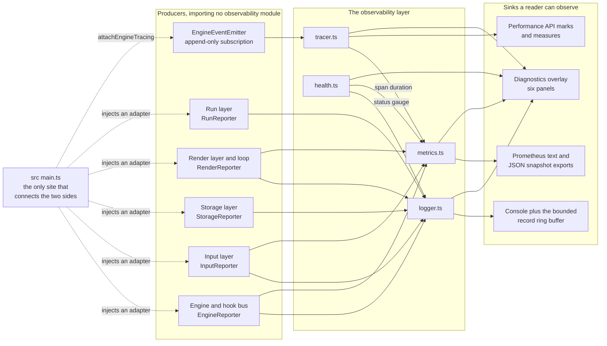

# Observability

Rule 3's closing clause is that a capability which cannot be exercised locally
is not delivered. This document is therefore written as a set of things you can
do on your own machine, in a browser, with no server: each capability is named,
its surface is stated, and the steps to see it working are given with the
observation that tells you it worked.

It also answers the question Rule 3 asks first — **what was reused and what was
added**. The answer is unusual for this repository. The pre-migration game had no
observability of any kind, and yet it performed five capability probes whose
results it reported nowhere. Those five are reused. One is added. Six are
reported.

**Rationale is not argued here.** Rule 1 makes
[`docs/DECISION_LOG.md`](DECISION_LOG.md) the single source of truth for *why*,
so this file states *what* and cites the decision by identifier — `DL-LOG-09`,
`DL-DIAG-01` and so on. Every identifier below resolves to a row in that log.

**Figure numbering here is local.** The one figure in this document is
`Figure O1`. Figures 1 to 8 belong to [`docs/architecture/`](architecture/) and
[`docs/TRACEABILITY_MATRIX.md`](TRACEABILITY_MATRIX.md); the `O` prefix keeps
this document's figure from colliding with them. Figure O1 does not restate
Figure 4, the turn data flow, or Figure 5, the hook dispatch sequence — for the
shape of a turn and of a dispatch, read those.

## Contents

- [1. Reused versus added](#1-reused-versus-added)
- [2. How the layer attaches](#2-how-the-layer-attaches)
- [3. Structured logging](#3-structured-logging)
- [4. Tracing](#4-tracing)
- [5. Metrics](#5-metrics)
- [6. Health and readiness](#6-health-and-readiness)
- [7. The diagnostics surface](#7-the-diagnostics-surface)
- [8. The dashboard template](#8-the-dashboard-template)
- [9. What Rule 3 asks for and what is delivered](#9-what-rule-3-asks-for-and-what-is-delivered)
- [10. Exercising every capability locally](#10-exercising-every-capability-locally)
- [11. Known limits](#11-known-limits)
- [12. Where the rest of it is written down](#12-where-the-rest-of-it-is-written-down)

## 1. Reused versus added

### 1.1 The negative inventory, and how it was established

The pre-migration tree is commit `478b6ec`, the last non-Blitzy commit, and it
tracked exactly 34 files. Searching it establishes the negative half of the
inventory. These are the searches, run against an extraction of that commit
rather than against the current tree, so the claim is auditable rather than
asserted:

| Search | Result |
|---|---|
| `grep -rn 'console\.' js/` | no match — **not one `console.*` call in the whole of `js/`** |
| `grep -rniE 'performance\.(now\|mark\|measure)\|window\.performance' .` | no match — the Performance API was never invoked |
| `grep -rniE 'logger\|winston\|pino\|metric\|prometheus\|statsd\|telemetry\|opentelemetry\|tracing\|tracer\|span\|sentry\|datadog\|dashboard\|alerting\|healthcheck\|readiness' .` | no match |
| `grep -rniE 'console\|debugger\|window\.onerror' .` across all 34 files | no match |

So: no logger, no metrics, no tracing, no alerting, no dashboard, no health
reporting, and no diagnostic output of any kind. Everything in
[sections 3 to 8](#3-structured-logging) is new code.

### 1.2 The positive inventory: five probes that reported nowhere

The more important half. Five capability probes were already running on every
page load. Each decided something and then **discarded the answer** — nothing
logged it, nothing counted it, nothing displayed it. The probe is the expression,
not the shim that followed it:

| # | Capability | Where | The expression that *is* the probe |
|---|---|---|---|
| 1 | `Function.prototype.bind` | `js/bind_polyfill.js` L1 | `Function.prototype.bind = Function.prototype.bind \|\| function (target) {` — the `\|\|` is the probe: the right operand is evaluated only when the method is absent |
| 2 | `Element.classList` | `js/classlist_polyfill.js` L2-L5 | `if (typeof window.Element === "undefined" \|\| "classList" in document.documentElement) { return; }` |
| 3 | `requestAnimationFrame` and `cancelAnimationFrame` | `js/animframe_polyfill.js` L3-L10 and L23 | the vendor-prefix loop `for (var x = 0; x < vendors.length && !window.requestAnimationFrame; ++x)` at L4, then `if (!window.requestAnimationFrame)` at L10 and `if (!window.cancelAnimationFrame)` at L23 |
| 4 | The pointer event family | `js/keyboard_input_manager.js` L4-L13 | `if (window.navigator.msPointerEnabled)`, selecting `MSPointerDown`/`MSPointerMove`/`MSPointerUp` over `touchstart`/`touchmove`/`touchend` |
| 5 | Web Storage writability | `js/local_storage_manager.js` L29-L40 | `localStorageSupported()` — a `setItem` then `removeItem` of the key `"test"` inside a `try`, with `catch (error) { return false; }` |

Probe 2 is worth reading twice, because it is the origin of a design decision in
[section 6.2](#62-why-a-check-has-three-states). Its single `return` is reached
by two conditions that mean different things: `typeof window.Element ===
"undefined"` means *there is no host object to ask*, and `"classList" in
document.documentElement` means *the capability is present*. The vanilla probe
conflated them.

### 1.3 How the five are reused: three performed here, three imported

`src/observability/health.ts` reuses all five by aggregating them into one report
and finally reporting it. The mechanism differs across the five, and a blanket
"we reused them" would misdescribe it (`DL-HEALTH-02`):

- **Three are performed locally in `health.ts`**, because their host polyfills
  are deleted and no module replaced them: `functionBind`, `classList` and
  `requestAnimationFrame`. In `HEALTH_CHECK_SOURCES` these carry
  `owner: 'src/observability/health.ts'` and `performedBy: null`.
- **Three are imported rather than reimplemented**, from the modules that already
  probe the capability for their own decisions:
  - `probeWebStorage` from `src/storage/local-storage-manager.ts`, the port of
    the L29-L40 probe;
  - `detectPointerEventFamily` from `src/input/touch-input.ts`, the port of the
    L4-L13 branch;
  - `probeWebGLSupport` from `src/render/webgl-support.ts`.

The provenance is not a claim in this document alone. `HEALTH_CHECK_SOURCES` in
`src/observability/health.ts` declares it as data — `origin`, `owner`,
`performedBy` and `disposition` per check — and each `HealthCheckResult` carries
its own `source`, so the reuse is machine-readable and travels with the report.

### 1.4 Five reused, one added, six total

This is the arithmetic Rule 3's reuse mandate is measured by, and it is checkable
against the code rather than taken on trust. `HEALTH_CHECK_IDS` is frozen and has
six members, `HEALTH_CHECK_COUNT` is its length, and every member carries a
`disposition` of `'reused'` or `'added'`:

| `HealthCheckId` | Disposition | Performed by |
|---|---|---|
| `functionBind` | reused | `health.ts`, inline |
| `classList` | reused | `health.ts`, inline |
| `requestAnimationFrame` | reused | `health.ts`, inline |
| `pointerEvents` | reused | `detectPointerEventFamily` |
| `storage` | reused | `probeWebStorage` |
| `webgl` | **added** | `probeWebGLSupport` |

**Five reused, one added, six total.** The two partitions cut differently and both
are worth holding: reused-versus-added is five to one, and
performed-here-versus-imported is three to three. Only `webgl` is new; the
Three.js renderer is the first thing this product has ever shipped that cannot run
without a specific context, and `probeWebGLSupport` of
`src/render/webgl-support.ts` is what asks for it (`DL-WEBGL-01`,
`DL-HEALTH-02`).

### 1.5 One gap closed by name

The pre-migration tree contained exactly one `catch`, at
`js/local_storage_manager.js` L37-L39, and it **discarded its error object**:
`catch (error) { return false; }` bound the value and never read it. That is the
single most concrete observability gap the old code had.

`serializeError` in `src/observability/logger.ts` closes it. Its contract names
that `catch` as its target, and it reduces **any** thrown value to a
`SerializedError` carrying `name`, `message`, an optional `stack` and an optional
`cause` chain — not only an `Error`. A thrown string, number, `null`, or an
object from another realm where `instanceof Error` is false, all serialise;
a value that cannot be read at all becomes a fallback record rather than a second
throw. Throwables are identified by argument position and never by type
(`DL-LOG-05`), which is what makes that true. Message and stack redaction is
applied on the emission path and on every export path (`DL-LOG-08`,
`DL-LOG-10`).

### 1.6 The reused and added record

The whole inventory in one place. This is the fastest way to check Rule 3's reuse
mandate:

| Capability | What existed before, and where | What it became | Disposition |
|---|---|---|---|
| `Function.prototype.bind` probe | `js/bind_polyfill.js` L1 | the `functionBind` check | **reused** |
| `Element.classList` probe | `js/classlist_polyfill.js` L2-L5 | the `classList` check, with the host bail-out separated from the support signal | **reused and extended** |
| `requestAnimationFrame` probe | `js/animframe_polyfill.js` L3-L10, L23 | the `requestAnimationFrame` check, reporting both functions | **reused** |
| Pointer event family probe | `js/keyboard_input_manager.js` L4-L13 | the `pointerEvents` check, via `detectPointerEventFamily` | **reused** |
| Web Storage writability probe | `js/local_storage_manager.js` L29-L40 | the `storage` check, via `probeWebStorage` | **reused** |
| Error detail on a caught value | the discarding `catch`, `js/local_storage_manager.js` L37-L39 | `serializeError`, `SerializedError`, `LogRecord.error` | **extended** |
| Synchronous publish and subscribe | `js/keyboard_input_manager.js` L18-L32 | `EngineEventEmitter`, the seam tracing attaches through | **reused as a pattern** |
| WebGL context probe | nothing — the product had no WebGL prerequisite | the `webgl` check, via `probeWebGLSupport` | **added** |
| Structured logging with correlation identifiers | nothing | `src/observability/logger.ts` | **added** |
| Spans across module boundaries | nothing; the Performance API was never called | `src/observability/tracer.ts` | **added** |
| Counters, gauges, histograms, Prometheus text | nothing | `src/observability/metrics.ts` | **added** |
| Health roll-up and readiness verdicts | nothing; five probes reported nowhere | `src/observability/health.ts` | **added, over reused probes** |
| An inspectable surface | nothing | `src/observability/diagnostics-overlay.ts` | **added** |
| A dashboard | nothing | [`docs/dashboards/`](dashboards/) | **added** |

## 2. How the layer attaches

### 2.1 Figure O1

**Figure O1 — Observability signal paths: from each producing subsystem, through
its injected reporter and the append-only event emitter, to the four sinks a
reader can observe.**



**Legend.** A **dotted arrow** is a wiring act performed once at boot: the
composition root hands a subsystem an adapter satisfying the contract that
subsystem declared, or subscribes the tracer to the engine's emitter. A **solid
arrow** is a signal at run time — a report, a span, an observation or a read. The
three boxes are the three tiers: producers on the left import nothing from
`src/observability`; the layer in the middle is the five modules; the sinks on
the right are the four places a reader actually looks. The two decisive
properties visible in the figure are that **no solid arrow runs from the layer
back into a producer**, and that **every path from a producer to a sink passes
through an adapter the root injected** — which is what the next two subsections
describe.

**On the absence of a before state.** Figure O1 has no paired before-figure
because there was no before: [section 1.1](#11-the-negative-inventory-and-how-it-was-established)
establishes that the pre-migration tree had no logger, no metrics, no tracing and
no dashboard, so every node and every edge in the figure is new. The before and
after pair for the *system* architecture that this layer attaches to is Figures 1
and 2 in [`docs/architecture/ARCHITECTURE.md`](architecture/ARCHITECTURE.md), and
the one pre-existing thing Figure O1 does reuse — the append-only subscription
semantics of the original publish-and-subscribe bus — is the subject of
[section 2.3](#23-the-append-only-emitter-and-why-the-layer-looks-so-decoupled).

### 2.2 The injected-reporter mechanism

**No module under `src/engine`, `src/input`, `src/storage`, `src/render`,
`src/relics`, `src/run` or `src/ui` imports anything from
`src/observability`.** That is checkable in one command, and it returns nothing:

```
grep -rn "from '.*observability" src/ --include='*.ts' \
  | grep -v '^src/observability/' | grep -v '^src/main.ts'
```

Instead each subsystem declares its own narrow structural contract with a no-op
default, and the composition root injects an adapter that satisfies it — the dotted
arrows of Figure O1 (`DL-MAIN-05`):

| Contract | Declared in | No-op default |
|---|---|---|
| `EngineReporter` | `src/engine/types.ts` | `NOOP_ENGINE_REPORTER` |
| `InputReporter` | `src/input/keymap.ts` | `NOOP_REPORTER` |
| `StorageReporter` | `src/storage/local-storage-manager.ts` | supplied by the caller; the parameter is optional |
| `RenderReporter` | `src/render/webgl-support.ts` | `NOOP_RENDER_REPORTER` |
| `RunReporter` | `src/run/run-state.ts` | `NOOP_RUN_REPORTER` |

`src/observability/logger.ts` exports three adapter factories —
`createEngineReporter`, `createInputReporter` and `createStorageReporter`
(`DL-LOG-04`). There is no render adapter and no run adapter in the logger:
`RenderReporter` is instead the **hub** the remaining contracts narrow onto. It
carries three channels — `onDiagnostic` for messages and caught values, `onCount`
for counter increments, `onTiming` for durations — and `createRenderReporter` of
`src/render/webgl-support.ts` completes a partial sink into one and wraps it so
no channel can throw into its caller. `createSink` in `src/main.ts` wires those
three channels to the logger and to the metrics registry, and the preference, UI,
sound, run and RNG adapters are all narrowed from that one hub (`DL-MAIN-03`,
`DL-MAIN-07`).

**`src/main.ts` is the only file that connects the two sides.** It is also the
only file that constructs the five observability modules, and it holds the
authoritative map of which collaborator spans which boundary, as a comment block
above the run-identity section.

### 2.3 The append-only emitter, and why the layer looks so decoupled

The pre-migration bus is three methods on the input manager: `on()` **pushes** a
callback onto an array keyed by event name, and `emit()` iterates that array
synchronously with a single argument (`js/keyboard_input_manager.js` L18-L32).
`EngineEventEmitter` keeps those semantics. Subscription is **append-only**: a
new subscriber is added to the end of the list and no existing subscriber is
displaced, reordered or informed.

That is the mechanical reason the whole observability stack attaches **without a
single engine-side call site**. `attachEngineTracing(events, tracer)` subscribes
through the same `on` any other consumer uses, opens a turn span on `move:before`
and closes it on `state:commit`. Nothing in `src/engine` knows tracing exists. A
suite asserts the non-interference directly, in
`tests/unit/engine/engine-observer-non-interference.test.ts`.

### 2.4 The hazard this creates

An **unwired reporter no-ops silently.** Remove one dotted arrow from Figure O1 and
the solid arrows downstream of it disappear with no error anywhere: a subsystem
constructed without its adapter falls back to the no-op default, keeps working
perfectly, reports nothing, and raises no error. The capability then looks
delivered — the module is present, its type-checks pass, its unit tests pass against
an injected double — while producing nothing at all on the running page.

There is no way to detect that from inside a producer, which is exactly why the
procedures in [section 10](#10-exercising-every-capability-locally) are written as
observations rather than as assertions about code, and why
[section 10.7](#107-troubleshooting) starts at the wiring.

## 3. Structured logging

`src/observability/logger.ts` emits one JSON object per record.

**`LogLevel`** is `'debug' | 'info' | 'warn' | 'error'`, with `LOG_LEVELS` as the
ordered list and `LOG_LEVEL_SEVERITY` as the numeric ordering the level filter
compares against. `isLogLevel` narrows an arbitrary value to one.

**`LogRecord`** is plain data and round-trips through
`JSON.parse(JSON.stringify(record))` unchanged:

| Member | What it carries |
|---|---|
| `level` | one of the four `LogLevel` names |
| `message` | the message, verbatim |
| `timestamp` | wall-clock time of emission, ISO 8601; empty when the wall clock could not be read |
| `elapsedMs` | monotonic offset from `performance.now()`, so records order correctly even if the wall clock jumps |
| `correlationId` | the run correlation identifier — on **every** record |
| `subsystem` | the tag of the logger that emitted it |
| `fields` | the structured field bag, absent when the caller supplied none |
| `error` | a `SerializedError`, absent when the record reports no failure |

A real record, taken from a run rather than invented:

```json
{"level":"info","message":"Turn committed.","timestamp":"2026-08-12T05:08:31.065Z","elapsedMs":403.562113,"correlationId":"run-1davmkd1yax7kz","subsystem":"engine","fields":{"direction":1,"score":84,"moved":true}}
```

**The `Logger` interface** carries `correlationId` and `subsystem` as readonly
properties, the four level methods `debug`, `info`, `warn` and `error`, and
`failure(level, message, detail)` for a caught value. On `warn` and `error` the
throwable is the **third** argument and the fields the second; the position is
what identifies it, never the type (`DL-LOG-05`). Beyond those:

- `child(subsystem)` returns a logger tagged with another subsystem that **shares
  this one's correlation identifier, level, sinks, buffer and counters**. This is
  how a subsystem's records land under its own tag rather than under the root's.
- `subscribe(sink)` registers a `LogSink` that receives every record emitted
  through this logger and every logger sharing its state, and returns an
  unsubscribe function. A sink that throws is contained and the remaining sinks
  still receive the record.
- `recent(limit)` reads the **bounded ring buffer**, whose capacity defaults to
  `DEFAULT_LOG_BUFFER_CAPACITY`, which is `200` (`DL-LOG-03`).
- `toJsonLines(limit)` renders the buffer as **newline-delimited JSON**, one
  record per line, for copying out of a console session.
- `snapshot(limit)` returns a `LoggerSnapshot`: the identifier, subsystem, level,
  capacity, `stored`, lifetime `emitted` and `dropped` counts, the sink count and
  fault count, and the records themselves.
- `setLevel`, `getLevel`, `setCorrelationId` and `clear` complete the surface.

Records are also written to the console as JSON by default;
`LoggerOptions.consoleOutput` turns that off and only the exact value `false`
does so. A field bag is deep-normalised on the way in — cycles replaced, depth
and breadth capped, strings bounded, forbidden keys dropped — within the limits
`logRecordBounds` states, and the record shares no object with the caller's bag
at any depth (`DL-LOG-06`).

### 3.1 Correlation identifiers

Rule 3 names correlation identifiers explicitly, so the derivation gets its own
subsection. `deriveCorrelationId(runSeed, runId?)` in
`src/observability/logger.ts` is **the one authority**: no other module in `src/`
derives a value of this type.

It is **pure and deterministic**. It reads **no clock and no randomness** — not
`Math.random`, not `Date.now`, not `crypto.randomUUID` — and computes two 32-bit
hashes over its inputs. The same inputs always produce the same identifier, in a
later process and on another machine.

It has two forms, and the distinction matters when you go looking for a
correlation:

| Form | Called as | Shape | Length |
|---|---|---|---|
| Run-instance — **the form the composition root uses** | `deriveCorrelationId(seed, runId)` | `run-` then two keyed hashes, then a separator and a third | 26 characters |
| Seed-grouping — an opt-in for a fixture or a replay harness | `deriveCorrelationId(seed)` | `run-` then two hashes of the seed | 18 characters |

Every segment of the run-instance form is derived from the run identifier **and**
the seed together, so no part of the exported value is a function of the seed
alone; the run identifier itself is the key and is carried in no record, no metric
label and no export (`DL-LOG-09`). `createRunToken` in `src/main.ts` originates
that identifier from `crypto.getRandomValues`.

**The consequence for replay.** Because the derivation reads no clock and no
randomness, an identifier is reproducible from a *persisted* run: `runId` is
persisted beside the seed in the run-state envelope, so a resumed run keeps the
identifier it was recording under, and its records line up with the ones written
before the reload. A correlation identifier therefore ties a log line to a
**reproducible run** rather than to an opaque session, which is the property a
seeded game wants and an opaque session identifier cannot give. Two *fresh* runs
of one seed do not share an identifier, by design; to line those up, compare the
seed, which the envelope holds. The seed-grouping form is what a harness passes
when it deliberately wants every run of one seed under one value — it is unsalted
and recoverable, so it must not be attached to a logger whose records leave the
machine (`DL-LOG-09`).

Neither form is unique by construction, since each concatenates hashes, so a
consumer needing exact identity compares the seed and `runId` themselves.

## 4. Tracing

`src/observability/tracer.ts` opens spans on the Performance API. `SPAN_NAMES` is
frozen and declares nine, and `SpanName` is its value union. Seven of them are
`BOUNDARY_SPAN_NAMES`, the module-boundary chain validation gate V8 enumerates:

| `SpanName` | Boundary it measures | In the V8 chain |
|---|---|---|
| `input.dispatch` | one key, gesture or on-screen control | yes |
| `engine.turn` | one turn, `move:before` through `state:commit` | yes |
| `engine.move.resolve` | the traversal walk and merge resolution inside a turn | yes |
| `hook.dispatch` | one hook dispatch | yes |
| `relic.handler` | one relic handler invocation, attributed by `SPAN_ATTRIBUTES.relic` | yes |
| `render.commit` | one renderer commit | yes |
| `render.frame` | one frame callback — the seam that was never measured | yes |
| `engine.stage` | one stage, `stage:start` through `stage:end` | no |
| `tracer.inert` | the shared `INERT_SPAN` returned while tracing is disabled | no |

**`Span`** carries `name`, `id`, `parentId`, `startTime` and `ended`, and the
methods `setAttribute`, `addEvent`, `recordError` and `end`. A merge and a spawn
are recorded as span **events** rather than as spans of their own
(`DL-TRACE-04`). **`SpanRecord`** is the closed form — the same identity fields
plus `durationMs`, `attributes`, `events`, `correlationId`, an optional `error`,
and `droppedAttributes` and `droppedEvents` counts. **`TraceSnapshot`** is the
exportable envelope, carrying `TRACE_SNAPSHOT_SCHEMA_VERSION`.

The `Tracer` surface: `startSpan(name, options)`, `activeSpan()`,
`hasOpenSpan(name)`, `recent(limit)`, `snapshot(limit)`, `toJson(limit)`,
`frameStats()`, `overBudgetFrameCount()`, `commitCounts()`,
`discardedSpanCount()`, `isEnabled()`, `setEnabled(next)` and `reset()`.
Capacity defaults to `DEFAULT_TRACE_CAPACITY`, which is `200`; the frame budget
defaults to `DEFAULT_FRAME_BUDGET_MS`, which is `16` — the same 16 the retired
`requestAnimationFrame` shim used at `js/animframe_polyfill.js` L13.

**Span durations are recorded into the metrics histograms** as each span closes,
so there is one measurement rather than two stores that can disagree
(`DL-TRACE-03`). Closing a span writes into
`game2048_span_duration_milliseconds` under a `span` label, and a turn's latency
into `game2048_turn_latency_milliseconds`.

### 4.1 The two functions that make tracing zero-touch

**`attachEngineTracing(events, tracer)`** subscribes through the append-only
`EngineEventEmitter.on`, so tracing attaches with **no engine-side call site**.
It opens the `engine.turn` span on `move:before` and closes it on
`state:commit`, opens `engine.stage` across a stage, and returns a **callable**
`EngineTracingSubscription`: calling it detaches every listener and closes
whatever span it left open, and calling it twice throws nothing.

A turn span is settled on the engine's full set of legal outcomes, so an
effect-only turn — one an `onBeforeMove` relic committed without moving a tile —
is attributed rather than reported as an anomaly, and its latency is not recorded
into the turn histogram (`DL-TRACE-08`, `DL-TRACE-11`). The stage span is opened
off the parent stack rather than under the turn in progress (`DL-TRACE-12`), and
frame spans are opened as roots (`DL-TRACE-09`).

**`Tracer.frameLifecycleHooks()`** returns the `FrameLifecycleHooks` pair
`onFrameBegin` and `onFrameEnd`, which is exactly the pair
`src/render/render-loop.ts` accepts. This is what measures the
**frame-callback seam** — the system's **only** asynchronous boundary, and one the
product never measured: before this work no JavaScript ran per frame at all, as
every animation was a CSS transition. The loop also exposes `getFrameStats()` and
`resetFrameStats()` for the same numbers without a tracer, and the tracer's own
`frameStats()` returns a `FrameTraceStats`. `src/main.ts` hands the pair to the
loop at construction.

The remaining boundaries are wrapped by **`createBoundaryTracing(tracer)`**,
which returns `traceInput`, `traceMoveResolution`, `traceHookDispatch`,
`traceRelicHandler` and `traceRenderCommit`. Each runs a synchronous function
inside its span and rethrows whatever that function threw, and each is injected
into the subsystem that owns the boundary — the hook bus takes the dispatch and
handler wrappers structurally, without importing anything.

### 4.2 Reading spans in the browser's own timeline

Spans are written through `performance.mark` and `performance.measure`, so they
appear on the browser's User Timing track. Two differences from what a reader
expects are worth stating precisely, because both look like a missing capability:

- **The entry name is not the span name.** It is
  `game2048.span:<spanName>/<spanId>`, where the span identifier is the
  correlation identifier, `#`, and the tracer's span counter (`DL-TRACE-02`). An
  `engine.turn` span appears as `game2048.span:engine.turn/run-06ksiwm1qlnf8c-1wavazu#7`.
- **Each measure and both of its marks are cleared as the span closes**
  (`DL-TRACE-07`), so the entry buffer never accumulates. A *polled*
  `performance.getEntriesByType('measure')` is therefore always empty, however
  many spans have run. A `PerformanceObserver` registered before the spans open
  sees every one, and a Performance-panel recording — which observes rather than
  polls — captures them the same way. **Read live, not read back**; or read the
  tracer's own `snapshot()`, which retains them.

## 5. Metrics

`src/observability/metrics.ts` is an in-page registry. `MetricKind` is
`'counter' | 'gauge' | 'histogram'`; `Counter`, `Gauge` and `Histogram` are the
three instrument interfaces, `Histogram` adding a `quantile(q)` estimate that is
**bucket-approximated** rather than exact. `LabelSet` is a frozen string record.
Every family name is prefixed `METRIC_PREFIX`, which is `game2048_`, and
`isValidMetricName` and `isValidLabelName` hold both against the exposition
format's grammar.

`METRIC_NAMES` is frozen and is **the single declaration of every canonical
family name**; `METRIC_LABELS` is the matching label vocabulary — `hook`,
`event`, `reason`, `stream`, `check` and `span`. No module under `src/engine`,
`src/input`, `src/render`, `src/relics`, `src/run` or `src/ui` invents a name of
its own, because none of them can reach the registry at all. The composition root
declares exactly one family beyond those nineteen — `game2048_reports_total`,
which collapses every generic subsystem report onto one counter carrying `report`
and `subsystem` labels (`DL-MAIN-07`).

| Family | Kind | What it counts or times |
|---|---|---|
| `game2048_turns_total` | counter | turns whose slide moved at least one tile |
| `game2048_merges_total` | counter | merges — one per merge, so a double-merge turn counts twice |
| `game2048_spawns_total` | counter | tiles actually inserted |
| `game2048_spawn_attempts_total` | counter | spawn attempts, whether or not one landed |
| `game2048_spawn_suppressed_total` | counter | attempts a full board or a handler suppressed (`DL-METRIC-02`) |
| `game2048_engine_events_total` | counter | engine events by `event`, keyed off `ENGINE_EVENT_NAMES` |
| `game2048_hook_dispatches_total` | counter | hook dispatches by `hook`, keyed off `HOOK_NAMES` |
| `game2048_hook_handler_invocations_total` | counter | handlers actually invoked, by hook |
| `game2048_hook_handler_skipped_total` | counter | handlers skipped before invocation, including by the charge guard |
| `game2048_hook_payload_rejections_total` | counter | handler returns the bus discarded as non-payloads |
| `game2048_relic_handler_errors_total` | counter | relic handler throws the bus contained |
| `game2048_rng_draws_total` | counter | draws by `stream` |
| `game2048_frames_rendered_total` | counter | frames composited |
| `game2048_reports_total` | counter | generic reports by `report` and `subsystem`, declared in `src/main.ts` |
| `game2048_metrics_rejected_total` | counter | the registry's own refusals, unlabelled |
| `game2048_metrics_rejected_by_reason_total` | counter | the same refusals by `reason` (`DL-METRIC-08`) |
| `game2048_health_check_status` | gauge | one series per health check, by `check` |
| `game2048_turn_latency_milliseconds` | histogram | turn latency, input dispatch through commit |
| `game2048_frame_time_milliseconds` | histogram | frame duration |
| `game2048_span_duration_milliseconds` | histogram | every span, by `span` |

The registry surface: `counter(name, labels)`, `gauge(name, labels)`,
`histogram(name, labels, buckets)` and `describe(name, help, kind)` are the
generic three plus metadata; the recording helpers are `recordEngineEvent`,
`recordEngineEventCount`, `recordTurnResolved`, `recordSpawnAttempt`,
`recordSpawnSuppressed`, `recordFrame`, `recordTurnLatency`, `recordSpanDuration`,
`recordHealthCheck`, `recordRngCursors`, `foldHookDispatchCounts` and
`reportReaderFault`; and the read and export surface is `snapshot()`,
`toPrometheusText()`, `toJson()`, `download(filename)` and `reset()`.
`MetricsSnapshot` carries `METRICS_SNAPSHOT_SCHEMA_VERSION`, which is `1`, and one
`MetricSeriesSnapshot` per series. `download` defaults to
`DEFAULT_METRICS_FILENAME`, which is `game2048-metrics.prom`.

### 5.1 Where the duration buckets came from

`DEFAULT_DURATION_BUCKETS` is shared by every duration histogram, so frame time
and turn latency are directly comparable (`DL-METRIC-01`). Its fourteen inclusive
upper bounds, in milliseconds, are:

```
1, 2, 4, 8, 16, 32, 64, 100, 200, 400, 600, 800, 1200, 2000
```

Every one is anchored in a number this product already held:

- **1, 2, 4 and 8** give sub-frame resolution below the budget.
- **16** is the frame budget itself, the literal in the retired shim at
  `js/animframe_polyfill.js` L13: `Math.max(0, 16 - (currTime - lastTime))`.
- **32 and 64** are two and four frame budgets.
- **100, 200, 600, 800 and 1200** are the stylesheet's own animation cadence:
  `$transition-speed: 100ms` at `style/main.scss` L22 and the move transition at
  L329; `appear 200ms` at L430 and `pop 200ms` at L450; `move-up 600ms` at L104;
  and `fade-in 800ms` after `$transition-speed * 12`, which is the 1200 ms
  overlay delay, at L234.
- **400** fills the gap between 200 and 600, and **2000** is the overflow
  shoulder past the longest animation.

A histogram exports fifteen `_bucket` lines, not fourteen: the fourteen finite
bounds plus the `+Inf` overflow slot the exposition format requires.

### 5.2 Two families are pulled, not pushed

The hook bus keeps its own per-hook dispatch counts and the RNG substreams keep
their own draw cursors, and the registry holds either only once something reads
it (`DL-METRIC-03`, `DL-DIAG-04`). This has one practical consequence:

**Export through the overlay, not through the registry.** The overlay's exports
fold both pulled sources before rendering the exposition, so they answer from one
reading. `metrics.toPrometheusText()` is the registry's own method and cannot fold
what it does not own, so a direct call answers with the hook families at whatever
a previous fold left them — zero, on a page nothing has folded. The cursor family
is the exception: it is folded on every committed state as well, so it is current
either way. A fold is also ignored unless its correlation identifier agrees with
the registry's (`DL-METRIC-06`).

**A fold writes into the registry, so the two exports usually agree.** This is the
part that surprises people who go looking for the difference. Once anything has
folded, the registry holds the folded values, and `metrics.toPrometheusText()`
answers with them — measured on a played run, the two exports were **byte-identical
across all 391 lines**. An open overlay folds on every refresh tick, and calling
the overlay's exporter folds for any registry read that follows it, so under normal
use you will never see them disagree. The divergence is real but narrow: it appears
**between** folds, and permanently on a page where nothing folds at all. Measured
with a dispatch interposed and no fold between: the registry's own method returned
values a full turn stale while the overlay's returned current ones, and the next
registry read then matched, because the fold had written through. Prefer the
overlay's exporter and the question does not arise.

The registry bounds itself with a family ceiling, a series-per-family ceiling,
label name and value length ceilings, and a metadata budget charged once per
retained series (`DL-METRIC-07`). A refusal is **reported, never thrown**, and
counted twice: once on the unlabelled `game2048_metrics_rejected_total` and once
on `game2048_metrics_rejected_by_reason_total` under its reason — **sum one or the
other, not both** (`DL-METRIC-08`). Repeated identical refusals are written to the
log on a logarithmic schedule, the first occurrence then every power of two, each
record after the first carrying `occurrences` and `suppressed` (`DL-METRIC-09`);
a record with no `occurrences` field is a first sighting. Read the metric for an
exact count, never the number of records.

## 6. Health and readiness

### 6.1 The surface

`src/observability/health.ts` reports all six checks named in
[section 1.4](#14-five-reused-one-added-six-total).

**`HealthCheckResult`** carries `id` — a `HealthCheckId` — `status`, a
one-sentence human-readable `detail`, the structured `data` the probe read, the
`source` provenance reference, `durationMs`, and an `error` present only on a
`'fail'` that a throw produced. A probe that answered `'fail'` without throwing
carries none.

**`HealthReport`** carries the roll-up `status`, `checks` in `HEALTH_CHECK_IDS`
order, `counts` per status, the `correlationId`, an ISO 8601 `timestamp` and the
total `durationMs`. The roll-up takes the worst status with `not-applicable`
participating as neutral (`DL-HEALTH-03`).

**The `HealthSurface` surface:** `check(options)` performs every probe and files
the report; `checkOne(id, options)` performs one; `report(options)` and
`lastReport()` are accessors that do **not** re-probe; `readiness(options)`
derives the verdicts; `subscribe(listener)` receives every report and returns an
unsubscribe function; `forget()` drops the held report; `probeViews()` and
`probeReader()` expose the probe rows the diagnostics panel renders.
`createHealthSurface(options)` builds one, and `src/main.ts` constructs exactly
one.

### 6.2 Why a check has three states

**`HealthStatus` is `'pass' | 'fail' | 'not-applicable'`** — three states, not two
(`DL-HEALTH-01`). The third exists because of the real conflation in the vanilla
`classList` probe quoted in [section 1.2](#12-the-positive-inventory-five-probes-that-reported-nowhere):

```js
if (typeof window.Element === "undefined" ||
    "classList" in document.documentElement) {
  return;
}
```

One `return`, two meanings. The left operand says *there is no host object to
ask*; the right says *the capability is present*. Collapsing that into a boolean
forces a choice between two wrong answers, and in a Node test environment — where
there is no `window` at all — reporting `fail` would be a **false negative** about
a browser capability nobody asked about.

`probeClassList` separates them. No `window`, no `Element`, no `document`, or an
unreadable `document.documentElement` each return `not-applicable` with the
specific reason in `detail`; only the actual `'classList' in root` reading returns
`pass` or `fail`. The same distinction applies to `requestAnimationFrame` with no
window, to `storage` where no global store exists at all, and to `webgl` where
there is no document to request a context from. `probeFunctionBind` is the one
check that can never be `not-applicable`, because `Function.prototype` is always
there to read.

This is verifiable in one command. Run the unit suite in its DOM-free project and
four of the six report `not-applicable` with a reason, the roll-up still reports
`pass`, and nothing reports a spurious failure.

### 6.3 The two readiness verdicts

`ReadinessReport` is the consequential half of the surface — the part that
**changes program behaviour** rather than merely being inspected. Two verdicts
matter:

1. **Whether a WebGL board may be mounted.** `renderer` is `'webgl'` or
   `'number-only'`; `mayMountWebGLRenderer` and `requiresNumberOnlyFallback` are
   the two booleans; `webglLevel` is `'webgl2'`, `'webgl'` or `'none'`, and
   `webglFailure` names what prevented a context where one was not obtained.
   **`src/main.ts` branches on this**: readiness is resolved *before* the renderer
   is selected, and where `requiresNumberOnlyFallback` is true the root forces
   number-only mode rather than mounting a 2.5D board it has already been told
   cannot draw. The number-only renderer is the non-WebGL fallback and a
   first-class rendering mode, not a degraded one.
2. **Which storage strategy is live.** `storage` is `'persistent'` or
   `'ephemeral'`, and `'persistent'` requires **both** that `storageStrategy`
   names Web Storage and that the `storage` check passed.

`ready` is true only when the renderer verdict is `'webgl'` and the storage
verdict is `'persistent'`. It is a readiness statement and not a liveness one: the
build is playable when it is false, because both fallbacks are the product's own.
The report also carries `webglStatus`, `storageStatus`, the roll-up
`healthStatus`, the `correlationId` and a `timestamp`. After the board is mounted
the report is refreshed, so what is displayed describes the application that is
actually running.

Two of the six checks read a **live verdict** beside the probe result their owning
module holds — a held result describes a capability as of the moment it was taken,
and a health check reports it now (`DL-MAIN-35`, `DL-HEALTH-08`):

- `webgl` reports what the board is doing now — a context taken away, a restored
  context whose resources could not be rebuilt, a 2.5D board selected but not
  mounted, or a number-only board forced in place of one. A fallback the root
  forced *because the context was lost* keeps naming the context rather than the
  mode (`DL-MAIN-35`).
- `storage` reports whether the run is **being saved now**. The probe result is a
  construction-time reading by design, so repeated checks perform no write; the
  live verdict is read from the run controller's persistence status and fails the
  check while writes are being refused (`DL-HEALTH-08`). The strategy still
  reports `localStorage`, because the store in use has not changed — only its
  writability has.

### 6.4 Health results are also metrics

Every result is registered as a gauge on `game2048_health_check_status`, keyed by
a `check` label, using `HEALTH_GAUGE_VALUES`: **`pass` is 1, `fail` is 0, and
`not-applicable` is -1**. That is what lets
[`docs/dashboards/dashboard.json`](dashboards/dashboard.json) chart probe status
alongside the counters, and it means an exported snapshot carries the same six
answers the panel shows. In an exported exposition it reads:

```
# HELP game2048_health_check_status Health check result: 1 healthy, 0 unhealthy, -1 not applicable (the host offers nothing to evaluate).
# TYPE game2048_health_check_status gauge
game2048_health_check_status{check="functionBind"} 1
game2048_health_check_status{check="classList"} 1
game2048_health_check_status{check="requestAnimationFrame"} 1
game2048_health_check_status{check="pointerEvents"} 1
game2048_health_check_status{check="storage"} 1
game2048_health_check_status{check="webgl"} 1
```

## 7. The diagnostics surface

`src/observability/diagnostics-overlay.ts` is the in-page surface that stands in
for the metrics endpoint a static bundle has no server to serve.
`createDiagnosticsOverlay(options)` builds one and returns a
`DiagnosticsOverlay` handle.

### 7.1 Activation — the exact flag

`isDiagnosticsRequested(source?)` reads `DIAGNOSTICS_FLAG`, which is the string
**`diagnostics`**, from the **query string first and then the fragment**; the
first of the two naming the flag decides. It reads **no storage**: a persisted
preference is deliberately not a second source, so a session carrying no flag is
off however the previous session ended (`DL-DIAG-01`).

| URL | Result |
|---|---|
| `http://127.0.0.1:5173/?diagnostics` | on — an absent value reads as on |
| `http://127.0.0.1:5173/#diagnostics` | on — the fragment is read too |
| `http://127.0.0.1:5173/?DIAGNOSTICS` | on — the flag **name** is matched case-insensitively |
| `http://127.0.0.1:5173/?diagnostics=1` | on |
| `http://127.0.0.1:5173/?diagnostics=off` | **off** — as are `0`, `false` and `no`, in any case (`DL-DIAG-13`) |
| `http://127.0.0.1:5173/` | off |

The gate is a **runtime** opt-in, not a build-time `import.meta.env.DEV` guard
(`DL-DIAG-01`). The module therefore ships in the production bundle and is
reachable in it, and stays dormant in every session that does not ask for it —
including the recorded-gameplay run of requirement R11, which sets no flag.
`src/main.ts` calls `mount()` then `open()` only when
`isDiagnosticsRequested()` returns true.

### 7.2 The handle

| Member | Effect |
|---|---|
| `available` | a **property**, not a method: whether a host is resolved and `destroy` has not been called |
| `mount()` | resolves a host and applies the token-derived styles; returns whether one is available |
| `open()`, `close()`, `toggle()` | show or hide, and start or stop the scheduled refresh |
| `isOpen()` | whether it is currently shown |
| `refresh()` | re-renders from a fresh reading; a no-op while closed |
| `lastSnapshot()` | the `MetricsSnapshot` the last render read, or `null` |
| `toPrometheusText()` | the exposition for the current state, with both pulled sources folded first |
| `snapshot()`, `snapshotJson()` | a freshly built `DiagnosticsSnapshot`, and its indented JSON |
| `exportPrometheusText()` | downloads `game2048-metrics.prom` |
| `exportSnapshotJson()` | downloads `game2048-diagnostics.json` |
| `destroy()` | hides, stops the refresh, releases every listener and source, and removes a host it created; idempotent |

`DIAGNOSTICS_SNAPSHOT_SCHEMA_VERSION` is `1`.
`DEFAULT_DIAGNOSTICS_SNAPSHOT_FILENAME` is `game2048-diagnostics.json`.

### 7.3 Six panels and five controls

The panels, in render order:

1. **Run** — the run's identity, stage and correlation identifier.
2. **Health** — twelve rows: the six checks each with its status and `detail`, an
   `overall` roll-up row, and five readiness rows, read from the health surface's
   accessors. **The panel's status vocabulary is `healthy` and `unhealthy` where
   the API's `HealthStatus` says `pass` and `fail`**, and it holds in every
   cell rather than in the status column alone: that column, the `overall`
   sentence and the three readiness details that quote a status all read the
   same words through one `statusWord` helper, so searching the panel for
   "pass" or "fail" finds nothing (`DL-DIAG-21`). The static dashboard is the
   deliberate exception: its Readiness panel echoes the exported
   `healthStatus` verbatim, because its contract is fidelity to the file it
   loaded. The readiness rows are relabelled too: `may mount webgl`
   for `mayMountWebGLRenderer` and `number-only fallback` for
   `requiresNumberOnlyFallback`. `storage` therefore appears twice, once as a check
   and once as the readiness verdict.
3. **Traces** — the frame-time and turn-latency span summaries, the frame budget
   and the over-budget frame count.
4. **Hooks** — the per-hook dispatch counts, **pulled** from the hook bus's own
   `metrics()` accessor (`DL-DIAG-04`). Six rows, in `HOOK_NAMES` order:
   `onStageStart`, `onBeforeMove`, `onMerge`, `onSpawn`, `onAfterMove`,
   `onStageEnd`. For what each dispatch does, read Figure 5 in
   [`docs/architecture/hook-dispatch-sequence.md`](architecture/hook-dispatch-sequence.md).
5. **Metrics** — the metric series with per-histogram quantiles. Its heading
   states how many series it is showing and how many it is not, and that the
   export carries them (`DL-DIAG-12`), so a zero in that panel is a reading rather
   than an omission.
6. **Recent records** — the `LogRecord` ring buffer.

The five controls are **Refresh**, **Export metrics**, **Export snapshot**,
**Collapse diagnostics** — which becomes **Expand diagnostics** — and **Close
diagnostics**. Collapsing renders the heading and control row alone and keeps
every reading running, so the surface and the board coexist on a narrow viewport;
what is exported does not change (`DL-DIAG-11`). Closing takes the readings off
screen and returns focus to wherever it came from (`DL-DIAG-17`). The five
controls keep their identity across every render, so a handle to one stays valid
(`DL-DIAG-16`). The controls
take the palette of the active theme, so the high-contrast and colourblind-safe
themes reach this surface as they reach every other (`DL-DIAG-09`).

The surface refreshes on a 1000 ms timer that depends on nothing else — not on a
frame being composited, not on the render loop running, not on the game being
played — with one exception: while keyboard focus is inside the surface the
scheduled render stands off, so panels do not change under a reader working
through them. The stand-off is published on the host as `data-refresh="paused"`
and stated in the heading, which becomes `Diagnostics — paused while focused`, and
it ends with an immediate render the moment focus leaves (`DL-DIAG-15`). Pressing
any of the five controls focuses it, so the heading changes as a side effect of
using the surface; that is the stand-off working.

### 7.4 It needs no markup or stylesheet change

The host is **adopted** where `index.html` declares one at
`DIAGNOSTICS_OVERLAY_SELECTOR`, which is `#diagnostics-overlay`, and **created
programmatically** on `document.body` — or on `document.documentElement` where
there is no body — where it does not (`DL-DIAG-02`). Its styles are written
inline from `src/theme/tokens.ts`, so the surface is self-contained: adding it
required no new stylesheet rule and no new markup contract.

It occupies the documented **z-index 500** slot,
`zIndex.diagnosticsOverlay` — above the HUD at 200, screen overlays at 300 and
modal and reward surfaces at 400, and above the pre-existing ceiling of 100 that
`.game-message` and `.score-addition` hold.

## 8. The dashboard template

Two files, in [`docs/dashboards/`](dashboards/):

- **`dashboard.json`** — a Grafana-compatible dashboard model over the families in
  [section 5](#5-metrics). It declares panels, expressions and units, and expects
  a Prometheus-compatible data source that an exported snapshot has been loaded
  into. It is a **template**, not a provisioned dashboard: it names no data source
  of its own and is not wired to a running Prometheus.
- **`dashboard.html`** — a single self-contained page that consumes an exported
  snapshot **directly**. It reads all three forms this layer writes: the
  Prometheus text of `toPrometheusText()` — `# HELP`, `# TYPE` and sample lines,
  including labelled series and histogram buckets — the `MetricsSnapshot` of
  `snapshot()`, and the combined `DiagnosticsSnapshot` of
  `DiagnosticsOverlay.snapshot()`, which is the only form carrying the health
  detail text, the check provenance, the readiness verdicts, the trace summary
  and the log records. It declares the same series as `dashboard.json`. No
  server, no data source, no network access, no build step.

`dashboard.html` sits **outside the Vite entry graph** — the root `index.html` is
the whole of that graph (`DL-BUILD-01`, `DL-DIAG-06`) — so it is never bundled,
never transformed, never served by the dev server and absent from `dist/`. You open
it from the filesystem. It ships **no sample data**: before a file is chosen it
renders an empty state naming the two export controls and pointing back at this
document, so no number on the page is ever anything but a reading of a real
export.

## 9. What Rule 3 asks for and what is delivered

Rule 3 enumerates five capabilities. Three of them assume a server process, and
the product must remain a **fully static bundle** — no server, no API route, no
serverless function, no runtime Node process. Each of the three is delivered as
its browser-native equivalent, and each substitution is a deviation with its own
row in [`docs/DECISION_LOG.md`](DECISION_LOG.md) §11:

| Rule 3 capability | Why it cannot exist here | Substitute delivered | Deviation |
|---|---|---|---|
| A network-served HTTP metrics endpoint | there is no server process and none may be added | the in-page diagnostics surface plus a Prometheus-text snapshot, exposed programmatically and downloadable as a file | `DL-METRIC-05` |
| HTTP health and readiness probes an orchestrator can poll | there is no listening port, so there is nothing to poll | programmatic client-side self-checks reporting all six checks and the two readiness verdicts | `DL-HEALTH-05` |
| Distributed tracing across process or service boundaries | the runtime integrates with no external system, so there is no service boundary | Performance-API spans across **module** boundaries — input, engine, hook bus, relic handlers, renderer — plus the previously unmeasured frame-callback seam | `DL-TRACE-01` |

**Delivered with no substitution: structured logging with correlation
identifiers.** It is the one capability of the five that a static bundle can carry
literally, and [section 3](#3-structured-logging) is it.

**The dashboard template is delivered, and how it is fed is a deviation.** Both
files exist and both render. What differs from the rule's implied shape is the
feed: a human exports a snapshot and loads it, rather than a collector scraping an
endpoint (`DL-DIAG-06`).

### 9.1 What is genuinely lost

A substitution section that lists only what is provided is not useful. These are
real capabilities that a served metrics endpoint and pollable probes would have
given, and that this build does not have:

- **Nothing is pollable by external monitoring.** There is no port and no scrape
  target, so no Prometheus server can pull, no uptime check can probe, and no
  deployment can be gated on a readiness endpoint. The readiness verdicts change
  what *this page* does; they cannot stop a rollout.
- **Nothing aggregates across sessions.** Every counter, histogram, span buffer
  and log buffer starts empty on load and is discarded when the tab closes. There
  is no fleet view, no percentile across users, no week-over-week trend, and no
  way to learn that something regressed for someone else.
- **There is no alerting.** Nothing evaluates a threshold and nothing notifies. A
  frame-budget regression is seen only by a person who opens the surface and
  looks.
- **Retention is bounded and in memory.** 200 log records and 200 span records. A
  fault diagnosed long after it happened has no history (`DL-LOG-03`).
- **Tracing has no context propagation.** There is no trace header to inject, no
  parent span from an upstream service and no child in a downstream one, because
  there is no other process. The frame-callback seam is the closest analogue this
  architecture has to a service boundary, and it is an intra-process one.
- **The dashboard is fed by hand.** Nothing refreshes it; it shows the moment the
  snapshot was taken.

Every one of those is a consequence of the static-deployment mandate rather than
of the observability design, and the trade is recorded in the four deviation rows
above.

## 10. Exercising every capability locally

This is the section Rule 3 is measured by, and validation gate V8 with it. One
subsection per capability, each with steps you can follow and an **expected
observation** that tells you it worked.

### 10.0 Start here, once

```
npm install
npm run dev
```

`npm run dev` serves on `http://127.0.0.1:5173`. Open
`http://127.0.0.1:5173/?diagnostics` — the flag from
[section 7.1](#71-activation--the-exact-flag) — and open the browser's developer
tools. Two facts make every procedure below possible:

- The application does **not** open over `file://`. It is a single ES module and
  needs a served origin, so `npm run dev`, or `npm run build && npm run preview`,
  is the way in.
- The boot publishes the running application on `globalThis` as
  **`__blitzy2048`**, non-enumerable, for exactly this purpose. Twenty members, of
  which the five that matter here are `logger`, `metrics`, `tracer`, `health` and
  `diagnostics`, alongside `engine`, `config`, `streams`, `run`, `screens`,
  `renderer`, `hud`, `relics`, `hooks`, `rewards` and the rest. Because it is
  non-enumerable it will not appear in an enumeration of `globalThis` or in
  devtools autocomplete — reach it by name. Nothing in the application reads it
  back (`DL-MAIN-03`).

If you are running several clones side by side, offset the port:
`npm run dev -- --port 5273`.

**You must start a run before the board does anything.** A cold load opens on the
run-start screen with an **empty** board, and none of the arrow keys moves
anything until you press **Begin run** — they are recorded as
`game2048_reports_total{report="input.key.unrecognised"}` and nothing else. So the
first action in every procedure below that mentions playing a move is: press
**Begin run**, optionally entering a seed first.

**Starting a run rotates the correlation identifier.** `run.begin` publishes a new
run scope, so `__blitzy2048.logger.correlationId` after **Begin run** is not the
value it held on the run-start screen. Read the identifier *after* starting the
run, not before.

On the dev server, Vite's own HMR client writes two plain-text `debug` lines —
`[vite] connecting...` and `[vite] connected.` — before any application record.
The application's records are the JSON ones after those two.

### 10.1 Structured logging with correlation identifiers

1. Load `http://127.0.0.1:5173/?diagnostics` with the console open. Records are
   written to the console as JSON by default.
2. Press **Begin run**, then an arrow key to play one move.
3. Read any JSON console line. Then read the same records structurally:
   `__blitzy2048.logger.recent(5)`.
4. Read the identifier on its own: `__blitzy2048.logger.correlationId`.
5. Confirm subsystem tagging rather than a single blanket tag:
   `__blitzy2048.logger.recent(50).map(r => r.subsystem)` returns several
   different tags, because each subsystem reports through a `child` logger. On a
   played run they include `main`, `run/controller`, `render/webgl-support`,
   `health`, `ui/a11y` and `input`.
6. Export the buffer as newline-delimited JSON:
   `__blitzy2048.logger.toJsonLines()`. It is newline-**terminated** as well as
   newline-delimited, so a naive `split('\n')` leaves a trailing empty element.
7. **Demonstrate the reproducibility that matters: reload mid-run.** With the run
   already started, note `__blitzy2048.logger.correlationId`, reload the page, and
   read it again. The run identifier is persisted beside the seed, so the resumed
   run re-derives and keeps the identifier it was recording under, and the records
   from before and after the reload correlate. Take the reading **after** pressing
   Begin run, not on the run-start screen: starting a run rotates the identifier,
   and comparing a pre-run reading against a post-reload one shows a difference
   that has nothing to do with the reload.
8. Confirm what is *not* claimed. Read the seed with `__blitzy2048.run.seed()`,
   then start a second run from the run-start screen with that same seed entered.
   The two runs are separate instances, so their identifiers **differ by design**
   ([section 3.1](#31-correlation-identifiers)) — to line two fresh runs of one
   seed up against each other, compare the seed. That the derivation itself is
   pure and deterministic is asserted directly by
   `npx vitest run --config vitest.config.ts tests/unit/observability/logger.test.ts`.

**Expected observation.** A `LogRecord` object carrying `level`, `message`, an ISO
8601 `timestamp`, a monotonic `elapsedMs`, a `subsystem` tag, and a
`correlationId` of the form `run-` followed by 22 characters, 26 in all — for
example `run-0extf4n1dj2qz3-11jtujc`. That identifier is **byte-identical before
and after a mid-run reload**.

**Two identifiers coexist in the buffer, and that is correct.** The ring buffer is
not cleared when the scope rotates ([section 10.0](#100-start-here-once):
starting a run rotates the identifier), so the records form **contiguous blocks,
one per run instance** — the boot-scope records the run-start screen wrote, then
the records written since **Begin run**, in emission order with no interleaving.
So after one **Begin run**:

```js
Array.from(new Set(__blitzy2048.logger.recent(200).map(r => r.correlationId)))
```

returns **two** entries, the last of which is `__blitzy2048.logger.correlationId`,
and every record written after the run started carries that one. The block sizes
depend on what the session did, so count the blocks rather than the records:

```js
__blitzy2048.logger.recent(200).reduce((blocks, record) => {
  const open = blocks[blocks.length - 1];

  if (open !== undefined && open.id === record.correlationId) {
    open.count += 1;

    return blocks;
  }

  return [...blocks, { id: record.correlationId, count: 1 }];
}, []);
```

Step 3 above reads `recent(5)`, which lands inside the newest block and therefore
shows one identifier — the reading to take when you want *the run's* records
(`DL-DOC-08`). Starting a run writes about nine records of its own before you
press a key, so that window is inside the block from the moment the board opens.

### 10.2 Tracing

Tracing is on by default; `__blitzy2048.tracer.isEnabled()` returns `true` and
`setEnabled(false)` turns it off, after which `startSpan` returns the shared
`INERT_SPAN`.

1. Load the page with `?diagnostics`, press **Begin run**, and play **one** move.
2. Read the spans: `__blitzy2048.tracer.recent(40).map(s => s.name)`.
3. Confirm the whole mandated chain is covered in that one move. You should find
   `input.dispatch`, `engine.turn`, `engine.move.resolve`, `hook.dispatch`,
   `render.commit` and `render.frame`. `relic.handler` appears once a relic has
   been taken from a reward screen — clear a stage first, take a relic, then play
   another move and look again.
4. Confirm the turn boundary specifically. `engine.turn` is opened on
   `move:before` and closed on `state:commit`, so exactly one `engine.turn` record
   exists per resolved move, and it has a `durationMs`:
   `__blitzy2048.tracer.recent(40).filter(s => s.name === 'engine.turn')`.
5. Confirm nesting. `engine.move.resolve` carries the `engine.turn` span's `id` as
   its `parentId`.
6. Observe the **frame-callback seam** on its own — the boundary the product never
   measured. `__blitzy2048.tracer.frameStats()` returns a `FrameTraceStats`
   carrying `frames`, `overBudgetFrames`, `budgetMs`, `lastFrameMs`, `maxFrameMs`
   and `totalFrameMs`, and `__blitzy2048.tracer.overBudgetFrameCount()` is that
   over-budget count alone. Every `render.frame` record is one frame callback.
7. Read the same spans in the **diagnostics overlay**: the **Traces** panel carries
   the frame-time and turn-latency summaries.
8. Read them in the browser's **performance timeline**. Open the Performance panel,
   press record, play a few moves, and stop. The User Timing track carries entries
   named `game2048.span:<spanName>/<spanId>`. If you instead *poll*
   `performance.getEntriesByType('measure')` you will get an empty array, every
   time, because each measure and both marks are cleared as the span closes — see
   [section 4.2](#42-reading-spans-in-the-browsers-own-timeline).

**Expected observation.** One `engine.turn` `SpanRecord` per resolved move, opened
at `move:before` and closed at `state:commit`, with `engine.move.resolve`,
`hook.dispatch` and `render.commit` nested beneath it and `input.dispatch` around
it; plus a stream of root `render.frame` records, one per frame callback, with
`frameStats()` reporting a non-zero `frames`. Measured on one move: the six
distinct names above, one `engine.turn` of `86.7 ms` whose `parentId` is the
`input.dispatch` span, an `engine.move.resolve` whose `parentId` is that
`engine.turn`, `frames: 16`, and `performance.getEntriesByType('measure').length`
of `0`.

### 10.3 Metrics

1. Load the page with `?diagnostics` and play several moves so the counters move.
2. Read the **Metrics** panel in the overlay. Its heading states how many series it
   shows and how many the export additionally carries.
3. Read the exposition directly: `__blitzy2048.diagnostics.toPrometheusText()`.
   Use the overlay handle rather than `__blitzy2048.metrics.toPrometheusText()`,
   because the overlay folds the two **pulled** sources first — see
   [section 5.2](#52-two-families-are-pulled-not-pushed).
4. Press **Export metrics** on the overlay, or call
   `__blitzy2048.diagnostics.exportPrometheusText()`. The file downloads as
   **`game2048-metrics.prom`** to the browser's usual download directory — in a
   headless container that is typically `/root/Downloads`, and there is no download
   shelf to confirm it, so check the directory rather than the page.
5. Press **Export snapshot**, or call
   `__blitzy2048.diagnostics.exportSnapshotJson()`, for the combined JSON
   envelope as **`game2048-diagnostics.json`**. In a containerised Chrome, drive
   the two exports in **separate tabs**: only one programmatic download per tab
   succeeds.
6. Confirm the JSON form too: `__blitzy2048.metrics.snapshot()` returns a
   `MetricsSnapshot` carrying `schemaVersion` 1 and one entry per series.

**Expected observation.** Valid Prometheus exposition text containing the named
families, each with its `# HELP` and `# TYPE` lines. A counter, a labelled counter
and a histogram look like this — real output, not a sketch:

```
# HELP game2048_turns_total Turns whose slide moved at least one tile, one per engine turn that resolved a move. Neither an idle turn nor one changed by a hook effect alone is counted.
# TYPE game2048_turns_total counter
game2048_turns_total 1
# HELP game2048_engine_events_total Engine events emitted, by event name, counted per emission and not per listener.
# TYPE game2048_engine_events_total counter
game2048_engine_events_total{event="stage:start"} 0
game2048_engine_events_total{event="move:before"} 0
game2048_engine_events_total{event="tile:merge"} 1
game2048_engine_events_total{event="tile:spawn"} 0
game2048_engine_events_total{event="move:after"} 0
game2048_engine_events_total{event="stage:end"} 0
game2048_engine_events_total{event="state:commit"} 0
# HELP game2048_turn_latency_milliseconds Turn latency in milliseconds, input dispatch through commit.
# TYPE game2048_turn_latency_milliseconds histogram
game2048_turn_latency_milliseconds_bucket{le="1"} 0
game2048_turn_latency_milliseconds_bucket{le="2"} 0
game2048_turn_latency_milliseconds_bucket{le="4"} 0
game2048_turn_latency_milliseconds_bucket{le="8"} 1
game2048_turn_latency_milliseconds_bucket{le="16"} 1
game2048_turn_latency_milliseconds_bucket{le="32"} 1
game2048_turn_latency_milliseconds_bucket{le="64"} 1
game2048_turn_latency_milliseconds_bucket{le="100"} 1
game2048_turn_latency_milliseconds_bucket{le="200"} 1
game2048_turn_latency_milliseconds_bucket{le="400"} 1
game2048_turn_latency_milliseconds_bucket{le="600"} 1
game2048_turn_latency_milliseconds_bucket{le="800"} 1
game2048_turn_latency_milliseconds_bucket{le="1200"} 1
game2048_turn_latency_milliseconds_bucket{le="2000"} 1
game2048_turn_latency_milliseconds_bucket{le="+Inf"} 1
game2048_turn_latency_milliseconds_sum 7.5
game2048_turn_latency_milliseconds_count 1
```

Two shapes in that output are correct and are commonly misread. A **zero-count
histogram** — `_count 0`, `_sum 0` and all fifteen buckets at `0`, with `HELP` and
`TYPE` — is valid exposition of a registered series with no observations, not a
lost sample. And a **label-dimensioned family with no observed label value** emits
its two comment lines and no sample line at all;
`game2048_metrics_rejected_by_reason_total` is reserved at construction
(`DL-METRIC-08`) and looks exactly like that in a healthy run.

### 10.4 Health and readiness

1. Load the page with `?diagnostics`. The console already carries
   **`Health checked.`** with a pass and fail count and **`Readiness resolved.`**
   with the renderer, WebGL level, storage strategy and roll-up status — both
   written at boot, before the renderer exists.
2. Read the report: `__blitzy2048.health.report()`. Read one check:
   `__blitzy2048.health.checkOne('webgl')`.
3. Read the verdicts: `__blitzy2048.health.readiness()`.
4. Read the same six rows in the overlay's **Health** panel, each with its
   `detail`.
5. Confirm they reached the registry as gauges:
   `__blitzy2048.diagnostics.toPrometheusText()` and look for the six
   `game2048_health_check_status{check="..."}` series.

**Expected observation, all passing.** Six `HealthCheckResult` objects, one per
`HEALTH_CHECK_IDS` member in that order, each `status: 'pass'`, each carrying its
`source` provenance; `report().counts` reading `{ pass: 6, fail: 0,
'not-applicable': 0 }`; `readiness()` reading `ready: true`, `renderer: 'webgl'`,
`webglLevel: 'webgl2'`, `storage: 'persistent'`, `storageStrategy: 'localStorage'`;
and six gauge series at `1`. Measured, this is what the six `detail` strings read:
`Function.prototype.bind is present.`, `classList is present on
document.documentElement.`, `requestAnimationFrame and cancelAnimationFrame are
present.`, `Pointer events resolve to touchstart, touchmove and touchend.`, `Web
Storage is writable.` and `WebGL is available at webgl2.`

The console record for each check also carries its `disposition` and `origin`, so
the reuse inventory in [section 1](#1-reused-versus-added) is checkable from a
running page: five records read `reused` with a `js/` origin, and `webgl` reads
`added` with `origin: null`.

#### The negative tests

A health check that has never been observed failing has not really been exercised.
Both of the consequential checks can be made to fail locally.

**Make the `storage` check fail.** Any of these works:

- Open the page in a **private-browsing context** or a profile with site data
  blocked, so `window.localStorage` throws on access or on write.
- In a normal session, block storage for the origin in the browser's site
  settings and reload.
- Fill the origin's storage until a write is refused. Note the methodology trap: a
  coarse fill does **not** reach the quota — writing nine 512 KB values left small
  writes still succeeding, and the run-state envelope is only around 518
  characters, so a coarse fill produces a **false negative**. Reaching the ceiling
  needs a geometric second pass down to single-character chunks.

*Expected:* the `storage` row reports `fail` or `not-applicable` with the reason in
`detail`, `game2048_health_check_status{check="storage"}` goes to `0` or `-1`,
`readiness().storage` reports **`ephemeral`**, `ready` is `false`, and the HUD
tells the player the run is not being saved. The game remains playable on the
in-memory store.

**Make the `webgl` check fail.** Either:

- Launch Chrome with WebGL disabled: `google-chrome --disable-webgl`, or use a
  profile where hardware acceleration and the software fallback are both off.
- Or run on a host with no GPU and no software renderer available.

*Expected:* the `webgl` row reports `fail` or `not-applicable` with
`webglLevel: 'none'` and a `webglFailure` naming what prevented a context;
`readiness().requiresNumberOnlyFallback` is `true` and `renderer` is
**`number-only`**; and — the consequential part — **the number-only renderer is
mounted in place of the 2.5D board**, because `src/main.ts` resolves readiness
before it selects a renderer and forces the fallback on that verdict. Confirm with
`__blitzy2048.renderer`, whose `mode` reads the mode in force and whose `fallback`
is `true` when number-only is standing in for an unavailable context rather than
having been chosen. This is the fallback path working, not a failure.

A third negative test needs no browser at all, and is the one that demonstrates
`not-applicable`. Run the DOM-free unit project and four of the six checks report
`not-applicable` with a specific reason — `No window is present.`,
`No Web Storage is present. The in-memory store is in use.`,
`No document is present, so no context could be requested.` — while
`functionBind` and `pointerEvents` still report `pass` and the roll-up stays
`pass`. No spurious failure is reported for a browser capability that was never
available to test.

### 10.5 The dashboard template

1. Export a snapshot: with the overlay open, press **Export metrics** to get
   `game2048-metrics.prom` (step 4 of [section 10.3](#103-metrics)).
2. Open `docs/dashboards/dashboard.html` **directly in a browser** — as a
   `file://` URL, by double-clicking it or with
   `google-chrome docs/dashboards/dashboard.html`. It is outside the Vite entry
   graph, so it is never bundled and the dev server does not serve it; unlike the
   game, it needs no origin because it loads no modules.
3. It renders an **empty state**, headed `Export a snapshot first`, with the status
   line reading `No snapshot loaded.` No sample data ships with the page, so no
   number appears until you load an export. The empty state names the two export
   controls and points back at this document.
4. Load the file by any of the three routes: the **Metrics export or diagnostics
   snapshot** file input, the drop zone beside it, or the paste box — which takes
   the exposition text off the clipboard when you have it there rather than in a
   file. The panels build from whatever you loaded.
5. For the Grafana form, import `docs/dashboards/dashboard.json` into Grafana and
   point it at a Prometheus-compatible data source the exposition has been loaded
   into. It is a template and ships wired to nothing.

**Expected observation — what "renders successfully" means here**, since this is
gate V8's final line: `dashboard.html` opens and renders; before any file is chosen
it shows the empty state above; after the exported file is loaded the status line is
**replaced** — not emptied — with `Showing game2048-metrics.prom — Prometheus text
exposition, N series.`; the panels build from the file; the panel values match the
corresponding lines of the `.prom` you loaded; and the health panel shows six rows,
one per check, **in the probe order the overlay uses**, with the same statuses.
Measured on a five-move run: `frames rendered 63` in the panel against
`game2048_frames_rendered_total 63` in the file, and `onSpawn 8` against
`game2048_hook_dispatches_total{hook="onSpawn"} 8`. Pressing **Clear** returns the
page to the empty state.

Four things look like faults and are not. Quantile panels show **computed** values
interpolated from the file's buckets the way `histogram_quantile` interpolates them,
so they are not present verbatim in the file. The provenance strip reads
`not carried by the Prometheus text form` for the correlation identifier and the
timestamp, because `toPrometheusText()` writes metric families and nothing else —
export the combined snapshot to see both. A panel whose series the loaded file does
not carry reads `not carried` rather than `0`, because an absent counter and a
counter at zero are different readings. And on a `file://` document Chrome logs one
`Unsafe attempt to load URL … 'file:' URLs are treated as unique security origins`
error for its own implicit favicon probe — reproducible on a blank local page, and
unrelated to this dashboard, which requests nothing.

### 10.6 Without a browser

The same surfaces are covered by the unit suite, which needs no page:

```
npm run typecheck
npm test
```

Or one module at a time:

```
npx vitest run --config vitest.config.ts tests/unit/observability/logger.test.ts
npx vitest run --config vitest.config.ts tests/unit/observability/metrics.test.ts
npx vitest run --config vitest.config.ts tests/unit/observability/tracer.test.ts
npx vitest run --config vitest.config.ts tests/unit/observability/health.test.ts
npx vitest run --config vitest.config.ts tests/unit/observability/diagnostics-overlay.test.ts
```

`tests/unit/observability/composition.test.ts` is the one that matters most for
the hazard in [section 2.4](#24-the-hazard-this-creates): it drives the **real
composition root** over the page's own markup and asserts that the logger, the
registry, the tracer, the health surface and the diagnostics surface are actually
wired to it, rather than asserting each module against a double.

**Expected observation.** `npm run typecheck` exits `0` with no diagnostics, and
`npm test` reports **every file passing** — that is the load-bearing half, because
the absolute total moves with every test added. Measured on this tree at the time
of writing: 114 test files and 6268 tests passed, in about 45 s. Re-take the
reading with `npm test` rather than trusting the figure (`DL-DOC-08`). Running the
DOM-free project alone is also the demonstration of `not-applicable` described at
the end of [section 10.4](#the-negative-tests).

### 10.7 Troubleshooting

**A capability produces nothing at all.** Check the wiring first. An unwired
reporter **no-ops silently** rather than erroring
([section 2.4](#24-the-hazard-this-creates)), so a subsystem that never received
its adapter reports nothing and looks healthy. Confirm that `src/main.ts` still
constructs the module and injects its adapter, and run
`tests/unit/observability/composition.test.ts`, which fails when it does not.

| Symptom | First thing to check |
|---|---|
| The overlay does not appear | the flag: `?diagnostics` on the URL, and not `?diagnostics=off`. `isDiagnosticsRequested()` reads the location and **no storage** (`DL-DIAG-01`) |
| `__blitzy2048` is `undefined` | the page has not finished booting, or the boot threw — read the console. It is non-enumerable, so it will not show in an enumeration of `globalThis`, only by name |
| `document.querySelector('.diagnostics-overlay')` exists but nothing renders | the host is adopted and prepared in **every** session, flag or no flag (`DL-DIAG-02`). Its presence is **not** an activation check — assert `isOpen()`, the panel count or `data-refresh` (`DL-DIAG-19`) |
| No spans anywhere | `__blitzy2048.tracer.isEnabled()`. Also note nothing is recorded for an **idle** input that moved no tile |
| `performance.getEntriesByType('measure')` is empty | expected. Marks and measures are cleared as each span closes (`DL-TRACE-07`); use a `PerformanceObserver`, a Performance-panel recording, or `tracer.snapshot()` |
| Hook dispatch counts read zero in a direct export | export through `__blitzy2048.diagnostics`, not `__blitzy2048.metrics` — the hook families are **pulled** and only the overlay folds them (`DL-METRIC-03`) |
| Hook counts stay zero even through the overlay | a correlation-identifier mismatch makes a fold a no-op rather than an error (`DL-METRIC-06`) |
| A metric family is missing from the export | check `game2048_metrics_rejected_by_reason_total` for the reason, and the log for the `occurrences` count (`DL-METRIC-08`, `DL-METRIC-09`) |
| A health check reads `not-applicable` | the host offered nothing to evaluate; the reason is in the result's `detail` ([section 6.2](#62-why-a-check-has-three-states)) |
| The 2.5D board never appears | read `__blitzy2048.health.readiness()`. A failed `webgl` check forces the number-only renderer by design |
| The second export downloads nothing | in a containerised Chrome only one programmatic download per tab succeeds; drive each export in a fresh tab |
| Panels appear frozen | keyboard focus is inside the surface, which stands the scheduled render off. The host publishes `data-refresh="paused"` (`DL-DIAG-15`) |

## 11. Known limits

### 11.1 Product limits

Stated here because a reader who assumes otherwise will be wrong. The
session-level limits — nothing pollable, nothing aggregated, no alerting — are in
[section 9.1](#91-what-is-genuinely-lost); these are the narrower ones.

- **The field bag is normalised for shape, not classified for sensitivity.** No
  allowlist is applied, so a caller that logs a sensitive value puts it in the
  buffer and in every export taken from it. The obligation is on callers
  (`DL-LOG-06`).
- **Message and stack redaction covers enumerated forms, not all forms.** A
  location or an identifier written in a form outside those enumerated survives
  (`DL-LOG-08`, `DL-LOG-10`).
- **The seed-grouping correlation form is recoverable.** It is unsalted and
  deterministic, so a party holding candidate seeds can match it. It must not be
  attached to a logger whose records leave the machine, and no code prevents that
  (`DL-LOG-09`).
- **A histogram quantile is bucket-approximated.** Observations are not retained;
  a quantile is interpolated within the bucket the rank falls in, and its accuracy
  is bounded by the bucket widths. A rank in the overflow slot resolves to the
  highest bound.
- **Fixed bucket boundaries are wrong for a measurement outside their range**,
  which lands everything in the overflow bucket exactly when something is going
  badly (`DL-METRIC-01`).
- **The metadata budget is a backstop rather than an active guard**, because the
  family and series ceilings bind first. A genuine unbounded-cardinality bug
  surfaces as `seriesLimitReached` or `familyLimitReached`, not as
  `metadataBudgetReached` (`DL-METRIC-07`).
- **Pulled families are only as fresh as the last read** (`DL-METRIC-03`).
- **`dashboard.json` is a template, not a provisioned dashboard.** It names no
  data source of its own and is not wired to a running Prometheus.
- **The overlay's host is prepared in every session, flag or no flag.**
  Construction adopts the `<div class="diagnostics-overlay"
  id="diagnostics-overlay" hidden>` that `index.html` ships and prepares it
  unconditionally (`DL-DIAG-02`), before any flag is consulted. A session that
  never sets the flag finds that host carrying `role="region"`,
  `aria-label="Diagnostics"` and an inline style whose last declaration is
  `display: none`. The accurate description is **hidden and empty** rather than
  untouched markup: no children, no `data-refresh`, nothing rendered and nothing
  read. For a test, the element's presence — and its class — **is not an
  activation check**; assert `isOpen()`, the panel count or `data-refresh`
  (`DL-DIAG-19`).
- **The panels' "Nothing recorded." state is reachable for one panel only, and
  not through the UI.** A panel swaps its table for that message when it builds no
  rows, but five of the six derive at least one row from a reading that survives a
  reset — a zeroed counter is still a row — so only **Recent records** can ever be
  empty. It is not empty in practice, because the boot fills it: health publishes
  one record per check, and no control clears the buffer. **Refresh does not write
  to it either** — the panel reads `report()` and `readiness()`, which are
  accessors, never `check()`, which is the method that records. The state is
  reachable only programmatically, by `logger.clear()` followed by a render, and
  when it shows, a structural assertion counts **five tables, not six**.
- **The panel tables carry no header cells.** Each is a `tbody` of rows with no
  `th`, no `caption` and no explicit `role`: the first cell of a row is its label
  rather than a column heading, so there is no header row to mark up. A browser
  applies its layout-table heuristic and an assistive technology reads the cells
  as flat text with no header association — and the `role="group"` on the control
  row is pruned for the same reason. **The structure a reader navigates by is the
  `h1` and the six `h2` headings**, which are correct and complete; the figures are
  read as prose rather than as a grid (`DL-DIAG-18`).

### 11.2 Environment limits a regression inherits

Three properties of a headless container defeat a naive test of behaviour that
works correctly in a real browser. Each is a test-methodology requirement rather
than a product limit, recorded so an automated regression does not read a false
result as a defect — or, worse, a false pass as a verification:

- **Only one download per tab succeeds.** Chrome in a container silently blocks the
  second and subsequent programmatic download of a tab, so a test that exercises
  both **Export metrics** and **Export snapshot** must drive each in a fresh tab or
  it will conclude the second exporter is broken.
- **`@media (hover: hover)` rules are unreachable.** A headless browser reports
  `hover: none`, `pointer: none` and `maxTouchPoints 0`, so the two gated blocks
  carrying every `:hover` rule for these controls — `style/_a11y.scss` and
  `style/_reward.scss` — never match, and a hover assertion measures nothing at all
  rather than measuring a wrong value. Assert hover styling through the CSSOM, or
  with a real pointer attached. **Press feedback is testable as it stands**,
  because `:active` and `[aria-pressed="true"]` share one ungated rule writing the
  same inset 3px ring.
- **A coarse `localStorage` fill does not reach the quota**, as
  [section 10.4](#the-negative-tests) records: nine 512 KB writes left small writes
  still succeeding, so a quota test built that way produces a false negative. Any
  regression of the ephemeral-storage path must run the geometric second pass down
  to single-character chunks before it asserts anything.

## 12. Where the rest of it is written down

This document owns the reused-versus-added record and the local procedures.
Everything else lives where it belongs, and is not duplicated here:

| For | Read |
|---|---|
| Why any of it was decided this way, and every deviation | [`docs/DECISION_LOG.md`](DECISION_LOG.md) — §8 for the observability decisions, §11 for the four deviations |
| The before and after architecture, Figures 1 and 2 | [`docs/architecture/ARCHITECTURE.md`](architecture/ARCHITECTURE.md) |
| Component interaction, Figure 3 | [`docs/architecture/component-interaction.md`](architecture/component-interaction.md) |
| The turn data flow and the seeded-determinism map, Figures 4 and 7 | [`docs/architecture/data-flow.md`](architecture/data-flow.md) |
| The hook dispatch sequence, Figure 5 | [`docs/architecture/hook-dispatch-sequence.md`](architecture/hook-dispatch-sequence.md) |
| Which vanilla construct became which module | [`docs/TRACEABILITY_MATRIX.md`](TRACEABILITY_MATRIX.md) |
| The dashboard artifacts | [`docs/dashboards/dashboard.json`](dashboards/dashboard.json), [`docs/dashboards/dashboard.html`](dashboards/dashboard.html) |
| The shorter route to the same surfaces | [`README.md`](../README.md) |
