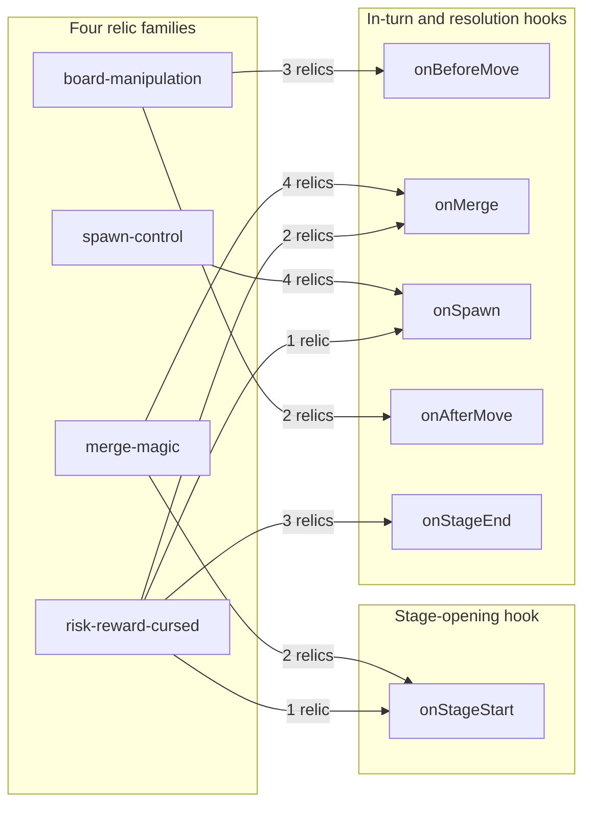

# Relic Catalogue

A relic is **plain data**. It carries an identifier, a name, a rarity, a
description, a table of hook handlers, and — on five of the sixteen — a
charge budget and a state slot. It carries no effect method and no parameter
bag, and no engine, renderer or UI module branches on any individual relic
identifier: a relic reaches the game only by being registered against the hook
bus, which is why adding one touches no engine module. Behaviour living in
hook-bound handler functions rather than in members of the data object is
`DL-RELIC-01`, and the registry being the only construct that names a relic is
`DL-REGISTRY-01`.

This document is the catalogue of the sixteen the game ships. For each it states
the family that declares it, its rarity, the hooks it binds, its charge budget,
its state slot, whether it consumes randomness, and what its handler does in
terms of the configuration members and payload fields it actually touches.

**The family modules under `src/relics/families/` are authoritative.** Every
value on this page was read out of them. If this document and a module ever
disagree, the module is right and this document is stale.

It does not argue any of it. Rationale lives in
[`docs/DECISION_LOG.md`](DECISION_LOG.md) and nowhere else, and this document
cites it by identifier — `DL-RELIC-01`, `DL-DRAW-02` and so on — wherever a
reader would otherwise ask why. The identifier namespace is `DL-<AREA>-<NN>`
(`DL-DOC-01`).

**Figure numbering in this document is local to it.** Its one figure is `Figure
R1`. The unprefixed Figures 1 through 8 belong to
[`docs/architecture/`](architecture/ARCHITECTURE.md) and
[`docs/TRACEABILITY_MATRIX.md`](TRACEABILITY_MATRIX.md), and none of them is
reproduced here — in particular `Figure 5`, the hook dispatch sequence, is
cross-referenced from
[`hook-dispatch-sequence.md`](architecture/hook-dispatch-sequence.md) rather
than redrawn.

One naming note for searchers. The requirements name the fourth family in prose
as `risk/reward-cursed`. The identifier is the hyphenated
**`risk-reward-cursed`** — it matches the filename and the `RelicFamilyName`
union — and that is the form used everywhere below.

## Contents

- [1. The relic data shape](#1-the-relic-data-shape)
- [2. The two records a run holds](#2-the-two-records-a-run-holds)
- [3. Rarity and its weights](#3-rarity-and-its-weights)
- [4. Which family binds which hook](#4-which-family-binds-which-hook)
- [5. The sixteen at a glance](#5-the-sixteen-at-a-glance)
- [6. Spawn control](#6-spawn-control)
- [7. Merge magic](#7-merge-magic)
- [8. Board manipulation](#8-board-manipulation)
- [9. Risk, reward and curses](#9-risk-reward-and-curses)
- [10. Charges](#10-charges)
- [11. Order and compounding](#11-order-and-compounding)
- [12. The reward draw](#12-the-reward-draw)
- [13. Adding a relic](#13-adding-a-relic)
- [14. What each family reads from
  configuration](#14-what-each-family-reads-from-configuration)
- [15. Where to look next](#15-where-to-look-next)

## 1. The relic data shape

`Relic` is declared in `src/relics/relic-types.ts` with **exactly seven
members**, and the member set is fixed at seven by the implementation contract:

| Member | Type | Required | What it carries |
|---|---|---|---|
| `id` | `string` | yes | The identifier a draw, a pickup and a persisted entry all resolve on. |
| `name` | `string` | yes | The display name the reward card and the HUD tray show. |
| `rarity` | `Rarity` | yes | One of the four tiers of `RARITIES`; the tier the reward draw weights. |
| `description` | `string` | yes | The player-facing sentence the reward card shows. |
| `hooks` | `RelicHooks` | yes | The handler table. Behaviour lives here and nowhere else. |
| `charges` | `number` | no | Charge budget a run starts the relic with. Absent on a relic that fires for the rest of the run. |
| `state` | `unknown` | no | Initial value of the relic's own state slot. JSON data only — no function, no closure, no class instance, no cycle. |

There is deliberately **no `family` member**. Family membership is modelled
outside the type (`DL-RELIC-03`) by three constructs in the same module:

- `RELIC_FAMILY_NAMES` — the frozen tuple `['spawn-control', 'merge-magic',
  'board-manipulation', 'risk-reward-cursed']`, which is also the catalogue's
  family order.
- `RelicFamilyName` — the string union derived from that tuple.
- `RelicFamily { name, relics }` — one record per family. Each module under
  `src/relics/families/` exports exactly one, and `src/relics/relic-registry.ts`
  assembles the four into `RELIC_FAMILIES`.

So the family of a relic is the `name` of the `RelicFamily` that declares it,
and it is read by asking which family record holds the relic — never by
reading a member of the relic.

The four exported family records are `SPAWN_CONTROL_FAMILY`,
`MERGE_MAGIC_FAMILY`, `BOARD_MANIPULATION_FAMILY` and
`RISK_REWARD_CURSED_FAMILY`.

### 1.1 The handler table

`RelicHooks` is `HookHandlerTable` of `src/engine/hooks.ts` under this folder's
name for it, and that is the mapped type:

```ts
type HookHandlerTable = {
  readonly [K in HookName]?: HookHandler<K>;
};

type HookHandler<K extends HookName = HookName> = (
  payload: HookPayloadMap[K],
  context: HookContext,
) => HookPayloadMap[K] | void;
```

Every key is optional, so a relic binds the hooks it acts on and omits the rest.
Because the table is mapped over `HookName`, each handler is typed to **its
own** payload: an `onMerge` handler receives a `MergePayload` and can return
only a `MergePayload`, and a mistyped binding does not compile.

`HookName` has six members and the set is complete and closed — no seventh
hook is declared (`DL-HOOK-01`). Each hook admits changes to some payload
members and not others:

| Hook | Dispatched | Members a handler may transform | Members it must return unchanged |
|---|---|---|---|
| `onStageStart` | once as a stage's board is prepared | `goal` | `stageIndex`, `seed`, `boardSize` |
| `onBeforeMove` | before a move is resolved | `direction`, `cancelled` | `board`, which must come back as the same object |
| `onMerge` | once per merge, so a move resolving two merges dispatches it twice | `resultValue`, `scoreDelta` | `source`, `target` |
| `onSpawn` | once a spawn cell is available | `position`, `value`, `count` | none |
| `onAfterMove` | once a move has been resolved | `score`, `over`, `won` | `moved`, `board`, `terminated` |
| `onStageEnd` | as a stage resolves, whether it cleared its goal or not — a lost or ended run resolves the stage it was on with `cleared: false` (`DL-RUNCTL-30`) | `cleared`, `score` | `stageIndex` |

A return that is not the payload the hook declares — a changed member set, a
substituted live object, a non-finite or out-of-range number — is discarded
and the accumulated payload stands (`DL-HOOKBUS-05`). Two members are worth
calling out because relics in this catalogue use them as their whole effect:
setting `cancelled` on `onBeforeMove` withdraws the move, and returning an
`onSpawn` payload with **no** `position` suppresses the spawn.

### 1.2 What a handler is given, and what it may write

A handler receives `(payload, context)`. The context carries capability-limited
views rather than live objects: `context.config` is a readonly rules view,
`context.grid` is the board's query surface with none of its writes,
`context.rng` yields the run's named substreams, and `context.state` is a
**copy** of the relic's own slot. Nothing a handler is handed reaches the
lattice, a `Tile`, or the shared rules object directly.

Board and rule changes are therefore **requested, not performed**. A handler
records commands on `context.effects`, and `src/engine/hook-bus.ts` applies them
only once that handler has returned and its return has validated (`DL-BOARD-02`,
`DL-RISK-02`). The commands the relics below use are `insertTile`, `removeTile`,
`moveTile`, `restoreBoard`, `resizeBoard`, `setMergePredicate` and
`setSpawnWeights`; every one reports whether it was accepted and none throws.

## 2. The two records a run holds

A `Relic` is a declaration — a template shared by every run. Two further
records carry the per-run values:

`ActiveRelic` is what `RelicRegistry` holds, one per relic a run has picked up:

| Member | What it carries |
|---|---|
| `definition` | The `Relic` declaration this record wraps. |
| `pickupOrder` | Zero-based position in acquisition order, assigned at pickup and never reassigned. This is the order the bus dispatches in. |
| `charges` | Charges remaining, counting down from `definition.charges`. `undefined` on a relic with no budget; `0` on one whose budget is spent. |
| `state` | The relic's own slot for this run, initialised from a copy of `definition.state`. |

`PersistedRelic` is the narrower triple the run envelope stores:

```ts
interface PersistedRelic {
  readonly id: string;
  readonly charges?: number;
  readonly state?: unknown;
}
```

That triple is **exactly** what the run-state envelope's `relics` array carries
(`DL-RELIC-02`) — the wire holds no name, description, rarity or handler
table, and a relic is restored by looking `id` up in the catalogue with
`findRelicById()`. The array's order **is** pickup order, and
`src/run/run-state.ts` preserves it on every read and every write, never
sorting, filtering or re-keying it. `MAX_PERSISTED_RELICS` bounds it at 64.

Two ownership rules follow, and both matter to anyone reading a relic's live
numbers:

- `charges` is **written only by the bus**. `RelicRegistry` reports it and
  persists it; `src/engine/hook-bus.ts` is the only construct that deducts from
  it (`DL-HOOKBUS-01`).
- Every read refreshes the registry's records from the bus before reporting them
  (`DL-REGISTRY-03`), so the HUD tray, the diagnostics surface and the persisted
  list cannot show a charge count the bus has already changed.

For the configuration members relics read, see
[`docs/CONFIGURATION.md`](CONFIGURATION.md); for how the envelope is versioned,
loaded and reconciled, see `src/run/run-state.ts` and
`src/run/run-state-store.ts` with decisions `DL-RUN-01` through `DL-RUN-07` and
`DL-RUNSTORE-01` through `DL-RUNSTORE-06`.

## 3. Rarity and its weights

`RARITIES` is a frozen tuple of **four** tiers, most common first, and `Rarity`
is the string union derived from it. `DEFAULT_RARITY_WEIGHTS` gives each tier
its default draw weight. The catalogue holds one relic of each tier in each
family, so every tier holds four:

| Tier | Default weight | Relics at this tier |
|---|---|---|
| `common` | 8 | 4 |
| `uncommon` | 4 | 4 |
| `rare` | 2 | 4 |
| `legendary` | 1 | 4 |

The weights are relative, not probabilities. `src/relics/relic-draw.ts` consumes
this table by default and accepts an override through its `weights` option; a
tier the override omits, or gives a non-finite value, falls back to the default
above.

## 4. Which family binds which hook

Which hooks a family reaches is the fact a reader most often wants and the one
prose renders worst, so it is drawn.

**Figure R1 — Relic-to-Hook Binding Map: which of the six engine hooks each
relic family binds, and how many of its four relics bind each one.**



**Legend for Figure R1.** *Relic-to-Hook Binding Map.* Each left-hand box is one
family module under `src/relics/families/`, and each declares **four** relics;
each right-hand box is one of the six names in `HOOK_NAMES`. An arrow means at
least one relic of that family binds that hook, and its label counts how many of
the family's four do. A family with no arrow to a hook binds it nowhere. The two
right-hand groupings are the point in a turn each hook is reached at, not a
difference in guarding: the charge guard withholds **all six** from a relic whose
budget is spent, `onStageStart` included (`DL-HOOKBUS-07`).
Arrow counts sum to 22 bindings across the sixteen relics, because six relics
bind two hooks each.

Three properties of `Figure R1` are worth stating because they are load-bearing
elsewhere on this page:

- **`risk-reward-cursed` is the only family that binds `onStageEnd`**, which is
  the one hook with no vanilla analogue — nothing in the original game
  resolved a stage.
- Every one of the six hooks is bound by at least one relic, so no hook in the
  mandated set is decorative.
- `merge-magic` is the only family that imports `src/config/default-config.ts`,
  which it does to fall back to `defaultCanMerge` and `defaultProduceMergeValue`
  when wrapping the merge rule in force.

## 5. The sixteen at a glance

Four families of four, and one relic of each rarity in every family. Sixteen
relics, four per family, is the resolution of the plan's working assumption A1
and is recorded in section 2.8 of [`docs/DECISION_LOG.md`](DECISION_LOG.md).

| Family | Common | Uncommon | Rare | Legendary |
|---|---|---|---|---|
| `spawn-control` | Twin Seed | Fertile Ground | Prospector's Eye | Loaded Dice |
| `merge-magic` | Echo Chamber | Alloy Forge | Frostbind | Chain Catalyst |
| `board-manipulation` | Temporal Anchor | Tumbler | Culling Blade | Scouring Wind |
| `risk-reward-cursed` | Collapsing Vault | Gilded Rot | Brittle Crown | Hollow Ascension |

### 5.1 By hook

Which relics fire on a given hook, answerable without reading the four family
tables. Six relics appear twice, because six bind two hooks.

| Hook | Relics bound to it | Count |
|---|---|---|
| `onStageStart` | `frostbind`, `chain-catalyst`, `brittle-crown` | 3 |
| `onBeforeMove` | `temporal-anchor`, `tumbler`, `culling-blade` | 3 |
| `onMerge` | `echo-chamber`, `alloy-forge`, `frostbind`, `chain-catalyst`, `gilded-rot`, `hollow-ascension` | 6 |
| `onSpawn` | `twin-seed`, `fertile-ground`, `prospectors-eye`, `loaded-dice`, `gilded-rot` | 5 |
| `onAfterMove` | `temporal-anchor`, `scouring-wind` | 2 |
| `onStageEnd` | `collapsing-vault`, `brittle-crown`, `hollow-ascension` | 3 |

### 5.2 Every relic, one row each

The whole catalogue in one table — the view the reward screen and the HUD tray
effectively present. Sort it by rarity to read a tier, or by hooks to read a
dispatch point. An em dash means the relic declares nothing there.

| `id` | Name | Family | Rarity | Hooks bound | Charges | State slot | Draws | Effect in one line |
|---|---|---|---|---|---|---|---|---|
| `twin-seed` | Twin Seed | `spawn-control` | common | `onSpawn` | — | — | `relic-draw` | Half the time, raises a lowest-value spawn to the next configured value up. |
| `fertile-ground` | Fertile Ground | `spawn-control` | uncommon | `onSpawn` | — | — | `relic-draw` | Inserts a second tile of the same value beside a tile already on the board. |
| `prospectors-eye` | Prospector's Eye | `spawn-control` | rare | `onSpawn` | — | — | `relic-draw` | Moves the spawn onto the board's outer ring. |
| `loaded-dice` | Loaded Dice | `spawn-control` | legendary | `onSpawn` | — | — | `relic-draw` | Redraws the spawn value against the configured weights reversed. |
| `echo-chamber` | Echo Chamber | `merge-magic` | common | `onMerge` | — | — | none | Adds a quarter of the merge's produced value to the score. |
| `alloy-forge` | Alloy Forge | `merge-magic` | uncommon | `onMerge` | — | — | none | Raises the produced value one further step and scores the increment. |
| `frostbind` | Frostbind | `merge-magic` | rare | `onStageStart`, `onMerge` | 8 | `{ frozen: [] }` | none | Thaws the cell the merge moved out of, toggles the cell it landed on, and re-installs the merge rule that refuses a frozen destination. |
| `chain-catalyst` | Chain Catalyst | `merge-magic` | legendary | `onStageStart`, `onMerge` | — | — | none | Widens the merge rule to pairs one doubling step apart — inheriting any denial the rule it wrapped makes on another ground — then yields from the larger. |
| `temporal-anchor` | Temporal Anchor | `board-manipulation` | common | `onBeforeMove`, `onAfterMove` | 3 | `{ board: null, score: 0 }` | none | Records the last board with room, and on a full board restores it and withdraws the move. |
| `tumbler` | Tumbler | `board-manipulation` | uncommon | `onBeforeMove` | 3 | — | `relic-draw` | Under scarcity, relocates every tile to a drawn empty cell before the move resolves. |
| `culling-blade` | Culling Blade | `board-manipulation` | rare | `onBeforeMove` | 2 | — | none | Removes the single lowest-valued tile once the smallest spawn value has piled up. |
| `scouring-wind` | Scouring Wind | `board-manipulation` | legendary | `onAfterMove` | 1 | `{ scours: 0, row: null }` | none | Clears every tile of the first fully-occupied row. |
| `collapsing-vault` | Collapsing Vault | `risk-reward-cursed` | common | `onStageEnd` | — | `{}` | `relic-draw` | On a cleared stage, shrinks the board by one edge and re-homes the tiles left outside it. |
| `gilded-rot` | Gilded Rot | `risk-reward-cursed` | uncommon | `onMerge`, `onSpawn` | — | — | none | Doubles every merge's score contribution and raises every spawn to the highest configured value. |
| `brittle-crown` | Brittle Crown | `risk-reward-cursed` | rare | `onStageStart`, `onStageEnd` | — | `{}` | none | Quadruples the highest spawn value's weight for the stage, restores it at the end, and pays a quarter-score bounty on a clear. |
| `hollow-ascension` | Hollow Ascension | `risk-reward-cursed` | legendary | `onMerge`, `onStageEnd` | — | `0` | none | Pays four score per banked charge into each merge and banks one more, then empties the bank on an uncleared stage. |

Ten of the sixteen are **deterministic**: they consume no randomness at all and
their handlers contain no draw. Six draw, and every one of the six draws from
the `relic-draw` substream and from no other — `twin-seed`, `fertile-ground`,
`prospectors-eye`, `loaded-dice`, `tumbler` and `collapsing-vault`. No relic
handler in the catalogue addresses `spawn-value` or `spawn-position`
(`DL-SPAWN-02`), and no relic handler calls `Math.random` (`DL-RNG-01`).

## 6. Spawn control

Declared by `src/relics/families/spawn-control.ts`. All four bind **`onSpawn`
alone**, none carries a charge budget, none carries a state slot, and each acts
through the payload's `value`, `position` and `count` members alone
(`DL-SPAWN-01`).

| `id` | Name | Rarity | Hooks bound | Charges | Effect |
|---|---|---|---|---|---|
| `twin-seed` | Twin Seed | common | `onSpawn` | — | Takes one draw in `[0, 1)`. When `payload.value` equals the lowest entry of `config.spawn.values` and the draw is below `0.5`, returns the payload with `value` raised to the next strictly-higher configured value. Otherwise returns it untouched. |
| `fertile-ground` | Fertile Ground | uncommon | `onSpawn` | — | Picks an empty cell that is inside `config.boardSize`, is not the spawn's own `position`, and has at least one orthogonal neighbour holding a tile; records `effects.insertTile(cell, payload.value)` for it. **Returns the payload unchanged** — the engine's own spawn still lands. |
| `prospectors-eye` | Prospector's Eye | rare | `onSpawn` | — | Picks an empty cell on the outer ring — first or last column, first or last row — of a board of edge `config.boardSize`, and returns the payload with `position` set to it. |
| `loaded-dice` | Loaded Dice | legendary | `onSpawn` | — | Reverses `config.spawn.weights`, draws a value from `config.spawn.values` against the reversed weights, and returns the payload with `value` set to it. |

Notes a reader will want:

- **All four draw.** Each takes its randomness from the `relic-draw` fork the
  bus hands it, so the engine's own `spawn-value` and `spawn-position` sequences
  stay exactly where the base game put them (`DL-SPAWN-02`).
- Both `config.boardSize` readers measure it **at the moment of the spawn**, so
  a board a cursed relic has already shrunk yields no cell beyond its new edge.
  `prospectors-eye` therefore records nothing at stage start and binds no stage
  hook (`DL-SPAWN-03`).
- Each handler returns the payload untouched on every path it cannot act on: a
  distribution with fewer than two values, a spawn that is not at the lowest
  value, a payload with no `position`, a board offering no candidate cell, or a
  `values`/`weights` pair of unequal length.

## 7. Merge magic

Declared by `src/relics/families/merge-magic.ts`. All four bind `onMerge` for
their effect; `frostbind` and `chain-catalyst` bind `onStageStart` as well, to
install the standing merge rule their merge effect then reads (`DL-MERGE-01`).
None of the four draws randomness. `resultValue` and `scoreDelta` are separate
payload members and are transformed independently (`DL-MERGE-02`).

| `id` | Name | Rarity | Hooks bound | Charges | Effect |
|---|---|---|---|---|---|
| `echo-chamber` | Echo Chamber | common | `onMerge` | — | Returns the payload with `scoreDelta` raised by `floor(resultValue * 0.25)`. `resultValue` is left exactly as it arrived. A bonus that is not a positive finite number leaves the payload untouched. |
| `alloy-forge` | Alloy Forge | uncommon | `onMerge` | — | Applies `config.merge.produce` to the arriving `resultValue` as both operands, and returns the payload with `resultValue` set to that result and `scoreDelta` raised by the increment. A result that is not finite, not positive, or not above the arriving value leaves the payload untouched. |
| `frostbind` | Frostbind | rare | `onStageStart`, `onMerge` | 8 | On `onMerge`: removes the cell `payload.source` stands in from its frozen-cell ledger, then toggles the cell `payload.target` stands in — frosting a cell the ledger lacks, thawing one it holds — writes the new ledger to its state slot, records a `config.merge.canMerge` **wrapper** through `effects.setMergePredicate`, and asks for a charge. On `onStageStart`: filters the ledger to `payload.boardSize` and re-installs the same wrapper. |
| `chain-catalyst` | Chain Catalyst | legendary | `onStageStart`, `onMerge` | — | On `onStageStart`: records a `config.merge.canMerge` wrapper that also accepts a pair whose two values are one `config.merge.produce` step apart, **provided the predicate it wrapped would accept that same pair at equal values** — so a denial made on any ground other than the value difference is inherited rather than overridden. On `onMerge`: for a pair whose `source.value` and `target.value` differ, sets `resultValue` to the producer applied to the larger of the two and raises `scoreDelta` by the increment. |

### 7.1 Frostbind is a merge-rule wrapper, and its `onMerge` returns `void`

`frostbind` is the relic most likely to surprise, on three counts.

Its effect is not a change to the merge being resolved. Its `onMerge` handler
**returns nothing**, which under the compounding protocol means *keep the
incoming payload* (`DL-HOOKBUS-03`) — so the merge that triggered it scores
and produces exactly what it would have without the relic. What the handler
changes is the rule that decides *future* merges: it records a predicate that
delegates to the predicate in force and then refuses any merge whose destination
cell stands in its ledger. The wrapper carries a non-enumerable marker naming
the predicate it delegates to, so a stage that begins against an already-wrapped
rule installs no second wrapper.

**The frost travels with the tile, and only the source thaw is reachable by
play.** Each merge does two things to the ledger, in order: the cell
`payload.source` moved out of is thawed, and the cell `payload.target` stands in
is toggled. The source thaw is the one a legal move produces, because the rule
the relic installs constrains a merge's *destination* and never its source — so
a frosted tile that slides out and merges elsewhere releases the frost behind it
and lays a new one where it lands. The destination toggle's thaw half is the
defined answer for a merge that lands *on* a frosted cell, which this relic's own
rule refuses; it is reachable only if a later relic replaces the merge rule
outright instead of wrapping it (`DL-MERGE-04`).

Its ledger is re-installed **every stage**, which is the second binding
(`DL-MERGE-01`). A reload yields a fresh configuration carrying the untouched
default predicate, so the install is made again on each stage of a resumed run —
for as long as the relic has charges. Once the budget is spent the charge guard
withholds every hook, `onStageStart` included (`DL-HOOKBUS-07`), so the
re-install is no longer reached; the frost those spent charges bought is put back
instead by `applyStandingRelicRules()` of `src/relics/relic-registry.ts` when the
envelope's relics are restored, which reads the persisted ledger and writes the
live rules without dispatching to anything (`DL-REGISTRY-04`, `DL-MERGE-05`).

It is the family's only charge-carrying relic, at **8**, and it is the one relic
outside `board-manipulation` that carries a budget at all. See [section
10](#10-charges).

### 7.2 Chain Catalyst widens which values may merge, and nothing else

The predicate `chain-catalyst` installs accepts a pair the rules would otherwise
refuse — two values one doubling step apart — but restates the
one-merger-per-traversal guard on that widened branch, refusing a target that
has already merged during the traversal in progress. The widening reaches
values, not turn structure (`DL-MERGE-03`). Its `onMerge` handler returns
nothing for an equal-valued pair, so a merge the ordinary rule admitted is left
alone.

**It also inherits a denial its delegate made on any other ground.** A predicate
returning `false` says only *no*, so before overruling one this wrapper asks the
predicate it wrapped the same question with the value difference removed — the
same two operands, in the same cells, with the same merge history, at equal
values. Where the delegate refuses that too, the refusal was not about the
values and it stands. This is what keeps the two predicate-installing relics of
this family composing in **either** pickup order: with `frostbind` picked up
first its ledger is the inner verdict, and a ladder-step pair aimed at a frozen
cell is refused rather than admitted past the frost. The probe reads the
delegate's own answers and names no relic, so it holds against any predicate a
later relic installs (`DL-MERGE-03`).

## 8. Board manipulation

Declared by `src/relics/families/board-manipulation.ts`. This is the
charge-carrying family: **all four declare a budget**, and each writes the board
through the effect queue rather than touching the lattice (`DL-BOARD-02`). None
reads, compares or writes its own charge count; each asks for a charge through
`context.spendCharge()` on the one path where its effect took hold
(`DL-BOARD-01`).

| `id` | Name | Rarity | Hooks bound | Charges | Effect |
|---|---|---|---|---|---|
| `temporal-anchor` | Temporal Anchor | common | `onBeforeMove`, `onAfterMove` | 3 | On `onAfterMove`: while `payload.board.cellsAvailable()` is true, records `payload.board.serialize()` and `payload.score` into its slot, replacing any anchor held. On `onBeforeMove`: while the board holds no empty cell, an anchor is held, at least one of its occupied cells still falls on the live board, and `payload.cancelled` is still `false` — records `effects.restoreBoard(board, score)`, sets **`payload.cancelled = true`**, and asks for a charge. |
| `tumbler` | Tumbler | uncommon | `onBeforeMove` | 3 | While the empty cells number at least one and at most `ceil(boardSize * boardSize * 0.25)`, walks the occupied cells and records `effects.moveTile` from each to a cell drawn from those still empty at that point. Asks for one charge once at least one tile was relocated. Returns the payload unchanged. |
| `culling-blade` | Culling Blade | rare | `onBeforeMove` | 2 | While the empty cells exceed that same scarcity band and at least 6 tiles carry the lowest entry of `config.spawn.values`, records `effects.removeTile` for the single lowest-valued occupied cell. Asks for a charge only if the removal was recorded. Returns the payload unchanged. |
| `scouring-wind` | Scouring Wind | legendary | `onAfterMove` | 1 | Finds the first fully-occupied row — one row being a single `y` across every `x` — collects it before recording anything, then records `effects.removeTile` for each of its cells in ascending `x`. Increments its sweep count and records the row swept. Asks for one charge once a row was found and cleared. Returns the payload unchanged, so the score, win flag and loss flag the move resolved to are the ones the engine adopts. |

Notes a reader will want:

- **`temporal-anchor` is the veto.** Setting `payload.cancelled` on
  `onBeforeMove` is what withdraws the move, and it is the only relic in the
  catalogue that does so. It also declines to act on a move another relic has
  already withdrawn, so it neither rewinds twice nor pays twice.
- **`culling-blade` and `scouring-wind` are deterministic.** Neither takes a
  draw: the blade chooses by face value and, among equal values, by the x-outer
  y-inner scan order, so the same board always yields the same excision; the
  wind chooses the first full row. `temporal-anchor` takes no draw either. Only
  `tumbler` draws, and it draws from `relic-draw`.
- Nothing here reindexes or compacts the board. `scouring-wind` empties cells
  without moving anything, so every tile outside the cleared row keeps the exact
  cell it occupied.

## 9. Risk, reward and curses

Declared by `src/relics/families/risk-reward-cursed.ts` — the family the
requirements name in prose as `risk/reward-cursed`. **None of the four carries a
charge budget.** Each pairs a gain with a cost, and each pays for it through a
transformable payload member or an effect the engine applies (`DL-RISK-02`).
Three of the four bind `onStageEnd`, and this is the only family that binds it
at all.

| `id` | Name | Rarity | Hooks bound | Charges | Effect |
|---|---|---|---|---|---|
| `collapsing-vault` | Collapsing Vault | common | `onStageEnd` | — | On a stage where `payload.cleared` is true: reduces `config.boardSize` by 1, floored at 3; re-homes each tile now outside that edge, highest face value first, into a drawn cell inside it via `effects.moveTile`; records `effects.resizeBoard(size)`, which writes the size into the lattice **and** the rules together; and records the new edge length in its own state slot. Does nothing, and takes no draw, once the floor is reached. |
| `gilded-rot` | Gilded Rot | uncommon | `onMerge`, `onSpawn` | — | On `onMerge`: returns the payload with `scoreDelta` set to `floor(scoreDelta * 2)`. On `onSpawn`: returns the payload with `value` set to the highest entry of `config.spawn.values`, keeping the cell it arrived with. Returns nothing where the arriving number is not finite, where the spawn carries no `position`, or where the value is already the highest. |
| `brittle-crown` | Brittle Crown | rare | `onStageStart`, `onStageEnd` | — | On `onStageStart`: saves the live `config.spawn.weights` into its slot and records `effects.setSpawnWeights` with the highest configured value's weight multiplied by 4 and every other weight unchanged. On `onStageEnd`: restores the saved weights, clears its slot, and — on a cleared stage — returns the payload with `score` raised by `floor(score * 0.25)`. |
| `hollow-ascension` | Hollow Ascension | legendary | `onMerge`, `onStageEnd` | — | On `onMerge`: reads the bank from its slot, banks one more first (clamped at 4096), then returns the payload with `scoreDelta` raised by `floor(bank * 4)` — the bank **as it stood before this merge**. On `onStageEnd`: sets the bank to `0` when `payload.cleared` is false, and leaves it untouched when the stage was cleared. |

### 9.1 Collapsing Vault mutates the board size, in both places at once

This is the board-size-altering cursed relic, and it is the one whose mechanics
reach furthest outside its own handler.

`effects.resizeBoard(size)` writes the new edge length into the live lattice
**and** into `config.boardSize`, so the loss probe, the win check and the
renderer's framing all follow the board that now exists rather than the one the
stage opened with. Tiles inside the new bound keep the exact cell they occupied
and the re-homed survivors keep the cells they were moved to — nothing is
reindexed or compacted, which is what keeps tile positions intact across the
mutation.

The relic also writes the implied edge length into its **own persisted state
slot** (`DL-RISK-01`). That copy is what the reload path reads:
`src/run/run-state-store.ts` reconciles board size before any grid is
constructed, taking the size an active board-mutating relic implies ahead of the
configured size and the saved size (`DL-RUNSTORE-01`, `DL-RUNSTORE-05`), so a
saved board is never rehydrated at the wrong edge length.

**A collapse can end the run, and the commit says so.** A tighter board can be
full with no adjacent match, and `Engine.endStage()` re-derives the terminal
verdict after the stage-end board commands are applied and before it commits
(`DL-ENGINE-15`), so the flag published is the flag of the board the collapse
produced. This is not the relic's own doing — the relic records lattice commands
and reads no verdict — but it is what makes the collapse safe: the engine
published the PRE-collapse verdict before that re-derivation, so an unplayable
collapsed board was offered a reward and carried into a next stage as though it
were playable.

### 9.2 Brittle Crown's save-and-restore is reload-safe

The crown does not compute its skew from whatever weights it happens to find. It
saves a baseline into its slot on the first stage start and reads that baseline
back on every later one, so skewing a stage that began against already-skewed
weights cannot compound the multiplier. At stage end it restores the baseline
and **clears the slot**, which is the pair that makes a reload mid-run safe: the
weights a resumed run finds are the configured ones, and the crown re-derives
its skew from them at the next stage start.

The restoration runs on **either** stage outcome, and it is reached on either
one: a run that is lost or ended resolves the stage it was on with
`cleared: false` before it summarises (`DL-RUNCTL-30`), so the weights are
returned to their baseline on the way out of a run and not only on the way to a
reward. Only the clearing bounty is gated on `payload.cleared`.

### 9.3 Hollow Ascension banks before it pays

The order inside the handler matters to anyone predicting a score. The bank is
raised **first**, then the bonus is computed from the value the bank held
*before* this merge — so the first merge of a run pays nothing and banks one,
the second pays 4, the third pays 8, and so on, clamped at a bank of 4096. Its
state slot is a bare number rather than an object. On an uncleared stage the
bank is zeroed outright; on a cleared one it carries forward — and the uncleared
outcome is one the run actually produces, because a lost or ended run resolves
its stage with `cleared: false` before summarising (`DL-RUNCTL-30`).


## 10. Charges

**Five relics carry a charge budget.** The other eleven declare no `charges`
member, fire for the rest of the run, and are never charge-guarded.

| `id` | Family | Charges | What one charge pays for |
|---|---|---|---|
| `frostbind` | `merge-magic` | 8 | One resolution of a merge against the ledger: the source cell thawed and the destination cell toggled. |
| `temporal-anchor` | `board-manipulation` | 3 | One rewind to the anchored board, and the withdrawal of that move. |
| `tumbler` | `board-manipulation` | 3 | One tumble, however many tiles it relocated. |
| `culling-blade` | `board-manipulation` | 2 | One excision of the board's lowest tile. |
| `scouring-wind` | `board-manipulation` | 1 | One row clear, however many cells it emptied. |

The five do **not** sit in one family. Four are the whole of
`board-manipulation` — undo, shuffle, excise and row-clear — and the fifth,
`frostbind`, is a freeze-and-unfreeze effect and sits in `merge-magic`. That is
the concrete resolution of the plan's working assumption A2: charge relics live
in `board-manipulation` except where the relic's own name implies a different
family, and `frostbind` is that exception. The four are named in `DL-BOARD-01`;
`frostbind`'s placement follows from its binding, recorded in `DL-MERGE-01`; the
count of four per family is section 2.8 of
[`docs/DECISION_LOG.md`](DECISION_LOG.md). Expect the asymmetry rather than
tidying it away — a reader who assumes "charge relic" means
"board-manipulation relic" will be wrong about `frostbind`.

### 10.1 The guard lives in the bus, not in any handler

The charge guard is implemented once, in `src/engine/hook-bus.ts`
(`DL-HOOKBUS-01`). Before a handler is reached the bus reads the subscriber's
`charges`; if it is present and not above zero, the subscriber is **skipped**
— the handler is never invoked. Four consequences follow, and every one is
verifiable by reading the family modules:

- **A zero-charge relic is skipped, not invoked.** It cannot throw, and it
  cannot corrupt run state, because none of its code runs. This is one guard
  covering all sixteen relics, and the seventeenth nobody has written yet.
- **No handler contains a charge check.** Search the four family modules: there
  is no comparison against `charges` anywhere in them.
- **No handler reads or decrements `charges`.** A handler that acted calls
  `context.spendCharge()` — a *request* — and the bus deducts it only once
  that handler's return has validated. A handler that asked and then threw, or
  whose return was refused, leaves the budget where it stood.
- **A dispatch that changed nothing costs nothing.** Each of the five asks for
  its charge on the one path where its effect took hold, and on no other:
  `tumbler` asks only once a tile was actually relocated, `culling-blade` only
  once a removal was recorded, `scouring-wind` only once a full row was found
  and cleared, `temporal-anchor` only once the restore was accepted.

`spendCharge(amount)` rounds towards zero, clamps at zero from below, caps at
the budget held, and defaults to `1`. It reports `false` for a relic carrying no
budget, for an amount that rounds to zero, and for a call made after the handler
has returned. Repeated calls within one dispatch accumulate.

### 10.2 No exception: all six hooks are withheld from an exhausted relic

The guard covers every one of the six names, `onStageStart` included, so a relic
whose budget is spent runs **no** handler and applies **no** effect
(`DL-HOOKBUS-07`). That is AAP R3 and validation gate V6 read literally: a relic
with limited charges stops firing once they are exhausted.

A standing rule the spent charges had already bought is a different thing from a
relic firing again, and it survives by a different route. `frostbind`'s frozen
cells live in its persisted `state` slot, and `applyStandingRelicRules()` of
`src/relics/relic-registry.ts` rebuilds the merge predicate from that slot when
the envelope's relics are restored — a plain function over the slot and the live
rules, with no hook, no payload, no dispatch context and no charge budget in
sight (`DL-REGISTRY-04`, `DL-MERGE-05`). Restoring is not firing, so the guard
has no reason to reach it.

### 10.3 One budget and one slot per relic, however many hooks it binds

`RelicRegistry` holds one `ActiveRelic` per relic, and the bus holds one
registration per relic carrying its whole handler table (`DL-REGISTRY-02`). So
all of a relic's hook bindings share **one** mutable charge pool and **one**
`state` slot. `temporal-anchor` binds two hooks and has three charges in total,
not three per hook; the anchor its `onAfterMove` handler records is the anchor
its `onBeforeMove` handler reads.

`RelicRegistry.activate()` is the second path to a deduction, which a manual
activation reaches, and it draws on that same single budget.

## 11. Order and compounding

### 11.1 Pickup order decides dispatch order

Every relic is assigned a zero-based `pickupOrder` when it is taken on. The bus
holds its registrations in that order by insertion, so a dispatch neither copies
nor sorts them (`DL-HOOKBUS-02`). Three properties matter:

- Order is **acquisition order**, not registration accident: a renderer or UI
  module subscribing later cannot reorder a relic.
- Pickup order is **monotonic and never renumbered**. It advances only on an
  accepted pickup, so removing a relic renumbers nothing.
- **Two relics on the same hook both fire**, in pickup order. Neither replaces
  the other and neither can pre-empt the other.

An edit arriving during a dispatch — a pickup, a removal — is deferred until
the walk returns, so a dispatch sees a stable membership.

For the mechanical picture of one dispatch fanning out across several relics
with the guard and the error containment in place, see `Figure 5` in
[`hook-dispatch-sequence.md`](architecture/hook-dispatch-sequence.md) under
`docs/architecture/`. It is not reproduced here.

### 11.2 The compounding protocol

Each handler receives the payload **as the previous handler left it** and
returns either a payload, which replaces the accumulated one, or nothing, which
leaves it as it stands (`DL-HOOKBUS-03`). That is what makes two relics on one
hook compound rather than overwrite.

### 11.3 A worked example: Echo Chamber and Alloy Forge on one merge

Take a run holding both, and a move in which two 64 tiles merge. Under the
default rules the merge branch dispatches `onMerge` with `resultValue` and
`scoreDelta` **both** set to the produced value, `128`.

`echo-chamber` picked up first, `alloy-forge` second:

| Point in the dispatch | `resultValue` | `scoreDelta` | What just happened |
|---|---|---|---|
| dispatched by the engine | 128 | 128 | `config.merge.produce` doubled 64. |
| after `echo-chamber` | 128 | **160** | Added `floor(128 * 0.25) = 32`. The produced value is untouched. |
| after `alloy-forge` | **256** | **288** | Raised 128 to `produce(128, 128) = 256`, and added the increment `256 - 128 = 128` to the 160 it received. |

The engine creates a **256** tile and adds **288** to the score.

Now swap the pickup order — `alloy-forge` first, `echo-chamber` second:

| Point in the dispatch | `resultValue` | `scoreDelta` | What just happened |
|---|---|---|---|
| dispatched by the engine | 128 | 128 | Identical starting payload. |
| after `alloy-forge` | **256** | **256** | Raised 128 to 256 and added the increment 128. |
| after `echo-chamber` | 256 | **320** | Added `floor(256 * 0.25) = 64` — a quarter of the value `alloy-forge` had already raised. |

Same tile, **320** score instead of 288. Pickup order is not cosmetic: it is
part of what a build does. The rule of thumb the example demonstrates is that a
relic reading a member an earlier relic wrote sees the written value, so
ordering a value-raiser before a percentage-taker compounds the percentage.

### 11.4 A throwing handler is isolated, and its relic is left degraded

A handler that throws is caught. The throw is reported through the injected
reporter with the run's correlation identifier, the subscriber is marked
**degraded**, and the dispatch **continues** with the payload exactly as it
stood before that handler ran (`DL-HOOKBUS-04`). The turn completes.

"Degraded" is sticky and it is not the same as "exhausted". For subsequent
turns:

- The bus skips a degraded subscriber on **every** hook, before the charge guard
  is even reached, for the rest of its registration. It is not retried on the
  next turn and not restored at the next stage.
- The relic stays in the run: it is still held, still occupies its pickup
  position, and is still persisted. It simply never fires again.
- `RelicRegistry.degradedIds()` reports the degraded set in pickup order, and
  the bus reports the exhausted and detached sets separately, so a HUD can tell
  a broken relic from a spent one.

A throwing handler leaves nothing behind. Its payload copy, its state-slot copy,
its charge request, its recorded board effects and every draw it took are all
part of one per-handler transaction, adopted together on a validated return and
discarded together on a throw. So a relic that draws randomness and then throws
consumes no draw and perturbs no later spawn.

### 11.5 Dispatch order is part of the reproducibility contract

Hook dispatch order decides the order in which handlers *consume* randomness,
so deterministic dispatch order is itself part of the seeded reproducibility
guarantee. Two relics that both draw will draw in pickup order, and the same
seed plus the same moves reproduces a run only while that order stays fixed.
The substream separation of `DL-RNG-04` bounds the reach of a change — a relic
drawing from `relic-draw` cannot shift the `spawn-position` sequence — but
within a substream, order is the guarantee.

## 12. The reward draw

`drawRelicOffers` in `src/relics/relic-draw.ts` produces the set a reward screen
presents.

```ts
interface RelicDrawOptions {
  readonly pool: readonly Relic[];
  readonly ownedIds?: readonly string[] | ReadonlySet<string>;
  readonly count?: number;
  readonly streams: RngStreams;
  readonly weights?: Readonly<Record<Rarity, number>>;
}

function drawRelicOffers(options: RelicDrawOptions): readonly Relic[];
```

| Option | Required | Behaviour |
|---|---|---|
| `pool` | yes | The relics a draw may offer, in the order it will consider them. Neither the array nor any relic in it is modified. |
| `ownedIds` | no | Identifiers to exclude. Accepts an array or a set; the caller's set is never added to. |
| `count` | no | Offers wanted. Absent means **3**. A value that is not finite, or is at or below zero, yields no offer and advances no cursor. Otherwise it is floored. |
| `streams` | yes | The run's substream table. |
| `weights` | no | Per-tier weight override. A tier it omits or gives a non-finite value falls back to `DEFAULT_RARITY_WEIGHTS`. |

It returns a fresh array of **distinct** relics — at most `count`, and at most
as many as the eligible pool can supply.

### 12.1 Without replacement, from two substreams

Each offer is selected in two steps. A **tier** is drawn from the
`rarity-weight` substream, weighted across only those tiers that still hold a
candidate *and* carry a weight above zero. A **relic within that tier** is then
drawn uniformly from the `relic-draw` substream. The chosen relic is removed
from its bucket before the next selection, which is what makes the next one a
draw without replacement (`DL-DRAW-01`).

That is why "a set of three never contains a duplicate" is structural rather
than a property of a retry loop that happens to terminate. Two further
guarantees come with it:

- **Exactly two substreams are consumed, and no others** (`DL-DRAW-02`).
- **Exactly one draw is taken from each, per offer returned** (`DL-DRAW-03`) —
  so three cards means three draws from each of the two cursors, and a selection
  that finds nothing selectable consumes nothing.

Because tiers are weighted separately from the pick within a tier, adding a
relic to one tier does not shift the tier sequence, so a recorded seeded offer
sequence survives a catalogue addition in a *different* tier.

### 12.2 Eligibility, and what happens when the pool runs low

`eligibleRelics(pool, ownedIds)` is the filter, and it does two things: it drops
every relic whose `id` appears in `ownedIds`, and it suppresses any later repeat
of an identifier already admitted, keeping the first entry alone. So the result
can never hold two relics with the same identifier whatever the caller passed,
and it preserves the incoming order.

**Plan for a pool that falls below three.** Late in a run, once relics have been
taken, the eligible pool shrinks. The draw does not error and does not pad: the
selection loop breaks as soon as nothing is selectable and the function returns
what it has. The offer count therefore degrades gracefully — two cards, one
card, or an empty array once the sixteenth relic is held. A reward screen must
render the count it is handed rather than assume three. A tier weighted to zero
is unreachable, so the effective ceiling is the number of eligible relics
sitting in tiers with a positive weight.

### 12.3 The draw is pure and injectable

The pool and the owned-identifier set arrive as **parameters**. The function
reads no registry and no module-level state, and the registry does not call it
— there is no coupling in either direction. Two consequences: the no-duplicate
property is testable against a hand-built pool of two or three relics with no
registry in sight, and a shorter pool can be injected wherever a narrower draw
is wanted.

### 12.4 Declared order is load-bearing

> **Warning.** The order relics are declared in is part of the seeded
> reproducibility contract. `src/relics/relic-registry.ts` builds
> `RELIC_CATALOGUE` by ordering the families as `RELIC_FAMILY_NAMES` lists them
> and then flattening each family's `relics` array **in its declared order**,
> and `relic-draw.ts` preserves the order of the list it is given. A relic's
> position in that flattened list is therefore what a seeded draw resolves
> against.
>
> **Moving a relic within its family module, or reordering the families, changes
> the seeded offer sequence and will break existing snapshot expectations** —
> and it will do so silently, because nothing about the change looks like a
> behaviour change. There is no runtime symptom: the game plays, the offers are
> still distinct and still weighted correctly, and the only thing that reports
> the breakage is `npm run test:snapshot`.

Adding a relic to the **end** of a family's array is the least disruptive edit,
because it leaves every earlier relic at the index it already had. If a
reordering is genuinely wanted, expect to re-record the seeded snapshots and to
say so in the change.

## 13. Adding a relic

Adding a relic requires **no engine change**. That is the property the whole
design exists to deliver: the bus dispatches by hook name, the registry resolves
by identifier, and nothing anywhere branches on which relic it is holding
(`DL-REGISTRY-01`).

The steps:

1. **Choose the family** and open its module under `src/relics/families/`. The
   family of a relic is the module that declares it — there is nothing else to
   register.
2. **Declare the relic as frozen plain data** carrying the seven members of
   `Relic` and no others: `id`, `name`, `rarity`, `description`, `hooks`, and
   `charges` and `state` if it needs them.
3. **Bind handlers** in `hooks` for the hooks it acts on, choosing from the six
   names in `HOOK_NAMES`. Read what your hook admits from the table in [section
   1](#1-the-relic-data-shape): return a transformed payload to change it, or
   return nothing to leave it alone.
4. **Write the board through `context.effects`**, never directly. The queue
   reports acceptance and never throws.
5. **Take randomness only from `context.rng.stream('relic-draw')`.**
6. **If it is charge-based**, declare `charges` and call `context.spendCharge()`
   on the one path where the effect actually took hold.
7. **Append it to the family's `relics` array** — at the end, unless you
   intend to re-record the seeded snapshots. See
   [12.4](#124-declared-order-is-load-bearing).
8. **Add its row to this document**, in
   [5.2](#52-every-relic-one-row-each) and in its family's table.

What **not** to do:

| Don't | Because |
|---|---|
| Check, compare or decrement `charges` in a handler | The guard is in the bus (`DL-HOOKBUS-01`). A handler-side check is redundant at best and a second source of truth at worst. |
| Add a `family` member to the relic object | The shape is exactly seven members; family lives outside it (`DL-RELIC-03`). |
| Call `Math.random()`, `Date.now()` or read a clock | The run PRNG is the only randomness (`DL-RNG-01`), and a clock read would break seeded reproducibility. |
| Draw from `spawn-value` or `spawn-position` | Those are the engine's own sequences; a relic drawing from them would shift base-game spawns (`DL-SPAWN-02`). |
| Import anything from `src/observability/**` | Relics are data plus handlers. The bus already reports every dispatch, skip, fault and charge spend. |
| Wrap a handler body in `try`/`catch` | The bus isolates errors per subscriber (`DL-HOOKBUS-04`). A local catch hides the fault and stops the relic being marked degraded. |
| Mutate `context.config`, the grid or a tile | A handler is handed readonly views; changes go through the effect queue (`DL-BOARD-02`). |
| Special-case the relic anywhere in the engine, renderer or UI | That is precisely the property the requirement forbids (`DL-REGISTRY-01`). |
| Put a non-JSON value in `state` | The slot is persisted and copied in and out of every dispatch: no function, no closure, no class instance, no cycle. |

The test obligations an author inherits, one suite per relic under
`tests/unit/relics/`:

- It **fires only on its bound hooks** — dispatching an unbound hook changes
  nothing.
- It **produces its specified effect** on the path it is written for, and
  returns the payload untouched on every path it is not.
- It **respects charges**, including a zero-charge invocation that neither
  throws nor changes run state.

## 14. What each family reads from configuration

Relics read the same `RulesConfig` the base game reads — there is no second,
relic-only rules object — and they read it at use time, so a value another
relic has already changed is the value they see.

| Family | Configuration members it reads |
|---|---|
| `spawn-control` | `boardSize`, `spawn.values`, `spawn.weights` |
| `merge-magic` | `merge.canMerge`, `merge.produce` |
| `board-manipulation` | `boardSize`, `spawn.values` |
| `risk-reward-cursed` | `boardSize`, `spawn.values`, `spawn.weights` |

`merge-magic` reads no `boardSize` from configuration: the edge length
`frostbind` filters its ledger against arrives on the `onStageStart` payload,
which carries the reconciled size the stage's grid was actually built at.

Every member named above is documented in
[`docs/CONFIGURATION.md`](CONFIGURATION.md), which is the reference for what
each means and what its default is. A relic that substitutes a rule does so
through the effect queue — `setMergePredicate`, `setSpawnWeights`,
`resizeBoard` — rather than by writing the shared object, so the substitution
is transactional with the rest of the handler's work.

## 15. Where to look next

- [`docs/CONFIGURATION.md`](CONFIGURATION.md) — the rules and stage schemas,
  and the defaults behind every member named in
  [14](#14-what-each-family-reads-from-configuration).
The four documents below sit under `docs/architecture/`, and each is linked by
its file name:

- [`hook-dispatch-sequence.md`](architecture/hook-dispatch-sequence.md) —
  `Figure 5`: the dispatch order, charge guard and error isolation of
  [10](#10-charges) and [11](#11-order-and-compounding) drawn as a sequence.
- [`data-flow.md`](architecture/data-flow.md) — `Figure 4`, where each
  dispatch sits inside a turn, and `Figure 7`, the substreams of
  [11.5](#115-dispatch-order-is-part-of-the-reproducibility-contract).
- [`component-interaction.md`](architecture/component-interaction.md) —
  `Figure 3`, the bus between the engine and its subscribers.
- [`ARCHITECTURE.md`](architecture/ARCHITECTURE.md) — `Figure 1` and
  `Figure 2`, where the hook bus sits in the system before and after the split.
- [`docs/DECISION_LOG.md`](DECISION_LOG.md) — every `DL-` identifier cited
  above.
- [`docs/TRACEABILITY_MATRIX.md`](TRACEABILITY_MATRIX.md) — the `RELIC`,
  `DRAW`, `REGISTRY`, `SPAWN`, `MERGE`, `BOARD` and `RISK` areas, one row per
  relic.
- `src/relics/` — the authority for everything on this page.
