# Relic Catalogue

A relic is **plain data**. It carries an identifier, a name, a rarity, a
description, a table of hook handlers, and — on five of the sixteen — a charge
budget and a state slot. It carries no effect method and no parameter bag, and
the engine contains no branch on any individual relic identifier: a relic reaches
the game only by being registered against the hook bus, which is why adding one
touches no engine module. The shape is declared by `src/relics/relic-types.ts`
and mandated as Contract 3 of the technical specification.

This document is the catalogue of the sixteen the game ships. For each it states
the family that declares it, its rarity, the hooks it binds, its charge budget,
the shape of its state slot and the configuration it reads. Every value here is
read out of `src/relics/` — the family modules are authoritative, and if this
document and a family module ever disagree, **the module is right and this
document is stale**.

It does not argue any of it. Rationale lives in
[`docs/DECISION_LOG.md`](DECISION_LOG.md) and nowhere else, and this document
cites it by identifier — `DL-RELIC-01`, `DL-DRAW-02` and so on — wherever a
reader would otherwise ask why.

**Figure numbering in this document is local to it.** Its one figure is
`Figure R1`. The unprefixed Figures 1 through 8 belong to
[`docs/architecture/`](architecture/ARCHITECTURE.md) and
[`docs/TRACEABILITY_MATRIX.md`](TRACEABILITY_MATRIX.md), and none of them is
reproduced here.

## Contents

- [1. How a relic reaches a hook](#1-how-a-relic-reaches-a-hook)
- [2. The sixteen at a glance](#2-the-sixteen-at-a-glance)
- [3. Spawn control](#3-spawn-control)
- [4. Merge magic](#4-merge-magic)
- [5. Board manipulation](#5-board-manipulation)
- [6. Risk, reward and curses](#6-risk-reward-and-curses)
- [7. Rarity and the reward draw](#7-rarity-and-the-reward-draw)
- [8. Charges](#8-charges)
- [9. What each family reads from configuration](#9-what-each-family-reads-from-configuration)
- [10. Where to look next](#10-where-to-look-next)

## 1. How a relic reaches a hook

Four constructs stand between a declaration and an effect. `RELIC_FAMILIES` of
`src/relics/relic-registry.ts` collects the four family modules; `RelicRegistry`
holds the relics a run has picked up, in pickup order; `src/engine/hook-bus.ts`
dispatches each of the six hooks to those handlers in that order; and
`src/engine/board-effects.ts` is the only channel through which a handler can
write the board, because a handler is handed read-only views of the lattice and
the rules.

**Figure R1 — From declaration to effect: the four constructs between a relic
and the board.**

```mermaid
graph LR
    DECL["Family module<br/>declares Relic data"]
    REG["RelicRegistry<br/>holds ActiveRelic,<br/>assigns pickupOrder"]
    BUS["HookBus<br/>dispatches in pickup order,<br/>guards charges,<br/>isolates a throw"]
    H["Handler<br/>reads ReadonlyGridView<br/>and ReadonlyRulesView"]
    Q["BoardEffectQueue<br/>records commands"]
    APPLY["applyBoardEffects<br/>writes the board"]
    DECL -->|"registered at pickup"| REG
    REG -->|"pickup order"| BUS
    BUS -->|"accumulated payload"| H
    H -->|"transformed payload"| BUS
    H -->|"records, never writes"| Q
    Q -->|"applied only once the<br/>return has validated"| APPLY
%% Legend
%% Solid arrow: a synchronous call or a hand-off of data
%% Labelled arrow: what crosses that boundary
%% The pair between HookBus and Handler is the compounding protocol
```

**Legend.** Solid arrows are synchronous calls or hand-offs of data, and each
label names what crosses that boundary. The pair of arrows between `HookBus` and
`Handler` is the compounding protocol: the bus hands each handler the
accumulated payload and takes back a possibly transformed one, so two relics on
one hook both fire and their effects compound. The queue is applied only after
the handler's return validates, so a handler that records commands and then
throws leaves the board as it found it. Ordering is `DL-HOOKBUS-02`, compounding
is `DL-HOOKBUS-03`, and behaviour living in handlers rather than in members of
the data object is `DL-RELIC-01`.

## 2. The sixteen at a glance

Four families of four, and one relic of each rarity in every family.

| Family | Common | Uncommon | Rare | Legendary |
|---|---|---|---|---|
| `spawn-control` | Twin Seed | Fertile Ground | Prospector's Eye | Loaded Dice |
| `merge-magic` | Echo Chamber | Alloy Forge | Frostbind | Chain Catalyst |
| `board-manipulation` | Temporal Anchor | Tumbler | Culling Blade | Scouring Wind |
| `risk-reward-cursed` | Collapsing Vault | Gilded Rot | Brittle Crown | Hollow Ascension |

Every hook is bound by at least one relic, and five relics bind two:

| Hook | Relics bound to it |
|---|---|
| `onStageStart` | Frostbind, Chain Catalyst, Brittle Crown |
| `onBeforeMove` | Temporal Anchor, Tumbler, Culling Blade |
| `onMerge` | Echo Chamber, Alloy Forge, Frostbind, Chain Catalyst, Gilded Rot, Hollow Ascension |
| `onSpawn` | Twin Seed, Fertile Ground, Prospector's Eye, Loaded Dice, Gilded Rot |
| `onAfterMove` | Temporal Anchor, Scouring Wind |
| `onStageEnd` | Collapsing Vault, Brittle Crown, Hollow Ascension |

## 3. Spawn control

Declared by `src/relics/families/spawn-control.ts`. All four bind `onSpawn`
alone, none carries charges, and none carries a state slot.

| Relic | `id` | Rarity | Effect |
|---|---|---|---|
| Twin Seed | `twin-seed` | common | Half the time, a newly spawned lowest-value tile arrives as the next value up instead. |
| Fertile Ground | `fertile-ground` | uncommon | Every new tile sprouts a second tile of the same value beside a tile already on the board. |
| Prospector's Eye | `prospectors-eye` | rare | New tiles appear along the edges of the board, leaving the centre clear. |
| Loaded Dice | `loaded-dice` | legendary | The spawn odds are turned upside down: the rarest tile value becomes the most common. |

Three of the four are randomness-affecting, and each draws from the substream
the bus forks for it rather than from a module-level source, which is what keeps
a run reproducible from its seed. Decisions `DL-SPAWN-01` through `DL-SPAWN-03`.

## 4. Merge magic

Declared by `src/relics/families/merge-magic.ts`. Frostbind and Chain Catalyst
also bind `onStageStart`, which is where each resets what it carries between
stages.

| Relic | `id` | Rarity | Hooks | Charges | Effect |
|---|---|---|---|---|---|
| Echo Chamber | `echo-chamber` | common | `onMerge` | — | Every merge echoes, scoring an extra quarter of its value while the tile it produces stays exactly as it was. |
| Alloy Forge | `alloy-forge` | uncommon | `onMerge` | — | Every merge is forged one step higher than the rules would yield, and the value it gains is added to your score as well. |
| Frostbind | `frostbind` | rare | `onStageStart`, `onMerge` | 8 | Each merge freezes the cell it lands on, and no further merge resolves on a frozen cell until another merge there thaws it. |
| Chain Catalyst | `chain-catalyst` | legendary | `onStageStart`, `onMerge` | — | Tiles one step apart on the doubling ladder now merge, yielding from the larger of the pair, and the value gained is scored as well. |

Frostbind's state slot is `{ frozen: [] }`, the list of frozen cells, and it is
the one relic in the family that spends charges. Chain Catalyst substitutes the
merge rule rather than adjusting a result, so it reads `merge.canMerge` and
`merge.produce` from the rules configuration. Decisions `DL-MERGE-01` through
`DL-MERGE-03`.

## 5. Board manipulation

Declared by `src/relics/families/board-manipulation.ts`. This is the charge-based
family: **all four carry a budget**, and each writes the board through the
board-effect channel rather than touching the lattice.

| Relic | `id` | Rarity | Hooks | Charges | Effect |
|---|---|---|---|---|---|
| Temporal Anchor | `temporal-anchor` | common | `onBeforeMove`, `onAfterMove` | 3 | Records the last position that still had room, and the score with it. Once the board holds no empty cell, the anchor pulls the board and your score back to that position and withdraws the move. |
| Tumbler | `tumbler` | uncommon | `onBeforeMove` | 3 | While a quarter of the board or less is empty, it tumbles: every tile is thrown to a seeded new cell before your move resolves against the board it leaves. |
| Culling Blade | `culling-blade` | rare | `onBeforeMove` | 2 | While the board is still open and the smallest tiles have piled up, the blade excises the single lowest tile on the board. Awards no score. |
| Scouring Wind | `scouring-wind` | legendary | `onAfterMove` | 1 | After every move, sweeps away the first fully-occupied **row** — one row being a single `y` across every `x` — and clears every tile standing in it. Awards no score. |

Temporal Anchor's state slot is `{ board: null, score: 0 }`, the anchored
position and the score to reinstate with it; Scouring Wind's is
`{ scours: 0, row: null }`, the count of sweeps and the row the last one took.
Tumbler and Culling Blade carry none. Decisions `DL-BOARD-01` and `DL-BOARD-02`.

## 6. Risk, reward and curses

Declared by `src/relics/families/risk-reward-cursed.ts`. None carries charges.
Each pairs a gain with a cost, and two of the four resolve at a stage boundary
rather than during a turn.

| Relic | `id` | Rarity | Hooks | Effect |
|---|---|---|---|---|
| Collapsing Vault | `collapsing-vault` | common | `onStageEnd` | Clearing a stage collapses the vault and the board loses an edge: tiles collide and merge sooner in the tighter space, and there is far less room left to recover from a bad turn. |
| Gilded Rot | `gilded-rot` | uncommon | `onMerge`, `onSpawn` | Every merge pays double, and every tile that spawns arrives at the largest value the run can spawn, so the board fills far faster. |
| Brittle Crown | `brittle-crown` | rare | `onStageStart`, `onStageEnd` | The crown demands more: while a stage runs, the largest tile value is four times as likely to spawn, and each stage you do clear pays a bounty of a quarter of the score. |
| Hollow Ascension | `hollow-ascension` | legendary | `onMerge`, `onStageEnd` | Each merge banks ascension and every banked charge sweetens the merges that follow it, but failing to clear a stage empties the bank outright. |

Collapsing Vault is the **board-size-altering** relic: it shrinks the board by
one edge at a stage boundary, which is the case the run-state loader reconciles
on reload so a saved board is never rehydrated at the wrong edge length, and
which the terminal-state evaluation reads at call time rather than from a
captured constant. Hollow Ascension's state slot is a single number, the bank.

## 7. Rarity and the reward draw

`src/relics/relic-draw.ts` draws an offer of **three**, from the relics a run has
not already taken, **without replacement** — the chosen candidate is removed
from the pool before the next pick — so an offer can never contain the same
relic twice. Both the tier choice and the pick within a tier come from the
`relic-draw` substream, so the same seed and the same moves produce the same
offers.

Rarity weights are `DEFAULT_RARITY_WEIGHTS` of `src/relics/relic-types.ts`:

| Rarity | Weight | Relics at this rarity |
|---|---|---|
| `common` | 8 | 4 |
| `uncommon` | 4 | 4 |
| `rare` | 2 | 4 |
| `legendary` | 1 | 4 |

Weighting is applied to the **tier**, and only tiers that still hold an
undrawn relic are selectable, so an exhausted rarity cannot absorb weight and
stall a draw. Decisions `DL-DRAW-01` through `DL-DRAW-03`.

## 8. Charges

Five relics carry a budget: Frostbind (8), Temporal Anchor (3), Tumbler (3),
Culling Blade (2) and Scouring Wind (1). The other eleven fire for the rest of
the run and are never charge-guarded.

A budget is **owned by the bus, not by the handler**. Three properties follow,
and each is asserted by the unit suite rather than left to a handler to honour:

- A handler asks for a spend through `HookContext.spendCharge()`, and
  `src/engine/hook-bus.ts` deducts it only once that handler's return has
  validated — so a handler that asks and then throws, or whose return is
  refused, leaves the budget where it stood.
- A dispatch that reaches a handler which then does nothing spends nothing.
- Once a budget is at zero the guard **skips** every handler the relic binds,
  on every charge-guarded hook, so invoking a relic with no charges left cannot
  throw and cannot corrupt run state. One guard in the bus covers all sixteen.

`RelicRegistry.activate()` is the second path to a deduction, which a manual
activation reaches; both paths draw on the one budget however many hooks the
relic binds. A handler that throws is isolated, logged and marked degraded, and
`RelicRegistry.degradedIds()` is what the HUD reads to show that a relic is no
longer firing. Decisions `DL-HOOKBUS-01` and `DL-REGISTRY-01` through
`DL-REGISTRY-03`.

## 9. What each family reads from configuration

Relics read the same `RulesConfig` the base game reads — there is no second,
relic-only rules object. What each family reads:

| Family | Configuration it reads |
|---|---|
| `spawn-control` | `boardSize`, `spawn.values`, `spawn.weights` |
| `merge-magic` | `boardSize`, `merge.canMerge`, `merge.produce` |
| `board-manipulation` | `boardSize`, `spawn.values` |
| `risk-reward-cursed` | `boardSize`, `spawn.values`, `spawn.weights` |

Every one of those fields is documented in
[`docs/CONFIGURATION.md`](CONFIGURATION.md), which is the reference for what each
means and what its default is. A relic that substitutes a rule does so through
the board-effect channel — `setMergePredicate` and `setSpawnWeights` — rather
than by writing the shared object, so the substitution is transactional with the
rest of the handler's work.

## 10. Where to look next

- [`docs/CONFIGURATION.md`](CONFIGURATION.md) — the rules and stage schemas the
  table in [9](#9-what-each-family-reads-from-configuration) names.
- [`docs/architecture/hook-dispatch-sequence.md`](architecture/hook-dispatch-sequence.md)
  — Figure 5, the dispatch order, charge guard and error isolation of
  [8](#8-charges) drawn as a sequence.
- [`docs/architecture/ARCHITECTURE.md`](architecture/ARCHITECTURE.md) — Figures 1
  and 2, where the hook bus sits in the system before and after the split.
- [`docs/DECISION_LOG.md`](DECISION_LOG.md) — every identifier cited above.
- [`docs/TRACEABILITY_MATRIX.md`](TRACEABILITY_MATRIX.md) — the `RELIC`, `DRAW`,
  `REGISTRY`, `SPAWN`, `MERGE`, `BOARD` and `RISK` areas, each row declared by
  the module that owns it.
