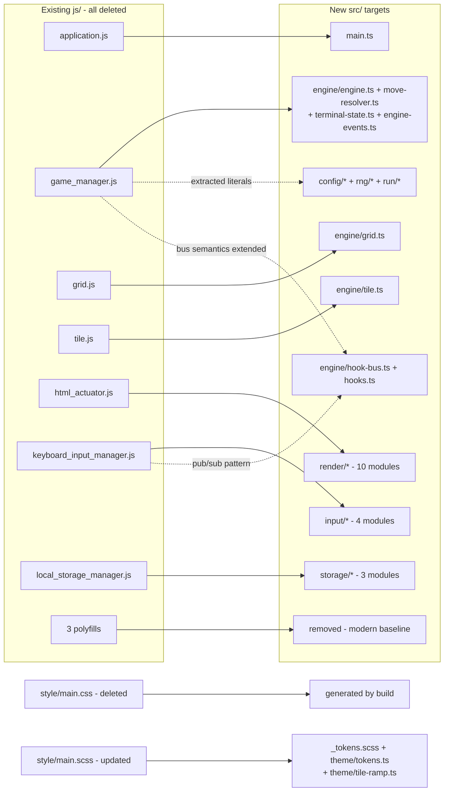

# Traceability Matrix

This is the bidirectional map between the constructs of the retired
`gabrielecirulli/2048` sources and the modules that carry them now. Rule 1
requires it for a refactor and requires it to be complete in **both**
directions: no pre-migration construct may be silently dropped, and no new
module may exist without a documented origin.

Identifiers have the form `TR-<AREA>-<NN>`. They are a **different namespace**
from the `DL-*` identifiers of `docs/DECISION_LOG.md`: a `TR-*` row says *what
became what*, a `DL-*` row says *why a debatable choice was made*. A row here
may name a decision; it never argues one. `CONTRIBUTING.md` carries the registry
of areas and the owning file of each.

Every row below is **declared by the module that owns it**, in that module's own
header, and this document is the collation of those declarations rather than a
second, hand-maintained list. The declaration in the file is authoritative; if
the two ever disagree, the file is right and this document is stale.
`tests/unit/quality/traceability-matrix.test.ts` fails a row no file declares,
an identifier no row carries, a heading whose count does not match the rows
beneath it, and a total in [§5](#5-coverage) that does not match the
document it describes.

There are **597 rows across 74 areas**. 272 of them carry a pre-migration
construct; 325 are **target-only**, meaning the retired tree contained nothing
that became them — the relic system, the seeded RNG, the run envelope, the
screen flow, the 2.5D renderer, the accessibility layer, the observability
surfaces, the build and the test suites are all new capability rather than
ported behaviour.

Four sections carry the mapping and two more account for it:
[§2](#2-direction-a--pre-migration-construct-to-its-successor) is the forward
direction and [§3](#3-direction-b--successor-construct-to-its-origin) the
reverse, [§7](#7-construct-inventory) is the mechanical enumeration of every
declaration the retired modules made, [§8](#8-existing-feature-coverage)
covers the shipped behaviours and [§9](#9-data-transformation-points) the
points where data changed shape. [§4](#4-source-artifact-ledger) is the
per-artifact ledger and [§5](#5-coverage) states the counts and how they were
taken.

## Figure 8 — File Transformation Map



**Legend for Figure 8.** *File Transformation Map: Superseded Modules to
TypeScript Targets* is the file-level index of the row-level tables below. A
**solid arrow** is a primary one-to-one or one-to-many port target — the
module a reader should open first when looking for what a superseded file's
behaviour became. A **dotted arrow**, labelled with what travelled, is a
pattern or a value extracted into a module other than that principal successor:
the three of them are `game_manager.js` to `config/*` plus `rng/*` plus
`run/*`, `game_manager.js` to the hook bus and its hook vocabulary, and
`keyboard_input_manager.js` to that same bus. A node in **Existing js/** no
longer exists in the tree; a node in **New src/ targets** is where its rows
land; the two stylesheet nodes stand outside both subgraphs, one artifact having
been deleted and the other updated in place. No arrow is a call direction, a
runtime relationship or a dependency.

**Every left-hand node of Figure 8 appears as a source row and every right-hand
node appears as a target row**, with no gaps in either direction:
[§2](#2-direction-a--pre-migration-construct-to-its-successor) carries a
subsection per left-hand artifact and
[§3](#3-direction-b--successor-construct-to-its-origin) a subsection per
right-hand module, and [§5](#5-coverage) states the node-by-node check. The
figure carries the module-level shape only; the construct-level detail a
diagram cannot hold is in the tables, and the two retired build tools the
figure omits — `Rakefile` and `.jshintrc` — are accounted for in
[§4](#4-source-artifact-ledger). The figure is numbered `8`; the bare numerals
`1` and `2` are the as-is and to-be architecture views of
[`docs/architecture/ARCHITECTURE.md`](architecture/ARCHITECTURE.md), so a
reference by name resolves to exactly one figure across the documentation set.

## 1. How to read a row

A row has three parts: the identifier, the pre-migration construct with the line
span it occupied in the source tree at the base commit, and the construct that
carries it now. Line spans are only verifiable against the retired tree, so a
row names the file as well as the span — the file is the durable half of the
citation and the span is the perishable half.

A row whose pre-migration column reads **target-only** has no source construct.
That is a positive statement rather than a missing value: the reverse direction
of this matrix is complete on that basis — every such row declares that it has
no origin in the retired tree, so a reader auditing coverage can tell an
unexplained gap from a new capability.

Two artifacts, `index.html` and `style/main.scss`, were updated rather than
retired, so a citation into either could mean two different files. The
convention is: **a span names the pre-migration line unless the citation is
marked `as updated`, which resolves against the file as it now stands and names
the construct rather than a line.** Three rows carry that marker —
`TR-DIAG-05`, `TR-DIAG-06` and `TR-DIAG-07` — and each names a construct the
update introduced. In [§7](#7-construct-inventory) the same two
words qualify a **target file** rather than a span, naming an updated artifact
as the successor of its own pre-migration construct. Every other span in this
document is resolvable against the base commit `450a1183`, and the counts each
retired file had there are the ones [§7](#7-construct-inventory) states. Three
spans the implementation plan cites differ from the checkout and the verified
numbers are used instead, per decision `DL-DOC-04`.

[§7](#7-construct-inventory) adds one column the `TR-*` tables do not carry: a
**provenance verb** from a closed
four-word vocabulary. **Ported** means the behaviour is preserved; **extracted**
means a literal or a pattern was lifted into a module other than the principal
successor; **superseded** means a differently shaped implementation replaced it;
**deleted** means there is no replacement. No fifth word is used, and a row that
would need one is a row whose mapping is not yet understood.

## 2. Direction A — pre-migration construct to its successor

One subsection per retired or updated artifact, in the order the migration
touched them. Every row whose source lies in that artifact appears in its
subsection exactly once.

### js/game_manager.js — DELETED, 66 rows

| TR id | Pre-migration construct | Successor construct | Owning file |
|---|---|---|---|
| `TR-CONFIG-02` | js/game_manager.js L170 | `2048`, as `winValue` | `src/config/rules-config.ts` |
| `TR-CONFIG-03` | js/game_manager.js L7 | `2`, as `startTiles` | `src/config/rules-config.ts` |
| `TR-CONFIG-04` | js/game_manager.js L71 | `Math.random() < 0.9 ? 2 : 4`, as `spawn` and `SpawnDistribution` | `src/config/rules-config.ts` |
| `TR-CONFIG-05` | js/game_manager.js L156-L157 | the merge condition and the doubled value, as `MergePredicate` and `MergeProducer` | `src/config/rules-config.ts` |
| `TR-DEFAULT-02` | js/game_manager.js L170 | `winValue` | `src/config/default-config.ts` |
| `TR-DEFAULT-03` | js/game_manager.js L7 | `startTiles` | `src/config/default-config.ts` |
| `TR-DEFAULT-04` | js/game_manager.js L71 | `spawn.values` and `spawn.weights` | `src/config/default-config.ts` |
| `TR-DEFAULT-05` | js/game_manager.js L156 | `defaultCanMerge` | `src/config/default-config.ts` |
| `TR-DEFAULT-06` | js/game_manager.js L157 | `defaultProduceMergeValue` | `src/config/default-config.ts` |
| `TR-DRAW-01` | js/game_manager.js L71 | the weighted two-value choice, generalised into the rarity-weighted selection of a tier | `src/relics/relic-draw.ts` |
| `TR-EFFECTS-03` | js/game_manager.js L123-L127 | `moveTile()`, whose remove-update-insert order the `moveTile` command keeps | `src/engine/board-effects.ts` |
| `TR-EFFECTS-04` | js/game_manager.js L36-L45 | the `setup()` rehydration, reached by `restoreBoard` | `src/engine/board-effects.ts` |
| `TR-ENGINE-01` | js/game_manager.js L1-L14 constructor | constructor | `src/engine/engine.ts` |
| `TR-ENGINE-02` | js/game_manager.js L17-L21 restart() | restart() | `src/engine/engine.ts` |
| `TR-ENGINE-03` | js/game_manager.js L24-L27 keepPlaying() | continueAfterWin() | `src/engine/engine.ts` |
| `TR-ENGINE-04` | js/game_manager.js L30-L32 isGameTerminated() | isGameTerminated() | `src/engine/engine.ts` |
| `TR-ENGINE-05` | js/game_manager.js L35-L59 setup() | setup() | `src/engine/engine.ts` |
| `TR-ENGINE-06` | js/game_manager.js L62-L66 addStartTiles() | addStartTiles() | `src/engine/engine.ts` |
| `TR-ENGINE-07` | js/game_manager.js L69-L76 addRandomTile() | addRandomTile() | `src/engine/engine.ts` |
| `TR-ENGINE-08` | js/game_manager.js L79-L99 actuate() | commit() | `src/engine/engine.ts` |
| `TR-ENGINE-09` | js/game_manager.js L102-L110 serialize() | serialize() | `src/engine/engine.ts` |
| `TR-ENGINE-10` | js/game_manager.js L130-L191 move() | move(), whose traversal, farthest-position and merge work is delegated to `resolveMove` of src/engine/move-resolver.ts and whose terminal checks are delegated to src/engine/terminal-state.ts | `src/engine/engine.ts` |
| `TR-EVENT-01` | js/game_manager.js L35-L59 setup() | `stage:start` | `src/engine/engine-events.ts` |
| `TR-EVENT-02` | js/game_manager.js L130-L143 move() entry | `move:before` | `src/engine/engine-events.ts` |
| `TR-EVENT-03` | js/game_manager.js L156-L170 the merge branch | `tile:merge` | `src/engine/engine-events.ts` |
| `TR-EVENT-04` | js/game_manager.js L69-L76 addRandomTile() | `tile:spawn` | `src/engine/engine-events.ts` |
| `TR-EVENT-05` | js/game_manager.js L182-L190 the post-move branch | `move:after` | `src/engine/engine-events.ts` |
| `TR-EVENT-07` | js/game_manager.js L91-L97 actuate() | `state:commit` | `src/engine/engine-events.ts` |
| `TR-GAMEOVER-06` | js/game_manager.js L30-L32 | the terminal predicate | `src/ui/screens/game-over.ts` |
| `TR-KEYMAP-03` | js/game_manager.js L131, L196-L201 | the direction encoding 0 up / 1 right / 2 down / 3 left, declared here as `Direction` | `src/input/keymap.ts` |
| `TR-MAIN-03` | js/game_manager.js L3-L5 | the three collaborators constructed from injected constructors, now the peers `start()` builds | `src/main.ts` |
| `TR-MAIN-04` | js/game_manager.js L9-L11 | the `move`, `restart` and `keepPlaying` subscriptions, kept under those names and extended with the screen-flow and relic actions | `src/main.ts` |
| `TR-MAIN-05` | js/game_manager.js L13 | `setup()` called last, now `RunController.openEngineBoard()` | `src/main.ts` |
| `TR-MOVE-01` | js/game_manager.js L113-L120 prepareTiles() | prepareTiles() | `src/engine/move-resolver.ts` |
| `TR-MOVE-02` | js/game_manager.js L123-L127 moveTile() | moveTile() | `src/engine/move-resolver.ts` |
| `TR-MOVE-03` | js/game_manager.js L138-L143 the vector, traversal and prepareTiles preamble | resolveMove() | `src/engine/move-resolver.ts` |
| `TR-MOVE-04` | js/game_manager.js L146-L180 the traversal walk, its merge branch and the moved test | resolveMove() | `src/engine/move-resolver.ts` |
| `TR-MOVE-05` | js/game_manager.js L194-L204 getVector() | vectorForDirection() | `src/engine/move-resolver.ts` |
| `TR-MOVE-06` | js/game_manager.js L207-L220 buildTraversals() | buildTraversals() | `src/engine/move-resolver.ts` |
| `TR-MOVE-07` | js/game_manager.js L222-L236 findFarthestPosition() | findFarthestPosition() | `src/engine/move-resolver.ts` |
| `TR-MOVE-08` | js/game_manager.js L270-L272 positionsEqual() | positionsEqual() | `src/engine/move-resolver.ts` |
| `TR-REGISTRY-01` | js/game_manager.js L9-L11 | the three fixed subscriptions generalised into pickup-ordered hook subscriptions | `src/relics/relic-registry.ts` |
| `TR-REGISTRY-02` | js/game_manager.js L102-L110 | `serialize()` | `src/relics/relic-registry.ts` |
| `TR-REGISTRY-03` | js/game_manager.js L36-L45 | `restore()`, the guarded rehydration branch | `src/relics/relic-registry.ts` |
| `TR-RNG-01` | js/game_manager.js L71 | the spawn-value `Math.random()` call | `src/rng/seeded-rng.ts` |
| `TR-ROUTER-05` | js/game_manager.js L9-L11 | the three fixed input subscriptions, generalised into the input context | `src/ui/screen-router.ts` |
| `TR-ROUTER-06` | js/game_manager.js L30-L32 | `isGameTerminated()`, read off the commit's own `terminated` | `src/ui/screen-router.ts` |
| `TR-ROUTER-07` | js/game_manager.js L91-L97 | the actuation payload, arriving as `state:commit` | `src/ui/screen-router.ts` |
| `TR-RUN-01` | js/game_manager.js L102-L110 | the manager projection, wrapped unchanged as `RunState.board` | `src/run/run-state.ts` |
| `TR-RUNCTL-01` | js/game_manager.js L1-L14 | collaborator wiring, ported as `RunControllerOptions` and the constructor | `src/run/run-controller.ts` |
| `TR-RUNCTL-02` | js/game_manager.js L17-L21 | `restart()`, ported as `startRun()` and `resumeRun()` | `src/run/run-controller.ts` |
| `TR-RUNCTL-03` | js/game_manager.js L24-L32 | the `keepPlaying` and terminated branches, ported as the `RunOutcome` routing of `finish()` | `src/run/run-controller.ts` |
| `TR-RUNCTL-04` | js/game_manager.js L35-L59 | `setup()`, ported as `begin()` and the fresh envelope | `src/run/run-controller.ts` |
| `TR-RUNCTL-05` | js/game_manager.js L85-L89 | the save-or-clear branch, ported as `persist()` and `finish()` | `src/run/run-controller.ts` |
| `TR-RUNCTL-06` | js/game_manager.js L95 | the read-after-write, ported as the board refreshed from `serialize()` | `src/run/run-controller.ts` |
| `TR-RUNSTORE-04` | js/game_manager.js L36-L45 | the lattice rebuilt from the size the snapshot recorded, replaced by `reconcileBoardSize()`, which runs before any grid is constructed | `src/run/run-state-store.ts` |
| `TR-RUNSTORE-05` | js/game_manager.js L88-L89 | the over-or-write branch, split into `clear()` and `save()` | `src/run/run-state-store.ts` |
| `TR-SCORE-05` | js/game_manager.js L80-L82 | the best-score value shape, carried to the DOM unconverted | `src/ui/components/score-panel.ts` |
| `TR-SCORE-06` | js/game_manager.js L95 | the best score re-read after the write | `src/ui/components/score-panel.ts` |
| `TR-TERM-01` | js/game_manager.js L170 | the win test the merge branch performed inline | `src/engine/terminal-state.ts` |
| `TR-TERM-02` | js/game_manager.js L238-L240 | movesAvailable() | `src/engine/terminal-state.ts` |
| `TR-TERM-03` | js/game_manager.js L243-L268 | tileMatchesAvailable() | `src/engine/terminal-state.ts` |
| `TR-TERM-04` | js/game_manager.js L30-L32 | isGameTerminated() | `src/engine/terminal-state.ts` |
| `TR-TRACE-05` | js/game_manager.js L130, L91-L97 | the turn boundary, where the turn span opens and closes | `src/observability/tracer.ts` |
| `TR-TYPES-03` | js/game_manager.js L102-L110 | `SerializedGameState` | `src/engine/types.ts` |
| `TR-TYPES-04` | js/game_manager.js L194-L204 | `Direction` and `Vector` | `src/engine/types.ts` |

### js/grid.js — DELETED, 21 rows

| TR id | Pre-migration construct | Successor construct | Owning file |
|---|---|---|---|
| `TR-DRAW-02` | js/grid.js L37-L43 | the uniform selection, generalised into the selection of one relic within the winning tier, and its nothing-to-select boundary | `src/relics/relic-draw.ts` |
| `TR-EFFECTS-01` | js/grid.js L89-L91 | `insertTile()`, reached by the `insertTile` command | `src/engine/board-effects.ts` |
| `TR-EFFECTS-02` | js/grid.js L93-L95 | `removeTile()`, reached by the `removeTile` command | `src/engine/board-effects.ts` |
| `TR-EFFECTS-05` | js/grid.js L7-L19 | `Grid.empty()`, the lattice rebuild a `resizeBoard` performs | `src/engine/board-effects.ts` |
| `TR-GRID-01` | js/grid.js L1-L4 | constructor, empty-or-restore | `src/engine/grid.ts` |
| `TR-GRID-02` | js/grid.js L7-L19 | empty() | `src/engine/grid.ts` |
| `TR-GRID-03` | js/grid.js L21-L34 | fromState() | `src/engine/grid.ts` |
| `TR-GRID-04` | js/grid.js L37-L43 | randomAvailableCell() | `src/engine/grid.ts` |
| `TR-GRID-05` | js/grid.js L45-L55 | availableCells() | `src/engine/grid.ts` |
| `TR-GRID-06` | js/grid.js L58-L64 | eachCell() | `src/engine/grid.ts` |
| `TR-GRID-07` | js/grid.js L67-L69 | cellsAvailable() | `src/engine/grid.ts` |
| `TR-GRID-08` | js/grid.js L72-L74 | cellAvailable() | `src/engine/grid.ts` |
| `TR-GRID-09` | js/grid.js L76-L78 | cellOccupied() | `src/engine/grid.ts` |
| `TR-GRID-10` | js/grid.js L80-L86 | cellContent() | `src/engine/grid.ts` |
| `TR-GRID-11` | js/grid.js L89-L91 | insertTile() | `src/engine/grid.ts` |
| `TR-GRID-12` | js/grid.js L93-L95 | removeTile() | `src/engine/grid.ts` |
| `TR-GRID-13` | js/grid.js L97-L100 | withinBounds() | `src/engine/grid.ts` |
| `TR-GRID-14` | js/grid.js L102-L117 | serialize() | `src/engine/grid.ts` |
| `TR-RNG-02` | js/grid.js L41 | the spawn-position `Math.random()` call | `src/rng/seeded-rng.ts` |
| `TR-RUN-02` | js/grid.js L102-L117 | the grid projection, aliased as `SerializedGrid` | `src/run/run-state.ts` |
| `TR-TYPES-02` | js/grid.js L102-L117 | `SerializedGrid` and `CellMatrix` | `src/engine/types.ts` |

### js/tile.js — DELETED, 10 rows

| TR id | Pre-migration construct | Successor construct | Owning file |
|---|---|---|---|
| `TR-RUN-03` | js/tile.js L19-L27 | the tile projection, aliased as `SerializedTile` | `src/run/run-state.ts` |
| `TR-TILE-01` | js/tile.js L1-L8 | constructor | `src/engine/tile.ts` |
| `TR-TILE-02` | js/tile.js L2-L3 | position flattened onto x and y | `src/engine/tile.ts` |
| `TR-TILE-03` | js/tile.js L4 | value, falsy argument coerced to 2 | `src/engine/tile.ts` |
| `TR-TILE-04` | js/tile.js L6 | previousPosition | `src/engine/tile.ts` |
| `TR-TILE-05` | js/tile.js L7 | mergedFrom | `src/engine/tile.ts` |
| `TR-TILE-06` | js/tile.js L10-L12 | savePosition() | `src/engine/tile.ts` |
| `TR-TILE-07` | js/tile.js L14-L17 | updatePosition() | `src/engine/tile.ts` |
| `TR-TILE-08` | js/tile.js L19-L27 | serialize() | `src/engine/tile.ts` |
| `TR-TYPES-01` | js/tile.js L19-L27 | `SerializedTile` | `src/engine/types.ts` |

### js/html_actuator.js — DELETED, 34 rows

| TR id | Pre-migration construct | Successor construct | Owning file |
|---|---|---|---|
| `TR-ANIM-01` | js/html_actuator.js L54, L67-L72 | the `previousPosition` and `position` pair, ported as `createMoveTween` | `src/render/animations.ts` |
| `TR-ANIM-02` | js/html_actuator.js L73-L80 | the `.tile-merged` class carrying `pop`, ported as `createMergeTween` | `src/render/animations.ts` |
| `TR-ANIM-03` | js/html_actuator.js L82 | the `.tile-new` class carrying `appear`, ported as `createSpawnTween` | `src/render/animations.ts` |
| `TR-ANIM-04` | js/html_actuator.js L114-L120 | the `.score-addition` element carrying `move-up`, ported as `createScoreDeltaTween` | `src/render/animations.ts` |
| `TR-CARD-05` | js/html_actuator.js L3-L4 | the unchecked host lookups, guarded here by `resolveMount` | `src/ui/components/relic-card.ts` |
| `TR-DIAG-02` | js/html_actuator.js L13, L69 | the two `requestAnimationFrame` sites, summarised by the trace panel | `src/observability/diagnostics-overlay.ts` |
| `TR-GAMEOVER-01` | js/html_actuator.js L127-L133 | `message(won)`, its class and its copy | `src/ui/screens/game-over.ts` |
| `TR-GAMEOVER-02` | js/html_actuator.js L132 | the verdict paragraph, now guarded | `src/ui/screens/game-over.ts` |
| `TR-GAMEOVER-03` | js/html_actuator.js L135-L139 | `clearMessage()`, both removals kept separate | `src/ui/screens/game-over.ts` |
| `TR-GAMEOVER-04` | js/html_actuator.js L27-L33 | the loss-before-win ordering | `src/ui/screens/game-over.ts` |
| `TR-GAMEOVER-05` | js/html_actuator.js L38-L41 | `continueGame()`, serving restart and keep-playing | `src/ui/screens/game-over.ts` |
| `TR-HUD-01` | js/html_actuator.js L24-L27 | the write order of `actuate()`: score, best score, message | `src/ui/screens/hud.ts` |
| `TR-HUD-02` | js/html_actuator.js L127-L131 | `message(won)` and its two state classes | `src/ui/screens/hud.ts` |
| `TR-HUD-03` | js/html_actuator.js L129 | the two verdict strings, verbatim | `src/ui/screens/hud.ts` |
| `TR-HUD-04` | js/html_actuator.js L135-L139 | `clearMessage()`, both classes removed | `src/ui/screens/hud.ts` |
| `TR-LOOP-01` | js/html_actuator.js L11-L35 | the outer `requestAnimationFrame`, ported as `createRenderLoop()` and its scheduled frame | `src/render/render-loop.ts` |
| `TR-LOOP-02` | js/html_actuator.js L66-L69 | the nested `requestAnimationFrame`, ported as the two-phase paint a `FrameCallback` requests | `src/render/render-loop.ts` |
| `TR-MESH-03` | js/html_actuator.js L97-L104 | `normalizePosition` and `positionClass`, ported as `cellToWorld()` and `cellToWorldIn()` | `src/render/tile-mesh-factory.ts` |
| `TR-NUMBER-01` | js/html_actuator.js L10-L36 | `actuate`, ported as `render()` queueing and `frame()` drawing, which src/render/render-loop.ts drives in place of the two nested `requestAnimationFrame` calls | `src/render/number-only-renderer.ts` |
| `TR-NUMBER-02` | js/html_actuator.js L43-L47 | `clearContainer`, ported as `clearElement()` and the tile-layer reconciliation | `src/render/number-only-renderer.ts` |
| `TR-NUMBER-03` | js/html_actuator.js L49-L91 | `addTile`, ported as `planTile()` and `drawTile()` | `src/render/number-only-renderer.ts` |
| `TR-NUMBER-04` | js/html_actuator.js L93-L95 | `applyClasses`, ported onto `classList` where the actuator wrote the whole class attribute and cited js/classlist_polyfill.js, which is deleted | `src/render/number-only-renderer.ts` |
| `TR-NUMBER-05` | js/html_actuator.js L97-L104 | `normalizePosition` and `positionClass`, ported as `positionClass()` and `positionTransform()` | `src/render/number-only-renderer.ts` |
| `TR-NUMBER-06` | js/html_actuator.js L1-L8 | the four unchecked `querySelector` results, ported as guarded lookups that report an absent element once | `src/render/number-only-renderer.ts` |
| `TR-PANEL-05` | js/html_actuator.js L3-L4, js/keyboard_input_manager.js L141 | the unchecked host lookups, replaced by `resolveMount` | `src/ui/components/settings-panel.ts` |
| `TR-ROUTER-01` | js/html_actuator.js L127-L133 | the verdict class and copy, carried by `TERMINAL_OVERLAY_CLASSES` and `TERMINAL_OVERLAY_COPY` | `src/ui/screen-router.ts` |
| `TR-ROUTER-02` | js/html_actuator.js L135-L139 | `clearMessage()`, both class removals kept separate | `src/ui/screen-router.ts` |
| `TR-ROUTER-03` | js/html_actuator.js L38-L41 | `continueGame()`, reached from the one path serving restart and keep-playing | `src/ui/screen-router.ts` |
| `TR-ROUTER-04` | js/html_actuator.js L2-L5 | the four unguarded `querySelector` lookups, now guarded resolutions | `src/ui/screen-router.ts` |
| `TR-SCORE-01` | js/html_actuator.js L106-L121 | `updateScore` and the rising `.score-addition` delta | `src/ui/components/score-panel.ts` |
| `TR-SCORE-02` | js/html_actuator.js L123-L125 | `updateBestScore` | `src/ui/components/score-panel.ts` |
| `TR-SETTINGS-01` | js/html_actuator.js L2-L5 | the four unguarded lookups, replaced by `resolveMount` | `src/ui/a11y/settings.ts` |
| `TR-TRACE-01` | js/html_actuator.js L13 | the frame `actuate` wrapped every DOM write in | `src/observability/tracer.ts` |
| `TR-TRACE-02` | js/html_actuator.js L69 | the nested frame inside `addTile` | `src/observability/tracer.ts` |

### js/keyboard_input_manager.js — DELETED, 31 rows

| TR id | Pre-migration construct | Successor construct | Owning file |
|---|---|---|---|
| `TR-CONTROL-01` | js/keyboard_input_manager.js L71-L74 | the three control bindings: `.retry-button` and `.restart-button` to `restart`, `.keep-playing-button` to `keepPlaying`, in that order | `src/input/on-screen-controls.ts` |
| `TR-CONTROL-02` | js/keyboard_input_manager.js L140-L144 | `bindButtonPress`, its selector lookup and its `'click'` listener | `src/input/on-screen-controls.ts` |
| `TR-CONTROL-03` | js/keyboard_input_manager.js L143 | `bindButtonPress`'s resolved touch-end listener | `src/input/on-screen-controls.ts` |
| `TR-DIAG-03` | js/keyboard_input_manager.js L18-L32 | the subscriber registry, whose pull successors are the only sources this module reads | `src/observability/diagnostics-overlay.ts` |
| `TR-EVENT-08` | js/keyboard_input_manager.js L18-L32 on() and emit() | the emitter behind `EngineEvents` | `src/engine/engine-events.ts` |
| `TR-FOCUS-02` | js/keyboard_input_manager.js L141 | the unguarded control lookups, resolved here through the guarded resolver of ./settings | `src/ui/a11y/focus-manager.ts` |
| `TR-HEALTH-04` | js/keyboard_input_manager.js L4-L13 | the `pointerEvents` probe | `src/observability/health.ts` |
| `TR-HOOKBUS-01` | js/keyboard_input_manager.js L18-L32 | the append-only `on` and the synchronous in-order `emit` this bus supersedes | `src/engine/hook-bus.ts` |
| `TR-INPUT-01` | js/keyboard_input_manager.js L1-L2 | the event registry, held below as `listeners` | `src/input/input-manager.ts` |
| `TR-INPUT-02` | js/keyboard_input_manager.js L15 | the constructor-time `listen()` call | `src/input/input-manager.ts` |
| `TR-INPUT-03` | js/keyboard_input_manager.js L18-L23 | `on()`, appending to the array for its event name | `src/input/input-manager.ts` |
| `TR-INPUT-04` | js/keyboard_input_manager.js L25-L32 | `emit()`, walking that array in registration order | `src/input/input-manager.ts` |
| `TR-INPUT-05` | js/keyboard_input_manager.js L34, L53 | the single `keydown` listener, on the document | `src/input/input-manager.ts` |
| `TR-INPUT-06` | js/keyboard_input_manager.js L54-L55 | the modifier guard | `src/input/input-manager.ts` |
| `TR-INPUT-07` | js/keyboard_input_manager.js L56 | the recognised-key test | `src/input/input-manager.ts` |
| `TR-INPUT-08` | js/keyboard_input_manager.js L60-L61 | `preventDefault()` before the move is published | `src/input/input-manager.ts` |
| `TR-INPUT-09` | js/keyboard_input_manager.js L66-L67 | the separate `R` test, routed through `restart` | `src/input/input-manager.ts` |
| `TR-INPUT-10` | js/keyboard_input_manager.js L76-L127 | the swipe path, by way of src/input/touch-input.ts | `src/input/input-manager.ts` |
| `TR-INPUT-11` | js/keyboard_input_manager.js L130-L133 | `restart()` | `src/input/input-manager.ts` |
| `TR-INPUT-12` | js/keyboard_input_manager.js L135-L138 | `keepPlaying()` | `src/input/input-manager.ts` |
| `TR-KEYMAP-01` | js/keyboard_input_manager.js L37-L50 | the `event.which` code map, ported as the default binding table keyed on `KeyboardEvent.key` and `KeyboardEvent.code` | `src/input/keymap.ts` |
| `TR-KEYMAP-02` | js/keyboard_input_manager.js L61, L132, L137 | the three emitted event names, ported as `INPUT_EVENT_NAMES` and `InputEventPayload` | `src/input/keymap.ts` |
| `TR-PANEL-01` | js/keyboard_input_manager.js L37-L50 | the `event.which` code map, presented as the remappable bindings read from `KeyboardEvent.key` and `KeyboardEvent.code` | `src/ui/components/settings-panel.ts` |
| `TR-ROUTER-08` | js/keyboard_input_manager.js L18-L32 | append-only `on` and synchronous in-order `emit`, relied on by every subscription here | `src/ui/screen-router.ts` |
| `TR-SETTINGS-02` | js/keyboard_input_manager.js L78, L141 | the unguarded host lookups, replaced by `resolveMounts` and `isMountComplete` | `src/ui/a11y/settings.ts` |
| `TR-SETTINGS-03` | js/keyboard_input_manager.js L18-L32 | the appended callback list iterated synchronously, ported as `PreferenceStore` subscription with per-listener error isolation | `src/ui/a11y/settings.ts` |
| `TR-TOUCH-01` | js/keyboard_input_manager.js L4-L13 | the pointer-event-family probe and its `msPointerEnabled` branch, ported as `detectPointerEventFamily` and `POINTER_EVENT_FAMILY` | `src/input/touch-input.ts` |
| `TR-TOUCH-02` | js/keyboard_input_manager.js L80-L95 | the touchstart handler, ported as the gesture start | `src/input/touch-input.ts` |
| `TR-TOUCH-03` | js/keyboard_input_manager.js L97-L99 | the touchmove handler, ported as the default-prevention branch | `src/input/touch-input.ts` |
| `TR-TOUCH-04` | js/keyboard_input_manager.js L101-L127 | the touchend handler and its 10px threshold, ported as the resolved swipe and `SWIPE_THRESHOLD_PX` | `src/input/touch-input.ts` |
| `TR-TRACE-06` | js/keyboard_input_manager.js L18-L23 | the appended listener array `attachEngineTracing` attaches through | `src/observability/tracer.ts` |

### js/local_storage_manager.js — DELETED, 23 rows

| TR id | Pre-migration construct | Successor construct | Owning file |
|---|---|---|---|
| `TR-DIAG-01` | js/local_storage_manager.js L25-L26 | the construction-time capability probe, surfaced by the health panel | `src/observability/diagnostics-overlay.ts` |
| `TR-HEALTH-05` | js/local_storage_manager.js L29-L40 | the `storage` probe | `src/observability/health.ts` |
| `TR-KEYS-01` | js/local_storage_manager.js L22 | `bestScore`, the frozen unprefixed literal | `src/storage/storage-keys.ts` |
| `TR-KEYS-02` | js/local_storage_manager.js L23 | `gameState`, the frozen unprefixed literal | `src/storage/storage-keys.ts` |
| `TR-KEYS-03` | js/local_storage_manager.js L31 | the probe's key literal, minted here as `STORAGE_PROBE_KEY` | `src/storage/storage-keys.ts` |
| `TR-LOG-01` | js/local_storage_manager.js L37-L39 | the discarded-error `catch`, whose target is `serializeError` | `src/observability/logger.ts` |
| `TR-LOG-02` | js/local_storage_manager.js L47-L49 | the unguarded `setItem`, reported through `createStorageReporter` | `src/observability/logger.ts` |
| `TR-LOG-03` | js/local_storage_manager.js L54 | the unguarded `JSON.parse`, reported through the same adapter | `src/observability/logger.ts` |
| `TR-PANEL-06` | js/local_storage_manager.js L37 | the discarded caught value, replaced by a report that always carries its error object | `src/ui/components/settings-panel.ts` |
| `TR-RUNSTORE-01` | js/local_storage_manager.js L52-L55, the parse at L54 | the unguarded `JSON.parse` of the stored snapshot, replaced by `load()`, which returns a result for every input | `src/run/run-state-store.ts` |
| `TR-RUNSTORE-02` | js/local_storage_manager.js L57-L59 | the handler-free `setItem`, replaced by `save()`, which returns `false` on a failed write including an exhausted quota | `src/run/run-state-store.ts` |
| `TR-RUNSTORE-03` | js/local_storage_manager.js L33-L39 | the `catch` that discarded its caught value; every caught value here reaches the injected `RunReporter` | `src/run/run-state-store.ts` |
| `TR-SETTINGS-04` | js/local_storage_manager.js L37 | the discarded caught value, replaced by the injected `UiReporter` and `createSafeUiReporter` | `src/ui/a11y/settings.ts` |
| `TR-STORE-01` | js/local_storage_manager.js L22-L23 | the two unprefixed key literals | `src/storage/local-storage-manager.ts` |
| `TR-STORE-02` | js/local_storage_manager.js L25-L26 | the construction-time strategy selection | `src/storage/local-storage-manager.ts` |
| `TR-STORE-03` | js/local_storage_manager.js L29-L40 | the writability probe | `src/storage/local-storage-manager.ts` |
| `TR-STORE-04` | js/local_storage_manager.js L43-L45 | getBestScore(), the frozen `string \| 0` contract | `src/storage/local-storage-manager.ts` |
| `TR-STORE-05` | js/local_storage_manager.js L47-L49 | setBestScore() | `src/storage/local-storage-manager.ts` |
| `TR-STORE-06` | js/local_storage_manager.js L52-L55 | getGameState(), whose unguarded `JSON.parse` is now guarded | `src/storage/local-storage-manager.ts` |
| `TR-STORE-07` | js/local_storage_manager.js L57-L59 | setGameState() | `src/storage/local-storage-manager.ts` |
| `TR-STORE-08` | js/local_storage_manager.js L61-L63 | clearGameState() | `src/storage/local-storage-manager.ts` |
| `TR-STORE-09` | js/local_storage_manager.js L1-L19 | the `window.fakeStorage` object literal, ported as the `MemoryStorage` class | `src/storage/memory-storage.ts` |
| `TR-TYPES-05` | js/local_storage_manager.js L43-L45 | `BestScorePort` and `BestScoreValue`, the string-or-0 return | `src/engine/types.ts` |

### js/application.js — DELETED, 5 rows

| TR id | Pre-migration construct | Successor construct | Owning file |
|---|---|---|---|
| `TR-CONFIG-01` | js/application.js L3 | the board-size literal, as `boardSize` | `src/config/rules-config.ts` |
| `TR-DEFAULT-01` | js/application.js L3 | `DEFAULT_BOARD_SIZE`, the board-size literal | `src/config/default-config.ts` |
| `TR-MAIN-01` | js/application.js L1-L2, L4 | the one-animation-frame deferral, reproduced by `bootstrap()` | `src/main.ts` |
| `TR-MAIN-02` | js/application.js L3 | the constructor injection, reproduced by `start()`, with the board-size literal now read from src/config/default-config.ts | `src/main.ts` |
| `TR-TRACE-03` | js/application.js L2 | the frame construction was deferred to | `src/observability/tracer.ts` |

### js/bind_polyfill.js — DELETED, 1 row

| TR id | Pre-migration construct | Successor construct | Owning file |
|---|---|---|---|
| `TR-HEALTH-01` | js/bind_polyfill.js L1 | the `functionBind` probe | `src/observability/health.ts` |

### js/classlist_polyfill.js — DELETED, 1 row

| TR id | Pre-migration construct | Successor construct | Owning file |
|---|---|---|---|
| `TR-HEALTH-02` | js/classlist_polyfill.js L2-L5 | the `classList` probe | `src/observability/health.ts` |

### js/animframe_polyfill.js — DELETED, 3 rows

| TR id | Pre-migration construct | Successor construct | Owning file |
|---|---|---|---|
| `TR-HEALTH-03` | js/animframe_polyfill.js L3-L10, L23 | the `requestAnimationFrame` pair | `src/observability/health.ts` |
| `TR-LOOP-03` | js/animframe_polyfill.js | the shim's presence assumption, replaced by `isFrameSchedulingAvailable()` and the guarded reads | `src/render/render-loop.ts` |
| `TR-TRACE-04` | js/animframe_polyfill.js L13 | the 16ms budget, carried as `DEFAULT_FRAME_BUDGET_MS` | `src/observability/tracer.ts` |

### index.html — UPDATED, 12 rows

| TR id | Pre-migration construct | Successor construct | Owning file |
|---|---|---|---|
| `TR-A11Y-03` | index.html L70-L72 | the empty `.tile-container`, whose accessible successor is the parallel board layer styled here | `style/_a11y.scss` |
| `TR-BUILD-04` | index.html L88-L97 | the ten ordered script tags, replaced by the single module entry this graph starts from | `vite.config.ts` |
| `TR-CARD-01` | index.html L31, L38, L39 | the hrefless `<a>` controls, whose successor here is a real `<button type="button">` | `src/ui/components/relic-card.ts` |
| `TR-CARD-06` | index.html L24-L25 | the retained score surfaces the tray is rendered alongside | `src/ui/components/relic-card.ts` |
| `TR-DIAG-07` | index.html `#diagnostics-overlay`, as updated | `#diagnostics-overlay`, adopted where the markup declares it | `src/observability/diagnostics-overlay.ts` |
| `TR-FOCUS-01` | index.html L31, L38, L39 | the three hrefless `<a>` controls, now `<button>` elements this module orders and contains | `src/ui/a11y/focus-manager.ts` |
| `TR-MAIN-06` | index.html L7 | the `<link>` to the committed generated stylesheet, replaced by the style/main.scss module import | `src/main.ts` |
| `TR-MESH-01` | index.html L43-L68 | the sixteen static `.grid-cell` elements, replaced by the generated board | `src/render/tile-mesh-factory.ts` |
| `TR-MESH-02` | index.html L70-L72 | the empty `.tile-container`, replaced by the tile layer of `BoardMeshes` | `src/render/tile-mesh-factory.ts` |
| `TR-PANEL-02` | index.html L31, L38, L39 | the three hrefless `<a>` controls, superseded by real `<button>` and `<input>` elements | `src/ui/components/settings-panel.ts` |
| `TR-SCORE-03` | index.html | the two outlets, each seeded with `0` | `src/ui/components/score-panel.ts` |
| `TR-SHEET-05` | index.html L7 | the `<link>` to that generated file, replaced by the import in src/main.ts | `style/main.scss` |

### style/main.scss — UPDATED, 54 rows

| TR id | Pre-migration construct | Successor construct | Owning file |
|---|---|---|---|
| `TR-A11Y-01` | style/main.scss | the stylesheet's complete absence of any `:focus`, `:focus-visible` or `:hover` rule, closed by the focus and interaction-state vocabulary here | `style/_a11y.scss` |
| `TR-A11Y-02` | style/main.scss | the absence of any `prefers-reduced-motion` query, closed by the reduced-motion layer here | `style/_a11y.scss` |
| `TR-ANIM-05` | style/main.scss `.game-message` with `&.game-won` and `&.game-over` | the terminal overlay's `fade-in`, ported as `createOverlayFadeTween` | `src/render/animations.ts` |
| `TR-CAMERA-01` | style/main.scss `pop` keyframes | the overshoot shape, ported as the punch impulse | `src/render/camera-effects.ts` |
| `TR-CARD-02` | style/main.scss L159-L168 | the `button` mixin the reward card's surface is compiled from | `src/ui/components/relic-card.ts` |
| `TR-CARD-03` | style/main.scss L109-L115 | the `:after` captions, invisible to assistive technology, whose successor is the real text every label here carries | `src/ui/components/relic-card.ts` |
| `TR-CARD-04` | style/main.scss L434-L452 | the `pop` vocabulary the entrance marker names | `src/ui/components/relic-card.ts` |
| `TR-DIAG-04` | style/main.scss L4-L22 | the token block every style value below resolves to | `src/observability/diagnostics-overlay.ts` |
| `TR-DIAG-05` | style/main.scss `.diagnostics-overlay`, as updated | `.diagnostics-overlay:not([hidden])`, restated by the inline declarations from the same tokens | `src/observability/diagnostics-overlay.ts` |
| `TR-HUD-07` | style/main.scss L26-L44 | the `.above-game` score row, extended by the stage and goal readouts | `style/_hud.scss` |
| `TR-HUD-08` | style/main.scss L334-L402 | the tile ramp's two anchors, from which the rarity accents are interpolated with no compiled colour written out | `style/_hud.scss` |
| `TR-MATERIAL-01` | style/main.scss L334-L402 | the generated tile fill, read through src/theme/tile-ramp.ts and transferred by `resolveTileFill()` | `src/render/tile-materials.ts` |
| `TR-MATERIAL-02` | style/main.scss L334-L402 | the bright-text threshold, as `resolveTileNumeralColor()` | `src/render/tile-materials.ts` |
| `TR-MATERIAL-03` | style/main.scss L360-L370 | the outer halo shadow, as the emissive colour and intensity | `src/render/tile-materials.ts` |
| `TR-MATERIAL-04` | style/main.scss L360-L370 | the inset white ring, as the roughness reduction scaled by `insetAlpha` | `src/render/tile-materials.ts` |
| `TR-MATERIAL-05` | style/main.scss L339-L349 | the accent overlay's suppressed shadow, as the flat material `glowSuppressed` gates | `src/render/tile-materials.ts` |
| `TR-MATERIAL-06` | style/main.scss `.grid-cell` | the empty-cell plate at 35% alpha, as the pre-composited or transparent plate material | `src/render/tile-materials.ts` |
| `TR-MESH-04` | style/main.scss L171-L194 | the field geometry, as `resolveBoardGeometry()` | `src/render/tile-mesh-factory.ts` |
| `TR-MESH-05` | style/main.scss L475-L548 | the mobile scale, selected once per factory through `geometryScales` | `src/render/tile-mesh-factory.ts` |
| `TR-MESH-06` | style/main.scss L404-L430 | the tile numeral sizes, as `resolveNumeralLayout()` and `NumeralLayout` | `src/render/tile-mesh-factory.ts` |
| `TR-PANEL-03` | style/main.scss L159-L168 | the button mixin, applied through `.screen-button` | `src/ui/components/settings-panel.ts` |
| `TR-PANEL-04` | style/main.scss L109-L115 | the `:after` pseudo-content captions, replaced by real text nodes and the `.visually-hidden` utility | `src/ui/components/settings-panel.ts` |
| `TR-RAMP-01` | style/main.scss L334-L402 | the `@while` generation loop, ported as `computeTileTheme` | `src/theme/tile-ramp.ts` |
| `TR-RAMP-02` | style/main.scss L336-L337 | the `$gold-percent` interpolation, ported as `goldPercent` and `sassMix` | `src/theme/tile-ramp.ts` |
| `TR-RAMP-03` | style/main.scss L339-L349 | the `$special-colors` accent list, ported as `tileSpecialColors` | `src/theme/tile-ramp.ts` |
| `TR-RAMP-04` | style/main.scss L351-L356 | the bright-text threshold, ported as `TileTheme.brightText` | `src/theme/tile-ramp.ts` |
| `TR-RAMP-05` | style/main.scss L358-L370 | the `$glow-opacity` term and its two-part shadow, ported as `haloAlpha`, `insetAlpha` and `glowSuppressed` | `src/theme/tile-ramp.ts` |
| `TR-RAMP-06` | style/main.scss L372-L380 | the `tile-super` band above the ramp's last value | `src/theme/tile-ramp.ts` |
| `TR-REWARD-01` | style/main.scss L196-L221 | the `.game-message` overlay treatment, from which the reward panel's surface is compiled | `style/_reward.scss` |
| `TR-REWARD-02` | style/main.scss L334-L402 | the tile ramp's anchors, from which the per-rarity accents are interpolated | `style/_reward.scss` |
| `TR-REWARD-03` | style/main.scss L159-L168 | the `button` mixin, from which `.relic-card` is compiled | `style/_reward.scss` |
| `TR-ROUTER-09` | style/main.scss L234-L235 | the overlay cadence, read from `OVERLAY_CADENCE` | `src/ui/screen-router.ts` |
| `TR-ROUTER-10` | style/main.scss L103, L205 | the z-index ceiling of 100, extended by `SCREEN_LAYERS` | `src/ui/screen-router.ts` |
| `TR-SCENE-01` | style/main.scss L171-L194 | `@mixin game-field`, reproduced as the board surface | `src/render/scene.ts` |
| `TR-SCENE-02` | style/main.scss L254 | the `.grid-container` layer, which the scene replaces | `src/render/scene.ts` |
| `TR-SCENE-03` | style/main.scss L288 | the `.tile-container` layer, which the scene replaces | `src/render/scene.ts` |
| `TR-SCENE-04` | style/main.scss L475-L548 | the mobile scale, framed through this code with no branch | `src/render/scene.ts` |
| `TR-SCORE-04` | style/main.scss | the `Score` and `Best` `:after` captions, given a real accessible counterpart | `src/ui/components/score-panel.ts` |
| `TR-SCREEN-01` | style/main.scss L196-L221 | the `.game-message` overlay treatment, generalised into the shared screen-container surface | `style/_screens.scss` |
| `TR-SCREEN-02` | style/main.scss L159-L168 | the `button` mixin, restated as `@mixin screen-control` with its user-agent reset | `style/_screens.scss` |
| `TR-SCREEN-03` | style/main.scss L475-L548 | the mobile scale, restated for every screen state | `style/_screens.scss` |
| `TR-SHEET-01` | style/main.scss L1-L2 | the two legacy `@import` rules, converted to `@use` | `style/main.scss` |
| `TR-SHEET-02` | style/main.scss L4-L22 | the token block, moved to style/_tokens.scss | `style/main.scss` |
| `TR-SHEET-03` | style/main.scss L7, L357, L377, L380, L381, L480 | the six slash divisions, converted to `math.div()` | `style/main.scss` |
| `TR-SHEET-06` | style/main.scss L299-L313 | the position-generation loop, whose per-cell rules the renderer now owns | `style/main.scss` |
| `TR-SHEET-07` | style/main.scss L334-L402 | the tile-value generation loop, retained as the ramp's authority | `style/main.scss` |
| `TR-THEME-01` | style/main.scss L4-L22 | the existing palette, carried as the default theme | `src/theme/themes.ts` |
| `TR-THEME-07` | style/main.scss L4-L22 | the established palette, restated as the default theme's entries | `style/_themes.scss` |
| `TR-THEME-08` | style/main.scss L334-L402 | the tile-ramp loop, ported here once per palette with no compiled row restated as a table | `style/_themes.scss` |
| `TR-TOKEN-02` | style/main.scss L4-L22 | the fourteen-token block, mirrored here name for name and value for value | `src/theme/tokens.ts` |
| `TR-TOKEN-03` | style/main.scss L6-L7 | `$grid-row-cells` and `$tile-size`, mirrored as `gridRowCells` and the geometry scales, with the board size read from src/config/default-config.ts | `src/theme/tokens.ts` |
| `TR-TOKEN-04` | style/main.scss L475-L548 | the mobile scale, mirrored as the second `GeometryScale` | `src/theme/tokens.ts` |
| `TR-TOKEN-05` | style/main.scss L404-L430 | the tile numeral sizes, mirrored as `tileNumeralSize` | `src/theme/tokens.ts` |
| `TR-TOKEN-09` | style/main.scss L4-L22 | the fourteen-variable token block, moved here unchanged in name, value and order | `style/_tokens.scss` |

### style/helpers.scss — UPDATED, 7 rows

| TR id | Pre-migration construct | Successor construct | Owning file |
|---|---|---|---|
| `TR-TOKEN-06` | style/helpers.scss | the Sass colour derivations, carried here in their compiled form as `derivedColors` | `src/theme/tokens.ts` |
| `TR-HELPER-01` | style/helpers.scss L4-L21 `exponent()` and `pow()` | the same two functions, retained in place as the stylesheet's powers-of-two arithmetic, with the ramp's TypeScript mirror in `src/theme/tile-ramp.ts` | `style/helpers.scss` |
| `TR-HELPER-02` | style/helpers.scss L14 the negative-exponent division, and the implicit Ruby Sass `math` availability | `math.div()` at that site, with the `@use "sass:math"` load the migration requires | `style/helpers.scss` |
| `TR-HELPER-03` | style/helpers.scss L23-L51 the vendor-prefix mixins | `transition`, `transition-property`, `animation`, `animation-fill-mode` and `transform`, retained with their prefixes for the rules that still call them | `style/helpers.scss` |
| `TR-HELPER-04` | style/helpers.scss L53-L66 the `keyframes()` mixin | the same mixin, with the animation name interpolated as `#{$animation-name}` because Dart Sass does not interpolate a variable in an at-rule prelude | `style/helpers.scss` |
| `TR-HELPER-05` | style/helpers.scss L68-L73 the `smaller()` media-query mixin | the same mixin, still the only breakpoint construct the two-scale strategy uses | `style/helpers.scss` |
| `TR-HELPER-06` | style/helpers.scss L75-L82 the `clearfix` mixin | the same mixin, retained for the retained DOM layer | `style/helpers.scss` |

### style/main.css — DELETED, 2 rows

| TR id | Pre-migration construct | Successor construct | Owning file |
|---|---|---|---|
| `TR-BUILD-03` | style/main.css | the committed generated stylesheet, deleted and now emitted into dist/ by this build | `vite.config.ts` |
| `TR-SHEET-04` | style/main.css | the committed generated stylesheet, deleted and now produced by the build from this entry point | `style/main.scss` |

### Rakefile — DELETED, 1 row

| TR id | Pre-migration construct | Successor construct | Owning file |
|---|---|---|---|
| `TR-BUILD-01` | Rakefile | the Ruby/Rake build path, superseded by this configuration and the npm scripts | `vite.config.ts` |

### CONTRIBUTING.md — UPDATED, 1 row

| TR id | Pre-migration construct | Successor construct | Owning file |
|---|---|---|---|
| `TR-BUILD-02` | CONTRIBUTING.md L12-L15 | the `gem install sass` and `sass --watch` workflow, superseded by the Dart Sass pipeline configured here | `vite.config.ts` |

## 3. Direction B — successor construct to its origin

One subsection per module that declares rows, alphabetically. Every row appears
in exactly one subsection here, whether or not it carries a pre-migration
source, which is what makes the reverse direction complete: a module cannot hold
a construct this document does not account for.

### `.github/workflows/ci.yml` — 6 rows, 6 target-only

| TR id | Construct here | Origin |
|---|---|---|
| `TR-CI-01` | the trigger surface — push and pull request against `master` — and the read-only `permissions` block | **target-only** — no pre-migration construct |
| `TR-CI-02` | the single `ci` job, its runner and the timeout that lets a recording finish | **target-only** — no pre-migration construct |
| `TR-CI-03` | the pinned-runtime setup read from `.nvmrc` and the locked `npm ci` install | **target-only** — no pre-migration construct |
| `TR-CI-04` | the Playwright browser cache and the unconditional `--with-deps` install of the browser and its system libraries | **target-only** — no pre-migration construct |
| `TR-CI-05` | the nine quality stages, in the order they run: dependency advisory gate, type check, stylesheet deprecation gate, unit suite, seeded snapshot gate, dashboard template gate, executive deck gate, static build, and the recorded gameplay proof together with the browser variants. One stage runs one `package.json` script apiece except the advisory gate, which runs `npm audit` directly, so the count here is the count of `run:` steps between the browser provisioning and the uploads | **target-only** — no pre-migration construct |
| `TR-CI-06` | the three artifact uploads — the recorded video, the static bundle and the Playwright report — and their retention policy | **target-only** — no pre-migration construct |

### `playwright.config.ts` — 4 rows, 4 target-only

| TR id | Construct here | Origin |
|---|---|---|
| `TR-PW-01` | the two tag-filtered projects and their shared `testMatch` | **target-only** — no pre-migration construct |
| `TR-PW-02` | the recording settings and the software-GL launch arguments | **target-only** — no pre-migration construct |
| `TR-PW-03` | the preview web server and its loopback-origin assertion | **target-only** — no pre-migration construct |
| `TR-PW-04` | the three browser-variant projects, their mobile viewport and the shared variant spec glob | **target-only** — no pre-migration construct |

### `src/audio/sound-engine.ts` — 4 rows, 4 target-only

| TR id | Construct here | Origin |
|---|---|---|
| `TR-AUDIO-01` | `createSoundEngine()` and the audio context created and resumed on a user gesture | **target-only** — no pre-migration construct |
| `TR-AUDIO-02` | the oscillator and noise-buffer voices | **target-only** — no pre-migration construct |
| `TR-AUDIO-03` | `subscribe()` and the per-event voice selection | **target-only** — no pre-migration construct |
| `TR-AUDIO-04` | the mute and volume surface, and `getState()` | **target-only** — no pre-migration construct |

### `src/audio/sound-map.ts` — 3 rows, 3 target-only

| TR id | Construct here | Origin |
|---|---|---|
| `TR-AUDIO-05` | the descriptor table and its per-event entries | **target-only** — no pre-migration construct |
| `TR-AUDIO-06` | the pure resolvers that select a descriptor | **target-only** — no pre-migration construct |
| `TR-AUDIO-07` | the audio bounds `MIN_VOLUME`, `MAX_VOLUME`, `DEFAULT_VOLUME` and `DEFAULT_MUTED` | **target-only** — no pre-migration construct |

### `src/config/audio-bounds.ts` — 4 rows, 4 target-only

| TR id | Construct here | Origin |
|---|---|---|
| `TR-AUDIO-08` | `MIN_VOLUME`, the silence bound | **target-only** — no pre-migration construct |
| `TR-AUDIO-09` | `MAX_VOLUME`, the unattenuated bound | **target-only** — no pre-migration construct |
| `TR-AUDIO-10` | `DEFAULT_VOLUME`, the volume in force before anything is chosen | **target-only** — no pre-migration construct |
| `TR-AUDIO-11` | `DEFAULT_MUTED`, the mute state before anything is chosen | **target-only** — no pre-migration construct |

### `src/config/default-config.ts` — 9 rows, 3 target-only

| TR id | Construct here | Origin |
|---|---|---|
| `TR-DEFAULT-01` | `DEFAULT_BOARD_SIZE`, the board-size literal | js/application.js L3 |
| `TR-DEFAULT-02` | `winValue` | js/game_manager.js L170 |
| `TR-DEFAULT-03` | `startTiles` | js/game_manager.js L7 |
| `TR-DEFAULT-04` | `spawn.values` and `spawn.weights` | js/game_manager.js L71 |
| `TR-DEFAULT-05` | `defaultCanMerge` | js/game_manager.js L156 |
| `TR-DEFAULT-06` | `defaultProduceMergeValue` | js/game_manager.js L157 |
| `TR-DEFAULT-07` | `MAX_BOARD_SIZE` and `isSupportedBoardSize` | **target-only** — no pre-migration construct |
| `TR-DEFAULT-08` | `createDefaultRulesConfig` and `DEFAULT_RULES_CONFIG` | **target-only** — no pre-migration construct |
| `TR-DEFAULT-09` | `snapshotRulesConfig` and `restoreRulesConfig`, the run-scoped reset of the live rules | **target-only** — no pre-migration construct |

### `src/config/rules-config.ts` — 6 rows, 1 target-only

| TR id | Construct here | Origin |
|---|---|---|
| `TR-CONFIG-01` | the board-size literal, as `boardSize` | js/application.js L3 |
| `TR-CONFIG-02` | `2048`, as `winValue` | js/game_manager.js L170 |
| `TR-CONFIG-03` | `2`, as `startTiles` | js/game_manager.js L7 |
| `TR-CONFIG-04` | `Math.random() < 0.9 ? 2 : 4`, as `spawn` and `SpawnDistribution` | js/game_manager.js L71 |
| `TR-CONFIG-05` | the merge condition and the doubled value, as `MergePredicate` and `MergeProducer` | js/game_manager.js L156-L157 |
| `TR-CONFIG-06` | `MergeTileView`, the structural operand both merge members read | **target-only** — no pre-migration construct |

### `src/config/stage-config.ts` — 6 rows, 6 target-only

| TR id | Construct here | Origin |
|---|---|---|
| `TR-STAGE-01` | `StageGoalKind`, `StageGoal` and the two goal variants | **target-only** — no pre-migration construct |
| `TR-STAGE-02` | `evaluateStageGoal` and `StageGoalProgress` | **target-only** — no pre-migration construct |
| `TR-STAGE-03` | `StageConfig` and `stageGoalForIndex` | **target-only** — no pre-migration construct |
| `TR-STAGE-04` | `createDefaultStageConfig` and `DEFAULT_STAGE_CONFIG` | **target-only** — no pre-migration construct |
| `TR-STAGE-05` | `STAGE_GOAL_KINDS` and `isStageGoalKind` | **target-only** — no pre-migration construct |
| `TR-STAGE-06` | `MAX_STAGE_INDEX` and `isStageIndex`, the published stage-index domain `assertStageIndex`, `MAX_PERSISTED_STAGE_INDEX` of src/run/run-state.ts and `RunController.advanceStage()` all read | **target-only** — no pre-migration construct |

### `src/engine/board-effects.ts` — 10 rows, 5 target-only

| TR id | Construct here | Origin |
|---|---|---|
| `TR-EFFECT-01` | the optional `score` a `restoreBoard` command reinstates alongside the lattice, which an undo needs so a withdrawn move's points are withdrawn with it; written by src/engine/engine.ts, not here | **target-only** — no pre-migration construct |
| `TR-EFFECT-02` | `BoardEffectRequest`, the descriptor form of the same commands, for a caller holding a command it did not build inline | **target-only** — no pre-migration construct |
| `TR-EFFECT-03` | `BoardEffectQueue.refused`, the refusal count a caller and the `engine.effect.refused` dispatch counter read | **target-only** — no pre-migration construct |
| `TR-EFFECTS-01` | `insertTile()`, reached by the `insertTile` command | js/grid.js L89-L91 |
| `TR-EFFECTS-02` | `removeTile()`, reached by the `removeTile` command | js/grid.js L93-L95 |
| `TR-EFFECTS-03` | `moveTile()`, whose remove-update-insert order the `moveTile` command keeps | js/game_manager.js L123-L127 |
| `TR-EFFECTS-04` | the `setup()` rehydration, reached by `restoreBoard` | js/game_manager.js L36-L45 |
| `TR-EFFECTS-05` | `Grid.empty()`, the lattice rebuild a `resizeBoard` performs | js/grid.js L7-L19 |
| `TR-EFFECTS-06` | `setMergePredicate`, the substituted merge rule | **target-only** — no pre-migration construct |
| `TR-EFFECTS-07` | `setSpawnWeights`, the substituted spawn distribution | **target-only** — no pre-migration construct |

### `src/engine/engine-events.ts` — 8 rows, 1 target-only

| TR id | Construct here | Origin |
|---|---|---|
| `TR-EVENT-01` | `stage:start` | js/game_manager.js L35-L59 setup() |
| `TR-EVENT-02` | `move:before` | js/game_manager.js L130-L143 move() entry |
| `TR-EVENT-03` | `tile:merge` | js/game_manager.js L156-L170 the merge branch |
| `TR-EVENT-04` | `tile:spawn` | js/game_manager.js L69-L76 addRandomTile() |
| `TR-EVENT-05` | `move:after` | js/game_manager.js L182-L190 the post-move branch |
| `TR-EVENT-06` | `stage:end` | **target-only** — no pre-migration construct |
| `TR-EVENT-07` | `state:commit` | js/game_manager.js L91-L97 actuate() |
| `TR-EVENT-08` | the emitter behind `EngineEvents` | js/keyboard_input_manager.js L18-L32 on() and emit() |

### `src/engine/engine.ts` — 20 rows, 10 target-only

| TR id | Construct here | Origin |
|---|---|---|
| `TR-ENGINE-01` | constructor | js/game_manager.js L1-L14 constructor |
| `TR-ENGINE-02` | restart() | js/game_manager.js L17-L21 restart() |
| `TR-ENGINE-03` | continueAfterWin() | js/game_manager.js L24-L27 keepPlaying() |
| `TR-ENGINE-04` | isGameTerminated() | js/game_manager.js L30-L32 isGameTerminated() |
| `TR-ENGINE-05` | setup() | js/game_manager.js L35-L59 setup() |
| `TR-ENGINE-06` | addStartTiles() | js/game_manager.js L62-L66 addStartTiles() |
| `TR-ENGINE-07` | addRandomTile() | js/game_manager.js L69-L76 addRandomTile() |
| `TR-ENGINE-08` | commit() | js/game_manager.js L79-L99 actuate() |
| `TR-ENGINE-09` | serialize() | js/game_manager.js L102-L110 serialize() |
| `TR-ENGINE-10` | move(), whose traversal, farthest-position and merge work is delegated to `resolveMove` of src/engine/move-resolver.ts | js/game_manager.js L130-L191 move() |
| `TR-ENGINE-11` | endStage() | **target-only** — no pre-migration construct |
| `TR-ENGINE-12` | stageProgress() | **target-only** — no pre-migration construct |
| `TR-ENGINE-13` | goalInForce() | **target-only** — no pre-migration construct |
| `TR-ENGINE-14` | resolveMetStageGoal() | **target-only** — no pre-migration construct |
| `TR-ENGINE-15` | resolveStage() | **target-only** — no pre-migration construct |
| `TR-ENGINE-16` | hookEnvironment() | **target-only** — no pre-migration construct |
| `TR-ENGINE-17` | throughPort() | **target-only** — no pre-migration construct |
| `TR-ENGINE-18` | deriveTerminalState() | **target-only** — no pre-migration construct |
| `TR-ENGINE-19` | settleEffectOnlyTurn() | **target-only** — no pre-migration construct |
| `TR-ENGINE-20` | publishRaisedDegradation() | **target-only** — no pre-migration construct |

### `src/engine/grid.ts` — 14 rows, 0 target-only

| TR id | Construct here | Origin |
|---|---|---|
| `TR-GRID-01` | constructor, empty-or-restore | js/grid.js L1-L4 |
| `TR-GRID-02` | empty() | js/grid.js L7-L19 |
| `TR-GRID-03` | fromState() | js/grid.js L21-L34 |
| `TR-GRID-04` | randomAvailableCell() | js/grid.js L37-L43 |
| `TR-GRID-05` | availableCells() | js/grid.js L45-L55 |
| `TR-GRID-06` | eachCell() | js/grid.js L58-L64 |
| `TR-GRID-07` | cellsAvailable() | js/grid.js L67-L69 |
| `TR-GRID-08` | cellAvailable() | js/grid.js L72-L74 |
| `TR-GRID-09` | cellOccupied() | js/grid.js L76-L78 |
| `TR-GRID-10` | cellContent() | js/grid.js L80-L86 |
| `TR-GRID-11` | insertTile() | js/grid.js L89-L91 |
| `TR-GRID-12` | removeTile() | js/grid.js L93-L95 |
| `TR-GRID-13` | withinBounds() | js/grid.js L97-L100 |
| `TR-GRID-14` | serialize() | js/grid.js L102-L117 |

### `src/engine/hook-bus.ts` — 5 rows, 4 target-only

| TR id | Construct here | Origin |
|---|---|---|
| `TR-HOOKBUS-01` | the append-only `on` and the synchronous in-order `emit` this bus supersedes | js/keyboard_input_manager.js L18-L32 |
| `TR-HOOKBUS-02` | pickup-order dispatch | **target-only** — no pre-migration construct |
| `TR-HOOKBUS-03` | the charge guard, applied before a handler is reached | **target-only** — no pre-migration construct |
| `TR-HOOKBUS-04` | per-subscriber error isolation | **target-only** — no pre-migration construct |
| `TR-HOOKBUS-05` | the compounding payload protocol The four are described in the order below | **target-only** — no pre-migration construct |

### `src/engine/hooks.ts` — 7 rows, 7 target-only

| TR id | Construct here | Origin |
|---|---|---|
| `TR-EFFECT-04` | the board-write vocabulary re-exported from src/engine/hooks.ts, so a handler takes its context and its command types from one module | **target-only** — no pre-migration construct |
| `TR-HOOK-01` | onStageStart js/game_manager.js L35-L59 setup() | **target-only** — no pre-migration construct |
| `TR-HOOK-02` | onBeforeMove js/game_manager.js L134 terminal guard | **target-only** — no pre-migration construct |
| `TR-HOOK-03` | onMerge js/game_manager.js L156-L170 merge branch | **target-only** — no pre-migration construct |
| `TR-HOOK-04` | onSpawn js/game_manager.js L69-L76 addRandomTile() | **target-only** — no pre-migration construct |
| `TR-HOOK-05` | onAfterMove js/game_manager.js L185-L189 loss, actuation | **target-only** — no pre-migration construct |
| `TR-HOOK-06` | onStageEnd no vanilla analogue, row | **target-only** — no pre-migration construct |

### `src/engine/move-resolver.ts` — 8 rows, 0 target-only

| TR id | Construct here | Origin |
|---|---|---|
| `TR-MOVE-01` | prepareTiles() | js/game_manager.js L113-L120 prepareTiles() |
| `TR-MOVE-02` | moveTile() | js/game_manager.js L123-L127 moveTile() |
| `TR-MOVE-03` | resolveMove() | js/game_manager.js L138-L143 the vector, traversal and prepareTiles preamble |
| `TR-MOVE-04` | resolveMove() | js/game_manager.js L146-L180 the traversal walk, its merge branch and the moved test |
| `TR-MOVE-05` | vectorForDirection() | js/game_manager.js L194-L204 getVector() |
| `TR-MOVE-06` | buildTraversals() | js/game_manager.js L207-L220 buildTraversals() |
| `TR-MOVE-07` | findFarthestPosition() | js/game_manager.js L222-L236 findFarthestPosition() |
| `TR-MOVE-08` | positionsEqual() | js/game_manager.js L270-L272 positionsEqual() |

### `src/engine/terminal-state.ts` — 6 rows, 2 target-only

| TR id | Construct here | Origin |
|---|---|---|
| `TR-TERM-01` | the win test the merge branch performed inline | js/game_manager.js L170 |
| `TR-TERM-02` | movesAvailable() | js/game_manager.js L238-L240 |
| `TR-TERM-03` | tileMatchesAvailable() | js/game_manager.js L243-L268 |
| `TR-TERM-04` | isGameTerminated() | js/game_manager.js L30-L32 |
| `TR-TERM-05` | hasReachedWinValue row | **target-only** — no pre-migration construct |
| `TR-TERM-06` | highestTileValue row | **target-only** — no pre-migration construct |

### `src/engine/tile.ts` — 8 rows, 0 target-only

| TR id | Construct here | Origin |
|---|---|---|
| `TR-TILE-01` | constructor | js/tile.js L1-L8 |
| `TR-TILE-02` | position flattened onto x and y | js/tile.js L2-L3 |
| `TR-TILE-03` | value, falsy argument coerced to 2 | js/tile.js L4 |
| `TR-TILE-04` | previousPosition | js/tile.js L6 |
| `TR-TILE-05` | mergedFrom | js/tile.js L7 |
| `TR-TILE-06` | savePosition() | js/tile.js L10-L12 |
| `TR-TILE-07` | updatePosition() | js/tile.js L14-L17 |
| `TR-TILE-08` | serialize() | js/tile.js L19-L27 |

### `src/engine/types.ts` — 8 rows, 3 target-only

| TR id | Construct here | Origin |
|---|---|---|
| `TR-TYPES-01` | `SerializedTile` | js/tile.js L19-L27 |
| `TR-TYPES-02` | `SerializedGrid` and `CellMatrix` | js/grid.js L102-L117 |
| `TR-TYPES-03` | `SerializedGameState` | js/game_manager.js L102-L110 |
| `TR-TYPES-04` | `Direction` and `Vector` | js/game_manager.js L194-L204 |
| `TR-TYPES-05` | `BestScorePort` and `BestScoreValue`, the string-or-0 return | js/local_storage_manager.js L43-L45 |
| `TR-TYPES-06` | `EngineReporter` and its three report shapes | **target-only** — no pre-migration construct |
| `TR-TYPES-07` | `StageCommitContext`, `RelicCommitContext` and the four frozen neutral constants | **target-only** — no pre-migration construct |
| `TR-TYPES-08` | `CorrelationSource` and `correlationReader()`, the reader every reporter resolves its correlation identifier through | **target-only** — no pre-migration construct |

### `src/input/input-manager.ts` — 14 rows, 2 target-only

| TR id | Construct here | Origin |
|---|---|---|
| `TR-INPUT-01` | the event registry, held below as `listeners` | js/keyboard_input_manager.js L1-L2 |
| `TR-INPUT-02` | the constructor-time `listen()` call | js/keyboard_input_manager.js L15 |
| `TR-INPUT-03` | `on()`, appending to the array for its event name | js/keyboard_input_manager.js L18-L23 |
| `TR-INPUT-04` | `emit()`, walking that array in registration order | js/keyboard_input_manager.js L25-L32 |
| `TR-INPUT-05` | the single `keydown` listener, on the document | js/keyboard_input_manager.js L34, L53 |
| `TR-INPUT-06` | the modifier guard | js/keyboard_input_manager.js L54-L55 |
| `TR-INPUT-07` | the recognised-key test | js/keyboard_input_manager.js L56 |
| `TR-INPUT-08` | `preventDefault()` before the move is published | js/keyboard_input_manager.js L60-L61 |
| `TR-INPUT-09` | the separate `R` test, routed through `restart` | js/keyboard_input_manager.js L66-L67 |
| `TR-INPUT-10` | the swipe path, by way of src/input/touch-input.ts | js/keyboard_input_manager.js L76-L127 |
| `TR-INPUT-11` | `restart()` | js/keyboard_input_manager.js L130-L133 |
| `TR-INPUT-12` | `keepPlaying()` | js/keyboard_input_manager.js L135-L138 |
| `TR-INPUT-13` | `resolveDocumentContext` and the per-context binding resolution | **target-only** — no pre-migration construct |
| `TR-INPUT-14` | `classifyKeyModality` and the report that carries no key or code | **target-only** — no pre-migration construct |

### `src/input/keymap.ts` — 7 rows, 4 target-only

| TR id | Construct here | Origin |
|---|---|---|
| `TR-KEYMAP-01` | the `event.which` code map, ported as the default binding table keyed on `KeyboardEvent.key` and `KeyboardEvent.code` | js/keyboard_input_manager.js L37-L50 |
| `TR-KEYMAP-02` | the three emitted event names, ported as `INPUT_EVENT_NAMES` and `InputEventPayload` | js/keyboard_input_manager.js L61, L132, L137 |
| `TR-KEYMAP-03` | the direction encoding 0 up / 1 right / 2 down / 3 left, declared here as `Direction` | js/game_manager.js L131, L196-L201 |
| `TR-KEYMAP-04` | `INPUT_ACTIONS`, `MoveAction` and `directionForAction` | **target-only** — no pre-migration construct |
| `TR-KEYMAP-05` | `INPUT_CONTEXTS` and the per-context binding resolution | **target-only** — no pre-migration construct |
| `TR-KEYMAP-06` | the remapping surface and the serialised keymap with its parse limits | **target-only** — no pre-migration construct |
| `TR-KEYMAP-07` | `InputReporter` and `createSafeInputReporter` | **target-only** — no pre-migration construct |

### `src/input/on-screen-controls.ts` — 6 rows, 3 target-only

| TR id | Construct here | Origin |
|---|---|---|
| `TR-CONTROL-01` | the three control bindings: `.retry-button` and `.restart-button` to `restart`, `.keep-playing-button` to `keepPlaying`, in that order | js/keyboard_input_manager.js L71-L74 |
| `TR-CONTROL-02` | `bindButtonPress`, its selector lookup and its `'click'` listener | js/keyboard_input_manager.js L140-L144 |
| `TR-CONTROL-03` | `bindButtonPress`'s resolved touch-end listener | js/keyboard_input_manager.js L143 |
| `TR-CONTROL-04` | the generated `<button>` per action of `INPUT_ACTIONS` | **target-only** — no pre-migration construct |
| `TR-CONTROL-05` | `MarkupControlBinding.contexts` and the per-context availability of every control | **target-only** — no pre-migration construct |
| `TR-CONTROL-06` | the reachability term `isInert` and the focus-change re-apply | **target-only** — no pre-migration construct |

### `src/input/touch-input.ts` — 5 rows, 1 target-only

| TR id | Construct here | Origin |
|---|---|---|
| `TR-TOUCH-01` | the pointer-event-family probe and its `msPointerEnabled` branch, ported as `detectPointerEventFamily` and `POINTER_EVENT_FAMILY` | js/keyboard_input_manager.js L4-L13 |
| `TR-TOUCH-02` | the touchstart handler, ported as the gesture start | js/keyboard_input_manager.js L80-L95 |
| `TR-TOUCH-03` | the touchmove handler, ported as the default-prevention branch | js/keyboard_input_manager.js L97-L99 |
| `TR-TOUCH-04` | the touchend handler and its 10px threshold, ported as the resolved swipe and `SWIPE_THRESHOLD_PX` | js/keyboard_input_manager.js L101-L127 |
| `TR-TOUCH-05` | `attachTouchInput`, its guarded host resolution and its detach handle | **target-only** — no pre-migration construct |

### `src/main.ts` — 7 rows, 1 target-only

| TR id | Construct here | Origin |
|---|---|---|
| `TR-MAIN-01` | `bootstrap()`, the one-animation-frame deferral | js/application.js L1-L2, L4 |
| `TR-MAIN-02` | `start()`, the constructor injection, with the board-size literal read from src/config/default-config.ts | js/application.js L3 |
| `TR-MAIN-03` | the peers `start()` builds from injected collaborators | js/game_manager.js L3-L5 |
| `TR-MAIN-04` | the `move`, `restart` and `keepPlaying` subscriptions, extended with the screen-flow and relic actions | js/game_manager.js L9-L11 |
| `TR-MAIN-05` | `RunController.openEngineBoard()`, called last | js/game_manager.js L13 |
| `TR-MAIN-06` | the style/main.scss module import | index.html L7 |
| `TR-MAIN-07` | the renderer, relic registry, run controller and observability peers subscribed to the shared event channel | **target-only** — no pre-migration construct |

### `src/observability/diagnostics-overlay.ts` — 8 rows, 2 target-only

| TR id | Construct here | Origin |
|---|---|---|
| `TR-DIAG-01` | the construction-time capability probe, surfaced by the health panel | js/local_storage_manager.js L25-L26 |
| `TR-DIAG-02` | the two `requestAnimationFrame` sites, summarised by the trace panel | js/html_actuator.js L13, L69 |
| `TR-DIAG-03` | the subscriber registry, whose pull successors are the only sources this module reads | js/keyboard_input_manager.js L18-L32 |
| `TR-DIAG-04` | the token block every style value below resolves to | style/main.scss L4-L22 |
| `TR-DIAG-05` | `.diagnostics-overlay:not([hidden])`, restated by the inline declarations from the same tokens | style/main.scss `.diagnostics-overlay`, as updated |
| `TR-DIAG-06` | the three `diagnostics-*` palette entries of the style/_themes.scss palette map, as updated, each consumed with a token fallback | **target-only** — no pre-migration construct |
| `TR-DIAG-07` | `#diagnostics-overlay`, adopted where the markup declares it | index.html `#diagnostics-overlay`, as updated |
| `TR-DIAG-08` | the six panels, the Prometheus text export and the combined JSON snapshot | **target-only** — no pre-migration construct |

### `src/observability/health.ts` — 8 rows, 3 target-only

| TR id | Construct here | Origin |
|---|---|---|
| `TR-HEALTH-01` | the `functionBind` probe | js/bind_polyfill.js L1 |
| `TR-HEALTH-02` | the `classList` probe | js/classlist_polyfill.js L2-L5 |
| `TR-HEALTH-03` | the `requestAnimationFrame` pair | js/animframe_polyfill.js L3-L10, L23 |
| `TR-HEALTH-04` | the `pointerEvents` probe | js/keyboard_input_manager.js L4-L13 |
| `TR-HEALTH-05` | the `storage` probe | js/local_storage_manager.js L29-L40 |
| `TR-HEALTH-06` | the added `webgl` check | **target-only** — no pre-migration construct |
| `TR-HEALTH-07` | the report roll-up and the two readiness verdicts | **target-only** — no pre-migration construct |
| `TR-HEALTH-08` | the per-check logger record and status gauge | **target-only** — no pre-migration construct |

### `src/observability/logger.ts` — 8 rows, 5 target-only

| TR id | Construct here | Origin |
|---|---|---|
| `TR-LOG-01` | the discarded-error `catch`, whose target is `serializeError` | js/local_storage_manager.js L37-L39 |
| `TR-LOG-02` | the unguarded `setItem`, reported through `createStorageReporter` | js/local_storage_manager.js L47-L49 |
| `TR-LOG-03` | the unguarded `JSON.parse`, reported through the same adapter | js/local_storage_manager.js L54 |
| `TR-LOG-04` | `deriveCorrelationId` and its two-hash rendering | **target-only** — no pre-migration construct |
| `TR-LOG-05` | the log record, its level filter and the sink registry | **target-only** — no pre-migration construct |
| `TR-LOG-06` | the bounded recent-record buffer and `Logger.recent` | **target-only** — no pre-migration construct |
| `TR-LOG-07` | the JSON-lines export | **target-only** — no pre-migration construct |
| `TR-LOG-08` | the three reporter adapters for src/engine, src/input and src/storage | **target-only** — no pre-migration construct |

### `src/observability/metrics.ts` — 6 rows, 6 target-only

| TR id | Construct here | Origin |
|---|---|---|
| `TR-METRIC-01` | the counter, gauge and histogram primitives | **target-only** — no pre-migration construct |
| `TR-METRIC-02` | the series registry and the canonical metric-name contract | **target-only** — no pre-migration construct |
| `TR-METRIC-03` | the emission-fed turn-boundary counters `mergesTotal` and `spawnsTotal` | **target-only** — no pre-migration construct |
| `TR-METRIC-04` | the counter-fed families `turnsTotal`, `spawnAttemptsTotal` and `spawnSuppressedTotal` | **target-only** — no pre-migration construct |
| `TR-METRIC-05` | the pull integration with the hook bus's dispatch counts | **target-only** — no pre-migration construct |
| `TR-METRIC-06` | the Prometheus text exposition and the snapshot `download` | **target-only** — no pre-migration construct |

### `src/observability/tracer.ts` — 10 rows, 4 target-only

| TR id | Construct here | Origin |
|---|---|---|
| `TR-TRACE-01` | the frame `actuate` wrapped every DOM write in | js/html_actuator.js L13 |
| `TR-TRACE-02` | the nested frame inside `addTile` | js/html_actuator.js L69 |
| `TR-TRACE-03` | the frame construction was deferred to | js/application.js L2 |
| `TR-TRACE-04` | the 16ms budget, carried as `DEFAULT_FRAME_BUDGET_MS` | js/animframe_polyfill.js L13 |
| `TR-TRACE-05` | the turn boundary, where the turn span opens and closes | js/game_manager.js L130, L91-L97 |
| `TR-TRACE-06` | the appended listener array `attachEngineTracing` attaches through | js/keyboard_input_manager.js L18-L23 |
| `TR-TRACE-07` | the span vocabulary, `SPAN_NAMES`, `SPAN_NAME_LIST` and `BOUNDARY_SPAN_NAMES` | **target-only** — no pre-migration construct |
| `TR-TRACE-08` | the bounded span-record buffer | **target-only** — no pre-migration construct |
| `TR-TRACE-09` | the parent stack and the span identifier | **target-only** — no pre-migration construct |
| `TR-TRACE-10` | `createBoundaryTracing` and the boundary helpers | **target-only** — no pre-migration construct |

### `src/relics/families/board-manipulation.ts` — 5 rows, 5 target-only

| TR id | Construct here | Origin |
|---|---|---|
| `TR-BOARD-01` | temporal-anchor onBeforeMove | **target-only** — no pre-migration construct |
| `TR-BOARD-02` | tumbler onBeforeMove | **target-only** — no pre-migration construct |
| `TR-BOARD-03` | culling-blade onAfterMove | **target-only** — no pre-migration construct |
| `TR-BOARD-04` | scouring-wind onAfterMove | **target-only** — no pre-migration construct |
| `TR-BOARD-05` | the frozen `BOARD_MANIPULATION_FAMILY` export | **target-only** — no pre-migration construct |

### `src/relics/families/merge-magic.ts` — 6 rows, 6 target-only

| TR id | Construct here | Origin |
|---|---|---|
| `TR-MERGE-01` | echo-chamber onMerge | **target-only** — no pre-migration construct |
| `TR-MERGE-02` | alloy-forge onMerge | **target-only** — no pre-migration construct |
| `TR-MERGE-03` | frostbind onMerge | **target-only** — no pre-migration construct |
| `TR-MERGE-04` | chain-catalyst onMerge | **target-only** — no pre-migration construct |
| `TR-MERGE-05` | the frozen `MERGE_MAGIC_FAMILY` export | **target-only** — no pre-migration construct |
| `TR-MERGE-06` | `reinstateFrostbindRule`, the non-hook reinstatement of the frozen-cell rule on rehydrated rules | **target-only** — no pre-migration construct |

### `src/relics/families/risk-reward-cursed.ts` — 5 rows, 5 target-only

| TR id | Construct here | Origin |
|---|---|---|
| `TR-RISK-01` | collapsing-vault onStageEnd | **target-only** — no pre-migration construct |
| `TR-RISK-02` | gilded-rot onMerge, onSpawn | **target-only** — no pre-migration construct |
| `TR-RISK-03` | brittle-crown onStageStart, onStageEnd | **target-only** — no pre-migration construct |
| `TR-RISK-04` | hollow-ascension onMerge, onStageEnd | **target-only** — no pre-migration construct |
| `TR-RISK-05` | the frozen `RISK_REWARD_CURSED_FAMILY` export | **target-only** — no pre-migration construct |

### `src/relics/families/spawn-control.ts` — 5 rows, 5 target-only

| TR id | Construct here | Origin |
|---|---|---|
| `TR-SPAWN-01` | twin-seed onSpawn | **target-only** — no pre-migration construct |
| `TR-SPAWN-02` | fertile-ground onSpawn | **target-only** — no pre-migration construct |
| `TR-SPAWN-03` | prospectors-eye onStageStart, onSpawn | **target-only** — no pre-migration construct |
| `TR-SPAWN-04` | loaded-dice onSpawn | **target-only** — no pre-migration construct |
| `TR-SPAWN-05` | the frozen `SPAWN_CONTROL_FAMILY` export | **target-only** — no pre-migration construct |

### `src/relics/relic-draw.ts` — 3 rows, 1 target-only

| TR id | Construct here | Origin |
|---|---|---|
| `TR-DRAW-01` | the weighted two-value choice, generalised into the rarity-weighted selection of a tier | js/game_manager.js L71 |
| `TR-DRAW-02` | the uniform selection, generalised into the selection of one relic within the winning tier, and its nothing-to-select boundary | js/grid.js L37-L43 |
| `TR-DRAW-03` | `drawRewardOffer`, which samples WITHOUT replacement | **target-only** — no pre-migration construct |

### `src/relics/relic-registry.ts` — 5 rows, 2 target-only

| TR id | Construct here | Origin |
|---|---|---|
| `TR-REGISTRY-01` | the three fixed subscriptions generalised into pickup-ordered hook subscriptions | js/game_manager.js L9-L11 |
| `TR-REGISTRY-02` | `serialize()` | js/game_manager.js L102-L110 |
| `TR-REGISTRY-03` | `restore()`, the guarded rehydration branch | js/game_manager.js L36-L45 |
| `TR-REGISTRY-04` | `RELIC_CATALOGUE`, `findRelicById` and the assembled family pool | **target-only** — no pre-migration construct |
| `TR-REGISTRY-05` | `STANDING_RELIC_RULES` and `applyStandingRelicRules`, the non-hook reinstatement of a standing rule on rehydrated rules | **target-only** — no pre-migration construct |

### `src/relics/relic-types.ts` — 5 rows, 5 target-only

| TR id | Construct here | Origin |
|---|---|---|
| `TR-RELIC-01` | `RARITIES` and `Rarity`, the rarity ladder | **target-only** — no pre-migration construct |
| `TR-RELIC-02` | `DEFAULT_RARITY_WEIGHTS`, the draw weighting | **target-only** — no pre-migration construct |
| `TR-RELIC-03` | `RELIC_FAMILY_NAMES`, `RelicFamilyName` and `RelicFamily` | **target-only** — no pre-migration construct |
| `TR-RELIC-04` | `Relic` and `RelicHooks`, the seven-member declaration shape AAP Contract 3 mandates | **target-only** — no pre-migration construct |
| `TR-RELIC-05` | `ActiveRelic` and `PersistedRelic`, the held and persisted records | **target-only** — no pre-migration construct |

### `src/render/animations.ts` — 7 rows, 2 target-only

| TR id | Construct here | Origin |
|---|---|---|
| `TR-ANIM-01` | the `previousPosition` and `position` pair, ported as `createMoveTween` | js/html_actuator.js L54, L67-L72 |
| `TR-ANIM-02` | the `.tile-merged` class carrying `pop`, ported as `createMergeTween` | js/html_actuator.js L73-L80 |
| `TR-ANIM-03` | the `.tile-new` class carrying `appear`, ported as `createSpawnTween` | js/html_actuator.js L82 |
| `TR-ANIM-04` | the `.score-addition` element carrying `move-up`, ported as `createScoreDeltaTween` | js/html_actuator.js L114-L120 |
| `TR-ANIM-05` | the terminal overlay's `fade-in`, ported as `createOverlayFadeTween` | style/main.scss `.game-message` with `&.game-won` and `&.game-over` |
| `TR-ANIM-06` | `createTween`, `TweenStop` and the delay that yields the 0% keyframe | **target-only** — no pre-migration construct |
| `TR-ANIM-07` | `CSS_EASING_CURVES`, `createCubicBezierEasing` and `easingFor` | **target-only** — no pre-migration construct |

### `src/render/camera-effects.ts` — 5 rows, 4 target-only

| TR id | Construct here | Origin |
|---|---|---|
| `TR-CAMERA-01` | the overshoot shape, ported as the punch impulse | style/main.scss `pop` keyframes |
| `TR-CAMERA-02` | `createCameraEffects()` and the punch | **target-only** — no pre-migration construct |
| `TR-CAMERA-03` | the shake, clamped to the terminal overlay's delay | **target-only** — no pre-migration construct |
| `TR-CAMERA-04` | the reduced-motion gate | **target-only** — no pre-migration construct |
| `TR-CAMERA-05` | `mergeIntensity()`, linear in the tile-ramp exponent | **target-only** — no pre-migration construct |

### `src/render/number-only-renderer.ts` — 10 rows, 4 target-only

| TR id | Construct here | Origin |
|---|---|---|
| `TR-NUMBER-01` | `actuate`, ported as `render()` queueing and `frame()` drawing, which src/render/render-loop.ts drives in place of the two nested `requestAnimationFrame` calls | js/html_actuator.js L10-L36 |
| `TR-NUMBER-02` | `clearContainer`, ported as `clearElement()` and the tile-layer reconciliation | js/html_actuator.js L43-L47 |
| `TR-NUMBER-03` | `addTile`, ported as `planTile()` and `drawTile()` | js/html_actuator.js L49-L91 |
| `TR-NUMBER-04` | `applyClasses`, ported onto `classList` where the actuator wrote the whole class attribute and cited js/classlist_polyfill.js, which is deleted | js/html_actuator.js L93-L95 |
| `TR-NUMBER-05` | `normalizePosition` and `positionClass`, ported as `positionClass()` and `positionTransform()` | js/html_actuator.js L97-L104 |
| `TR-NUMBER-06` | the four unchecked `querySelector` results, ported as guarded lookups that report an absent element once | js/html_actuator.js L1-L8 |
| `TR-NUMBER-07` | the generated lattice and its grid semantics | **target-only** — no pre-migration construct |
| `TR-NUMBER-08` | `readRenderedBoard()` | **target-only** — no pre-migration construct |
| `TR-NUMBER-09` | the fill, numeral colour and numeral size published as custom properties, resolved through `resolveTileTheme` of src/theme/themes.ts and `tileNumeralSize` of src/theme/tokens.ts | **target-only** — no pre-migration construct |
| `TR-NUMBER-10` | `degraded` carried by the paint plan and by the rendered-board snapshot, from `StateCommitEvent.degraded` | **target-only** — no pre-migration construct |

### `src/render/particles.ts` — 4 rows, 4 target-only

| TR id | Construct here | Origin |
|---|---|---|
| `TR-PARTICLE-01` | the fixed-capacity mote pool and its buffer geometry | **target-only** — no pre-migration construct |
| `TR-PARTICLE-02` | `createParticleSystem()` and one burst per merge | **target-only** — no pre-migration construct |
| `TR-PARTICLE-03` | `readBurstTint()`, the tint taken from the ramp fill | **target-only** — no pre-migration construct |
| `TR-PARTICLE-04` | the reduced-motion gate that suppresses a burst | **target-only** — no pre-migration construct |

### `src/render/render-loop.ts` — 7 rows, 4 target-only

| TR id | Construct here | Origin |
|---|---|---|
| `TR-LOOP-01` | the outer `requestAnimationFrame`, ported as `createRenderLoop()` and its scheduled frame | js/html_actuator.js L11-L35 |
| `TR-LOOP-02` | the nested `requestAnimationFrame`, ported as the two-phase paint a `FrameCallback` requests | js/html_actuator.js L66-L69 |
| `TR-LOOP-03` | the shim's presence assumption, replaced by `isFrameSchedulingAvailable()` and the guarded reads | js/animframe_polyfill.js |
| `TR-LOOP-04` | `FrameContext` and `FrameSubscription` | **target-only** — no pre-migration construct |
| `TR-LOOP-05` | `onFrameBegin` and `onFrameEnd`, the frame-callback seam a tracer spans | **target-only** — no pre-migration construct |
| `TR-LOOP-06` | `FrameStats`, `FrameDurationBucket` and `getFrameStats()` | **target-only** — no pre-migration construct |
| `TR-LOOP-07` | `FrameScheduler`, the injected scheduler and clock | **target-only** — no pre-migration construct |

### `src/render/scene.ts` — 9 rows, 5 target-only

| TR id | Construct here | Origin |
|---|---|---|
| `TR-SCENE-01` | `@mixin game-field`, reproduced as the board surface | style/main.scss L171-L194 |
| `TR-SCENE-02` | the `.grid-container` layer, which the scene replaces | style/main.scss L254 |
| `TR-SCENE-03` | the `.tile-container` layer, which the scene replaces | style/main.scss L288 |
| `TR-SCENE-04` | the mobile scale, framed through this code with no branch | style/main.scss L475-L548 |
| `TR-SCENE-05` | `createScene()` and `BoardScene` | **target-only** — no pre-migration construct |
| `TR-SCENE-06` | `frameBoard()`, `BoardFraming` and `CameraRestPose` | **target-only** — no pre-migration construct |
| `TR-SCENE-07` | `LightingRig` and `RigTuning` | **target-only** — no pre-migration construct |
| `TR-SCENE-08` | `sceneOptics` | **target-only** — no pre-migration construct |
| `TR-SCENE-09` | `SceneStats` and the injected reporter | **target-only** — no pre-migration construct |

### `src/render/three-renderer.ts` — 24 rows, 24 target-only

| TR id | Construct here | Origin |
|---|---|---|
| `TR-THREE-01` | actuate L10-L36 `render()` queues, `frame()` draws | **target-only** — no pre-migration construct |
| `TR-THREE-02` | the x-major walk L16-L22 `planCommit()` | **target-only** — no pre-migration construct |
| `TR-THREE-03` | clearContainer L43-L47 `clearLiveTiles()` | **target-only** — no pre-migration construct |
| `TR-THREE-04` | addTile L49-L91 `planTile()` and `addTile()` | **target-only** — no pre-migration construct |
| `TR-THREE-05` | previousPosition L54 `PlannedTile.from` | **target-only** — no pre-migration construct |
| `TR-THREE-06` | super threshold L60 `resolveTileTheme().isSuper` | **target-only** — no pre-migration construct |
| `TR-THREE-07` | nested-frame move L67-L72 `createMoveTween` of ./animations | **target-only** — no pre-migration construct |
| `TR-THREE-08` | the mergedFrom L73-L80 `PlannedTile.merged`, `addTile(_, true)` recursion | **target-only** — no pre-migration construct |
| `TR-THREE-09` | the tile-new L82 `createSpawnTween` of ./animations | **target-only** — no pre-migration construct |
| `TR-THREE-10` | applyClasses L93-L95 material and mesh acquisition; no class attribute is written and the classList workaround is not carried forward | **target-only** — no pre-migration construct |
| `TR-THREE-11` | normalizePosition L97-L99 `cellToWorldIn` of ./tile-mesh-factory | **target-only** — no pre-migration construct |
| `TR-THREE-12` | positionClass L101-L104 `cellToWorldIn` of ./tile-mesh-factory | **target-only** — no pre-migration construct |
| `TR-THREE-13` | updateScore L106-L121 src/ui/components/score-panel.ts. NOT here: this module carries the difference as `PaintPlan.scoreDelta` into `readRenderedBoard()` and writes no score outlet and no rising-delta node | **target-only** — no pre-migration construct |
| `TR-THREE-14` | updateBestScore L123-L125 src/ui/screens/hud.ts. Not here | **target-only** — no pre-migration construct |
| `TR-THREE-15` | message L127-L133 src/ui/screens/hud.ts. Not here | **target-only** — no pre-migration construct |
| `TR-THREE-16` | clearMessage L135-L139 src/ui/screens/hud.ts. Not here | **target-only** — no pre-migration construct |
| `TR-THREE-17` | continueGame L39-L41 src/ui/screens/hud.ts. Not here | **target-only** — no pre-migration construct |
| `TR-THREE-18` | the hook-free subscription surface | **target-only** — no pre-migration construct |
| `TR-THREE-19` | the WebGL surface and its context-loss handling | **target-only** — no pre-migration construct |
| `TR-THREE-20` | the parallel accessibility board | **target-only** — no pre-migration construct |
| `TR-THREE-21` | the stage lighting and the stage-clear punch | **target-only** — no pre-migration construct |
| `TR-THREE-22` | `degraded` carried by the paint plan, the same member src/render/number-only-renderer.ts carries | **target-only** — no pre-migration construct |
| `TR-THREE-23` | the factory-scale reconciliation, which rebuilds the tile-mesh factory when the breakpoint is crossed | **target-only** — no pre-migration construct |
| `TR-THREE-24` | the all-or-nothing engine-event subscription, rolled back when a registration refuses | **target-only** — no pre-migration construct |

### `src/render/tile-materials.ts` — 8 rows, 2 target-only

| TR id | Construct here | Origin |
|---|---|---|
| `TR-MATERIAL-01` | the generated tile fill, read through src/theme/tile-ramp.ts and transferred by `resolveTileFill()` | style/main.scss L334-L402 |
| `TR-MATERIAL-02` | the bright-text threshold, as `resolveTileNumeralColor()` | style/main.scss L334-L402 |
| `TR-MATERIAL-03` | the outer halo shadow, as the emissive colour and intensity | style/main.scss L360-L370 |
| `TR-MATERIAL-04` | the inset white ring, as the roughness reduction scaled by `insetAlpha` | style/main.scss L360-L370 |
| `TR-MATERIAL-05` | the accent overlay's suppressed shadow, as the flat material `glowSuppressed` gates | style/main.scss L339-L349 |
| `TR-MATERIAL-06` | the empty-cell plate at 35% alpha, as the pre-composited or transparent plate material | style/main.scss `.grid-cell` |
| `TR-MATERIAL-07` | `createTileMaterialCache()`, one material per distinct value | **target-only** — no pre-migration construct |
| `TR-MATERIAL-08` | the colour conversions `readThemeColor()`, `compositeOver()`, `toThreeColor()`, `fromThreeColor()` and `formatThreeColor()` | **target-only** — no pre-migration construct |

### `src/render/tile-mesh-factory.ts` — 10 rows, 4 target-only

| TR id | Construct here | Origin |
|---|---|---|
| `TR-MESH-01` | the sixteen static `.grid-cell` elements, replaced by the generated board | index.html L43-L68 |
| `TR-MESH-02` | the empty `.tile-container`, replaced by the tile layer of `BoardMeshes` | index.html L70-L72 |
| `TR-MESH-03` | `normalizePosition` and `positionClass`, ported as `cellToWorld()` and `cellToWorldIn()` | js/html_actuator.js L97-L104 |
| `TR-MESH-04` | the field geometry, as `resolveBoardGeometry()` | style/main.scss L171-L194 |
| `TR-MESH-05` | the mobile scale, selected once per factory through `geometryScales` | style/main.scss L475-L548 |
| `TR-MESH-06` | the tile numeral sizes, as `resolveNumeralLayout()` and `NumeralLayout` | style/main.scss L404-L430 |
| `TR-MESH-07` | the extruded block geometry and `tileOutlineSize()` | **target-only** — no pre-migration construct |
| `TR-MESH-08` | `boardLayers`, the z-order the stylesheet's stacking replaced | **target-only** — no pre-migration construct |
| `TR-MESH-09` | the numeral texture cache, `numeralCacheBounds` and `isDrawableTileValue()` | **target-only** — no pre-migration construct |
| `TR-MESH-10` | `createTileMeshFactory()` and `cellArrayIndex()` | **target-only** — no pre-migration construct |

### `src/render/webgl-support.ts` — 5 rows, 5 target-only

| TR id | Construct here | Origin |
|---|---|---|
| `TR-WEBGL-01` | `probeWebGLSupport()`, `WebGLSupportResult` and `resetWebGLSupportProbe()` — the sixth capability check and the first reported | **target-only** — no pre-migration construct |
| `TR-WEBGL-02` | `attachContextLossHandlers()`, `ContextLossHandlers` and `WebGLContextLossInfo` | **target-only** — no pre-migration construct |
| `TR-WEBGL-03` | `RenderReporter`, `NOOP_RENDER_REPORTER`, `createRenderReporter()` and `createGuardedRenderReporter()` | **target-only** — no pre-migration construct |
| `TR-WEBGL-04` | `readMotionPreference()`, `queryReducedMotion()`, `setReducedMotionOverride()`, `subscribeReducedMotion()` and `REDUCED_MOTION_QUERY` | **target-only** — no pre-migration construct |
| `TR-WEBGL-05` | `describeRenderError()` and the contained reporter counters | **target-only** — no pre-migration construct |

### `src/rng/rng-streams.ts` — 4 rows, 4 target-only

| TR id | Construct here | Origin |
|---|---|---|
| `TR-RNG-06` | `STREAM_NAMES` and the four named substreams | **target-only** — no pre-migration construct |
| `TR-RNG-07` | `createRngStreams` and the per-substream seed derivation | **target-only** — no pre-migration construct |
| `TR-RNG-08` | `snapshotCursors` and the cursor restore walk | **target-only** — no pre-migration construct |
| `TR-RNG-09` | `forkStreams`, the per-handler transaction's substream forks | **target-only** — no pre-migration construct |

### `src/rng/seeded-rng.ts` — 5 rows, 3 target-only

| TR id | Construct here | Origin |
|---|---|---|
| `TR-RNG-01` | the spawn-value `Math.random()` call | js/game_manager.js L71 |
| `TR-RNG-02` | the spawn-position `Math.random()` call | js/grid.js L41 |
| `TR-RNG-03` | `createSeededRng` and the `SeededRng` interface | **target-only** — no pre-migration construct |
| `TR-RNG-04` | the bounded seed and resume cursor | **target-only** — no pre-migration construct |
| `TR-RNG-05` | `pick`, `weighted` and `int` | **target-only** — no pre-migration construct |

### `src/run/run-controller.ts` — 12 rows, 6 target-only

| TR id | Construct here | Origin |
|---|---|---|
| `TR-RUNCTL-01` | collaborator wiring, ported as `RunControllerOptions` and the constructor | js/game_manager.js L1-L14 |
| `TR-RUNCTL-02` | `restart()`, ported as `startRun()` and `resumeRun()` | js/game_manager.js L17-L21 |
| `TR-RUNCTL-03` | the `keepPlaying` and terminated branches, ported as the `RunOutcome` routing of `finish()` | js/game_manager.js L24-L32 |
| `TR-RUNCTL-04` | `setup()`, ported as `begin()` and the fresh envelope | js/game_manager.js L35-L59 |
| `TR-RUNCTL-05` | the save-or-clear branch, ported as `persist()` and `finish()` | js/game_manager.js L85-L89 |
| `TR-RUNCTL-06` | the read-after-write, ported as the board refreshed from `serialize()` | js/game_manager.js L95 |
| `TR-RUNCTL-07` | `originateRunSeed()`, the one unseeded randomness source | **target-only** — no pre-migration construct |
| `TR-RUNCTL-08` | the stage and relic commit context providers the engine reads | **target-only** — no pre-migration construct |
| `TR-RUNCTL-09` | `measureCommittedBoard()`, the progress measurement taken while a commit is assembled | **target-only** — no pre-migration construct |
| `TR-RUNCTL-10` | `projectRelic()`, the contained per-relic copy every projection of a held relic passes through | **target-only** — no pre-migration construct |
| `TR-RUNCTL-11` | `openStageOn()`, the one contained stage opener both public transition paths use, with `stageOpenPending()` and `openPendingStage()` as its record and its retry | **target-only** — no pre-migration construct |
| `TR-RUNCTL-12` | `emit()`, the containment every report this class makes passes through | **target-only** — no pre-migration construct |

### `src/run/run-state-store.ts` — 6 rows, 1 target-only

| TR id | Construct here | Origin |
|---|---|---|
| `TR-RUNSTORE-01` | the unguarded `JSON.parse` of the stored snapshot, replaced by `load()`, which returns a result for every input | js/local_storage_manager.js L52-L55, the parse at L54 |
| `TR-RUNSTORE-02` | the handler-free `setItem`, replaced by `save()`, which returns `false` on a failed write including an exhausted quota | js/local_storage_manager.js L57-L59 |
| `TR-RUNSTORE-03` | the `catch` that discarded its caught value; every caught value here reaches the injected `RunReporter` | js/local_storage_manager.js L33-L39 |
| `TR-RUNSTORE-04` | the lattice rebuilt from the size the snapshot recorded, replaced by `reconcileBoardSize()`, which runs before any grid is constructed | js/game_manager.js L36-L45 |
| `TR-RUNSTORE-05` | the over-or-write branch, split into `clear()` and `save()` | js/game_manager.js L88-L89 |
| `TR-RUNSTORE-06` | `RunStatePersistencePort`, `NULL_PERSISTENCE_PORT` and `migrateRunState()` | **target-only** — no pre-migration construct |

### `src/run/run-state.ts` — 12 rows, 9 target-only

| TR id | Construct here | Origin |
|---|---|---|
| `TR-RUN-01` | the manager projection, wrapped unchanged as `RunState.board` | js/game_manager.js L102-L110 |
| `TR-RUN-02` | the grid projection, aliased as `SerializedGrid` | js/grid.js L102-L117 |
| `TR-RUN-03` | the tile projection, aliased as `SerializedTile` | js/tile.js L19-L27 |
| `TR-RUN-04` | `schemaVersion`, `RUN_STATE_SCHEMA_VERSION`, its history and `classifyRunStateVersion()` | **target-only** — no pre-migration construct |
| `TR-RUN-05` | `rngCursor` and `normalizeRngCursor()` | **target-only** — no pre-migration construct |
| `TR-RUN-06` | `relics`, `PersistedRelic` and `PersistedRelicState` | **target-only** — no pre-migration construct |
| `TR-RUN-07` | the stage slice: `stageIndex`, `stageGoal`, `goalProgress` | **target-only** — no pre-migration construct |
| `TR-RUN-08` | `isRunStateShape()`, `isCurrentRunState()` and `describeRunStateProblems()` | **target-only** — no pre-migration construct |
| `TR-RUN-09` | `summarizeRunState()`, `redactRunSummary()` and `summarizeRunStateForReport()` | **target-only** — no pre-migration construct |
| `TR-RUN-10` | `RunReporter` and `NOOP_RUN_REPORTER` | **target-only** — no pre-migration construct |
| `TR-RUN-11` | `cloneBoardSnapshot()`, the one board copier every projection of a stored board passes through | **target-only** — no pre-migration construct |
| `TR-RUN-12` | `pendingReward`, `PendingRewardRound`, `clonePendingReward()` and `checkPendingReward()`, the unresolved reward round | **target-only** — no pre-migration construct |

### `src/storage/local-storage-manager.ts` — 8 rows, 0 target-only

| TR id | Construct here | Origin |
|---|---|---|
| `TR-STORE-01` | the two unprefixed key literals | js/local_storage_manager.js L22-L23 |
| `TR-STORE-02` | the construction-time strategy selection | js/local_storage_manager.js L25-L26 |
| `TR-STORE-03` | the writability probe | js/local_storage_manager.js L29-L40 |
| `TR-STORE-04` | getBestScore(), the frozen `string \| 0` contract | js/local_storage_manager.js L43-L45 |
| `TR-STORE-05` | setBestScore() | js/local_storage_manager.js L47-L49 |
| `TR-STORE-06` | getGameState(), whose unguarded `JSON.parse` is now guarded | js/local_storage_manager.js L52-L55 |
| `TR-STORE-07` | setGameState() | js/local_storage_manager.js L57-L59 |
| `TR-STORE-08` | clearGameState() | js/local_storage_manager.js L61-L63 |

### `src/storage/memory-storage.ts` — 2 rows, 1 target-only

| TR id | Construct here | Origin |
|---|---|---|
| `TR-STORE-09` | the `window.fakeStorage` object literal that file already shipped, ported as this class | js/local_storage_manager.js L1-L19 |
| `TR-STORE-10` | `StorageLike`, the structural surface both stores satisfy | **target-only** — no pre-migration construct |

### `src/storage/storage-keys.ts` — 7 rows, 4 target-only

| TR id | Construct here | Origin |
|---|---|---|
| `TR-KEYS-01` | `bestScore`, the frozen unprefixed literal | js/local_storage_manager.js L22 |
| `TR-KEYS-02` | `gameState`, the frozen unprefixed literal | js/local_storage_manager.js L23 |
| `TR-KEYS-03` | the probe's key literal, minted here as `STORAGE_PROBE_KEY` | js/local_storage_manager.js L31 |
| `TR-KEYS-04` | `STORAGE_NAMESPACE` and `namespacedKey()` | **target-only** — no pre-migration construct |
| `TR-KEYS-05` | `RUN_STATE_KEY` | **target-only** — no pre-migration construct |
| `TR-KEYS-06` | `OwnedStorageKey`, `isOwnedStorageKey()` and `OWNED_STORAGE_KEYS` | **target-only** — no pre-migration construct |
| `TR-KEYS-07` | `PREFERENCES_KEY` | **target-only** — no pre-migration construct |

### `src/theme/themes.ts` — 7 rows, 6 target-only

| TR id | Construct here | Origin |
|---|---|---|
| `TR-THEME-01` | the existing palette, carried as the default theme | style/main.scss L4-L22 |
| `TR-THEME-02` | the additive high-contrast palette | **target-only** — no pre-migration construct |
| `TR-THEME-03` | the additive colourblind-safe palette | **target-only** — no pre-migration construct |
| `TR-THEME-04` | `THEME_ATTRIBUTE`, `themeAttributeValues` and `applyTheme` | **target-only** — no pre-migration construct |
| `TR-THEME-05` | `resolveTileTheme`, the per-theme resolver a renderer calls | **target-only** — no pre-migration construct |
| `TR-THEME-06` | `subscribeToThemeChange` and `getActiveTheme` | **target-only** — no pre-migration construct |
| `TR-THEME-11` | `ThemePalette.neutralLight`, the lighting white point each palette states; decision DL-TOKEN-07 | **target-only** — no pre-migration construct |

### `src/theme/tile-ramp.ts` — 8 rows, 2 target-only

| TR id | Construct here | Origin |
|---|---|---|
| `TR-RAMP-01` | the `@while` generation loop, ported as `computeTileTheme` | style/main.scss L334-L402 |
| `TR-RAMP-02` | the `$gold-percent` interpolation, ported as `goldPercent` and `sassMix` | style/main.scss L336-L337 |
| `TR-RAMP-03` | the `$special-colors` accent list, ported as `tileSpecialColors` | style/main.scss L339-L349 |
| `TR-RAMP-04` | the bright-text threshold, ported as `TileTheme.brightText` | style/main.scss L351-L356 |
| `TR-RAMP-05` | the `$glow-opacity` term and its two-part shadow, ported as `haloAlpha`, `insetAlpha` and `glowSuppressed` | style/main.scss L358-L370 |
| `TR-RAMP-06` | the `tile-super` band above the ramp's last value | style/main.scss L372-L380 |
| `TR-RAMP-07` | `parseHexColor`, `quantiseColor` and `formatHexColor` | **target-only** — no pre-migration construct |
| `TR-RAMP-08` | `rampValue`, `rampExponent` and `tileRampConstants` | **target-only** — no pre-migration construct |

### `src/theme/tokens.ts` — 8 rows, 3 target-only

| TR id | Construct here | Origin |
|---|---|---|
| `TR-TOKEN-02` | the fourteen-token block, mirrored here name for name and value for value | style/main.scss L4-L22 |
| `TR-TOKEN-03` | `$grid-row-cells` and `$tile-size`, mirrored as `gridRowCells` and the geometry scales, with the board size read from src/config/default-config.ts | style/main.scss L6-L7 |
| `TR-TOKEN-04` | the mobile scale, mirrored as the second `GeometryScale` | style/main.scss L475-L548 |
| `TR-TOKEN-05` | the tile numeral sizes, mirrored as `tileNumeralSize` | style/main.scss L404-L430 |
| `TR-TOKEN-06` | the Sass colour derivations, carried here in their compiled form as `derivedColors` | style/helpers.scss |
| `TR-TOKEN-07` | `depthScale`, the extrusion depths expressed as arithmetic on `gridSpacing` | **target-only** — no pre-migration construct |
| `TR-TOKEN-08` | `sassTokenProjection`, the map vite.config.ts passes to Dart Sass | **target-only** — no pre-migration construct |
| `TR-TOKEN-12` | `neutralLightColor`, the neutral white point of the 2.5D lighting rig, the one token the stylesheet has no counterpart for | **target-only** — no pre-migration construct |

### `src/ui/a11y/engine-announcer.ts` — 5 rows, 5 target-only

| TR id | Construct here | Origin |
|---|---|---|
| `TR-ANNOUNCE-01` | `createEngineAnnouncer` and its subscription to the seven event names | **target-only** — no pre-migration construct |
| `TR-ANNOUNCE-02` | the per-event translation into the `Announcement` vocabulary of ./live-region | **target-only** — no pre-migration construct |
| `TR-ANNOUNCE-03` | the last-verdict record and the once-per-verdict rule | **target-only** — no pre-migration construct |
| `TR-ANNOUNCE-04` | `EngineAnnouncer.dispose` and the released subscriptions | **target-only** — no pre-migration construct |
| `TR-ANNOUNCE-05` | the unconfirmed-status announcement, spoken on each transition of `StateCommitEvent.degraded` in both directions | **target-only** — no pre-migration construct |

### `src/ui/a11y/focus-manager.ts` — 7 rows, 5 target-only

| TR id | Construct here | Origin |
|---|---|---|
| `TR-FOCUS-01` | the three hrefless `<a>` controls, now `<button>` elements this module orders and contains | index.html L31, L38, L39 |
| `TR-FOCUS-02` | the unguarded control lookups, resolved here through the guarded resolver of ./settings | js/keyboard_input_manager.js L141 |
| `TR-FOCUS-03` | `collectFocusable`, `FOCUSABLE_SELECTORS` and the focus cycle | **target-only** — no pre-migration construct |
| `TR-FOCUS-04` | the focus trap and its restoration target | **target-only** — no pre-migration construct |
| `TR-FOCUS-05` | the parallel board layer, its single tab stop and `focusCell` | **target-only** — no pre-migration construct |
| `TR-FOCUS-06` | the per-cell counterpart geometry | **target-only** — no pre-migration construct |
| `TR-FOCUS-07` | `ScreenName`, `SCREEN_NAMES` and `isScreenName` | **target-only** — no pre-migration construct |

### `src/ui/a11y/live-region.ts` — 9 rows, 9 target-only

| TR id | Construct here | Origin |
|---|---|---|
| `TR-LIVE-01` | `createLiveRegionAnnouncer` and the single `#live-region` host | **target-only** — no pre-migration construct |
| `TR-LIVE-02` | the announcement queue and its bound | **target-only** — no pre-migration construct |
| `TR-LIVE-03` | `composeAnnouncements` and the coalescing rules | **target-only** — no pre-migration construct |
| `TR-LIVE-04` | the clear-then-write sequence, one utterance per task | **target-only** — no pre-migration construct |
| `TR-LIVE-05` | the polite default and the two assertive options | **target-only** — no pre-migration construct |
| `TR-LIVE-06` | the move, merge and spawn announcement vocabulary | **target-only** — no pre-migration construct |
| `TR-LIVE-07` | the stage and score announcement vocabulary | **target-only** — no pre-migration construct |
| `TR-LIVE-08` | `TerminalVerdict` and its labels | **target-only** — no pre-migration construct |
| `TR-LIVE-09` | the injected report sink and the per-listener error isolation | **target-only** — no pre-migration construct |

### `src/ui/a11y/settings.ts` — 9 rows, 5 target-only

| TR id | Construct here | Origin |
|---|---|---|
| `TR-SETTINGS-01` | the four unguarded lookups, replaced by `resolveMount` | js/html_actuator.js L2-L5 |
| `TR-SETTINGS-02` | the unguarded host lookups, replaced by `resolveMounts` and `isMountComplete` | js/keyboard_input_manager.js L78, L141 |
| `TR-SETTINGS-03` | the appended callback list iterated synchronously, ported as `PreferenceStore` subscription with per-listener error isolation | js/keyboard_input_manager.js L18-L32 |
| `TR-SETTINGS-04` | the discarded caught value, replaced by the injected `UiReporter` and `createSafeUiReporter` | js/local_storage_manager.js L37 |
| `TR-SETTINGS-05` | the reduced-motion surface: `REDUCED_MOTION_QUERY`, `queryReducedMotionPreference`, `resolveEffectiveReducedMotion` and the three-state `MotionSetting` | **target-only** — no pre-migration construct |
| `TR-SETTINGS-06` | `UiPreferences`, `PREFERENCE_KEYS` and `createPreferenceStore` | **target-only** — no pre-migration construct |
| `TR-SETTINGS-07` | `reflectReducedMotion` and `readReflectedReducedMotion` | **target-only** — no pre-migration construct |
| `TR-SETTINGS-08` | `isValidVolume`, `clampVolume` and `NumberOnlyForce` | **target-only** — no pre-migration construct |
| `TR-SETTINGS-09` | `PreferencesPayload`, `serializePreferences` and `deserializePreferences` | **target-only** — no pre-migration construct |

### `src/ui/components/relic-card.ts` — 11 rows, 5 target-only

| TR id | Construct here | Origin |
|---|---|---|
| `TR-CARD-01` | the hrefless `<a>` controls, whose successor here is a real `<button type="button">` | index.html L31, L38, L39 |
| `TR-CARD-02` | the `button` mixin the reward card's surface is compiled from | style/main.scss L159-L168 |
| `TR-CARD-03` | the `:after` captions, invisible to assistive technology, whose successor is the real text every label here carries | style/main.scss L109-L115 |
| `TR-CARD-04` | the `pop` vocabulary the entrance marker names | style/main.scss L434-L452 |
| `TR-CARD-05` | the unchecked host lookups, guarded here by `resolveMount` | js/html_actuator.js L3-L4 |
| `TR-CARD-06` | the retained score surfaces the tray is rendered alongside | index.html L24-L25 |
| `TR-CARD-07` | `createRelicCard` and the three variant trees | **target-only** — no pre-migration construct |
| `TR-CARD-08` | `createRelicCardGrid` and its supplied-order rendering | **target-only** — no pre-migration construct |
| `TR-CARD-09` | `createRelicTrayItem`, its slot text and its three charge states | **target-only** — no pre-migration construct |
| `TR-CARD-10` | the `HOOK_NAMES`-ordered badges | **target-only** — no pre-migration construct |
| `TR-CARD-11` | the ramp-derived rarity accent | **target-only** — no pre-migration construct |

### `src/ui/components/score-panel.ts` — 7 rows, 1 target-only

| TR id | Construct here | Origin |
|---|---|---|
| `TR-SCORE-01` | `updateScore` and the rising `.score-addition` delta | js/html_actuator.js L106-L121 |
| `TR-SCORE-02` | `updateBestScore` | js/html_actuator.js L123-L125 |
| `TR-SCORE-03` | the two outlets, each seeded with `0` | index.html |
| `TR-SCORE-04` | the `Score` and `Best` `:after` captions, given a real accessible counterpart | style/main.scss |
| `TR-SCORE-05` | the best-score value shape, carried to the DOM unconverted | js/game_manager.js L80-L82 |
| `TR-SCORE-06` | the best score re-read after the write | js/game_manager.js L95 |
| `TR-SCORE-07` | `createScorePanel()`, `ScoreSnapshot` and the guarded lookups | **target-only** — no pre-migration construct |

### `src/ui/components/settings-panel.ts` — 8 rows, 2 target-only

| TR id | Construct here | Origin |
|---|---|---|
| `TR-PANEL-01` | the `event.which` code map, presented as the remappable bindings read from `KeyboardEvent.key` and `KeyboardEvent.code` | js/keyboard_input_manager.js L37-L50 |
| `TR-PANEL-02` | the three hrefless `<a>` controls, superseded by real `<button>` and `<input>` elements | index.html L31, L38, L39 |
| `TR-PANEL-03` | the button mixin, applied through `.screen-button` | style/main.scss L159-L168 |
| `TR-PANEL-04` | the `:after` pseudo-content captions, replaced by real text nodes and the `.visually-hidden` utility | style/main.scss L109-L115 |
| `TR-PANEL-05` | the unchecked host lookups, replaced by `resolveMount` | js/html_actuator.js L3-L4, js/keyboard_input_manager.js L141 |
| `TR-PANEL-06` | the discarded caught value, replaced by a report that always carries its error object | js/local_storage_manager.js L37 |
| `TR-PANEL-07` | `createSettingsPanel()` and the focus-managed dialog | **target-only** — no pre-migration construct |
| `TR-PANEL-08` | `settingsPanelCopy` and the section vocabulary | **target-only** — no pre-migration construct |

### `src/ui/screen-router.ts` — 12 rows, 2 target-only

| TR id | Construct here | Origin |
|---|---|---|
| `TR-ROUTER-01` | the verdict class and copy, carried by `TERMINAL_OVERLAY_CLASSES` and `TERMINAL_OVERLAY_COPY` | js/html_actuator.js L127-L133 |
| `TR-ROUTER-02` | `clearMessage()`, both class removals kept separate | js/html_actuator.js L135-L139 |
| `TR-ROUTER-03` | `continueGame()`, reached from the one path serving restart and keep-playing | js/html_actuator.js L38-L41 |
| `TR-ROUTER-04` | the four unguarded `querySelector` lookups, now guarded resolutions | js/html_actuator.js L2-L5 |
| `TR-ROUTER-05` | the three fixed input subscriptions, generalised into the input context | js/game_manager.js L9-L11 |
| `TR-ROUTER-06` | `isGameTerminated()`, read off the commit's own `terminated` | js/game_manager.js L30-L32 |
| `TR-ROUTER-07` | the actuation payload, arriving as `state:commit` | js/game_manager.js L91-L97 |
| `TR-ROUTER-08` | append-only `on` and synchronous in-order `emit`, relied on by every subscription here | js/keyboard_input_manager.js L18-L32 |
| `TR-ROUTER-09` | the overlay cadence, read from `OVERLAY_CADENCE` | style/main.scss L234-L235 |
| `TR-ROUTER-10` | the z-index ceiling of 100, extended by `SCREEN_LAYERS` | style/main.scss L103, L205 |
| `TR-ROUTER-11` | the seven-state machine: `SCREEN_NAMES`, `TRANSITIONS` and the per-state tables | **target-only** — no pre-migration construct |
| `TR-ROUTER-12` | the screen lifecycle, the per-state `ScreenContext` union and the focus, trap, inerting and announcement ownership Decision rows in docs/DECISION_LOG.md | **target-only** — no pre-migration construct |

### `src/ui/screens/game-over.ts` — 10 rows, 4 target-only

| TR id | Construct here | Origin |
|---|---|---|
| `TR-GAMEOVER-01` | `message(won)`, its class and its copy | js/html_actuator.js L127-L133 |
| `TR-GAMEOVER-02` | the verdict paragraph, now guarded | js/html_actuator.js L132 |
| `TR-GAMEOVER-03` | `clearMessage()`, both removals kept separate | js/html_actuator.js L135-L139 |
| `TR-GAMEOVER-04` | the loss-before-win ordering | js/html_actuator.js L27-L33 |
| `TR-GAMEOVER-05` | `continueGame()`, serving restart and keep-playing | js/html_actuator.js L38-L41 |
| `TR-GAMEOVER-06` | the terminal predicate | js/game_manager.js L30-L32 |
| `TR-GAMEOVER-07` | `createGameOverScreen()` and the five-member lifecycle | **target-only** — no pre-migration construct |
| `TR-GAMEOVER-08` | the rendered verdict panel inside `#screen-game-over` | **target-only** — no pre-migration construct |
| `TR-GAMEOVER-09` | the once-per-entry terminal announcement | **target-only** — no pre-migration construct |
| `TR-GAMEOVER-10` | `reconcile()` and the attachment-based visibility of the per-state controls | **target-only** — no pre-migration construct |

### `src/ui/screens/hud.ts` — 10 rows, 6 target-only

| TR id | Construct here | Origin |
|---|---|---|
| `TR-HUD-01` | the write order of `actuate()`: score, best score, message | js/html_actuator.js L24-L27 |
| `TR-HUD-02` | `message(won)` and its two state classes | js/html_actuator.js L127-L131 |
| `TR-HUD-03` | the two verdict strings, verbatim | js/html_actuator.js L129 |
| `TR-HUD-04` | `clearMessage()`, both classes removed | js/html_actuator.js L135-L139 |
| `TR-HUD-05` | `createHud()`, `HudSnapshot` and the guarded lookups | **target-only** — no pre-migration construct |
| `TR-HUD-06` | the stage number, the goal readout and the live board dimension | **target-only** — no pre-migration construct |
| `TR-HUD-12` | the unconfirmed-status notice: `.hud-degraded`, its hidden state and `data-degraded` on the run-status group | **target-only** — no pre-migration construct |
| `TR-HUD-13` | the per-relic tier and budget metadata the tray row carries | **target-only** — no pre-migration construct |
| `TR-HUD-15` | the `Screen` lifecycle — `mount`, `enter`, `update`, `leave`, `unmount` — and the in-place tray reconciliation | **target-only** — no pre-migration construct |
| `TR-HUD-16` | the live-region charge-change and relic-acquisition announcements | **target-only** — no pre-migration construct |

### `src/ui/screens/reward.ts` — 5 rows, 5 target-only

| TR id | Construct here | Origin |
|---|---|---|
| `TR-REWARDSCREEN-01` | `createRewardScreen()` and the `Screen` lifecycle it implements | **target-only** — no pre-migration construct |
| `TR-REWARDSCREEN-02` | the panel chrome and the offer list hosted inside it | **target-only** — no pre-migration construct |
| `TR-REWARDSCREEN-03` | the `selectReward` publication and the once-per-offer selection guard | **target-only** — no pre-migration construct |
| `TR-REWARDSCREEN-04` | the focus trap, its adoption and its release on every exit path | **target-only** — no pre-migration construct |
| `TR-REWARDSCREEN-05` | the three-tier offer resolution and the view-only projection | **target-only** — no pre-migration construct |

### `src/ui/screens/run-start.ts` — 4 rows, 4 target-only

| TR id | Construct here | Origin |
|---|---|---|
| `TR-RUNSTART-01` | `createRunStartScreen()` and the `Screen` lifecycle it implements | **target-only** — no pre-migration construct |
| `TR-RUNSTART-02` | the optional seed field, its real label and its single normalisation | **target-only** — no pre-migration construct |
| `TR-RUNSTART-03` | the begin-run control and the `startRun` emission that carries the seed | **target-only** — no pre-migration construct |
| `TR-RUNSTART-04` | the guarded lookups and the reported misses (I12) | **target-only** — no pre-migration construct |

### `src/ui/screens/run-summary.ts` — 6 rows, 6 target-only

| TR id | Construct here | Origin |
|---|---|---|
| `TR-SUMMARY-08` | `createRunSummaryScreen()` and the `Screen` lifecycle it implements | **target-only** — no pre-migration construct |
| `TR-SUMMARY-09` | the three readouts and their caption-then-value order | **target-only** — no pre-migration construct |
| `TR-SUMMARY-10` | the pickup-ordered relic list and its no-relic notice | **target-only** — no pre-migration construct |
| `TR-SUMMARY-11` | the verbatim seed readout, its copy control and the text confirmation | **target-only** — no pre-migration construct |
| `TR-SUMMARY-12` | the action row and its injected sinks | **target-only** — no pre-migration construct |
| `TR-SUMMARY-13` | `runSummaryLayout`, the republished measure, leading and stacking rung | **target-only** — no pre-migration construct |

### `src/ui/screens/stage-progress.ts` — 4 rows, 4 target-only

| TR id | Construct here | Origin |
|---|---|---|
| `TR-STAGECLEAR-01` | `createStageProgressScreen()` and the five-member `Screen` lifecycle over the `#screen-stage-progress` container | **target-only** — no pre-migration construct |
| `TR-STAGECLEAR-02` | the three `stage:end` facts rendered: the stage index, the cleared flag and the score | **target-only** — no pre-migration construct |
| `TR-STAGECLEAR-03` | the `StageGoal` kind branch and the `StageGoalProgress` readout | **target-only** — no pre-migration construct |
| `TR-STAGECLEAR-04` | the hosted continue control, its delegated activation and its `data-focus-initial` marker | **target-only** — no pre-migration construct |

### `style/_a11y.scss` — 5 rows, 2 target-only

| TR id | Construct here | Origin |
|---|---|---|
| `TR-A11Y-01` | the stylesheet's complete absence of any `:focus`, `:focus-visible` or `:hover` rule, closed by the focus and interaction-state vocabulary here | style/main.scss |
| `TR-A11Y-02` | the absence of any `prefers-reduced-motion` query, closed by the reduced-motion layer here | style/main.scss |
| `TR-A11Y-03` | the empty `.tile-container`, whose accessible successor is the parallel board layer styled here | index.html L70-L72 |
| `TR-A11Y-04` | the visually-hidden utility | **target-only** — no pre-migration construct |
| `TR-A11Y-05` | the mobile restatement of the parallel board's geometry | **target-only** — no pre-migration construct |

### `style/_hud.scss` — 6 rows, 4 target-only

| TR id | Construct here | Origin |
|---|---|---|
| `TR-HUD-07` | the `.above-game` score row, extended by the stage and goal readouts | style/main.scss L26-L44 |
| `TR-HUD-08` | the tile ramp's two anchors, from which the rarity accents are interpolated with no compiled colour written out | style/main.scss L334-L402 |
| `TR-HUD-09` | the active-relic tray and its pickup-ordered items | **target-only** — no pre-migration construct |
| `TR-HUD-10` | `data-charges`, including the exhausted `0` state and the absent value | **target-only** — no pre-migration construct |
| `TR-HUD-11` | the narrow-layout restatement at the mobile threshold | **target-only** — no pre-migration construct |
| `TR-HUD-14` | the `.hud-degraded` notice, the visible half of TR-HUD-12 | **target-only** — no pre-migration construct |

### `style/_reward.scss` — 7 rows, 4 target-only

| TR id | Construct here | Origin |
|---|---|---|
| `TR-REWARD-01` | the `.game-message` overlay treatment, from which the reward panel's surface is compiled | style/main.scss L196-L221 |
| `TR-REWARD-02` | the tile ramp's anchors, from which the per-rarity accents are interpolated | style/main.scss L334-L402 |
| `TR-REWARD-03` | the `button` mixin, from which `.relic-card` is compiled | style/main.scss L159-L168 |
| `TR-REWARD-04` | the three-offer list and its without-replacement rendering | **target-only** — no pre-migration construct |
| `TR-REWARD-05` | the rarity chip, the charges chip and the hook badges | **target-only** — no pre-migration construct |
| `TR-REWARD-06` | the clamped description | **target-only** — no pre-migration construct |
| `TR-REWARD-07` | the narrow-layout restatement at the mobile threshold | **target-only** — no pre-migration construct |

### `style/_screens.scss` — 8 rows, 5 target-only

| TR id | Construct here | Origin |
|---|---|---|
| `TR-SCREEN-01` | the `.game-message` overlay treatment, generalised into the shared screen-container surface | style/main.scss L196-L221 |
| `TR-SCREEN-02` | the `button` mixin, restated as `@mixin screen-control` with its user-agent reset | style/main.scss L159-L168 |
| `TR-SCREEN-03` | the mobile scale, restated for every screen state | style/main.scss L475-L548 |
| `TR-SCREEN-04` | the run-start, stage-progress and game-over states | **target-only** — no pre-migration construct |
| `TR-SCREEN-05` | `@mixin screen-text-field` and the seed entry field | **target-only** — no pre-migration construct |
| `TR-SCREEN-06` | `.settings-slider` and the settings rows | **target-only** — no pre-migration construct |
| `TR-SCREEN-07` | `@mixin screen-panel-surface` and `@mixin screen-modal-surface` | **target-only** — no pre-migration construct |
| `TR-SCREEN-08` | `.settings-row-binding`, the aligned key-binding row | **target-only** — no pre-migration construct |

### `style/_summary.scss` — 7 rows, 7 target-only

| TR id | Construct here | Origin |
|---|---|---|
| `TR-SUMMARY-01` | the panel surface and its two measures | **target-only** — no pre-migration construct |
| `TR-SUMMARY-02` | the score readouts and their caption-then-value order | **target-only** — no pre-migration construct |
| `TR-SUMMARY-03` | the relic list and its pickup-ordered rows | **target-only** — no pre-migration construct |
| `TR-SUMMARY-04` | the no-relic paragraph | **target-only** — no pre-migration construct |
| `TR-SUMMARY-05` | the seed group, its copy control and its confirmation | **target-only** — no pre-migration construct |
| `TR-SUMMARY-06` | the action row | **target-only** — no pre-migration construct |
| `TR-SUMMARY-07` | the narrow-layout restatement at the mobile threshold | **target-only** — no pre-migration construct |

### `style/_themes.scss` — 4 rows, 2 target-only

| TR id | Construct here | Origin |
|---|---|---|
| `TR-THEME-07` | the established palette, restated as the default theme's entries | style/main.scss L4-L22 |
| `TR-THEME-08` | the tile-ramp loop, ported here once per palette with no compiled row restated as a table | style/main.scss L334-L402 |
| `TR-THEME-09` | the `data-theme` activation contract and its three values | **target-only** — no pre-migration construct |
| `TR-THEME-10` | the `diagnostics-*` and `focus-*` entries derived from the text tokens | **target-only** — no pre-migration construct |

### `style/_tokens.scss` — 4 rows, 3 target-only

| TR id | Construct here | Origin |
|---|---|---|
| `TR-TOKEN-01` | `quantised()`, the one declaration of the colour serialiser both the default ramp and each palette's ramp interpolate through | **target-only** — no pre-migration construct |
| `TR-TOKEN-09` | the fourteen-variable token block, moved here unchanged in name, value and order | style/main.scss L4-L22 |
| `TR-TOKEN-10` | `_resolve-token()`, `$projection` and the `@error` that holds the two sides together | **target-only** — no pre-migration construct |
| `TR-TOKEN-11` | the new token families: the z-index ladder extension, the depth scale and the mobile restatements | **target-only** — no pre-migration construct |

### `style/helpers.scss` — 6 rows, 0 target-only

The one stylesheet that is its own successor: every construct below was carried
forward in place, so this subsection is where the reverse walk ends for the file
rather than in a `no row` note. The `HELPER` area is unique to it.

| TR id | Construct here | Origin |
|---|---|---|
| `TR-HELPER-01` | `exponent()` and `pow()`, the powers-of-two arithmetic the tile-value ramp iterates over | style/helpers.scss L4-L21 |
| `TR-HELPER-02` | `math.div()` at the negative-exponent division, and the `@use "sass:math"` load it requires | style/helpers.scss L14 |
| `TR-HELPER-03` | the vendor-prefix mixins: `transition`, `transition-property`, `animation`, `animation-fill-mode`, `transform` | style/helpers.scss L23-L51 |
| `TR-HELPER-04` | the `keyframes()` mixin, with the animation name interpolated | style/helpers.scss L53-L66 |
| `TR-HELPER-05` | the `smaller()` media-query mixin | style/helpers.scss L68-L73 |
| `TR-HELPER-06` | the `clearfix` mixin | style/helpers.scss L75-L82 |

### `style/main.scss` — 8 rows, 1 target-only

| TR id | Construct here | Origin |
|---|---|---|
| `TR-SHEET-01` | the two legacy `@import` rules, converted to `@use` | style/main.scss L1-L2 |
| `TR-SHEET-02` | the token block, moved to style/_tokens.scss | style/main.scss L4-L22 |
| `TR-SHEET-03` | the six slash divisions, converted to `math.div()` | style/main.scss L7, L357, L377, L380, L381, L480 |
| `TR-SHEET-04` | the committed generated stylesheet, deleted and now produced by the build from this entry point | style/main.css |
| `TR-SHEET-05` | the `<link>` to that generated file, replaced by the import in src/main.ts | index.html L7 |
| `TR-SHEET-06` | the position-generation loop, whose per-cell rules the renderer now owns | style/main.scss L299-L313 |
| `TR-SHEET-07` | the tile-value generation loop, retained as the ramp's authority | style/main.scss L334-L402 |
| `TR-SHEET-08` | the six screen partials loaded from here, and the diagnostics surface | **target-only** — no pre-migration construct |

### `tests/e2e/gameplay-recording.spec.ts` — 7 rows, 7 target-only

| TR id | Construct here | Origin |
|---|---|---|
| `TR-PW-05` | the seeded scenario: the run opened on a typed seed, the pinned deterministic outcome, the merge window and the stage clear that raises the first reward round | **target-only** — no pre-migration construct |
| `TR-PW-06` | `readBoardSurface` and the screen state resolved from the `hidden` attribute of the overlay roots alone | **target-only** — no pre-migration construct |
| `TR-PW-07` | the canvas-content verdict — `sampleBoardCanvas` with `expectRenderedBoard` — and the live WebGL context probe | **target-only** — no pre-migration construct |
| `TR-PW-08` | `resolveOverlaysToStage` and the bounded drive to a terminal state, with the endpoint's verdict, its outgoing action and the run summary asserted | **target-only** — no pre-migration construct |
| `TR-PW-09` | `fileByteSize` with `probeRecording`: the artifact gate over the decoded duration, the frame size and the measured frames, sampled per request region so the board sweep, the isolated merge target with its empty-cell control, and the relic card with the strip beside it are all measured in one decode pass | **target-only** — no pre-migration construct |
| `TR-PW-10` | `clearOwnedStorage` and `readRunEnvelope`: the per-test storage teardown and the run-envelope reading either side of the endpoint | **target-only** — no pre-migration construct |
| `TR-PW-11` | the observability case: the six health checks, the module-boundary spans, the Prometheus exposition and the correlated log records read through the diagnostics surface | **target-only** — no pre-migration construct |

### `vite.config.ts` — 6 rows, 2 target-only

| TR id | Construct here | Origin |
|---|---|---|
| `TR-BUILD-01` | the Ruby/Rake build path, superseded by this configuration and the npm scripts | Rakefile |
| `TR-BUILD-02` | the `gem install sass` and `sass --watch` workflow, superseded by the Dart Sass pipeline configured here | CONTRIBUTING.md L12-L15 |
| `TR-BUILD-03` | the committed generated stylesheet, deleted and now emitted into dist/ by this build | style/main.css |
| `TR-BUILD-04` | the ten ordered script tags, replaced by the single module entry this graph starts from | index.html L88-L97 |
| `TR-BUILD-05` | the token bridge: `emitSassTokenProjection()` delivered through `additionalData` | **target-only** — no pre-migration construct |
| `TR-BUILD-06` | the loopback binding of both servers | **target-only** — no pre-migration construct |

### `vitest.config.ts` — 3 rows, 3 target-only

| TR id | Construct here | Origin |
|---|---|---|
| `TR-TEST-01` | the two environment-split projects and their partitioning globs | **target-only** — no pre-migration construct |
| `TR-TEST-02` | the shared setup file and the persistence teardown it registers | **target-only** — no pre-migration construct |
| `TR-TEST-03` | the exclusions that keep the snapshot and Playwright trees out | **target-only** — no pre-migration construct |

### `vitest.snapshot.config.ts` — 2 rows, 2 target-only

| TR id | Construct here | Origin |
|---|---|---|
| `TR-TEST-04` | the separate snapshot project, its own include glob and its snapshot resolver | **target-only** — no pre-migration construct |
| `TR-TEST-05` | the setup file's persistence teardown: the board snapshot AND the best score are both removed, which no vanilla member did | **target-only** — no pre-migration construct |

## 4. Source-artifact ledger

Every artifact the migration retired or rewrote, the number of rows that name it
as their source, and what became of the rest of it. An artifact with no rows is
not an omission: it is an artifact whose whole content is accounted for by a
decision rather than by a ported construct, and the decision is named.

| Artifact | Disposition | Rows | What became of it |
|---|---|---|---|
| `js/game_manager.js` | DELETED | 66 | The turn pipeline, state ownership and event emission of `src/engine/engine.ts`, with resolution in `move-resolver.ts`, terminal evaluation in `terminal-state.ts`, the externalised literals in `src/config/` and the run lifecycle in `src/run/`. |
| `js/grid.js` | DELETED | 21 | The lattice of `src/engine/grid.ts`, with the spawn-position randomness moved onto the seeded substreams of `src/rng/`. |
| `js/tile.js` | DELETED | 10 | The tile of `src/engine/tile.ts`, including the `previousPosition` and `mergedFrom` animation state the renderer reads. |
| `js/html_actuator.js` | DELETED | 34 | Replaced, never patched: the board is drawn by `src/render/`, the score and terminal outlets are written by `src/ui/screens/hud.ts`, and the terminal overlay contract is owned by `src/ui/screen-router.ts`. |
| `js/keyboard_input_manager.js` | DELETED | 31 | The input layer of `src/input/`, with the three-name bus generalised twice — into the input context every modality resolves against, and into the six-hook bus of `src/engine/hook-bus.ts`. |
| `js/local_storage_manager.js` | DELETED | 23 | The storage layer of `src/storage/`, with the best-score key and its string-or-zero contract frozen and the in-memory double kept. |
| `js/application.js` | DELETED | 5 | The composition root `src/main.ts`, whose constructor injection it already practised. |
| `js/bind_polyfill.js` | DELETED | 1 | Deleted. Its capability probe survives as a reported health check; the browser-matrix narrowing is decision `DL-MAIN-08`. |
| `js/classlist_polyfill.js` | DELETED | 1 | Deleted, same reasoning and the same decision row. |
| `js/animframe_polyfill.js` | DELETED | 3 | Deleted, with its probe reported by the health surface and its frame scheduling now the render loop. |
| `index.html` | UPDATED | 12 | Rewritten around one module entry, a renderer-generated board, the screen-layer mount points and the parallel accessibility board. |
| `style/main.scss` | UPDATED | 54 | Migrated to Dart Sass, its token block extracted to `style/_tokens.scss` and mirrored by `src/theme/tokens.ts`, and its generated colour ramp retained as the authority the 3D materials derive from. |
| `style/helpers.scss` | UPDATED | 1 | Retained, with its one slash division migrated to `math.div()`. |
| `style/main.css` | DELETED | 2 | Deleted; CSS is produced by the build. Decision `DL-SHEET-02`. |
| `style/fonts/clear-sans.css` | RETAINED | 0 | Retained unchanged and now loaded through `@use`, so the render-blocking nested `@import` chain is gone. |
| `Rakefile` | DELETED | 1 | Deleted; npm scripts replace it, and its one task had no target on this branch. Decision `DL-BUILD-09`. |
| `.jshintrc` | DELETED | 0 | Deleted with **no code successor**, which is why it carries no row: the three conventions it encoded — two-space indentation, an 80-column guide and camelCase — are stated normatively in `CONTRIBUTING.md` and the mechanical whitespace half is enforced by `tests/unit/quality/formatting.test.ts`. Decision `DL-BUILD-10`. |
| `README.md` | UPDATED | 0 | Rewritten to carry the build and run instructions it never had. |
| `CONTRIBUTING.md` | UPDATED | 1 | Rewritten around the npm toolchain, with the design freeze superseded by decision `DL-DOC-02`. |
| `.gitignore` | UPDATED | 0 | Extended from its single entry to cover dependencies, build output and test artifacts. |

## 5. Coverage

Both directions are complete, and the completeness is arithmetic rather than
assertion:

- **597 rows** across **74 areas**, enumerated from the
declarations in the tree rather than counted by hand.
- **Direction A** accounts for the **272 rows** that carry a pre-migration
construct, distributed across the 16 artifacts listed in §2. Every retired
source file appears there.
- **Direction B** accounts for **all 597 rows**, distributed across the
83 modules that declare them, so every row has exactly one owning module.
- **325 rows are target-only.** Each is declared as such by its owning
module, so the reverse walk ends in a positive statement rather than in a gap.
- The one retired artifact with no row, `.jshintrc`, is accounted for in the
ledger above by decision `DL-BUILD-10`.

### 5.1 How the source side was enumerated

The retired modules are uniformly constructor-function-plus-prototype-method
files with no `export` statement anywhere, so the set of things they declared is
closed and can be listed by pattern rather than by judgement. One construct is
one **declaration site**: a global constructor-function declaration, a
`*.prototype.*` method assignment, a prototype-object assignment or one of its
function-valued members, a `window.*` assignment, a function-valued member of an
object literal assigned to a global, a named function declared inside an IIFE, a
local binding holding a borrowed `Array.prototype` method, or a property
installed onto a host prototype. Applied to the ten retired modules at the base
commit that pattern yields **84 constructs**:

| Retired module | Lines | Constructs |
|---|---|---|
| `js/game_manager.js` | 272 | 18 — the constructor and 17 prototype methods |
| `js/grid.js` | 117 | 14 — the constructor and 13 prototype methods |
| `js/tile.js` | 27 | 4 — the constructor and 3 prototype methods |
| `js/html_actuator.js` | 139 | 12 — the constructor and 11 prototype methods |
| `js/keyboard_input_manager.js` | 144 | 7 — the constructor and 6 prototype methods |
| `js/local_storage_manager.js` | 63 | 12 — `window.fakeStorage` and its 4 members, the constructor and 6 prototype methods |
| `js/application.js` | 4 | 0 — it declares nothing |
| `js/bind_polyfill.js` | 9 | 1 — the `Function.prototype.bind` shim |
| `js/classlist_polyfill.js` | 71 | 12 — the 10 sites the pattern matches, plus the capability guard and the `Array.prototype` borrowings |
| `js/animframe_polyfill.js` | 28 | 4 — the four `window.*` assignment sites |
| **Total** | **874** | **84** |

Eighty-two of the 84 are matched by the pattern directly, and
[§6](#6-verification) carries the pipeline that reproduces the per-file
counts.
Two are not, both in `js/classlist_polyfill.js`, and both are named rather than
inferred: the capability guard at L1-L5 that decides whether the shim installs
at all, and the `Array.prototype` borrowings at L7-L10 that its methods call
through. The installation call at L68 is carried by the `defineElementGetter`
row.

`js/application.js` declares nothing, so it is discharged by **2 behavioural
rows** instead — the deferred bootstrap and the constructor-injection call.
[§7](#7-construct-inventory)
therefore carries **86 rows for the retired modules**, plus 25 extraction rows
for the markup and the two stylesheets that were updated in place and 3 rows for
the generated stylesheet and the two retired build tools: **114 rows**, one per
construct, none shared and none omitted.

### 5.2 The two directions, asserted separately

- **Forward, source to target.** Every one of the 84 enumerated constructs
appears in exactly one row of §7, and every row of §7 names either a target
module or the word **deleted** with the decision that authorised the deletion.
The 17 constructs that were **deleted** outright — the
`Function.prototype.bind` shim, the twelve `classList` constructs and the four
`requestAnimationFrame` constructs — are rows, not absences: each names its
disposition, cites `DL-MAIN-08`, and where the construct doubled as a capability
probe it names the health check that reuses the probe. The twelve `HTMLActuator`
constructs are **superseded** rather than ported: the file was replaced and not
patched.
- **Reverse, target to source.** Every module of the `src/` tree appears in
exactly one Direction B subsection: 68 TypeScript modules, plus the 9
stylesheets — the seven partials, the `main.scss` entry point and
`helpers.scss` — the 4 tooling configurations and the test areas that declare
rows of their own. A subsection states its own row count and its own target-only
count, and the gate fails a heading whose counts do not match the rows beneath
it. `style/helpers.scss` is the one file that is its own successor: it was
updated in place rather than replaced, so its six retained and superseded
constructs are carried by its own subsection under the `HELPER` area instead of
being left to the extraction rows of §7.
- **Figure 8, node by node.** Each of the ten left-hand nodes of Figure 8 —
`application.js`, `game_manager.js`, `grid.js`, `tile.js`, `html_actuator.js`,
`keyboard_input_manager.js`, `local_storage_manager.js`, the three polyfills,
`style/main.css` and `style/main.scss` — has a §2 subsection, and eleven of
the twelve right-hand nodes resolve to at least one §3 subsection: `main.ts`,
`engine/engine.ts` with `move-resolver.ts`, `terminal-state.ts` and
`engine-events.ts`, `engine/grid.ts`, `engine/tile.ts`, the ten `render/*`
modules, the four `input/*` modules, the three `storage/*` modules,
`engine/hook-bus.ts` with `hooks.ts`, `config/*` with `rng/*` and `run/*`, the
build-generated stylesheet, and `_tokens.scss` with `theme/tokens.ts` and
`theme/tile-ramp.ts`. The twelfth is **removed — modern baseline**, which is
the absence of a target and is carried by the three polyfill subsections
of §2.

### 5.3 The other two required row sets

- [§8](#8-existing-feature-coverage) carries **18 rows**, one per catalogued
pre-migration behaviour, each naming the module that carries it now and
whether it survived unchanged, was extended or was replaced.
- [§9](#9-data-transformation-points) carries **13 rows**, one per point at
which data changed shape, each naming the construct that performs the
transformation now.

## 6. Verification

The two properties worth re-checking mechanically are that every `TR-*`
identifier cited anywhere in the tree has a row here, and that every row here is
declared by the module that owns it. Both are checkable from the working tree:

```sh
# Every TR identifier cited by the tree, with its declaring file. The workflow
# is named explicitly because it declares the `CI` area's rows and sits outside
# the three trees.
grep -rno 'TR-[A-Z0-9]\+-[0-9][0-9]' src style tests *.ts *.json \
  .github/workflows/ci.yml 2>/dev/null | sort -u

# Every TR identifier this document carries a row for, in each direction.
grep -o '^| `TR-[A-Z0-9]\+-[0-9][0-9]`' docs/TRACEABILITY_MATRIX.md \
  | sort | uniq -c
```

A row that carries a pre-migration construct appears **twice** in the second
count, once in each direction; a target-only row appears **once**, in Direction
B alone, having no source subsection to appear in. An identifier in the
first list and not the second is a gap this document must close, and a count
above two means one identifier has been given two rows in one direction.

The construct inventory of §7 is checkable the same way. The enumeration §5.1
describes is one `grep` over the retired tree at the base commit, and the row
count of §7 is one `grep` over this document:

```sh
# 82 of the 84 declaration sites, per file, from the retired tree.
DECL='^[[:space:]]*(function [A-Za-z_$]'
DECL="$DECL"'|[A-Za-z_$.]+\.prototype[.[:space:]]'
DECL="$DECL"'|window\.[A-Za-z_$]+[[:space:]]*='
DECL="$DECL"'|[A-Za-z_$]+: function)'
for f in $(git ls-tree --name-only 450a1183 js/); do
  n=$(git show "450a1183:$f" | grep -cE "$DECL")
  printf '%s %s\n' "$f" "$n"
done

# The rows §7 carries for those files, per file.
SRC='^\| `?(js/[a-z_]+\.js|index\.html'
SRC="$SRC"'|style/[a-z_.]+|Rakefile|\.jshintrc)'
awk '/^## 7\./,0' docs/TRACEABILITY_MATRIX.md \
  | grep -oE "$SRC" | sort | uniq -c
```

The first pipeline prints one labelled line per file, in the tree's alphabetical
order, and the counts are the ones §5.1 tabulates: 18, 14, 4, 12, 7, 12, 0, 1,
10 and 4, summing to 82. The two it cannot match are the ones §5.1 names. The
second pipeline prints the rows that account for them. A file whose declaration
count exceeds its §7 subsection is a construct this document has lost.

## 7. Construct inventory

The `TR-*` tables above are keyed by the identifier the *target* declares, so a
construct with three targets appears three times and a construct with none
appears not at all. This section is keyed the other way: **one row per
declaration the retired tree made**, in file and line order, so the enumeration
of §5.1 is discharged visibly. It carries 114 rows — the 84 constructs, the 2
behavioural rows `js/application.js` takes in place of declarations, the 25
extraction rows of the markup and the two stylesheets, and 3 rows for the
generated stylesheet and the two retired build tools.

The **Provenance** column takes one of the four words §1 defines and describes
the construct as a whole. Where a literal inside a construct was also lifted
into configuration, the **Carried by** column names that module too and the verb
stays the construct's own. The **Rows** column names the `TR-*` rows that carry
the construct, so a reader who wants the target's own account of it can go
straight there; a construct with no row is marked and its disposition is cited.

### 7.1 js/game_manager.js — 18 constructs

| Construct | What it does | Carried by | Identifier | Provenance | Decision | Rows |
|---|---|---|---|---|---|---|
| js/game_manager.js L1-L14 GameManager() | builds the three collaborators from injected constructors, fixes `startTiles` at 2, installs the `move`, `restart` and `keepPlaying` subscriptions and calls `setup()` | src/engine/engine.ts, src/run/run-controller.ts, src/main.ts, src/config/default-config.ts | `Engine` constructor, `RunControllerOptions`, `start()`, `DEFAULT_RULES_CONFIG.startTiles` | ported | `DL-ENGINE-06`, `DL-DEFAULT-01` | TR-ENGINE-01, TR-RUNCTL-01, TR-MAIN-03, TR-MAIN-04, TR-CONFIG-03, TR-DEFAULT-03 |
| js/game_manager.js L17-L21 restart() | clears the saved board, clears the verdict overlay and re-runs setup | src/engine/engine.ts, src/run/run-controller.ts | `Engine.restart()`, `startRun()`, `resumeRun()` | ported | — | TR-ENGINE-02, TR-RUNCTL-02 |
| js/game_manager.js L24-L27 keepPlaying() | sets the continue-after-win flag and clears the overlay, shadowing its own method name with a boolean | src/engine/engine.ts | `Engine.continueAfterWin()` with the flag `continuedPlay`; the input event and the persisted member keep the name `keepPlaying` | ported | `DL-ENGINE-04`, `DL-RUN-02` | TR-ENGINE-03, TR-RUNCTL-03 |
| js/game_manager.js L30-L32 isGameTerminated() | reports loss, or a win the player has not continued past | src/engine/engine.ts, src/engine/terminal-state.ts, src/ui/screen-router.ts, src/ui/screens/game-over.ts | `Engine.isGameTerminated()`, `isGameTerminated()` | ported | — | TR-ENGINE-04, TR-TERM-04, TR-ROUTER-06, TR-GAMEOVER-06 |
| js/game_manager.js L35-L59 setup() | restores the board from the snapshot when one is present and otherwise starts a fresh board, then actuates | src/engine/engine.ts, src/run/run-controller.ts, src/run/run-state-store.ts, src/engine/board-effects.ts, src/relics/relic-registry.ts | `Engine.setup()`, `begin()`, `reconcileBoardSize()`, `restoreBoard`, `restore()` | ported | `DL-ENGINE-05`, `DL-GRID-02` | TR-ENGINE-05, TR-EVENT-01, TR-RUNCTL-04, TR-EFFECTS-04, TR-REGISTRY-03, TR-RUNSTORE-04 |
| js/game_manager.js L62-L66 addStartTiles() | spawns the configured number of starting tiles | src/engine/engine.ts | `Engine.addStartTiles()` | ported | `DL-DEFAULT-01` | TR-ENGINE-06 |
| js/game_manager.js L69-L76 addRandomTile() | spawns a tile whose value is 2 or 4 at nine-to-one and whose position is a free cell | src/engine/engine.ts, src/config/rules-config.ts, src/config/default-config.ts, src/rng/seeded-rng.ts | `Engine.addRandomTile()`, `SpawnDistribution`, `spawn.values` and `spawn.weights`, the `spawn-value` substream | ported | `DL-ENGINE-02`, `DL-ENGINE-03` | TR-ENGINE-07, TR-EVENT-04, TR-CONFIG-04, TR-DEFAULT-04, TR-RNG-01, TR-DRAW-01 |
| js/game_manager.js L79-L99 actuate() | promotes the best score, saves or clears the board, then pushes the grid and five metadata members into the view | src/engine/engine.ts, src/engine/engine-events.ts, src/run/run-controller.ts, src/run/run-state-store.ts, src/ui/screen-router.ts | `Engine.commit()` emitting `state:commit` | superseded | `DL-ENGINE-01`, `DL-STORE-02`, `DL-EVENT-01` | TR-ENGINE-08, TR-EVENT-07, TR-ROUTER-07, TR-SCORE-05, TR-SCORE-06, TR-RUNCTL-05, TR-RUNCTL-06, TR-RUNSTORE-05 |
| js/game_manager.js L102-L110 serialize() | projects the manager as `{ grid, score, over, won, keepPlaying }` | src/engine/engine.ts, src/engine/types.ts, src/run/run-state.ts, src/relics/relic-registry.ts | `Engine.serialize()`, `SerializedGameState`, `RunState.board` | ported | `DL-TYPES-01`, `DL-RUN-02` | TR-ENGINE-09, TR-TYPES-03, TR-RUN-01, TR-REGISTRY-02 |
| js/game_manager.js L113-L120 prepareTiles() | clears every `mergedFrom` and snapshots every position before a slide | src/engine/move-resolver.ts | `prepareTiles()` | ported | — | TR-MOVE-01 |
| js/game_manager.js L123-L127 moveTile() | empties the origin cell, fills the destination and updates the tile | src/engine/move-resolver.ts, src/engine/board-effects.ts | `moveTile()` | ported | — | TR-MOVE-02, TR-EFFECTS-03 |
| js/game_manager.js L130-L191 move() | guards on the terminal state, walks the traversal, merges or relocates each tile, spawns when anything moved and re-checks the loss condition | src/engine/engine.ts, src/engine/move-resolver.ts, src/engine/engine-events.ts, src/observability/tracer.ts | `Engine.move()` calling `resolveMove()` | ported | `DL-MOVE-01`, `DL-MOVE-03`, `DL-ENGINE-09` | TR-ENGINE-10, TR-MOVE-03, TR-MOVE-04, TR-EVENT-02, TR-EVENT-03, TR-EVENT-05, TR-TRACE-05, TR-CONFIG-05, TR-DEFAULT-05, TR-DEFAULT-06, TR-CONFIG-02, TR-DEFAULT-02, TR-TERM-01 |
| js/game_manager.js L194-L204 getVector() | maps the four direction codes onto unit vectors | src/engine/move-resolver.ts, src/engine/types.ts, src/input/keymap.ts | `vectorForDirection()`, `Direction`, `Vector` | ported | `DL-TYPES-05` | TR-MOVE-05, TR-TYPES-04, TR-KEYMAP-03 |
| js/game_manager.js L207-L220 buildTraversals() | orders the axes so the farthest cell in the chosen direction is visited first | src/engine/move-resolver.ts | `buildTraversals()` | ported | — | TR-MOVE-06 |
| js/game_manager.js L222-L236 findFarthestPosition() | walks towards the vector until an obstacle, returning the last free cell and the one beyond it | src/engine/move-resolver.ts | `findFarthestPosition()` | ported | — | TR-MOVE-07 |
| js/game_manager.js L238-L240 movesAvailable() | reports a free cell or an available match | src/engine/terminal-state.ts | `movesAvailable()` | ported | — | TR-TERM-02 |
| js/game_manager.js L243-L268 tileMatchesAvailable() | probes each tile's four neighbours for an equal value | src/engine/terminal-state.ts | `tileMatchesAvailable()` | ported | `DL-TERM-04`, `DL-TERM-05` | TR-TERM-03 |
| js/game_manager.js L270-L272 positionsEqual() | compares two positions, the only signal that a move occurred | src/engine/move-resolver.ts | `positionsEqual()` | ported | — | TR-MOVE-08 |

### 7.2 js/grid.js — 14 constructs

| Construct | What it does | Carried by | Identifier | Provenance | Decision | Rows |
|---|---|---|---|---|---|---|
| js/grid.js L1-L4 Grid() | holds the edge length and builds the lattice, empty or from a snapshot | src/engine/grid.ts | `Grid` constructor | ported | — | TR-GRID-01 |
| js/grid.js L7-L19 empty() | allocates a size-by-size lattice of nulls | src/engine/grid.ts, src/engine/board-effects.ts | `Grid.empty()` | ported | `DL-DEFAULT-02` | TR-GRID-02, TR-EFFECTS-05 |
| js/grid.js L21-L34 fromState() | rebuilds tiles from a snapshot, reaching the `Tile` constructor as an ambient global at L29 | src/engine/grid.ts | `Grid.fromState()`, with `Tile` reached by an explicit import | ported | `DL-GRID-02` | TR-GRID-03 |
| js/grid.js L37-L43 randomAvailableCell() | picks one free cell uniformly, returning `undefined` on a full board — randomness source two, at L41 | src/engine/grid.ts, src/rng/seeded-rng.ts, src/relics/relic-draw.ts | `Grid.randomAvailableCell()` taking the `spawn-position` substream | ported | `DL-ENGINE-02`, `DL-GRID-01` | TR-GRID-04, TR-RNG-02, TR-DRAW-02 |
| js/grid.js L45-L55 availableCells() | collects every free cell | src/engine/grid.ts | `Grid.availableCells()` | ported | — | TR-GRID-05 |
| js/grid.js L58-L64 eachCell() | visits every cell in x-then-y order | src/engine/grid.ts | `Grid.eachCell()` | ported | — | TR-GRID-06 |
| js/grid.js L67-L69 cellsAvailable() | reports whether any cell is free | src/engine/grid.ts | `Grid.cellsAvailable()` | ported | — | TR-GRID-07 |
| js/grid.js L72-L74 cellAvailable() | negates occupancy | src/engine/grid.ts | `Grid.cellAvailable()` | ported | — | TR-GRID-08 |
| js/grid.js L76-L78 cellOccupied() | coerces cell content to a boolean | src/engine/grid.ts | `Grid.cellOccupied()` | ported | — | TR-GRID-09 |
| js/grid.js L80-L86 cellContent() | returns the tile, or `null` outside the lattice — the safety valve the farthest walk terminates on | src/engine/grid.ts | `Grid.cellContent()` | ported | — | TR-GRID-10 |
| js/grid.js L89-L91 insertTile() | writes a tile into the cell its own coordinates name | src/engine/grid.ts, src/engine/board-effects.ts | `Grid.insertTile()` | ported | `DL-ENGINE-10` | TR-GRID-11, TR-EFFECTS-01 |
| js/grid.js L93-L95 removeTile() | clears the cell a tile's coordinates name | src/engine/grid.ts, src/engine/board-effects.ts | `Grid.removeTile()` | ported | — | TR-GRID-12, TR-EFFECTS-02 |
| js/grid.js L97-L100 withinBounds() | bounds-checks a position against the edge length | src/engine/grid.ts | `Grid.withinBounds()` | ported | — | TR-GRID-13 |
| js/grid.js L102-L117 serialize() | projects the lattice as `{ size, cells }` | src/engine/grid.ts, src/engine/types.ts, src/run/run-state.ts | `Grid.serialize()`, `SerializedGrid`, `CellMatrix` | ported | `DL-TYPES-01` | TR-GRID-14, TR-TYPES-02, TR-RUN-02 |

### 7.3 js/tile.js — 4 constructs

| Construct | What it does | Carried by | Identifier | Provenance | Decision | Rows |
|---|---|---|---|---|---|---|
| js/tile.js L1-L8 Tile() | flattens the position onto `x` and `y`, defaults a falsy value to 2 at L4, and initialises `previousPosition` and `mergedFrom` | src/engine/tile.ts | `Tile` constructor | ported | `DL-TILE-01` | TR-TILE-01, TR-TILE-02, TR-TILE-03, TR-TILE-04, TR-TILE-05 |
| js/tile.js L10-L12 savePosition() | copies the current position into `previousPosition` | src/engine/tile.ts | `Tile.savePosition()` | ported | — | TR-TILE-06 |
| js/tile.js L14-L17 updatePosition() | writes a new position onto the tile | src/engine/tile.ts | `Tile.updatePosition()` | ported | — | TR-TILE-07 |
| js/tile.js L19-L27 serialize() | projects the tile as `{ position, value }` | src/engine/tile.ts, src/engine/types.ts, src/run/run-state.ts | `Tile.serialize()`, `SerializedTile` | ported | `DL-TYPES-01` | TR-TILE-08, TR-TYPES-01, TR-RUN-03 |

### 7.4 js/html_actuator.js — 12 constructs

Every row here is **superseded**, never ported: the file was replaced rather
than patched, so no construct of it survives with its shape intact.

| Construct | What it does | Carried by | Identifier | Provenance | Decision | Rows |
|---|---|---|---|---|---|---|
| js/html_actuator.js L1-L8 HTMLActuator() | resolves four contract selectors with no null check at L2-L5 and seeds its own score at 0 | src/render/number-only-renderer.ts, src/ui/screen-router.ts, src/ui/a11y/settings.ts, src/ui/components/relic-card.ts, src/ui/components/settings-panel.ts | the guarded mount resolutions `resolveMount` and `resolveMounts` | superseded | `DL-NUMBER-06` | TR-NUMBER-06, TR-ROUTER-04, TR-SETTINGS-01, TR-CARD-05, TR-PANEL-05 |
| js/html_actuator.js L10-L36 actuate() | inside one animation frame clears the tile layer, re-adds every tile, writes both scores and shows the verdict | src/render/number-only-renderer.ts, src/render/render-loop.ts, src/ui/screens/hud.ts | `render()` queueing and `frame()` drawing, driven by `createRenderLoop()` | superseded | `DL-NUMBER-01`, `DL-LOOP-01` | TR-NUMBER-01, TR-LOOP-01, TR-HUD-01, TR-TRACE-01, TR-DIAG-02 |
| js/html_actuator.js L38-L41 continueGame() | clears the verdict overlay for both restart and keep-playing | src/ui/screen-router.ts, src/ui/screens/game-over.ts | the one path serving restart and keep-playing | superseded | — | TR-ROUTER-03, TR-GAMEOVER-05 |
| js/html_actuator.js L43-L47 clearContainer() | removes every child of a container | src/render/number-only-renderer.ts | `clearElement()` and the tile-layer reconciliation | superseded | `DL-NUMBER-03` | TR-NUMBER-02 |
| js/html_actuator.js L49-L91 addTile() | builds the wrapper and inner elements, chooses the class set from `previousPosition` and `mergedFrom`, recurses into merged sources and appends to the tile layer | src/render/number-only-renderer.ts, src/render/animations.ts, src/render/render-loop.ts | `planTile()` and `drawTile()`, with `createMoveTween`, `createMergeTween` and `createSpawnTween` | superseded | `DL-NUMBER-03`, `DL-LOOP-02` | TR-NUMBER-03, TR-ANIM-01, TR-ANIM-02, TR-ANIM-03, TR-LOOP-02, TR-TRACE-02 |
| js/html_actuator.js L93-L95 applyClasses() | writes the whole `class` attribute rather than touching `classList` | src/render/number-only-renderer.ts | the `classList` writes that replace it | superseded | `DL-NUMBER-02`, `DL-MAIN-08` | TR-NUMBER-04 |
| js/html_actuator.js L97-L99 normalizePosition() | shifts a zero-based cell to the one-based class name | src/render/tile-mesh-factory.ts, src/render/number-only-renderer.ts | `cellToWorld()` and `cellToWorldIn()`; `positionClass()` and `positionTransform()` | superseded | `DL-MESH-01` | TR-MESH-03, TR-NUMBER-05 |
| js/html_actuator.js L101-L104 positionClass() | renders that pair as `tile-position-x-y` | src/render/tile-mesh-factory.ts, src/render/number-only-renderer.ts | `cellToWorld()`; `positionClass()` | superseded | `DL-MESH-01` | TR-MESH-03, TR-NUMBER-05 |
| js/html_actuator.js L106-L121 updateScore() | rewrites the score outlet and appends a transient `.score-addition` node for a positive delta | src/ui/components/score-panel.ts, src/render/animations.ts, src/render/number-only-renderer.ts | the score outlet write and `createScoreDeltaTween` | superseded | `DL-SCORE-01` | TR-SCORE-01, TR-ANIM-04 |
| js/html_actuator.js L123-L125 updateBestScore() | writes the best-score outlet with the value storage returned | src/ui/components/score-panel.ts | the best-score outlet write, still taking the raw stored value | superseded | `DL-STORE-02` | TR-SCORE-02 |
| js/html_actuator.js L127-L133 message() | adds `game-won` or `game-over` and writes the verdict into the first paragraph | src/ui/screen-router.ts, src/ui/screens/game-over.ts, src/ui/screens/hud.ts | `TERMINAL_OVERLAY_CLASSES` and `TERMINAL_OVERLAY_COPY` | superseded | `DL-ROUTER-01` | TR-ROUTER-01, TR-GAMEOVER-01, TR-GAMEOVER-02, TR-GAMEOVER-04, TR-HUD-02, TR-HUD-03 |
| js/html_actuator.js L135-L139 clearMessage() | removes the two verdict classes one at a time | src/ui/screen-router.ts, src/ui/screens/game-over.ts, src/ui/screens/hud.ts | the two separate class removals, kept separate | superseded | — | TR-ROUTER-02, TR-GAMEOVER-03, TR-HUD-04 |

### 7.5 js/keyboard_input_manager.js — 7 constructs

| Construct | What it does | Carried by | Identifier | Provenance | Decision | Rows |
|---|---|---|---|---|---|---|
| js/keyboard_input_manager.js L1-L16 KeyboardInputManager() | initialises the event registry, probes `msPointerEnabled` at L4-L13 to pick the pointer family, and calls `listen()` | src/input/input-manager.ts, src/input/touch-input.ts, src/observability/health.ts | `listeners`, `detectPointerEventFamily`, `POINTER_EVENT_FAMILY`, the `pointerEvents` health check | ported | `DL-TOUCH-01`, `DL-HEALTH-04` | TR-INPUT-01, TR-INPUT-02, TR-TOUCH-01, TR-HEALTH-04 |
| js/keyboard_input_manager.js L18-L23 on() | appends a callback to the array for its event name | src/input/input-manager.ts, src/engine/engine-events.ts, src/engine/hook-bus.ts | `on()`; the emitter behind `EngineEvents`; the bus this supersedes | ported | `DL-EVENT-03`, `DL-HOOKBUS-02` | TR-INPUT-03, TR-EVENT-08, TR-HOOKBUS-01, TR-DIAG-03, TR-ROUTER-08, TR-SETTINGS-03, TR-TRACE-06 |
| js/keyboard_input_manager.js L25-L32 emit() | walks that array synchronously in registration order, with no error isolation | src/input/input-manager.ts, src/engine/engine-events.ts, src/engine/hook-bus.ts | `emit()`; per-listener containment; pickup-order dispatch | ported | `DL-EVENT-03`, `DL-HOOKBUS-01`, `DL-HOOKBUS-03` | TR-INPUT-04, TR-EVENT-08, TR-HOOKBUS-01 |
| js/keyboard_input_manager.js L34-L128 listen() | installs the single `keydown` listener with its twelve-code map and modifier guard, binds the three controls and installs the three swipe handlers with their 10px threshold | src/input/input-manager.ts, src/input/keymap.ts, src/input/touch-input.ts, src/input/on-screen-controls.ts, src/ui/components/settings-panel.ts | the `keydown` path, `DEFAULT_KEY_BINDINGS`, `SWIPE_THRESHOLD_PX`, the control bindings | ported | `DL-KEYMAP-01`, `DL-INPUT-01`, `DL-TOUCH-02` | TR-INPUT-05, TR-INPUT-06, TR-INPUT-07, TR-INPUT-08, TR-INPUT-09, TR-INPUT-10, TR-KEYMAP-01, TR-KEYMAP-02, TR-PANEL-01, TR-TOUCH-02, TR-TOUCH-03, TR-TOUCH-04, TR-CONTROL-01 |
| js/keyboard_input_manager.js L130-L133 restart() | prevents the default and publishes `restart` | src/input/input-manager.ts | `restart()` | ported | — | TR-INPUT-11 |
| js/keyboard_input_manager.js L135-L138 keepPlaying() | prevents the default and publishes `keepPlaying`, the event name that stays frozen | src/input/input-manager.ts | `keepPlaying()` | ported | `DL-ENGINE-04` | TR-INPUT-12 |
| js/keyboard_input_manager.js L140-L144 bindButtonPress() | resolves a selector with no null check and binds both `click` and the resolved touch-end name | src/input/on-screen-controls.ts, src/ui/a11y/focus-manager.ts, src/ui/a11y/settings.ts | `bindButtonPress`'s successor, with the lookup guarded | ported | `DL-CONTROL-02`, `DL-CONTROL-03` | TR-CONTROL-02, TR-CONTROL-03, TR-FOCUS-02, TR-SETTINGS-02 |

### 7.6 js/local_storage_manager.js — 12 constructs

| Construct | What it does | Carried by | Identifier | Provenance | Decision | Rows |
|---|---|---|---|---|---|---|
| js/local_storage_manager.js L1-L19 window.fakeStorage | installs an in-memory storage double onto `window`, holding entries in `_data` at L2 | src/storage/memory-storage.ts | `MemoryStorage`, a class that installs no global | ported | `DL-STORE-05`, `DL-STORE-06` | TR-STORE-09 |
| js/local_storage_manager.js L4-L6 fakeStorage.setItem | stringifies and stores a value | src/storage/memory-storage.ts | `MemoryStorage.setItem()` | ported | `DL-STORE-06` | TR-STORE-09 |
| js/local_storage_manager.js L8-L10 fakeStorage.getItem | returns the value or `undefined` | src/storage/memory-storage.ts | `MemoryStorage.getItem()` | ported | `DL-STORE-06` | TR-STORE-09 |
| js/local_storage_manager.js L12-L14 fakeStorage.removeItem | deletes one entry | src/storage/memory-storage.ts | `MemoryStorage.removeItem()` | ported | `DL-STORE-06` | TR-STORE-09 |
| js/local_storage_manager.js L16-L18 fakeStorage.clear | empties the store | src/storage/memory-storage.ts | `MemoryStorage.clear()` | ported | `DL-STORE-06` | TR-STORE-09 |
| js/local_storage_manager.js L21-L27 LocalStorageManager() | fixes the two key literals at L22-L23 and selects the real store or the double from one probe at L25-L26 | src/storage/local-storage-manager.ts, src/storage/storage-keys.ts, src/observability/diagnostics-overlay.ts | `LocalStorageManager` constructor, `BEST_SCORE_KEY`, `GAME_STATE_KEY` | ported | `DL-STORE-04`, `DL-KEYS-01` | TR-STORE-01, TR-STORE-02, TR-KEYS-01, TR-KEYS-02, TR-DIAG-01 |
| js/local_storage_manager.js L29-L40 localStorageSupported() | writes and removes a probe key inside a `try` whose `catch` discards its error at L37 | src/storage/local-storage-manager.ts, src/observability/health.ts, src/observability/logger.ts, src/ui/a11y/settings.ts, src/ui/components/settings-panel.ts | `probeWebStorage()`, the `storage` health check, `serializeError` | ported | `DL-STORE-03`, `DL-HEALTH-05`, `DL-KEYS-03` | TR-STORE-03, TR-HEALTH-05, TR-KEYS-03, TR-LOG-01, TR-RUNSTORE-03, TR-SETTINGS-04, TR-PANEL-06 |
| js/local_storage_manager.js L43-L45 getBestScore() | returns the raw stored **string** when present and the number `0` when absent | src/storage/local-storage-manager.ts, src/engine/types.ts | `LocalStorageManager.getBestScore()`, `BestScoreValue` | ported | `DL-STORE-02`, `DL-TYPES-02` | TR-STORE-04, TR-TYPES-05 |
| js/local_storage_manager.js L47-L49 setBestScore() | writes the score with no failure path | src/storage/local-storage-manager.ts, src/observability/logger.ts | `LocalStorageManager.setBestScore()` returning a boolean, `createStorageReporter` | ported | `DL-STORE-03` | TR-STORE-05, TR-LOG-02 |
| js/local_storage_manager.js L52-L55 getGameState() | reads the snapshot and calls `JSON.parse` with no guard at L54 | src/storage/local-storage-manager.ts, src/observability/logger.ts | `LocalStorageManager.getGameState()` and `readJson` with its pre-parse byte ceiling | ported | `DL-STORE-07`, `DL-STORE-09`, `DL-DOC-04` | TR-STORE-06, TR-LOG-03, TR-RUNSTORE-01 |
| js/local_storage_manager.js L57-L59 setGameState() | stringifies and writes the snapshot | src/storage/local-storage-manager.ts, src/run/run-state-store.ts | `LocalStorageManager.setGameState()`, `save()` | ported | `DL-STORE-03` | TR-STORE-07, TR-RUNSTORE-02 |
| js/local_storage_manager.js L61-L63 clearGameState() | removes the snapshot | src/storage/local-storage-manager.ts, src/run/run-state-store.ts | `LocalStorageManager.clearGameState()`, `clear()` | ported | — | TR-STORE-08 |

### 7.7 js/application.js — 2 behavioural rows

The file declares nothing, so it is discharged by the two behaviours it
performs rather than by constructs.

| Construct | What it does | Carried by | Identifier | Provenance | Decision | Rows |
|---|---|---|---|---|---|---|
| js/application.js L1-L2, L4 | defers construction by one animation frame, the comment at L1 naming glitch avoidance as the intent — the deferral is preserved | src/main.ts, src/observability/tracer.ts | `bootstrap()` | ported | `DL-MAIN-02` | TR-MAIN-01, TR-TRACE-03 |
| js/application.js L3 | constructs the manager with the board-size literal `4` and three injected constructors | src/main.ts, src/config/rules-config.ts, src/config/default-config.ts | `start()`, `boardSize`, `DEFAULT_BOARD_SIZE` | ported | `DL-DEFAULT-01` | TR-MAIN-02, TR-CONFIG-01, TR-DEFAULT-01 |

### 7.8 js/bind_polyfill.js — 1 construct

| Construct | What it does | Carried by | Identifier | Provenance | Decision | Rows |
|---|---|---|---|---|---|---|
| js/bind_polyfill.js L1-L9 Function.prototype.bind shim | installs a `bind` implementation when the platform has none, the `\|\|` short-circuit at L1 being the capability probe | no code successor; the probe alone is reused, by src/observability/health.ts | the `functionBind` health check | deleted | `DL-MAIN-08` | TR-HEALTH-01 |

### 7.9 js/classlist_polyfill.js — 12 constructs

Every construct is **deleted**. The capability guard is reused as a reported
health check; nothing else has a successor.

| Construct | What it does | Carried by | Identifier | Provenance | Decision | Rows |
|---|---|---|---|---|---|---|
| js/classlist_polyfill.js L1-L5 IIFE and capability guard | returns immediately when `window.Element` is absent or `classList` is already supported | no code successor; the probe is reused, by src/observability/health.ts | the `classList` health check | deleted | `DL-MAIN-08` | TR-HEALTH-02 |
| js/classlist_polyfill.js L7-L10 Array.prototype borrowings | binds `push`, `splice` and `join` locally for the token list to call through | no successor | — | deleted | `DL-MAIN-08` | no row: deleted with the shim |
| js/classlist_polyfill.js L12-L20 DOMTokenList() | splits the trimmed class attribute and pushes each class onto itself | no successor | — | deleted | `DL-MAIN-08` | no row: deleted with the shim |
| js/classlist_polyfill.js L22-L54 DOMTokenList.prototype | carries the six token-list methods below | no successor | — | deleted | `DL-MAIN-08` | no row: deleted with the shim |
| js/classlist_polyfill.js L23-L27 add | appends a token unless present, then rewrites the class attribute | no successor; `classList.add` is called directly | — | deleted | `DL-MAIN-08`, `DL-NUMBER-02` | no row: deleted with the shim |
| js/classlist_polyfill.js L28-L30 contains | substring-tests the class attribute | no successor | — | deleted | `DL-MAIN-08` | no row: deleted with the shim |
| js/classlist_polyfill.js L31-L33 item | returns the token at an index or `null` | no successor | — | deleted | `DL-MAIN-08` | no row: deleted with the shim |
| js/classlist_polyfill.js L34-L41 remove | finds and splices a token, then rewrites the class attribute | no successor; `classList.remove` is called directly | — | deleted | `DL-MAIN-08`, `DL-NUMBER-02` | no row: deleted with the shim |
| js/classlist_polyfill.js L42-L44 toString | joins the tokens with a space | no successor | — | deleted | `DL-MAIN-08` | no row: deleted with the shim |
| js/classlist_polyfill.js L45-L53 toggle | adds or removes a token and reports the outcome | no successor | — | deleted | `DL-MAIN-08` | no row: deleted with the shim |
| js/classlist_polyfill.js L56 window.DOMTokenList | publishes the constructor as a global | no successor | — | deleted | `DL-MAIN-08` | no row: deleted with the shim |
| js/classlist_polyfill.js L58-L70 defineElementGetter and its use at L68 | installs `classList` onto `HTMLElement.prototype` through `Object.defineProperty` or `__defineGetter__` | no successor | — | deleted | `DL-MAIN-08` | no row: deleted with the shim |

### 7.10 js/animframe_polyfill.js — 4 constructs

| Construct | What it does | Carried by | Identifier | Provenance | Decision | Rows |
|---|---|---|---|---|---|---|
| js/animframe_polyfill.js L4-L5 vendor-prefixed requestAnimationFrame | assigns the first vendor-prefixed frame scheduler it finds | no code successor; the presence test is reused, by src/observability/health.ts and src/render/render-loop.ts | the `requestAnimationFrame` health check, `isFrameSchedulingAvailable()` | deleted | `DL-MAIN-08`, `DL-LOOP-03` | TR-HEALTH-03, TR-LOOP-03 |
| js/animframe_polyfill.js L6-L7 vendor-prefixed cancelAnimationFrame | assigns the matching canceller under either vendor spelling | no code successor; the presence test is reused, by src/observability/health.ts | the `requestAnimationFrame` health check, which reports the pair | deleted | `DL-MAIN-08`, `DL-LOOP-03` | TR-HEALTH-03, TR-LOOP-03 |
| js/animframe_polyfill.js L11-L20 setTimeout requestAnimationFrame shim | schedules the callback on a timeout, targeting a 16 ms frame at L13 | no code successor; the 16 ms budget is carried, by src/observability/tracer.ts and src/observability/metrics.ts | `DEFAULT_FRAME_BUDGET_MS` and the frame-duration histogram bounds | deleted | `DL-MAIN-08`, `DL-TRACE-04` | TR-TRACE-04 |
| js/animframe_polyfill.js L24-L26 cancelAnimationFrame shim | clears that timeout | no code successor | the guarded cancellation of `createRenderLoop()` | deleted | `DL-MAIN-08`, `DL-LOOP-03` | TR-LOOP-03 |

### 7.11 index.html — 11 constructs

The markup was updated in place rather than retired, so its rows record what
each region became. Spans are pre-migration.

| Construct | What it does | Carried by | Identifier | Provenance | Decision | Rows |
|---|---|---|---|---|---|---|
| index.html L1-L8 document shell | declares the doctype, the charset, the title and the `<link>` to the committed generated stylesheet at L7 | src/main.ts, style/main.scss | the `style/main.scss` module import | superseded | `DL-MAIN-01`, `DL-SHEET-02` | TR-MAIN-06, TR-SHEET-05 |
| index.html L9-L11 icon and startup-image links | reference the favicon and the two iOS startup images | index.html, as updated | retained unchanged, with the assets copied through by the build | ported | `DL-BUILD-07` | no row: retained asset references |
| index.html L12-L17 iOS meta block and viewport | declare the web-app meta pair and a viewport that suppresses pinch-zoom at L17 | index.html, as updated | the iOS block retained; `user-scalable=no` and `maximum-scale` removed | superseded | `DL-A11Y-08` | no row: markup, carried by the updated file |
| index.html L20-L27 heading and score surfaces | hold the title and the `.score-container` and `.best-container` outlets at L24-L25, whose captions are CSS `:after` content | src/ui/components/score-panel.ts, src/ui/components/relic-card.ts | the retained outlets, with real accessible names | ported | `DL-SCORE-01` | TR-SCORE-03, TR-SCORE-04, TR-CARD-06 |
| index.html L29-L32 above-game block | holds the intro copy and the hrefless `.restart-button` anchor at L31 | src/ui/a11y/focus-manager.ts, src/ui/components/relic-card.ts, src/ui/components/settings-panel.ts | real `<button type="button">` controls | superseded | `DL-CONTROL-01` | TR-CARD-01, TR-FOCUS-01, TR-PANEL-02 |
| index.html L34-L41 game container and message overlay | wrap the board and hold `.game-message` with its paragraph and the two hrefless controls at L38-L39 | src/ui/screen-router.ts, src/ui/screens/game-over.ts | the retained overlay, subsumed into the router's terminal states | superseded | `DL-ROUTER-01`, `DL-SHEET-07` | TR-ROUTER-01, TR-ROUTER-02, TR-GAMEOVER-01, TR-GAMEOVER-03 |
| index.html L43-L68 grid container | holds sixteen hardcoded `.grid-cell` elements, the third place the board dimension was declared | src/render/tile-mesh-factory.ts, src/config/default-config.ts | the generated board, sized from `DEFAULT_BOARD_SIZE` | superseded | `DL-MESH-01`, `DL-DEFAULT-01` | TR-MESH-01 |
| index.html L70-L72 tile container | the one empty container the actuator wrote into | src/render/tile-mesh-factory.ts, style/_a11y.scss | the canvas host and the parallel board layer beside it | superseded | `DL-A11Y-08` | TR-MESH-02, TR-A11Y-03 |
| index.html L75-L77 instructional copy | names the arrow keys only, although four movement modalities shipped | index.html, as updated | copy naming every modality and the on-screen controls | superseded | `DL-CONTROL-06` | no row: copy, carried by the updated file |
| index.html L79-L85 authenticity notice and attributions | state the official-version notice and credit Gabriele Cirulli, Veewo Studio and Asher Vollmer | index.html, as updated | preserved verbatim inside the added `<footer>` landmark | ported | `DL-DOC-02` | no row: preserved verbatim |
| index.html L88-L97 ten ordered script tags | the whole dependency contract of the pre-migration application, enforced by load order alone | index.html, as updated, and vite.config.ts | one `<script type="module">` entry | superseded | `DL-BUILD-01` | TR-BUILD-04 |

### 7.12 style/main.scss — 11 constructs

| Construct | What it does | Carried by | Identifier | Provenance | Decision | Rows |
|---|---|---|---|---|---|---|
| style/main.scss L1-L2 two legacy imports | load `helpers` and the font stylesheet through `@import`, nesting a render-blocking font chain inside the stylesheet | style/main.scss, as updated | `@use` with explicit namespaces | superseded | `DL-SHEET-01` | TR-SHEET-01 |
| style/main.scss L4-L22 the fourteen-token block | declares every geometry, colour and timing token the stylesheet derives from | style/_tokens.scss, src/theme/tokens.ts, src/theme/themes.ts, src/observability/diagnostics-overlay.ts | the extracted token layer, mirrored in TypeScript | extracted | `DL-TOKEN-01`, `DL-TOKEN-02` | TR-SHEET-02, TR-TOKEN-02, TR-TOKEN-09, TR-THEME-01, TR-THEME-07, TR-DIAG-04 |
| style/main.scss L6-L7 board dimension and derived tile size | declares `$grid-row-cells: 4` and derives `$tile-size` from it, the second place the dimension was declared | src/theme/tokens.ts, src/config/default-config.ts | the configured board size the generators read | extracted | `DL-TOKEN-03`, `DL-DEFAULT-01` | TR-TOKEN-03 |
| style/main.scss L7, L357, L377, L380, L381, L480 six slash divisions | divide with `/`, which Dart Sass deprecates | style/main.scss, as updated | `math.div()` at all six sites | superseded | `DL-SHEET-03`, `DL-DOC-04` | TR-SHEET-03 |
| style/main.scss L98, L102 dead colour declaration | declares `color: red` and supersedes it four lines later | style/main.scss, as updated | the single surviving declaration | deleted | `DL-SHEET-05` | no row: removed, not ported |
| style/main.scss L159-L168 button mixin | compiles the one button surface every control shares | style/main.scss, as updated | the retained mixin, reused by the new controls | ported | `DL-A11Y-01` | TR-CARD-02, TR-PANEL-03, TR-REWARD-03, TR-SCREEN-02 |
| style/main.scss L103, L205, L254, L288, L323, L449 z-index ladder | stacks the board at 1, the tile layer at 2, a tile at 10, a merged tile at 20 and the overlay and score delta at 100 | src/theme/tokens.ts, src/render/scene.ts, src/ui/screen-router.ts | the extended ladder, adding the HUD, screen, modal and diagnostics slots above 100 | extracted | `DL-TOKEN-04`, `DL-SCENE-02` | TR-ROUTER-10, TR-SCENE-02, TR-SCENE-03 |
| style/main.scss L299-L313 position generation loop | generates the sixteen transform-only tile positions from the token pair | src/render/tile-mesh-factory.ts | `cellToWorld()` and the board geometry | extracted | `DL-MESH-01` | TR-SHEET-06 |
| style/main.scss L334-L402 tile-value ramp | generates eleven tile themes from an exponent interpolation, the four-entry accent list at L339-L349, a bright-text flag and a glow term suppressed wherever an accent applied | src/theme/tile-ramp.ts, src/render/tile-materials.ts | the ported generative function, retained here as its authority | extracted | `DL-SHEET-03`, `DL-RAMP-01`, `DL-MATERIAL-01` | TR-RAMP-01, TR-RAMP-02, TR-RAMP-03, TR-RAMP-04, TR-RAMP-05, TR-RAMP-06, TR-MATERIAL-01, TR-MATERIAL-02, TR-MATERIAL-03, TR-MATERIAL-04, TR-MATERIAL-05, TR-SHEET-07, TR-HUD-08, TR-THEME-08, TR-REWARD-02 |
| style/main.scss L404-L452 keyframes and tile animation classes | declare `appear`, `pop`, `move-up` and `fade-in` and bind them to the tile state classes | src/render/animations.ts, src/render/camera-effects.ts, src/theme/tokens.ts | the tween factories and the motion token set | extracted | `DL-ANIM-01`, `DL-CAMERA-01` | TR-CARD-04, TR-MESH-06, TR-TOKEN-05, TR-ANIM-05, TR-CAMERA-01 |
| style/main.scss L475-L548 mobile breakpoint | re-declares the token set at 280px and re-invokes both generators below 520px | src/theme/tokens.ts, src/render/tile-mesh-factory.ts, src/render/scene.ts | the two-scale token set the factory selects once | extracted | `DL-TOKEN-04`, `DL-MESH-04` | TR-MESH-05, TR-SCENE-04, TR-SCREEN-03, TR-TOKEN-04 |

### 7.13 style/helpers.scss — 3 constructs

| Construct | What it does | Carried by | Identifier | Provenance | Decision | Rows |
|---|---|---|---|---|---|---|
| style/helpers.scss L4-L21 exponent() and pow() | compute the powers of two the ramp iterates over | src/theme/tile-ramp.ts, style/helpers.scss, as updated | the ported ramp arithmetic; the functions are retained for the stylesheet | extracted | `DL-RAMP-01` | TR-TOKEN-06, TR-HELPER-01 |
| style/helpers.scss L14 the negative-exponent division | divides with `/` inside `exponent()`, the seventh division site | style/helpers.scss, as updated | `math.div()` | superseded | `DL-SHEET-03`, `DL-DOC-04` | TR-HELPER-02 |
| style/helpers.scss L23-L82 mixin library | declares the vendor-prefix, keyframes, `smaller()` and clearfix mixins the stylesheet depends on | style/helpers.scss, as updated | retained, with the vendor prefixes the new partials no longer need left in place for the retained rules | ported | `DL-SHEET-01` | TR-HELPER-03, TR-HELPER-04, TR-HELPER-05, TR-HELPER-06 |

### 7.14 Retired artifacts with no construct of their own — 3 rows

| Construct | What it does | Carried by | Identifier | Provenance | Decision | Rows |
|---|---|---|---|---|---|---|
| style/main.css whole file, 758 lines | the committed generated stylesheet, with nothing verifying it matched its 549-line source | vite.config.ts, style/main.scss | CSS emitted into `dist/` by the build | deleted | `DL-SHEET-02` | TR-BUILD-03, TR-SHEET-04 |
| Rakefile L1-L11 | defines one `appcache:update` task whose target `cache.appcache` does not exist on this branch | vite.config.ts, package.json | the npm script surface | deleted | `DL-BUILD-09` | TR-BUILD-01 |
| .jshintrc L1-L19 | an advisory lint configuration nothing executed, encoding two-space indentation at L3, an 80-column guide at L4 and camelCase at L6 | tsconfig.json, CONTRIBUTING.md, tests/unit/quality/formatting.test.ts | strict TypeScript, the stated conventions and the mechanical whitespace gate | deleted | `DL-BUILD-10` | no row: no code successor |

## 8. Existing-feature coverage

**How this set was derived.** The wider specification's feature catalogue is not
a file in this repository, so the eighteen rows below are derived from the
shipped behaviour of the retired sources and the retired stylesheet: one row per
behaviour a player could observe or a browser could depend on, enumerated from
the code that implemented it and named by that code. The derivation is recorded
here rather than assumed, and the set is exactly the eighteen the implementation
plan enumerates. Each row states whether the behaviour **survives unchanged**,
was **extended**, or was **replaced**.

| # | Behaviour | Implemented by | Carried by | Disposition | Rows |
|---|---|---|---|---|---|
| 1 | Four-direction arrow-key movement | js/keyboard_input_manager.js L37-L41, L53-L63 | src/input/input-manager.ts, src/input/keymap.ts | extended — the same four directions, now on `KeyboardEvent.key` and `KeyboardEvent.code` and remappable | TR-INPUT-05, TR-KEYMAP-01 |
| 2 | Vim-key movement, K L J H | js/keyboard_input_manager.js L42-L45 | src/input/keymap.ts | survives unchanged, as default bindings | TR-KEYMAP-01 |
| 3 | WASD movement | js/keyboard_input_manager.js L46-L49 | src/input/keymap.ts | survives unchanged, as default bindings | TR-KEYMAP-01 |
| 4 | Touch and swipe movement with a 10px threshold | js/keyboard_input_manager.js L76-L127 | src/input/touch-input.ts | survives unchanged, with the threshold named `SWIPE_THRESHOLD_PX` | TR-TOUCH-02, TR-TOUCH-03, TR-TOUCH-04, TR-INPUT-10 |
| 5 | Tile merging with scoring | js/game_manager.js L156-L167 | src/engine/move-resolver.ts, src/config/rules-config.ts | extended — the predicate and the producer are configurable and the merge is a hook point | TR-MOVE-03, TR-MOVE-04, TR-CONFIG-05, TR-EVENT-03 |
| 6 | Random tile spawning, 2 or 4 at nine to one | js/game_manager.js L69-L76, js/grid.js L37-L43 | src/engine/engine.ts, src/config/default-config.ts, src/rng/rng-streams.ts | extended — the distribution is configurable and both draws come from named seeded substreams | TR-ENGINE-07, TR-DEFAULT-04, TR-RNG-01, TR-RNG-02 |
| 7 | The 2048 win condition | js/game_manager.js L170 | src/engine/terminal-state.ts, src/config/rules-config.ts | extended — the target is `winValue`, defaulting to 2048 | TR-TERM-01, TR-CONFIG-02, TR-DEFAULT-02 |
| 8 | Continue after winning | js/game_manager.js L24-L27 | src/engine/engine.ts | survives unchanged in behaviour; the in-class names change and the event and persisted names do not | TR-ENGINE-03, TR-INPUT-12 |
| 9 | Loss detection by neighbour probing | js/game_manager.js L238-L268 | src/engine/terminal-state.ts | survives unchanged, reading the configured merge predicate | TR-TERM-02, TR-TERM-03 |
| 10 | Restart, by the R key and by three controls | js/keyboard_input_manager.js L66-L67, L71-L74, L130-L133 | src/input/input-manager.ts, src/input/on-screen-controls.ts, src/engine/engine.ts | extended — the same bindings plus a focusable on-screen control per action | TR-INPUT-09, TR-INPUT-11, TR-CONTROL-01, TR-ENGINE-02 |
| 11 | Best-score persistence across sessions | js/local_storage_manager.js L22, L43-L49, js/game_manager.js L80-L82 | src/storage/local-storage-manager.ts, src/storage/storage-keys.ts | survives unchanged — the key literal, the string-or-zero return and the relational promotion are frozen | TR-KEYS-01, TR-STORE-04, TR-STORE-05, TR-SCORE-05 |
| 12 | Board persistence and restore | js/local_storage_manager.js L52-L63, js/game_manager.js L35-L59, L85-L89, L102-L110 | src/storage/local-storage-manager.ts, src/run/run-state.ts, src/run/run-state-store.ts | extended — the same snapshot shape, wrapped in a versioned envelope with a guarded loader | TR-STORE-06, TR-STORE-07, TR-STORE-08, TR-RUN-01, TR-RUNSTORE-01 |
| 13 | The rising score-delta indicator | js/html_actuator.js L114-L120, style/main.scss L95-L106 | src/render/animations.ts, src/render/number-only-renderer.ts, src/ui/components/score-panel.ts | replaced — the transient node becomes a tween on the same 600 ms `ease-in` budget | TR-ANIM-04, TR-SCORE-01 |
| 14 | Tile move, spawn and merge animations | js/html_actuator.js L54-L84, style/main.scss L329, L404-L452 | src/render/animations.ts, src/render/three-renderer.ts | replaced — CSS transitions and keyframes become tweens on the same 100 ms and 200 ms budgets | TR-ANIM-01, TR-ANIM-02, TR-ANIM-03 |
| 15 | The win and loss overlay | js/html_actuator.js L127-L139, style/main.scss L196-L235 | src/ui/screen-router.ts, src/ui/screens/game-over.ts | extended — the same classes, copy and 1200 ms delay with 800 ms fade, resolved through one state machine | TR-ROUTER-01, TR-ROUTER-09, TR-GAMEOVER-01, TR-ANIM-05 |
| 16 | The mobile rescale below 520px | style/main.scss L475-L548 | src/theme/tokens.ts, src/render/tile-mesh-factory.ts | survives unchanged — one breakpoint, rescale and not reflow | TR-TOKEN-04, TR-MESH-05, TR-SCREEN-03 |
| 17 | The generated tile colour ramp | style/main.scss L334-L402 | src/theme/tile-ramp.ts, src/render/tile-materials.ts | survives unchanged — the same generative function, now the source of the 3D materials too | TR-RAMP-01, TR-MATERIAL-01, TR-SHEET-07 |
| 18 | The browser-compatibility shims | js/bind_polyfill.js, js/classlist_polyfill.js, js/animframe_polyfill.js | src/observability/health.ts, src/render/render-loop.ts | replaced — the shims are deleted and their three capability probes are reported instead | TR-HEALTH-01, TR-HEALTH-02, TR-HEALTH-03, TR-LOOP-03 |

## 9. Data-transformation points

**How this set was derived.** A transformation point is a place where data
crossed from one shape into another in the retired sources — a projection, a
parse, a rehydration or a translation. Enumerating them from the retired code
yields thirteen, which is the count the implementation plan states, and each row
below names the construct that performs the transformation now.

| # | Transformation | Performed then by | Performed now by | Rows |
|---|---|---|---|---|
| 1 | tile to `{ position, value }` | js/tile.js L19-L27 | `Tile.serialize()` of src/engine/tile.ts, typed `SerializedTile` | TR-TILE-08, TR-TYPES-01 |
| 2 | grid to `{ size, cells }` | js/grid.js L102-L117 | `Grid.serialize()` of src/engine/grid.ts, typed `SerializedGrid` | TR-GRID-14, TR-TYPES-02 |
| 3 | manager to `{ grid, score, over, won, keepPlaying }` | js/game_manager.js L102-L110 | `Engine.serialize()` of src/engine/engine.ts, typed `SerializedGameState` | TR-ENGINE-09, TR-TYPES-03 |
| 4 | that object to a JSON string | js/local_storage_manager.js L57-L59 | `LocalStorageManager.setGameState()` and `writeJson` | TR-STORE-07 |
| 5 | that string back to an object | js/local_storage_manager.js L52-L55, the unguarded `JSON.parse` at L54 | `LocalStorageManager.getGameState()` and `readJson`, guarded and byte-bounded | TR-STORE-06, TR-LOG-03 |
| 6 | the snapshot back to `Tile` instances | js/grid.js L21-L34, reaching `Tile` as an ambient global at L29 | `Grid.fromState()` of src/engine/grid.ts, with `Tile` imported | TR-GRID-03 |
| 7 | direction code to unit vector | js/game_manager.js L194-L204 | `vectorForDirection()` of src/engine/move-resolver.ts | TR-MOVE-05, TR-TYPES-04 |
| 8 | vector to traversal order | js/game_manager.js L207-L220 | `buildTraversals()` of src/engine/move-resolver.ts | TR-MOVE-06 |
| 9 | cell and vector to farthest and next position | js/game_manager.js L222-L236 | `findFarthestPosition()` of src/engine/move-resolver.ts | TR-MOVE-07 |
| 10 | two tiles to one merged tile and a score delta | js/game_manager.js L156-L167 | the merge branch of `resolveMove()` in src/engine/move-resolver.ts, with `canMerge` and `produce` from src/config/rules-config.ts | TR-MOVE-04, TR-CONFIG-05, TR-EVENT-03 |
| 11 | grid and metadata to DOM | js/game_manager.js L91-L97 pushing into js/html_actuator.js L10-L36 | the `state:commit` payload of src/engine/engine-events.ts, which the renderer subscribes to | TR-EVENT-07, TR-NUMBER-01 |
| 12 | score delta to a transient DOM node | js/html_actuator.js L114-L120 | `createScoreDeltaTween` of src/render/animations.ts and the score outlet write | TR-ANIM-04, TR-SCORE-01 |
| 13 | best score to a stored string and back | js/local_storage_manager.js L43-L49 | `getBestScore()` and `setBestScore()` of src/storage/local-storage-manager.ts, typed `BestScoreValue` in src/engine/types.ts | TR-STORE-04, TR-STORE-05, TR-TYPES-05 |
