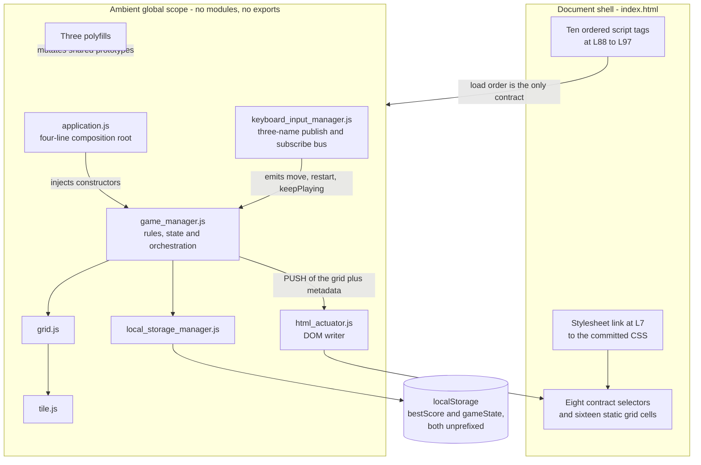
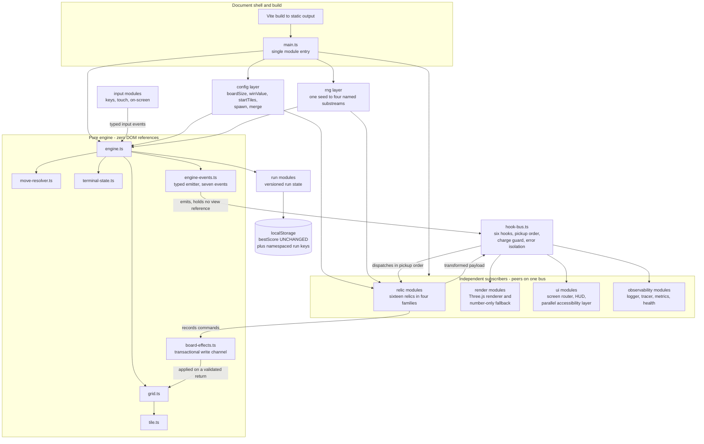

# Architecture: Before and After

This document states what this repository's architecture **is**, and what it
**was** before the game engine and the renderer were split apart. It carries
two figures — the before state and the after state — and only the prose that
those two figures cannot carry. It argues nothing: rationale lives in
[`docs/DECISION_LOG.md`](../DECISION_LOG.md) and nowhere else, and this
document cites that log by identifier wherever a reader would otherwise ask
why.

**Figure numbering.** The bare numerals `1` through `8` are one sequence
shared across `docs/architecture/` and
[`docs/TRACEABILITY_MATRIX.md`](../TRACEABILITY_MATRIX.md), so a reference by
name resolves to exactly one figure. Figure 1 and Figure 2 are here; every
other figure is listed with its owning document in
[section 7](#7-related-figures).
[`docs/DECISION_LOG.md`](../DECISION_LOG.md) numbers its own figures `D<n>`,
[`docs/CONFIGURATION.md`](../CONFIGURATION.md) numbers its own `C<n>` and
[`docs/OBSERVABILITY.md`](../OBSERVABILITY.md) numbers its own `O<n>`, for the
same reason.

## Contents

- [1. The architecture as it was](#1-the-architecture-as-it-was)
- [2. The architecture as it is](#2-the-architecture-as-it-is)
- [3. Why both figures are published](#3-why-both-figures-are-published)
- [4. Three architectural deltas](#4-three-architectural-deltas)
- [5. What deliberately did not change](#5-what-deliberately-did-not-change)
- [6. Where the rationale lives](#6-where-the-rationale-lives)
- [7. Related figures](#7-related-figures)
- [8. The governing contribution guide](#8-the-governing-contribution-guide)

## 1. The architecture as it was

Every class was an ambient global: there was not one `export`, one
`module.exports` or one AMD `define` anywhere in `js/`. The composition root
was four lines and injected **constructors** rather than instances, and the
rules controller called the DOM writer directly.

**Figure 1 — As-Is Architecture: Layered Globals with a Push-Based Actuator.**

**Legend for Figure 1.** *As-Is Architecture: Layered Globals with a
Push-Based Actuator.* A **solid arrow** is a direct synchronous call or a
construction. The **dotted arrow** is a side effect on shared global scope
rather than a call. The **cylinder** is browser-provided persistence. A **box
inside a region** is one file of that region, and a **multi-line box** names
the file and then its responsibility.

Figure 1 exists to make two properties visible, and both of them are edges
rather than boxes.

- **The controller pushes into the view.** `js/game_manager.js` L91-L97 is one
  call, `this.actuator.actuate(this.grid, { score, over, won, bestScore,
  terminated })`, and it was the only way state ever reached the screen. The
  rules engine therefore held a reference to a view and could not be
  constructed, run or tested without a document. That edge is the one Figure 2
  reverses.
- **Dependency resolution rests entirely on script order.** The ten `<script>`
  tags at `index.html` L88-L97 are the whole dependency graph, declared in one
  place and enforced by nothing. `grid.js` loads at L93 and reaches the `Tile`
  constructor as an ambient global while `tile.js` loads after it at L94; that
  survives only because `js/application.js` defers construction into a
  `requestAnimationFrame` callback at L97.

Three further properties of the as-is state are worth stating plainly, because
each is a constraint the after state had to answer. The eight contract
selectors — `.tile-container`, `.score-container`, `.best-container`,
`.game-message`, `.game-container`, `.restart-button`, `.retry-button` and
`.keep-playing-button` — were resolved by **eight lookups, none of them
null-checked**. The board dimension was declared three times over: once as the
literal `4` at `js/application.js` L3, once as `$grid-row-cells` in the
stylesheet, and once as the sixteen `.grid-cell` elements at `index.html`
L43-L68. And randomness entered at exactly **two** call sites,
`js/game_manager.js` L71 and `js/grid.js` L41, which is why seeding it was an
audited change rather than a search.

## 2. The architecture as it is

The engine emits typed events. Relics, the renderer, the screen router and the
observability stack subscribe to them.

**Figure 2 — To-Be Architecture: Event-Driven Engine with Subscribed Renderer
and Hook Bus.**

**Legend for Figure 2.** *To-Be Architecture: Event-Driven Engine with
Subscribed Renderer and Hook Bus.* A **solid arrow** is a typed call, an
import or an event dispatch. A **multi-line box** is a module group annotated
with its responsibility. The **cylinder** is browser-provided persistence. The
**region titles carry their own constraints**: the engine region is labelled
as holding zero DOM references, and the subscriber region as holding peers
rather than one privileged view.

Figure 2 exists to make two changes from Figure 1 visible, and again both of
them are edges.

- **The engine holds no reference to any view.** There is no arrow from the
  engine region to a renderer, to a screen or to the markup. The push call of
  Figure 1 became the `state:commit` event, and every view now reaches state by
  subscribing (`DL-ENGINE-01`).
- **Relics and the renderer are peers on the same bus.** `relic modules` and
  `render modules` hang off `hook-bus.ts` as equals, and the engine branches on
  no subscriber identity. That is exactly why a relic can be added without
  touching an engine module.

Two edges have no counterpart in Figure 1 at all. The return arrow from
`relic modules` back to the bus is the compounding protocol: a handler receives
the payload the handler before it returned, so two relics on one hook compound
rather than overwrite (`DL-HOOKBUS-03`), and they are reached in pickup order
(`DL-HOOKBUS-02`). The arrow through `board-effects.ts` is the only route a
relic has to the lattice, because nothing in a relic writes the grid, a tile or
the rules directly (`DL-BOARD-02`).

The **observability group is a peer subscriber, not an annex**, and that is a
structural fact rather than a drawing choice. The emitter's `on()` **appends**
to a per-name listener array at `src/engine/engine-events.ts` L430, so the
logger, the tracer and the metrics registry attach exactly as any other
subscriber does, with no call site inside the engine: no module under
`src/engine`, `src/input`, `src/relics` or `src/render` imports anything from
`src/observability` (`DL-MAIN-05`). What each surface emits, which capability
probes were reused and which was added, and how to exercise every one of
them locally all belong to
[`docs/OBSERVABILITY.md`](../OBSERVABILITY.md), not here.

### 2.1 The seven events the emitter box carries

`ENGINE_EVENT_NAMES` declares the whole contract, in this lifecycle order.
`EngineEventPayloadMap` binds each name to its payload type, so a listener's
argument is checked against the name it subscribed to.

| Event | When it is emitted |
|---|---|
| `stage:start` | Once, as a stage's board is prepared |
| `move:before` | Before the engine has decided whether the move resolves; **cancellable**, so a relic may veto it |
| `tile:merge` | Once **per merge**, so a turn with two merges emits twice |
| `tile:spawn` | Once a spawn has been resolved; the position may be absent on a full board |
| `move:after` | Once a move has been resolved |
| `stage:end` | Once a stage is resolved; the one event with **no** pre-migration counterpart |
| `state:commit` | Last in every turn, closing it |

`state:commit` is the direct successor to the single push call of Figure 1: the
same six members, extended with the stage and relic contexts. It is what a view
reconciles against, and the six events before it are what a view animates from.
The board itself travels **by reference** on a commit, exactly as the
pre-migration view read the live grid (`DL-EVENT-01`), and a subscriber that
throws is contained inside `emit` rather than aborting the emission
(`DL-EVENT-03`).

The bus above those events dispatches the six mandated hooks and no seventh —
`onStageStart`, `onBeforeMove`, `onMerge`, `onSpawn`, `onAfterMove` and
`onStageEnd` (`DL-HOOK-01`) — and the charge guard that skips a spent relic is
implemented once, inside the bus (`DL-HOOKBUS-01`). One seed fans into four
named substreams — `spawn-value`, `spawn-position`, `relic-draw` and
`rarity-weight` — from a generator that is always a local instance and is
never installed onto `Math.random` (`DL-RNG-01`).

## 3. Why both figures are published

**Rule 2** of this project's governing rules, Visual Architecture
Documentation, requires that where a deliverable modifies an existing
architecture, **both states be shown, never the target state alone**. This work
modifies an existing architecture rather than adding to a blank one:
`js/html_actuator.js` is replaced rather than patched, `js/game_manager.js` is
decomposed into an engine, a move resolver, a terminal-state evaluator and an
emitter, and the push-based actuation contract is inverted into an event
contract.

Figure 1 and Figure 2 are therefore a **mandatory pair**. Neither is published
alone, neither is removed without the other, and a change that moves a boundary
in one is incomplete until the other shows the same boundary. Read together
they answer one question — who calls whom — in the before state and in the
after state. Read apart, either one answers it for a system that does not
exist.

## 4. Three architectural deltas

Three properties of the system changed in kind rather than in degree. Each is
stated here as a fact; the reasoning behind each sits in the cited log row.

### 4.1 Per-frame work appears for the first time

Before the split, JavaScript performed no interpolation and no per-frame work
beyond one class assignment per tile: every animation was declared in
`style/main.scss` and run by the browser. A Three.js render loop moves
interpolation into JavaScript and onto the GPU, which is the product's first
per-frame JavaScript work of any kind.

The five existing CSS timings are the budget the tweens match, and they are
reproduced rather than reinterpreted (`DL-ANIM-01`):

| Effect | Timing | Declared at |
|---|---|---|
| Tile movement | 100 ms `ease-in-out`, transform only | `style/main.scss` L329 |
| Spawn, `appear` | 200 ms `ease` after a 100 ms delay | L430 |
| Merge, `pop` | 200 ms `ease` after a 100 ms delay, scaling 0 to 1.2 to 1 | L450, with keyframes at L434-L446 |
| Score delta, `move-up` | 600 ms `ease-in` | L104 |
| Terminal overlay, `fade-in` | 800 ms `ease` after a 1200 ms delay | L234, delay `$transition-speed * 12` |

### 4.2 The development-time boundary enters the delivery path

Before the split, nothing from the build boundary shipped: the generated
stylesheet was committed to the tree instead, with nothing verifying that it
matched its source. With a bundler the build output is the artifact and the
committed tree is only its input. `style/main.css` is deleted (`DL-SHEET-02`),
and the stylesheet now enters through the module graph as the single SCSS
import in `src/main.ts` (`DL-MAIN-01`), which also collapses the
render-blocking font import that was nested inside it.

One documented property is lost with that change: the game no longer opens and
plays directly from `file://` with no preprocessing, because a single ES module
needs a served origin. `npm run preview` replaces the open-the-file workflow,
and `README.md` documents it (`DL-BUILD-11`). What deployment looks like is
unchanged — one install and one build command produce a folder that is copied
to any static host — and that is the property the static-output build node of
Figure 2 preserves, for a project hosted on GitHub Pages specifically so that
it carries no hosting cost.

### 4.3 The DOM contract narrows and hardens

Eight selectors formed the pre-migration contract between the renderer and the
markup, and **not one of the eight lookups was null-checked**: four resolved in
`js/html_actuator.js` L2-L5, three through `bindButtonPress` at
`js/keyboard_input_manager.js` L72-L74, and `.game-container` through an
unchecked indexed `getElementsByClassName` result at L78. A renamed class was a
total startup failure rather than a degraded one. Three things changed:

- The renderer generates the board from the configured size, which removes the
  sixteen static `.grid-cell` elements at `index.html` L43-L68 and with them the
  third independent declaration of the board dimension.
- **Seven of the eight selectors survive**, and their lookups are guarded.
  `.score-container` and `.best-container` are still the score outlets and have
  gained real accessible names; `.game-container`, `.game-message`,
  `.restart-button`, `.retry-button` and `.keep-playing-button` are retained,
  the last three now as real `button` elements rather than bare anchors.
- **`.tile-container` is the one that does not survive.** It is replaced by the
  canvas the renderer draws into, which carries `aria-hidden="true"`; the
  board's semantics are delivered beside it by a parallel focusable layer. New
  screen mount points are addressed through the screen router rather than by
  scattered `querySelector` calls.

## 5. What deliberately did not change

Four contracts are frozen, and both figures show the same thing for each.

- **The 4x4 board and its rules.** Move resolution, merges, the spawn
  distribution and the win value are ported construct for construct, and the
  default configuration reproduces them exactly, so the board plays identically
  to the pre-migration game. What was a literal in the controller — board size
  `4`, win value `2048`, two starting tiles, and spawn values `2` and `4` at
  weights `0.9` and `0.1` — is now a value on a configuration object that the
  base game and every relic read from.
- **The best-score contract.** The key literal is still `bestScore`, and the
  accessor still returns the **raw stored string** when a value is present and
  the number `0` when it is absent, so the relational promotion comparison
  behaves as it did (`DL-STORE-02`). A best score written by the pre-migration
  game still loads.
- **The two pre-migration storage keys.** `bestScore` and `gameState` stay
  **unprefixed and frozen**; every key minted since is namespaced under
  `roguelike2048:`, and run state lives at `roguelike2048:runState`
  (`DL-KEYS-01`).
- **The z-index ladder.** The established `1 / 2 / 10 / 20 / 100` values are
  **extended upward and never renumbered** — HUD 200, screen overlays 300,
  modal and reward 400, diagnostics overlay 500 (`DL-SCREEN-02`).

The three input event names `move`, `restart` and `keepPlaying` are likewise
preserved, and the new screen-flow and relic actions are additions beside them.
`keepPlaying` survives in two places for that reason: as the input event name,
and as the persisted property name. The engine's own flag and method are named
`continuedPlay` and `continuePlaying()` instead (`DL-ENGINE-04`).

## 6. Where the rationale lives

Every "why" behind the two figures above is a row in
[`docs/DECISION_LOG.md`](../DECISION_LOG.md), which is the single source of
truth for reasoning. A citation here names what was decided and its
identifier; the alternatives, the reasoning and the risks appear only in the
row (`DL-DOC-05`). The table below is an index into that log for the decisions
these two figures touch, not a summary of it.

| Decision these figures show | Identifier |
|---|---|
| The engine holds no view reference; the push call becomes `state:commit` | `DL-ENGINE-01` |
| The board travels by reference on a commit | `DL-EVENT-01` |
| A listener that throws is contained inside `emit` | `DL-EVENT-03` |
| The six mandated hook names are the whole hook surface | `DL-HOOK-01` |
| Dispatch order is pickup order | `DL-HOOKBUS-02` |
| The charge guard lives in the bus | `DL-HOOKBUS-01` |
| The compounding return protocol between the bus and a relic | `DL-HOOKBUS-03` |
| A relic reaches the board only by a payload member, its own state slot or an effects command | `DL-BOARD-02` |
| The generator is a local instance and `Math.random` is never patched | `DL-RNG-01` |
| The best-score accessor keeps the raw stored string | `DL-STORE-02` |
| `bestScore` and `gameState` stay unprefixed and frozen | `DL-KEYS-01` |
| The five CSS timings are reproduced in JavaScript | `DL-ANIM-01` |
| The committed `style/main.css` is deleted | `DL-SHEET-02` |
| The stylesheet enters through the module graph | `DL-MAIN-01` |
| The z-index ladder is extended, never renumbered | `DL-SCREEN-02` |
| Observability attaches by dependency inversion | `DL-MAIN-05` |
| **Deviation** — the three polyfills are deleted and the browser matrix narrows | `DL-MAIN-08` |
| **Deviation** — the `file://` open-and-play property ends | `DL-BUILD-11` |
| **Deviation** — the `keepPlaying` prototype shadowing is repaired | `DL-ENGINE-04` |
| **Deviation** — the `CONTRIBUTING.md` design freeze is superseded | `DL-DOC-02` |
| **Deviation** — three plan line references corrected against the checkout, including the score surfaces at `index.html` L23-L26 | `DL-DOC-04` |
| **Deviation** — the four server-shaped observability capabilities delivered browser-native | `DL-METRIC-05`, `DL-HEALTH-05`, `DL-TRACE-01`, `DL-DIAG-06` |

## 7. Related figures

Each document below owns its figures and is the authority on its own subject.
Nothing here restates them.

- [`component-interaction.md`](component-interaction.md) — **Figure 3 —
  Component Interaction: Input, Engine, Hook Bus, Relics, Renderer and
  Persistence**, the runtime relationships between the boxes of Figure 2; and
  the screen-flow pair **Figure 6a — Before: Seven Board States Produced by
  CSS Class Toggles on One Screen**, and **Figure 6b — After: The Screen Flow
  as a Declared State Machine**.
- [`data-flow.md`](data-flow.md) — **Figure 4 — Turn Data Flow: From
  Keystroke to Composited Frame and Persisted Run State**, and **Figure 7 —
  Seeded Determinism: One Run Seed Fanned into Named RNG Substreams**.
- [`hook-dispatch-sequence.md`](hook-dispatch-sequence.md) — **Figure 5 —
  Hook Dispatch Sequence: Pickup-Order Fan-Out with Charge Guard and Error
  Isolation**.
- [`../TRACEABILITY_MATRIX.md`](../TRACEABILITY_MATRIX.md) — **Figure 8 —
  File Transformation Map**, and the construct-by-construct bidirectional
  mapping from each retired `js/` source to the module carrying it now. Figure
  8 is not in this folder and is not reproduced here.
- [`../CONFIGURATION.md`](../CONFIGURATION.md) — the rules and stage
  configuration reference, and the configuration figure.
- [`../RELICS.md`](../RELICS.md) — the relic catalogue: sixteen relics across
  four families, with the hooks each binds and the charges it carries.
- [`../OBSERVABILITY.md`](../OBSERVABILITY.md) — the observability signal
  path, the reuse inventory and the six health checks that the `observability
  modules` box of Figure 2 stands for.
- [`../DECISION_LOG.md`](../DECISION_LOG.md) — all rationale, for every
  decision either figure shows.

## 8. The governing contribution guide

[`CONTRIBUTING.md`](../../CONTRIBUTING.md) was updated so that the governing
document matches this architecture rather than the one Figure 1 describes; the
supersession of its design freeze is recorded as `DL-DOC-02`.
