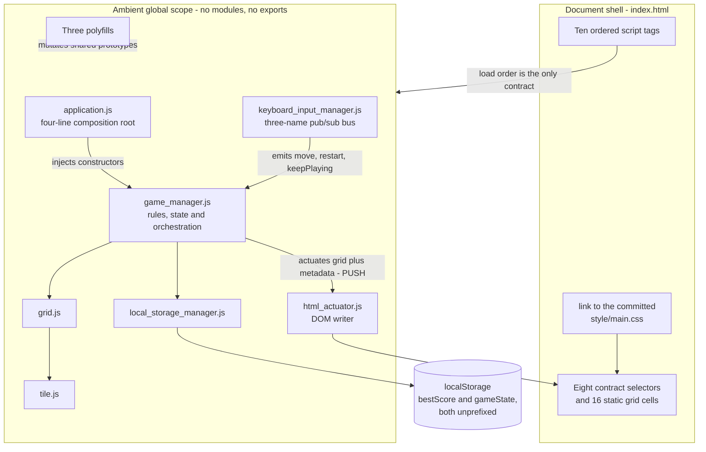
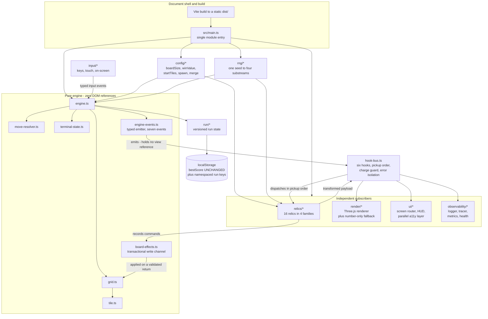

# Architecture: Before and After

This repository began as the canonical `gabrielecirulli/2048`: ten classic
`<script>` tags, ten ambient globals, and a rules controller that held a
reference to a DOM writer and pushed state into it. It is now a TypeScript
application in which a DOM-free engine **emits** and every view **subscribes**.

That inversion is the single change everything else in the project rests on, so
this document shows **both states**. `Figure 1` is the architecture as it was;
`Figure 2` is the architecture as it is. Neither is published without the other,
and the two are meant to be read side by side: the same seven boxes are present
in both, and what changes is who calls whom.

This document does not argue any of it. Rationale lives in
[`docs/DECISION_LOG.md`](../DECISION_LOG.md) and nowhere else, and this document
cites it by identifier — `DL-ENGINE-01`, `DL-HOOKBUS-02` and so on — wherever a
reader would otherwise ask why.

**Figure numbering.** The bare numerals `1` through `8` are one sequence shared
across `docs/architecture/` and [`docs/TRACEABILITY_MATRIX.md`](../TRACEABILITY_MATRIX.md),
so a reference by name resolves to exactly one figure. `Figure 1` and `Figure 2`
are here; `Figure 3` is in [`component-interaction.md`](component-interaction.md)
with `Figure 6`; `Figure 4` and `Figure 7` are in
[`data-flow.md`](data-flow.md); `Figure 5` is in
[`hook-dispatch-sequence.md`](hook-dispatch-sequence.md); `Figure 8` is the file
transformation map in the traceability matrix.
[`docs/DECISION_LOG.md`](../DECISION_LOG.md) numbers its own figures `D<n>` and
[`docs/CONFIGURATION.md`](../CONFIGURATION.md) numbers its own `C<n>` for the
same reason.

## Contents

- [1. The architecture as it was](#1-the-architecture-as-it-was)
- [2. The architecture as it is](#2-the-architecture-as-it-is)
- [3. What actually changed](#3-what-actually-changed)
- [4. What deliberately did not change](#4-what-deliberately-did-not-change)
- [5. Where to look next](#5-where-to-look-next)

## 1. The architecture as it was

Every class was an ambient global. There was not one `export`, `module.exports`
or `define` anywhere in `js/`: dependency resolution was script order, declared
once in the markup and enforced by nothing. The composition root was four lines,
and it injected **constructors** rather than instances — which is the seam the
split later exploited. The rules controller called the actuator directly, so the
game rules held a reference to a view.

**Figure 1 — As-Is Architecture: Layered Globals with a Push-Based Actuator.**

**Legend for Figure 1.** *As-Is Architecture: Layered Globals with a Push-Based
Actuator.* A **solid arrow** is a direct synchronous call or a construction. The
**dotted arrow** is a side effect on shared global scope rather than a call. The
**cylinder** is browser-provided persistence. The two properties that matter,
and that `Figure 2` reverses, are that `game_manager.js` **pushes** into
`html_actuator.js` — so the rules engine holds a view reference and cannot be
tested without a document — and that nothing in the system enforces the load
order the whole graph depends on. `grid.js` reached the `Tile` constructor as an
ambient global, which worked only because of that order.

## 2. The architecture as it is

The engine emits typed events and holds no reference to any view. Relics, the
renderer, the screen router and the observability stack are **peers**: each
subscribes to the same bus, none is privileged, and the engine branches on no
subscriber identity. That is why a relic can be added without touching an engine
module, and why the observability stack attaches without an edit to any engine
file.

**Figure 2 — To-Be Architecture: Event-Driven Engine with a Subscribed Renderer
and Hook Bus.**

**Legend for Figure 2.** *To-Be Architecture: Event-Driven Engine with a
Subscribed Renderer and Hook Bus.* A **solid arrow** is a typed call, an import
or an event dispatch. A **multi-line box** is a module group annotated with its
responsibility. The **cylinder** is browser-provided persistence. Read against
`Figure 1`, three edges are the whole story: the arrow from `game_manager.js` to
`html_actuator.js` is **gone**, replaced by `engine-events.ts` emitting into the
hook bus; `relics/*` and `render/*` hang off that bus as equals; and the return
arrow from `relics/*` back to the bus is the compounding protocol that has no
counterpart in `Figure 1` at all. The dependency inversion is `DL-ENGINE-01`,
dispatch ordering is `DL-HOOKBUS-02`, and the transactional write channel is
`DL-HOOKBUS-03`.

The `engine-events.ts` box of `Figure 2` emits **seven** named events, and this
is the whole contract. `ENGINE_EVENT_NAMES` declares them in the canonical
lifecycle order below; `EngineEventPayloadMap` binds each name to its payload
type, so a listener's argument is checked against the name it subscribed to.

| Event | When it is emitted | Payload carries |
|---|---|---|
| `stage:start` | Once, as a stage's board is prepared | The stage index, its goal, the run seed and the board size |
| `move:before` | Before the engine has decided whether the move resolves | The direction and a read-only board projection |
| `tile:merge` | Once **per merge**, so a turn with two merges emits twice | The source and target tiles, the resulting value, the score delta and the owning `turn` |
| `tile:spawn` | Once a spawn has been resolved | The position and value, and the owning `turn`; the position may be absent on a full board |
| `move:after` | Once a move has been resolved | Whether the board moved, the board it left, and the owning `turn` |
| `stage:end` | Once a stage is resolved | The stage index, whether it cleared, and the score |
| `state:commit` | Last in every turn, closing it | The board, score, best score, `over`, `won`, `terminated`, a `degraded` flag, and the stage and relic contexts |

`state:commit` is the direct successor to the single push call the pre-migration
controller made into `html_actuator.js`: the same six members, with the stage and
relic contexts added. It is what a view reconciles against; the six events before
it are what a view animates from. `stage:end` is the one event with **no**
pre-migration counterpart, because nothing in `js/` resolved a stage.

## 3. What actually changed

Six properties differ between the two figures. Each is a deliberate consequence
of the split rather than incidental drift.

| Property | Figure 1 | Figure 2 |
|---|---|---|
| Dependency direction | The rules controller calls the view | The engine emits; every view subscribes |
| Module system | Ten ambient globals, resolved by script order | ES modules, resolved by the module graph |
| Rules | `2048`, `2` and `Math.random() < 0.9 ? 2 : 4` as literals in the controller | Values on a `RulesConfig` that the base game and every relic read |
| Randomness | Two direct `Math.random()` call sites | One seeded generator fanned into four named substreams, never installed onto `Math.random` |
| Extension | Adding behaviour meant editing the controller | Adding behaviour means registering a relic against a hook |
| Per-frame work | None; all animation was CSS | A render loop, the product's first per-frame JavaScript |

The board itself is the same 4×4 game. `Figure 2` adds capability around the
rules; it does not restate them.

## 4. What deliberately did not change

Three contracts are frozen, and both figures show the same thing for each:

- **The best-score contract.** The literal key `bestScore`, and an accessor that
  returns the stored **string** when a value is present and the number `0` when
  it is absent. A best score written by the pre-migration game still loads.
- **The 4×4 board and its rules.** Move resolution, merges, spawn distribution
  and the win value are ported construct for construct, and the default
  configuration reproduces them exactly.
- **The three input event names.** `move`, `restart` and `keepPlaying` are
  preserved; the new screen-flow and relic actions are additions beside them.

## 5. Where to look next

- [`component-interaction.md`](component-interaction.md) — `Figure 3`, the
  runtime relationships between the boxes of `Figure 2`, and `Figure 6`, the
  screen flow with the state model it replaced.
- [`data-flow.md`](data-flow.md) — `Figure 4`, one turn from keystroke to
  composited frame, and `Figure 7`, the seed fanned into substreams.
- [`hook-dispatch-sequence.md`](hook-dispatch-sequence.md) — `Figure 5`, the
  pickup-order fan-out with its charge guard and error isolation.
- [`../TRACEABILITY_MATRIX.md`](../TRACEABILITY_MATRIX.md) — `Figure 8` and the
  construct-by-construct mapping from each retired file to its successor.
- [`../CONFIGURATION.md`](../CONFIGURATION.md) and
  [`../RELICS.md`](../RELICS.md) — the configuration and relic references.
- [`../OBSERVABILITY.md`](../OBSERVABILITY.md) — what the `observability/*` box
  of `Figure 2` reuses and what it adds.
