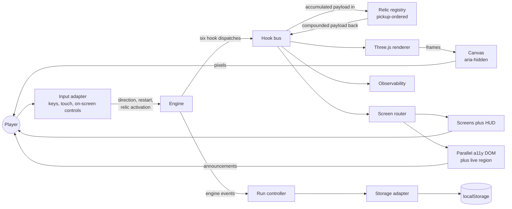

# Component Interaction

[`ARCHITECTURE.md`](ARCHITECTURE.md) states which modules exist and which way
their dependencies point. This document states what passes **between** them
while a game is running: who the player reaches, what crosses each boundary,
and how one board state reaches the player twice — once as pixels and once as
semantics.

One figure lives here. Figure 3 is the component graph of a running game, and
it is the only diagram this document carries; every other figure is listed with
its owning document in [section 6](#6-where-to-look-next).

Nothing is argued here. Rationale lives in
[`docs/DECISION_LOG.md`](../DECISION_LOG.md) and nowhere else, cited below by
identifier wherever a reader would otherwise ask why.

## Contents

- [1. The components of a running game](#1-the-components-of-a-running-game)
- [2. What crosses each boundary](#2-what-crosses-each-boundary)
- [3. The two paths back to the player](#3-the-two-paths-back-to-the-player)
- [4. Peers on one bus](#4-peers-on-one-bus)
- [5. Two edges a reader can misread](#5-two-edges-a-reader-can-misread)
- [6. Where to look next](#6-where-to-look-next)

## 1. The components of a running game

**Figure 3 — Component Interaction: Input, Engine, Hook Bus, Relics, Renderer,
Persistence.**

**Legend.** The **circle** is the human actor. A **rectangle** is a module or a
module group. The **cylinder** is persistence. The **pair of arrows** between
the hook bus and the relic registry is the compounding protocol: the bus hands
each handler the accumulated payload and takes back a possibly transformed one.
Every other arrow is a one-way dispatch, subscription or call, and its label —
where it carries one — names what travels along it.

**The before state.** Figure 3 is a to-be view. Its before state is
**Figure 1 — As-Is Architecture: Layered Globals with a Push-Based Actuator**,
in [`ARCHITECTURE.md`](ARCHITECTURE.md#1-the-architecture-as-it-was), where the
rules controller held a reference to the DOM writer and pushed a state
projection into it on every commit, and where the relic registry, the screen
router, the run controller and the observability layer of Figure 3 had no
counterpart at all. **Rule 2**'s both-states obligation is discharged for this
architecture by that Figure 1 and Figure 2 pair, so this document draws the
to-be view alone rather than restating the as-is one. **Figure 2 — To-Be
Architecture: Event-Driven Engine with Subscribed Renderer and Hook Bus** is the
module-level view of the same inversion (`DL-ENGINE-01`).

## 2. What crosses each boundary

| Boundary | What crosses it |
|---|---|
| Player → input adapter | A key, a swipe, or a press on an on-screen control |
| Input adapter → engine | One named input event. The three pre-migration names are frozen — `move`, whose payload is a bare direction `0`–`3`, `restart` and `keepPlaying` — and eight were added beside them without altering those: `startRun`, `selectReward`, `continueStage`, `endRun`, `activateRelic`, `openSettings`, `closeSettings` and `cancel` |
| Engine → hook bus | One of six hook dispatches, through `dispatch()`: `onStageStart`, `onBeforeMove`, `onMerge`, `onSpawn`, `onAfterMove`, `onStageEnd` |
| Hook bus → relic handler | The accumulated payload for that hook. The board itself travels **by reference** (`DL-EVENT-01`) |
| Relic handler → hook bus | A possibly transformed payload. A handler that returns nothing leaves the payload as it stands (`DL-HOOKBUS-03`) |
| Hook bus → renderer | `state:commit` for a full board reconciliation, and `stage:start`, `tile:merge`, `tile:spawn`, `move:after` and `stage:end` as animation and re-frame triggers |
| Hook bus → screen router | The events that move the seven-screen state machine |
| Hook bus → observability | The same events, taken by the logger, the tracer and the metrics collectors |
| Engine → run controller | `move:after`, `stage:end` and `state:commit`, taken by subscription rather than by call (`DL-RUNCTL-17`) |
| Run controller → storage adapter | The versioned run-state envelope, carrying the cursor each named substream reached so a resumed run continues the sequence it interrupted (`DL-RNG-04`) |
| Storage adapter → `localStorage` | `roguelike2048:runState`, namespaced under `roguelike2048`, written beside the frozen and deliberately unprefixed `bestScore` and `gameState` (`DL-KEYS-01`) |
| Renderer → canvas | Frames |
| Screen router → screens and HUD | Which of the seven screens is in force, and the score, best-score and terminal-overlay outlets the HUD alone writes (`DL-HUD-01`) |
| Screen router → parallel a11y DOM | The same state as labelled, focusable DOM counterparts, and the announcements the live region speaks (`DL-A11Y-08`) |

The seven screens the router moves between are `runStart`, `stage`,
`stageClear`, `reward`, `won`, `gameOver` and `runSummary`, and the edges
between them are a frozen transition table rather than an imperative
show-and-hide (`DL-ROUTER-12`). At the storage boundary the best-score accessor
keeps the raw stored **string** when a value is present and returns the number
`0` when it is absent (`DL-STORE-02`); the write-then-read ordering that puts
that value on screen is described with the turn that produces it, in
[`data-flow.md`](data-flow.md).

## 3. The two paths back to the player

Three arrows terminate at the player in Figure 3, and they carry two kinds of
information. The canvas carries **pixels**. The screens, the HUD and the
parallel accessibility layer carry **semantics** — text, roles, accessible
names and spoken announcements.

Both modalities carry the same board state. A canvas is a single opaque node to
assistive technology: WebGL emits pixels and no structure, so a screen reader
perceives an entire board as one element and can report nothing about what is on
it. The canvas carries `aria-hidden="true"` and the board is published a
second time beside it, as a real `role="grid"` element with labelled, focusable
per-cell counterparts, with state changes announced through a live region
(`DL-A11Y-08`). Number-only mode is a renderer in its own right rather than a
degraded view of the WebGL one: it exposes the same `subscribe`, `mount`,
`unmount` and `dispose` surface, so the composition root mounts either renderer
interchangeably once the WebGL probe has answered (`DL-NUMBER-01`).

## 4. Peers on one bus

The engine holds **no** reference to the renderer, the screen router or the
observability layer. Each subscribes (`DL-ENGINE-01`). The bus carries the
shared engine-event channel alongside the six relic hooks — `events` is the
channel every non-relic peer subscribes to (`DL-HOOKBUS-06`) — which is why
relics, the renderer, the router and observability sit at one fan-out in
Figure 3 rather than in a hierarchy.

A peer attaches with **no engine-side call site at all**, and the reason is
structural rather than conventional: the emitter's `on()` *appends* to a
per-name listener array and `emit()` walks that array, the append-only shape
carried forward from `js/keyboard_input_manager.js` L18-L23 (`DL-INPUT-03`).
`attachEngineTracing` in `src/observability/tracer.ts` subscribes in exactly
that way, so the observability layer is a first-class peer of the renderer here
and not an annex bolted to the engine (`DL-MAIN-05`).

The compounding protocol is an explicit, tested contract, not a property that
emerges from the order handlers happened to register in:

- The relic registry is the authority for pickup order, and a dispatch walks the
  backing array in that order without copying or sorting it (`DL-HOOKBUS-02`).
- Each handler receives the payload the handler before it returned, which is
  what makes two relics on one hook compound rather than overwrite
  (`DL-HOOKBUS-03`).
- The charge guard lives in the bus, not in the handlers: a subscriber whose
  charges are present and not above zero is skipped before its handler is
  reached (`DL-HOOKBUS-01`).
- A handler that throws is caught and reported, its subscriber is marked
  degraded, and the dispatch continues so the turn still completes
  (`DL-HOOKBUS-04`).

The bus surface is `register()`, `unregister()` and `dispatch()`, with
`subscribers()` reporting the live records. **Figure 5 — Hook Dispatch
Sequence: Pickup-Order Fan-Out with Charge Guard and Error Isolation** in
[`hook-dispatch-sequence.md`](hook-dispatch-sequence.md) draws one dispatch
through those four rules step by step and is not redrawn here.

One registration per relic carries its whole handler table, one charge budget
and one state slot, so every hook a single relic binds shares one mutable pool
and one `state` value (`DL-REGISTRY-02`). The registry is also the only
construct in the system that names a relic — no engine, renderer or UI module
branches on a relic identifier (`DL-REGISTRY-01`) — and the catalogue itself,
with each relic's family, rarity, hooks and charges, is in
[`../RELICS.md`](../RELICS.md).

## 5. Two edges a reader can misread

**The engine-to-run-controller edge carries events, not a call.**
`src/run/run-controller.ts` subscribes to `move:after`, `stage:end` and
`state:commit` and is never called by the engine; it drives the engine back
through a structural port that it declares itself, and `src/engine` imports
nothing from `src/run` (`DL-RUNCTL-17`). The arrow's direction in Figure 3 is
the direction the events travel, and it is not a compile-time dependency.

**Three similar names are three different things.** The engine's
continue-after-win method is `continuePlaying()` and its flag is
`continuedPlay`; the input event a player's press emits is `keepPlaying`; and
the persisted property is also `keepPlaying`. The method and the flag were
renamed, and both frozen names stayed as they were (`DL-ENGINE-04`).

## 6. Where to look next

Each document below owns its figures and is the authority on its own subject.
Nothing here restates them.

- [`ARCHITECTURE.md`](ARCHITECTURE.md) — `Figure 1`, the before state of this
  figure, and `Figure 2`, the module graph these components belong to, with the
  seven-event contract between them.
- [`data-flow.md`](data-flow.md) — `Figure 4`, one turn from keystroke to
  composited frame and persisted run state, and `Figure 7`, the run seed fanned
  into its named substreams.
- [`hook-dispatch-sequence.md`](hook-dispatch-sequence.md) — `Figure 5`, the
  hook-bus boundary of this figure in detail, and `Figure 6`, the screen-flow
  state machine behind the seven screen names above.
- [`../TRACEABILITY_MATRIX.md`](../TRACEABILITY_MATRIX.md) — `Figure 8`, the
  file transformation map, and the construct-by-construct mapping from each
  retired `js/` source to the module carrying it now. Figure 8 is not in this
  folder and is not reproduced here.
- [`../RELICS.md`](../RELICS.md) — the relic catalogue the registry holds.
- [`../CONFIGURATION.md`](../CONFIGURATION.md) — the rules and stage
  configuration every component above reads.
- [`../OBSERVABILITY.md`](../OBSERVABILITY.md) — the observability signal
  path, the reuse inventory and the six health checks behind the
  `Observability` box.
- [`../DECISION_LOG.md`](../DECISION_LOG.md) — every `DL-` identifier cited
  above, and all rationale.
