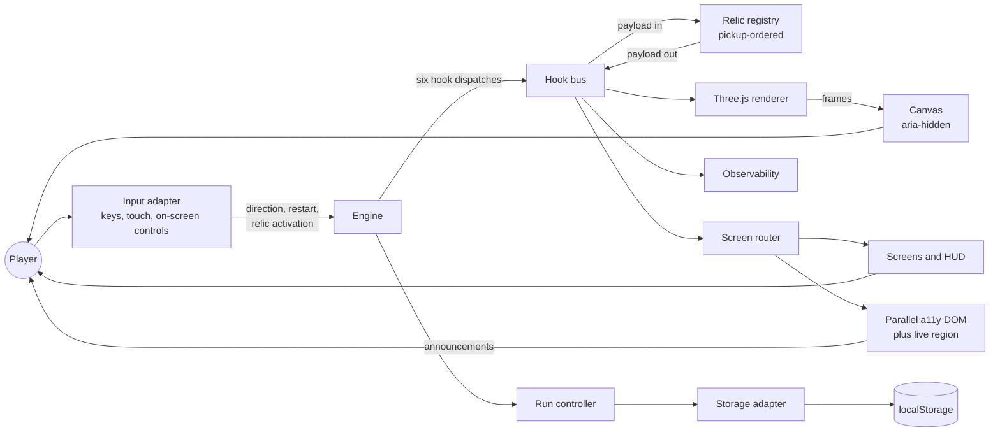
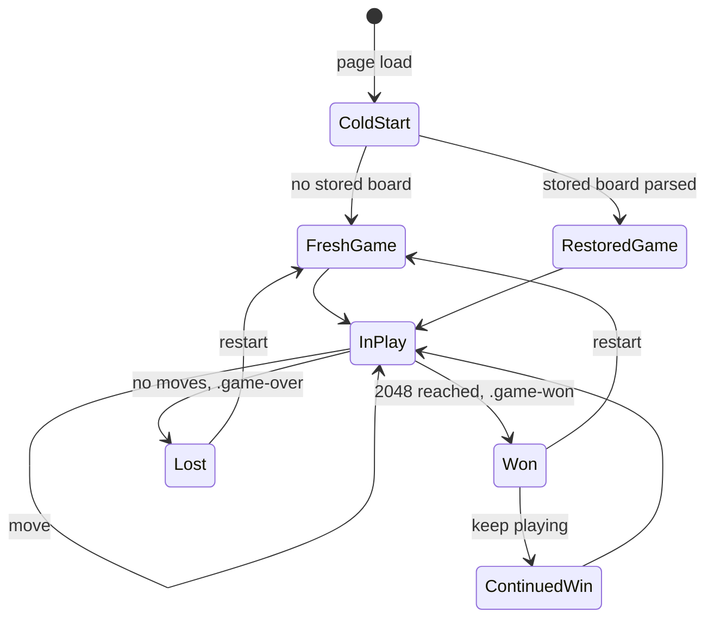
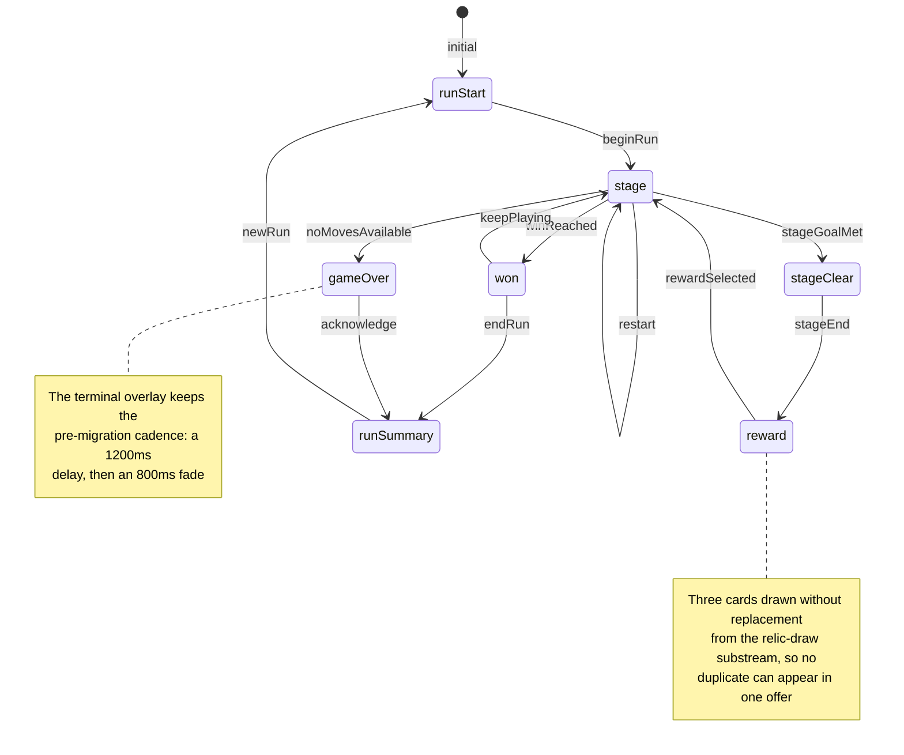

# Component Interaction

[`ARCHITECTURE.md`](ARCHITECTURE.md) shows which modules exist and which way the
dependencies point. This document shows what happens between them at run time:
who the player talks to, what crosses each boundary, and how the same board state
reaches the screen twice — once as pixels and once as semantics.

Two figures live here. `Figure 3` is the component graph of a running game.
`Figure 6` is the screen flow, paired with the class-toggled state model it
replaced, because the pre-migration product had no router at all and Rule 2
requires both states of anything this project changed.

Rationale is not argued here. It lives in
[`docs/DECISION_LOG.md`](../DECISION_LOG.md), cited below by identifier.

## Contents

- [1. The components of a running game](#1-the-components-of-a-running-game)
- [2. What crosses each boundary](#2-what-crosses-each-boundary)
- [3. The screen flow, before and after](#3-the-screen-flow-before-and-after)
- [4. Where to look next](#4-where-to-look-next)

## 1. The components of a running game

The player reaches the game through one input adapter and receives it back
through **two** surfaces. That duplication is the point: a canvas is a single
opaque node to assistive technology, so the board is also published as a parallel
DOM layer with a labelled, focusable counterpart per cell, and state changes are
announced through a live region.

**Figure 3 — Component Interaction: Input, Engine, Hook Bus, Relics, Renderer and
Persistence.**

**Legend for Figure 3.** *Component Interaction: Input, Engine, Hook Bus, Relics,
Renderer and Persistence.* The **circle** is the human actor, a **rectangle** is
a module or module group, and the **cylinder** is persistence. The **pair of
arrows** between the hook bus and the relic registry is the compounding protocol:
the bus hands each handler the accumulated payload and takes back a possibly
transformed one, which is what makes two relics on one hook compound rather than
overwrite (`DL-HOOKBUS-03`). Note that **three** paths terminate at the player —
the canvas, the DOM screens and the parallel accessibility layer — because the
same information has to arrive visually and semantically, and a canvas cannot do
the second on its own.

## 2. What crosses each boundary

| Boundary | What crosses it |
|---|---|
| Player → input adapter | A key, a swipe or a click on an on-screen control |
| Input adapter → engine | A typed intent: a direction, a restart, a relic activation |
| Engine → hook bus | One of six hook dispatches, each carrying its own payload |
| Hook bus → relic handler | The accumulated payload, a copy of the relic's own state slot, and a fork of every substream it draws from |
| Relic handler → hook bus | A possibly transformed payload, or a refusal |
| Relic handler → board | Nothing directly. Commands are recorded on a queue and applied only once the handler's return validates |
| Hook bus → renderer | The granular events that trigger animation, plus `state:commit` for a full reconciliation |
| Hook bus → screen router | The events that drive the state machine of `Figure 6` |
| Engine → run controller | Turn and stage outcomes, from which run state is written |
| Storage adapter → `localStorage` | The frozen `bestScore` key untouched, plus the namespaced run keys beside it |

The renderer never receives a call from the engine. It receives events, exactly
as the relic registry and the observability stack do, and it is the only
subscriber that owns a GPU resource.

## 3. The screen flow, before and after

The pre-migration product had **one** screen. There was no router, no hash
handling and no History API use anywhere: seven visual states were produced by
toggling CSS classes on a single markup tree, and nothing distinguished a legal
transition from an illegal one — any state could show anything.

**Figure 6a — Before: Seven Board States Produced by CSS Class Toggles on One
Screen.**

**Legend for Figure 6a.** *Before: Seven Board States Produced by CSS Class
Toggles on One Screen.* Each node is a **visual** state of the one screen, not a
state of any machine — the transitions were the side effects of two class
toggles and a `JSON.parse`, and no table declared them. There was no state a
player could be in that the markup refused to render, which is exactly what
`Figure 6b` fixes.

**Figure 6b — After: The Screen Flow as a Declared State Machine.**

**Legend for Figure 6b.** *After: The Screen Flow as a Declared State Machine.*
Each node is one of the seven states of `SCREEN_NAMES`, each labelled edge is a
trigger of `ROUTER_TRIGGERS`, and the whole edge set is the frozen `TRANSITIONS`
table of `src/ui/screen-router.ts` — twelve state-keyed edges plus the cold load.
A **note** carries a constraint inherited from elsewhere in the system. The
decisive difference from `Figure 6a` is that a trigger the state in force does
not declare **takes no edge**: it is refused and counted rather than applied, so
there is no imperative way to put a state on screen (`DL-ROUTER-12`,
`DL-ROUTER-19`). The `stageClear` state is rendered by
`src/ui/screens/stage-progress.ts`, and it is reachable only because
`stage:end` takes exactly one edge rather than two (`DL-ROUTER-36`).

## 4. Where to look next

- [`ARCHITECTURE.md`](ARCHITECTURE.md) — `Figure 1` and `Figure 2`, the module
  graph these components belong to.
- [`data-flow.md`](data-flow.md) — `Figure 4`, what one `move` edge of
  `Figure 6b` does step by step.
- [`hook-dispatch-sequence.md`](hook-dispatch-sequence.md) — `Figure 5`, the
  hook-bus boundary of `Figure 3` in detail.
- [`../RELICS.md`](../RELICS.md) — the sixteen relics the registry holds.
