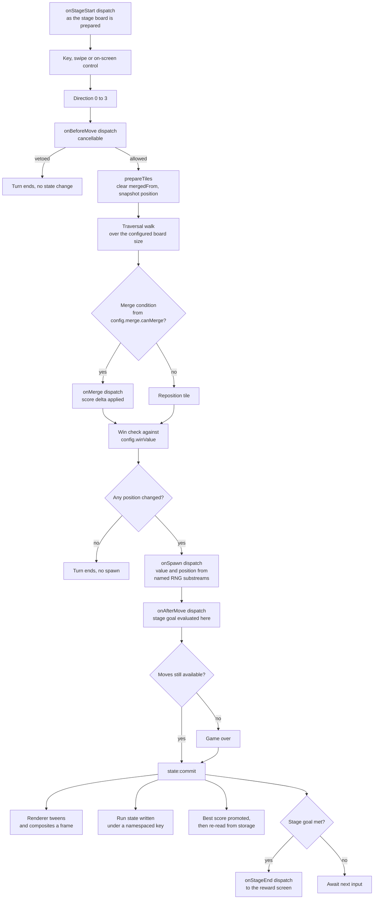
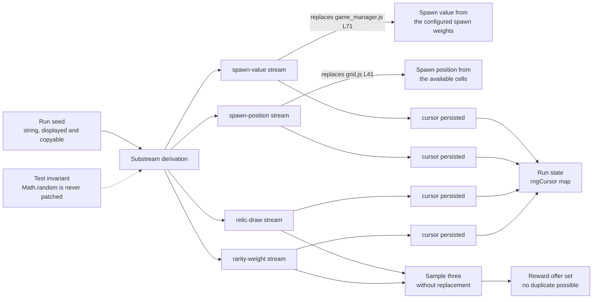

# Data Flow

Two figures live here. Figure 4 follows one turn from a keystroke to a
composited frame and a persisted run. Figure 7 follows the run seed, from which
every random value the game consumes descends.

Rationale is not argued here. It lives in
[`docs/DECISION_LOG.md`](../DECISION_LOG.md), cited below by identifier.

**Both states.** Both figures below draw the flow **as it is**. The before
state they replaced is published as **Figure 1 — As-Is Architecture: Layered
Globals with a Push-Based Actuator** in
[`ARCHITECTURE.md`](ARCHITECTURE.md), where it is paired with Figure 2. Read
Figure 1 as the before state for Figure 4 and for Figure 7 alike; no as-is
turn-flow figure is drawn here.

**Figure numbering.** The bare numerals `1` through `8` are one sequence shared
across `docs/architecture/` and
[`docs/TRACEABILITY_MATRIX.md`](../TRACEABILITY_MATRIX.md), so a reference by
name resolves to exactly one figure. Figure 4 and Figure 7 are here;
[`ARCHITECTURE.md`](ARCHITECTURE.md) section 7 lists every other figure with
the document that owns it.

## Contents

- [1. One turn, end to end](#1-one-turn-end-to-end)
- [2. Two behaviours preserved unchanged](#2-two-behaviours-preserved-unchanged)
- [3. The seed and its substreams](#3-the-seed-and-its-substreams)
- [4. Where to look next](#4-where-to-look-next)

## 1. One turn, end to end

A turn is a sequence with four points a relic can intervene at, two points the
turn can end early, and exactly one point a tile is spawned.

**Figure 4 — Turn Data Flow: From Keystroke to Composited Frame and Persisted
Run State.**

**Legend.** *Figure 4 — Turn Data Flow: From Keystroke to Composited Frame and
Persisted Run State.* A **rectangle** is a processing step and a **diamond** is
a decision. The **six hook names mark the dispatch points**: `onStageStart`,
`onBeforeMove`, `onMerge`, `onSpawn`, `onAfterMove` and `onStageEnd`. Five of
the six sit inside the turn; `onStageStart` is dispatched once as a stage's
board is prepared, so it enters the figure ahead of the first keystroke rather
than within the turn. An **edge label** on a branch names the outcome that
takes it, and `onBeforeMove` is the only cancellable dispatch, so its `vetoed`
branch is a real exit. `state:commit` fans out to four consumers and the engine
names none of them (`DL-ENGINE-01`).

Read top to bottom, the figure says: a direction is resolved to one of four
bare numeric values before anything else happens, the four being the vectors of
`js/game_manager.js` L194-L204 — 0 up, 1 right, 2 down, 3 left. Tile
preparation clears `mergedFrom` and snapshots each position, which is
`prepareTiles` at L113-L120. The traversal walk then resolves the slide, and
every tile it moves or merges reaches the win check.

Three boxes read configuration rather than a literal: the traversal walk is
sized by `boardSize`, the merge diamond calls `merge.canMerge`, and the win
check compares against `winValue`. All three are read at use time rather than
captured (`DL-ENGINE-03`, `DL-TERM-03`), and the defaults reproduce the retired
game exactly — the merge condition of `js/game_manager.js` L156-L157 and the
win value of L170. [`../CONFIGURATION.md`](../CONFIGURATION.md) is the schema
reference for every member named here.

The `onMerge` box marks where the merge payload is transformed; it is not an
import. `src/engine/move-resolver.ts` receives that transformation as an
injected callback and names no bus (`DL-MOVE-02`), so no edge runs from the
resolver to `src/engine/hook-bus.ts` in Figure 4 or anywhere else. What happens
*inside* each dispatch box — pickup-order fan-out, the charge guard and the
error isolation — is Figure 5, in
[`hook-dispatch-sequence.md`](hook-dispatch-sequence.md).

`onSpawn` is dispatched only once a spawn cell is available. A full board still
emits `tile:spawn`, carrying no position, and dispatches no hook and consumes
no draw: that is the boundary `randomAvailableCell` set at `js/grid.js`
L37-L43, whose `if (cells.length)` guard has no else branch and so answers
`undefined`.

The stage goal is evaluated where `onAfterMove` is dispatched, and a met goal
is resolved through the `onStageEnd` dispatch (`DL-ENGINE-07`). The screen flow
that dispatch leads into is Figure 6, in
[`hook-dispatch-sequence.md`](hook-dispatch-sequence.md).

The board on every payload the figure carries is the live lattice, passed by
reference (`DL-EVENT-01`).

The turn is instrumented across this flow: the `engine.turn` span opens on
`move:before` and closes on `state:commit`, and the frame callback behind the
renderer box — the system's only asynchronous boundary, and one the retired
code never measured — is its own `render.frame` span.
[`../OBSERVABILITY.md`](../OBSERVABILITY.md) owns the signal path, the span and
metric names, and the six health checks.

## 2. Two behaviours preserved unchanged

Figure 4 is drawn so that two properties of the retired game are legible from
the topology alone rather than only asserted in prose.

**A spawn happens only where a position actually changed.** The `Any position
changed?` diamond sits ahead of the `onSpawn` box, and its `no` branch ends the
turn at a node that names the absent spawn. That ordering is the retired
placement: `js/game_manager.js` L182-L190 wrapped the spawn, the loss check and
the actuation in one `if (moved)`, and `positionsEqual` — defined at L270-L272
and called at L175-L177 — was the sole signal that a move had occurred. An
`onBeforeMove` board effect that was accepted also counts as a state change,
and a turn preceded by one re-derives the verdict and commits while still
spawning nothing (`DL-ENGINE-09`).

**The best score is promoted, then re-read from storage.** The `state:commit`
box writes through a node that names both steps in that order.
`js/game_manager.js` L80-L82 compared and wrote, and L95 read the value back
through `getBestScore()` while building the L91-L97 payload — after the
possible write, so the number on screen is the number in storage and never a
cached copy of the number intended. The accessor answers the raw stored string
when a value is present and the number `0` when it is absent, and the
comparison at L80-L82 relies on that coercion (`DL-STORE-02`).

Four further details the figure itself has no room to spell out:

- `bestScore` and `gameState` stay unprefixed and frozen. The run-state node
  writes under `roguelike2048:runState`, in a namespace of its own
  (`DL-KEYS-01`).
- The envelope wraps the retired board snapshot verbatim, the persisted member
  name `keepPlaying` included (`DL-RUN-02`), and carries a `schemaVersion` read
  through a classification that never throws — so a stored value that cannot
  be read produces a fresh run rather than an exception out of startup, which
  the retired `getGameState` did not manage (`DL-RUN-01`).
- All four RNG cursors are captured at the persist call, which is the edge from
  `state:commit` to the run-state node, and Figure 7 is where they go.
- The turn's entry guard, `js/game_manager.js` L134, reads the loss flag
  together with the continue-after-win flag. That flag is now `continuedPlay`
  and the method that sets it is `continuePlaying()`, while the input event name
  and the persisted member name both stay frozen as `keepPlaying`
  (`DL-ENGINE-04`).

## 3. The seed and its substreams

A run has one seed, fanned into four named substreams rather than shared as one
stream (`DL-RNG-04`). Every random value the run consumes is drawn from one of
the four.

**Figure 7 — Seeded Determinism: One Run Seed Fanned into Named RNG
Substreams.**

**Legend.** *Figure 7 — Seeded Determinism: One Run Seed Fanned into Named RNG
Substreams.* A **solid arrow** is a derivation or a consumption. A **labelled
arrow** names the exact retired call site that the substream it leaves
replaced. The **dotted arrow** is an enforced test invariant rather than a
runtime dependency: nothing reads the guard node at run time, and a dedicated
test asserts the generator is never installed over `Math.random`
(`DL-RNG-01`).

The two labelled edges are the whole of the substitution, not a sample of it.
`js/game_manager.js` L71 was `Math.random() < 0.9 ? 2 : 4`, the spawn value,
and `js/grid.js` L41 was `cells[Math.floor(Math.random() * cells.length)]`, the
spawn position. A grep of the retired tree finds `Math.random` at exactly those
two lines and nowhere else, which is what makes the change audited and
exhaustive rather than a search-and-hope sweep (`DL-ENGINE-02`). The generator
is always a local instance, and the `spawn-position` stream is injected into
the availability lookup rather than reached as a module binding (`DL-RNG-01`,
`DL-GRID-01`).

Two consequences the figure carries:

- **A relic drawing from `relic-draw` cannot shift the `spawn-position`
  sequence.** The four streams advance independently, so adding a relic to the
  catalogue does not invalidate a seeded snapshot recorded before that relic
  existed (`DL-RNG-04`, `DL-DRAW-02`).
- **Persisting each cursor is what keeps a *resumed* run deterministic.** All
  four cursors converge on the `rngCursor` map of the run-state envelope, and a
  reload resumes each substream from its own count; without them a reload would
  silently restart every sequence (`DL-RNG-05`, `DL-RUN-03`).

The reward offer is rarity-weighted sampling **without replacement**: the tier
is drawn from `rarity-weight`, the relic within that tier from `relic-draw`,
and a selected relic is removed before the next draw — so a set of three
cannot contain a duplicate by construction rather than by a retry loop
(`DL-DRAW-01`, `DL-DRAW-02`, `DL-DRAW-03`). Which sixteen relics can be
offered is [`../RELICS.md`](../RELICS.md).

A seeded PRNG is **not** cryptographically secure. The run generator serves
gameplay and reproducibility and is reused for nothing sensitive
(`DL-RNG-06`).

## 4. Where to look next

- [`ARCHITECTURE.md`](ARCHITECTURE.md) — **Figure 1**, the before state for
  both figures above, and **Figure 2**, the module graph these values move
  through.
- [`component-interaction.md`](component-interaction.md) — **Figure 3**, the
  running components one turn crosses. That document carries Figure 3 alone.
- [`hook-dispatch-sequence.md`](hook-dispatch-sequence.md) — **Figure 5**,
  what happens inside each dispatch box of Figure 4, including the charge guard
  and the error isolation, and the screen-flow pair **Figure 6a** and
  **Figure 6**, which the `onStageEnd` dispatch leads into.
- [`../TRACEABILITY_MATRIX.md`](../TRACEABILITY_MATRIX.md) — **Figure 8 —
  File Transformation Map**, which is not in this folder, and the
  construct-by-construct mapping from each retired source to the module
  carrying it now.
- [`../CONFIGURATION.md`](../CONFIGURATION.md) — the `boardSize`, `winValue`,
  `spawn` and `merge` members Figure 4 reads, and the `StageGoal` union the
  stage-goal diamond evaluates.
- [`../RELICS.md`](../RELICS.md) — the sixteen relics, the hooks each one
  binds and the charges it carries.
- [`../OBSERVABILITY.md`](../OBSERVABILITY.md) — the signal path over this
  flow, and the six health checks.
- [`../DECISION_LOG.md`](../DECISION_LOG.md) — every identifier cited above,
  with its alternatives and its risks.
