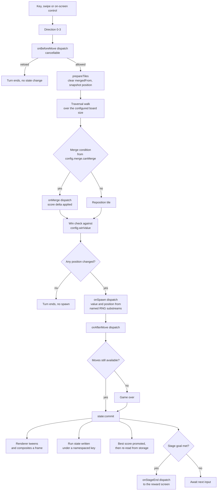
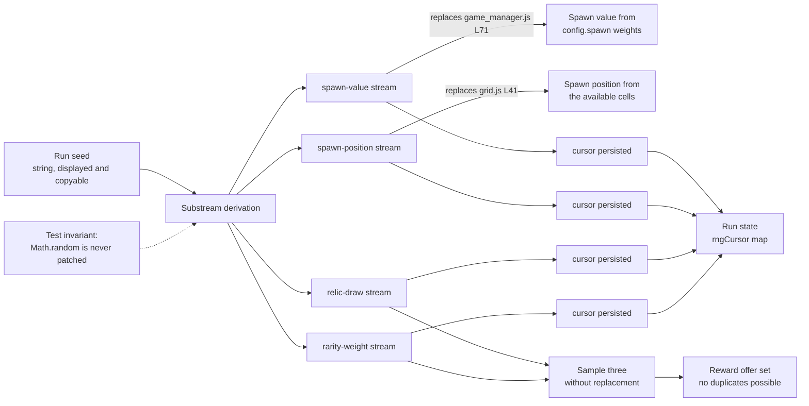

# Data Flow

Two figures live here. `Figure 4` follows one turn from a keystroke to a
composited frame and a persisted run. `Figure 7` follows the run seed, because
every random value in the game comes from it and reproducibility is a contract
rather than a nicety.

Rationale is not argued here. It lives in
[`docs/DECISION_LOG.md`](../DECISION_LOG.md), cited below by identifier.

## Contents

- [1. One turn, end to end](#1-one-turn-end-to-end)
- [2. Two behaviours preserved from the pre-migration game](#2-two-behaviours-preserved-from-the-pre-migration-game)
- [3. The seed and its substreams](#3-the-seed-and-its-substreams)
- [4. Where to look next](#4-where-to-look-next)

## 1. One turn, end to end

A turn is not "apply the move". It is a sequence with three places a relic can
intervene, two places the turn can end early, and exactly one place a tile is
spawned.

**Figure 4 — Turn Data Flow: From Keystroke to Composited Frame and Persisted Run
State.**

**Legend for Figure 4.** *Turn Data Flow: From Keystroke to Composited Frame and
Persisted Run State.* A **rectangle** is a processing step and a **diamond** is a
decision. The four hook names mark the dispatch points a relic can act on; the
remaining two hooks, `onStageStart` and `onStageEnd`, sit at the stage boundary
rather than inside a turn. Three edges are worth naming: `onBeforeMove` is the
only **cancellable** dispatch, so a relic can withdraw a move; the `Any position
changed?` diamond is the sole signal that a move occurred, ported unchanged from
the pre-migration change detector; and `state:commit` fans out to four
independent consumers, none of which the engine knows by name.

## 2. Two behaviours preserved from the pre-migration game

`Figure 4` deliberately keeps two properties that a redesign would have lost:

- **A spawn happens only when a position actually changed.** The `MOVED` diamond
  gates the spawn, exactly as the pre-migration `moved` flag did, so a move into
  a wall costs nothing and adds no tile.
- **The displayed best score is re-read from storage after the write.** The
  promotion writes, then reads back, so the value on screen always equals the
  value persisted rather than a cached copy of what was intended.

The merge dispatch also fires **once per merge**, so a move that resolves two
merges dispatches `onMerge` twice and a relic bound to it fires twice.

## 3. The seed and its substreams

A run has one seed. If every consumer drew from a single stream, adding one relic
that draws once would shift every later draw, and a snapshot recorded before that
relic existed would stop reproducing. Substreams make each concern's sequence
independent, so relic composition cannot perturb spawn reproducibility.

**Figure 7 — Seeded Determinism: One Run Seed Fanned into Named RNG Substreams.**

**Legend for Figure 7.** *Seeded Determinism: One Run Seed Fanned into Named RNG
Substreams.* A **solid arrow** is a derivation or a consumption. A **labelled
arrow** into `SPAWNV` or `SPAWNP` names the exact pre-migration call site that
substream replaced — those two were the **only** `Math.random()` sites in the
retired tree, which is what made the substitution exhaustive rather than a
search. The **dotted arrow** is an enforced test invariant, not a runtime
dependency: the generator is always a local instance and is never installed onto
`Math.random`, and a unit test asserts it. Persisting each **cursor** is what
keeps a *resumed* run deterministic; without it a reload would silently restart
each sequence.

## 4. Where to look next

- [`hook-dispatch-sequence.md`](hook-dispatch-sequence.md) — `Figure 5`, what
  happens inside each dispatch box of `Figure 4`.
- [`ARCHITECTURE.md`](ARCHITECTURE.md) — `Figure 1` and `Figure 2`, the modules
  these values flow through.
- [`component-interaction.md`](component-interaction.md) — `Figure 6b`, the
  screen states a committed turn can move the flow into.
- [`../CONFIGURATION.md`](../CONFIGURATION.md) — the `spawn`, `merge` and
  `winValue` fields `Figure 4` reads.
