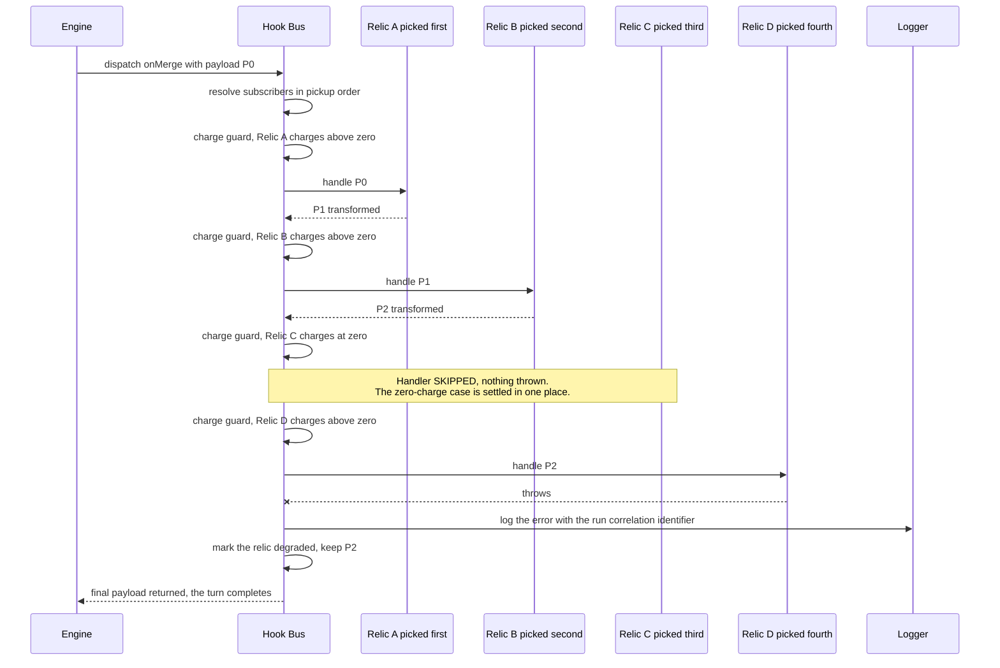
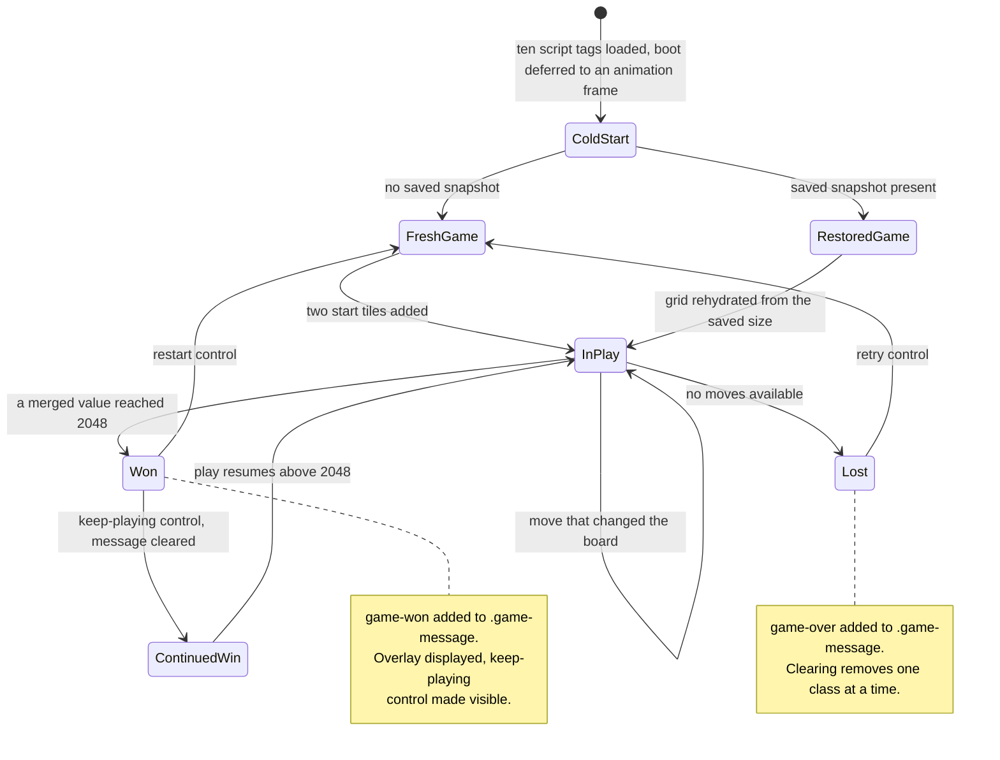
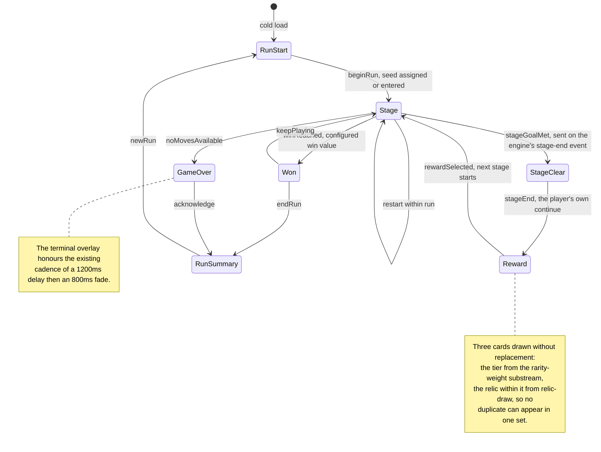

# Hook Dispatch Sequence, and the Screen Flow

This document carries **three figures across two topics**.

**Part one** is the hook bus: one dispatch, drawn as a sequence, showing how a
payload reaches every relic bound to a hook and what the board looks like
afterwards whatever those handlers did — including throwing.

**Part two** is the screen flow: the seven class-toggled board states the
pre-migration product had, and the declared state machine that replaces them.
The screen flow is a separate subject, co-located here by the documentation
plan because the `onStageEnd` dispatch of part one is what leads into it.

Nothing here argues **why**. Rationale lives in
[`../DECISION_LOG.md`](../DECISION_LOG.md) and is cited below by identifier,
which is the split `DL-DOC-05` sets: a document states what happens and names
the decision, and the log carries the alternatives, the reasoning and the
risks.

**Figure numbering.** The bare numerals `1` through `8` are one sequence shared
across `docs/architecture/` and
[`docs/TRACEABILITY_MATRIX.md`](../TRACEABILITY_MATRIX.md), so a reference by
name resolves to exactly one figure. Figure 5 and Figure 6 are here, together
with Figure 6a, the before half Figure 6 is published with.

## Contents

Part one — hook dispatch:

- [1. One dispatch, four relics](#1-one-dispatch-four-relics)
- [2. The four contracts Figure 5 proves](#2-the-four-contracts-figure-5-proves)
- [3. The dispatch surface](#3-the-dispatch-surface)

Part two — screen flow:

- [4. The screen model as it was](#4-the-screen-model-as-it-was)
- [5. The screen flow as it is](#5-the-screen-flow-as-it-is)
- [6. Why both figures are published](#6-why-both-figures-are-published)

Both parts:

- [7. Related figures](#7-related-figures)

---

# Part one — hook dispatch

## 1. One dispatch, four relics

The bus resolves the subscribers bound to a hook in **pickup order**, hands the
first one the payload the engine dispatched, and hands every subsequent one the
payload the handler before it returned.

**Figure 5 — Hook Dispatch Sequence: Pickup-Order Fan-Out with Charge Guard
and Error Isolation.**

**Legend.** *Figure 5 — Hook Dispatch Sequence: Pickup-Order Fan-Out with
Charge Guard and Error Isolation.* A **solid arrow** is a synchronous call. A
**dashed arrow** is a return value. The **crossed arrow** is a thrown error,
isolated by the bus. A **self-call** on the Hook Bus lane is bookkeeping the
bus performs before it decides whether to invoke a handler at all. The **note**
spanning the Hook Bus and Relic C marks a handler that is never entered: the
guard resolves before invocation, so no arrow reaches that lane. The **Logger**
lane is where an isolated error is reported.

**On the participant set.** Figure 5 declares **four** relic lanes where the
plan this work implements drafted two while its step list named three, leaving
one dispatch without a lane of its own. The set was expanded so that pickup
order, compounding, the charge skip and the error isolation are each separately
observable rather than sharing a lane. The correction follows the practice
`DL-DOC-04` records in [`../DECISION_LOG.md`](../DECISION_LOG.md): where the
plan and the checkout disagree, the documentation carries the verified form and
the divergence is recorded rather than applied silently.

**The before state.** Figure 5 is a to-be view, and it has no as-is analogue at
this granularity: the pre-migration bus had no ordering contract, no concept of
a charge, no error isolation and no compounding. Its before state is therefore
**Figure 1 — As-Is Architecture: Layered Globals with a Push-Based Actuator**,
in [`ARCHITECTURE.md`](ARCHITECTURE.md#1-the-architecture-as-it-was), which
shows the three-name publish and subscribe bus this one extends. **Rule 2**'s
both-states obligation is discharged for this architecture by that Figure 1 and
Figure 2 pair, so no fourth figure is drawn here. That earlier bus appended
callbacks to an array keyed by event name (`js/keyboard_input_manager.js`
L18-L23) and iterated them synchronously with no queue and no containment
(L25-L32).

## 2. The four contracts Figure 5 proves

Figure 5 is a proof rather than an illustration. Four separately stated
acceptance conditions are mechanically readable off it.

**Relics bound to the same hook all fire, in pickup order.** Relic A, Relic B
and Relic D are each entered, in the order they were picked up. Neither
replaces another and none can pre-empt another (`DL-HOOKBUS-02`).

**Effects compound.** Relic B is handed **P1**, which is Relic A's output, and
not the original P0; Relic D is handed **P2**. Each handler receives the
accumulated payload and returns a possibly transformed one, and a handler that
returns nothing leaves the payload as it stands (`DL-HOOKBUS-03`).

**A zero-charge relic is skipped rather than invoked.** Relic C is never
entered. The guard is implemented **once, in the bus**, rather than sixteen
times in handlers, so no relic handler duplicates it and a zero-charge
invocation can neither throw nor corrupt run state (`DL-HOOKBUS-01`).

**A throwing handler is isolated.** Relic D throws. The error is caught,
reported with the run correlation identifier, its subscriber is marked
**degraded**, the accumulated payload P2 is preserved, and **the turn
completes** (`DL-HOOKBUS-04`). Without this, one throwing relic would abort a
turn mid-move and could leave the board inconsistent.

The bus reports through an **injected reporter** rather than importing the
observability layer, so the dependency runs one way only: nothing under
`src/engine/` names an observability module. The correlation identifier's
derivation, the span names, the metric names and the six health checks belong
to [`../OBSERVABILITY.md`](../OBSERVABILITY.md#31-correlation-identifiers) and
are not restated here.

## 3. The dispatch surface

- The six hook names, spelled exactly: `onStageStart`, `onBeforeMove`,
  `onMerge`, `onSpawn`, `onAfterMove`, `onStageEnd`. There is no seventh
  (`DL-HOOK-01`).
- Pickup order is **monotonic and never renumbered**, and it is owned by the
  relic registry rather than inferred from registration order. It advances only
  on an accepted pickup, so removing a relic renumbers nothing, and a renderer
  or a screen subscribing later cannot reorder a relic (`DL-HOOKBUS-02`).
- A relic is **one** registration carrying its whole handler table, **one**
  mutable charge pool and **one** `state` slot. All of its hook bindings
  therefore share that pool and that slot, and a relic that binds two hooks
  cannot spend a charge twice in one turn by accident (`DL-REGISTRY-02`).
- Because **hook dispatch order determines RNG consumption order**,
  deterministic dispatch order is itself part of the reproducibility contract.
  **Figure 7 — Seeded Determinism: One Run Seed Fanned into Named RNG
  Substreams**, in
  [`data-flow.md`](data-flow.md#3-the-seed-and-its-substreams), is the
  substream view; it is not redrawn here.
- The bus surface is `register(subscription)`, `unregister(id)` and
  `dispatch(name, payload, environment)`, plus a per-hook and per-subscriber
  **dispatch-count snapshot accessor**. The metrics layer and the diagnostics
  overlay read that snapshot, which is what lets them count dispatches with no
  engine-to-observability import.
- **No engine code branches on any individual relic identifier.** The registry
  is the only construct that knows a relic exists (`DL-REGISTRY-01`).
- The relic catalogue — sixteen relics across four families, with their
  identifiers, rarities, bound hooks and charge counts, and which five are
  charge-based — belongs to [`../RELICS.md`](../RELICS.md). No individual
  relic identifier is named in this document.

---

# Part two — screen flow

Part two is a different subject from part one. It is carried here because the
bus mechanism Figure 5 draws — pickup-order fan-out, the charge guard, the
compounding return and the error isolation, drawn there for one `onMerge`
dispatch — is the same mechanism the `onStageEnd` dispatch runs through, and that
dispatch is what closes a cleared stage and hands the screen flow below its first
event. The two are therefore read together.

`onStageEnd` also closes a stage that did **not** clear. A run that is lost or
ended resolves the stage it was on with `cleared: false` before it summarises
(`DL-RUNCTL-30`), and Figure 6 shows where that lands: the `GameOver` and
`RunSummary` states, not `Reward`. The reward edge is guarded on the flag, so
the two outcomes share one dispatch and one event.

## 4. The screen model as it was

The pre-migration product had **one screen**. Seven board states were produced
on that single markup tree by toggling CSS classes, and nothing declared which
transitions between them were legal.

**Figure 6a — As-Is Screen Model: One Screen with Seven CSS-Class-Governed
Board States.**

**Legend.** *Figure 6a — As-Is Screen Model: One Screen with Seven
CSS-Class-Governed Board States.* Each node is a **board state of the single
existing screen**, not a state of any machine. Each labelled transition is the
event that caused it. The two **notes** record the CSS class mechanism that
governed each terminal state.

Figure 6a asserts only what the pre-migration checkout verifiably did:

- `.game-message` is `display: none` by default (`style/main.scss` L197) and
  becomes displayed **only** through the `&.game-won, &.game-over` selector
  (L246-L248). `.game-won` additionally swaps the overlay background and
  reveals the keep-playing control, which is otherwise `display: none`
  (L229-L244). Win, loss and continued win were therefore distinguished purely
  by **two CSS class toggles**.
- Those toggles were written by the actuator. `message()` added `game-won` or
  `game-over` and wrote the verdict into the overlay's first `
`
  (`js/html_actuator.js` L127-L133); `clearMessage()` removed one class at a
  time (L135-L139, with the in-file note that IE takes only one value at a
  time).
- The overlay cadence was `fade-in` **800 ms** `ease` after a **1200 ms** delay
  (`style/main.scss` L234, where the delay is `$transition-speed * 12` and
  `$transition-speed` is `100ms` at L22), with fill mode `both`.
- **There was no router, no hash handling and no History API usage anywhere.** A
  grep of the pre-migration tree returns zero matches for `location.hash`,
  `history.pushState`, `popstate`, `pushState` or `replaceState` across every
  `.js`, `.html` and `.scss` file. That absence is the whole reason a before
  half is needed: there was no navigation model for Figure 6 to be compared
  against, only class toggles.
- The three controls were bare `<a>` elements with no `href` — restart at
  `index.html` L31, keep-playing at L38 and retry at L39 — which is why they
  were unreachable by keyboard.

## 5. The screen flow as it is

Figure 6 is the product's **first navigation model of any kind**, superseding
the seven-state class-toggle model of Figure 6a.

**Figure 6 — Screen Flow State Machine: Run Start to Run Summary.**

**Legend.** *Figure 6 — Screen Flow State Machine: Run Start to Run Summary.*
Each node is a **screen or board state**. Each transition is labelled with the
**`ROUTER_TRIGGERS` member that takes it**, which is the name a caller passes to
`send()`, and the two self-transitions on `Stage` are two distinct triggers that
leave the state unchanged. Two labels name where the trigger comes from, because
those two are the ones a reader most often merges into one step: the engine's
`stage:end` lifecycle event is what the composition root turns into
`stageGoalMet`, and `stageEnd` is the **player's** continue action from the stage
clear screen. The two **notes** carry constraints inherited from the existing
system.

### 5.1 Figure 6 is normative for the transition table

Figure 6 is the specification for the `TRANSITIONS` table declared in
`src/ui/screen-router.ts`. Its state labels correspond **one to one** with that
module's `SCREEN_NAMES` members:

| Figure 6 label | `SCREEN_NAMES` member |
|---|---|
| RunStart | `runStart` |
| Stage | `stage` |
| StageClear | `stageClear` |
| Reward | `reward` |
| Won | `won` |
| GameOver | `gameOver` |
| RunSummary | `runSummary` |

The table was checked against the figure at this commit and **agrees with it
exactly**: twelve state-keyed edges plus the cold load, matching Figure 6's
thirteen transitions, with both `Stage` self-edges present. Every edge label is a
member of `ROUTER_TRIGGERS`, and each resolves through `TRANSITIONS` to the
target the figure draws. A state name or a trigger name that drifts from this
figure is a code defect, not a documentation one.

Two of those triggers are raised for the same stage clearing, one step apart, and
conflating them is the misreading this figure exists to prevent. The engine emits
`stage:end` when a met goal is resolved; the composition root turns that into
`stageGoalMet`, which takes `stage` to `stageClear`. The reward offer then waits
on the player: the continue control on the stage-clear screen raises `stageEnd`,
which is the only trigger `stageClear` declares, and that is the edge into
`reward`. A run resumed from storage with an unresolved offer is taken to
`stageClear` for the same reason, so it reaches its offer through the same two
edges a played run does (`DL-MAIN-13`).

### 5.2 What the machine changes

- The screen router is an **explicit state machine**, not ad-hoc show and hide.
  It subsumes the retained `.game-message` overlay, so win, continued win, loss
  and stage clear all resolve through one machine rather than through the two
  class toggles of Figure 6a.
- A trigger the state in force does not declare **takes no edge**: it is
  reported and the state stands, so there is no imperative way to put a state
  on screen (`DL-ROUTER-04`).
- Three names exist for one concept and must not be conflated. The engine's
  in-class flag is **`continuedPlay`**, its continue-after-win **method** is
  **`continuePlaying()`**, and both the **input event name** and the
  **persisted property name** remain the frozen **`keepPlaying`**
  (`DL-ENGINE-04`). The Won to Stage transition is driven by the frozen input
  event name.
- The z-index ladder is extended upward rather than renumbered: the existing
  `1 / 2 / 10 / 20 / 100` gains HUD 200, screen overlays 300, modal and reward
  400, and the diagnostics overlay 500.
- The stage goal is config-driven, **measured** on `move:after` and again as the
  commit slice is assembled, and **cleared by a second evaluation the engine runs
  after that commit** — the tail of a turn that changed the board is `commit()`
  then `resolveMetStageGoal()`. A met goal is resolved through `endStage()`, which
  dispatches `onStageEnd`, emits `stage:end` and commits again (`DL-ENGINE-07`,
  `DL-STAGE-02`). Its schema is the subject of
  [`../CONFIGURATION.md`](../CONFIGURATION.md#4-the-stage-configuration), whose
  [4.5](../CONFIGURATION.md#45-the-evaluation-lifecycle) is the authority for the
  order of the nine steps.
- The reward draw's three cards are sampled without replacement across **two**
  substreams — the rarity tier from `rarity-weight`, the relic within that tier
  from `relic-draw` — which is what makes the no-duplicate rule structural rather
  than a retry loop (`DL-DRAW-01`, `DL-DRAW-02`).
- The canvas is `aria-hidden` and semantics arrive through a parallel focusable
  DOM layer with a live region; **Figure 3 — Component Interaction: Input,
  Engine, Hook Bus, Relics, Renderer, Persistence**, in
  [`component-interaction.md`](component-interaction.md), shows that layer
  beside the canvas and is not redrawn here.

## 6. Why both figures are published

**Rule 2** of this project's governing rules, Visual Architecture
Documentation, requires that where a deliverable modifies an existing
architecture, **both states be shown, never the target state alone**. Figure 6
depicts a screen model that supersedes an existing one rather than adding to a
blank page: the single class-toggled screen of Figure 6a is replaced by a
declared machine, and its two class toggles are replaced by transitions a table
either declares or refuses.

Figure 6a and Figure 6 are therefore a **mandatory pair**. Neither is published
alone, neither is removed without the other, and a change that adds or removes
a state in one is incomplete until the other shows what became of it. Read
together they answer one question — what states can the player be in, and what
moves between them — in the before state and in the after state. Read apart,
Figure 6 would claim a first navigation model without showing what there was
instead, and Figure 6a would document a screen that no longer exists.

The same obligation is discharged for the module architecture by the Figure 1
and Figure 2 pair in [`ARCHITECTURE.md`](ARCHITECTURE.md), which is also the
before state Figure 5 relies on.

---

## 7. Related figures

Each document below owns its figures and is the authority on its own subject.
Nothing here restates them.

- [`ARCHITECTURE.md`](ARCHITECTURE.md) — **Figure 1 — As-Is Architecture:
  Layered Globals with a Push-Based Actuator**, the before state for Figure 5,
  and **Figure 2 — To-Be Architecture: Event-Driven Engine with Subscribed
  Renderer and Hook Bus**, where relics and the renderer become peers on this
  bus.
- [`component-interaction.md`](component-interaction.md) — **Figure 3 —
  Component Interaction: Input, Engine, Hook Bus, Relics, Renderer,
  Persistence**, the bus as one boundary among the running components.
- [`data-flow.md`](data-flow.md) — **Figure 4 — Turn Data Flow: From
  Keystroke to Composited Frame and Persisted Run State**, where each dispatch
  of Figure 5 sits inside a turn, and **Figure 7 — Seeded Determinism: One Run
  Seed Fanned into Named RNG Substreams**, the substreams named above.
- [`../TRACEABILITY_MATRIX.md`](../TRACEABILITY_MATRIX.md) — **Figure 8 —
  File Transformation Map**, and the construct-by-construct bidirectional
  mapping from each retired `js/` source to the module carrying it now. Figure
  8 is not in this folder and is not reproduced here.
- [`../RELICS.md`](../RELICS.md) — the relic catalogue: sixteen relics across
  four families, the hooks each binds, and which five carry charges.
- [`../CONFIGURATION.md`](../CONFIGURATION.md) — the rules and stage
  configuration reference, including the stage-goal schema.
- [`../OBSERVABILITY.md`](../OBSERVABILITY.md) — the observability signal
  path, the correlation-identifier derivation behind the Logger lane of Figure
  5, and the six health checks.
- [`../DECISION_LOG.md`](../DECISION_LOG.md) — all rationale, for every
  decision any of these three figures shows.
