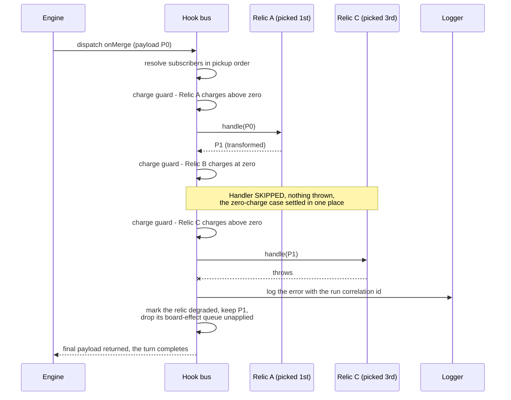

# Hook Dispatch Sequence

The hook bus is where the roguelike layer meets the rules. It has one job that
sounds trivial and is not: hand a payload to every relic bound to a hook, in a
defined order, and end up with a board that is consistent whatever those handlers
did — including throwing.

`Figure 5` is that job drawn as a sequence. It is also the mechanical proof of
three requirements at once: relics on the same hook both fire and compound, a
relic with no charges left is skipped rather than invoked, and a throwing handler
cannot take the turn down.

Rationale is not argued here. It lives in
[`docs/DECISION_LOG.md`](../DECISION_LOG.md), cited below by identifier.

## Contents

- [1. One dispatch, three relics](#1-one-dispatch-three-relics)
- [2. Why the guard lives in the bus](#2-why-the-guard-lives-in-the-bus)
- [3. What a throwing handler leaves behind](#3-what-a-throwing-handler-leaves-behind)
- [4. Where to look next](#4-where-to-look-next)

## 1. One dispatch, three relics

The bus resolves subscribers by **pickup order** — the order the player acquired
them, assigned once at pickup and never reassigned — rather than by registration
accident. Each handler receives the payload the previous one returned, so effects
chain.

**Figure 5 — Hook Dispatch Sequence: Pickup-Order Fan-Out with Charge Guard and
Error Isolation.**

**Legend for Figure 5.** *Hook Dispatch Sequence: Pickup-Order Fan-Out with Charge
Guard and Error Isolation.* A **solid arrow** is a synchronous call, a **dashed
arrow** is a return value, and the **crossed arrow** is a thrown error isolated by
the bus. A **self-call** on the bus is bookkeeping it performs before deciding
whether to invoke a handler. Relic B never appears as a participant because it is
never called: the guard resolves before invocation, which is the difference
between skipping a handler and asking it to no-op. Ordering is `DL-HOOKBUS-02`,
the compounding return protocol is `DL-HOOKBUS-03`, and the guard's placement is
`DL-HOOKBUS-01`.

## 2. Why the guard lives in the bus

Five of the sixteen relics carry a charge budget. The guard that skips a spent
relic is implemented **once, in the bus**, not sixteen times in handlers. Three
consequences follow:

- Invoking a relic with zero charges cannot throw and cannot corrupt run state,
  for every relic, without any handler containing that check.
- A charge is spent by the relic's **own effect**: a handler asks through
  `HookContext.spendCharge()`, and the bus deducts only once that handler's
  return has validated. A dispatch that reached a handler which then did nothing
  spends nothing.
- Once a budget reaches zero, **every** handler that relic binds is skipped, on
  every charge-guarded hook, so a two-hook relic cannot half-fire.

The second entry point is `RelicRegistry.activate()`, which a manual activation
reaches; both paths draw on the one budget however many hooks the relic binds.

## 3. What a throwing handler leaves behind

Nothing. That is enforced at five crossings rather than asserted, because each was
a way for a failed handler to change a run:

| Crossing | How it is protected |
|---|---|
| The payload | The handler is given its own copy, so an in-place write reaches that copy alone |
| The state slot | Copied in and copied back out, so a write at **any depth** reaches a copy |
| The charge | Requested during the handler, deducted only after its return validates |
| The board and its tiles | Reached only as a query-only facade; commands are recorded on a queue and applied only on a validated return |
| Randomness | The handler draws from forks, and the run's substreams advance only on commit, so a handler that draws and then throws perturbs no later spawn |

A relic that throws is logged with the run correlation identifier and marked
**degraded**, and `RelicRegistry.degradedIds()` is what the HUD reads to tell the
player that a relic it is still showing has stopped firing. The turn completes
with the payload as it stood before that handler.

## 4. Where to look next

- [`data-flow.md`](data-flow.md) — `Figure 4`, where each dispatch sits inside a
  turn, and `Figure 7`, the substream forks named above.
- [`component-interaction.md`](component-interaction.md) — `Figure 3`, the bus as
  one boundary among the running components.
- [`ARCHITECTURE.md`](ARCHITECTURE.md) — `Figure 2`, why relics and the renderer
  are peers on this bus.
- [`../RELICS.md`](../RELICS.md) — which five relics carry charges, and what each
  hook does.
